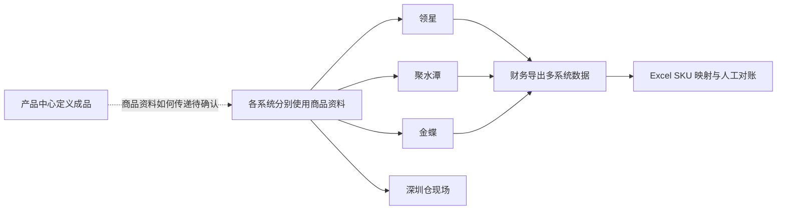

# 商品与主数据需求调研

> 文档状态：调研初稿，待业务访谈确认
> 调研时点：阶段 4 自研 ERP 立项前后（约 2020 年下半年）
> 调研范围：商品、供应商、仓库、客户、物流；本轮新增组织目标需求，辅助资料另设模块

| 版本 | 本次变化 | 状态 |
| --- | --- | --- |
| V0.1 | 根据项目背景形成案头调研初稿 | 已完成 |
| V0.2 | 确认五类主数据范围，并将商品模型收敛为成品 SKU | 已完成 |
| V0.3 | 按背景资料修正供应商和 B2B 客户量级表述，统一使用「启用/禁用」 | 已完成 |
| V0.4 | 补充商品设计确认来源及已确认范围，更新剩余调研问题 | 已完成 |
| V0.5 | 补充供应商分类等级、多条资料默认规则、付款条件与审核使用要求 | 已完成 |
| V0.6 | 补充客户分类、通用2C档案、工商信息、审核与默认规则，关联字段初稿 | 已完成 |
| V0.7 | 确认实体仓与动态逻辑仓、直连及SaaS中转、回传单据库存记账范围 | 已完成 |
| V0.8 | 简化逻辑仓自由划分，补充仓库审核、对接资料及原单库存归属规则 | 已完成 |
| V0.9 | 确认实体仓单联系人、非级联禁用及库存状态命名和选项 | 已完成 |
| V0.10 | 确认轻量物流档案、由仓库指定、自提和禁用边界，关联字段初稿 | 已完成 |
| V0.11 | 关联 B2C 库存起点及异常处理已确认规则，保留主数据设计边界 | 初稿，局部确认 |
| V0.12 | 同步价格管理结论，明确初始供应商、当前组织初始化及后续调价边界 | 初稿，局部确认 |
| V0.13 | 同步辅助资料及组织确认，关联集成和公共能力 | 需求阶段确认 |

## 一、调研范围与资料来源

本次调研要弄清五类主数据现在由谁维护、在哪些系统使用、存在哪些问题，以及自研 ERP 一期需要解决什么。商品只管理可独立采购、销售、库存和核算的成品 SKU，不建立 SPU，也不涉及原材料、BOM 和生产制造。

| 主数据 | 本次关注内容 | 主要使用业务 |
| --- | --- | --- |
| 商品 | 成品 SKU 的定义、编码、条码、单位、分类和供应来源 | 采购、库存、销售、履约归集、财务核算 |
| 供应商 | 供应商身份、联系人、结算资料和供货范围 | 采购、结算 |
| 仓库 | ERP 需要识别的仓储节点及外部仓库对应关系 | 入库、出库、库存查询 |
| 客户 | 原背景为国内代理商和企业大客户；目标范围扩展见 §四客户确认 | 销售、归集、结算 |
| 物流 | 物流商和物流服务产品 | B2B、独立站发货 |

本稿主要依据三份正式背景文档：

- [强盛科技公司业务背景信息](../../01-全局背景信息/1.强盛科技公司业务背景信息.md)
- [强盛科技 ERP 项目的背景信息](../../01-全局背景信息/2.强盛科技ERP项目的背景信息.md)
- [强盛 ERP 的定义和上下游链路](../../01-全局背景信息/3.强盛ERP的定义和上下游链路.md)

阶段 4 草稿只用于发现问题和补充调研线索；与正式背景冲突的内容不作为本期事实。当前尚未取得访谈纪要、系统截图和五类主数据样表。

本轮商品、供应商、客户、仓库及物流讨论作为目标系统的设计确认来源，结果见[商品资料字段初稿](../../04-产品设计方案/20260812-ERP项目第一版框架搭建/字段清单合集/商品资料/商品资料（初稿）.tsv)及本目录[需求分析](商品与主数据需求分析.md)；供应商及客户确认结论见下文补充。它不是立项时的访谈证据，也不是现有系统样表；下文现状描述保持原口径。字段初稿中标注待确认的项目不代表已经纳入一期。

## 二、当前角色与系统分工

### 2.1 当前业务职责

| 角色 | 已知职责 | 仍需确认 |
| --- | --- | --- |
| 产品中心 | 负责成品定义 | SKU 建档、修改和禁用的实际流程 |
| 采购部 | 负责采购下单和供应商交付协同 | 供应商档案目前由谁建立和维护 |
| 仓储物流部 | 负责深圳仓实物收发和物流协调 | 仓库、物流资料目前如何维护 |
| B2B 渠道部 | 负责代理商和企业客户业务 | 客户档案、账期和结算资料的维护方式 |
| 财务中心 | 使用多系统数据进行核算和对账 | 金蝶主数据及历史编码的维护范围 |
| 数字化中心 | 正在组建自研 ERP 项目团队 | 后续是否承担主数据规则和异常管理 |

这里仅记录现状。五类主数据未来由谁创建、复核和禁用，留到需求分析和业务确认后决定。

### 2.2 当前系统与数据流转

| 系统或载体 | 当前用途 | 与主数据有关的已知问题 |
| --- | --- | --- |
| 领星 | Amazon 运营和跨境履约 | 与其他系统的 SKU 编码不一致 |
| 聚水潭 | 天猫、京东订单履约 | 与其他系统的 SKU 编码不一致 |
| 金蝶云·星空 | 采购、B2B、简易仓储和财务核算 | 月末需要与领星、聚水潭重新做 SKU 映射 |
| 深圳仓现场 | 纸单和简易仓储记录 | 商品、仓库和条码的具体使用方式待走查 |
| Excel | SKU 映射、采购跟进和月末拼表 | 依赖人工维护，难以形成统一数据源 |

供应商、仓库、客户和物流资料目前分别存在哪里，现有材料没有说清楚，需要通过访谈和样表继续确认。

## 三、核心场景与业务问题

| 场景 | 当前情况 | 主要问题 | 证据状态 |
| --- | --- | --- | --- |
| MD-S01 商品建档与变更 | 产品中心负责成品定义，多套系统分别使用商品资料 | MD-P01：缺少统一 SKU 身份，商品变化如何同步也不清楚 | 编码不一致已确认；维护流程待调研 |
| MD-S02 供应商建档与使用 | 金蝶已承接基础采购，采购跟单仍大量依赖微信和 Excel | MD-P02：供应商档案的来源、责任人和供货关系不清楚 | 待调研 |
| MD-S03 仓库建档与使用 | 公司同时使用深圳仓、东莞电商仓、FBA 和第三方海外仓 | MD-P03：仓库编码、系统归属和 ERP 管理范围尚未统一 | 仓储网络已确认；档案规则待调研 |
| MD-S04 B2B 客户建档 | B2B 业务已在金蝶跑基础单据，实际交易经常先在线下沟通 | MD-P04：客户档案、等级、账期和结算资料如何维护不清楚 | 业务现状已确认；档案规则待调研 |
| MD-S05 物流资料使用 | 独立站订单主要靠人工协调深圳仓或海外仓发货 | MD-P05：承运商和物流方式没有统一维护口径 | 待调研 |
| MD-S06 跨系统匹配与对账 | 财务从领星、聚水潭、金蝶导出数据后用 Excel 映射 SKU | MD-P06：履约结果和财务数据不能直接按统一 SKU 归集 | 已确认 |

目前有粗略量级的数据：活跃 SKU 约 3,500 个、成品供应商 200 多家、国内 B2B 代理商和大客户 30 多家。新品、供应商、客户和物流资料的新增频次，以及各类错误实际影响多少单据，均待后续调研。

## 四、原始业务诉求

| 来源场景 | 业务诉求 | 当前判断 |
| --- | --- | --- |
| MD-S01、MD-P01 | ERP 统一维护成品 SKU，供各业务模块引用 | 一期核心诉求 |
| MD-S02、MD-P02 | 建立统一供应商档案，支撑采购和结算 | 纳入主数据中心 |
| MD-S03、MD-P03 | 建立统一仓库档案，并明确哪些仓由 ERP 管理库存 | 纳入主数据中心，库存边界待确认 |
| MD-S04、MD-P04 | 建立 B2B 客户档案，支撑销售和结算 | 纳入主数据中心 |
| MD-S05、MD-P05 | 统一维护物流商和物流服务产品 | 一期轻量建设 |
| MD-S06、MD-P06 | 商品 SKU 分发给第三方 WMS、金蝶，并支持领星、聚水潭回传结果匹配 | 纳入一期；接口细节由系统集成模块承接 |

商品采用 SKU 单层模型。不同型号、功率、容量或颜色的成品，如果需要独立采购、销售、库存或核算，就分别建立 SKU，不再向上建立 SPU。

### 本轮设计确认补充

以下为目标系统的设计结论，不改写上述原始现状：

- 商品补充品牌、型号与规格、产地、助记码、销售等级、尺寸重量和七个固定图片位；规格先集中描述，不建立复杂属性模型。字段名称使用「基本单位」「使用状态」「币别」，使用状态取启用／禁用。
- 一个 SKU 支持追加多个条码。商品开票名称、商品开票规格型号、商品税收分类编码均非必填。
- 建档时维护初始供应商、初始含税采购价、初始含税销售价及币别；初始供应商只表示初始采购价格归属。系统将相同初始采购价初始化到当前各采购组织，将相同初始销售价初始化为当前各销售组织面向所有客户的基准价。后续新增组织不补建历史商品价格，后续变价通过价格调整单处理，详见[价格管理需求分析](../06-价格管理/价格管理需求分析.md)。
- 一期不管理商品与供应商供货关系，不将其作为建档或采购选品前提。
- 库存预警、批次、序列号、保质期纳入商品配置；库存口径、阈值含义及 WMS 执行规则仍需明确。
- 保留外部商品匹配唯一 ERP SKU 的业务目标，建档后由业务人员在对应模块配置外部映射，具体页面与字段后续设计，见 INT-FR04。

### 供应商设计确认补充

- 仅管理成品供应商。分类为充电器类、数据线类、移动电源类、综合类、其他，按主要供货品类选择；不建立具体商品供货关系。
- 等级为 S 级、A 级、B 级、C 级、未评级，人工维护；评价标准后续明确，等级不决定是否允许采购。
- 联系人、地址、收款账户均支持多条，每类最多设置一个默认项；业务引用优先带入默认记录，未设置默认项时由用户选择，不自动取第一条。
- 维护默认币别、结算方式及付款条件。结算方式表示电汇、现金、支票等支付方式，不另设同义的付款方式字段；付款条件采用枚举值预留，月结及分阶段付款统一归入付款条件，暂不拆付款节点、比例明细或独立账期配置。具体枚举清单后续确定。
- 审核状态与使用状态分开：草稿提交后进入待审核，审核结果为审核通过或已驳回；已驳回资料可修改并重新提交审核。使用状态为启用／禁用，采购只能选择审核通过且启用的供应商。
- 已审核资料修改后的重审机制先预留，本轮不定义具体规则。

### 客户设计确认补充

本轮确认属于目标系统设计，不表示立项时已经存在跨境2B业务。

| 项目 | 规则 |
| --- | --- |
| 分类 | 代理商、国内电商2C客户、跨境电商2C客户、国内2B客户、跨境2B客户 |
| 等级 | S、A、B、C、未评级；人工维护，评价标准后续明确，不自动决定销售资格 |
| 通用2C档案 | 国内电商、跨境电商分别使用通用客户档案，不按消费者建档，不将消费者资料逐条追加到通用档案。独立站使用跨境电商2C通用客户；ToC仍在外部履约；库存回传按本轮仓库确认更新 |
| 多条资料 | 联系人、地址、银行信息支持多条；每类最多一个默认项，优先带入默认项；无默认项时手动选择，不自动取第一条 |
| 结算资料 | 默认币别、结算方式、枚举收款条件；结算方式表达电汇、现金、支票等，收款条件选项另定 |
| 工商信息 | 每客户仅一套，包含企业名称、纳税人识别号、注册地址、注册电话、开户银行和账号；不另设开票资料分组。与银行明细的关联及通用2C、跨境客户适用性和必填口径待确认 |
| 审核与使用 | 草稿提交后进入待审核，结果为审核通过或已驳回；驳回后修改重提。使用状态为启用／禁用，新销售业务仅使用审核通过且启用的客户 |

具体字段见[客户资料字段初稿](../../04-产品设计方案/20260812-ERP项目第一版框架搭建/字段清单合集/客户资料/客户资料（初稿）.tsv)；候选及待确认细节不视为全部定稿。

### 仓库结构与单据链路确认

仓库字段初稿见[实体仓资料](../../04-产品设计方案/20260812-ERP项目第一版框架搭建/字段清单合集/仓库资料/实体仓资料（初稿）.tsv)、[逻辑仓资料](../../04-产品设计方案/20260812-ERP项目第一版框架搭建/字段清单合集/仓库资料/逻辑仓资料（初稿）.tsv)。实体仓负责联系与对接信息，逻辑仓负责归属与库存状态；未逐项确认的补充字段已标注建议，接口细节保留待确认。

- 实体仓表示实际仓储节点，区分自营与第三方：深圳仓自营，东莞电商仓、FBA及第三方海外仓由第三方运营。
- 逻辑仓由人工自主命名和划分，每个逻辑仓关联一个实体仓，并选择库存状态（正常品、残次品、待检品）。一个实体仓可动态增加多个逻辑仓，相同库存状态也可建多个；不强制业务类型字段，不按分类组合限制数量。B2B正常品仓、电商残次品仓等仅为命名示例，逻辑仓不等于物理库位。
- 实体仓维护地址、联系人、联系电话、第三方仓库编码、第三方货主标识及对接配置；授权方式按对接系统确定，可关联授权配置。逻辑仓共用实体仓资料，不重复维护；实体仓仅维护一条联系人和联系电话，不设多联系人及默认项。
- 实体仓、逻辑仓均需草稿提交审核，审核状态与启用／禁用的使用状态分开。新增逻辑仓只能关联审核通过且启用的实体仓；实体仓禁用仅阻止新增逻辑仓引用，不影响已有逻辑仓、已有数据或其业务，不级联禁用。已有逻辑仓按自身审核状态和使用状态判断业务资格，不再校验父实体仓是否启用。
- 库存归属依据业务原单判断：能关联 ERP 原单时，沿用原单指定的逻辑仓，即使回传由仓库主动推送也不重新分配；外部发起且无 ERP 原单时，依据回传信息及配置规则判断逻辑仓。判断依据不足时不能任意选择逻辑仓记账；外部 ToC 结果的异常阻断、修复重试及完结保护见[销售与履约需求分析](../04-销售与履约/销售与履约需求分析.md) SAL-FR12，其他业务异常细节另行确认。
- 深圳自营仓由 ERP 直接对接仓库作业系统。国内电商采购单由 ERP 推送聚水潭，再由聚水潭转交第三方仓；货物实际送达第三方仓，发货由聚水潭调用仓库执行。领星采用类似的 SaaS 中转思路，具体仓库和单据对应关系由接口设计明确，不推定各仓接口完全相同。
- ERP 接收直连仓或 SaaS 回传的实际出入库结果，在对应逻辑仓记录库存增减并支持查询，覆盖自营及第三方仓；ToC 出库回传也可驱动对应逻辑仓库存减少，不再沿用“第三方／ToC仅做业财归集、不扣 ERP 库存”的旧限制。
- 采购订单下发不是实际入库，不能直接增加库存；库存以确认后的实际出入库结果为依据。外部仓期初及后续变动见[库存与仓储需求分析](../03-库存与仓储/库存与仓储需求分析.md) INV-FR02～INV-FR04，ToC 生效、异常及完结保护见[销售与履约需求分析](../04-销售与履约/销售与履约需求分析.md) SAL-FR09、SAL-FR12；具体映射、期初数量与截点、幂等实现及差异核对仍待设计，仅有部分回传单据不能保证完整库存余额。
- 本次确认不等于全量库存双向同步、跨仓统一调度或自建 WMS；ERP 不接管 ToC 抓单、打单和仓内作业。库位等仓内细节查询范围尚未确认。

### 物流设计确认补充

| 项目 | 已确认规则 |
| --- | --- |
| 对象与范围 | 物流商及其下的物流服务产品；国内快递、国内零担、国内整车、国际快递，不含跨境头程 |
| 联系信息 | 物流商仅一条联系信息，不做多联系人 |
| 状态 | 物流商及服务产品均仅维护启用／禁用，不设草稿、提交或审核；创建后启用即可使用 |
| 禁用边界 | 物流商禁用仅限制新增产品关联，已有产品按自身使用状态发货，历史数据不受影响，不级联禁用 |
| 发货选择 | 非自提发货选择具体物流服务产品，或特殊选项「由仓库指定」；后者表示未指定具体服务，下发时不传具体物流产品，由仓库决定，不创建虚拟物流商或普通产品档案。接口传空值还是省略字段待确认 |
| 自提 | 作为发货方式「自提」，不要求选择物流商及服务产品，不设置公司自送或虚拟自提物流商 |
| 执行与回传 | ERP将选择结果下发仓库；仓储系统或下游ERP／SaaS执行物流操作，回传实际物流商、服务产品、运单号及轨迹等结果。ERP一期不直连物流商下单或获取面单，实际结果记录在业务单据，不回写为通用档案选择 |
| 一期不做 | 物流商运费结算、运费计算、服务限制及自动选物流，不增加结算银行资料或物流商直连授权参数 |

字段初稿见[物流商资料](../../04-产品设计方案/20260812-ERP项目第一版框架搭建/字段清单合集/物流资料/物流商资料（初稿）.tsv)、[物流服务产品资料](../../04-产品设计方案/20260812-ERP项目第一版框架搭建/字段清单合集/物流资料/物流服务产品资料（初稿）.tsv)。补充候选字段在说明中标注建议，未预设全部必填。

辅助资料作为主数据中心独立菜单提供分类、品牌、基本单位、币别、结算方式及付款／收款条件；详见[辅助资料需求调研](../09-辅助资料/辅助资料需求调研.md)与[需求分析](../09-辅助资料/辅助资料需求分析.md)。商品分类固定三级，建档必须选满三级并引用第三级；不审核，资料启用后才可新增引用。分类禁用、调整及历史快照沿用辅助资料需求分析 AUX-FR02、AUX-FR04。

### 组织设计确认补充

组织表示公司层面的经营主体，支持单公司及多公司。金蝶是唯一创建、维护和审核来源，ERP仅主动拉取金蝶已审核组织并只读展示、引用；不提供本地新增、编辑、提交审核或启用／禁用。层级、类型、工商、联系、银行及使用状态均以金蝶为准。

单据按业务选择采购组织、销售组织、库存组织；每个逻辑仓关联一个库存组织，多组织共实体仓时分别建立逻辑仓，不混记库存。详见[组织需求调研](../10-组织/组织需求调研.md)、[组织需求分析](../10-组织/组织需求分析.md)。原五类本地维护及启停规则不套用于组织。

本轮外部映射、SKU 分发失败后的业务继续、组织归属与权限诉求，分别由系统集成、组织和公共能力分析稿承接，属于目标确认，不是现状接口证据。

## 五、需要重点确认的边界

| 场景 | 需要确认的问题 |
| --- | --- |
| SKU 或条码重复 | SKU 如何生成、能否修改；已支持多条码，条码唯一性及重复处理规则待确认 |
| 同一 SKU 对应多个平台编码 | 外部映射维护原则已确认；具体页面、字段及平台／站点／店铺识别范围留到 PRD 和接口设计 |
| 主数据禁用 | 已明确新单只引用启用档案，供应商及客户还须审核通过；历史信息保留及未完成单据处理细节待确认 |
| 仓库映射与库存依据 | 外部单据无 ERP 原单时的逻辑仓判断依据、编码映射、期初数量及完整性核对；已确认的匹配阻断及恢复规则见销售 SAL-FR12 |
| 仓库禁用 | 实体仓禁用不影响已有逻辑仓及业务；逻辑仓自身有库存或未完成单据时的禁用规则待确认 |
| 外部系统无法识别商品 | 匹配维护责任人及操作权限；外部 ToC 匹配失败须阻断，恢复规则见销售 SAL-FR12 |
| 供应商后续规则 | 审核责任人、等级评价标准及付款条件枚举清单待明确；已审核资料重审机制预留 |
| 客户后续规则 | 收款条件选项、评级标准、工商信息适用性及银行资料关联、审核责任人 |
| 价格初始化 | 已确认初始化对象和组织范围；初始价格为空、部分组织初始化失败时的阻断及恢复方式待确认，见价格管理 PRI-FR01 |
| 商品管理配置 | 预警按商品还是商品＋仓库；最低与安全库存区别；批次、序列号、保质期的采集与执行规则 |

## 六、下一轮调研清单

| 调研对象 | 重点问题 | 需要提供的资料 |
| --- | --- | --- |
| 产品中心 | SKU 如何申请、编码、修改和禁用；条码、单位、分类如何维护 | 商品表、条码表、新品建档样例 |
| 采购部 | 补齐供应商具体字段、审核责任人、等级评价标准及付款条件选项；已确认多条资料默认规则，一期不管理商品供货关系 | 供应商表、采购订单和供应商对账样例 |
| 仓储物流部 | 仓库和物流资料如何维护；库存预警口径及批次、序列号、保质期配置如何由 WMS 执行 | 仓库表、物流商表、收发货单 |
| B2B 渠道部 | 客户审核责任人、评级标准、收款条件选项及工商信息适用性；不采集消费者主档 | 客户表、销售订单样例 |
| 财务中心 | 金蝶使用哪些编码和开票资料；价目表初始化规则；历史资料是否迁移 | 金蝶档案、SKU 映射表、月末对账表 |
| 数字化中心 | 外部系统如何匹配 SKU；分发失败如何发现和处理 | 现有接口说明、失败记录或人工处理记录 |

建议先调研产品中心、财务中心和数字化中心，确定 SKU 主线；继续确认五类主数据剩余细节与辅助资料实际选项。
