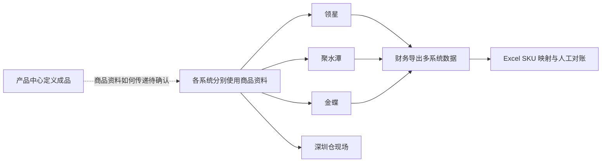

# 商品与主数据需求调研

> 文档状态：调研初稿，待业务访谈确认
> 调研时点：阶段 4 自研 ERP 立项前后（约 2020 年下半年）
> 调研范围：商品、供应商、仓库、客户、物流；本轮新增组织目标需求，辅助资料另设模块

| 版本 | 本次变化 | 状态 |
| --- | --- | --- |
| V0.1 | 根据项目背景形成案头调研初稿 | 已完成 |
| V0.2 | 确认五类主数据范围，并将商品模型收敛为成品 SKU | 已完成 |
| V0.3 | 按背景资料修正供应商和 B2B 客户量级表述，统一使用「启用/禁用」 | 已完成 |
| V0.4 | 补充商品设计确认来源及已确认范围，更新剩余调研问题 | 已完成 |
| V0.5 | 补充供应商分类等级、多条资料默认规则、付款条件与审核使用要求 | 已完成 |
| V0.6 | 补充客户分类、通用2C档案、工商信息、审核与默认规则，关联字段初稿 | 已完成 |
| V0.7 | 确认实体仓与动态逻辑仓、直连及SaaS中转、回传单据库存记账范围 | 已完成 |
| V0.8 | 简化逻辑仓自由划分，补充仓库审核、对接资料及原单库存归属规则 | 已完成 |
| V0.9 | 确认实体仓单联系人、非级联禁用及库存状态命名和选项 | 已完成 |
| V0.10 | 确认轻量物流档案、由仓库指定、自提和禁用边界，关联字段初稿 | 已完成 |
| V0.11 | 关联 B2C 库存起点及异常处理已确认规则，保留主数据设计边界 | 初稿，局部确认 |
| V0.12 | 同步价格管理结论，明确初始供应商、当前组织初始化及后续调价边界 | 初稿，局部确认 |
| V0.13 | 同步辅助资料及组织确认，关联集成和公共能力 | 需求阶段确认 |
| V0.14 | 按调研／分析分工收敛：目标设计确认统一存放分析稿，删除本稿重复段落，保留现状、诉求与证据缺口 | 需求阶段确认 |

## 一、调研范围与资料来源

本次调研要弄清五类主数据现在由谁维护、在哪些系统使用、存在哪些问题，以及自研 ERP 一期需要解决什么。商品只管理可独立采购、销售、库存和核算的成品 SKU，不建立 SPU，也不涉及原材料、BOM 和生产制造。

| 主数据 | 本次关注内容 | 主要使用业务 |
| --- | --- | --- |
| 商品 | 成品 SKU 的定义、编码、条码、单位、分类和供应来源 | 采购、库存、销售、履约归集、财务核算 |
| 供应商 | 供应商身份、联系人、结算资料和供货范围 | 采购、结算 |
| 仓库 | ERP 需要识别的仓储节点及外部仓库对应关系 | 入库、出库、库存查询 |
| 客户 | 原背景为国内代理商和企业大客户；目标范围扩展见 §四客户确认 | 销售、归集、结算 |
| 物流 | 物流商和物流服务产品 | B2B、独立站发货 |

本稿主要依据三份正式背景文档：

- [强盛科技公司业务背景信息](../../01-全局背景信息/1.强盛科技公司业务背景信息.md)
- [强盛科技 ERP 项目的背景信息](../../01-全局背景信息/2.强盛科技ERP项目的背景信息.md)
- [强盛 ERP 的定义和上下游链路](../../01-全局背景信息/3.强盛ERP的定义和上下游链路.md)

阶段 4 草稿只用于发现问题和补充调研线索；与正式背景冲突的内容不作为本期事实。当前尚未取得访谈纪要、系统截图和五类主数据样表。

本轮商品、供应商、客户、仓库及物流讨论作为目标系统的设计确认来源，目标设计确认统一记录在本目录[需求分析](商品与主数据需求分析.md)的对应功能需求，字段明细见各处字段初稿。它不是立项时的访谈证据，也不是现有系统样表；下文现状描述保持原口径。字段初稿中标注待确认的项目不代表已经纳入一期。

## 二、当前角色与系统分工

### 2.1 当前业务职责

| 角色 | 已知职责 | 仍需确认 |
| --- | --- | --- |
| 产品中心 | 负责成品定义 | SKU 建档、修改和禁用的实际流程 |
| 采购部 | 负责采购下单和供应商交付协同 | 供应商档案目前由谁建立和维护 |
| 仓储物流部 | 负责深圳仓实物收发和物流协调 | 仓库、物流资料目前如何维护 |
| B2B 渠道部 | 负责代理商和企业客户业务 | 客户档案、账期和结算资料的维护方式 |
| 财务中心 | 使用多系统数据进行核算和对账 | 金蝶主数据及历史编码的维护范围 |
| 数字化中心 | 正在组建自研 ERP 项目团队 | 后续是否承担主数据规则和异常管理 |

这里仅记录现状。五类主数据未来由谁创建、复核和禁用，留到需求分析和业务确认后决定。

### 2.2 当前系统与数据流转

| 系统或载体 | 当前用途 | 与主数据有关的已知问题 |
| --- | --- | --- |
| 领星 | Amazon 运营和跨境履约 | 与其他系统的 SKU 编码不一致 |
| 聚水潭 | 天猫、京东订单履约 | 与其他系统的 SKU 编码不一致 |
| 金蝶云·星空 | 采购、B2B、简易仓储和财务核算 | 月末需要与领星、聚水潭重新做 SKU 映射 |
| 深圳仓现场 | 纸单和简易仓储记录 | 商品、仓库和条码的具体使用方式待走查 |
| Excel | SKU 映射、采购跟进和月末拼表 | 依赖人工维护，难以形成统一数据源 |

供应商、仓库、客户和物流资料目前分别存在哪里，现有材料没有说清楚，需要通过访谈和样表继续确认。

## 三、核心场景与业务问题

| 场景 | 当前情况 | 主要问题 | 证据状态 |
| --- | --- | --- | --- |
| MD-S01 商品建档与变更 | 产品中心负责成品定义，多套系统分别使用商品资料 | MD-P01：缺少统一 SKU 身份，商品变化如何同步也不清楚 | 编码不一致已确认；维护流程待调研 |
| MD-S02 供应商建档与使用 | 金蝶已承接基础采购，采购跟单仍大量依赖微信和 Excel | MD-P02：供应商档案的来源、责任人和供货关系不清楚 | 待调研 |
| MD-S03 仓库建档与使用 | 公司同时使用深圳仓、东莞电商仓、FBA 和第三方海外仓 | MD-P03：仓库编码、系统归属和 ERP 管理范围尚未统一 | 仓储网络已确认；档案规则待调研 |
| MD-S04 B2B 客户建档 | B2B 业务已在金蝶跑基础单据，实际交易经常先在线下沟通 | MD-P04：客户档案、等级、账期和结算资料如何维护不清楚 | 业务现状已确认；档案规则待调研 |
| MD-S05 物流资料使用 | 独立站订单主要靠人工协调深圳仓或海外仓发货 | MD-P05：承运商和物流方式没有统一维护口径 | 待调研 |
| MD-S06 跨系统匹配与对账 | 财务从领星、聚水潭、金蝶导出数据后用 Excel 映射 SKU | MD-P06：履约结果和财务数据不能直接按统一 SKU 归集 | 已确认 |

目前有粗略量级的数据：活跃 SKU 约 3,500 个、成品供应商 200 多家、国内 B2B 代理商和大客户 30 多家。新品、供应商、客户和物流资料的新增频次，以及各类错误实际影响多少单据，均待后续调研。

## 四、原始业务诉求

| 来源场景 | 业务诉求 | 当前判断 |
| --- | --- | --- |
| MD-S01、MD-P01 | ERP 统一维护成品 SKU，供各业务模块引用 | 一期核心诉求 |
| MD-S02、MD-P02 | 建立统一供应商档案，支撑采购和结算 | 纳入主数据中心 |
| MD-S03、MD-P03 | 建立统一仓库档案，并明确哪些仓由 ERP 管理库存 | 纳入主数据中心，库存边界待确认 |
| MD-S04、MD-P04 | 建立 B2B 客户档案，支撑销售和结算 | 纳入主数据中心 |
| MD-S05、MD-P05 | 统一维护物流商和物流服务产品 | 一期轻量建设 |
| MD-S06、MD-P06 | 商品 SKU 分发给第三方 WMS、金蝶，并支持领星、聚水潭回传结果匹配 | 纳入一期；接口细节由系统集成模块承接 |

本轮商品、供应商、客户、仓库、物流及组织的目标设计确认，统一记录在[需求分析](商品与主数据需求分析.md)的对应功能需求（MD-FR01～MD-FR10 及各处设计确认小节），本稿不再复述，避免同一结论两处维护。

本轮外部映射、SKU 分发失败后的业务继续、组织归属与权限诉求，分别由系统集成、组织和公共能力分析稿承接，属于目标确认，不是现状接口证据。

## 五、需要重点确认的边界

| 场景 | 需要确认的问题 |
| --- | --- |
| SKU 或条码重复 | SKU 如何生成、能否修改；已支持多条码，条码唯一性及重复处理规则待确认 |
| 同一 SKU 对应多个平台编码 | 外部映射维护原则已确认；具体页面、字段及平台／站点／店铺识别范围留到 PRD 和接口设计 |
| 主数据禁用 | 已明确新单只引用启用档案，供应商及客户还须审核通过；历史信息保留及未完成单据处理细节待确认 |
| 仓库映射与库存依据 | 外部单据无 ERP 原单时的逻辑仓判断依据、编码映射、期初数量及完整性核对；已确认的匹配阻断及恢复规则见销售 SAL-FR12 |
| 仓库禁用 | 实体仓禁用不影响已有逻辑仓及业务；逻辑仓自身有库存或未完成单据时的禁用规则待确认 |
| 外部系统无法识别商品 | 匹配维护责任人及操作权限；外部 ToC 匹配失败须阻断，恢复规则见销售 SAL-FR12 |
| 供应商后续规则 | 审核责任人、等级评价标准及付款条件枚举清单待明确；已审核资料重审机制预留 |
| 客户后续规则 | 收款条件选项、评级标准、工商信息适用性及银行资料关联、审核责任人 |
| 价格初始化 | 已确认初始化对象和组织范围；初始价格为空、部分组织初始化失败时的阻断及恢复方式待确认，见价格管理 PRI-FR01 |
| 商品管理配置 | 预警按商品还是商品＋仓库；最低与安全库存区别；批次、序列号、保质期的采集与执行规则 |

## 六、下一轮调研清单

| 调研对象 | 重点问题 | 需要提供的资料 |
| --- | --- | --- |
| 产品中心 | SKU 如何申请、编码、修改和禁用；条码、单位、分类如何维护 | 商品表、条码表、新品建档样例 |
| 采购部 | 补齐供应商具体字段、审核责任人、等级评价标准及付款条件选项；已确认多条资料默认规则，一期不管理商品供货关系 | 供应商表、采购订单和供应商对账样例 |
| 仓储物流部 | 仓库和物流资料如何维护；库存预警口径及批次、序列号、保质期配置如何由 WMS 执行 | 仓库表、物流商表、收发货单 |
| B2B 渠道部 | 客户审核责任人、评级标准、收款条件选项及工商信息适用性；不采集消费者主档 | 客户表、销售订单样例 |
| 财务中心 | 金蝶使用哪些编码和开票资料；价目表初始化规则；历史资料是否迁移 | 金蝶档案、SKU 映射表、月末对账表 |
| 数字化中心 | 外部系统如何匹配 SKU；分发失败如何发现和处理 | 现有接口说明、失败记录或人工处理记录 |

建议先调研产品中心、财务中心和数字化中心，确定 SKU 主线；继续确认五类主数据剩余细节与辅助资料实际选项。
