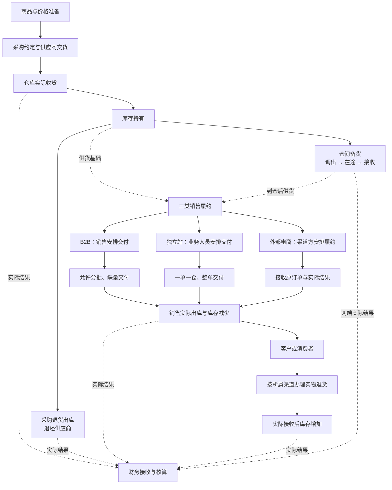

# 强盛科技一期业务蓝图

本文说明一期业务覆盖哪些域、域之间怎么交接、有哪些参与方，以及跨域的公共概念和当前还没收口的问题。

> 版本：V0.11｜编写日期：2026-09-20｜状态：业务设计初稿，待走查。
> 本文依据已确认需求整理目标业务，不新增业务决策。强盛科技为课程虚拟企业；文中的目标流程不代表已经运行或完成接口验证。

输入来源：[强盛科技公司业务背景信息](../01-全局背景信息/1.强盛科技公司业务背景信息.md)、[强盛科技ERP项目的背景信息](../01-全局背景信息/2.强盛科技ERP项目的背景信息.md)、[强盛ERP的定义和上下游链路](../01-全局背景信息/3.强盛ERP的定义和上下游链路.md)、[强盛ERP全局业务规则与约束](../01-全局背景信息/4.强盛ERP全局业务规则与约束.md)，以及下文引用的各模块需求分析。本文只讲全局关系，每个域具体怎么运行，放在对应域的正文里。

## 一、业务全景与本期范围

强盛科技经营充电器、数据线、移动电源等成品：产品人员完成商品定义和寻源，采购向供应商取得成品，仓库接收和保管，再通过国内B2B、国内电商、Amazon FBA和Shopify独立站销售。不同渠道用不同的仓储节点，跨仓备货和消费者销售是两种业务。

立项时，采购跟单、跨仓库存和业财归集依靠多套系统、Excel和线下沟通。本期目标是让采购安排、仓库实际执行、销售交付和库存变化相互对得上，并把实际业务结果交给财务。需求里列出的“现状问题”不会都变成本期功能：比如B2B现在会临时改量改价，但本期已经确认，审核后的交易约定不改量、也不改价。

**本文覆盖供应链履约及其财务交接，不把出入库结束等同于结算、收付款完成。** 生产制造、仓内作业细节和完整财务核算不在这一层展开。完整一期范围以项目背景和各模块需求分析为准。

### 业务关系图

实线表示业务衔接，虚线标注供货基础或实际结果交接。三类销售由不同参与方安排，外部电商只接收已经发生的结果；归集仍然要经过校验。备货在途不等于可以立即销售的在库量。销售退货要实际接收后才增加库存，仅退款不走这条路径；其他库存变动见《库存与仓储业务设计》，财务接收范围见第六节。

## 二、业务域地图

一期业务分七个域。域之间只通过交接关系相连，规则各写一处，不互相复制。

| 业务域 | 回答什么 | 正文 | 状态 |
| --- | --- | --- | --- |
| 采购 | 向谁订了什么、安排多少、实际到了多少、哪些继续、哪些终止，退货怎么办 | [采购业务设计](01-采购业务设计.md) | 已有 |
| 销售与履约 | B2B、独立站、外部电商各自怎么接单、交付、退货，实际结果怎么归集 | [销售与履约业务设计](02-销售与履约业务设计.md) | 已有 |
| 库存与仓储 | 商品归谁、在哪里、有多少可用，收发和转移怎么改变库存，差异怎么处理 | [库存与仓储业务设计](03-库存与仓储业务设计.md) | 已有 |
| 价格 | 初始价格怎么生成、调价怎么审核、业务单据怎么取价和保留本单价格 | [价格业务设计](04-价格业务设计.md) | 已有 |
| 主数据准备 | 商品、供应商、客户、仓库、物流、辅助资料的建档与启用 | [主数据准备](05-主数据准备.md) | 已有 |
| 结算与业财交接 | 七类实际结果怎么交给财务，失败和更正的责任怎么分 | [结算与业财交接](06-结算与业财交接.md) | 已有 |
| 集成协作与人工补充 | ERP和外部履约方怎么分工，拿不到结果时谁来确认 | [集成协作与人工补充](07-集成协作与人工补充.md) | 已有 |

阅读顺序和文件编号不是一回事。建议按这个次序读：主数据准备（05）→ 价格业务设计（04）→ 采购业务设计（01）→ 销售与履约业务设计（02）→ 库存与仓储业务设计（03）→ 结算与业财交接（06）→ 集成协作与人工补充（07）。下面的域表按文件编号排，方便找文件。参与方和链路表只讲跨域关系，域内细节看对应正文。

## 三、参与方与业务域的关系

| 参与方 | 本期业务职责 | 参与哪些域 | 交给下一方的内容 |
| --- | --- | --- | --- |
| 商品开发与管理人员 | 定义成品SKU，完成寻源，准备初始价格 | 主数据准备、价格 | 可识别的商品及初始采购、销售价格 |
| 采购部门／采购员 | 人工测算采购量，确定供应商，跟进交期、交货与退货 | 采购、价格 | 供货约定、收货安排、退货安排 |
| 供应商 | 线下确认订单、反馈发货及延期 | 采购 | 实际交货与供货反馈，由采购代录 |
| B2B销售及销售负责人 | 线下成交、记录约定、审核并安排交付或退货 | 销售与履约、价格 | 已确认的交易与仓库执行要求 |
| 独立站业务人员 | 处理已付款订单，确认仓库物流，协调整单交付及取消 | 销售与履约 | 发货安排与消费者处理结果 |
| 渠道业务与渠道履约方 | 负责外部电商的正向及售后履约 | 销售与履约、集成协作与人工补充 | 原订单及实际出入库结果 |
| 仓库作业方 | 收货、发货、盘点、品质调整，确认实际执行情况 | 采购、销售与履约、库存与仓储 | 实际数量、执行结束、取消及物流等结果 |
| 仓储运营及库存使用人员 | 查看库存、核对差异、使用调拨及其他收发能力 | 库存与仓储 | 库存使用依据与差异处理需求；具体处理权限仍待细化 |
| 财务 | 接收实际业务结果，办理核算、收付款及平台结算 | 结算与业财交接、销售与履约、库存与仓储、采购 | 财务账务结果；本期不在ERP重建财务台账 |

这张表表达业务分工，不按公司组织树直接生成审批节点。一期不指定审核岗位，有审核权限即可，允许自己审自己。冻结解冻一期由仓储运营手工办理，不做异常自动冻结。通用权限原则见[公共能力与系统管理需求分析](../02-需求调研和分析/08-公共能力与系统管理/公共能力与系统管理需求分析.md) COM-FR01、COM-FR02：有相应权限才能提交或审核，允许本人审核自己创建的数据，导入不绕过对象原有的审核要求。

## 四、主要业务链路及交接

| 链路 | 业务怎么运行 | 关键交接边界 | 详细设计 |
| --- | --- | --- | --- |
| 成品采购 | 人工测算 → 采购约定确认 → 供应商反馈交货 → 通知仓库 → 实际收货 | 采购安排不等于库存；按实收结果增加库存 | [采购业务设计](01-采购业务设计.md) |
| 采购退货 | 确认退货 → 安排退货出库 → 仓库实际发出 → 退还供应商 | 退货不恢复原采购的补货额度；补货另行采购 | 同上 |
| B2B销售 | 线下成交 → 审核并预留库存 → 按客户要求一次或分批交付 | 缺量可以继续安排；自提也要有交付依据 | [销售与履约业务设计](02-销售与履约业务设计.md) |
| Shopify独立站 | 已付款订单 → 人工确认仓库物流 → 审核预留 → 整单交付 → 反馈物流结果 | 一单一仓，不拆单、不缺量发货 | 同上 |
| 外部电商销售 | 渠道接单及履约 → 保留原订单与实际结果 → 归集库存及财务结果 | 归集不再次触发履约、不事后补做订单预占 | 同上 |
| 销售退货 | 按所属渠道办理实物退货 → 仓库接收 → 库存增加 | 仅退款没有实物变化；ERP主动办理的补发另建销售订单 | 同上 |
| 仓间备货 | 调出安排 → 实际发出 → 在途 → 实际接收 | 按实际发出量安排接收；少收差异继续留在在途 | [库存与仓储业务设计](03-库存与仓储业务设计.md) |
| 品质调整及其他收发 | 确认调整或收发原因 → 品质调整在ERP内一减一增，或由仓库完成回传；其他收发由仓库执行 → 记录库存变化 | 品质转仓与盘盈盘亏分别处理；仓库已完成的结果不补造事前申请 | 同上 |
| 财务交接 | 已确认的实际结果 → 逐单交给财务核算 | 传递失败不改变已经生效的库存；也不代表收付款完成 | 本文第六节及业财分析 |

“终止继续安排”和“撤回已经交给仓库的执行要求”不是一回事。采购和B2B关闭后，已经发出的通知仍然可以执行；销售取消涉及仓库时要等仓库确认。各域的结束条件和剩余数量处理，以各自文档为准。

## 五、公共业务对象与业务准备

### 5.1 统一业务语言

| 概念 | 本项目含义及边界 |
| --- | --- |
| 主体 | 公司本身，本期只有一个；ERP不建组织档案，结果单也不携带主体信息 |
| 成品SKU | 可独立采购、销售、库存和核算的成品规格；不建立SPU，也不建生产物料体系 |
| 实体仓 | 实际仓储节点 |
| 逻辑仓 | 在实体仓下划分的库存管理归属；不是物理库位 |
| 库存状态 | 正常品、残次品、待检品；同一库存状态可以有多个逻辑仓，一期不据此自动限制出库用途 |
| 即时／预占／冻结／可用库存 | 即时是库存账数量；预占和冻结限制使用，可用＝即时－预占－冻结。具体变化见《库存与仓储业务设计》 |
| 业务安排、执行通知、实际结果 | 分别表达要办什么、交给仓库办什么、实际办成多少；外部已经完成的业务不一定补齐全部层次 |
| 当前价格与本单成交价格 | 当前价格服务新业务取价；已保存的业务保留自己的价格，不被后续调价悄悄改掉 |
| 通用2C客户 | 国内电商和跨境电商分别归集，独立站使用跨境通用客户；不按消费者逐一建立客户档案 |
| 容易混用的几组词 | 关闭≠取消（停新增vs整单终止）；当前价≠本单价格（价目表vs单据快照）；审核≠启用（确认过vs现在还在用）；预占≠可下推（已锁定的库存vs还能下推的数量） |

依据：[商品与主数据需求分析](../02-需求调研和分析/01-商品与主数据/商品与主数据需求分析.md) §一及确认补充、[库存与仓储需求分析](../02-需求调研和分析/03-库存与仓储/库存与仓储需求分析.md) INV-FR01、INV-FR05。

### 5.2 业务开展前的准备与后续变价

1. 建立商品、供应商、客户、仓库和物流等所需资料。供应商、客户要审核通过并启用；不同档案的使用资格分别遵循主数据规则，不套用统一的禁用机制。
2. 商品建档时生成初始采购价和面向所有客户的销售基准价。初始供应商只表示初始采购价格的归属，不限制后续向谁采购。
3. 后续采购价和销售价分别由对应业务人员提出调整，由本业务线有权人员审核。确认后立即更新当前价格；错误通过新的调整纠正，保留前后依据，不回改已经审核的调价记录。财务不是默认的价格审核方。
4. 新单没有匹配价格时，允许按已确认的规则手填。这不等于把价目表变成商品供货资格清单。

分类、品牌、基本单位、币别、结算方式及收付款条件由辅助资料提供。条件选项只表达约定，不自动生成付款节点或到期日；具体资料值由后续初始化或日常维护补充。

依据：[价格管理需求分析](../02-需求调研和分析/06-价格管理/价格管理需求分析.md) PRI-FR01～PRI-FR08、[辅助资料需求分析](../02-需求调研和分析/09-辅助资料/辅助资料需求分析.md) AUX-FR02～AUX-FR04。价目按基本单位计价；一期不做单位换算和阶梯价；初始价格允许为空；价税精度已确认；一期不做价目禁用，错价用新调整单覆盖。

## 六、财务交接与外部协作边界

采购、销售和库存各自对实际业务结果负责，财务接收已经确认的结果继续核算。目前约定进入金蝶的只有七类已审核结果：采购入库、采退出库、销售出库、销退入库、其他入库、其他出库、直接调拨。逐单传递，不按日期、客户或店铺汇总，不增加财务二次审核。分步式调拨两端的实际结果分别传递，调拨计划本身不传。

采购和销售的结果保留来源交易信息；外部ToC沿用来源的优惠后金额及退货金额，不按当前销售价重算。其他出入库及直接调拨不提供成本价格，存货成本由金蝶核算。应收应付、收付款、平台费用及回款等继续由财务和金蝶负责。

外部协作的既定约束是：领星、聚水潭继续负责外部电商履约，Shopify由ERP接收已付款订单，自营仓直连作业系统、第三方仓可以经SaaS中转。这里只引用分工，不展开接口、路由及页面设计。

实际结果无法自动取得时，允许相关人员确认真实结果；不能把“提出取消”当成“仓库已取消”。映射不足不能任意认定商品或库存归属；推送失败要可追踪。财务接收失败不回滚已经生效的库存，修复后处理原结果，不能另造一笔业务。

依据：[结算与业财需求分析](../02-需求调研和分析/05-结算与业财/结算与业财需求分析.md) FIN-FR01～FIN-FR04、[系统集成需求分析](../02-需求调研和分析/07-系统集成/系统集成需求分析.md) INT-FR01～INT-FR06。外部ToC的完结保护，以及成功后的异常运维，都不等于普通人员可以回改业务结果，具体边界见《销售与履约业务设计》。

## 七、当前仍需收口的事项

“业务先确认”表示这件事会改变数量、责任或处理结果，要在对应功能方案定稿前定下来；其他已经确认的链路可以继续。接口核验、页面和技术实现按表中阶段推进，未确认的问题不会因此自动有答案。各业务域文末的待确认表沿用这个口径，不再重复这段话。

| 主题 | 当前已经明确 | 仍需确认／后续处理 | 来源 | 处理阶段 |
| --- | --- | --- | --- | --- |
| 采购及退货 | 分批、关闭与已有通知继续执行；到期关单为交期或截止日后T+2自然日、每天0:00；关联入库可退额度对齐销售溯源；无来源退货每行大于0、审核仍校验可用库存 | — | 《采购业务管理需求分析》§七 | 已确认 |
| 价格 | 初始价格、调价审核、本单价格保留；单价4位、金额和税额2位、尾差进税额；税率允许0%；一期不做价目禁用；价目按基本单位；初始价允许为空；建档后初始供应商和初始价不能改 | — | 《价格管理需求分析》§七 | 已确认 |
| 销售与独立站 | 三类履约分工及取消责任；T+2按自然日、每天0:00；B2B全部发货后立即自动关单；无来源退货每行大于0；独立站零执行后取消原单，再发复制新单；金额沿用Shopify不能改；Shopify原单变更未审核覆盖、已审核建新单 | — | 《销售与履约需求分析》§七 | 已确认 |
| 库存 | 可用库存怎么算、仓间调拨、在途与比对原则；一期提供库存流水；仓储运营手工冻结解冻；超量拒绝整次回传；在途差异走其他出库；比对每天自动一次；零调入须大于0再回 | 差异处置责任、多货主共仓怎么算 | 《库存与仓储需求分析》§七 | 业务先确认 |
| 主数据 | 档案资格、非级联禁用；逻辑仓可以禁用；编码一经保存不可改；删除不可恢复；供应商客户已审核修改须重审；有下级分类不能删；一期不指定审核岗位，有审核权限即可 | — | 《商品与主数据需求分析》§七 | 已确认；随后落实应用设计 |
| 外部协作与财务 | 通知和实际结果的分工，七类结果逐单传递；金蝶字段对照本期不编，由财务联调给出 | 真实接口覆盖、来源识别、目标单据和金额税费映射 | 《系统集成需求分析》§七、《结算与业财需求分析》§七 | 接口设计前核验；影响业务时回到这一层确认 |
| 上线准备 | 库存必须有起点 | 期初、截点、历史迁移及并行切换另行实施，不能从零直接累加上线后的结果 | 《库存与仓储需求分析》INV-FR02 | 上线切换前 |

本文的整理不替代上述确认，也不把批次、序列号、保质期配置解释为完整追溯流程已经确定。详细边界和文档方法见[业务设计和应用设计的边界](业务设计和应用设计的边界.md)。
