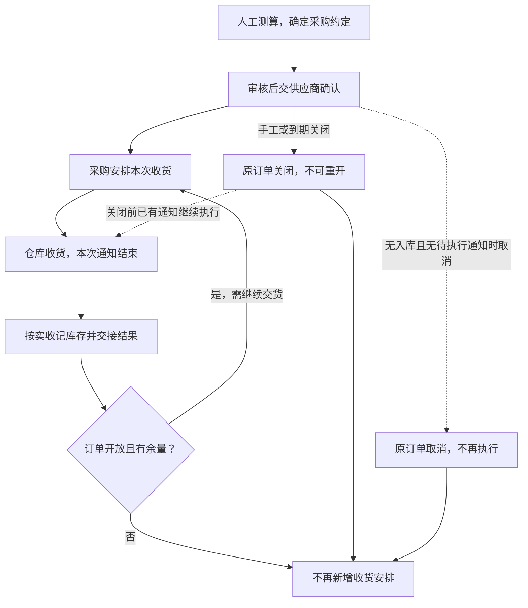

# 采购业务设计

本文说明采购约定如何分次交付、何时继续或终止，以及采购退货怎样交给仓库执行。

> 版本：V0.3｜编写日期：2026-09-14｜状态：业务设计初稿，待走查。
> 根据已确认需求整理一期目标流程，未确认事项集中列于文末。文中数量示例用于解释规则，不是实际经营数据。

输入来源：[采购调研](../02-需求调研和分析/02-采购业务管理/采购业务管理需求调研.md)、[采购分析](../02-需求调研和分析/02-采购业务管理/采购业务管理需求分析.md) PUR-FR01～PUR-FR06；公共概念及跨域关系见[业务蓝图](00-业务蓝图.md)。

## 一、业务定位与范围

采购负责把成品需求转化为与供应商的供货约定，持续跟进交货，并把仓库实际收货、退货结果与原约定对应起来。目标是能说明订了什么、安排了多少、实际到了多少、哪些还要继续、哪些已终止。

一期由采购部门结合 Excel、BI 人工测算采购量，直接形成采购订单，不设采购申请，不引入自动采购计划。供应商确认、发货及延期反馈仍在线下完成，由采购记录；不建设供应商门户或生产制造管理。

采购覆盖正向供货和采购退货。库存域负责库存数量与归属，仓库负责实物执行，财务负责预付款与后续核算。本文件覆盖履约及财务交接，不设计付款闭环。

## 二、参与角色

| 角色 | 负责什么 | 必须交接的结果 |
| --- | --- | --- |
| 采购部门／采购员 | 测算需求、确定供应商与采购数量，跟进交期，记录交货与退货安排 | 经确认的采购约定、收货或退货通知、延期及终止决定 |
| 有采购审核权限的人员 | 按权限审核采购业务 | 是否允许将约定交给供应商并执行；具体岗位待确认 |
| 供应商 | 线下确认订单、反馈交货及延期 | 实际交货情况；不要求登录一期 ERP |
| 仓库作业方 | 按通知收货或退货出库，按仓库规范处理不合格品 | 实际数量与执行结束结果 |
| 财务 | 处理预付款，承接采购实际结果核算 | 财务处理由金蝶及线下承接，不增加采购结果推送前的二次审核 |

商品、供应商及仓库资料由相应主数据维护流程提供。采购只能使用审核通过且启用的供应商；通常一商品一供应商的业务特点，不是强制供货绑定规则。依据：采购调研 §二、[主数据分析](../02-需求调研和分析/01-商品与主数据/商品与主数据需求分析.md) MD-FR02、MD-FR08，以及[公共能力分析](../02-需求调研和分析/08-公共能力与系统管理/公共能力与系统管理需求分析.md) COM-FR01。

## 三、核心业务场景

| 场景 | 业务要回答的问题 | 已确认处理 | 来源 |
| --- | --- | --- | --- |
| 人工测算后采购 | 向谁采购多少，何时送到哪里 | 直接确认采购订单，一单一仓一交期 | PUR-S01、PUR-FR01 |
| 分批交货 | 一次采购是否可以多次送达 | 允许多次安排，每次通知只执行一次收货 | PUR-S02、PUR-FR02 |
| 少收与补发 | 本次少到的数量如何继续 | 本次结束后回补可安排额度，补发另开通知 | PUR-S03、PUR-FR02 |
| 延期与不再供货 | 保留原约定还是改数量 | 保留已审核数量与价格，调整交期；取消整单或关闭余量，已有通知继续执行 | PUR-S04、PUR-FR03 |
| 不合格与采购退货 | 拒收还是退回，是否关联原采购 | 可按仓库规范拒收或入库后退货；退货可有来源或无来源 | PUR-S05、PUR-FR04 |
| 结果交给库存与财务 | 何时形成库存与财务输入 | 以实际入库、退货出库结果为依据 | PUR-S06、PUR-FR06 |

## 四、核心业务流程

图中回到收货安排表示新建一次通知，不能在已结束通知上继续收货。少收回补的是可安排量；关闭可以发生在已有通知尚未执行完时，并不撤销这部分执行。取消与关闭是两条不同的终止路径，取消要求整单没有实际入库且没有仍需执行的通知，关闭则允许已有通知继续执行完。采购退货见 4.2，详细依据仍为 PUR-FR01～PUR-FR03。

### 4.1 从采购约定到实际收货

| 步骤 | 参与方及业务动作 | 产生的业务结果／交接 |
| --- | --- | --- |
| 1. 确定采购需求 | 采购根据已有数据人工测算，选定供应商、成品、数量、价格、交期和仓库 | 形成待确认的采购约定；不同仓库或交期拆开 |
| 2. 审核与供应商确认 | 有权人员审核后，采购通过邮件、微信等向供应商传达 | 可执行的采购订单；供应商反馈由采购记录 |
| 3. 安排本次收货 | 供应商反馈发货，采购据此记录本次数量并通知原订单仓库 | 本次仓库收货依据，占用相应可安排额度，但不增加库存 |
| 4. 仓库实际接收 | 仓库按通知执行一次收货，确认实际接收数量并结束本次执行 | 形成实际采购入库结果；不超过本次通知量 |
| 5. 核对与后续安排 | 采购核对实际结果，订单仍开放时可继续安排剩余量 | 少收回补额度，后续交货使用新通知；关闭则停止新增安排 |
| 6. 库存与财务承接 | 依据实际结果记入原单指定逻辑仓，将已审核入库结果交给金蝶 | 库存增加，财务获得实际入库依据；并不直接认定已完成应付核算 |

依据：采购分析 PUR-FR01～PUR-FR03、PUR-FR06。仓内清点、验收、上架的具体操作由仓库作业规范承接。

### 4.2 采购退货

发现已入库商品需要退回后，采购确认退货商品、数量、供应商及出库仓。可关联原采购入库，也可无来源填写；数量上限未确认，不能默认原入库整单全部可退。

退货审核确认后占用可用库存，再向供应商传递并通知仓库分批出库。每次通知执行一次，实际发出后减少对应即时库存并消耗本次预占；少出部分回补可安排额度。退货截止或业务主动终止后，不再新增通知，原有通知仍可执行。之后仍需退货须另建退货单，供应商补货则新建采购订单。

采购退货审核占库的依据为[库存分析](../02-需求调研和分析/03-库存与仓储/库存与仓储需求分析.md) INV-FR05；分批与关单依据为 PUR-FR04、PUR-FR05。退货关闭后具体余量释放、通知取消等未逐项明确的内容列为待确认，不直接照搬销售规则。

### 4.3 延期与终止

供应商延期时，采购在线下确认并维护承诺交期；已审核采购订单不改数量、价格。无法继续供货可手动关闭，超过承诺交期加宽限时间也会关闭，但宽限参数未定。

终止继续安排有取消和关闭两条路径，业务含义不同：

- **取消表示整张订单不再执行。** 订单没有任何实际入库、且没有仍需执行的通知时才可以取消；待推送或明确推送失败的通知可以随订单一起取消。存在推送中、待收货或取消中的通知时，不能直接取消整单，要先处理这些通知并取得必要的仓库确认。
- **关闭表示不再安排剩余采购，已有通知继续执行。** 关闭意味着“不再新增本订单的收货安排”，不意味着在途货物消失或仓库停止执行。关闭前已生成的通知继续接收实际结果。
- **已有实际入库的订单不能取消整单，只能关闭余量。** 已实际收到的部分不因终止而回退。
- 关闭不区分手工关闭和到期自动关闭：两者都落为同一个“已关闭”，另记录关闭方式、原因、时间和操作人（用户或系统）；未关闭时这些信息留空。
- 取消和关闭都不可撤销，也不再编辑、提交、审核或新增通知单；已关闭订单仍可接收已有通知的实际结果。

取消与关闭都保留原审核状态和操作历史，不把已审核订单退回草稿。实际已发货但未记录通知、随后订单终止的情况，不能在原订单补录，需线下协调或新建订单补救。

依据：PUR-FR01、PUR-FR03。

## 五、业务对象及关系

| 对象 | 业务含义 | 与其他对象的关系及结束含义 |
| --- | --- | --- |
| 采购订单 | 企业与供应商之间的采购约定 | 可以分成多次收货安排；取消或关闭停止新增安排，已有通知继续执行，不抹去原约定和实际结果 |
| 采购收货通知单 | 交给仓库的某一次收货要求 | 沿用订单仓库；一次收货结束，少收不在本通知继续补收 |
| 采购入库单 | 本次实际接收的结果凭证 | 对应原采购和通知，增加所属逻辑仓库存，作为财务输入 |
| 采购退货单 | 企业向供应商退货的业务安排 | 可关联原入库或无来源；可分批执行，关闭后不重开 |
| 采退发货通知单 | 交给仓库的本次退货出库要求 | 每次一次执行，少出回补退货可安排额度 |
| 采退出库单 | 实际退货发出的结果凭证 | 扣减所属逻辑仓库存，交财务处理；不恢复原采购补货额度 |

上述阶段表达业务含义，不在这里另造完整审核状态机。采购退货审核后的修改范围、各结果单更正方式仍按文末待确认处理。

## 六、核心业务规则

### 6.1 约定、已安排与已执行数量分开

对同一订单的同一 SKU，当前仍可安排的数量，即需求中“可下推数量”，为：

**订购数量－已结束通知的实际收货数量－未结束通知的通知数量。**

采购 1,000 件，通知 600 件尚未结束，可再安排 400 件；本次实收 580 件并结束、没有其他通知时，可再安排 420 件。已经结束的通知不能再收那 20 件，需另一次安排。不同 SKU 不能互抵，订单关闭后即使公式有余量也不得再安排。

采购退货采用相同的分批额度结构，但以退货量、实际退货出库量计算；这不是对“原入库还允许退多少”的定义。依据：PUR-FR02、PUR-FR04，示例来自 PUR-AC02、PUR-AC05。

### 6.2 采购价格与退货价格

采购按采购组织、供应商、SKU 和币别取得当前价格，无价可手填；不能因为某供应商没有某 SKU 的价目表就禁止采购该商品。

采购订单和退货单在草稿阶段可调整本单价格与税率，提交后锁定。空价、负价不能提交，零价经确认可用；本单已保存价格不随之后的调价自动变化。退货优先使用原入库价格，缺价或无来源时可手填或主动查询当前价格。

详细取价、条件变化、币别与税率规则引用[价格分析](../02-需求调研和分析/06-价格管理/价格管理需求分析.md) PRI-FR02、PRI-FR04、PRI-FR05、PRI-FR07；不在采购文档重建另一份价税规范。

### 6.3 实际结果与业务归属

订单和通知不增加即时库存。实际入库增加库存，实际退货出库减少库存；有原单时沿用原单逻辑仓，不因结果由仓库主动发来就重新分仓。库存不足或归属依据不足不能随意记账。

金蝶只接采购入库及采退出库的已审核结果，分批按各自结果单交接。推送失败不回滚已生效业务，不另建一笔采购结果。依据：PUR-FR06、库存 INV-FR05、INV-FR09及[业财分析](../02-需求调研和分析/05-结算与业财/结算与业财需求分析.md) FIN-FR01～FIN-FR03。

## 七、特殊与异常场景

| 情形 | 当前处理边界 | 依据／未决点 |
| --- | --- | --- |
| 超本次通知到货 | 不超通知接收；原订单未关闭且有额度时另建通知，超订单量另建采购订单 | PUR-FR02 |
| 不合格品 | 按仓库规范现场拒收，或入库后采购退货 | PUR-FR02；不补造统一质检判定流程 |
| 供应商延期 | 采购确认后调整交期，不改已审核数量和价格 | PUR-FR03 |
| 关闭前已有通知 | 继续执行并接收实际结果，不撤销关闭 | PUR-FR03、PUR-FR05 |
| 有推送中通知时要求取消整单 | 不能直接取消，先处理通知并取得必要的仓库确认 | PUR-FR03 |
| 已有实际入库后要求取消整单 | 不允许取消，只能关闭余量；已收部分不回退 | PUR-FR03 |
| 关闭后发现漏录发货 | 不向原单补录，线下协调或新建订单补救 | PUR-FR03 |
| 退货后要求补货 | 新建采购订单，不恢复原单补货额度 | PUR-FR02 |
| 仓库结果无法自动取得 | 可由相关人员人工确认实际结果，仍须遵守业务校验 | [集成分析](../02-需求调研和分析/07-系统集成/系统集成需求分析.md) INT-FR06 |
| 财务接收失败 | 保留原业务及库存结果，修复后处理原记录 | FIN-FR03 |

### 待确认事项

“业务先确认”表示该事项会改变数量、责任或处理结果，需在对应功能方案定稿前收口；其他已确认链路可以继续。接口核验、页面和技术实现按表中阶段承接，未决问题不因此获得默认答案。

| 事项 | 需要确认的业务决定／后续工作 | 来源 | 处理阶段 |
| --- | --- | --- | --- |
| 自动终止 | 采购及退货宽限时间、配置范围；退货截止时间是否可调整 | 采购分析 §七 | 业务先确认 |
| 采购退货额度 | 有来源可退上限、重复退货约束及带出数量可修改范围 | PUR-FR04、§七 | 业务先确认 |
| 退货后续控制 | 审核后非价格内容可否修改、关闭时预占余量如何处理、通知取消条件 | 原文未逐项明确，不能照搬销售 | 业务先确认 |
| 结果异常 | 回传失败、重复回传、实际结果更正和业务处理责任 | 采购分析 §七；非 ToC 规则仍待细化 | 业务后果与责任先确认；去重及恢复机制随后设计 |
| 外部执行与财务 | 各仓单据对应关系、结果识别、金蝶目标单据及金额税费映射 | 采购分析 §七，接口及财务设计承接 | 接口及财务设计前核验 |

本稿可用于按采购、分批、关单、退货场景走查；尚未定下的边界不视为业务设计已全部确认。对应业务验收例见采购分析 PUR-AC01～PUR-AC08。
