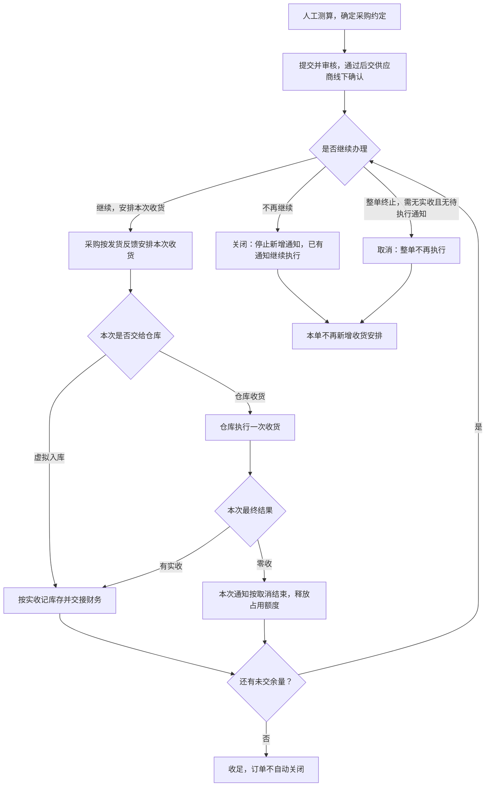
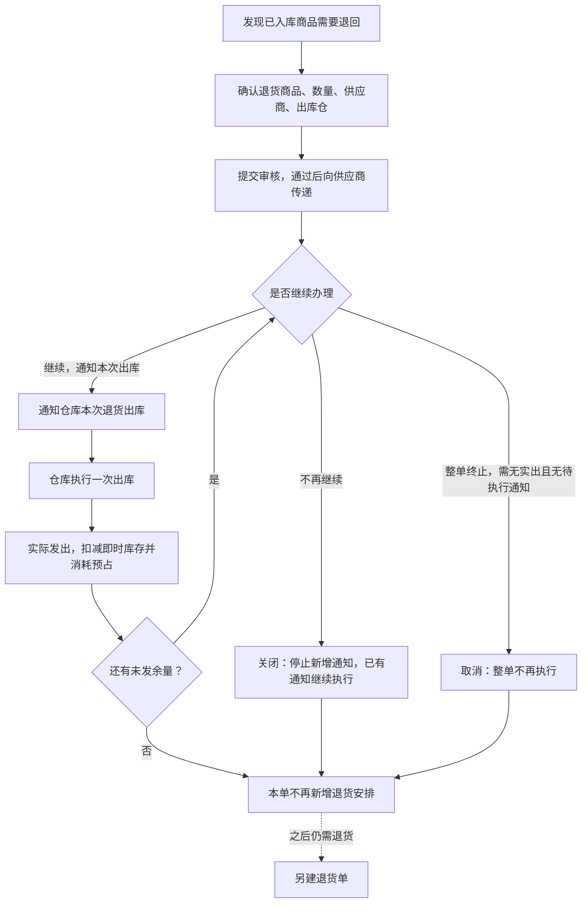

# 采购业务设计

本文说明采购需求怎么变成与供应商的供货约定、分批和缺量怎么继续、什么时候终止，以及采购退货怎么执行。执行可以交给仓库，也可以按通知数量在ERP直接记实际结果。

> 版本：V0.17｜编写日期：2026-09-20｜状态：业务设计初稿，待走查。
> 内容依据已确认的需求整理，未确认的事项集中在文末。文中的数量示例只用于解释规则，不是实际经营数据。

输入来源：[采购业务管理需求调研](../02-需求调研和分析/02-采购业务管理/采购业务管理需求调研.md)、[采购业务管理需求分析](../02-需求调研和分析/02-采购业务管理/采购业务管理需求分析.md)。公共概念和跨域交接见[强盛科技一期业务蓝图](00-业务蓝图.md)，单据分层与状态职责见[强盛ERP的单据分层设计](../01-全局背景信息/5.强盛ERP的单据分层设计.md)，库存规则见[库存与仓储需求分析](../02-需求调研和分析/03-库存与仓储/库存与仓储需求分析.md)。这几份文档已经写清楚的状态和推送规则，本文只引用，不再重复。

## 一、业务定位与范围

采购要回答清楚：向谁订、订了多少、安排了几批、实际到了多少、哪些还要继续、哪些已经终止。这些实际结果再变成库存和财务的依据。

采购部的跟单安排、仓库的收货和退货出库、财务的入库与退货出库核算，都依赖这里的信息。

| 交接方向 | 上游给采购什么 | 采购交给下游什么 |
| --- | --- | --- |
| 商品与价格准备 | 可识别的成品SKU、初始供应商、初始采购价、当前采购价 | 只使用，不维护档案 |
| 供应商 | 线下确认订单、反馈发货与延期 | 已审核的采购约定、退货安排 |
| 仓库 | 实际收货、实际退货出库、拒收结果 | 本次收货或退货出库的要求 |
| 库存 | 可用量校验、原单逻辑仓 | 实际结果对应到哪个逻辑仓 |
| 财务／金蝶 | — | 已审核的采购入库单、采退出库单 |

一期由采购部门用Excel、BI数据人工测算采购量，直接建采购订单，不设采购申请，也不做自动测算；供应商确认、发货和延期反馈仍在线下完成，由采购录入系统，不建供应商门户。

本文不包含：生产制造与物料计划、采购订单变更单、供应商在线协同、预付款的系统流程、仓内作业。ERP不建独立的质检判定流程，不合格品按仓库规范现场拒收，或入库后走采购退货。付款不在本文范围；把入库结果交给金蝶，也不等于应付已经确认。

## 二、参与角色

| 角色 | 负责什么 | 在哪些单据上做什么 | 必须交出什么 | 补充说明 |
| --- | --- | --- | --- | --- |
| 商品开发与管理人员 | 定义成品SKU、完成寻源、准备初始供应商和初始采购价 | 商品档案、价格初始化（不涉及采购单据） | 可以采购的商品和初始价格 | 上游准备；见[商品与主数据需求分析](../02-需求调研和分析/01-商品与主数据/商品与主数据需求分析.md) MD-FR09、[价格管理需求分析](../02-需求调研和分析/06-价格管理/价格管理需求分析.md) PRI-FR01 |
| 采购部门／采购员 | 测算需求、确定供应商和数量、跟进交期、维护系统记录 | 采购订单（创建、提交、改交期、关闭／取消）、采购收货通知单（创建）、采购退货单（创建、提交、终止） | 经确认的采购约定、本次收货安排、退货安排 | 主责角色 |
| 采购审核人 | 审核采购业务，决定能不能对外交给供应商执行 | 采购订单、采购退货单（审核、撤回） | 允许执行，或撤回修改 | 具体岗位待确认 |
| 供应商 | 线下确认订单、按约定交货、反馈延期 | 不登录ERP，反馈由采购代录 | 实际交货情况和供货反馈 | 外部参与方 |
| 仓库作业方 | 按通知收货或退货出库，按仓库规范处理不合格品 | 采购收货通知单、采退发货通知单（执行并回传实际数量和结束结果） | 实际数量、执行结束或拒收结果 | 外部执行方 |
| 财务 | 接收采购实际结果并核算，预付款线下处理 | 采购入库单、采退出库单（接收、核算） | 金蝶账务结果 | 不在ERP建财务台账 |
| 集成与异常处理方 | 维护商品、仓库等外部映射，处理结果回传和推送异常 | 映射关系、异常记录 | 修复后的结果或异常处理记录 | 岗位待确认；推送失败的修复按FIN-FR03、INT-FR03归技术运维 |

提交和审核权限、是否允许本人审核自己创建的数据，沿用[公共能力与系统管理需求分析](../02-需求调研和分析/08-公共能力与系统管理/公共能力与系统管理需求分析.md) COM-FR01、COM-FR02。本文不设计角色权限矩阵。审核岗位、资料维护复核人、异常处理的责任岗位都还没有确认，这里不指定。

## 三、业务场景

采购场景分四类：主场景、分支场景、辅助场景、异常场景。本节只列场景和关键分支，过程细节见第四节，异常后果见第七节。

### 3.1 主场景

| 场景 | 发生条件 | 参与方 | 主要步骤和判断点 | 业务结果 | 后续环节 |
| --- | --- | --- | --- | --- | --- |
| 人工测算后采购 | 采购判断需要补货，且商品和价格已就绪、供应商审核通过并在启用状态 | 采购员、审核人、供应商 | 人工测算 → 建单（不同仓库或交期要拆单）→ 提交 → 线下与供应商确认 | 可执行的采购约定 | 供应商确认后，由采购安排收货 |

### 3.2 分支场景

| 场景 | 发生条件 | 参与方 | 主要步骤和判断点 | 业务结果 | 后续环节 |
| --- | --- | --- | --- | --- | --- |
| 分批交货 | 供应商分批发货；订单已审核且还有可下推量 | 采购员、仓库 | 采购按发货反馈代录通知并选择收货处理方式。仓库收货则系统自动推送仓库，仓库执行一次收货；虚拟入库则不推仓库，按通知数量直接形成入库结果 | 本次收货结果；剩余量继续安排 | 采购核对后续安排 |
| 少收与补发 | 本次实收少于通知量；本次通知已经结束 | 采购员、仓库 | 本次通知结束，少收部分回补可下推量，需要补发时另建通知 | 可下推量回补；本次不再补收 | 采购另建通知 |
| 超量到货 | 到货超过通知量；通知正在执行 | 采购员、仓库 | 超出通知量的部分不接收；订单没关闭且还有可下推量时另建通知，超过订购量时另建订单 | 超出部分另行安排，或不接收 | 采购另建单据 |
| 不合格品 | 收货时发现不合格；本次收货正在执行或已完成 | 仓库、采购员 | 按仓库规范现场拒收，或先入库再由采购发起退货 | 拒收按缺量处理；已入库的走采购退货 | 退货流程 |
| 供应商延期 | 供应商反馈无法按期交货；订单已审核且未终止 | 采购员、供应商 | 线下确认后维护承诺交期；已审核的数量和价格不变 | 交期顺延，约定继续有效 | 按新交期收货 |
| 不再供货：关闭 | 供应商无法继续供货，或业务上不再需要交货；订单已审核 | 采购员，或系统按到期条件 | 关闭后不再新增收货安排；已有通知继续执行 | 剩余量不再安排，历史和实际结果保留 | 需要时新建订单 |
| 整单终止：取消 | 整单不再执行；没有实际入库，也没有仍需执行的通知 | 采购员、仓库 | 先确认没有实际入库、没有仍需执行的通知 → 还没交给仓库、或推送没成功的通知随单取消；已交给仓库的部分先取得仓库取消成功 | 整单终止，释放未执行的通知占用 | 需要时新建订单 |
| 事后发现漏录发货 | 关单后才发现有未记录的线下发货；原订单已关闭 | 采购员、供应商 | 不在原单补录，走线下协调或新建订单 | 原单保持关闭 | 线下处理，或新建订单 |

### 3.3 辅助场景

| 场景 | 发生条件 | 参与方 | 主要步骤和判断点 | 业务结果 | 后续环节 |
| --- | --- | --- | --- | --- | --- |
| 商品与价格准备 | 新增商品 | 商品开发与管理人员、采购员 | 商品建档时生成初始价格；变价用价格调整 | 可以下单的商品和价格 | 采购建单 |
| 供应商线下确认与代录 | 订单审核完成 | 采购员、供应商 | 采购通过邮件、微信传达订单；供应商反馈发货或延期；采购录入系统 | 供应商反馈成为后续安排的依据 | 安排收货，或维护交期 |
| 交期维护 | 供应商反馈延期；订单已审核且未终止 | 采购员 | 线下确认新交期后维护到订单 | 交期更新，数量和价格不变 | 按新交期安排收货 |
| 本次收货安排与推送 | 供应商反馈本批发货；订单没关闭且还有可下推量 | 采购员 | 按反馈代录通知数量并选择收货处理方式。仓库收货则系统自动推送仓库；虚拟入库则不推仓库，按通知数量直接形成入库结果 | 仓库收到本次执行指令，或ERP已按通知数量记入实际结果 | 仓库执行一次收货，或采购核对入库结果 |
| 虚拟入库 | 本批不交给仓库，按通知数量直接记入库 | 采购员 | 创建通知时选虚拟入库；创建成功后实收等于通知数量，生成已审核采购入库单 | 库存增加，占用被实际数量替代 | 采购核对；要少入则创建时把通知数量填少 |

### 3.4 异常场景

异常场景按触发条件识别，业务后果、责任方和恢复方式统一在第七节说明，本节不重复。

| 场景 | 触发事件 | 前置 |
| --- | --- | --- |
| 零收 | 仓库最终回传实收为0 | 通知已交给仓库执行 |
| 实际结果无法自动取得 | 接口无法返回最终结果 | 业务已经实际发生 |
| 回传校验失败或重复回传 | 结果与订单／通知不匹配，或同一结果重复到达 | 有结果等待处理 |
| 归属依据不足 | 无法确定应记入哪个逻辑仓 | 实际结果已经回传 |
| 金蝶接收失败 | 结果单推送未成功 | 结果单已生成并已审核 |

## 四、核心业务流程

### 4.1 主流程：从采购约定到实际收货

图中“有实收”包含少于通知量的部分交付，零收不生成结果单。关闭在办理过程中随时可以发起，只停止新增通知，已生成的通知继续执行到底；取消要求没有实际入库，也没有仍需执行的通知。回传校验失败、结果无法自动取得等异常不影响流程走向，见第七节。

| 步骤 | 参与方及业务动作 | 产生的业务结果与交接 |
| --- | --- | --- |
| 1. 确定采购需求 | 采购根据已有数据人工测算，选定供应商、成品、数量、价格、交期和仓库 | 形成待确认的采购约定；不同仓库或交期要拆开 |
| 2. 审核与供应商确认 | 有权人员审核后，采购通过邮件、微信等向供应商传达 | 可执行的采购订单；供应商反馈由采购记录 |
| 3. 安排本次收货 | 供应商反馈发货，采购记录本次数量，并选择仓库收货或虚拟入库 | 占用相应可下推量，但不增加库存；仓库收货才交给仓库 |
| 4. 确认实际接收 | 仓库按通知执行一次收货并回传；或虚拟入库按通知数量直接确认 | 形成实际采购入库结果。仓库路径不超过本次通知量，允许少收；虚拟入库实收等于通知数量 |
| 5. 核对与后续安排 | 采购核对实际结果；订单没关闭时可以继续安排剩余量 | 少收部分回补可下推量，后续交货另建通知；关闭后不再新增安排 |
| 6. 库存记账与财务交接 | 按实际结果记入原单指定的逻辑仓，把已审核的入库结果交给金蝶 | 库存增加，财务拿到实际入库依据；这不代表应付已经确认 |

仓库最终回传实收为0时，本次通知按零收取消，并记录为整批未收；不生成零数量的采购入库单。通知占用的额度全部释放，订单不受影响、可以继续安排；库存不变，也不向金蝶推送，最终回传和确认记录保留。还没拿到最终结果时，不能按零收处理。

### 4.2 分批与缺量

- 一张采购订单可以分多次安排收货；每张通知只执行一次，仓库回传后即结束，要补收就另建通知。
- 通知一创建就占用可下推量，直到收货完成或者取消成功。这期间不管有没有交给仓库、交得成不成功、仓库有没有给出最终结果，都不提前释放；收货完成后，占用被实际数量替代，缺量部分回补。
- 不接收超过通知量的到货。超出部分如果还在原订单的可下推量之内，另建通知；超过订购数量的，另建采购订单。
- 不合格品按仓库规范现场拒收（按缺量处理），或者先入库，再由采购发起退货。
- 不同SKU的数量不能互相抵用；订单关闭后，即使按公式算还有余量，也不能再安排。

### 4.3 辅助流程：准备、代录与交期维护

- **商品与价格准备**：商品建档时生成初始采购价；变价由采购用价格调整处理，准备到位后再开展业务。
- **供应商确认与代录**：订单审核后由采购线下传达，供应商通过邮件、微信确认或反馈延期、发货。这些反馈不会自动进系统，由采购代录成通知或交期。
- **交期维护**：延期由采购线下确认后维护承诺交期；已审核订单的数量和价格不因延期改变，也不做变更单。
- **本次收货安排的创建与推送**：通知由采购按发货反馈创建，创建后系统自动推送给仓库，不需要人工再操作一次；推送结果和取消回执由系统记录。通知本身不增减库存，也不代表仓库已经开始作业。

### 4.4 终止流程：关闭与取消

关闭和取消是两条不同的终止路径：

- **关闭：不再安排剩余采购，已经安排的继续执行到底。** 可以在已有通知还没执行完的时候关闭，它不会撤销这部分执行，关闭前已生成的通知继续接收实际结果。关闭不可撤销，也不能反关单。
- **取消：整张订单不再执行。** 只有在没有任何实际入库、也没有仍需执行的通知时才能取消。还没交给仓库、或推送没成功的通知可以随订单一起取消；已经交给仓库、还没有最终结果或取消结果的通知，不能靠取消整单直接收回，要先处理这些通知并取得仓库确认。
- **已有实际入库的订单不能取消，只能关闭余量。** 已经收到的部分不会因为终止而回退。
- 关闭不区分手工关闭和到期自动关闭，两者都是同一个“已关闭”。到期自动关闭：采购订单在承诺交期过后T+2自然日，退货单在退货截止时间过后T+2自然日。T+2不跳过周末。每天北京时间0:00跑批，关闭发生在「日期＋2个自然日」当天0:00。系统自动关闭时关闭原因留空，只记关闭方式；手工关闭时关闭原因必填。审核后只能改退货截止时间。
- 取消和关闭都保留原来的审核状态和操作历史，不把已审核订单撤回为草稿，之后也不能再编辑、提交、审核或新增通知。

状态和操作条件见[强盛ERP的单据分层设计](../01-全局背景信息/5.强盛ERP的单据分层设计.md) §5.2、§5.7，本节只讲业务含义和后果。

### 4.5 采购退货流程

- 退货可以关联原采购入库，也可以没有来源、手工填写；关联时带出原入库价格，没有来源或缺价时可以手工填写，也可以查当前采购价快速填入。
- 一张退货单只对应一个供应商、一个出库仓库。审核确认后才向供应商传递并通知仓库，之后按批出库。
- 审核后占用可用库存；实际发出时减少即时库存并消耗本次预占；少出部分回补可下推量。
- 终止同样分关闭和取消。关闭停止新增通知，释放尚未安排出库部分的预占，已有通知继续执行到底；取消终止整张退货单，已经交给仓库的部分要先取得仓库取消成功。已经有实际出库的，只能关闭余量。
- 需要继续退货时另建退货单；要让供应商补货，新建采购订单，不恢复原订单的补货额度。
- 关联原入库时，累计退货不能超过该入库实收；审核占用可退额度，草稿不占，办理中的其他退货也计入。审核后只能改截止时间。无来源退货不套原入库额度，每行数量须大于0；审核时仍须出库仓可用库存足够。

#### 退货走查：退 100 件，分两次发出

| 步骤 | 业务动作 | 退货单 | 通知 | 库存与财务 |
| --- | --- | --- | --- | --- |
| 1 | 确认退回100件（可关联原入库），提交审核 | 审核通过，占用可用库存 | — | 不增不减 |
| 2 | 通知本次发出60件 | 可下推40 | 通知60 | 不增不减 |
| 3 | 仓库实发50件并结束 | 少出的10回补，可下推50 | 本次结束 | 即时库存 −50，预占消耗50 |
| 4 | 供应商反馈只能再收20，采购建通知20后关闭余量 | 关闭后释放尚未安排的30 | 通知20 | 不增不减 |
| 5 | 仓库实发20件并结束 | 累计实出70，之后不再安排 | 本次结束 | 即时库存 −20 |
| 6 | 供应商要补货 | 新建采购订单，不恢复原退货单额度 | — | — |

示例数字只用于解释规则。有来源退货累计不超过原实收；无来源每行大于0，审核仍校验可用库存。

### 4.6 一条完整走查：1,000 件分批采购

以一张1,000件的采购订单为例，按时间走一遍主链、分批和终止。

| 步骤 | 业务动作 | 订单 | 通知 | 库存与财务 |
| --- | --- | --- | --- | --- |
| 1 | 采购人工测算后建单：订购1,000件，一个仓库、一个交期 | 草稿，尚不能安排收货 | — | 无变化 |
| 2 | 提交并审核通过，线下与供应商确认 | 已审核、正常、未收货；可下推1,000 | — | 不占库存 |
| 3 | 供应商反馈第一批发600，采购代录通知并选仓库收货，系统推送仓库 | 可下推400 | 通知600，等待仓库最终结果 | 不增加库存 |
| 4 | 仓库回传实收580并结束本次执行 | 部分收货，累计580；可下推420 | 本次结束，缺收20 | 库存 +580；入库单580推金蝶 |
| 5 | 补发：采购另建通知420，不向已结束的通知补收 | 可下推0 | 通知420 | 不增加库存 |
| 6 | 仓库回传实收420并结束 | 全部收货（正常＋全部收货），不自动关闭 | 本次结束 | 库存累计 +1,000；第二批入库单推金蝶 |
| 7 | 分支：第二批前供应商明确无法再交剩余420 | 采购关闭订单，不再新增通知；已收580不回退 | 无 | 不受影响 |
| 8 | 分支：第一批仓库最终回传实收0 | 通知按零收取消，可下推量回到1,000 | 本次按取消结束 | 库存不变、不推金蝶 |
| 9 | 分支：订单尚未发生任何实际入库，且没有仍需执行的通知 | 可以取消整单，释放未执行的通知占用 | 还没交给仓库、或推送没成功的通知随单取消 | 不受影响 |
| 10 | 分支：第二批选虚拟入库，通知数量420 | 全部收货，累计1,000 | 通知直接已收货，实收420 | 库存再＋420；不推仓库 |

这张表把几个容易混淆的数量分开了：可下推量、在途通知数量、累计入库数量；也说明“全部收货”不等于订单结束。

## 五、业务对象及关系

### 5.1 对象清单

| 对象 | 业务含义 | 如何识别 | 业务阶段 | 阶段结束时 |
| --- | --- | --- | --- | --- |
| 采购订单 | 企业与供应商之间的采购约定 | 单号；编码规则见[《强盛ERP的编码规则和通用字段规则》](../01-全局背景信息/6.强盛ERP的编码规则和通用字段规则.md) | 创建 → 审核生效 → 分次执行 → 继续或终止 | 取消或关闭后不再新增安排；历史和实际结果保留 |
| 采购收货通知单 | 某一次收货的执行指令，可以交给仓库，也可以虚拟入库 | 来源订单及行 + 本次通知 | 创建并占用额度 → 仓库收货则推送仓库并执行一次，虚拟入库则按通知数量直接结束 | 结束后不再补收；仓库路径零收按取消结束；虚拟入库实收等于通知数量 |
| 采购入库单 | 本次实际接收的结果凭证 | 来源通知及行 | 仓库回传或虚拟入库后形成并生效 → 推送到金蝶 | 增加对应逻辑仓库存，作为财务输入 |
| 采购退货单 | 企业向供应商退货的业务安排 | 单号；可以关联原入库单 | 创建 → 审核占库 → 分次执行 → 继续或终止 | 关闭后不可重开；继续退货另建 |
| 采退发货通知单 | 本次退货出库的执行指令，可以交给仓库，也可以虚拟出库 | 来源退货单及行 + 本次通知 | 创建并占用额度 → 仓库发货则推送仓库并执行一次，虚拟出库则按通知数量直接结束 | 仓库路径少出部分回补可下推量；虚拟出库实出等于通知数量 |
| 采退出库单 | 实际退货发出的结果凭证 | 来源通知及行 | 形成并生效 → 推送到金蝶 | 扣减对应逻辑仓库存；不恢复原采购的补货额度 |

本文只写业务阶段；系统的状态字段和取值见[强盛ERP的单据分层设计](../01-全局背景信息/5.强盛ERP的单据分层设计.md)。

### 5.2 对象关系

| 关系 | 基数与可选性 | 说明与追溯路径 |
| --- | --- | --- |
| 采购订单 → 采购收货通知单 | 1 : N | 分批产生；通知沿用订单仓库；通知行对应订单行 |
| 采购收货通知单 → 采购入库单 | 1 : 0..1 | 一次回传形成一张结果单；零收不生成结果单 |
| 采购订单 → 采购入库单 | 1 : N | 累计实际入库决定订单收货进度 |
| 采购退货单 → 采退发货通知单 | 1 : N | 分批产生 |
| 采退发货通知单 → 采退出库单 | 1 : 0..1 | 一次回传；零出不生成结果单 |
| 采购退货单 → 采购入库单 | 0..1 : 1 | 可选关联：有来源时带出原入库信息与价格，无来源时没有这层关系 |
| 采购订单 ↔ 采购退货单 | 无额度关联 | 退货不恢复原订单可下推量，补货另建订单 |

追溯路径：从入库单可以查到来源通知和订单，从订单也能看到它下面所有的通知和入库记录；退货单可以查到原入库单和原订单。

### 5.3 数量关系

| 数量 | 落在哪个对象上 | 怎么变化 |
| --- | --- | --- |
| 订购数量 | 采购订单行 | 审核后固定，不因延期或调价改变 |
| 在途通知数量 | 未结束的通知单行 | 创建时计入；取消成功释放；收货完成后被实际入库数量替代 |
| 可下推数量 | 采购订单行（计算得来） | 订购数量 − 已结束通知的实际收货数量 − 未结束通知的通知数量 |
| 实际收货数量 | 采购入库单行、通知行 | 一次回传确认，累计进订单的收货进度 |
| 缺收数量 | 通知行（计算得来） | 通知数量 − 实际收货数量；不在原通知补收，需要另建通知 |
| 退货数量 | 采购退货单行 | 审核后固定；关联原入库时不超过剩余可退额度 |
| 退货可下推数量 | 采购退货单行（计算得来） | 退货数量 − 已结束通知的实际出库数量 − 未结束通知的通知数量 |
| 实际退货出库数量 | 采退出库单行 | 一次回传确认，扣减即时库存 |
| 退货预占数量 | 对应逻辑仓的库存 | 退货单审核时占用；实际出库消耗；关闭或取消释放未执行部分 |

## 六、核心业务规则

### 6.1 约定、已安排、已执行分开

对同一订单的同一SKU：

**可下推数量 ＝ 订购数量 − 已结束通知的实际收货数量 − 未结束通知的通知数量**

采购1,000件，通知600件还没结束，可以再安排400件；本次实收580件并结束、没有其他通知时，可以再安排420件。已经结束的通知不能再收那20件，需要另一次安排。不同SKU不能互抵，订单关闭后即使按公式还有余量也不能再安排。

采购退货用同样的分批结构，只是按退货数量和实际退货出库数量计算；它不等于“原入库还能退多少”的上限。依据：《采购业务管理需求分析》PUR-FR02、PUR-FR04，示例PUR-AC02、PUR-AC05。

### 6.2 采购价格与退货价格

采购价格按供应商、SKU和币别取当前价格，没有价格可以手工填写；不能因为某个供应商没有某个SKU的价目表，就禁止采购这个商品。本单价格和税率在草稿阶段可以调整，提交后锁定；空价、负价不能提交，零价经确认后可以使用；已经保存的价格不随之后的调价变化。

退货优先使用原入库价格，缺价或没有来源时可以手工填写，也可以查当前采购价快速填入。更细的取价、条件变化、币别和税率规则见[价格管理需求分析](../02-需求调研和分析/06-价格管理/价格管理需求分析.md) PRI-FR02、PRI-FR04、PRI-FR05、PRI-FR07，本文不再重复。

### 6.3 实际结果与库存归属

订单和通知不增加即时库存。实际入库增加库存，实际退货出库减少库存并消耗对应预占；有原单时沿用原单的逻辑仓，不因为结果是仓库主动回传的就重新指定。库存不足或归属依据不足，不能随意记账。

金蝶只接收采购入库和采退出库的已审核结果，分批按各自的结果单交接；推送失败不回滚已经生效的业务，也不另建采购结果。依据：《采购业务管理需求分析》PUR-FR06、[库存与仓储需求分析](../02-需求调研和分析/03-库存与仓储/库存与仓储需求分析.md) INV-FR05、INV-FR09、[结算与业财需求分析](../02-需求调研和分析/05-结算与业财/结算与业财需求分析.md) FIN-FR01～FIN-FR03。

状态职责、推送与重试、负库存阻断、重复结果处理这些跨模块通用的部分，以[强盛ERP全局业务规则与约束](../01-全局背景信息/4.强盛ERP全局业务规则与约束.md)和[强盛ERP的单据分层设计](../01-全局背景信息/5.强盛ERP的单据分层设计.md)为准；本文只写采购特有的数量、价格和终止边界。

### 6.4 收货进度不等于终止

- 全部收足后，订单保持“正常＋全部收货”，不会自动变成“已完成”，也不会自动关闭或取消；此时不再提供关闭、调整交期、下推、取消等办理入口，仅查看追溯；仍有未收足余量时，采购员方可关闭余量或调整交期。
- 收足只表示这次的约定已经履行完；之后需要补货、退货或调整，按各自的规则另办单据。
- 已经有实际入库的订单只能关闭余量、不能取消，这一点和有没有收足无关（见4.4）。

依据：PUR-FR01、[强盛ERP的单据分层设计](../01-全局背景信息/5.强盛ERP的单据分层设计.md) §5.2。

## 七、特殊与异常场景

本节汇总异常的触发条件、业务后果、责任方和恢复方式；完整规则见第四节和第六节，这里不重复展开。表里的“责任方”和“能否恢复”两列就是每个异常的后续环节：能恢复的按恢复方式继续，不能恢复的另办单据。

| 情形 | 触发条件 | 业务后果 | 责任方 | 能否恢复 |
| --- | --- | --- | --- | --- |
| 零收 | 仓库最终回传实收为0 | 本次执行按零收取消，释放全部占用额度，不生成结果单（见4.1） | 仓库回传最终结果；采购决定是否重新安排 | 能：订单仍开放时另建通知 |
| 超量到货 | 到货超过本次通知量 | 超出部分不接收；在原订单可下推额度内另建通知，超过订购量另建订单 | 仓库拒收超出量，采购另建单据 | 能：另行安排或新建订单 |
| 不合格品 | 收货时发现不合格 | 按仓库规范现场拒收，或入库后由采购发起退货 | 仓库按规范处理，采购发起退货 | 能：退货，或另建采购 |
| 供应商延期 | 供应商反馈无法按期 | 维护承诺交期，已审核数量和价格不变 | 采购线下确认并维护 | 能：按新交期安排 |
| 关闭前已有通知 | 订单关闭时仍有通知在执行 | 已有通知继续执行并接收实际结果，不撤销关闭 | 仓库继续执行，采购不再新增 | 不能：关闭不可撤销，需要时新建订单 |
| 已交给仓库的通知未结清时要求取消整单 | 仍有已交给仓库、未取得最终结果或取消结果的通知 | 不能直接取消整单，先处理通知并取得必要的仓库确认 | 采购、仓库 | 能：处理完通知后重新判断 |
| 已有实际入库后要求取消整单 | 订单已有实收 | 不允许取消，只能关闭余量；已收部分不回退 | 采购 | 不能：只能关闭余量 |
| 采购退货要求终止 | 需要停止退货 | 未实出且无阻挡通知时可取消；已实出只能关闭余量，已有通知继续执行 | 采购、仓库 | 不能：需要退货时另建退货单 |
| 关闭后才发现漏录发货 | 关单后才发现线下已发货 | 不向原单补录，线下协调或新建订单 | 采购、供应商 | 不能：原单不恢复，走新单或线下 |
| 退货后要求补货 | 退货后需要供应商补货 | 新建采购订单，不恢复原退货单或原订单的额度 | 采购 | 能：新建订单办理 |
| 仓库结果无法自动取得 | 接口不能返回最终结果 | 可由相关人员人工确认实际结果，仍须遵守业务校验；不能无来源新建入库单 | 相关人员（岗位待确认） | 能：人工确认后按结果处理 |
| 回传校验失败或重复回传 | 结果不匹配、重复到达 | 保留异常，不完成本次通知、不增加库存、不更新订单的累计实收；修复后处理同一份结果；重复结果不重复记账 | 集成与异常处理方（待确认） | 能：修复后处理原记录 |
| 归属依据不足 | 无法确认应记入哪个逻辑仓 | 暂不记账，转异常处理，不任意选仓 | 集成与异常处理方（待确认） | 能：补齐映射后处理 |
| 金蝶接收失败 | 结果单推送失败 | 保留ERP业务与库存结果，记录失败，修复后在系统集成中心重推原结果单 | 系统记录失败；技术运维在系统集成中心处理（权限和操作方式按《结算与业财需求分析》FIN-FR03、《系统集成需求分析》INT-FR03） | 能：重试原单，不另建业务 |

### 待确认事项

“业务先确认”的解释见《强盛科技一期业务蓝图》§七；下表按处理阶段列出还没定的事。

| 事项 | 需要确认什么 | 来源 | 处理阶段 |
| --- | --- | --- | --- |
| 自动终止 | 宽限已定为T+2自然日，每天北京时间0:00跑批；审核后只能改退货截止时间 | [采购业务管理需求分析](../02-需求调研和分析/02-采购业务管理/采购业务管理需求分析.md) §七 | 已确认 |
| 采购退货额度 | 有来源不超过原实收；无来源每行大于0、不套原入库额度；审核仍校验可用库存 | PUR-FR04、§七 | 已确认 |
| 退货后续控制 | 已生效结果的更正；审核后仅可改截止时间已确认 | 取消、关闭和预占的处理已在PUR-FR05明确 | 业务先确认 |
| 角色与责任岗位 | 采购订单、退货单的审核岗位；异常和结果处理的责任岗位 | [强盛科技一期业务蓝图](00-业务蓝图.md) §二、COM-FR01 | 详细产品设计前 |
| 结果异常 | 回传失败、重复回传、实际结果更正的业务处理责任；推送失败的修复权限和操作方式（修复责任已按FIN-FR03、INT-FR03归技术运维） | 采购业务管理需求分析 §七；外部电商以外的更正规则还没有细化 | 业务后果和责任先确认；去重及恢复机制随后设计 |
| 外部执行与财务 | 各仓单据对应关系、结果识别、金蝶目标单据和金额税费映射 | 采购业务管理需求分析 §七；接口和财务设计时补齐 | 接口及财务设计前核验 |

本文可用于按采购、分批、取消、关单、退货、虚拟入出库场景走查；还没定下来的边界，不等于业务设计已经全部确认。对应的业务验收例子见《采购业务管理需求分析》PUR-AC01～PUR-AC13。
