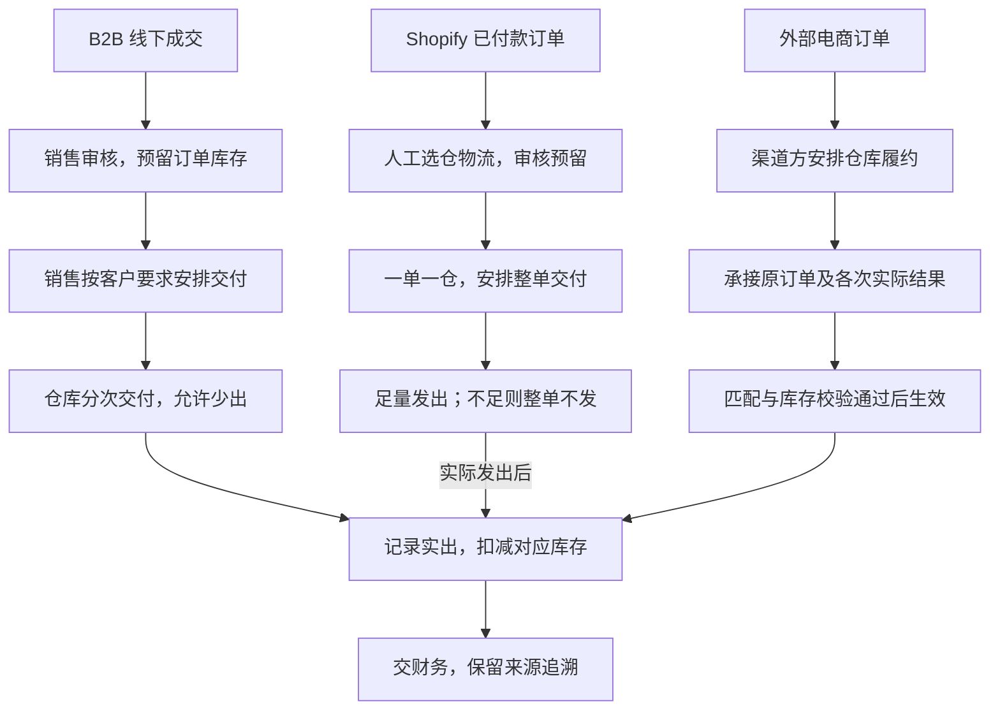

# 销售与履约业务设计

本文分别说明 B2B、独立站与外部电商的履约责任，以及退货、关闭和取消的业务边界。

> 版本：V0.4｜编写日期：2026-09-14｜状态：业务设计初稿，待走查。
> 根据已确认需求整理一期目标流程，三类销售分别描述；文中数量仅为规则示例，不代表实际经营数据。

输入来源：[销售调研](../02-需求调研和分析/04-销售与履约/销售与履约需求调研.md)、[销售分析](../02-需求调研和分析/04-销售与履约/销售与履约需求分析.md) SAL-FR01～SAL-FR12；公共概念与财务交接见[业务蓝图](00-业务蓝图.md)。

## 一、业务定位与范围

销售负责把客户的成交约定转化为仓库交付，并明确实物退货、剩余履约终止和取消责任。不同渠道的接单、库存预留、发货及售后责任不同，一期不强行统一。

| 业务类型 | 谁承接订单和履约安排 | 本期处理范围 |
| --- | --- | --- |
| B2B | 销售线下成交，在 ERP 记录并安排仓库执行 | 一次或分批交付、自提、缺量、关闭取消、实物退货 |
| Shopify 独立站 | 业务人员处理已付款订单，安排深圳仓或海外仓 | 一单一仓，人工确认仓库物流后整单履约，反馈实际发货结果 |
| 其他外部 ToC | 聚水潭／领星及对应仓库处理 | 保留原订单与实际结果，归集库存与财务信息，不重新接管履约 |

报价合同、信用强制拦截、ERP 退款执行和平台费用回款对账不纳入一期。Amazon 当前按 FBA 消费者销售处理；提前备货进 FBA 属于库存转移。国内平台“自营”指强盛经营店铺，不是强盛向平台批量供货。依据：SAL-FR01、SAL-FR07～SAL-FR11。

## 二、参与角色

| 角色 | 业务责任与交接 |
| --- | --- |
| B2B 销售人员 | 在线下谈妥商品、数量、价格，记录成交，按客户要求安排发货和退货 |
| 销售负责人 | 审核销售订单与销售退货单，不增加财务强制放行 |
| 独立站业务人员 | 确认仓库、物流及履约安排，协调缺货、改仓、取消和退货 |
| 客户／消费者 | 提出交付、取消和售后诉求；诉求本身不代表仓库已停止执行 |
| 渠道履约方 | 完成外部 ToC 正向及售后业务，提供实际结果与来源关联 |
| 仓库作业方 | 凭通知执行收发，确认取消能否成功，返回实际数量及物流结果 |
| 财务 | 承接已确认实物结果；收退款、平台费用及核算按既定财务分工办理 |

上述为业务分工；具体人员与数据权限仍待产品设计。具备相应权限者允许审核本人创建的数据，仍须满足库存与金额条件，见[公共能力分析](../02-需求调研和分析/08-公共能力与系统管理/公共能力与系统管理需求分析.md) COM-FR01。

## 三、核心业务场景

| 场景 | 关键业务问题 | 已确认处理 | 来源 |
| --- | --- | --- | --- |
| B2B 成交与缺货 | 已成交但库存暂不足怎么办 | 可记录订单，库存不足不能审核占库；信用仅提醒 | SAL-S01、SAL-S03；FR01、FR02 |
| 分批、自提、少出 | 是否可分次交到不同地址 | 同仓分批可不同地址，自提也凭单；少出后另次安排 | SAL-S02；FR02 |
| 关闭与取消 | 停止余量是否等于撤销已发仓任务 | 分开处理，涉及仓库的取消须取得确认 | SAL-S04；FR03、FR04 |
| 实物退货与补发 | 可退多少、退到哪里、补发如何办 | 溯源退货控制原实出额度，指定仓接收；补发新单 | SAL-S05；FR05、FR06 |
| 独立站交付 | 能否缺量先发或多仓拼单 | 仅已付款，一单一仓、整单足量发货 | SAL-S06；FR07、FR08 |
| 外部 ToC 归集 | 如何知道卖出和退回多少 | 原订单与各次实际结果关联，不只记录汇总销量 | SAL-S07；FR09 |
| 外部结果异常 | 来源成功是否代表本地也成功 | 匹配或库存不足时阻止记账，修复后继续原记录 | SAL-S10；FR12 |

表内 FR 编号均对应销售分析，不另建编号体系。

## 四、核心业务流程

三条路径只在实际出库结果处汇合。独立站不足量时保留占库、等待人工处理；外部电商不在 ERP 补做事前预占，也不再次触发履约。退货及取消分别见后续小节。依据：SAL-FR01、SAL-FR02、SAL-FR07～SAL-FR09。

### 4.1 B2B 成交与交付

| 步骤 | 谁做什么 | 业务结果 |
| --- | --- | --- |
| 1. 确认成交 | 销售与客户线下谈妥，大单报价合同也在线下完成 | 记录一仓一交期的成交约定；多仓拆单 |
| 2. 审核与预留 | 销售负责人审核，检查库存是否足够 | 审核成功预留整单库存；缺货则等待，不形成成功占库 |
| 3. 安排本次交付 | 销售按客户要求一次或分批通知仓库 | 沿用订单仓库，本次地址可不同；自提也有订单与通知 |
| 4. 实际出库 | 仓库执行一次发货并确认结束 | 以实出减少即时库存及对应预占；允许少出 |
| 5. 继续或结束 | 开放订单可重新安排少出及未安排部分 | 补发另建通知；已关闭订单停止新增安排 |
| 6. 结果交接 | 保存实际出库凭证及物流结果 | 已审核销售出库结果交财务，订单和通知不作为实际结果传递 |

已审核 B2B 订单不改数量、价格，可以调交期；录错按允许的取消条件取消后新建，不能撤回审核直接修改。欠款与信用额度一期只提醒，不阻止发货；提醒的数据来源及具体表达不在此补定。依据：SAL-FR01～SAL-FR04、SAL-FR10。

### 4.2 ERP 主动办理的销售退货

销售确认退货，可关联原实际出库，也可无来源填写。溯源退货必须沿用原单仓库；无来源退货可指定收货仓。审核后才能通知仓库；其中溯源退货在审核时占用原出库可退额度，草稿不占。这里占用的是“还能退多少”，不是预占待发库存。

仓库按每次通知收货，一次执行结束，允许少收、不超通知量。实物退回增加预先指定逻辑仓库存；品质有差异时，先按指定仓接收，再由库存业务办理品质转仓。每次少收可回补退货安排额度，关闭后不再新增通知，已有通知继续收货。

有来源退货累计不超过原实际出库量，其他已审核办理中的退货也占额度。关闭或取消只释放未退且没有通知继续执行的部分，已退实物继续计入累计量。退货审核后仅可调整截止时间，不改其他业务内容。补发或换货新建销售订单，不恢复原销售订单的交付额度。

依据：SAL-FR05、SAL-FR06。外部 SaaS 主动办理的补发、换货按来源接收，不强行套用本节新建销售订单的规则。

### 4.3 Shopify 独立站交付与调整

仅承接已付款订单。业务人员人工批量确认仓库与物流，审核成功后预留库存，并由系统自动推送仓库发货，不再需要人工逐单下发。库存不足不能审核，补货或调整仓库后重审；仓库无法足量发出时整单不发，继续保留占库，等待人工处理。只有收到仓库明确、最终的整单零执行结果时才按已发货结束，实发数量为 0、差额等于订购数量，不生成零数量销售出库单、不推金蝶，并保留最终回传及确认记录。实际发货后反馈履约结果和运单信息。

换仓或换物流保留原订单：尚未推送仓库时，取消审核、释放占库后调整并重审；已经推送则必须先得到仓库取消成功结果，再释放占库并调整。取消审核用途为“终止订单”时落为已取消；用途为“调整后重新执行”时回到草稿，页面可显示为“待提交”，原订单可继续编辑仓库、物流等允许调整内容。修改后重审属于新的仓库执行，生成新的执行标识并自动推送；前次执行记录、取消用途及回执保留，迟到回传只关联旧执行。此处理不推广为 B2B 撤回审核规则。

消费者取消时尝试取消，涉及仓库先等确认，不能提前认定取消成功。仓库拒绝则恢复原执行状态继续发货，仍需停止的由人工介入拦截。实物退货按对应退货链路处理，ERP 不执行退款；接口未覆盖的 Shopify 订单可人工导入，仍遵守对应业务校验。

依据：SAL-FR07、SAL-FR08 及[集成分析](../02-需求调研和分析/07-系统集成/系统集成需求分析.md) INT-FR06。完整自动选仓、选物流及自动履约后置，来源订单修改协议仍待确认。

### 4.4 外部电商履约结果归集

渠道履约方先完成接单、发货或售后，业务中枢再接收原订单与实际结果。原订单只作为追溯依据，不因此提前占库或重新通知仓库发货。

实际结果能明确识别商品、库存归属并通过库存等校验后，自动确认生效，记录对应逻辑仓的库存增减并进入财务交接；不增加常规人工审核。第三方仓实际发出，不重复扣深圳自营仓。

售后按来源实际单据拆分接收，来源两张单就保留两张，不强造同一售后的关联。仅退款没有实物流转，不增加库存，不生成供应链单据。外部 ToC 成交优惠后金额及退货金额沿用来源，缺必要金额按异常处理，不自行补价。

依据：SAL-FR09～SAL-FR12。

## 五、业务对象及关系

| 对象 | 业务含义 | 关系与生命周期重点 |
| --- | --- | --- |
| 销售订单 | 已记录的客户成交约定 | B2B 可分次交付，独立站整单履约；独立站取消审核调整在本次结束前回到草稿／待提交，已结束订单不重开 |
| 销售发货通知单 | 某次交给仓库的发货要求 | 不等于实际发货；取消须根据是否交仓及仓库反馈判断 |
| 销售出库单 | 实际发出的结果凭证 | 减少库存，作为溯源退货和财务输入依据 |
| 销售退货单 | 本次客户实物退货安排 | 可关联原出库；溯源退货审核占原单可退额度，不占待发库存 |
| 销退收货通知单 | 某次仓库退货接收要求 | 一次收货结束，少收可另行安排；取消与关单分别控制 |
| 销退入库单 | 已实际退回的结果凭证 | 增加指定逻辑仓库存，不表示退款已执行 |
| 外部原始订单及结果 | 渠道已发生交易及履约的来源证据 | 保留实际拆分与关联；完结结果不跟随来源回改 |

关闭是停止新的履约安排；取消是撤回尚可撤回的业务；执行结束是本次仓库处理已完成。这些不合并成一个通用状态。订单全部执行后是否自动完成，原文仍待确认。

## 六、核心业务规则

### 6.1 库存预留与可安排数量分别管理

B2B 同一 SKU、没有关闭或取消释放时：订单剩余预占＝审核占用量－累计实际出库量；可安排量＝订单数量－已结束通知实出量－未结束有效通知量。取消的通知不占安排额度。通知下发不重复占库，少出回补也不重新占库。

来源示例：订单 1,000 件，通知 600 件，实际发出 580 件并结束，剩余预占与可安排量均为 420 件。若在通知执行前关闭订单，则先释放未安排的 400 件，保留执行中的 600 件；实出 580 件后消耗相应预占，再释放少出的 20 件，不恢复新增安排资格。依据：SAL-FR02、SAL-FR03，SAL-AC03、SAL-AC04。

### 6.2 关闭与取消不能替代仓库确认

| 情况 | 业务结果 |
| --- | --- |
| 无通知，或通知均未推送／推送失败 | 可取消订单，关联通知一起取消并释放相应预占 |
| 存在推送中或已交仓且未取消的通知 | 不能直接取消订单 |
| 请求取消仓库通知 | 等待结果，不提前回补或释放 |
| 仓库取消成功，订单仍开放 | 恢复通知对应安排额度，保留订单预占 |
| 仓库取消成功，订单已关闭 | 释放相应预占，不恢复新增安排资格 |
| 仓库拒绝取消 | 恢复取消前执行状态，继续执行 |

所有通知已获得仓库取消成功确认、没有实际出库及其他阻挡通知时，可取消订单；已发生的出库结果不属于上述取消对象。销售退货沿用对应控制，释放或保留的是原出库可退额度。依据：SAL-FR04、SAL-FR06。

B2B 支持手动关闭及交期／退货截止时间后 T+2 关闭；自然日还是工作日、具体时点仍待确认。独立站不套用 B2B 到期规则。

独立站取消审核不套用上述通知单状态：未推送时可直接取消审核并释放占库，已推送时必须先取得仓库取消成功。取消用途为终止订单时保持已取消；用途为调整后重新执行时回到草稿／待提交继续编辑，原订单不新建。重审后作为新的仓库执行，生成新的执行标识并自动推送；旧执行、取消回执及迟到回传保留在原执行下。依据：SAL-FR08、SAL-AC10、SAL-AC11。

### 6.3 退货额度与价格

原实出 100 件，审核办理退货 60 件，其中收到 50 件后关闭，且没有其他执行中通知：已退 50 件继续计入累计，未退 10 件释放，还能申请退 50 件。不能只扣已入库量而忽略其他办理中的退货。依据：SAL-FR06、SAL-AC08。

B2B 取价顺序为具体客户价、客户等级价、所有客户基准价，均不匹配再手填；溯源退货优先原出库价，缺价或无来源可手填或主动查当前价。草稿可调整本单价税，提交后锁定；零价确认、币别及匹配条件变化按[价格分析](../02-需求调研和分析/06-价格管理/价格管理需求分析.md) PRI-FR03～PRI-FR07 执行。外部 ToC 使用来源金额，不套此取价顺序。Shopify 订单金额的具体接入、修改口径按接口和业务后续确认，不擅自按 B2B 重定价。

### 6.4 仓库、物流与财务交接

有原单沿用原单逻辑仓，无原单依据来源和映射识别；不因仓库主动回传重新指定库存归属。非自提可选物流服务产品或由仓库指定，自提不必选物流产品；实际物流由仓库或渠道执行方反馈。

销售出库及销退入库的已审核结果逐单交给金蝶，订单、退货安排和通知不传。具体规则引用[主数据分析](../02-需求调研和分析/01-商品与主数据/商品与主数据需求分析.md)“仓库结构与单据链路确认”“物流设计确认补充”和[业财分析](../02-需求调研和分析/05-结算与业财/结算与业财需求分析.md) FIN-FR01～FIN-FR04。

## 七、特殊与异常场景

| 情形 | 已确认处理 | 来源 |
| --- | --- | --- |
| B2B 缺量发货 | 结束本通知，少出可再安排；独立站不能按此少发 | SAL-FR02、FR07 |
| 独立站无法足量发出 | 未取得最终零执行结果前整单不发、保留占库；收到明确最终零执行结果后按已发货、实发 0 结束，不生成零数量出库单 | SAL-FR07、SAL-AC10 |
| 客户已申请取消但仓库拒绝 | 不认定取消成功，继续执行；停止需人工介入 | SAL-FR04、FR08 |
| 退回商品品质不同 | 按预选逻辑仓接收，后续办理品质调拨 | SAL-FR05 |
| 外部结果商品或仓库不明 | 暂不生效、记库存或交财务；补齐后处理原记录 | SAL-FR12 |
| 来源已出库 10 件，本地库存仅 5 件 | 本地记账失败，不允许负库存；核实解决差异后继续 | SAL-AC20，不能以来源成功代替本地成功 |
| 来源重复传回、人工重试 | 已成功业务不能重复记账；不再次触发已完成的仓库履约 | SAL-FR12 |
| 来源修改已完结结果 | 不覆盖原结果；新业务凭证按其含义单独处理，不预设冲销方案 | SAL-FR12 |
| 金蝶接收失败或成功后发现异常 | 失败不回滚库存；成功后的异常修复是技术运维，不是普通业务人员改原结果的入口 | FIN-FR03、INT-FR03 |

### 待确认事项

“业务先确认”表示该事项会改变数量、责任或处理结果，需在对应功能方案定稿前收口；其他已确认链路可以继续。接口核验、页面和技术实现按表中阶段承接，未决问题不因此获得默认答案。

| 事项 | 需要进一步明确 | 来源 | 处理阶段 |
| --- | --- | --- | --- |
| 完成与到期 | B2B 全量履约后自动完成条件，T+2 日历与执行时点 | 销售分析 §七 | 业务先确认 |
| 独立站变更 | 拉单后商品、数量、地址及金额变化的接收与处理边界 | §七；金额接入具体口径未展开 | 业务先确认；同步协议随后设计 |
| 无来源退货 | 数量及业务约束；不能套用有来源的原实出额度 | §七 | 业务先确认 |
| 取消协作 | 独立站取消审核回草稿／待提交及新执行标识已确认；取消超时、关闭与回传同时发生等系统边界 | §七 | 业务结果已确认；并发及超时机制随后设计 |
| 来源与结果关联 | 未完结来源变化、售后拆分、完结标识及实际接口覆盖 | SAL-FR09、FR12、§七 | 接口设计前核验；缺少依据时回到业务确认 |
| 价税与财务 | 来源币别税费、金额字段与金蝶目标核算映射 | §七及价格分析 §七 | 价税口径先确认；字段映射随后设计 |

销售分析末章仍列有“可用库存具体口径”待确认，但[库存分析](../02-需求调研和分析/03-库存与仓储/库存与仓储需求分析.md) INV-FR01 已明确“即时－预占－冻结”，本稿承接该结论，不重新提问；剩余并发及操作细节继续待设计。

按三类渠道分别走查，验收例引用销售分析 SAL-AC01～SAL-AC22，不将完成文档编写等同于已执行系统测试。
