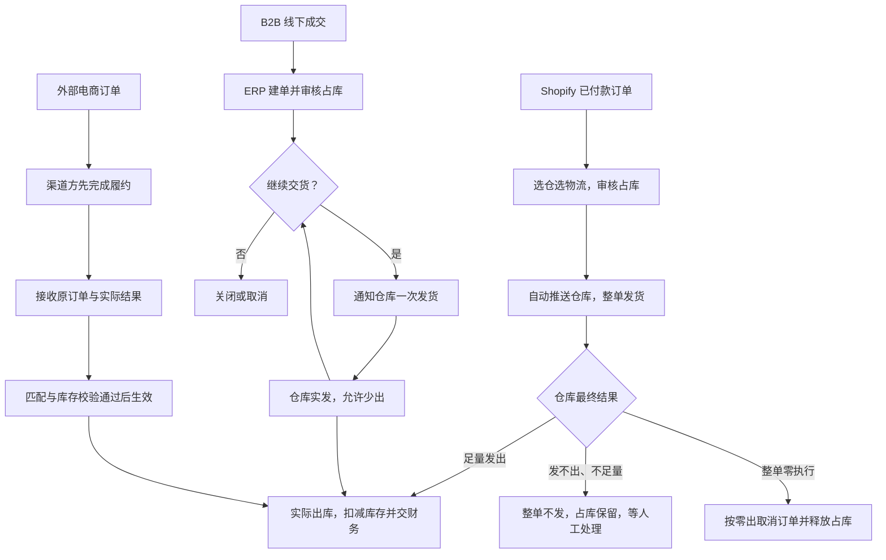
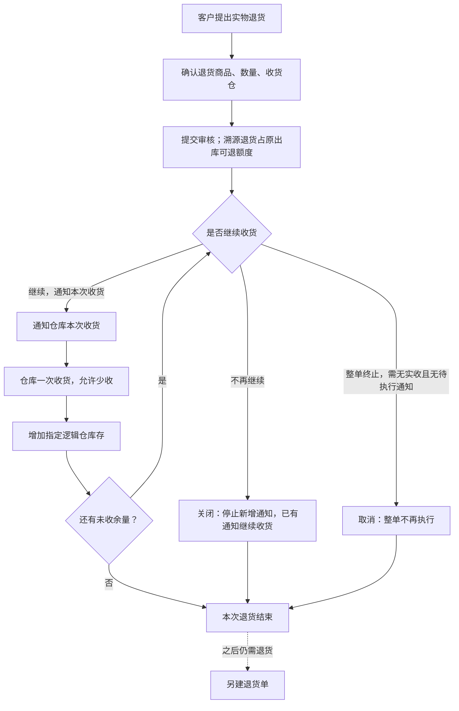

# 销售与履约业务设计

本文说明三类销售（B2B、Shopify 独立站、外部电商）各自怎么接单、怎么安排仓库交付、怎么处理退货和终止，以及实际结果怎么交给库存和财务。

> 版本：V0.6｜编写日期：2026-09-14｜状态：业务设计初稿，待走查。
> 内容依据已确认的需求整理，未确认的事项集中在文末。文中的数量示例只用于解释规则，不是实际经营数据。

输入来源：[销售与履约需求调研](../02-需求调研和分析/04-销售与履约/销售与履约需求调研.md)、[销售与履约需求分析](../02-需求调研和分析/04-销售与履约/销售与履约需求分析.md)。公共概念和跨域交接见[强盛科技一期业务蓝图](00-业务蓝图.md)，单据分层与状态职责见[强盛ERP的单据分层设计](../01-全局背景信息/5.强盛ERP的单据分层设计.md)，库存与预占规则见[库存与仓储需求分析](../02-需求调研和分析/03-库存与仓储/库存与仓储需求分析.md)，取价规则见[价格管理需求分析](../02-需求调研和分析/06-价格管理/价格管理需求分析.md)，客户与物流资料规则见[商品与主数据需求分析](../02-需求调研和分析/01-商品与主数据/商品与主数据需求分析.md)。这些文档已经写清楚的规则，本文只引用，不再重复。

## 一、业务定位与范围

销售要回答清楚：客户订了什么、为谁预留了多少、实际发出多少、哪些还要继续、哪些已经终止，以及实物退货和售后怎么办理。

三条渠道的经营方式不同，谁接单、谁预留库存、谁安排发货、售后找谁都不同，一期不强行统一：

| 业务类型 | 谁接单和安排履约 | 本期处理范围 |
| --- | --- | --- |
| B2B | 销售线下成交，在 ERP 建单、审核并安排仓库执行 | 一次或分批交付、自提、缺量、关闭与取消、实物退货 |
| Shopify 独立站 | ERP 拉取已付款订单，业务人员选仓选物流并审核 | 一单一仓、整单履约、反馈发货结果、换仓换物流、退货 |
| 其他外部电商 | 聚水潭、领星及对应仓库完成履约 | 保留原订单和各次实际结果，归集库存与财务信息，不接管履约 |

三类渠道只在“实际出库”这一步汇合：B2B 和独立站的结果由 ERP 安排产生，外部电商的结果由渠道方产生后归集进来。

报价合同、信用强制拦截、ERP 执行退款、平台费用和回款对账都不在一期范围。Amazon 目前按 FBA 消费者销售处理，提前备货到 FBA 属于库存转移，不是销售出库。国内平台的“自营”指强盛自己经营店铺，不是向平台批量供货。依据：《销售与履约需求分析》SAL-FR01、SAL-FR07～SAL-FR11。

## 二、参与角色

| 角色 | 负责什么 | 在哪些单据上做什么 | 必须交出什么 | 补充说明 |
| --- | --- | --- | --- | --- |
| 客户与物流资料维护方 | 维护客户档案和物流资料 | 客户档案、物流商与物流服务产品 | 审核通过并启用的客户、可用的物流选择 | 上游准备；见《商品与主数据需求分析》MD-FR04、MD-FR05 |
| B2B 销售人员 | 线下谈妥商品、数量、价格，记录成交，按客户要求安排发货和退货 | 销售订单（创建、提交、改交期、关闭／取消）、销售发货通知单（创建）、销售退货单（创建、提交、终止） | 已记录的成交约定、本次发货安排、退货安排 | 主责角色 |
| 销售负责人 | 审核销售订单和销售退货单，不增加财务强制放行 | 销售订单、销售退货单（审核、退回） | 允许执行，或退回修改 | 具体岗位待确认 |
| 独立站业务人员 | 拉取已付款订单后选仓选物流，审核并处理缺货、改仓、取消、退货 | 独立站的销售订单（审核、调整、取消审核） | 发给仓库的执行要求、回给 Shopify 的发货结果 | 主责角色 |
| 客户／消费者 | 提出交付、取消和售后诉求 | 不直接操作 ERP | 交付要求、取消和售后诉求 | 诉求本身不代表仓库已停止执行 |
| 渠道履约方 | 完成外部电商的正向和售后业务 | 渠道侧订单与售后单据 | 原订单、各次实际结果及来源关联 | 外部执行方 |
| 仓库作业方 | 凭通知或订单发货、收货，确认取消能否成功，回传实际数量和物流结果 | 销售发货通知单、独立站销售订单、销退收货通知单（执行、回传） | 实际数量、执行结束、取消结果、物流信息 | 外部执行方 |
| 财务 | 接收已确认的实物结果，办理收退款和核算 | 销售出库单、销退入库单 | 财务处理结果 | 收退款、平台费用按既定财务分工办理 |
| 集成与异常处理方 | 维护商品、仓库等外部映射，处理结果回传和推送异常 | 映射关系、异常记录 | 修复后的结果或异常处理记录 | 岗位待确认；成功后的异常更正按 FIN-FR03、INT-FR03 归技术运维 |

提交和审核权限、是否允许本人审核自己创建的数据，沿用[公共能力与系统管理需求分析](../02-需求调研和分析/08-公共能力与系统管理/公共能力与系统管理需求分析.md) COM-FR01、COM-FR02。本文不设计角色权限矩阵。销售审核岗位、异常处理责任岗位还没有确认，这里不指定。

## 三、业务场景

销售场景分四类：主场景、分支场景、辅助场景、异常场景。本节只列场景和关键分支，过程细节见第四节，异常后果见第七节。

### 3.1 主场景

| 场景 | 发生条件 | 参与方 | 主要步骤和判断点 | 业务结果 | 后续环节 |
| --- | --- | --- | --- | --- | --- |
| B2B 成交并交付 | 与客户线下谈妥，商品和价格可查；库存不足时不能完成审核 | 销售人员、销售负责人、仓库 | 建单（不同仓库或交期拆单）→ 审核占库 → 按客户要求通知仓库 → 仓库一次发货 | 本次出库结果 | 继续安排剩余量，或结束 |
| 独立站订单履约 | Shopify 出现已付款订单 | 独立站业务人员、仓库 | 拉单 → 选仓选物流 → 审核占库并自动推送 → 仓库整单发货 | 出库结果和运单信息 | 把发货结果告诉 Shopify，并交财务 |
| 外部电商结果归集 | 渠道方已经完成接单、发货或售后 | 渠道履约方、系统 | 接收原订单与实际结果 → 匹配与库存校验 → 生效记账 | 库存增减和财务输入 | 推送金蝶 |

### 3.2 分支场景

| 场景 | 发生条件 | 参与方 | 主要步骤和判断点 | 业务结果 | 后续环节 |
| --- | --- | --- | --- | --- | --- |
| 分批交付、不同地址 | 客户要求分次交付或改收货地址；订单已审核 | 销售人员、仓库 | 每次新建一张通知，沿用订单仓库、本次地址可不同 | 各次出库结果，剩余量继续安排 | 继续安排或结束 |
| 自提 | 客户上门提货；订单已审核 | 销售人员、仓库 | 仍要先有订单和通知，仓库凭单放货 | 出库结果 | 同普通交付 |
| 少出与补发 | 本次实出少于通知量；本次通知已经结束 | 销售人员、仓库 | 少出部分回补可安排量，补发另建通知 | 可安排量回补，本次不再补发 | 销售人员另建通知 |
| 关闭余量 | 客户不再需要剩余部分，或到交期仍未交完 | 销售人员，或系统按到期条件 | 关闭后不再新增通知，已经发出的继续执行 | 剩余量不再安排，已发生结果保留 | 需要时新建订单 |
| 取消订单 | 整单不再执行；没有实际出库，也没有仍需处理的通知 | 销售人员、仓库 | 还没交给仓库、或推送没成功的通知随单取消；已交给仓库的部分先取得仓库取消成功 | 整单终止，释放相应预占 | 需要时新建订单 |
| 独立站换仓换物流 | 需要改发货仓或物流方式；订单还没有最终执行结果 | 独立站业务人员、仓库 | 未推送时取消审核、释放占库、改后重审；已推送先取得仓库取消成功再改 | 原订单保留，换仓后作为新的执行 | 重新审核并自动推送 |
| 独立站整单零执行 | 仓库最终回传实发为 0 | 独立站业务人员、仓库 | 按零出取消订单并释放占库；不生成零数量出库单 | 订单终止，占库释放 | 取消后能否调整重执行待确认 |
| 实物退货 | 客户要求退回实物；原出库存在或允许无来源 | 销售人员、仓库 | 确认退货内容 → 审核 → 通知仓库分次收货 → 实际退回增加库存 | 退货入库结果 | 交财务，必要时品质调拨 |
| 退货终止 | 需要停止剩余退货；已退部分继续有效 | 销售人员、仓库 | 关闭停止新增通知，释放未执行部分的可退额度；取消要求无实收且无待执行通知 | 剩余额度释放或整单终止 | 需要退货时另建退货单 |

### 3.3 辅助场景

| 场景 | 发生条件 | 参与方 | 主要步骤和判断点 | 业务结果 | 后续环节 |
| --- | --- | --- | --- | --- | --- |
| 客户与物流资料准备 | 新客户首次成交，或需要选择新的物流方式 | 客户与物流资料维护方、销售人员 | 客户审核通过并启用后才能用于新业务；物流资料启用即可用，自提不选物流产品 | 可用于建单的客户和物流选择 | 建单 |
| 拉取 Shopify 已付款订单 | Shopify 产生已付款订单 | 独立站业务人员、系统 | 只拉已付款订单，未付款的进入不了 ERP | 待处理的独立站订单 | 选仓选物流 |
| 物流选择与结果回传 | 非自提发货 | 销售人员／独立站业务人员、仓库 | 选择具体物流服务产品，或选“由仓库指定”；实际物流由仓库或渠道方反馈 | 运单号和物流结果记在业务单据上 | 交付完成 |
| 退货截止时间维护 | 退货需要延长或缩短可退时间 | 销售人员 | 退货审核后只能调整截止时间，不改其他内容 | 截止时间更新 | 按新时间继续退货 |

### 3.4 异常场景

异常场景按触发条件识别，业务后果、责任方和恢复方式统一在第七节说明，本节不重复。

| 场景 | 触发事件 | 前置 |
| --- | --- | --- |
| 客户已申请取消，但仓库拒绝 | 仓库反馈拒绝取消 | 通知已交给仓库 |
| 独立站无法足量发出 | 仓库反馈不能整单发出 | 订单已推送仓库 |
| 外部结果商品或仓库不明 | 商品或逻辑仓无法匹配 | 渠道已回传结果 |
| 外部已出库，但 ERP 库存不足 | 来源出库数量大于本地可用 | 渠道已回传结果 |
| 重复回传或人工重试 | 同一结果再次到达 | 原结果已经处理成功 |
| 来源修改已完结结果 | 渠道方要求更新已经生效的结果 | 原结果已完结 |
| 金蝶接收失败 | 结果单推送未成功 | 结果单已生成并已审核 |

## 四、核心业务流程

### 4.1 三条渠道总览

三条路径只在“实际出库”汇合。B2B 和独立站由 ERP 审核占库、安排仓库执行；外部电商的履约在渠道方完成，ERP 不补做事前预占，也不再次触发仓库发货。独立站不足量时整单不发、保留占库，只有收到明确的整单零执行结果才按零出取消。依据：《销售与履约需求分析》SAL-FR01、SAL-FR02、SAL-FR07～SAL-FR09。

### 4.2 B2B：从成交到出库

| 步骤 | 参与方及业务动作 | 产生的业务结果与交接 |
| --- | --- | --- |
| 1. 确认成交 | 销售与客户线下谈妥商品、数量、价格；大单的报价和合同也在线下完成 | 记录一仓一交期的成交约定；不同仓库要拆单 |
| 2. 审核与预留 | 销售负责人审核，检查库存够不够 | 审核通过才预留整单库存；缺货可先留着，但不能完成审核占库 |
| 3. 安排本次交付 | 销售按客户要求一次或分批通知仓库 | 每次一张通知，沿用订单仓库，本次地址可以不同；自提也要有单 |
| 4. 实际出库 | 仓库执行一次发货并确认结束 | 按实出减少即时库存和对应预占，允许少出 |
| 5. 核对与后续安排 | 销售核对实际结果；订单没关闭时可以继续安排剩余量 | 少出部分回补可安排量，补发另建通知 |
| 6. 结果交接 | 保存实际出库凭证和物流结果 | 已审核的出库结果交给金蝶；订单和通知不作为实际结果传递 |

已审核的 B2B 订单不改数量、不改价格，可以调整交期；录错了只能按取消条件取消后新建，不能撤回审核直接改。欠款和信用额度一期只提醒、不拦发货。依据：《销售与履约需求分析》SAL-FR01～SAL-FR04、SAL-FR10。

### 4.3 B2B 的关闭与取消

- **关闭：不再新增通知，已经安排的继续执行到底。** 关闭只释放还没安排出去的那部分占库，执行中通知占用的部分保留，通知结束后再释放少出的余量。关闭不可撤销，也不能反关单。
- **取消：整张订单不再执行。** 没有实际出库、也没有仍需执行的通知时才能取消；已经交给仓库的通知要先处理。各种情况下释放什么、保留什么，见 6.2 的表。
- **取消的判定不替代仓库确认。** 申请取消只是请求，要等仓库回话，不能提前回补数量或认定取消成功。
- 关闭的触发方式有两种：手工关闭，以及交期或退货截止时间过了再加 T+2 自动关闭；T+2 是自然日还是工作日、具体时点还没定。独立站不适用这套到期规则。

已经发生的出库结果不属于取消对象。依据：《销售与履约需求分析》SAL-FR03、SAL-FR04。

### 4.4 销售退货

- 退货可以关联原销售出库（溯源退货），也可以没有来源、手工填写。溯源退货必须沿用原单仓库，无来源退货可以指定收货仓。
- 审核确认后才通知仓库，之后按批收货；一张通知只收一次，允许少收，但不超过通知量。
- 溯源退货在审核时占用原出库的可退额度，草稿不占。这里占的是“还能退多少”，不是预占待发库存。
- 实物退回增加事先指定的逻辑仓库存；如果实际品质和预期不同，先按指定仓收下，再由库存业务办理品质调拨，不直接改原退货入库的归属。
- 有来源的退货累计不能超过原实际出库量，其他已经审核、正在办理的退货也占额度。关闭或取消只释放没有退、也没有通知继续执行的部分；已经退回来的实物继续计入累计。
- 审核后只能调整退货截止时间，其他业务内容不改。补发或换货新建销售订单，不恢复原订单的交付额度；外部渠道方自己办理的补发、换货按来源接收，不套用这条规则。

依据：《销售与履约需求分析》SAL-FR05、SAL-FR06。

### 4.5 独立站：从拉单到发货

| 步骤 | 参与方及业务动作 | 产生的业务结果与交接 |
| --- | --- | --- |
| 1. 拉取订单 | 系统从 Shopify 拉取已付款订单 | 待处理的独立站订单，未付款的不进入 |
| 2. 选仓选物流 | 业务人员人工批量确认仓库和物流 | 准备好本次执行方式 |
| 3. 审核占库 | 审核成功后预留库存；库存不足不能审核，补货或换仓后重审 | 订单直接作为给仓库的执行要求，系统自动推送 |
| 4. 仓库发货 | 仓库按整单发货，一单一仓、不分批、不缺量 | 足量发出后把发货结果和运单号反馈给 Shopify |
| 5. 不足量时 | 仓库无法足量发出时整单不发，占库继续保留，等人工处理 | 不生成出库单，也不推金蝶 |
| 6. 整单零执行 | 收到仓库明确、最终的整单零执行结果 | 按零出取消订单并释放占库，实发为 0、差额等于订购数量，不生成零数量出库单 |

换仓或换物流时保留原订单：还没推送给仓库的，取消审核、释放占库，改完重新审核；已经推送的，先取得仓库取消成功，再释放占库并调整。取消审核有两种用途：终止订单的落为已取消，调整后重新执行的回到草稿／待提交继续编辑。重新审核后按一次新的仓库执行自动推送；上一次的执行记录、取消用途和回执都保留，之后才到达的回传仍算在上一次执行下。这个处理不推广到 B2B，B2B 不能撤回审核。

消费者提出取消时，系统先自动尝试；需要仓库执行的，要等仓库确认，不能提前向 Shopify 认定取消成功。仓库拒绝就恢复原来的执行状态继续发货；确实要停的，由人工介入拦截。独立站的退货走销售退货链路，ERP 不执行退款；Shopify 接口没覆盖的订单可以人工导入，仍要遵守对应业务的校验。

依据：《销售与履约需求分析》SAL-FR07、SAL-FR08，[系统集成需求分析](../02-需求调研和分析/07-系统集成/系统集成需求分析.md) INT-FR06。

### 4.6 外部电商：结果归集

| 步骤 | 参与方及业务动作 | 产生的业务结果与交接 |
| --- | --- | --- |
| 1. 渠道方履约 | 聚水潭、领星及对应仓库完成接单、发货、售后 | 渠道侧已经发生的订单和单据 |
| 2. 接收结果 | ERP 接收原订单和各次实际结果 | 原订单只作追溯，不提前占库、不触发仓库发货 |
| 3. 校验与生效 | 商品、库存归属和库存校验通过后自动生效 | 对应逻辑仓的库存增减，进入金蝶推送 |
| 4. 售后拆分 | 售后按来源实际单据拆分接收，来源两张就保留两张 | 不强造同一售后的关联 |
| 5. 仅退款 | 没有实物流转 | 不增加库存，不生成供应链单据 |

第三方仓实际发出的货，不重复扣深圳自营仓。成交优惠后金额和退货金额沿用来源，缺必要金额按异常处理，不自行补价。依据：《销售与履约需求分析》SAL-FR09～SAL-FR12。

### 4.7 辅助流程：资料准备与物流

- **客户与物流资料准备**：新客户要审核通过并启用后才能用于新销售业务；国内电商和跨境电商分别使用通用 2C 客户，独立站用跨境电商的通用客户，不按消费者逐一建档案。物流商和服务产品不审核，启用即可用。
- **拉单与结果反馈**：独立站订单由系统按已付款条件拉取；实际发货后把履约结果和运单号反馈给 Shopify。ERP 不直连物流商取面单，物流操作由仓库或渠道方执行。
- **物流选择**：非自提发货选具体物流服务产品，或者选“由仓库指定”；自提不选物流产品。实际物流商、服务产品、运单号和轨迹由仓库或渠道方回传，记在业务单据上，不修改通用档案。
- **退货截止时间维护**：退货审核后只能调整截止时间；能不能调、由谁调，见文末待确认事项。

### 4.8 一条完整走查：B2B 1,000 件分批交付

| 步骤 | 业务动作 | 订单 | 通知 | 库存与财务 |
| --- | --- | --- | --- | --- |
| 1 | 销售与客户谈妥后建单：1,000 件，一个仓库、一个交期 | 草稿，不能安排发货 | — | 无变化 |
| 2 | 提交审核通过 | 已审核、正常；订单预占 1,000 | — | 可用量减少 1,000，库存不变 |
| 3 | 客户要求先发 600，销售代建通知并自动推送仓库 | 可安排 400 | 通知 600，等待仓库结果 | 不重复占库 |
| 4 | 仓库实发 580 并结束 | 剩余预占 420；可安排 420 | 本次结束，缺出 20 | 即时库存 −580，预占 −580 |
| 5 | 客户要求补发剩余，销售另建通知 420 | 可安排 0 | 通知 420 | 不重复占库 |
| 6 | 仓库实发 420 并结束 | 剩余预占 0；是否自动完成待确认 | 本次结束 | 即时库存再 −420 |
| 7 | 分支：第 3 步后客户不要剩下的，销售关闭余量 | 先释放未安排的 400，保留执行中的 600；实发 580 后释放 20，不恢复安排资格 | 已有通知继续执行 | 同第 4 步 |
| 8 | 分支：通知在途时客户取消，销售申请取消通知 | 等仓库结果，不提前释放 | 仓库同意 → 通知取消；订单开放则恢复安排额度、保留订单预占 | 预占按订单状态处理 |
| 9 | 分支：客户退回 100 件中的 60 件，实收 50 件后关闭 | 还能申请退 50 件 | 本次结束 | 即时库存 +50 |

这张表把三个容易混淆的数量分开了：订单预占、可安排量、累计实出；退货部分另外说明“可退额度”和“已退回数量”不是一回事。

#### 独立站走查：从拉单到取消重跑

| 步骤 | 业务动作 | 订单 | 占库 | Shopify |
| --- | --- | --- | --- | --- |
| 1 | 从 Shopify 拉取已付款订单 | 待处理 | 无变化 | — |
| 2 | 人工选仓选物流，审核 | 审核通过 | 占用可用量 | — |
| 3 | 系统自动推送仓库 | 等仓库最终结果 | 不变 | — |
| 4 | 仓库回传发不出、不足量 | 整单不发，占库保留，等人工处理 | 不变 | 不反馈 |
| 5 | 确认不发了（或仓库回传整单零执行） | 按零出取消，释放占库 | 可用量恢复 | — |
| 6 | 换仓重跑：取消审核、改仓后重审 | 回到草稿／待提交，重审后生成新的执行并自动推送 | 占库随审核重新占用 | — |
| 7 | 旧执行迟到的回传 | 只更新旧执行，不推进新执行 | 不变 | — |

#### 外部电商走查：渠道已经出库

| 步骤 | 业务动作 | ERP 做什么 | 库存与财务 |
| --- | --- | --- | --- |
| 1 | 渠道方完成出库 | 接收原订单和实际结果 | — |
| 2 | 匹配商品和逻辑仓 | 通过后生成销售出库单，自动审核 | 对应第三方逻辑仓减少 |
| 3 | 分支：匹配不上或本地库存不足 | 结果挂异常，不记账、不推金蝶 | 不变 |
| 4 | 补齐映射后 | 处理原记录 | 记账并推金蝶 |

## 五、业务对象及关系

### 5.1 对象清单

| 对象 | 业务含义 | 如何识别 | 业务阶段 | 阶段结束时 |
| --- | --- | --- | --- | --- |
| 销售订单 | 客户成交约定；独立站的订单同时就是执行要求 | 单号；编码规则见[公共能力与系统管理需求分析](../02-需求调研和分析/08-公共能力与系统管理/公共能力与系统管理需求分析.md) COM-FR03（待统一规范） | 创建 → 审核占库 → 分次交付（独立站一次）→ 继续或终止 | 取消或关闭后不再新增安排；独立站可在本次结束前回到草稿调整 |
| 销售发货通知单 | 某一次交给仓库的发货要求（仅 B2B） | 来源订单及行 + 本次通知 | 创建 → 推送仓库 → 执行一次 → 结束 | 结束时按实出计算缺出；少出回补可安排量 |
| 销售出库单 | 实际发出的结果凭证 | 来源订单或通知及行 | 形成并生效 → 推送到金蝶 | 减少即时库存，作为溯源退货的依据 |
| 销售退货单 | 本次客户实物退货的安排 | 单号；可以关联原销售出库单 | 创建 → 审核占可退额度 → 分次收货 → 继续或终止 | 关闭不可重开；继续退货另建 |
| 销退收货通知单 | 某一次交给仓库的退货接收要求 | 来源退货单及行 + 本次通知 | 创建 → 推送仓库 → 执行一次 → 结束 | 少收部分回补可退额度 |
| 销退入库单 | 实际退回的结果凭证 | 来源通知及行 | 形成并生效 → 推送到金蝶 | 增加指定逻辑仓库存；不代表退款已经执行 |
| 外部原始订单及结果 | 渠道方已发生交易和履约的来源证据 | 来源单号与商品匹配关系 | 接收 → 校验 → 生效 | 保留来源拆分与关联；完结结果不跟随来源回改 |

系统状态字段和枚举见[强盛ERP的单据分层设计](../01-全局背景信息/5.强盛ERP的单据分层设计.md)，本节只列业务阶段。

### 5.2 对象关系

| 关系 | 基数与可选性 | 说明与追溯路径 |
| --- | --- | --- |
| 销售订单 → 销售发货通知单 | 1 : N | 仅 B2B；分批产生，通知沿用订单仓库 |
| 销售发货通知单 → 销售出库单 | 1 : 0..1 | 一次回传形成一张结果单；通知取消或零出时不生成 |
| 销售订单 → 销售出库单 | 1 : N（独立站 1 : 0..1） | 累计实出决定订单的交付进度 |
| 销售退货单 → 销退收货通知单 | 1 : N | 分批产生 |
| 销退收货通知单 → 销退入库单 | 1 : 0..1 | 一次回传；零收不生成结果单 |
| 销售退货单 → 销售出库单 | 0..1 : 1 | 可选关联：有来源时带出原出库信息和价格，无来源时没有这层关系 |
| 外部原始订单 → 销售出库单／销退入库单 | 1 : N | 按来源单据拆分接收，保留来源关联 |
| 销售订单 ↔ 销售退货单 | 无额度关联 | 退货不恢复原订单的交付额度，补发另建订单 |

追溯路径：从销售出库单可以查到来源订单或通知；从订单能看到它下面所有的通知和出库记录；退货单可以查到原出库单，外部结果可以查到来源订单。

### 5.3 数量关系

| 数量 | 落在哪个对象上 | 怎么变化 |
| --- | --- | --- |
| 审核占用量 | 销售订单（预占库存） | 审核通过时占用；关闭、取消、结束按规则释放 |
| 订单剩余预占 | 销售订单（计算得来） | 审核占用量 − 累计实际出库量 |
| 可安排数量 | 销售订单行（计算得来） | 订单数量 − 已结束通知的实出量 − 未结束有效通知的通知量；已取消的通知不占 |
| 实际出库数量 | 销售出库单行、通知行 | 一次回传确认，累计进订单的交付进度 |
| 缺出数量 | 通知行（计算得来） | 通知数量 − 实际出库数量；不回原通知补发，需要另建通知 |
| 可退额度 | 原销售出库单 | 溯源退货审核时占用；取消或关闭释放未退部分；已退部分继续计入 |
| 退货可安排数量 | 销售退货单行（计算得来） | 退货数量 − 已结束通知的实收数量 − 未结束有效通知的通知量 |
| 实际退回数量 | 销退入库单行 | 一次回传确认，增加指定逻辑仓库存 |

## 六、核心业务规则

### 6.1 库存预留与可安排数量分开

对 B2B 同一 SKU、没有关闭或取消释放时：

**订单剩余预占 ＝ 审核占用量 − 累计实际出库量**

**可安排数量 ＝ 订单数量 − 已结束通知的实出量 − 未结束有效通知的通知量**

通知下发不重复占库，少出回补的也只是安排额度，不是重新占库。订单 1,000 件、通知 600 件、实发 580 件并结束，剩余预占和可安排量都是 420 件；如果在通知执行前关闭，先释放未安排的 400 件，保留执行中的 600 件，实发 580 件后消耗对应预占，再释放少出的 20 件。依据：《销售与履约需求分析》SAL-FR02、SAL-FR03，示例 SAL-AC03、SAL-AC04。

### 6.2 关闭与取消不能替代仓库确认

| 情况 | 业务结果 |
| --- | --- |
| 没有通知，或者通知还没交给仓库、推送没成功 | 可以取消订单，通知一起取消并释放相应预占 |
| 有已经交给仓库、还没取消成功的通知 | 不能直接取消订单 |
| 已向仓库申请取消通知 | 等仓库结果，不提前回补或释放 |
| 仓库取消成功，订单还开放 | 恢复该通知的安排额度，保留订单预占 |
| 仓库取消成功，订单已关闭 | 释放相应预占，不恢复安排资格 |
| 仓库拒绝取消 | 恢复取消前的执行状态，继续发货 |

B2B 支持手工关闭，以及交期或退货截止时间过后 T+2 自动关闭；T+2 是自然日还是工作日、具体时点待确认。独立站不套用 B2B 的到期规则。依据：《销售与履约需求分析》SAL-FR03、SAL-FR04、SAL-FR06。

### 6.3 独立站的取消审核与调整

独立站的订单自己就是执行要求，取消审核不套用通知单那一套：还没推送给仓库时，直接取消审核并释放占库；已经推送的，先取得仓库取消成功。取消审核用于终止订单的，落为已取消；用于调整后重新执行的，回到草稿／待提交继续编辑，原订单不新建。重新审核后作为新的仓库执行，系统自动推送；旧执行、取消回执和之后才到达的回传留在原执行下。依据：《销售与履约需求分析》SAL-FR08、SAL-AC10、SAL-AC11。

### 6.4 退货额度与价格

原实出 100 件，审核办理退货 60 件，收到 50 件后关闭，且没有其他执行中的通知：已退的 50 件继续计入累计，没退的 10 件释放，还能再申请退 50 件。不能只扣已经入库的数量，而忽略其他正在办理的退货。依据：《销售与履约需求分析》SAL-FR06、SAL-AC08。

B2B 取价按具体客户价、客户等级价、所有客户基准价的顺序匹配，都不匹配再手工填写；溯源退货优先用原出库价，缺价或没有来源时可以手工填写，也可以查当前销售价。草稿阶段可以改本单价格和税率，提交后锁定；零价确认、币别和匹配条件变化按[价格管理需求分析](../02-需求调研和分析/06-价格管理/价格管理需求分析.md) PRI-FR03～PRI-FR07 执行。外部电商用来源金额，不套这套顺序；独立站订单金额怎么接入、怎么修改，按接口和业务后续确认，不擅自按 B2B 重定价。

### 6.5 仓库、物流与财务交接

有原单时沿用原单的逻辑仓，没有原单的按来源和映射识别，不因为仓库主动回传就重新指定库存归属。非自提可选物流服务产品，也可以由仓库指定；自提不选物流产品。

销售出库和销退入库的已审核结果逐单交给金蝶，订单、退货安排和通知都不传。更细的规则见[商品与主数据需求分析](../02-需求调研和分析/01-商品与主数据/商品与主数据需求分析.md)的“仓库结构与单据链路确认”“物流设计确认补充”，以及[结算与业财需求分析](../02-需求调研和分析/05-结算与业财/结算与业财需求分析.md) FIN-FR01～FIN-FR04。

## 七、特殊与异常场景

本节汇总异常的触发条件、业务后果、责任方和恢复方式；完整规则见第四节和第六节，这里不重复展开。表里的“责任方”和“能否恢复”两列就是每个异常的后续环节：能恢复的按恢复方式继续，不能恢复的另办单据。

| 情形 | 触发条件 | 业务后果 | 责任方 | 能否恢复 |
| --- | --- | --- | --- | --- |
| B2B 缺量发货 | 本次实出少于通知量 | 本次通知结束，少出部分回补可安排量；独立站不能按这个办法少发 | 仓库回传实际数量，销售另建通知 | 能：另行安排补发 |
| 独立站无法足量发出 | 仓库反馈不能整单发出 | 整单不发，占库继续保留，等人工处理 | 独立站业务人员 | 能：补货或换仓后重新审核 |
| 独立站整单零执行 | 仓库最终回传实发为 0 | 按零出取消订单并释放占库，不生成零数量出库单 | 仓库回传结果，业务人员决定后续处理 | 待确认：取消后能否调整重执行 |
| 客户已申请取消，仓库拒绝 | 仓库反馈拒绝取消 | 不认定取消成功，继续执行；确实要停由人工介入 | 仓库、独立站业务人员或销售人员 | 不能：需要人工拦截 |
| 退回商品品质不同 | 实际退回的品质与预期不符 | 先按事先指定的逻辑仓收下，再办理品质调拨 | 仓库接收，库存业务办理调拨 | 能：通过调拨处理 |
| 外部结果商品或仓库不明 | 商品或逻辑仓无法匹配 | 暂不生效、不记账、不推金蝶，补齐后处理原记录 | 集成与异常处理方（待确认） | 能：补齐后继续 |
| 来源已出库 10 件，本地只有 5 件 | 来源出库数量大于本地可用 | 本地记账失败，不允许负库存，不推金蝶 | 集成与异常处理方（待确认） | 能：核实并解决差异后继续 |
| 重复回传或人工重试 | 同一结果再次到达 | 已经成功的业务不重复记账，不再次触发已经完成的仓库履约 | 系统；集成与异常处理方（待确认） | 能：按幂等处理，不产生重复单据 |
| 来源修改已完结结果 | 渠道方要求更新已生效结果 | 不覆盖原结果；后续来源形成的新单按其含义单独处理，不预设冲销方案 | 渠道履约方、集成维护方 | 不能：原结果不改，另走新单 |
| 金蝶接收失败或成功后异常 | 推送未成功，或成功后发现异常 | 失败不回滚库存，修复后重试原单；成功后的异常修复属于技术运维，不是普通业务人员改原结果的入口 | 技术运维 | 能：重试原单 |

### 待确认事项

“业务先确认”的解释见《强盛科技一期业务蓝图》§七；下表按处理阶段列出还没定的事。

| 事项 | 需要确认什么 | 来源 | 处理阶段 |
| --- | --- | --- | --- |
| 完成与到期 | B2B 全部交付后是否自动完成；T+2 是自然日还是工作日、具体执行时点 | [销售与履约需求分析](../02-需求调研和分析/04-销售与履约/销售与履约需求分析.md) §七 | 业务先确认 |
| 独立站变更 | 拉单后商品、数量、地址变化的接收与处理 | 销售与履约需求分析 §七 | 业务先确认；同步协议随后设计 |
| 独立站金额 | 订单金额怎么接入、能不能修改（需求分析里没有这条，属于新增确认点） | 销售与履约需求分析 SAL-FR10 只覆盖外部电商金额 | 业务先确认 |
| 独立站零执行 | 零执行取消后是终止订单，还是允许调整重执行 | 销售与履约需求分析 §七 | 业务先确认 |
| 无来源退货 | 数量及业务约束；不能套用有来源退货的原实出额度 | 销售与履约需求分析 §七 | 业务先确认 |
| 取消协作 | 取消超时、关闭与回传同时发生等系统边界 | 销售与履约需求分析 §七 | 业务结果已确认；并发及超时机制随后设计 |
| 来源与结果关联 | 未完结来源的变化、售后拆分、完结标识和实际接口覆盖 | 销售与履约需求分析 SAL-FR09、SAL-FR12 | 接口设计前核验；缺少依据时回到业务确认 |
| 价税与财务 | 来源币别税费、金额字段和金蝶目标核算映射 | 销售与履约需求分析 §七、《价格管理需求分析》§七 | 先确认价税怎么算；字段映射随后设计 |
| 角色与责任岗位 | 销售订单、退货单的审核岗位；异常和结果处理的责任岗位 | [强盛科技一期业务蓝图](00-业务蓝图.md) §二、COM-FR01 | 详细产品设计前 |

《销售与履约需求分析》末章还列着“可用库存具体口径”待确认，但[库存与仓储需求分析](../02-需求调研和分析/03-库存与仓储/库存与仓储需求分析.md) INV-FR01 已经明确“即时－预占－冻结”，本文直接引用这个结论，不重新提问；并发和操作细节继续留给设计阶段。

本文可用于按 B2B、独立站、外部电商三条渠道分别走查；还没定下来的边界，不等于业务设计已经全部确认。对应的业务验收例子见《销售与履约需求分析》SAL-AC01～SAL-AC22。
