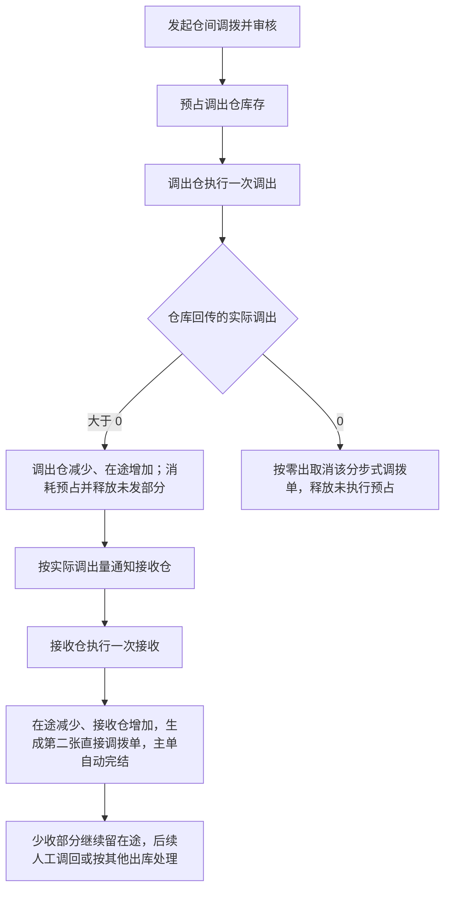

# 库存与仓储业务设计

本文说明商品归谁、放在哪里、有多少可以使用，每次实际收发和转移怎么改变这些数量，以及盘盈盘亏、在途差异和库存比对怎么处理。

> 版本：V0.9｜编写日期：2026-09-15｜状态：业务设计初稿，待走查。
> 内容依据已确认的需求整理，未确认的事项集中在文末。文中的数量示例只用于解释规则，不是实际库存数据。

输入来源：[库存与仓储需求调研](../02-需求调研和分析/03-库存与仓储/库存与仓储需求调研.md)、[库存与仓储需求分析](../02-需求调研和分析/03-库存与仓储/库存与仓储需求分析.md)。公共概念见[强盛科技一期业务蓝图](00-业务蓝图.md)，采购和销售的特有规则见[采购业务设计](01-采购业务设计.md)、[销售与履约业务设计](02-销售与履约业务设计.md)，单据分层与状态职责见[强盛ERP的单据分层设计](../01-全局背景信息/5.强盛ERP的单据分层设计.md)。这些文档已经写清楚的规则，本文只引用，不再重复。

## 一、业务定位与范围

库存要回答清楚：商品在哪个逻辑仓、有多少可以用、每次实际收发和转移让数量发生了什么变化。它服务采购、销售、仓储运营和数据分析；能查库存不代表所有人都有相同的数据权限。

| 交接方向 | 上游给库存什么 | 库存交给下游什么 |
| --- | --- | --- |
| 主数据 | 实体仓、逻辑仓、库存状态 | 逻辑仓库存的归属依据 |
| 采购 | 采购入库、采退出库的实际结果 | 对应逻辑仓的库存增减 |
| 销售 | 销售出库、销退入库的实际结果和预占要求 | 可用量校验、原单逻辑仓 |
| 仓库／WMS | 实际收发、盘点、品质调整的结果 | 其他出入库和调拨的执行要求 |
| 财务／金蝶 | — | 已审核的其他入库、其他出库、直接调拨结果 |

本期覆盖自营和第三方仓的逻辑库存、预占与冻结、其他出入库、仓间直接调拨与分步式调拨、在途和库存比对。仓内收货、上架、拣货、盘点由仓库或WMS执行，ERP不建盘点单，也不接管外部电商履约。

采购未入库的数量不记入库存，也不在库存里展示；全量库存双向同步、跨渠道配额、多主体之间的购销与调拨（范围口径见《强盛ERP需求分析总览》§3.1）、头程物流不在一期范围。库存上线必须有一个起点，期初数量、截点和迁移另行实施。

## 二、参与角色

| 角色 | 负责什么 | 在哪些单据上做什么 | 必须交出什么 | 补充说明 |
| --- | --- | --- | --- | --- |
| 主数据维护方 | 维护实体仓和逻辑仓 | 实体仓、逻辑仓档案 | 审核通过并启用的仓库档案 | 上游准备；见[商品与主数据需求分析](../02-需求调研和分析/01-商品与主数据/商品与主数据需求分析.md) MD-FR03 |
| 采购、销售及其他库存使用人员 | 根据库存判断采购或交付，提出所属业务的收发安排 | 所属业务的单据（引用库存，不直接改库存） | 业务安排和预占要求 | 主责业务在采购、销售两篇 |
| 其他收发与调拨的办理及审核人员 | 办理其他出入库、调拨并提交审核 | 其他出入库申请单、分步式调拨单、直接调拨单 | 经审核的执行要求 | 具体岗位待确认 |
| 调出仓与接收仓 | 执行调拨通知，分别确认实际发出和实际收到 | 调出通知单、调入通知单（执行、回传） | 实际数量、执行结束 | 外部执行方 |
| 仓库作业方 | 执行盘点和其他实际变动，提供已完成的结果 | 仓库侧单据（回传结果） | 盘盈盘亏、品质调整等实际结果 | 外部执行方 |
| 仓储运营 | 核对账面库存和仓库数量，识别差异 | 库存比对视图 | 差异清单和处理意见 | 差异处置的最终责任待明确 |
| 财务 | 接收库存实际结果，由金蝶进行成本核算 | 其他出入库结果、直接调拨结果 | 财务处理结果 | 成本核算在金蝶 |
| 集成与异常处理方 | 维护商品、仓库等外部映射，处理结果回传和推送异常 | 映射关系、异常记录 | 修复后的结果或异常处理记录 | 岗位待确认；推送失败的修复按FIN-FR03、INT-FR03归技术运维 |

人工确认无法自动取得的仓库结果时，仍要以实际发生的情况为准，不能把关闭或取消申请当成仓库执行成功。依据：《库存与仓储需求分析》§五、[系统集成需求分析](../02-需求调研和分析/07-系统集成/系统集成需求分析.md) INT-FR06。

## 三、业务场景

库存场景分四类：主场景、分支场景、辅助场景、异常场景。本节只列场景和关键分支，过程细节见第四节，异常后果见第七节。

### 3.1 主场景

| 场景 | 发生条件 | 参与方 | 主要步骤和判断点 | 业务结果 | 后续环节 |
| --- | --- | --- | --- | --- | --- |
| 查看库存、判断可用量 | 采购、销售或仓储运营需要知道某个逻辑仓还有多少能用 | 库存使用人员 | 按逻辑仓看即时、预占、冻结和可用数量 | 可用的数量结论 | 用于采购、交付或分析 |
| 购销实际结果记账 | 采购入库、采退出库、销售出库、销退入库的实际结果回传 | 仓库、采购或销售 | 校验商品与归属后记入对应逻辑仓 | 库存增减、进入金蝶推送 | 交财务 |
| 跨仓备货 | 深圳要向东莞、FBA或海外仓备货 | 调拨办理人、调出仓、接收仓 | 审核预占调出仓 → 调出仓实发 → 在途 → 接收仓实收 | 两端库存变化，差异留在途 | 主单自动完结，差异另行处理 |
| 库存比对 | 仓储运营要核对账面数量和仓库数量 | 仓储运营、仓库 | 同实体仓、同SKU、同库存状态汇总后比较 | 差异清单，不自动改账 | 人工查明原因 |

### 3.2 分支场景

| 场景 | 发生条件 | 参与方 | 主要步骤和判断点 | 业务结果 | 后续环节 |
| --- | --- | --- | --- | --- | --- |
| 同仓品质调整 | 正常品、待检品、残次品之间需要转仓 | 业务办理人，或仓库 | 来源逻辑仓减少、目标逻辑仓增加，不经过在途 | 两个逻辑仓一减一增 | 无需外部执行 |
| 仓库盘盈盘亏 | 仓库盘点后发现实际数量与账面不同 | 仓库、仓储运营 | 盘盈归其他入库，盘亏归其他出库，校验通过后直接生效 | 库存增减，不补申请和通知 | 交财务，并查明原因 |
| 库存冻结与解冻 | 需要限制某部分库存的使用 | 有权限的人员（岗位待确认） | 冻结只能取可用量，不能重复冻结已预占或已冻结的部分 | 可用量减少；解冻后恢复 | 解除冻结 |
| 调拨少收 | 接收仓实收少于调入通知量 | 调出仓、接收仓 | 在途按实收减少，差额继续留在途 | 差异保留，不自动抹平 | 人工调回，或按其他出库处理 |
| 调拨零调出 | 仓库回传实际调出为0 | 调拨办理人、调出仓 | 按零出取消该分步式调拨单，释放未执行预占 | 调拨取消，库存不变 | 需要时重新发起 |
| 调拨零调入 | 仓库回传实际调入为0 | 调拨办理人、接收仓 | 不允许零调入；回传0属于异常，不按零收自动取消通知单 | 调入通知单卡在无法关闭的状态 | 人工介入处理 |
| 其他出入库缺量 | 实收或实出少于申请量 | 办理人、仓库 | 按实际数量一次结束，余量不回补原单 | 出库释放未用预占；申请自动完结 | 需要再办的另建申请 |
| 其他出入库中止 | 业务不再需要这次收发 | 办理人、仓库 | 未交给仓库的可以直接取消并释放预占；已交给仓库的等实际结果或仓库取消成功 | 取消后不再执行 | 需要时另建申请 |

### 3.3 辅助场景

| 场景 | 发生条件 | 参与方 | 主要步骤和判断点 | 业务结果 | 后续环节 |
| --- | --- | --- | --- | --- | --- |
| 逻辑仓准备 | 新增实体仓、逻辑仓 | 主数据维护方 | 逻辑仓挂到实体仓，选择库存状态 | 可用于收发记账的逻辑仓 | 业务引用 |
| 虚拟在途准备 | 需要办理分步式调拨 | 主数据维护方、调拨办理人 | 使用归调出仓管理的通用虚拟在途仓 | 调出后还没到的数量记在在途上 | 发起调拨；档案形式待设计 |
| 结果归属映射 | 外部或仓库主动回传实际结果 | 集成与异常处理方 | 按原单或确认的映射识别逻辑仓 | 结果能记到正确归属 | 记账并推金蝶 |
| 库存上线起点 | 系统上线前 | 实施方、仓储运营 | 先建立期初库存，再累计上线后的变动 | 有起点的库存账 | 见文末；期初和截点另行实施 |

### 3.4 异常场景

异常场景按触发条件识别，业务后果、责任方和恢复方式统一在第七节说明，本节不重复。

| 场景 | 触发事件 | 前置 |
| --- | --- | --- |
| 结果会让库存变成负数 | 即时或可用将为负数 | 实际结果已经回传 |
| 归属依据不足 | 无法确定记入哪个逻辑仓 | 实际结果已经回传 |
| 两边库存不一致 | 比对发现账面与仓库数量不同 | 已完成一次比对 |
| 用调拨替代买卖 | 要求用调拨处理买卖 | 调拨办理中 |
| 其他库存结果错误或重复 | 结果错误、重复到达 | 原结果已经处理 |
| 取消与回传同时发生 | 申请取消期间收到实际结果 | 业务已交给仓库执行 |

## 四、核心业务流程

### 4.1 购销实际结果怎么影响库存

采购实际入库和销售实际退货增加对应逻辑仓库存；销售实际出库和采购退货实际出库减少对应库存。采购订单、入库通知本身不增加库存，通知下发也不再次占库。

由ERP自己安排的销售出库、采购退货、分步式调拨和其他出库，在审核时预占可用库存；实际出库时同时减少即时库存和该业务对应的预占。直接调拨只在ERP内部记账，不涉及预占。订单和通知怎么分批、怎么少量、怎么取消和关闭，由所属业务域决定，本文不重复。

外部电商和仓库已经完成的结果不补做事前预占，通过商品、仓库归属和库存校验后再记账；缺少依据时不能随便挑一个逻辑仓。依据：《库存与仓储需求分析》INV-FR01、INV-FR04、INV-FR05、INV-FR09，以及《销售与履约需求分析》SAL-FR09。

### 4.2 分步式调拨：发出、在途、接收

| 步骤 | 参与方及业务动作 | 产生的业务结果与交接 |
| --- | --- | --- |
| 1. 确认调拨安排 | 在ERP发起调拨并审核 | 预占调出仓库存，然后通知调出仓 |
| 2. 调出仓实际发出 | 仓库一次执行并确认实出量；实出必须大于0 | 调出仓减少、在途增加；消耗实出对应的预占，释放未发部分的预占 |
| 3. 安排接收 | 按实际调出量通知接收仓，不按原计划量提前安排 | 接收仓收到本次调入要求 |
| 4. 接收仓实际接收 | 接收仓一次执行并确认实收量 | 在途减少、接收仓增加 |
| 5. 主单完结与差异处理 | 收到调入回传并生成第二张直接调拨单后，主单自动完结 | 主单完结表示两端执行链走完，不自动抹平差异，也不补建原单的分批执行 |

仓库回传实际调出为0时，这张分步式调拨单按零出取消：不生成在途、调入通知，也不生成两张直接调拨单；库存不变，主单不再推进，取消后释放未执行的预占，回传和确认记录保留。

实际调入同样必须大于0。仓库回传实际调入为0属于异常：不按零收取消通知单，这张调入通知单会卡在无法关闭的状态，需要人工介入处理。

调拨用于仓与仓之间的库存转移，不能用调拨处理买卖，具体购销方案另行确定。虚拟在途仓归调出仓管理，档案怎么挂到实体仓还待设计。实际调出和实际调入分别形成直接调拨结果并交给财务，分步式调拨主单不作为实际结果传递。

来源示例：计划调拨100件，实际发出90件，实际收到88件。审核时预占100；发出后调出仓减90、在途加90，释放未发的10；按90通知接收；收到后在途减88、接收仓加88，生成第二张直接调拨单，主单自动完结，剩下2件留在途。依据：《库存与仓储需求分析》INV-FR03、INV-AC03。

### 4.3 直接调拨与品质调整

确认实际调整后，来源逻辑仓减少、目标逻辑仓增加，不经过在途。同一实体仓里正常品、待检品、残次品等逻辑仓之间的调整都走这条链路。

直接调拨可以由两个来源发起：ERP里人工建单并提交审核，审核通过后直接记一减一增，不涉及预占；仓库先完成调整后回传，按回传生成自动审核的直接调拨单，不补做预占。两种来源都只在ERP内部处理，不推送给仓库或其他外部系统，也不生成通知单，不分批、不处理缺量。

销售退货已经指定了收货逻辑仓，即使实际品质和预期不同，也要先按指定仓收货，再办理品质调拨，不能直接改原退货入库的归属。依据：《库存与仓储需求分析》INV-FR07，《销售与履约需求分析》SAL-FR05。

### 4.4 其他入库与其他出库

业务人员提出其他收发申请，用业务类型说明原因，比如样品领用、赠送、报废。审核确认后直接推送给仓库；出库申请在审核时预占，入库申请不会因为推送就增加库存。

仓库按实际数量一次执行结束，形成其他入库或其他出库结果。允许缺量，申请自动完结，差额不回补给原单再执行一次；其他出库没用掉的预占自动释放。申请100件、实际出库90件时，即时库存和预占各扣90，再释放预占10。仓库回传零收或零出时，按零收／零出取消该申请单，不生成零数量结果单。

其他出入库不提供手动关闭，也不设到期自动关单，就等仓库回传一次结果，回来就自动完结。要中止只能取消：还没交给仓库的可以直接取消并释放预占，已经交给仓库的不能单方面释放，要等实际结果或仓库取消成功。依据：《库存与仓储需求分析》INV-FR06、INV-AC06、INV-AC12。

### 4.5 仓库主动结果与盘点

仓库先完成盘点或其他实际变动，再把结果给ERP。盘盈归其他入库，盘亏归其他出库；商品、归属和库存校验通过后直接形成生效结果，不补申请、通知，也不建ERP盘点单。品质转移仍按直接调拨处理，不放进其他出入库。

仓库回传的是实体仓的数量，不能把差额随意分摊到某个逻辑仓。有ERP原单的结果沿用原单逻辑仓；没有原单的按来源和映射识别。依据：《库存与仓储需求分析》INV-FR04。

### 4.6 库存冻结与解冻

冻结用于人工控制或异常处理，只能从可用量里取，不能重复冻结已经预占或已经冻结的部分。比如即时100、预占60、冻结10时，可用30，最多再冻结30。解冻后这部分重新计入可用量。

冻结由谁发起、异常冻结怎么触发、解冻由谁操作，都还没有确认，见文末待确认事项。依据：《库存与仓储需求分析》INV-FR05。

### 4.7 库存比对

仓储运营把同一实体仓、同一SKU、同一库存状态的多个逻辑仓的即时库存汇总起来，和仓库返回的实体仓数量比较。比较的是即时库存，不扣预占和冻结；虚拟在途不纳入比对。

比如两个正常品逻辑仓分别有60件和40件，仓库返回98件，只能得出“ERP汇总多2件”，不能判断是哪个逻辑仓少了2件。比对只展示差异，不自动分摊、也不自动生成库存调整。依据：《库存与仓储需求分析》INV-FR08、INV-AC08。

### 4.8 一条完整走查：分步式调拨

| 步骤 | 业务动作 | 调出仓 | 在途 | 接收仓 |
| --- | --- | --- | --- | --- |
| 1 | 发起调拨100件并审核 | 预占100 | — | — |
| 2 | 调出仓实发90件 | 即时减90；预占消耗90，释放未发的10 | 加90 | — |
| 3 | 按实出90件通知接收 | — | 90 | — |
| 4 | 接收仓实收88件 | — | 减88，剩2 | 加88 |
| 5 | 收到调入回传，生成第二张直接调拨单，主单自动完结 | — | 2留在途 | — |
| 6 | 差异处理 | — | 2 | 后续人工调回，或按其他出库扣减 |

这条故事说明两件事：未发的10件在第二步就释放了预占，少收的2件一直留在途；它们不是一笔差额，也不能自动抹平。依据：《库存与仓储需求分析》INV-FR03、INV-AC03。

## 五、业务对象及关系

### 5.1 对象清单

| 对象 | 业务含义 | 如何识别 | 业务阶段 | 阶段结束时 |
| --- | --- | --- | --- | --- |
| 逻辑仓库存 | 某个逻辑仓里的商品数量 | 逻辑仓 + SKU | 按实际结果增减 | 数量保留，作为后续业务和比对的依据 |
| 即时库存 | ERP库存账上的实物数量 | 逻辑仓 + SKU | 随实际收发变化 | 不保证任意时刻与仓库现场一致 |
| 预占库存 | 已审核的正常出库业务预留的数量 | 由来源业务单据产生 | 审核时占用，实际出库时消耗 | 取消、关闭或执行结束时按所属业务的规则释放 |
| 冻结库存 | 人工控制或异常处理限制使用的数量 | 由冻结操作产生 | 从可用量中冻结，解冻后恢复 | 解冻前一直限制使用 |
| 虚拟在途 | 已经从调出仓发出、还没被接收的调拨数量 | 调出仓 + 通用虚拟在途仓 | 实出增加，实收减少 | 少收的差额继续留在途 |
| 其他出入库申请单 | 一次其他收发的业务安排，同时是仓库执行依据 | 单号；编码规则见[《强盛ERP的编码规则和通用字段规则》](../01-全局背景信息/6.强盛ERP的编码规则和通用字段规则.md) | 创建 → 审核 → 推送仓库 → 执行一次 → 结束 | 结束时按实际数量收尾，余量不回补原单 |
| 其他入库／出库结果 | 非购销的实际库存变化凭证 | 来源申请单，或仓库主动回传 | 形成并生效 → 推送到金蝶 | 增加或减少对应逻辑仓库存 |
| 分步式调拨及两端结果 | 先发出、再接收的库存转移安排 | 单号 + 调出仓 + 接收仓 | 审核预占 → 调出 → 在途 → 接收 → 主单完结 | 主单完结不等于差异已清，少收仍在途 |
| 直接调拨结果 | 两个逻辑仓之间的一减一增 | 来源调拨单，或仓库回传 | 形成并生效 → 推送到金蝶 | 库存转移完成；不推送外部执行系统 |

逻辑仓归属实体仓；库存状态（正常品、残次品、待检品）不等于预占和冻结，同一库存状态可以有多个逻辑仓。依据：《商品与主数据需求分析》“仓库结构与单据链路确认”。

### 5.2 对象关系

| 关系 | 基数与可选性 | 说明与追溯路径 |
| --- | --- | --- |
| 实体仓 → 逻辑仓 | 1 : N | 逻辑仓挂在实体仓下，同一库存状态可以建多个；实体仓禁用不级联影响已有逻辑仓 |
| 逻辑仓库存 → 预占／冻结 | 1 : N | 预占和冻结都挂在具体的逻辑仓库存上，不单独成单 |
| 分步式调拨单 → 直接调拨结果 | 1 : 2 | 调出、调入各形成一张直接调拨结果 |
| 其他出入库申请单 → 结果单 | 1 : 0..1 | 一次回传形成一张结果单；零收／零出不生成 |
| 外部来源结果 → 结果单 | 1 : N | 外部或仓库主动回传，按来源拆分接收，保留来源关联 |
| 库存 → 来源业务单据 | N : 1 | 有原单的结果沿用原单逻辑仓，可回溯到采购、销售或调拨单据 |

追溯路径：从结果单可以查到来源申请单或调拨单；从逻辑仓库存的每次变化可以查到对应的实际结果单；外部结果可以查到来源单据和匹配关系。

### 5.3 数量关系

| 数量 | 落在哪个对象上 | 怎么变化 |
| --- | --- | --- |
| 即时库存 | 逻辑仓库存 | 实际入库增加，实际出库减少；通知和申请本身不改变 |
| 预占库存 | 逻辑仓库存（由来源单据占用） | 审核时占用，实际出库时消耗；取消、关闭、结束时按所属业务规则释放 |
| 冻结库存 | 逻辑仓库存 | 冻结时从可用量中占用，解冻后归还 |
| 可用库存 | 计算得来 | 即时库存 − 预占库存 − 冻结库存；负数一律阻止 |
| 实际调出量 | 调出对应的直接调拨结果 | 一次回传确认；必须大于0 |
| 在途数量 | 虚拟在途 | 实出增加，实收减少；少收的差额继续留着 |
| 实际调入量 | 调入对应的直接调拨结果 | 一次回传确认；少于调入通知量的部分是少收 |

## 六、核心业务规则

### 6.1 可用数量不能重复承诺

**可用库存 ＝ 即时库存 − 预占库存 − 冻结库存。** 已预占的正常业务实际出库时，要同时消耗对应的预占，不能只扣即时库存，否则会把可用量算错；没有对应预占的盘亏这类结果，也不能自动挪用其他订单的预占。

| 例子 | 数字 | 结论 |
| --- | --- | --- |
| 不能重复承诺 | 即时100、预占60、冻结10，可用30；再冻结31 | 阻止：最多只能冻30，已经预占或冻结的部分不能再承诺一次 |
| 不能记成负数 | 即时100、预占95；盘亏10会把可用变成 −5 | 阻止本次记账并报错，不先记负数，也不自动释放其他预占；依据：《库存与仓储需求分析》INV-FR01、INV-FR05、INV-FR09。 |

### 6.2 按已知归属记账，不猜仓库

有ERP原单时沿用原单的逻辑仓；没有原单的按来源和确认过的映射识别。即使结果是仓库主动发来的，也不能忽略已有的原单。归属依据不足时不随便选仓，也不能只按实体仓把不同货主的库存合并记账。

实体仓禁用不连带禁止已有逻辑仓的业务，已有逻辑仓按自身资格使用。逻辑仓在有库存或未完成业务时怎么禁用，还待主数据详细设计。依据：《商品与主数据需求分析》MD-FR03、MD-FR08。

### 6.3 不同业务的余量不能统一处理

| 业务 | 少量执行后的处理 |
| --- | --- |
| 采购、采购退货、B2B销售及相应退货 | 按各自规则回补可下推量，业务仍开放时可以另次通知 |
| Shopify独立站 | 不缺量发货，无法足量发出时整单不发，保留占库等人工处理 |
| 其他出入库 | 一次结束、不分批，出库释放未用预占，不回补原单再办 |
| 分步式调拨 | 每端一次结束；未发释放预占，少收保留在途 |
| 直接调拨 | 没有分批，审核后直接一减一增，不推送仓库，不涉及预占和缺量 |

一期不按正常品、待检品、残次品限制业务用途，有足够的可用数量就能办理相应出库，也不额外设一套品质处理期间的临时冻结。这些取舍来自《库存与仓储需求分析》INV-FR05，不代表实际仓库不需要品质管理。

### 6.4 财务处理与库存处理分开确认

库存这边只把已审核的其他入库、其他出库和直接调拨结果逐单交给金蝶，申请单、通知单和分步式调拨主单都不传。其他收发和调拨不传成本价格，存货成本由金蝶核算。推送失败不撤销已经生效的库存结果。

依据：《库存与仓储需求分析》INV-FR10，[结算与业财需求分析](../02-需求调研和分析/05-结算与业财/结算与业财需求分析.md) FIN-FR01～FIN-FR03。

## 七、特殊与异常场景

本节汇总异常的触发条件、业务后果、责任方和恢复方式；完整规则见第四节和第六节，这里不重复展开。表里的“责任方”和“能否恢复”两列就是每个异常的后续环节：能恢复的按恢复方式继续，不能恢复的另办单据。

| 情形 | 触发条件 | 业务后果 | 责任方 | 能否恢复 |
| --- | --- | --- | --- | --- |
| 用调拨替代买卖 | 要求用调拨处理买卖 | 不允许按调拨办理，属于购销，方案另行确定 | 业务办理人 | 不能：只能按购销另办 |
| 调拨少收 | 接收仓实收少于调入通知量 | 差额留在途，不自动抹平 | 接收仓回传，调拨办理人后续处理 | 能：人工调回或按其他出库扣减；路径和权限待定 |
| 其他出库已交给仓库后取消 | 申请取消时通知已在仓库 | 不能单方面释放执行中的占用，要等实际结果或仓库取消确认 | 业务办理人、仓库 | 能：按仓库结果处理；完整取消条件待定 |
| 盘亏导致可用量为负 | 记账后即时或可用将变成负数 | 阻止本次生效并报错，不自动释放已有订单的预占 | 系统阻止，仓储运营查明原因 | 能：解决原因后另行处理；恢复方式待定 |
| 外部电商结果匹配或库存异常 | 商品、归属、库存校验不通过 | 按销售规则保留异常，修复后继续处理原记录，已成功的不重复处理 | 集成与异常处理方（待确认） | 能：修复后继续；不重新触发已完成的履约 |
| 其他库存结果错误或重复 | 结果有误或重复到达 | 不凭空定义冲销或通用更正流程 | 系统、集成与异常处理方（待确认） | 能：按结果单更正规则和技术手段处理；去重与部分成功恢复待设计 |
| 两边库存不一致 | 比对发现账面与仓库数量不同 | 展示汇总差异，不自动分摊或调整 | 仓储运营查明原因 | 能：人工查明后另办业务；快照时点和多货主共仓怎么算待核验 |

### 待确认事项

“业务先确认”的解释见《强盛科技一期业务蓝图》§七；下表按处理阶段列出还没定的事。

| 事项 | 需要确认什么 | 来源 | 处理阶段 |
| --- | --- | --- | --- |
| 冻结与差异责任 | 冻结解冻的岗位、异常冻结的来源、差异处置的责任和权限 | [库存与仓储需求分析](../02-需求调研和分析/03-库存与仓储/库存与仓储需求分析.md) §七 | 业务先确认；权限配置随后设计 |
| 执行数量与结束 | 其他收发和调拨超出指令量部分在业务上怎么处理、取消条件、已审核后的修改范围（回传层面的超量已按[强盛ERP的单据分层设计](../01-全局背景信息/5.强盛ERP的单据分层设计.md) §8.2 直接拒绝） | 库存与仓储需求分析 §七 | 业务先确认 |
| 在途与品质 | 虚拟在途档案的归属、无原单的品质映射、人工调回的路径 | 库存与仓储需求分析 §七 | 业务归属和调回路径先确认；档案形式随后设计 |
| 库存比对 | 快照时点、刷新频率、多货主共仓和外部货主怎么算 | 库存与仓储需求分析 §七 | 比对时点和算法先确认；刷新机制随后设计 |
| 异常恢复 | 非外部电商来源的结果更正、库存不足的恢复、取消与回传同时发生、部分成功（结果单更正按[强盛ERP的单据分层设计](../01-全局背景信息/5.强盛ERP的单据分层设计.md) §8.5 处理，外部电商沿用《销售与履约需求分析》SAL-FR12） | 库存与仓储需求分析 §七 | 更正和恢复后的业务结果先确认；技术机制随后设计 |
| 财务与接口 | 外部实际支持的变动类型、金蝶目标单据和成本映射 | 库存与仓储需求分析 §七；来源能力还没有实测 | 接口及财务设计前核验 |
| 上线及追溯配置 | 初始化数量和截点另行实施；批次、序列号、保质期的采集执行范围另行明确 | 库存与仓储需求分析INV-FR02、《商品与主数据需求分析》MD-FR10 | 采集执行范围先确认；期初和截点在上线切换前落实 |

库存怎么算、调拨边界、少收在途、主单自动完结、零收／零出按取消处理、零调入按异常处理和比对不改账都已经确认，不重复列为待定。可按《库存与仓储需求分析》INV-AC01～INV-AC13走查；初始化示例留到实际切换时验收，不表示本轮已经完成。
