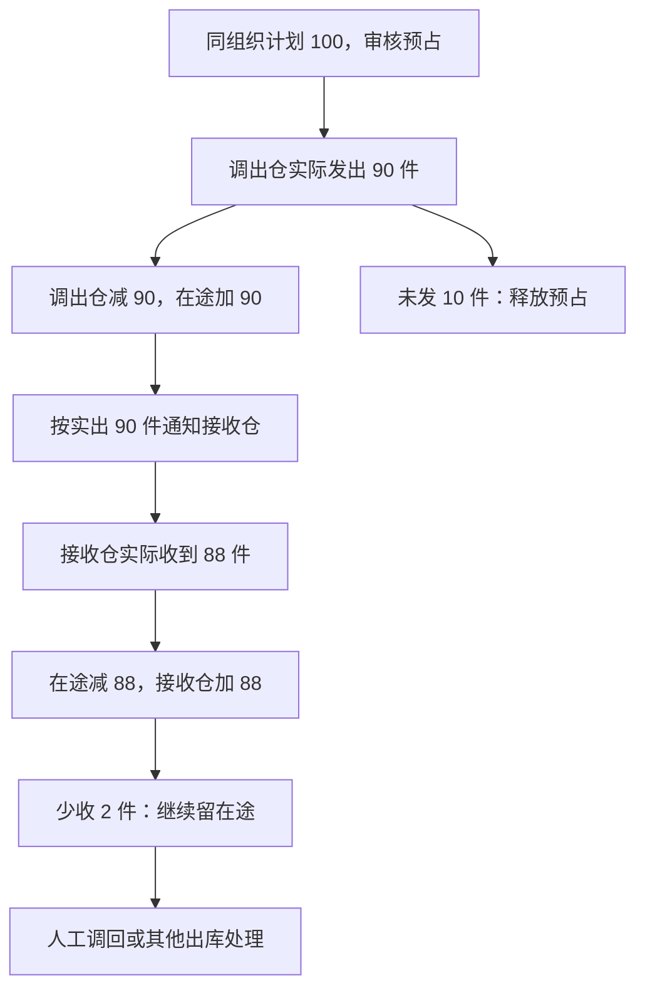

# 库存与仓储业务设计

本文说明库存如何预留、增减和转移，以及在途与库存差异如何保留和处理。

> 版本：V0.5｜编写日期：2026-09-14｜状态：业务设计初稿，待走查。
> 根据已确认需求整理一期目标流程；数量示例用于解释业务结果，不是实际库存数据。未确认的数量边界与处理权限保留在文末。

输入来源：[库存调研](../02-需求调研和分析/03-库存与仓储/库存与仓储需求调研.md)、[库存分析](../02-需求调研和分析/03-库存与仓储/库存与仓储需求分析.md) INV-FR01～INV-FR10；公共概念见[业务蓝图](00-业务蓝图.md)，采购及销售特有规则分别见[采购业务设计](01-采购业务设计.md)、[销售与履约业务设计](02-销售与履约业务设计.md)。

## 一、业务定位与范围

库存业务说明商品归谁、在哪里、还有多少可以使用，以及每次实际收发和转移如何改变这些数量。它服务采购、销售、仓储运营和数据分析；提供库存信息不代表所有人员有相同的数据权限。

本期覆盖自营及第三方仓的逻辑库存、预占冻结、其他出入库、同组织直接与分步式调拨、在途及库存比对。仓内收发、上架、拣货和盘点由仓库／WMS 执行，ERP 不建盘点单，不接管外部电商履约。

采购未入库量不记入或展示为库存；跨渠道配额、全量库存双向同步、跨组织调拨和头程物流管理不在一期范围。库存上线必须有起点，但期初数量、截点和迁移另行实施。

## 二、参与角色

| 参与方 | 业务职责及交接 |
| --- | --- |
| 采购、销售及其他库存使用人员 | 根据库存判断采购或交付，提出所属业务的收发安排 |
| 具有相应权限的业务办理与审核人员 | 办理其他收发、调拨等业务；具体岗位与权限尚未逐项确认 |
| 调出仓与接收仓 | 执行通知，分别确认实际发出、实际收到和执行结束 |
| 仓库作业方 | 执行盘点及品质调整，提供已完成的实际结果 |
| 仓储运营 | 核对账面库存与仓库数量，识别差异；差异处置的最终责任仍待明确 |
| 财务 | 接收库存实际结果，由金蝶进行成本核算 |

人工确认无法自动取得的仓库结果，仍需基于实际发生情况，不能把关闭或取消申请当作仓库执行成功。依据：库存调研 §二、库存分析 §五、[集成分析](../02-需求调研和分析/07-系统集成/系统集成需求分析.md) INT-FR06。

## 三、核心业务场景

| 场景 | 要解决的问题 | 已确认处理 | 来源 |
| --- | --- | --- | --- |
| 多仓库存使用 | 哪些数量可供新业务使用 | 按逻辑仓看即时、预占、冻结与可用数量 | INV-S01、FR01 |
| 采购／销售实际收发 | 何时变化、记到哪里 | 以实际结果改变原单指定或映射识别的库存 | 采购、销售规则及 FR01、FR05 |
| 同组织跨仓备货 | 发出未收到的货在哪里 | 分步式调拨，经在途承接，按实际发出量通知接收 | INV-S03、FR03 |
| 同仓品质调整 | 品况变化是否直接改原入库归属 | 在逻辑仓之间直接调拨，一减一增 | INV-S07、FR07 |
| 样品、赠送、报废等 | 如何记录非购销的收发 | 用其他出入库及业务类型区分，一次执行 | INV-S06、FR06 |
| 仓库盘盈盘亏 | 盘点后实际差异如何进入库存账 | 接收实际结果，不补 ERP 盘点及事前申请 | INV-S04、FR04 |
| 库存冻结 | 已预留部分能否再次冻结 | 只能冻结可用量，不能重复锁定 | INV-S05、FR05 |
| 库存比对 | 两边数量不同如何解释 | 汇总同实体仓、SKU、品况的即时库存比较，不自动改账 | INV-S08、FR08 |

## 四、核心业务流程

图中数量沿用下文已确认示例。未发余量释放预占，少收差异保留在途，两者不能混为一笔“差额”。每端只执行一次，收到实际调入结果并生成第二张直接调拨单后主单自动完结；主单结束不代表在途差异已经清理。依据：INV-FR03、INV-AC03。

### 4.1 购销实际结果如何影响库存

采购实际入库和销售实际退货增加对应逻辑仓库存；销售实际出库和采购退货实际出库减少对应库存。采购安排或入库通知本身不增加库存。

由 ERP 主动承接的销售、采购退货、分步式调拨及其他出库，在审核时预占可用库存，实际出库同时减少即时库存和该业务的对应预占。直接调拨只在 ERP 内部记账，不涉及预占。通知下发不再次占库。订单或通知的分批、少量、取消和关闭规则由所属业务域决定。

外部电商及仓库已经完成的结果不补做事前预占。通过商品、仓库归属及库存校验后再记账；缺少依据时不得任意选择逻辑仓。依据：INV-FR01、INV-FR04、INV-FR05、INV-FR09及销售 SAL-FR09。

### 4.2 分步式调拨：发出、在途、接收

深圳向东莞、FBA 或海外仓备货，属于库存转移。仅允许同一库存组织内调拨；跨组织属于买卖，具体购销方案另行确定。

| 步骤 | 业务动作 | 数量及交接结果 |
| --- | --- | --- |
| 1. 确认调拨安排 | 在 ERP 发起调拨并审核 | 预占调出仓库存，再通知调出仓 |
| 2. 调出仓实际发出 | 仓库一次执行并确认实出量，实出量必须大于 0 | 调出仓减少、在途增加；消耗实出对应预占，释放未发余量 |
| 3. 安排接收 | 根据实际发出量通知接收仓 | 不按原计划量提前安排接收 |
| 4. 接收仓实际接收 | 接收仓一次执行并确认实收量 | 在途减少、接收仓增加 |
| 5. 主单完结与处理差异 | 收到调入回传并生成第二张直接调拨单后主单自动完结；少收部分仍留在途 | 主单完结表示两端执行链已完成，不自动抹平差异，不补建原单分批执行 |

实际调出为 0 时不进入该步骤。仓库接口拒绝回传并返回明确错误，不生成直接调拨单、在途、调入通知或第二张直接调拨单，不改变库存，也不推进主单；系统通知业务人员手动取消该单，取消成功后释放未执行预占。

使用归调出仓管理的通用虚拟在途仓，档案如何挂接实体仓和组织待设计。实际调出与实际调入分别形成直接调拨结果并交财务，分步式主单不作为实际结果传递。

来源示例：计划调拨 100 件，实际发出 90 件，实际收到 88 件。审核预占 100；发出后调出仓减 90、在途加 90，并释放未发 10；按 90 通知接收；收到后在途减 88、接收仓加 88 并生成第二张直接调拨单，主单随之自动完结，剩余 2 件留在途，后续人工调回或通过其他出库扣减。依据：INV-FR03、INV-AC03。

### 4.3 直接调拨与品质调整

同组织内实际调整确认后，来源逻辑仓减少、目标逻辑仓增加，不经过在途。支持同一实体仓内正常品、待检品、残次品等逻辑仓之间调整。

业务可以在 ERP 发起，也可以由仓库实际完成后回传。两者都只在 ERP 内部处理，不推送仓库或其他外部执行系统，也不生成通知单：ERP 发起时人工创建直接调拨单，按提交审核处理，审核通过后直接记一减一增，不涉及预占；仓库发起时按回传生成自动审核的直接调拨单，不补做预占。不做分批与缺量。原文没有要求额外申请层，不在业务设计中添加。

销售退货已经指定收货逻辑仓，即使实际品质不同，也按原指定仓接收，再办理品质调拨，不直接改原退货入库归属。依据：INV-FR07、销售 SAL-FR05。

### 4.4 其他入库与其他出库

业务人员提出其他收发申请，以业务类型说明原因，如样品领用、赠送、报废。审核确认后通知仓库；出库申请同时预占，入库申请不增加库存。

仓库按实际数量一次执行结束，形成其他入库或出库结果。允许缺量，原申请自动完结，不把差额回补给原单再次执行；其他出库未用预占释放。申请 100 件、实出 90 件时，即时及预占各扣 90，再释放预占 10。

不提供手动关闭，也不设置到期自动关单；申请与通知单一样只等待仓库回传一次结果，回传后自动完结。要中止业务只能用取消：未推送部分可释放，但已经推送的部分要等实际结果或仓库取消成功后再处理，不能单方面释放。依据：INV-FR06、INV-AC06、INV-AC12。

### 4.5 仓库主动结果与库存比对

仓库先完成盘点或其他实际变动，再提供结果。盘盈归其他入库，盘亏归其他出库；商品、归属和库存校验通过后直接形成生效结果，不补申请、通知或 ERP 盘点单。品质转移仍按直接调拨处理，不机械转为其他收发。

仓储运营比较仓库数量与 ERP 库存账时，将同一实体仓、同一 SKU、同一品况的多个逻辑仓即时库存汇总。仓库返回的是实体仓数量，不能把差额任意分摊到某个逻辑仓。虚拟在途不纳入实体仓实物比对，预占与冻结也不从比对量中扣除。

例如两个正常品逻辑仓分别有 60、40 件，仓库返回 98 件，只能得出 ERP 汇总多 2 件，不能据此判断哪一个逻辑仓少 2。比对展示差异，不自动生成库存调整。依据：INV-FR04、INV-FR08、INV-AC08。

## 五、业务对象及关系

| 对象 | 含义与归属 | 业务阶段或变化 |
| --- | --- | --- |
| 逻辑仓库存 | 某一库存组织在指定逻辑仓的商品数量 | 按实际结果增减；不能因共用实体仓混记不同组织库存 |
| 即时库存 | ERP 库存账上的实物数量口径 | 不保证任意时刻与仓库现场一致，需结合结果完整性与比对判断 |
| 预占库存 | 已审核正常出库业务预留的数量 | 审核占用，实际出库消耗；取消、关闭、结束的释放按所属业务规则 |
| 冻结库存 | 人工控制或异常处理限制使用的数量 | 只能取自可用量；具体岗位、触发与解冻规则待确认 |
| 虚拟在途 | 已从调出仓发出、尚未被接收的调拨数量 | 实出增加、实收减少；少收差异继续存在 |
| 其他收发申请与通知 | 一次其他收发的业务安排和仓库执行依据 | 审核后执行，一次结束，不分批补余量 |
| 其他入库／出库结果 | 非购销的实际库存变化凭证 | ERP 事前安排或仓库主动结果均可形成，需明确业务类型 |
| 分步式调拨及两端结果 | 先发出再接收的业务安排与实际变化 | 两端分别形成直接调拨结果；收到调入回传并生成第二张直接调拨单后主单自动完结，但不自动清除在途差异 |
| 直接调拨结果 | 同组织逻辑仓间的一减一增 | 可记录品质调整，也可记录分步式调拨某一端实际转移 |

逻辑仓归属唯一、不可修改的库存组织；品况不等于预占、冻结。相同品况可划分多个逻辑仓。依据：[主数据分析](../02-需求调研和分析/01-商品与主数据/商品与主数据需求分析.md)“仓库结构与单据链路确认”、[组织分析](../02-需求调研和分析/10-组织/组织需求分析.md) ORG-FR03。

## 六、核心业务规则

### 6.1 可用数量不能重复承诺

**可用库存＝即时库存－预占库存－冻结库存。** 即时 100、预占 60、冻结 10 时，可用 30，最多再冻结或供新业务占用 30，不能重复锁定已预占或冻结的部分。

已预占的正常业务实际出库时，同时消耗对应预占，不能仅扣即时库存而误判可用不足。对没有对应预占的盘亏等实际结果，也不能自动挪用其他订单的预占。

不允许即时库存或可用库存变成负数。即时 100、预占 95，盘亏 10 将使可用变为 −5，必须阻止该结果生效，不能先记负数再处理。依据：INV-FR01、INV-FR05、INV-FR09。

### 6.2 按已知归属记账，不猜仓库

有 ERP 原单沿用原单逻辑仓；没有原单依据来源及确认映射识别。即使结果由仓库主动发送，也不能忽略已有原单。归属依据不足时不任意选仓，不仅按实体仓把多组织库存合并。

实体仓禁用不连带禁止已有逻辑仓业务；已有逻辑仓按自身资格使用。逻辑仓自身在有库存或未完成业务时如何禁用，仍待主数据详细设计。依据：主数据 MD-FR03、MD-FR08、组织 ORG-FR03。

### 6.3 不同业务的余量不能统一处理

| 业务 | 少量执行后的处理 |
| --- | --- |
| 采购、采购退货、B2B 销售及相应退货 | 按各自规则回补可安排量，开放业务可另次通知 |
| Shopify | 不缺量发货，无法足量则整单不发、保留占库等待处理 |
| 其他出入库 | 一次结束、不分批，出库释放未用预占，不回补原单再办 |
| 分步式调拨 | 每端一次结束；未发释放，少收保留在途 |
| 直接调拨 | 没有分批执行，审核后直接一减一增，不推送仓库、不涉及预占与缺量 |

一期不按正常品、待检品、残次品限制业务用途，有足够可用数量即可办理相应出库；不增加短暂品质处理冻结。以上取舍来自 INV-FR05，不推导为实际仓库无需品质管理。

### 6.4 财务处理与库存处理分开确认

本域只将已审核的其他入库、其他出库和直接调拨结果逐单交给金蝶，不交申请、通知及分步式计划。其他收发与调拨不传成本价格，金蝶负责存货成本核算。财务推送失败不撤销已生效的实际库存结果。

依据：INV-FR10及[业财分析](../02-需求调研和分析/05-结算与业财/结算与业财需求分析.md) FIN-FR01～FIN-FR03。

## 七、特殊与异常场景

| 情形 | 当前处理边界 | 仍需注意 |
| --- | --- | --- |
| 跨组织转货 | 不允许以调拨办理，属于购销 | 跨组织交易具体方案未定 |
| 调拨少收 | 差异留在途，人工后续调回或其他出库处理 | 不自动抹平；具体办理路径与权限待定 |
| 其他出库已推送后取消 | 不能直接释放执行中占用，等待实际结果或仓库取消确认 | 完整取消条件未定 |
| 仓库盘亏导致负可用 | 阻止本次生效，不自动释放已有订单预占 | 查明并解决原因后的恢复方式待定 |
| 外部 ToC 匹配或库存异常 | 按销售规则保留异常，修复后继续原记录，已成功不重复处理 | 不能再次触发已完成履约 |
| 其他库存结果错误或重复 | 不凭空定义冲销或通用更正流程 | 非 ToC 的去重、更正及部分成功恢复仍需设计 |
| 两边库存不一致 | 展示汇总差异，不自动分摊或调整 | 快照时点、共仓多组织及外部货主口径需核验 |

### 待确认事项

“业务先确认”表示该事项会改变数量、责任或处理结果，需在对应功能方案定稿前收口；其他已确认链路可以继续。接口核验、页面和技术实现按表中阶段承接，未决问题不因此获得默认答案。

| 事项 | 需要进一步明确 | 来源 | 处理阶段 |
| --- | --- | --- | --- |
| 冻结与差异责任 | 冻结解冻岗位、异常触发、差异处置责任和权限 | 库存分析 §七 | 业务先确认；权限配置随后设计 |
| 执行数量与结束 | 其他收发及调拨超量上限、取消、已审核修改范围 | §七；不能将采购不超通知规则直接推广 | 业务先确认 |
| 在途与品质 | 虚拟在途档案归属、无原单品质映射、人工调回路径 | §七 | 业务归属及调回路径先确认；档案形式随后设计 |
| 库存比对 | 快照时点、刷新频率、多组织共仓与外部货主口径 | §七 | 比对时点与口径先确认；刷新机制随后设计 |
| 异常恢复 | 非 ToC 的结果更正、库存不足恢复、取消与回传同时发生、部分成功 | §七；外部 ToC 仍遵守销售 SAL-FR12 | 更正及恢复后的业务结果先确认；技术机制随后设计 |
| 财务与接口 | 外部实际支持的变动类型、金蝶目标单据及组织成本映射 | §七；来源能力未实测 | 接口及财务设计前核验 |
| 上线及追溯配置 | 初始化数量与截点另行实施；批次、序列号、保质期的采集执行范围另行明确 | INV-FR02、主数据 MD-FR10及待决策事项 | 采集执行范围先确认；期初与截点在上线切换前落实 |

库存口径、同组织边界、少收在途、主单自动完结、零调出拒绝和比对不改账已确认，不重复列为待定。可按库存分析 INV-AC01～INV-AC13 走查；初始化示例留到实际切换验收，不表示本轮已经完成。
