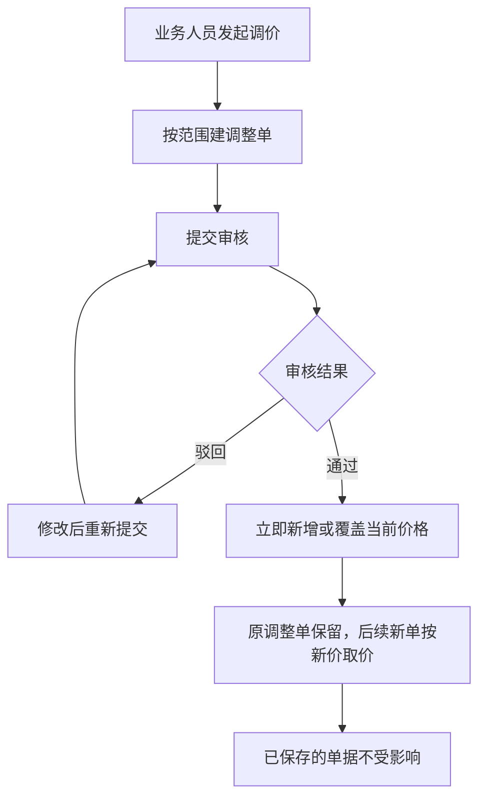

# 价格业务设计

本文说明价格怎么从一开始就有、怎么调、业务单据怎么取价，以及为什么已经保存的单据不会被后来的调价改掉。

> 版本：V0.10｜编写日期：2026-09-23｜状态：业务设计初稿，待走查。
> V0.10：采购侧税率改为用户手动填写；销售侧按主体纳税人身份和商品税务信息带出、为空时手填（2026-09-23确认）。
> 内容依据已确认的需求整理，未确认的事项集中在文末。文中的价格示例只用于解释规则，不是实际报价。

输入来源：[价格管理需求分析](../02-需求调研和分析/06-价格管理/价格管理需求分析.md)、[价格管理需求调研](../02-需求调研和分析/06-价格管理/价格管理需求调研.md)。资料准备见[主数据准备](05-主数据准备.md)，采购和销售怎么用价格见[采购业务设计](01-采购业务设计.md)、[销售与履约业务设计](02-销售与履约业务设计.md)。本文只讲价格本身怎么产生和使用，不重复各业务的单据规则。

## 一、业务定位与范围

价格要回答清楚：这个商品向这个供应商买多少钱、向这个客户卖多少钱、价格变了以后老单据怎么办、找不到价格时能不能继续办业务。

一期做四件事：维护采购价目表和销售价目表，用两类价格调整单新增和修改价格，业务单据按规则取价并保存本单价格，退货沿用原来的成交价。价格是“参考值”，不是资格限制：某个供应商没有某个商品的价目表，不代表不能向这个供应商采购该商品，可以手工填价。

| 谁 | 用价格做什么 |
| --- | --- |
| 商品开发与管理人员 | 商品建档时准备初始采购价和初始销售价 |
| 采购业务人员 | 提出采购价调整，采购单据取价、手填、确认零价 |
| 销售业务人员 | 提出销售价调整，销售单据取价、手填、确认零价 |
| 业务线审核人 | 审核价格调整单 |
| 财务 | 接收业务结果核算；不是价格的默认审核方 |

一期不做：生效开始和结束日期、未来价格排期、跨币别自动换汇、价目禁用及禁用后回退、单位换算、数量阶梯价、外部电商重新定价、完整税务核算。价目表按商品基本单位保存当前有效价格，没有历史价格表；历史价格留在各业务单据里。错价用新的价格调整单覆盖当前价，老单不变。

## 二、参与角色

| 角色 | 负责什么 | 在哪些对象上做什么 | 必须交出什么 | 补充说明 |
| --- | --- | --- | --- | --- |
| 商品开发与管理人员 | 商品建档时准备初始价格 | 商品档案（初始供应商、初始含税采购价、初始含税销售价、币别） | 初始价格记录 | 建档联动，见《主数据准备》 |
| 采购业务人员 | 维护采购价、处理采购单据取价 | 采购价格调整单（创建、提交）、采购单据（取价、改价、零价确认） | 审核通过的采购价、单据上的本单价格 | 主责角色 |
| 销售业务人员 | 维护销售价、处理销售单据取价 | 销售价格调整单（创建、提交）、销售单据（取价、改价、零价确认） | 审核通过的销售价、单据上的本单价格 | 主责角色 |
| 业务线审核人 | 审核价格调整 | 采购、销售价格调整单（审核、驳回） | 允许生效或驳回修改 | 具体岗位待确认 |
| 业务制单人 | 草稿阶段改价、确认零价 | 各类业务单据的草稿 | 合法完整的价格 | 与前面的角色多为同一人 |
| 财务 | 接收实际结果核算 | 不参与调价审核 | 财务处理结果 | 不是价格审核方 |
| 集成维护方 | 维护商品、供应商等外部映射，处理金额回传异常 | 映射关系、异常记录 | 修复后的结果或异常处理记录 | 岗位待确认 |

提交和审核权限沿用[公共能力与系统管理需求分析](../02-需求调研和分析/08-公共能力与系统管理/公共能力与系统管理需求分析.md) COM-FR01、COM-FR02。一期不指定审核岗位，有权限即可，允许自己审自己。

## 三、业务场景

价格场景分四类：主场景、分支场景、辅助场景、异常场景。本节只列场景和关键分支，过程细节见第四节，异常后果见第七节。

### 3.1 主场景

| 场景 | 发生条件 | 参与方 | 主要步骤和判断点 | 业务结果 | 后续环节 |
| --- | --- | --- | --- | --- | --- |
| 新增商品时准备初始价格 | 商品寻源完成，需要建档 | 商品开发与管理人员 | 按实际情况填写初始采购价、销售价及所需的供应商和币别，提交建档 | 有初始采购价时生成采购价，有初始销售价时生成面向所有客户的销售基准价 | 有价的一侧可以取价；无价的新单手填 |
| 日常调价 | 成本或售价要变 | 采购或销售业务人员、审核人 | 按范围建调整单 → 提交 → 审核通过后覆盖当前价 | 当前价格更新，原调整单保留 | 新单据按新价取价 |
| 业务单据取价 | 建采购或销售单据时选完供应商或客户和商品 | 业务制单人 | 按匹配条件带出当前价；带不出来就手工填 | 单据上有本单价格和税率 | 提交后价格锁定 |
| 退货取价 | 客户退货或向供应商退货 | 业务制单人 | 有来源时带出原交易价格；缺价或无来源时手填或查当前价 | 退货单价格 | 审核后进入执行 |

### 3.2 分支场景

| 场景 | 发生条件 | 参与方 | 主要步骤和判断点 | 业务结果 | 后续环节 |
| --- | --- | --- | --- | --- | --- |
| 币别变化 | 单据上换了币别 | 业务制单人 | 原价格清空，按新币别重新取价或手填 | 不会拿人民币价格当美元用 | 继续制单 |
| 条件变化 | 改了供应商、客户或商品 | 业务制单人 | 原来带出的价格作废，按新条件重取或重填 | 本单价格与条件一致 | 继续制单 |
| 零价 | 赠品或特殊约定，价格填0 | 业务制单人 | 提交时系统提醒，确认后可以提交 | 零价作为一种明确的业务约定 | 审核后执行 |
| 草稿改价 | 价格还没提交 | 业务制单人 | 草稿阶段可以直接改含税单价和税率，系统重算不含税价 | 草稿价格更新 | 提交后锁定 |

### 3.3 辅助场景

| 场景 | 发生条件 | 参与方 | 主要步骤和判断点 | 业务结果 | 后续环节 |
| --- | --- | --- | --- | --- | --- |
| 税率带出 | 维护价格或建单时需要税率 | 业务人员、系统 | 采购侧税率不从商品带出、默认为空，由用户手动填写；销售按主体纳税人身份和商品税务信息带出，带出为空时手填（2026-09-23确认）。商品默认销售税率允许为空，开单时再填 | 含税价和不含税价一起确定；税率为空时开单再填 | 保存到价目表或单据 |
| 查询当前价 | 草稿阶段想知道现在什么价 | 业务制单人 | 主动查当前采购价或销售价，填入后仍可改 | 价格快速填入 | 提交时按规则校验 |
| 外部电商金额沿用 | 渠道方回传成交和退款金额 | 系统、财务 | 沿用来源金额，不用ERP价目表重算 | 归集金额进入财务 | 交金蝶 |

### 3.4 异常场景

异常场景按触发条件识别，业务后果、责任方和恢复方式统一在第七节说明，本节不重复。

| 场景 | 触发事件 | 前置 |
| --- | --- | --- |
| 空价格或负价格 | 提交时价格不合法 | 单据或调整单提交 |
| 没有匹配价格 | 按供应商／客户、SKU、币别都取不到价 | 业务建单时 |
| 初始价格缺失 | 商品建档时初始价格为空 | 商品建档 |
| 已审核的调整单发现错误 | 审核之后才发现价格写错 | 调价已经生效 |
| 外部来源缺金额 | 渠道回传缺少必要金额 | 结果归集时 |

## 四、核心业务流程

### 4.1 商品建档时的初始价格

商品建档时可以填写初始供应商、初始含税采购价、初始含税销售价和币别。初始价允许为空；有初始采购价时，供应商和币别必填，生成该供应商的采购价；有初始销售价时，币别必填，生成面向所有客户的销售基准价。空价不生成对应价目，新单取不到价时手工填写。建档后初始供应商和初始价格不能改，变价走价格调整单。销售基准价的不含税单价按主体纳税人身份和商品税务信息确定的税率计算。价目一律按商品基本单位计价。

### 4.2 调价：建单、审核、生效

- 采购价格调整单一张只对应一个供应商和一个币别，明细可以放多个商品。
- 销售价格调整单一张只对应一个币别和一种面向范围（所有客户、一个客户等级，或一个具体客户），明细可以放多个商品。
- 调整单可以新增原来不存在的价格，也可以修改已有价格；价格必须大于零，空值、零值和负值都不能提交。
- 审核通过后立即新增或覆盖当前价格；已审核的调整单不能修改、删除、撤销或反审核，发现错误就再建一张调整单纠正，前后两张都保留。一期不做价目禁用，也不做禁用后按客户价、等级价回退。
- 调整单由采购或销售业务人员创建，由本业务线有权人员审核；财务不是默认审核方。

### 4.3 业务单据取价和改价

- 采购单据按供应商、商品和币别匹配当前采购价。
- 销售单据按客户、客户等级、商品和币别匹配，顺序是：具体客户价 → 客户等级价 → 所有客户基准价。三层都没有就手工填。
- 取不到价格不阻止选商品，也不阻止继续制单；提交时价格、币别和税率必须完整合法，税率允许为0。税率为0时税额为0，价税合计等于金额。
- 草稿阶段可以改含税单价和税率，改税率后系统重新算不含税价。提交和审核之后价格锁定。
- 空价和负价不能提交；采购订单、销售订单、采购退货单、销售退货单允许零价，提交时系统提醒，确认后可以继续。
- 币别、供应商、客户或商品这些匹配条件变了，原来带出来的价格作废，要按新条件重新取或重新填，不能沿用。

### 4.4 退货取价

有来源的采购退货默认带出原采购入库单的价格，有来源的销售退货默认带出原销售出库单的价格，不用当前价目表覆盖原来的成交价。取不到原价，或者退货本来就没有来源时，可以手工填，也可以查当前价快速填入；填进来之后仍然可以在草稿阶段修改。提交后按业务单据的规则锁定和校验。

### 4.5 外部电商金额

聚水潭、领星等外部渠道回来的出库和退货结果，沿用来源系统提供的成交优惠后金额和退货金额，ERP价目表不重新取价。必要金额缺失时按销售模块的异常处理，不自己补价。

### 4.6 一条完整走查：商品建档到调价生效

| 步骤 | 业务动作 | 价格视角 | 单据视角 |
| --- | --- | --- | --- |
| 1 | 商品寻源完成，填写初始供应商、初始含税采购价和销售价后建档 | 生成两条价格记录：按供应商的采购价、面向所有客户的销售基准价 | 采购、销售可以取价 |
| 2 | 采购建单，选供应商和商品，买10件 | 按供应商、商品、币别带出含税113元 | 草稿上金额1,130元，税率13% |
| 3 | 草稿阶段把税率从13% 改成10% | 系统重算不含税单价（113 ÷ 1.1 ≈ 102.73） | 草稿上的不含税价更新，含税价和数量不变 |
| 4 | 提交单据 | 价格和税率锁定 | 这单就按113元／件执行 |
| 5 | 另一名业务人员把当前价调到120元并审核通过 | 当前价变成120元 | 第4步的单据仍是113元，不受影响 |
| 6 | 业务人员再建新单 | 按120元带出 | 新单按120元执行 |

这张表说明“当前价”和“本单价格”是两回事：调价只影响以后的新单，不回头改已经保存的业务。示例里的数字只用来演示算法。单价保留4位小数，金额和税额保留2位小数，行内差额计入税额。销售侧税率按主体纳税人身份和商品税务信息确定，同一个含税基准价，税率不同时不含税单价也不同。依据：PRI-FR01、PRI-FR04。

## 五、业务对象及关系

### 5.1 对象清单

| 对象 | 业务含义 | 如何识别 | 业务阶段 | 阶段结束时 |
| --- | --- | --- | --- | --- |
| 采购价目表 | 每个“供应商＋商品＋币别”的当前采购价 | 三个维度的组合唯一 | 建档生成或调价覆盖 | 一直保留最新一条当前价 |
| 销售价目表 | 每个“商品＋币别＋面向范围”的当前销售价 | 三个维度的组合唯一 | 建档生成或调价覆盖 | 同采购价目表 |
| 采购价格调整单 | 一次采购调价的凭据 | 单号 | 创建 → 提交审核 → 审核通过或驳回 → 生效 | 已审核不能改，错误另建 |
| 销售价格调整单 | 一次销售调价的凭据 | 单号 | 同采购调整单 | 同采购调整单 |
| 本单价格 | 某张业务单据上的成交价格和税率 | 挂在业务单据上 | 取价或手填 → 提交锁定 | 不随后续调价变化 |

### 5.2 对象关系

| 关系 | 基数与可选性 | 说明 |
| --- | --- | --- |
| 商品建档 → 价目表 | 1 : 0～2 | 初始采购价、初始销售价分别有值时，生成对应的采购价、销售基准价 |
| 价格调整单 → 价目表 | 1 : N | 一张调整单可以改多条明细；审核通过后新增或覆盖当前价 |
| 价目表 → 业务单据 | 1 : N | 单据取价时匹配当前价，匹配不到可以手填 |
| 业务单据 → 本单价格 | 1 : N | 每行保存自己的价格和税率，与价目表脱钩 |
| 退货单 → 原业务单据 | 0..1 : 1 | 有来源时带出原价；无来源时没有这层关系 |

追溯路径：从调整单可以查到它改了哪些价格；每条当前价可以回溯到最近一次审核通过的调整单；每张单据的本单价格可以看它是取价还是手填，但不追到后续调价。

### 5.3 价格相关的数值

| 数值 | 落在哪 | 怎么变化 |
| --- | --- | --- |
| 含税单价 | 价目表、调整单明细、业务单据行 | 调整单审核后更新价目表；单据提交后锁定 |
| 税率 | 价目表、调整单明细、业务单据行 | 采购由用户手动填写；销售按主体纳税人身份和商品税务信息带出、为空时手填；提交前税率必填，草稿可改（2026-09-23确认） |
| 不含税单价 | 价目表、调整单明细、业务单据行 | 由含税单价和税率算出，不单独维护 |
| 本单金额 | 业务单据行 | 按数量和本单价格算，不随调价变化 |

单价保留4位小数，金额和税额保留2位小数；税率按百分比最多2位小数，允许为0。税率为0时税额为0，价税合计等于金额。行内税额＝价税合计−金额，吸收四舍五入差额。依据：[价格管理需求分析](../02-需求调研和分析/06-价格管理/价格管理需求分析.md) PRI-FR04。

## 六、核心业务规则

### 6.1 当前价格和本单价格分开

价目表保存的是“现在是什么价”，业务单据保存的是“这笔业务当时谈成什么价”。调价只影响之后的新单，已经保存、已经在执行的单据不跟着变。这条规则让历史业务可追溯，也避免同一张单据在不同时间算出不同金额。

### 6.2 价格是参考，不是资格

取不到价格不阻止选商品，也不阻止建单，允许手工填价；反过来，价目表里有价格，也不表示对某个供应商或客户建立了供货或销售关系。这两件事分别由主数据和业务单据管理。

### 6.3 调价要留痕，错了就再调一次

调整单价格必须大于零，审核通过才会生效。已审核的调整单不可修改、删除、撤销或反审核；发现错误用新的调整单纠正，两次调整的记录都保留。

### 6.4 币别独立，不换汇

不同币别的价格完全独立，同一供应商或客户范围的商品可以分别维护多个币别价格。单据只匹配自己选的币别，不用汇率折算其他币别的价格；换币别就重新取价或手填。

### 6.5 退货沿用原价

有来源的退货用原交易价格，不用当前价目表覆盖。没有原价或没有来源时，才可以手填或查当前价快速填入。

## 七、特殊与异常场景

本节汇总异常的触发条件、业务后果、责任方和恢复方式；完整规则见第四节和第六节，这里不重复展开。表里的“责任方”和“能否恢复”两列就是每个异常的后续环节：能恢复的按恢复方式继续，不能恢复的另办单据。

| 情形 | 触发条件 | 业务后果 | 责任方 | 能否恢复 |
| --- | --- | --- | --- | --- |
| 空价或负价 | 提交时价格不合法 | 阻断提交，不进审核 | 业务制单人 | 能：补齐或改正当后重新提交 |
| 零价 | 赠品或特殊约定 | 提交时提醒，确认后可以继续 | 业务制单人 | — |
| 零税率 | 税率填0% | 允许提交，不二次确认；税额为0，价税合计等于金额 | 业务制单人 | — |
| 没有匹配价格 | 四层匹配都取不到 | 允许手工填写，不阻止建单 | 业务制单人 | 能：手填后提交 |
| 初始价格缺失 | 建档时初始价为空 | 允许建档，不生成对应价目；新单手填 | 商品开发与管理人员、业务制单人 | 能：手填后提交 |
| 调整单写错 | 审核之后才发现 | 不能改原单，新建一张调整单纠正，两张都保留 | 采购或销售业务人员、审核人 | 能：用新调整单纠正 |
| 单据条件变化 | 改了供应商、客户、商品或币别 | 原价格作废，按新条件重取或重填 | 业务制单人 | 能：重取或手填 |
| 外部来源缺金额 | 渠道回传缺必要金额 | 按异常处理，不自行补价 | 集成维护方（待确认） | 能：补齐来源信息后继续 |
| 调价后老单要求改价 | 老单已提交或已执行，但价格要变 | 不改老单；需要调整就按业务规则另办 | 业务人员、审核人 | 不能：老单价格不回溯 |

### 待确认事项

“业务先确认”的解释见《强盛科技一期业务蓝图》§七；下表只列本域还没定的事，已在蓝图 §七确认的结论不再重复。

本域当前没有单独未决事项。价税精度、一期不做价目禁用、按基本单位计价、初始价允许为空、审核权限等均已确认，见本文各节与《强盛科技一期业务蓝图》§七。

本文可用于按“初始建价、日常调价、单据取价、退货取价、外部金额沿用、独立站沿用Shopify”这几条线走查；还没定下来的边界，不等于业务设计已经全部确认。对应的业务验收例子见《价格管理需求分析》PRI-AC01、PRI-AC03～PRI-AC13。
