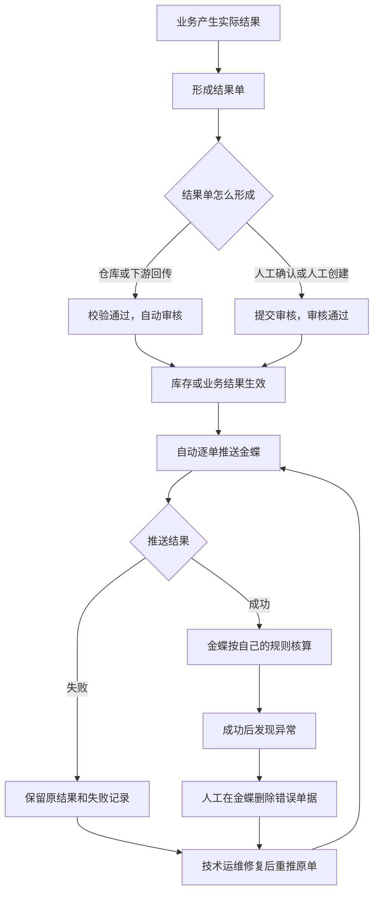

# 结算与业财交接

本文说明ERP把哪些实际业务结果交给财务、什么时候交、交失败了怎么办，以及哪些事ERP不做、留在财务和金蝶。

> 版本：V0.3｜编写日期：2026-09-20｜状态：业务设计初稿，待走查。
> 内容依据已确认的需求整理，未确认的事项集中在文末。本文是业务边界，不展开接口报文和字段映射。

输入来源：[结算与业财需求分析](../02-需求调研和分析/05-结算与业财/结算与业财需求分析.md)、[结算与业财需求调研](../02-需求调研和分析/05-结算与业财/结算与业财需求调研.md)。接口和推送记录见[系统集成需求分析](../02-需求调研和分析/07-系统集成/系统集成需求分析.md)，结果单的系统状态与操作见[《单据与状态流转》](../04-产品设计方案/20260812-ERP项目第一版框架搭建/系统架构和流程/03-单据与状态流转.md)，分层模型看[强盛ERP的单据分层设计](../01-全局背景信息/5.强盛ERP的单据分层设计.md)。各业务域只写自己产生的结果，本文只写交接这一段。

## 一、业务定位与范围

ERP负责供应链业务，财务负责核算。这一层要回答清楚：哪些实际结果要交给财务、怎么交、交不过去怎么办、交完之后谁负责。它不建财务台账，也不代替财务判断。

| 方向 | 内容 |
| --- | --- |
| ERP交给金蝶 | 七类已经审核的实际结果单，逐单推送 |
| 金蝶负责 | 应收应付、收付款、预收预付、核销、凭证、总账、存货成本核算 |
| ERP不做 | 应收应付、收付款、核销、凭证、总账、平台账单对账、成本核算 |
| 财务线下处理 | 平台账单、收退款、佣金、仓储履约费、最终回款，处理完在金蝶记账 |

交付范围是七类结果单：采购入库、采退出库、销售出库、销退入库、其他入库、其他出库、直接调拨。订单、申请单、通知单、草稿和未审核的结果都不推送；分步式调拨主单不推送，它两端各自形成的直接调拨结果分别推送。

本文只回答“结果交出去之后，成败算谁的”；谁负责执行、谁人工确认、异常在哪里看，见[集成协作与人工补充](07-集成协作与人工补充.md)。

## 二、参与角色

| 角色 | 负责什么 | 在哪些对象上做什么 | 必须交出什么 | 补充说明 |
| --- | --- | --- | --- | --- |
| 采购、销售、库存业务人员 | 产生并审核实际结果单 | 七类结果单（形成、审核） | 已经审核、可以推送的结果 | 业务规则在各域，本文不重复 |
| 系统 | 结果单审核通过后自动发起推送 | 推送记录 | 推送成功或失败的结果 | 不需要财务点确认 |
| 技术运维 | 处理推送失败；处理成功后发现的异常 | 原结果单的推送记录 | 修复后的结果或处理记录 | 不是普通业务人员的常规操作 |
| 财务 | 接收结果并在金蝶核算 | 金蝶单据 | 财务处理结果 | 不做推送前的二次审核 |
| 集成维护方 | 维护映射，查看异常 | 系统集成中心的推送记录和异常 | 可用的映射、异常处理记录 | 页面细节在产品设计里定 |

## 三、业务场景

业财场景分四类：主场景、分支场景、辅助场景、异常场景。本节只列场景和关键分支，过程细节见第四节，异常后果见第七节。

### 3.1 主场景

| 场景 | 发生条件 | 参与方 | 主要步骤和判断点 | 业务结果 | 后续环节 |
| --- | --- | --- | --- | --- | --- |
| 结果单自动交接 | 七类结果单在ERP生成并审核通过 | 业务人员、系统 | 审核通过 → 自动推送金蝶 → 记录结果 | 金蝶收到对应业务，进入核算 | 财务在金蝶核算 |

### 3.2 分支场景

| 场景 | 发生条件 | 参与方 | 主要步骤和判断点 | 业务结果 | 后续环节 |
| --- | --- | --- | --- | --- | --- |
| 外部ToC金额沿用 | 渠道方回传成交或退货结果 | 系统 | 沿用来源的优惠后金额和退货金额，不重算 | 金额与渠道一致 | 财务按此入账 |
| 库存类结果不传成本 | 其他出入库、直接调拨结果推送 | 系统 | 只传结果本身，不带成本单价和金额 | 成本由金蝶核算 | 财务月末核算 |
| 查看推送结果 | 需要确认某张单交没交过去 | 业务人员、集成维护方 | 在系统集成中心看原单和推送状态、时间、失败原因 | 只读查看，不改原单 | 有问题转技术运维 |
| 分批业务分单交接 | 采购或销售分批执行 | 系统 | 每批形成自己的结果单，各自推送 | 金蝶按批收到 | 财务按批核算 |
| 调拨两端分别交接 | 分步式调拨完成调出和调入 | 系统 | 两端各自形成直接调拨结果并分别推送 | 金蝶收到两笔 | 财务核算 |

### 3.3 辅助场景

| 场景 | 发生条件 | 参与方 | 主要步骤和判断点 | 业务结果 | 后续环节 |
| --- | --- | --- | --- | --- | --- |
| 新结果类型评估 | 后续出现七类以外的新结果 | 产品、财务、集成 | 先评估要不要进金蝶，再补范围 | 范围更新 | 另行设计 |
| 平台结算 | 平台账单、佣金、履约费等 | 财务 | 财务线下处理并在金蝶记账 | 不进ERP归集 | 金蝶记账 |

### 3.4 异常场景

异常场景按触发条件识别，业务后果、责任方和恢复方式统一在第七节说明，本节不重复。

| 场景 | 触发事件 | 前置 |
| --- | --- | --- |
| 推送失败 | 金蝶未接收成功 | 结果单已审核、库存已生效 |
| 成功后发现异常 | 金蝶已接收，但内容有误 | 推送已经成功 |
| 重复推送 | 同一结果单再次发起 | 原推送已经处理 |
| 财务接收后要求撤销业务 | 要求回滚已经交接的结果 | 结果已生效 |

## 四、核心业务流程

### 4.1 一张结果单的交接路径

结果单一旦审核通过，业务和库存就已经生效；推送只是在把这个结果告诉财务。所以推送失败不会把业务退回去，修复之后继续处理原来那张单，不新造一笔业务。

### 4.2 七类结果和边界

| 结果单 | 来源业务 | 交给金蝶什么 | 不交什么 |
| --- | --- | --- | --- |
| 采购入库单 | 采购收货 | 数量、仓库、来源交易信息 | 采购订单、收货通知 |
| 采退出库单 | 采购退货出库 | 数量、仓库、来源交易信息 | 采购退货单、采退发货通知 |
| 销售出库单 | B2B、独立站、外部电商出库 | 数量、来源交易信息；外部ToC用来源金额 | 销售订单、发货通知 |
| 销退入库单 | 销售退货入库 | 数量、来源交易信息；外部电商用来源退货金额 | 销售退货单、销退收货通知 |
| 其他入库单 | 其他入库、盘盈 | 结果本身 | 成本价格、申请单 |
| 其他出库单 | 其他出库、盘亏 | 结果本身 | 成本价格、申请单 |
| 直接调拨单 | 一步式调拨，或分步式调拨的两端 | 结果本身 | 成本价格、分步式调拨主单 |

每张结果单单独推送，不做汇总；为什么必须这样，见6.2。

### 4.3 金额和成本的边界

采购入库、采退出库、销售出库、销退入库带着来源业务单据上的数量、仓库、业务日期和交易信息。外部电商的成交优惠后金额和退货金额沿用渠道方给的结果，不按ERP的价目表重算；缺必要金额时按异常处理，不自己补价。

其他入库、其他出库和直接调拨不传成本单价和成本金额，金蝶按自己的存货核算规则做月度成本核算；ERP不回算、也不维护金蝶的成本结果。具体币别、含税字段和税费字段还要按接口核验。

### 4.4 失败和更正

推送失败只改变推送结果，不回滚已经生效的结果单、库存和业务。失败记录留在原结果单对应的推送记录里，问题修好后继续针对原结果单处理，不新建业务单。

推送成功之后发现异常（比如金额错了），先由人工在金蝶删除那张错误单据，再由技术运维在系统集成中心重推ERP的原结果单。这属于异常运维，不是普通业务人员在业务页面上反审核或重推的常规功能；具体权限和操作方式由集成和运维方案定。

不用展示金蝶单号，但要能看出这张单交没交成功，并保留推送时间、失败原因和处理记录。

### 4.5 平台结算留在财务

平台账单、仅退款和其他收退款、佣金、仓储履约费和最终回款，由财务线下处理，处理完在金蝶记账，本期不进ERP归集对账。ERP这边只把供应链的实际结果交给财务，两者不混在一起。

### 4.6 一条完整走查：一张采购入库单

| 步骤 | 业务动作 | 结果单状态 | 库存 | 金蝶 |
| --- | --- | --- | --- | --- |
| 1 | 仓库回传实收580件，校验通过 | 生成并自动审核 | 对应逻辑仓 +580 | 还没收到 |
| 2 | 系统自动推送 | 推送中 | 不变 | 接收中 |
| 3 | 推送成功 | 推送成功 | 不变 | 按采购入库核算 |
| 4 | 如果推送失败 | 推送失败，保留记录 | 仍然是 +580 | 没收到 |
| 5 | 技术运维修复后重推原单 | 推送成功 | 不变 | 最终收到一笔，不重复 |

这张表说明两件事：库存以实际结果为准，不因为推送失败退回；金蝶最终只应有一笔对应的有效单据。

## 五、业务对象及关系

### 5.1 对象清单

| 对象 | 业务含义 | 如何识别 | 业务阶段 | 阶段结束时 |
| --- | --- | --- | --- | --- |
| 结果单（七类） | 实际发生的业务结果，也是交接的凭据 | 单据编号和来源业务 | 生成 → 自动或人工审核 → 推送 → 核算 | 保留原单和推送记录，不跟随来源改写 |
| 推送记录 | 某张结果单交给金蝶的过程和结果 | 挂在结果单下 | 发起 → 成功或失败 → 重试 | 保留时间、结果和失败原因 |
| 来源业务信息 | 数量、仓库、业务日期、交易金额等 | 随结果单携带 | 随结果单生成 | 用于金蝶核算，不在交接界面改 |
| 金蝶单据 | 财务侧接收后形成的业务 | 由金蝶生成 | 接收 → 核算 → 记账 | ERP不要求显示金蝶单号 |

### 5.2 对象关系

| 关系 | 基数与可选性 | 说明 |
| --- | --- | --- |
| 结果单 → 推送记录 | 1 : N | 一次失败和一次重试各留一条记录 |
| 结果单 → 来源业务单据 | N : 1 | 订单和通知不推送，但结果单要能回溯到它们 |
| 分步式调拨 → 直接调拨结果 | 1 : 2 | 两端各自形成一张结果单，分别推送 |
| 结果单 ↔ 金蝶单据 | 1 : 1（目标） | 一张结果单对应金蝶一笔；具体对应关系按接口核验 |

### 5.3 关键的“谁负责”

| 事项 | 谁负责 |
| --- | --- |
| 业务结果是否真实、数量是否正确 | 业务域和仓库 |
| 结果单是否已审核、能否推送 | 业务域 |
| 推送是否成功 | 系统记录，技术运维处理失败 |
| 接收后怎么核算、怎么记账 | 财务和金蝶 |
| 成功后的异常更正 | 技术运维，按运维流程 |

来源业务、结果单和金蝶单据怎么对应：

| 来源业务 | 结果单 | 交给金蝶 |
| --- | --- | --- |
| 采购分批收货 | 每次收货一张采购入库单 | 每张单独一笔 |
| B2B、独立站、外部电商出库 | 每张销售出库单 | 每张单独一笔 |
| 销售退货收货 | 每次收货一张销退入库单 | 每张单独一笔 |
| 其他出入库、盘盈盘亏 | 每次一张结果单 | 每张单独一笔 |
| 分步式调拨 | 调出、调入各一张直接调拨单 | 两张分别一笔 |

分批的业务回来几次就交几笔；零收或零出不生成结果单，也就不交给金蝶。

## 六、核心业务规则

### 6.1 只交实际结果，不交安排

订单、申请、通知表达“要办什么”，结果单表达“实际办成了什么”。只有结果单进入交接，这样财务拿到的是事实，不是计划。分步式调拨主单也一样，不推送，推它两端的结果。

### 6.2 逐单交接，不汇总

每张结果单单独推送，不按日期、客户、供应商或店铺合并。这样ERP的每一笔和财务的每一笔能对上，出了问题也能定位到具体哪张单。

### 6.3 推送失败不回滚业务

业务和库存以实际结果为准。推送失败只说明财务还没收到，处理办法是修复后重推原单，而不是把业务退回去或者另造一笔。

### 6.4 财务不做推送前的二次审核

结果单在ERP审核通过后自动推送，不在推送前增加财务复核环节。金额、仓库这些信息由来源业务决定；如果发现不对，回到业务域按业务规则处理。

### 6.5 主体与账套边界

本期按单主体建设，ERP不建组织档案，结果单也不携带组织信息；推送金蝶时不传主体，由金蝶按默认账套入账。具体接口约定待接口设计确认。

## 七、特殊与异常场景

本节汇总异常的触发条件、业务后果、责任方和恢复方式；完整规则见第四节和第六节，这里不重复展开。表里的“责任方”和“能否恢复”两列就是每个异常的后续环节：能恢复的按恢复方式继续，不能恢复的另办单据。

| 情形 | 触发条件 | 业务后果 | 责任方 | 能否恢复 |
| --- | --- | --- | --- | --- |
| 推送失败 | 金蝶没有接收成功 | 结果单和库存保持生效，只记录失败 | 系统记录，技术运维处理 | 能：修复后重推原单 |
| 成功后发现异常 | 金蝶已经收到，但内容不对 | 先由人工在金蝶删除错误单据，再修复重推原结果单 | 财务、技术运维 | 能：按异常运维处理，金蝶最终只留一张 |
| 重复推送或重复回传 | 同一结果再次发起 | 不重复记账、不重复形成金蝶单据 | 系统；技术运维 | 能：按去重规则处理；具体机制待接口设计 |
| 要求撤销已交接结果 | 业务想回滚已经推送的结果 | 不做常规的反审核或回滚入口；按业务规则另办 | 业务域、财务、技术运维 | 不能：只能另行处理差错 |
| 缺必要金额 | 来源结果缺少金额字段 | 按异常处理，不自行补价 | 集成维护方（待确认） | 能：补齐来源信息后继续 |
| 新结果类型 | 出现七类以外的结果 | 先评估是否进金蝶，不默认纳入 | 产品、财务、集成 | 能：确认范围后另行设计 |

平台账单、费用和回款已明确不进ERP（FIN-FR04），不作为待确认项；将来如果要纳入，属于新增范围，需要单独提出。

### 待确认事项

“业务先确认”的解释见《强盛科技一期业务蓝图》§七；下表按处理阶段列出还没定的事。

| 事项 | 需要确认什么 | 来源 | 处理阶段 |
| --- | --- | --- | --- |
| 金蝶目标单据 | 七类结果分别对应金蝶的什么单据，成功怎么判定。本期不编字段对照，对照表由财务联调时给出 | [结算与业财需求分析](../02-需求调研和分析/05-结算与业财/结算与业财需求分析.md) §七 | 接口设计与联调前 |
| 交易字段 | 采购、销售结果的币别、含税金额、税费等字段映射。本期不编映射，随财务联调对照表 | 结算与业财需求分析 §七 | 财务及接口设计前 |
| 异常运维 | 失败修复、成功后删单重推的权限和操作日志（重推入口在系统集成中心） | 结算与业财需求分析 §七 | 系统集成及运维方案设计前 |
| 新结果类型 | 后续新增结果单是否进金蝶 | 结算与业财需求分析 §七 | 新业务类型确定时 |

本文可用于按“七类结果逐单交接、分批分单、调拨两端、推送失败与更正”这几条线走查；还没定下来的边界，不等于业务设计已经全部确认。对应的业务验收例子见《结算与业财需求分析》FIN-AC01～FIN-AC06。
