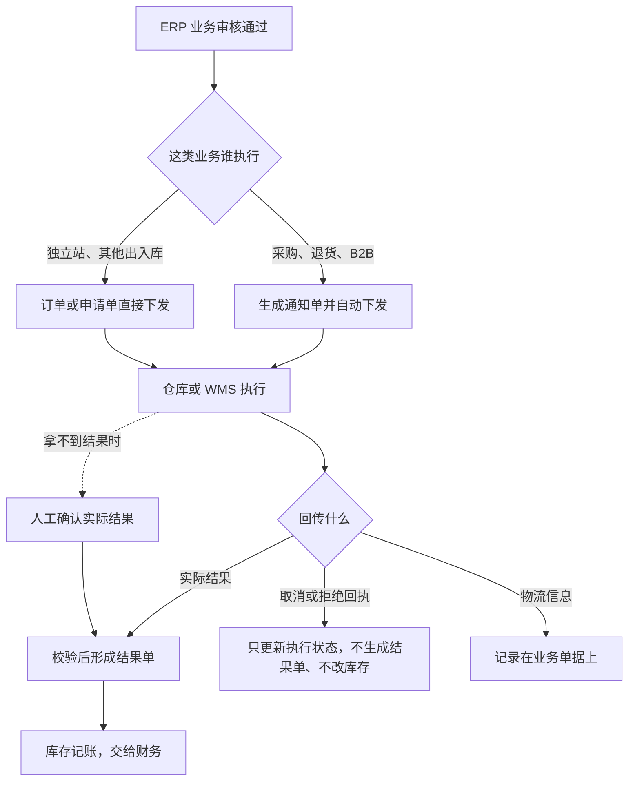

# 集成协作与人工补充

本文说明 ERP 和外部履约方、仓库、财务系统各做什么，拿不到结果时谁来确认，以及映射和异常记录归谁维护。

> 版本：V0.2｜编写日期：2026-09-15｜状态：业务设计初稿，待走查。
> 内容依据已确认的需求整理，未确认的事项集中在文末。本文只讲业务分工和责任，接口字段、协议、重试和去重留在接口设计里。

输入来源：[系统集成需求分析](../02-需求调研和分析/07-系统集成/系统集成需求分析.md)、[系统集成需求调研](../02-需求调研和分析/07-系统集成/系统集成需求调研.md)。各系统的业务规则见[强盛ERP的定义和上下游链路](../01-全局背景信息/3.强盛ERP的定义和上下游链路.md)和[强盛ERP全局业务规则与约束](../01-全局背景信息/4.强盛ERP全局业务规则与约束.md) §六，业务域各自怎么写结果见采购、销售、库存三篇。

## 一、业务定位与范围

ERP 是业务中枢，不是执行方。仓库里的活由仓库或 WMS 干，电商订单的履约由渠道方干，财务核算由金蝶干。这一层要回答清楚的是：谁把什么事交给谁、对方实际做完了怎么告诉 ERP、拿不到消息时业务还能不能往下走。

| 外部系统 | 一期定位 | 和 ERP 怎么配合 |
| --- | --- | --- |
| 领星、聚水潭 | 负责国内和跨境外部电商的运营与履约，第三方仓可经它们中转 | 回传原订单和实际结果；采购、销售的执行指令按映射传递 |
| Shopify | 独立站订单来源 | ERP 拉取已付款订单，把发货结果和运单反馈给 Shopify；未覆盖的订单可以人工导入 |
| 自营仓作业系统 | 自营仓的实物作业 | ERP 直连下发执行指令，接收实际结果、取消回执和库存信息 |
| 第三方 WMS／仓库 | 第三方仓的实物作业 | 接收通知或直接推送的订单、申请单，回传实际结果 |
| 金蝶 | 财务核算底座 | 接收七类已审核结果单 |

这一层不重新定义业务规则：单据怎么分层、什么时候预占、结果怎么记账，都以各业务域为准。ERP 不下发没有依据的指令，也不因为接口能通就替外部系统决定业务怎么做。

## 二、参与角色

| 角色 | 负责什么 | 在哪些对象上做什么 | 必须交出什么 | 补充说明 |
| --- | --- | --- | --- | --- |
| 各业务域的业务人员 | 产生执行指令、审核结果 | 通知单、订单、申请单、结果单 | 可下发的指令、可生效的结果 | 规则在各域 |
| 渠道履约方 | 完成外部电商的正向和售后履约 | 渠道侧订单和售后单据 | 原订单、实际结果及来源关联 | 外部执行方 |
| 仓库／WMS | 执行实物作业并回传结果 | 接收指令，回传实际数量、结束、取消和物流结果 | 实际执行结果 | 外部执行方 |
| 集成维护方 | 维护外部映射，查看异常记录 | 映射关系、系统集成中心 | 可用的映射、异常清单 | 由业务人员在对应模块维护 |
| 相关人员 | 接口拿不到结果时人工确认实际结果；导入未覆盖的订单 | 结果单、导入的订单 | 确认过的实际结果 | 具体岗位待确认 |
| 技术运维 | 处理推送失败和连接异常 | 推送记录、接口日志 | 修复后的结果 | 与业财异常运维同一套流程 |
| 财务 | 接收金蝶侧结果并核算 | 金蝶单据 | 财务处理结果 | 见《结算与业财交接》 |

## 三、业务场景

集成场景分四类：主场景、分支场景、辅助场景、异常场景。本节只列场景和关键分支，过程细节见第四节，异常后果见第七节。

### 3.1 主场景

| 场景 | 发生条件 | 参与方 | 主要步骤和判断点 | 业务结果 | 后续环节 |
| --- | --- | --- | --- | --- | --- |
| 下发执行并接收结果 | 业务审核通过，需要仓库做事 | 业务人员、仓库／WMS | 通知单或订单、申请单自动下发 → 仓库执行 → 回传实际结果 | 结果单生成，库存和财务衔接 | 回到各业务域收尾 |
| 拉取订单并反馈发货结果 | Shopify 产生已付款订单 | 系统、独立站业务人员 | 拉取订单 → 人工选仓选物流并审核 → 自动下发 → 把发货结果反馈给 Shopify | 订单交付完成 | 财务交接 |
| 分发商品 | 新增商品 | 系统、主数据维护人员 | 商品 SKU 分发到 WMS 和金蝶 | 外部系统能识别商品 | 业务建单 |

### 3.2 分支场景

| 场景 | 发生条件 | 参与方 | 主要步骤和判断点 | 业务结果 | 后续环节 |
| --- | --- | --- | --- | --- | --- |
| 人工确认实际结果 | 接口拿不到接单、执行结束或取消结果 | 相关人员 | 按实际发生情况确认结果，仍要过业务校验 | 结果可以入账，留下来源记录 | 业务和财务继续处理 |
| 人工导入订单 | Shopify 某类订单接口没覆盖 | 独立站业务人员 | 从 Shopify 导入 ERP，走对应的审核要求 | 订单进入正常流程 | 按独立站流程执行 |
| 维护映射 | 外部商品、仓库或货主需要对应关系 | 业务人员、集成维护方 | 在对应模块配置映射，不要求建档时就有 | 外部结果能识别到 ERP 对象 | 结果正常归集 |
| 查看异常 | 推送失败或结果处理失败 | 业务人员、集成维护方 | 在系统集成中心查看异常单据和失败记录 | 知道哪张单卡住了 | 转技术运维或补映射 |

### 3.3 辅助场景

| 场景 | 发生条件 | 参与方 | 主要步骤和判断点 | 业务结果 | 后续环节 |
| --- | --- | --- | --- | --- | --- |
| 商品分发 | 商品建档完成 | 系统 | 分发到 WMS 和金蝶；分发失败不阻止内部业务 | 下游能识别商品 | 推单时如失败进入异常 |
| 物流选择下发 | 非自提发货 | 业务人员、仓库 | 把选择的物流服务产品，或“由仓库指定”传给仓库 | 仓库按此安排 | 回传实际物流结果 |
| 库存信息交换 | 仓库主动回传实际变动或库存快照 | 仓库、仓储运营 | 结果按业务域规则记账；快照用于比对 | 账实差异可见 | 人工查明原因 |

### 3.4 异常场景

异常场景按触发条件识别，业务后果、责任方和恢复方式统一在第七节说明，本节不重复。

| 场景 | 触发事件 | 前置 |
| --- | --- | --- |
| 拿不到结果 | 接口没有返回执行结束或取消结果 | 指令已经下发 |
| 映射缺失或匹配失败 | 商品、仓库或货主对不上 | 结果已经回传 |
| 分发失败 | 商品或资料没有成功传到下游 | 下游需要这些数据 |
| 重复回传 | 同一结果多次到达 | 原结果已经处理 |

## 四、核心业务流程

### 4.1 一条执行链：谁交给谁

同一条业务只下发一次、只执行一次。仓库内部怎么分批作业、拆成几个任务，ERP 不关心；ERP 关心的是这次执行有没有结束、实际做了多少。

### 4.2 各系统的分工边界

- 外部电商（领星、聚水潭）：接单、发货、售后都由它们完成，ERP 接收原订单和实际结果，不接管抓单和打单，也不重复驱动仓库。
- 独立站（Shopify）：ERP 自己拉单、审核和下发，并把发货结果反馈给 Shopify；取消要等仓库回执，不能提前对 Shopify 认定成功（规则见《销售与履约业务设计》）。
- 仓库：只按收到的指令执行。ERP 取消不等于仓库已经取消，仓库的回执才算。
- 金蝶：只负责财务核算，不做采购、销售的业务入口。

### 4.3 映射怎么准备和维护

商品、仓库、货主这些外部对应关系，在档案建立之后由业务人员在对应模块维护，不要求建档时就配好。ERP 通过商品编码或确认过的映射识别外部结果；识别不了就按异常处理，不把结果随便归到某个商品或仓库上。

商品 SKU 分发到 WMS 和金蝶；领星、聚水潭不全量接收商品资料。分发没成功不阻止 ERP 内部的业务继续走，但下游推单时会失败，失败会进入异常清单。

### 4.4 拿不到结果怎么办

接口没能返回接单、执行结束或取消结果时，相关人员可以按实际发生的情况人工确认结果。人工确认不等于可以随便填：商品、归属、数量这些仍要过业务校验和适用的审核。另外，ERP 里的“申请取消”也不等于“仓库已经取消”，业务判断不能替代仓库的回执。

### 4.5 异常在哪里看

推送失败和结果处理失败集中展示在系统集成中心：能看到原单、推送状态、时间、失败原因和必要的处理记录。这里只读，不是改单入口；要修业务内容回业务域，要修接口和数据由技术运维处理。

### 4.6 一条完整走查：采购收货结果回到 ERP

| 步骤 | 谁在做 | ERP 里看到什么 | 业务结果 |
| --- | --- | --- | --- |
| 1 | 采购审核订单并生成收货通知 | 通知单自动下发 | 仓库收到执行要求 |
| 2 | 仓库实际收货 | 等待回传 | 现场数量已经确定 |
| 3 | 仓库回传实收 580 件 | 通知单结束，结果单生成并自动审核 | 库存 +580 |
| 4 | 结果单自动推金蝶 | 推送记录 | 财务收到结果 |
| 5 | 分支：接口没回传最终结果 | 通知单还挂在执行中 | 相关人员按实际确认（岗位未定，确认仍要过业务校验），结果照常处理 |
| 6 | 分支：回传的商品或仓库对不上 | 结果挂在异常里 | 补齐映射后处理原记录，不重复记账 |

这张表说明两件事：结果以实际发生为准，流程可以人工兜底；但兜底不能绕过校验，也不能重来一次。

## 五、业务对象及关系

### 5.1 对象清单

| 对象 | 业务含义 | 如何识别 | 业务阶段 | 阶段结束时 |
| --- | --- | --- | --- | --- |
| 外部系统 | 领星、聚水潭、Shopify、WMS、金蝶 | 系统名称 | 长期存在 | — |
| 映射关系 | ERP 对象和外部标识的对应 | 商品、仓库、货主等对象 + 外部编码 | 建档后维护，可调整 | 外部结果能识别到 ERP 对象 |
| 执行指令 | 通知单，或直接承担指令的订单、申请单 | 单据编号 | 生成 → 下发 → 执行 → 结束或取消 | 只执行一次，补办另建单据 |
| 回传结果 | 实际数量、执行结束、取消回执、物流信息 | 挂在对应指令上 | 接收 → 校验 → 生效或转异常 | 形成结果单或保留异常 |
| 异常记录 | 推送失败、映射失败、处理失败的记录 | 挂在原单下 | 产生 → 处理 → 关闭 | 保留处理过程 |
| 商品分发记录 | 商品资料传到下游的结果 | 商品 + 下游系统 | 分发 → 成功或失败 | 失败不影响内部业务，影响下游推单 |

### 5.2 对象关系

| 关系 | 基数与可选性 | 说明 |
| --- | --- | --- |
| 执行指令 → 回传结果 | 1 : 0..1 | 一次执行回一次结果；零收零出按取消处理，不生成结果单 |
| 映射关系 → 回传结果 | 1 : N | 没有映射就识别不了，结果转异常 |
| 结果单 → 异常记录 | 1 : N | 失败和重试各留记录 |
| 外部原始订单 → 结果单 | 1 : N | 外部售后的多张单据分别接收 |

追溯路径：从 ERP 的结果单能查到它来自哪条执行指令、哪个外部原始订单，以及是哪一次执行或售后；外部订单改了、完结了，也不回改已经生效的结果。

### 5.3 谁对什么负责

| 事项 | 谁负责 |
| --- | --- |
| 执行指令是否该下发 | 业务域 |
| 实际做了什么 | 仓库、渠道履约方 |
| 结果能不能识别和记账 | 业务域 + 映射维护 |
| 接口通不通、失败怎么修 | 技术运维 |
| 异常清单里有什么、处理到哪一步 | 集成维护方 |
| 人工确认的内容是否真实 | 确认人（岗位待确认），仍要过业务校验 |

回传数量和结果怎么对上：

| 环节 | 数量口径 |
| --- | --- |
| 下发的执行指令 | 计划数量，下多少只能做多少，超量回传直接拒绝 |
| 仓库或渠道回传 | 实际数量；少于指令量的可以按各业务规则处理，零收零出按取消处理 |
| 形成的结果单 | 等于实际数量；零收零出不生成结果单 |
| 交到财务 | 等于结果单的数量，一批一笔 |

## 六、核心业务规则

### 6.1 外部系统执行，ERP 定规则

仓库和渠道方负责实际执行和回传，ERP 负责业务规则、库存记账和财务交接。任何一方都不越界：ERP 不替仓库决定怎么作业，外部系统也不替 ERP 决定业务结果怎么记。

### 6.2 拿不到结果时，先等结果，不能默认失败或成功

接口没回消息时，业务状态保持等待，不能默认失败，也不能默认成功。人工确认要基于实际发生的情况，并且保留确认记录。

### 6.3 取消和关闭由仓库回执收口

ERP 里发起的取消或关闭只是请求，涉及仓库执行的部分要等仓库回执。仓库拒绝取消的，恢复原来的执行状态继续做。

### 6.4 集成中心只读

系统集成中心是异常和推送结果的查看口，不是改单口。要改业务内容回业务域，要改接口和数据处理找技术运维。

### 6.5 映射后置，但不放任

映射不要求建档时就配好，也不阻止内部业务继续；但没有映射就不能把外部结果记到某个商品或仓库上，只能进异常。映射由业务人员在对应模块维护，责任明确。

### 6.6 演示里的 Mock 不代表接口已验证

需求讨论和原型演示可以用 Mock 表达流程，但不等于真实接口已经打通。接口覆盖范围、字段和协议要单独核验。

## 七、特殊与异常场景

本节汇总异常的触发条件、业务后果、责任方和恢复方式；完整规则见第四节和第六节，这里不重复展开。表里的“责任方”和“能否恢复”两列就是每个异常的后续环节：能恢复的按恢复方式继续，不能恢复的另办单据。

| 情形 | 触发条件 | 业务后果 | 责任方 | 能否恢复 |
| --- | --- | --- | --- | --- |
| 接口拿不到结果 | 下发后没有回传执行结束或取消结果 | 业务保持等待，可人工确认后继续 | 相关人员（岗位待确认） | 能：人工确认后按结果处理 |
| 映射缺失或匹配失败 | 商品、仓库、货主对不上 | 结果不生效、不记账、不推金蝶 | 集成维护方、业务人员 | 能：补齐映射后处理原记录 |
| 商品分发失败 | 商品没传到 WMS 或金蝶 | 内部业务继续，下游推单时失败并进异常 | 集成维护方 | 能：补充分发后继续 |
| 重复回传 | 同一结果多次到达 | 已成功的业务不重复记账，也不再次触发已完成的履约 | 系统；技术运维 | 能：按去重机制处理；机制待接口设计 |
| 仓库拒绝取消 | 申请取消后仓库不同意 | 恢复原来的执行状态继续执行，需要停止的由人工介入 | 仓库、业务人员 | 能：人工拦截或继续执行 |
| 外部系统完成但 ERP 记不了账 | 来源成功，本地库存或映射不满足 | 本地不出现负库存，不推金蝶；核实后继续原记录 | 业务域、集成维护方 | 能：解决差异后继续 |
| 人工确认出错 | 确认的实际结果与真实情况不符 | 结果单更正按单据分层的规则处理，不设常规改单入口 | 确认人（岗位待确认）、技术运维 | 能：按更正规则处理 |

### 待确认事项

“业务先确认”的解释见《强盛科技一期业务蓝图》§七；下表按处理阶段列出还没定的事。

| 事项 | 需要确认什么 | 来源 | 处理阶段 |
| --- | --- | --- | --- |
| 实际接口覆盖 | 各系统实际支持的单据、字段、协议和成功判定 | [系统集成需求分析](../02-需求调研和分析/07-系统集成/系统集成需求分析.md) §七 | 接口设计与联调前 |
| 人工确认责任 | 谁有权限人工确认实际结果，怎么留痕，出错谁负责 | 系统集成需求分析 §七、[强盛ERP全局业务规则与约束](../01-全局背景信息/4.强盛ERP全局业务规则与约束.md) §五 | 业务先确认；权限随后配置 |
| 映射维护入口 | 外部映射在哪个页面维护，谁能改 | 系统集成需求分析 §七、[商品与主数据需求分析](../02-需求调研和分析/01-商品与主数据/商品与主数据需求分析.md) MD-FR06 | 对应 PRD |
| 去重与恢复 | 幂等标识、重复回传和部分成功怎么处理 | 系统集成需求分析 §七 | 接口设计 |
| 异常页面形态 | 集成中心展示哪些异常、怎么流转 | 系统集成需求分析 §七 | 对应 PRD |
| 初始化与切换 | 历史数据迁移、切换期间的双边处理 | 系统集成需求分析 §七 | 实施方案 |

本文可用于按“下发与回传、独立站拉单与反馈、人工确认与导入、映射维护、异常查看”这几条线走查；还没定下来的边界，不等于业务设计已经全部确认。对应的业务验收例子见《系统集成需求分析》INT-AC01～INT-AC07。
