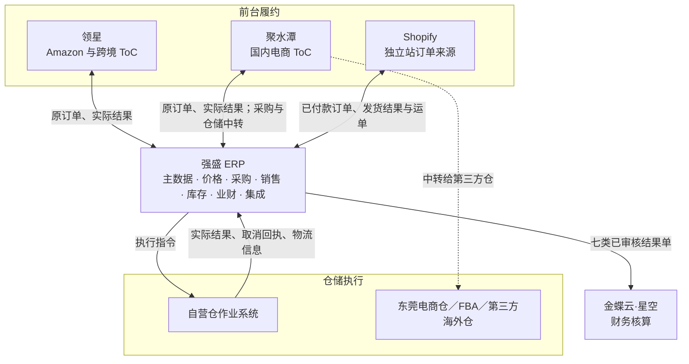
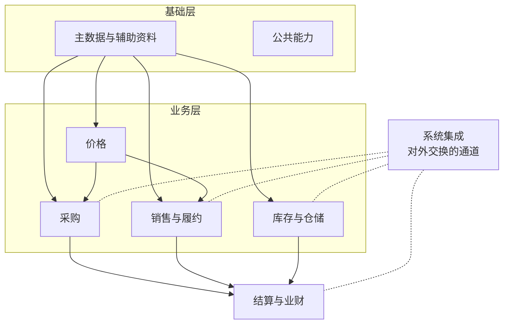

# 系统与模块地图

> 用途：说清这一版系统由哪些系统、哪些模块组成，每个模块能做哪些事、彼此怎么依赖，资料谁创建、谁分发、谁使用；文末附录给出系统的菜单结构和期次索引。既是给人和AI的整体索引，也是给研发和测试划范围的功能基线。
> 定位：应用设计层的索引文档。业务规则（为什么这么做、责任归谁）以 [03-业务分析和设计](../../../03-业务分析和设计/00-业务蓝图.md) 为准；系统表达（状态、操作、校验、字段、页面）以本文档集和 `字段清单合集` 为准。两者冲突时，前者管“该不该”，后者管“怎么做”。

| 版本 | 本次变化 | 状态 |
| --- | --- | --- |
| 2026-09-16 | 补充详细设计覆盖情况与采购、销售、库存的推进依赖 | 推进索引，未决规则以来源文档为准 |
| 2026-09-19 | 采购、B2B销售及退货通知增加仓库／虚拟处理方式 | 推进索引 |
| 2026-09-20 | 金蝶失败重推改到系统集成中心；采购入库拆开无来源建单与接口失败人工确认 | 推进索引 |
| 2026-09-20 | 仓库推送失败自动重试最多3次；采购订单正式只做导出、导入仅 Demo | 推进索引 |
| 2026-09-20 | 到期关单宽限定为T+2自然日 | 推进索引 |
| 2026-09-20 | 无来源退货数量、B2B全部发货自动关单、价目一期不禁用、税率允许0% | 推进索引 |
| 2026-09-20 | 金额千分位展示；价目按基本单位；条码全系统唯一；独立站零执行后复制新单 | 推进索引 |
| 2026-09-20 | 独立站金额沿用Shopify；原单变更未审核覆盖已审核建新单；编码保存后不可改；库存流水一期做；逻辑仓可禁用 | 推进索引 |
| 2026-09-20 | 一期做导出中心和个人中心；独立站单独菜单；仓储运营手工冻结；超量拒绝整次回传 | 推进索引 |

## 一、系统分工

强盛ERP是业务中枢：统一主数据、承接采购和销售业务、维护逻辑仓库存，把实际结果交给金蝶；前台履约和仓内作业仍由外部系统承担。

| 系统 | 定位 | 与ERP交换什么 |
| --- | --- | --- |
| 领星 | 跨境ToC的运营与履约 | 回传原订单和实际出库、退货结果 |
| 聚水潭 | 国内电商ToC的运营与履约，兼第三方仓中转 | 回传原订单和实际结果；采购和仓储的通知、结果经它中转 |
| Shopify | 独立站订单来源 | ERP拉取已付款订单；发货结果和运单反馈回去 |
| 自营仓作业系统 | 深圳自营仓的实物作业 | 接收ERP下发的执行指令，回传实际结果、取消回执和物流信息 |
| 第三方仓／WMS | 东莞电商仓、FBA、海外仓的实物作业 | 接收通知或直接推送的订单、申请单，回传实际结果 |
| 金蝶云·星空 | 财务核算底座 | 接收七类已审核结果单 |

## 二、ERP 模块与功能清单

采购、销售、库存各自把已审核结果单交给业财，不经过其他模块转手；系统集成是对外交换的通道（下发、回传、映射、异常），本身不产生业务结果。

| 模块 | 解决什么问题 | 功能点（一级 · 二级） |
| --- | --- | --- |
| 主数据与辅助资料 | 五类档案统一 | **商品档案**：新建与编辑、初始供应商与初始价格、商品管理配置（库存预警、批次、序列号、保质期）、导入、启用禁用 **供应商档案**：新建、提交审核、审核通过／驳回重提、启用禁用 **客户档案**：同上，另有国内／跨境通用2C档案 **仓库档案**：实体仓与逻辑仓、提交审核、启用禁用、非级联禁用 **物流档案**：物流商与服务产品、启用禁用 **辅助资料**：分类（三级树）、品牌、单位、币别、收付款条件的维护与启停 **分发与匹配**：SKU分发WMS／金蝶、外部商品匹配 |
| 价格 | 买多少、卖多少，老单不被调价改动 | **价目表**：采购／销售价目表的查看与查询；一期不做禁用 **价格调整单**：新建、提交、审核、驳回、审核后覆盖当前价；错价另建调整单覆盖 **取价**：按维度匹配、无价手填、改币别清价重取、零价确认、税率允许0%、提交锁定、退货沿用原价 |
| 采购 | 需求变约定，跟进交货，处理退货 | **采购订单**：新建、提交、审核、撤回、改交期、关闭、取消、下推收货通知；三状态并行 **采购收货通知单**：选择收货处理方式；仓库收货则自动推送、推送失败自动重试最多3次、仍失败可人工重试、申请取消、接收回传、零收取消；虚拟入库则不推仓库、按通知数量生成入库单 **采购入库单**：自动审核、推送金蝶；推送失败后在系统集成中心重推 **采购退货单**：新建（关联原入库或无来源）、提交、审核占库、关闭、取消、取价 **采退发货通知单／采退出库单**：同收货链，发货处理方式为仓库发货或虚拟出库 |
| 销售与履约 | 三类渠道各自接单、交付、退货 | **B2B订单**：新建、提交、审核占库、改交期、关闭、取消、下推发货通知；全部发货后自动关单 **销售发货通知单／销售出库单**：同采购链，发货处理方式为仓库发货或虚拟出库 **独立站**：拉取已付款订单、选仓选物流、审核占库并自动推送、取消审核（终止／调整重执行）、整单零执行后取消原单、再发复制新单、回写发货结果；本期不增加虚拟出库 **外部电商**：接收原订单与实际结果、匹配与库存校验、自动审核、异常重试 **销售退货单／销退收货通知单／销退入库单**：溯源与无来源、可退额度控制、关闭取消；无来源每行大于0；收货处理方式为仓库收货或虚拟入库 |
| 库存与仓储 | 有多少可用，收发和转移怎么改库存 | **库存查询**：按逻辑仓看即时、预占、冻结、可用 **库存流水**：按逻辑仓、商品、时间查询，能点进结果单 **预占与冻结**：审核预占、实际出库消耗、取消释放；仓储运营手工冻结与解冻，只能冻可用量 **其他出入库**：申请、审核、推送、回传、允许缺量、超量拒绝整次回传、取消 **直接调拨**：人工创建并审核，或仓库回传自动审核 **分步式调拨**：发起、审核预占、调出通知、调入通知、主单自动完结、零调出取消、零调入异常、在途差异 **库存比对**：按实体仓＋SKU＋库存状态汇总比较、差异展示 **在途**：虚拟在途仓、人工调回或其他出库处理 |
| 结算与业财 | 把实际结果交给财务 | **结果单推送**：七类已审核结果单自动逐单推送、记录结果、失败重试 **推送记录与查看**：原单、状态、时间、失败原因 **异常运维边界**：成功后删单重推属技术运维；失败重推在系统集成中心，不做业务列表行内入口 |
| 系统集成 | 和外部怎么换、出问题在哪看 | **映射维护**：商品、仓库、货主的外部对应关系 **交换与分发**：通知下发、结果回传、SKU分发 **推送异常**：集中查看推送失败与处理记录；金蝶失败可针对原单重推 **人工补充**：人工确认实际结果、Shopify未覆盖订单导入 |
| 公共能力 | 跨模块共用机制 | **权限**：RBAC、提交／审核权限 **审核**：草稿提交；有已驳回态的对象用审核通过／驳回，无已驳回态的业务单据用审核／撤回（见[《单据与状态流转》](03-单据与状态流转.md)） **导入导出**：一期正式导入按对象PRD；导出走导出中心，覆盖主数据和业务单据 **编码规范**、**技术参数**（暂由配置维护） **个人中心**：改密码、基本资料；工作台后置 |

按模块归并的一级、二级菜单和期次见文末附录《系统菜单结构与期次》。功能点的一级、二级和菜单的一级、二级不是一回事：前者划范围，后者是导航展示。

## 三、模块依赖

| 模块 | 依赖谁 | 依赖什么 |
| --- | --- | --- |
| 价格 | 主数据 | 商品、供应商、客户范围、币别 |
| 采购 | 主数据、价格 | 供应商、商品、仓库、采购价 |
| 销售与履约 | 主数据、价格 | 客户、商品、仓库、物流、销售价 |
| 库存与仓储 | 主数据；采购和销售的审核占用 | 商品、逻辑仓；销售与采购退货的预占 |
| 结算与业财 | 采购、销售、库存 | 七类结果单 |
| 系统集成 | 各业务模块 | 单据、映射 |

依赖方向是单向的：业务模块不反向改主数据，库存不反向改业务单据。

## 四、资料流：谁创建、谁审核、谁分发、谁使用

| 资料 | 创建 | 审核 | 分发 | 使用 |
| --- | --- | --- | --- | --- |
| 商品（成品SKU） | 商品开发与管理人员 | 不审核 | 第三方WMS、金蝶 | 采购、销售、库存、价格 |
| 供应商 | 主数据维护人员 | 要审核 | — | 采购 |
| 客户 | 主数据维护人员 | 要审核 | — | 销售（含外部电商通用2C） |
| 实体仓、逻辑仓 | 主数据维护人员 | 要审核 | 仓库侧按映射对应 | 采购、销售、库存 |
| 物流商与服务产品 | 主数据维护人员 | 不审核 | 选择结果下发给仓库 | 销售发货 |
| 辅助资料 | 主数据维护人员 | 不审核 | — | 全模块引用 |
| 价格 | 商品建档生成初始价，后续由调整单覆盖 | 本业务线有权人员 | — | 采购、销售单据取价 |

细节规则见《主数据准备》和《价格业务设计》；这张表只回答“谁建、谁审、谁用”。

## 五、本期范围

**做**：主数据、价格、采购正向与退货、B2B与独立站正向及退货、外部ToC结果归集、逻辑仓库存与预占冻结、其他出入库、仓间调拨与在途、库存比对、库存流水、七类结果单推送金蝶、权限与审核、导出中心、个人中心。

**不做**：生产制造与物料计划、采购申请与自动测算、供应商门户、商品供货关系、报价合同与信用强制拦截、独立站拆单缺量发货、ERP执行退款、平台账单与回款对账、全量库存双向同步、跨渠道配额、多主体之间的购销与调拨（范围口径见《强盛ERP需求分析总览》§3.1）、ERP盘点单、自研WMS／SRM、完整财务核算。

## 六、文档索引与权威声明

| 文件 | 回答什么 |
| --- | --- |
| 本文 | 有什么系统、哪些模块、每个模块能做什么、资料谁建谁用 |
| 《系统流程与单据交互》 | 每条链路里，系统之间怎么交互、单据状态怎么变 |
| 《实体对象关系》 | 流程里的对象是什么、谁引用谁、数量怎么流动 |
| 《单据与状态流转》 | 每类单据的状态、操作、条件、校验和联动 |

**权威声明**：同一件事越靠近实现越有解释权。系统表达（状态、操作、条件、校验、写回）以本文档集和模块PRD为准；业务规则（业务含义、责任、范围边界）以 [03-业务分析和设计](../../../03-业务分析和设计/00-业务蓝图.md) 为准；字段与枚举取值以 `字段清单合集` 为准；页面与交互以 `09-产品原型` 为准。单据分层模型看[《强盛ERP的单据分层设计》](../../../01-全局背景信息/5.强盛ERP的单据分层设计.md)，那里是模型说明，其中的枚举和流程是示例。两边写得不一样时，先确认是“业务规则变了”还是“系统表达错了”，再改对应的一份。

### 详细设计的覆盖与推进依赖

截至2026-09-16，本目录已有四篇应用设计总图、采购六类单据的初稿与详细字段清单，以及基础资料字段初稿（商品另有详细稿）；尚未形成各模块PRD。四篇说明整体系统关系，不代表所有模块已经达到研发交付深度。

按采购、销售、库存依次补齐详细设计；主数据、价格、权限与外部交接随所依赖的业务同步完善。下表只标推进依赖，不重复维护业务规则，也不是上线排期。对应规则确认后，先回填需求分析和业务设计，再落实字段及PRD。

| 推进顺序 | 可依据现有结论继续的内容 | 对应方案定稿前须确认 | 规则来源 |
| --- | --- | --- | --- |
| 采购正向与退货 | 以六类字段清单为基础补充功能、校验和验收；沿用本目录已有流程与状态 | 关联入库可退额度、无来源每行大于0、审核后只改截止时间、退货单据日期已定 | [《采购业务管理需求分析》§七](../../../02-需求调研和分析/02-采购业务管理/采购业务管理需求分析.md) |
| 销售与履约 | 按B2B、独立站、外部电商分别补字段与PRD，共用结果单保持一致 | 独立站金额沿用Shopify、原单变更未审核覆盖已审核建新单、零执行后复制新单仍挂同一Shopify单号、B2B全部发货自动关单、无来源退货每行大于0已定 | [《销售与履约需求分析》§七](../../../02-需求调研和分析/04-销售与履约/销售与履约需求分析.md)、[《销售与履约业务设计》待确认事项](../../../03-业务分析和设计/02-销售与履约业务设计.md) |
| 库存与仓储 | 补库存查询、库存流水、其他收发、直接及分步式调拨的字段与PRD，分别表达预占、实物和在途变化 | 在途人工调回路径、零调入和库存不足后的处理结果、比对时点。库存流水一期做；仓储运营手工冻结解冻；超量拒绝整次回传已定 | [《库存与仓储需求分析》§七](../../../02-需求调研和分析/03-库存与仓储/库存与仓储需求分析.md)、[《库存与仓储业务设计》待确认事项](../../../03-业务分析和设计/03-库存与仓储业务设计.md) |
| 随各条链同步 | 补相关档案引用资格、价格快照、人工结果审核及对外结果交接 | 人工确认权限、来源结果识别与恢复。金蝶字段对照本期不编、由财务联调给出。逻辑仓可禁用、编码保存后不可改、建档后初始供应商和初始价不能改、价税精度、税率允许0%、一期不做价目禁用、价目按基本单位、初始价允许为空已定 | [《价格管理需求分析》§七](../../../02-需求调研和分析/06-价格管理/价格管理需求分析.md)、[《商品与主数据需求分析》§七](../../../02-需求调研和分析/01-商品与主数据/商品与主数据需求分析.md)、[《系统集成需求分析》§七](../../../02-需求调研和分析/07-系统集成/系统集成需求分析.md)、[《结算与业财需求分析》§七](../../../02-需求调研和分析/05-结算与业财/结算与业财需求分析.md) |

一条链路进入研发交接前，字段、状态操作与业务验收必须一致，影响数量和金额的待决策不能留给实现人员默认处理。实际接口能力未经核验的，应明确交付仍为模拟演示；初始化与切换继续按实施阶段安排。

---

## 附录：系统菜单结构与期次

> 定位：展示层的索引，回答系统向用户提供哪些一级、二级菜单、各自对应哪个模块、哪一期做。模块边界和范围仍以正文和02的模块需求稿为准；菜单内部的具体页面（列表、表单、详情）以 `09-产品原型` 为准。
> 期次只有三档：一期、后置（未排期）、不做。后置不等于二期，项目没有二期排期。不做的能力（采购申请、供应商门户、ERP盘点单、多主体之间的购销与调拨、自研WMS／SRM、财务核算台账等）是能力边界，不是菜单条目，见“本期范围”。
> “对应模块”列按[《需求分析总览》](../../../02-需求调研和分析/00-调研总览/强盛ERP需求分析总览.md)的九个模块口径填写，便于回查需求文档；正文“ERP模块与功能清单”把辅助资料并入主数据，是表述上的合并，不改变模块归属。一期九个模块分别归入“基础资料、价格管理、采购管理、销售管理、库存管理、系统集成、系统设置”七个模块一级菜单（辅助资料并进基础资料，结算与业财的推送记录并进系统集成）；工作台后置，不作为一期菜单。
> 菜单结构（有哪些一级、二级菜单）以本表为基线，`09-产品原型` 的导航跟随本表更新；原型里超出本表的临时入口（如“自定义中心”）是演示占位，不作为结构内容。

| 一级菜单 | 二级菜单 | 对应模块 | 期次 | 说明 |
| --- | --- | --- | --- | --- |
| 工作台 | 工作台 | — | 后置 | 原型可保留演示入口；一期不做工作台内容 |
| 基础资料 | 商品资料 | 商品与主数据 | 一期 | 含商品分类、品牌、基本单位的引用 |
| 基础资料 | 供应商资料 | 商品与主数据 | 一期 | |
| 基础资料 | 客户资料 | 商品与主数据 | 一期 | 含国内、跨境通用2C客户 |
| 基础资料 | 仓库资料 | 商品与主数据 | 一期 | 实体仓、逻辑仓 |
| 基础资料 | 物流资料 | 商品与主数据 | 一期 | 物流商、物流服务产品 |
| 基础资料 | 辅助资料 | 辅助资料 | 一期 | 商品分类、品牌、基本单位、币别、付款条件、收款条件 |
| 价格管理 | 采购价目表 | 价格管理 | 一期 | 只查看和查询，不直接编辑 |
| 价格管理 | 销售价目表 | 价格管理 | 一期 | 同上 |
| 价格管理 | 采购价格调整单 | 价格管理 | 一期 | |
| 价格管理 | 销售价格调整单 | 价格管理 | 一期 | |
| 采购管理 | 采购订单 | 采购 | 一期 | |
| 采购管理 | 采购收货通知单 | 采购 | 一期 | |
| 采购管理 | 采购入库单 | 采购 | 一期 | |
| 采购管理 | 采购退货单 | 采购 | 一期 | |
| 采购管理 | 采退发货通知单 | 采购 | 一期 | |
| 采购管理 | 采退出库单 | 采购 | 一期 | |
| 销售管理 | 销售订单 | 销售与履约 | 一期 | B2B渠道；一张订单一个仓库、一个交期，支持分批通知 |
| 销售管理 | 销售发货通知单 | 销售与履约 | 一期 | |
| 销售管理 | 销售出库单 | 销售与履约 | 一期 | |
| 销售管理 | 独立站订单 | 销售与履约 | 一期 | 2C渠道（Shopify）；单独菜单，不并入销售订单；ERP拉单、人工选仓选物流、审核后自动推送仓库，整单履约 |
| 销售管理 | 外部电商订单 | 销售与履约 | 一期 | 2C渠道（领星、聚水潭）；只归集原订单和实际结果，不驱动履约 |
| 销售管理 | 销售退货单 | 销售与履约 | 一期 | |
| 销售管理 | 销退收货通知单 | 销售与履约 | 一期 | |
| 销售管理 | 销退入库单 | 销售与履约 | 一期 | |
| 库存管理 | 库存查询 | 库存与仓储 | 一期 | 即时、预占、冻结、可用；仓储运营可在此办理手工冻结解冻 |
| 库存管理 | 库存流水 | 库存与仓储 | 一期 | 按逻辑仓、商品、时间查询，能点进对应结果单；展示列随字段清单 |
| 库存管理 | 其他入库申请单 | 库存与仓储 | 一期 | |
| 库存管理 | 其他入库单 | 库存与仓储 | 一期 | |
| 库存管理 | 其他出库申请单 | 库存与仓储 | 一期 | |
| 库存管理 | 其他出库单 | 库存与仓储 | 一期 | |
| 库存管理 | 分步式调拨单 | 库存与仓储 | 一期 | 调拨主单 |
| 库存管理 | 调出通知单 | 库存与仓储 | 一期 | |
| 库存管理 | 调入通知单 | 库存与仓储 | 一期 | 与调出通知单各占一个二级菜单 |
| 库存管理 | 直接调拨单 | 库存与仓储 | 一期 | 分步式调拨两端的实际结果，也可以人工一步式创建 |
| 库存管理 | 库存比对 | 库存与仓储 | 一期 | 按实体仓、SKU、库存状态汇总比较 |
| 系统集成 | 业财结果单据 | 系统集成、结算与业财 | 一期 | 七类结果单的原单、推送状态、时间、失败原因；失败可针对原单重推，不能改业务信息；能力归结算与业财，入口在系统集成中心 |
| 系统集成 | 推送异常 | 系统集成 | 一期 | 外部推送失败的异常单据和失败记录，含必要的处理记录 |
| 系统集成 | 人工补充 | 系统集成 | 一期 | 人工确认实际结果（含采购已下发仓库、接口失败的情形）、Shopify未覆盖订单导入；不能无来源建采购入库单；入口统一在本菜单 |
| 系统集成 | 外部映射 | 系统集成 | 一期 | 商品、仓库、货主；建档后配置，低频 |
| 系统设置 | 导入中心 | 公共能力 | 一期 | 导入对象和批量错误处理按具体PRD |
| 系统设置 | 导出中心 | 公共能力 | 一期 | 覆盖主数据和业务单据；打印后置 |
| 系统设置 | 用户与权限 | 公共能力 | 一期 | 账号、角色、数据权限的细节待系统管理PRD |
| 系统设置 | 个人中心 | 公共能力 | 一期 | 改密码、基本资料 |
| 系统设置 | 消息与待办 | 公共能力 | 后置 | 待办和消息提醒一期不做 |
| 系统设置 | 参数配置 | 公共能力 | 后置 | 一期由技术支持或运维通过代码配置文件维护 |
| 系统设置 | 操作日志 | 公共能力 | 后置 | 完整操作日志不列为一期必做 |

几点说明：

- 菜单顺序按使用安排：业务模块内按链路顺序排（订单／申请 → 通知 → 结果单），正向链在前、退货链在后；查询类放在模块最前，比对、映射、参数这类低频或配置菜单放在最后。
- 外部交换按交换对象分三类：给WMS／SaaS的业务单据、给金蝶的七类结果单、主数据分发。前两类的推送状态记在来源单据或“业财结果单据”上，失败集中到“推送异常”，不单设通用推送日志菜单。
- 销售管理的订单菜单按渠道分组：B2B渠道是销售订单，2C渠道是独立站订单和外部电商订单。两者都是2C，但ERP角色不同：独立站由ERP拉单并推动履约，外部电商只归集原订单和实际结果。销售发货通知单只用于B2B；销售出库单、销售退货单、销退收货通知单和销退入库单是共用的执行与结果单据，不按渠道拆菜单。
- SKU分发到WMS、金蝶，外部商品匹配由系统自动执行，或并入“系统集成”，不单列菜单。
- 一级菜单名称先按模块口径给出，最终命名待确认；调出通知单与调入通知单各占一个二级菜单。
- 维护方式：菜单增删先改本表，再同步 `09-产品原型` 的导航；模块范围变化回到正文“ERP模块与功能清单”和02模块需求稿。
