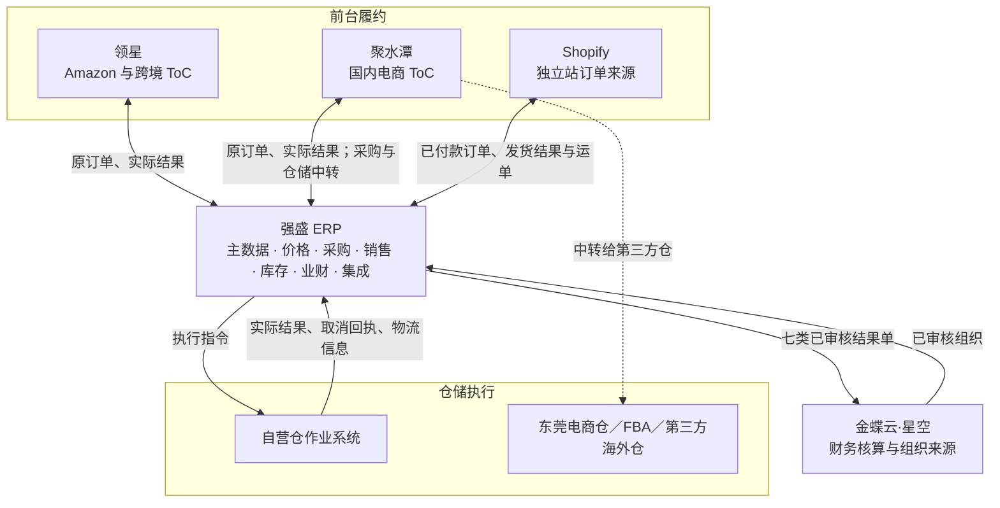
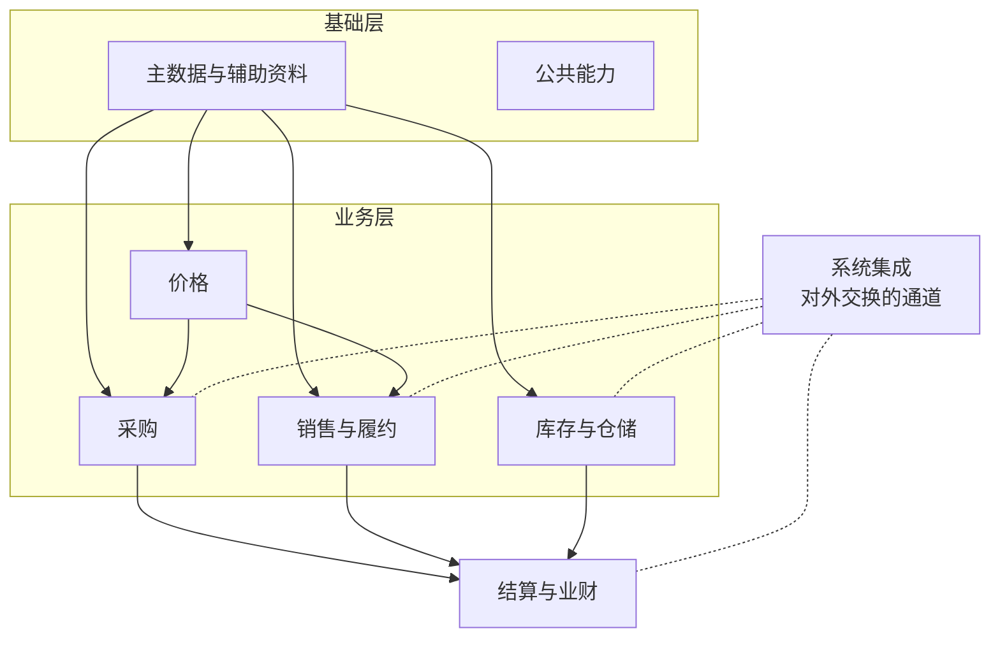

# 系统与模块地图

> 用途：说清这一版系统由哪些系统、哪些模块组成，每个模块能做哪些事、彼此怎么依赖，资料谁创建、谁分发、谁使用。既是给人和 AI 的整体索引，也是给研发和测试划范围的功能基线。
> 定位：应用设计层的索引文档。业务规则（为什么这么做、责任归谁）以 [03-业务分析和设计](../../../03-业务分析和设计/00-业务蓝图.md) 为准；系统表达（状态、操作、校验、字段、页面）以本文档集和 `字段清单合集` 为准。两者冲突时，前者管"该不该"，后者管"怎么做"。

## 一、系统分工

强盛 ERP 是业务中枢：统一主数据、承接采购和销售业务、维护逻辑仓库存，把实际结果交给金蝶；前台履约和仓内作业仍由外部系统承担。

| 系统 | 定位 | 与 ERP 交换什么 |
| --- | --- | --- |
| 领星 | 跨境 ToC 的运营与履约 | 回传原订单和实际出库、退货结果 |
| 聚水潭 | 国内电商 ToC 的运营与履约，兼第三方仓中转 | 回传原订单和实际结果；采购和仓储的通知、结果经它中转 |
| Shopify | 独立站订单来源 | ERP 拉取已付款订单；发货结果和运单反馈回去 |
| 自营仓作业系统 | 深圳自营仓的实物作业 | 接收 ERP 下发的执行指令，回传实际结果、取消回执和物流信息 |
| 第三方仓／WMS | 东莞电商仓、FBA、海外仓的实物作业 | 接收通知或直接推送的订单、申请单，回传实际结果 |
| 金蝶云·星空 | 财务核算底座，也是组织的来源 | 接收七类已审核结果单；向 ERP 提供已审核组织 |

## 二、ERP 模块与功能清单

采购、销售、库存各自把已审核结果单交给业财，不经过其他模块转手；系统集成是对外交换的通道（下发、回传、映射、异常），本身不产生业务结果。

| 模块 | 解决什么问题 | 功能点（一级 · 二级） |
| --- | --- | --- |
| 主数据与辅助资料 | 五类档案统一，组织只读引用 | **商品档案**：新建与编辑、初始供应商与初始价格、商品管理配置（库存预警、批次、序列号、保质期）、导入、启用禁用 **供应商档案**：新建、提交审核、审核通过／驳回重提、启用禁用 **客户档案**：同上，另有国内／跨境通用 2C 档案 **仓库档案**：实体仓与逻辑仓、提交审核、启用禁用、非级联禁用 **物流档案**：物流商与服务产品、启用禁用 **辅助资料**：分类（三级树）、品牌、单位、币别、收付款条件的维护与启停 **组织**：只读查询 **分发与匹配**：SKU 分发 WMS／金蝶、外部商品匹配 |
| 价格 | 买多少、卖多少，老单不被调价改动 | **价目表**：采购／销售价目表的查看与查询 **价格调整单**：新建、提交、审核、驳回、审核后覆盖当前价 **取价**：按维度匹配、无价手填、改币别清价重取、零价确认、提交锁定、退货沿用原价 |
| 采购 | 需求变约定，跟进交货，处理退货 | **采购订单**：新建、提交、审核、退回、改交期、关闭、取消、下推收货通知；三状态并行 **采购收货通知单**：创建后自动推送、推送失败重试、申请取消、接收回传、零收取消 **采购入库单**：自动／人工审核、推送金蝶、失败重试 **采购退货单**：新建（关联原入库或无来源）、提交、审核占库、关闭、取消、取价 **采退发货通知单／采退出库单**：同收货链 |
| 销售与履约 | 三类渠道各自接单、交付、退货 | **B2B 订单**：新建、提交、审核占库、改交期、关闭、取消、下推发货通知 **销售发货通知单／销售出库单**：同采购链 **独立站**：拉取已付款订单、选仓选物流、审核占库并自动推送、取消审核（终止／调整重执行）、整单零执行处理、回写发货结果 **外部电商**：接收原订单与实际结果、匹配与库存校验、自动审核、异常重试 **销售退货单／销退收货通知单／销退入库单**：溯源与无来源、可退额度控制、关闭取消 |
| 库存与仓储 | 有多少可用，收发和转移怎么改库存 | **库存查询**：按逻辑仓看即时、预占、冻结、可用 **预占与冻结**：审核预占、实际出库消耗、取消释放、冻结与解冻 **其他出入库**：申请、审核、推送、回传、允许缺量、取消 **直接调拨**：人工创建并审核，或仓库回传自动审核 **分步式调拨**：发起、审核预占、调出通知、调入通知、主单自动完结、零调出取消、零调入异常、在途差异 **库存比对**：按实体仓＋SKU＋库存状态汇总比较、差异展示 **在途**：虚拟在途仓、人工调回或其他出库处理 |
| 结算与业财 | 把实际结果交给财务 | **结果单推送**：七类已审核结果单自动逐单推送、记录结果、失败重试 **推送记录与查看**：原单、状态、时间、失败原因 **异常运维边界**：成功后删单重推属技术运维，不做常规业务入口 |
| 系统集成 | 和外部怎么换、出问题在哪看 | **映射维护**：商品、仓库、货主的外部对应关系 **交换与分发**：通知下发、结果回传、SKU 分发 **异常中心**：集中查看推送失败与处理记录 **人工补充**：人工确认实际结果、Shopify 未覆盖订单导入 **组织拉取**：金蝶已审核组织同步 |
| 公共能力 | 跨模块共用机制 | **权限**：RBAC、提交／审核权限 **审核**：提交、通过、退回 **导入导出**：导入不绕过原有审核 **编码规范**、**技术参数**（暂由配置维护） |

## 三、模块依赖

| 模块 | 依赖谁 | 依赖什么 |
| --- | --- | --- |
| 价格 | 主数据、组织 | 商品、供应商、客户范围、币别、组织 |
| 采购 | 主数据、组织、价格 | 供应商、商品、仓库、采购组织、采购价 |
| 销售与履约 | 主数据、组织、价格 | 客户、商品、仓库、物流、销售组织、销售价 |
| 库存与仓储 | 主数据、组织；采购和销售的审核占用 | 商品、逻辑仓、库存组织；销售与采购退货的预占 |
| 结算与业财 | 采购、销售、库存 | 七类结果单与组织 |
| 系统集成 | 各业务模块、组织 | 单据、映射、金蝶组织 |

依赖方向是单向的：业务模块不反向改主数据，库存不反向改业务单据。

## 四、资料流：谁创建、谁审核、谁分发、谁使用

| 资料 | 创建 | 审核 | 分发 | 使用 |
| --- | --- | --- | --- | --- |
| 商品（成品 SKU） | 商品开发与管理人员 | 不审核 | 第三方 WMS、金蝶 | 采购、销售、库存、价格 |
| 供应商 | 主数据维护人员 | 要审核 | — | 采购 |
| 客户 | 主数据维护人员 | 要审核 | — | 销售（含外部电商通用 2C） |
| 实体仓、逻辑仓 | 主数据维护人员 | 要审核 | 仓库侧按映射对应 | 采购、销售、库存 |
| 物流商与服务产品 | 主数据维护人员 | 不审核 | 选择结果下发给仓库 | 销售发货 |
| 组织 | 金蝶 | 金蝶审核 | ERP 主动拉取 | 采购、销售、库存、财务 |
| 辅助资料 | 主数据维护人员 | 不审核 | — | 全模块引用 |
| 价格 | 商品建档生成初始价，后续由调整单覆盖 | 本业务线有权人员 | — | 采购、销售单据取价 |

细节规则见《主数据与组织准备》和《价格业务设计》；这张表只回答"谁建、谁审、谁用"。

## 五、本期范围

**做**：主数据与组织引用、价格、采购正向与退货、B2B 与独立站正向及退货、外部 ToC 结果归集、逻辑仓库存与预占冻结、其他出入库、同组织调拨与在途、库存比对、七类结果单推送金蝶、权限与审核等公共能力。

**不做**：生产制造与物料计划、采购申请与自动测算、供应商门户、商品供货关系、报价合同与信用强制拦截、独立站拆单缺量发货、ERP 执行退款、平台账单与回款对账、全量库存双向同步、跨渠道配额、跨组织调拨、ERP 盘点单、自研 WMS／SRM、完整财务核算。

## 六、文档索引与权威声明

| 文件 | 回答什么 |
| --- | --- |
| 本文 | 有什么系统、哪些模块、每个模块能做什么、资料谁建谁用 |
| 《系统流程与单据交互》 | 每条链路里，系统之间怎么交互、单据状态怎么变 |
| 《实体对象关系》 | 流程里的对象是什么、谁引用谁、数量怎么流动 |
| 《单据与状态流转》 | 每类单据的状态、操作、条件、校验和联动 |

**权威声明**：同一件事越靠近实现越有解释权。系统表达（状态、操作、条件、校验、写回）以本文档集和模块 PRD 为准；业务规则（业务含义、责任、范围边界）以 [03-业务分析和设计](../../../03-业务分析和设计/00-业务蓝图.md) 为准；字段与枚举取值以 `字段清单合集` 为准；页面与交互以 `09-产品原型` 为准。单据分层模型看[《强盛ERP的单据分层设计》](../../../01-全局背景信息/5.强盛ERP的单据分层设计.md)，那里是模型说明，其中的枚举和流程是示例。两边写得不一样时，先确认是“业务规则变了”还是“系统表达错了”，再改对应的一份。
