# 系统流程与单据交互

> 用途：每条业务链路的**系统流程**——谁发起、经过哪些系统和单据、单据状态怎么变、系统之间怎么交互、出问题怎么收。另附一节准备链和人工补充。给研发和测试做实现依据。
> 说明：业务背景一句带过，重点在系统交互和状态流转。字段见 `字段清单合集`，状态全集见《单据与状态流转》，业务规则解释见 [03-业务分析和设计](../../../03-业务分析和设计/00-业务蓝图.md) 各篇。
> 图的读法：矩形里写"角色或系统 + 动作 + 单据"，箭头标触发方式；标"系统"的是自动动作，不需要人点。

## 1 采购入库

采购把需求变成约定，供应商交货，仓库实收后入库，结果推金蝶。

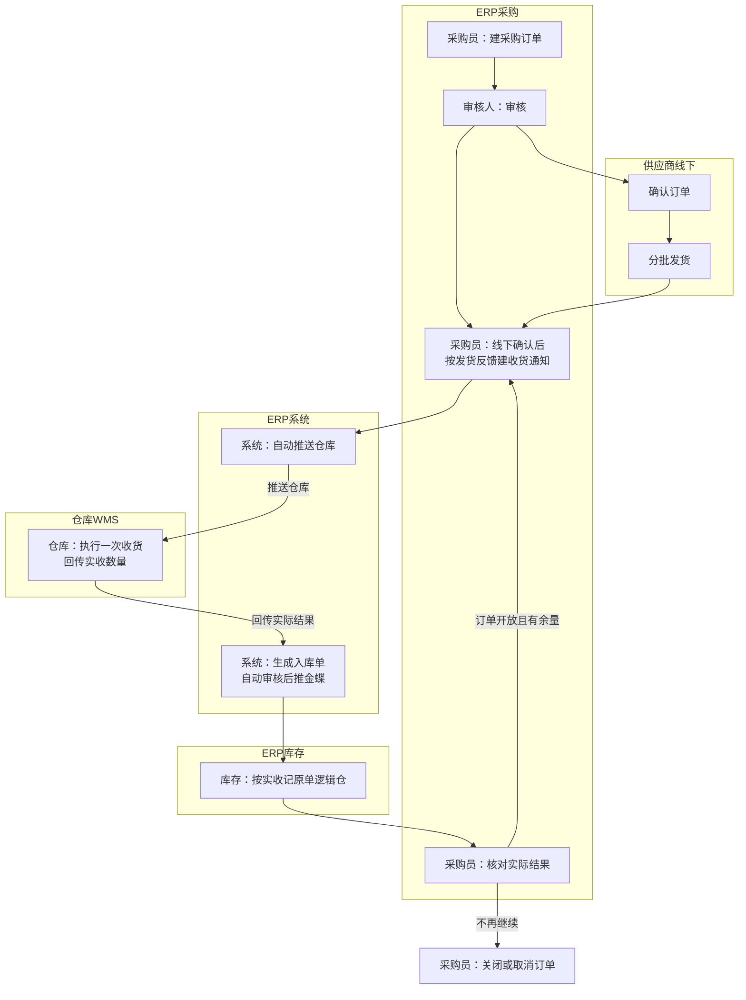

| # | 谁 | 动作与单据 | 状态变化 | 触发与校验 | 异常与处理 |
| --- | --- | --- | --- | --- | --- |
| 1 | 采购员 | 人工测算后建采购订单；一个仓库、一个交期，不同仓库或交期拆单 | — → 草稿 | 商品、供应商已启用；按供应商＋商品＋币别取价，无价可手填 | 空价、负价不能提交；零价需确认 |
| 2 | 采购审核人 | 审核订单 | 草稿 → 待审核 → 已审核 | 数量、价格、税率完整 | 退回回到草稿，保留退回意见 |
| 3 | 采购员 | 线下与供应商确认；按供应商发货反馈建采购收货通知，填本次通知数量 | 订单可下推数量减少；通知：待推送 | 订单已审核、正常、有可下推数量；创建即占用额度 | 超订单量需另建订单 |
| 4 | 系统 | 自动推送仓库 | 通知：待推送 → 推送中 → 待收货 | 通知创建后自动发送，不需要人工触发 | 明确失败 → 推送失败，可重试 |
| 5 | 仓库（WMS） | 执行一次收货，回传实收数量并结束 | 通知：待收货 → 已收货 | 实收不超过通知量；按来源行回写 | 实收 0 → 通知按零收取消；超量拒绝；校验失败挂异常 |
| 6 | 系统 | 生成采购入库单并自动审核，随后推金蝶 | 入库单：已审核；推送状态独立记录 | 回传校验通过 | 推送失败不回滚库存，修复后重推原单 |
| 7 | 库存 | 按实收增加原单指定逻辑仓库存 | — | 逻辑仓来自原单，不因仓库主动回传重新分仓 | 归属依据不足挂异常，不任意选仓 |
| 8 | 采购员 | 订单仍开放且有余量则回到第 3 步；否则结束 | 收货状态：未收货 → 部分收货 → 全部收货 | 累计实收不超过订购量 | 关闭后不再新增通知，已有通知继续执行 |

## 2 采购退货

已入库的不合格品或协商退货，退给供应商，实际发出后减库存。

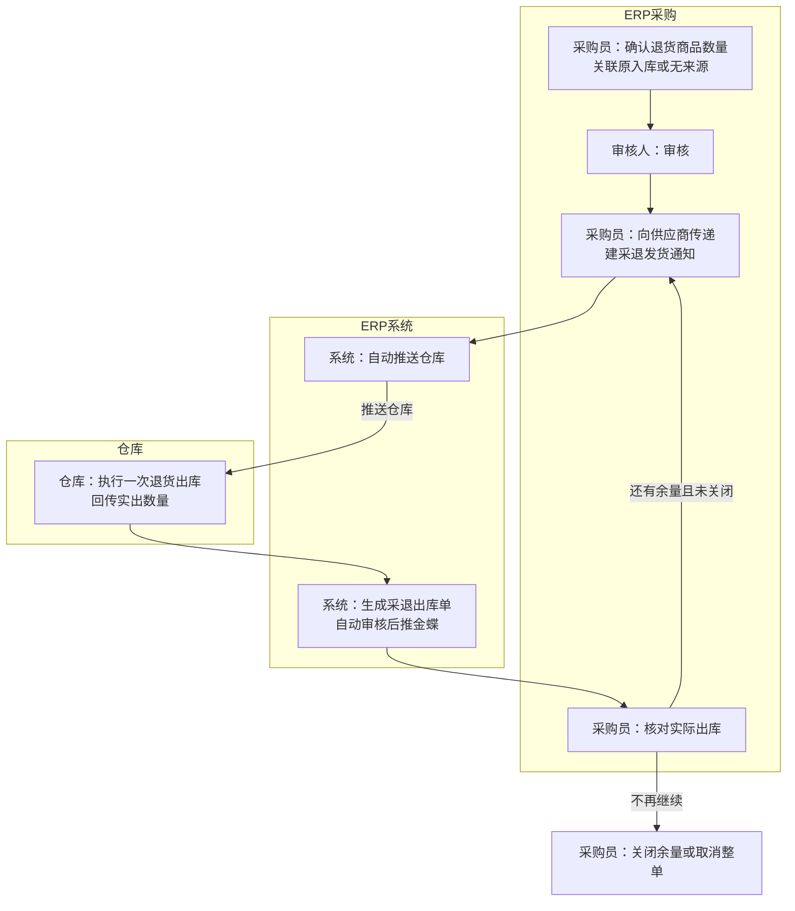

| # | 谁 | 动作与单据 | 状态变化 | 触发与校验 | 异常与处理 |
| --- | --- | --- | --- | --- | --- |
| 1 | 采购员 | 确认退货商品、数量、供应商、出库仓；可关联原入库带出价格 | — → 草稿 | 关联时必须落在原入库数量范围内（上限待确认） | 无来源或原价缺失可手填或查当前采购价 |
| 2 | 采购审核人 | 审核退货单 | 草稿 → 待审核 → 已审核 | 提交后价格和税率锁定 | 退回回草稿 |
| 3 | ERP | 审核时占用可用库存 | 退货单：占库 | 可用量足够；不足不能审核 | 可用不足阻断审核 |
| 4 | 采购员 | 向供应商传递，建采退发货通知 | 通知：待推送；可下推量减少 | 创建即占用额度 | — |
| 5 | 系统 | 自动推送仓库 | 通知：待推送 → 推送中 → 待发货 | — | 失败可重试 |
| 6 | 仓库 | 执行一次出库，回传实出数量 | 通知：待发货 → 已发货（实出 0 按零出取消） | 实出不超过通知量 | 校验失败挂异常 |
| 7 | 系统与库存 | 生成采退出库单并自动审核；减即时库存、消耗本次预占 | 出库单：已审核；推送金蝶 | 已审核结果单才推送 | 推送失败不回滚 |
| 8 | 采购员 | 少出回补可下推量；不再退就关闭余量或取消整单 | 退货单：已关闭／已取消 | 关闭释放未下推预占；取消要求无实出且无待执行通知 | 已实出只能关闭余量；两种终止都不能撤销 |

## 3 B2B 销售

线下成交、审核占库、分批交付，实际出库减库存。

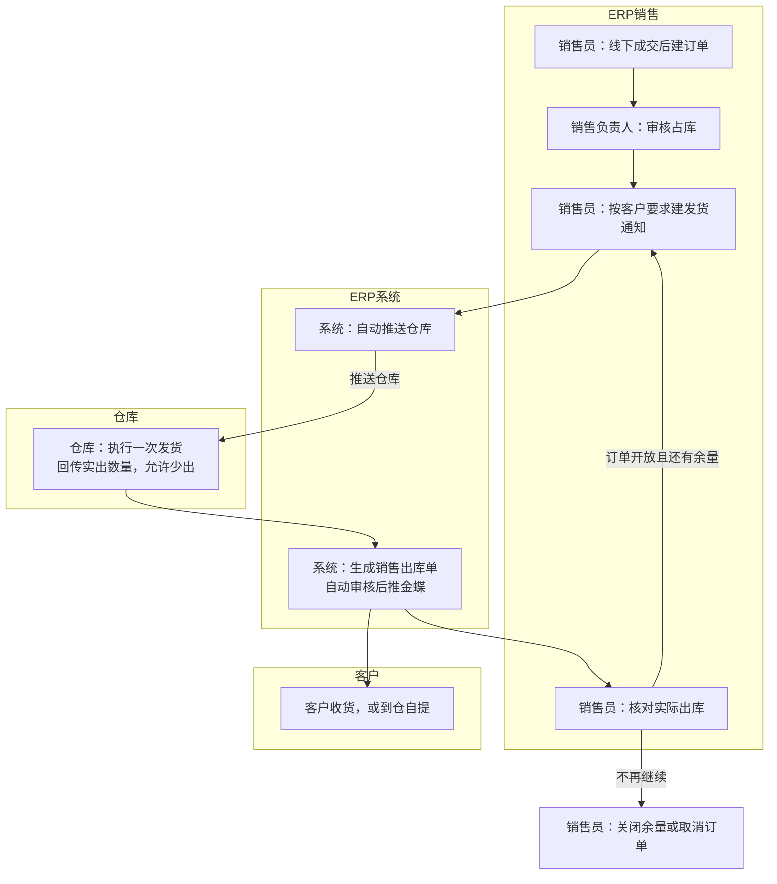

| # | 谁 | 动作与单据 | 状态变化 | 触发与校验 | 异常与处理 |
| --- | --- | --- | --- | --- | --- |
| 1 | 销售员 | 线下谈妥后建单：一个仓库、一个交期，多仓拆单 | — → 草稿 | 客户启用；取价按具体客户价 → 客户等级价 → 基准价，均无则手填 | 信用欠款只提醒，不拦发货 |
| 2 | 销售负责人 | 审核订单 | 草稿 → 待审核 → 已审核 | 库存足够才能审核 | 缺货审核报错，等补货后重试 |
| 3 | ERP | 审核时预留整单库存 | 订单：占库 | 可用量校验 | 不足不能占库 |
| 4 | 销售员 | 按客户要求建发货通知（可分批、地址可不同、可自提） | 可下推量减少；通知：待推送 | 有可下推量；创建即占用 | 超量需另建通知 |
| 5 | 系统 | 自动推送仓库 | 通知：→ 待发货 | — | 失败可重试 |
| 6 | 仓库 | 执行一次发货，回传实出（允许少出） | 通知：→ 已发货 | 实出不超过通知量 | 实出 0 按零出取消 |
| 7 | 系统与库存 | 生成销售出库单并自动审核；减即时库存、消耗对应预占 | 出库单：已审核；推金蝶 | 已审核结果单才推送 | 推送失败不回滚 |
| 8 | 销售员 | 少出回补可下推量；继续、关闭或取消 | 发货状态：未发货 → 部分发货 → 全部发货 | 关闭释放未安排占库，保留执行中通知占库；取消要等仓库确认 | 仓库拒绝取消则恢复继续执行 |

## 4 Shopify 独立站

ERP 拉单、人工审核后自动推送仓库，整单履约，结果回写 Shopify。

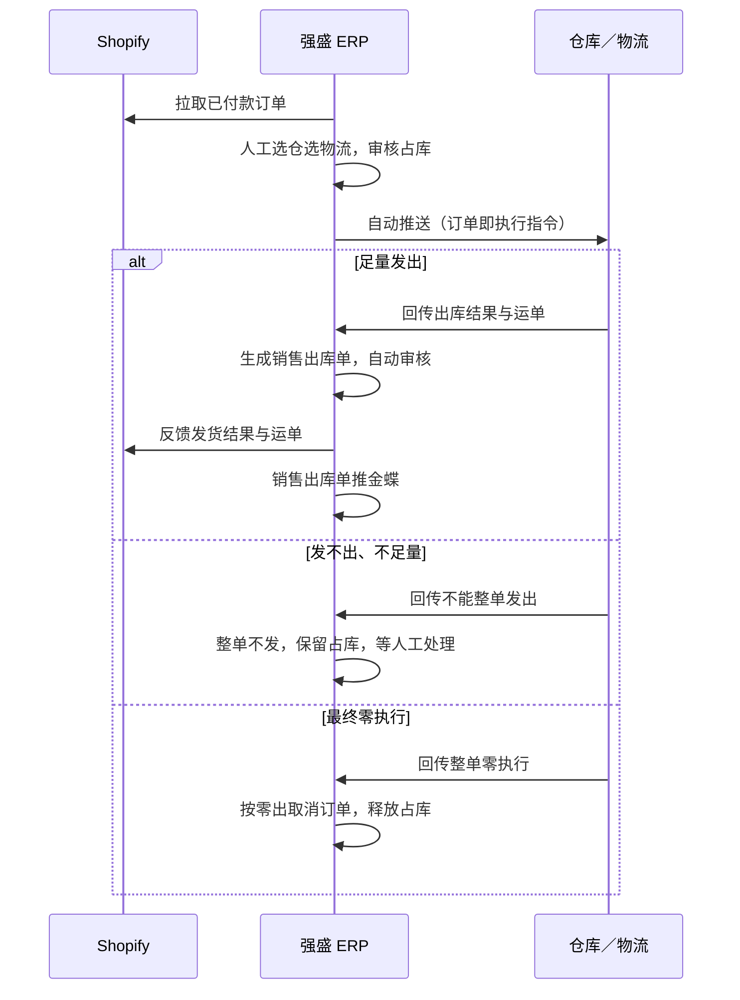

| # | 谁 | 动作与单据 | 状态变化 | 触发与校验 | 异常与处理 |
| --- | --- | --- | --- | --- | --- |
| 1 | 系统 | 从 Shopify 拉取已付款订单 | 订单：草稿（待处理） | 只拉已付款；未付款不进 ERP | 接口未覆盖的订单人工导入 |
| 2 | 独立站业务人员 | 人工批量选仓、选物流 | 订单：待审核 | 一单一仓 | — |
| 3 | 独立站业务人员 | 审核 | 待审核 → 已审核（占库） | 库存不足不能审核；审核后自动推送 | 补货或换仓后重审 |
| 4 | 系统 | 自动推送仓库（订单直接承担执行指令） | 已审核 → 待发货 | 推送失败可重试 | 发送结果不确定时先核实，不重复发送 |
| 5a | 仓库 | 整单发货，回传出库结果与运单 | 待发货 → 已发货 | 一单一次、不分批、不缺量 | 生成销售出库单并自动审核，回写 Shopify，推金蝶 |
| 5b | 仓库 | 回传不能足量发出 | 待发货（保持） | — | 整单不发、保留占库，等人工处理 |
| 5c | 仓库 | 回传最终整单零执行 | 按零出取消 | 只有明确最终结果才处理 | 释放占库，不生成零数量出库单、不推金蝶 |
| 6 | 独立站业务人员 | 换仓或换物流：取消审核后调整重审 | 已取消（终止）或回到草稿（调整重执行） | 未推送可直接取消审核；已推送要先取得仓库取消成功 | 重审是新执行，旧执行记录和迟到回传留在旧的执行下 |

## 5 外部电商结果归集

渠道方先履约，ERP 接收结果、校验后记账，不重新驱动履约。

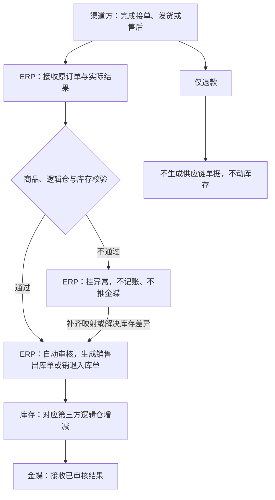

| # | 谁 | 动作与单据 | 状态变化 | 触发与校验 | 异常与处理 |
| --- | --- | --- | --- | --- | --- |
| 1 | 渠道方（领星／聚水潭及仓库） | 完成出库或退货入库 | — | — | — |
| 2 | 系统 | 接收原订单、实际结果和来源关联 | — | 按来源逐笔接收，不接日汇总 | — |
| 3 | 系统 | 匹配商品与逻辑仓，做库存校验 | — | 匹配唯一 SKU 和逻辑仓；不允许负库存 | 匹配失败或库存不足 → 挂异常 |
| 4 | 系统 | 生成销售出库单或销退入库单，自动审核 | 结果单：已审核 | 校验通过即生效，不加常规人工审核 | — |
| 5 | 库存与财务 | 对应第三方逻辑仓增减；结果单推金蝶 | 推送状态独立记录 | 已审核结果单才推送 | 第三方仓出库不重复扣自营仓 |
| 6 | 集成维护方 | 处理异常：补映射、解决库存差异后重试原记录 | — | 修复后继续处理原记录 | 已成功的结果不重复记账；完结结果不跟随来源改写 |

## 6 销售退货

客户退回实物，按可退额度控制，实际接收后增加库存。

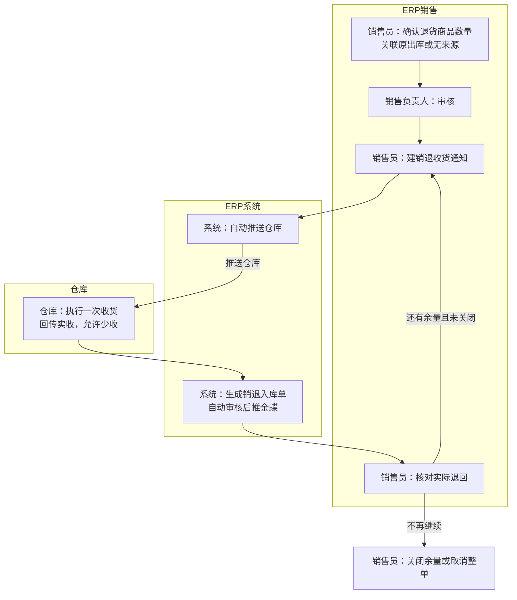

| # | 谁 | 动作与单据 | 状态变化 | 触发与校验 | 异常与处理 |
| --- | --- | --- | --- | --- | --- |
| 1 | 销售员 | 确认退货：溯源退货必须沿用原出库仓库，无来源可指定收货仓 | — → 草稿 | 溯源退货总量不超过原实际出库量，其他办理中的退货也占额度 | 草稿不占额度 |
| 2 | 销售负责人 | 审核退货单 | 草稿 → 待审核 → 已审核 | 审核时占用原出库可退额度 | 退回回草稿 |
| 3 | 销售员 | 建销退收货通知 | 通知：待推送 | 创建即占用额度 | — |
| 4 | 系统 | 自动推送仓库 | → 待收货 | — | 失败可重试 |
| 5 | 仓库 | 执行一次收货，回传实收（允许少收） | → 已收货（实收 0 按取消） | 不超过通知量 | 品质与预期不同时先按指定仓收，再办品质调拨 |
| 6 | 系统与库存 | 生成销退入库单并自动审核；增加指定逻辑仓库存；推金蝶 | 入库单：已审核 | 已审核结果单才推送 | 推送失败不回滚 |
| 7 | 销售员 | 少收回补额度；关闭或取消 | 退货单：已关闭／已取消 | 关闭释放未执行额度；取消要无实收且无待执行通知 | 已退部分继续计入累计；补发换货新建销售订单 |

## 7 仓间备货调拨

仓与仓之间调拨，两端执行，差异留在在途。

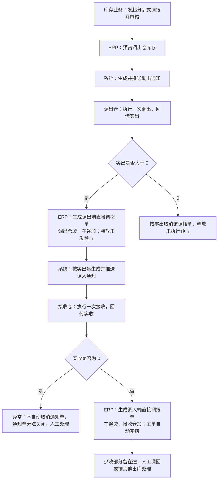

| # | 谁 | 动作与单据 | 状态变化 | 触发与校验 | 异常与处理 |
| --- | --- | --- | --- | --- | --- |
| 1 | 库存业务人员 | 发起分步式调拨：调出仓、接收仓、商品、数量 | — → 审核 | 只用于库存转移；涉及买卖的场景另行处理 | 买卖不能用调拨处理 |
| 2 | 系统 | 审核时预占调出仓库存，生成并推送调出通知 | 调拨单：预占；通知：→ 待发货 | 可用量足够 | 不足阻断 |
| 3 | 调出仓 | 执行一次调出，回传实出 | 通知：→ 已发货 | 实出必须大于 0 | 实出 0 → 按零出取消整单，释放未执行预占 |
| 4 | 系统与库存 | 生成调出端直接调拨单：调出仓减、在途加；消耗预占、释放未发 | 结果单：已审核；推金蝶 | 按实际数量记账 | 推送失败不回滚 |
| 5 | 系统 | 按实际调出量生成调入通知并推送 | 通知：→ 待收货 | 不按原计划量提前下发 | 失败可重试 |
| 6 | 接收仓 | 执行一次接收，回传实收 | 通知：→ 已收货 | 实收不超过调入通知量，且必须大于 0 | 校验失败挂异常；实收 0 属异常，不自动取消通知单，通知单无法关闭，需人工处理 |
| 7 | 系统与库存 | 生成调入端直接调拨单：在途减、接收仓加；主单自动完结 | 主单：已完结 | 收到调入回传才完结 | 主单完结不代表差异清完 |
| 8 | 库存业务人员 | 少收差异处理：人工调回或按其他出库扣减 | 在途数量 | 不自动抹平、不补建原单批次 | 办理路径与权限待定 |

## 8 其他出入库与品质调整

非购销的收发一次执行结束；品质调整走直接调拨，不推仓库。

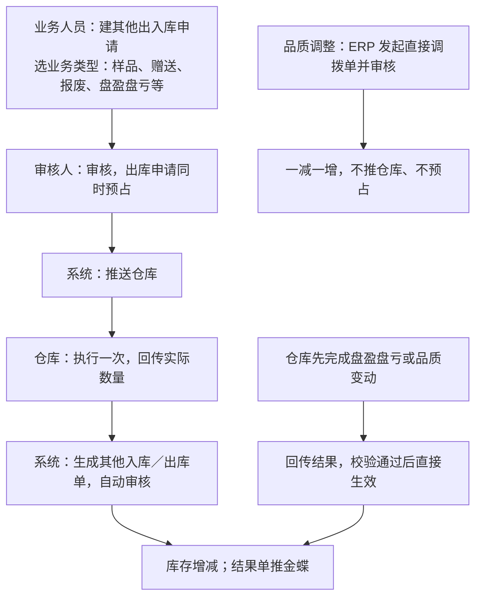

| # | 谁 | 动作与单据 | 状态变化 | 触发与校验 | 异常与处理 |
| --- | --- | --- | --- | --- | --- |
| 1 | 业务人员 | 建其他出入库申请，选业务类型说明原因 | — → 草稿 | 出库申请要有足够可用量 | 业务类型清单后续补充 |
| 2 | 审核人 | 审核 | → 已审核 | 出库申请同时预占 | — |
| 3 | 系统 | 推送仓库 | → 待发货／待收货 | 申请单直接承担执行指令 | 失败可重试 |
| 4 | 仓库 | 执行一次，回传实际数量 | → 已发货／已收货 | 允许缺量，不超过申请量 | 零收零出按取消处理 |
| 5 | 系统与库存 | 生成结果单并自动审核；出库释放未用预占 | 结果单：已审核；推金蝶 | 一次结束，不回补余量 | 推送失败不回滚 |
| 6 | 业务人员 | 要中止只能取消 | → 已取消 | 未推送可直接取消释放预占 | 已推送要等实际结果或仓库取消成功 |
| 7 | 仓库／库存 | 盘盈归其他入库、盘亏归其他出库，回传即生效 | 结果单：自动审核 | 校验通过 | 不补申请、不建 ERP 盘点单 |
| 8 | 库存业务人员 | 品质调整：ERP 发起人工建单审核，或仓库回传自动生成 | 直接调拨单：已审核／自动审核 | 两个逻辑仓之间一减一增 | 不推送仓库、不涉及预占 |

## 9 财务交接

七类已审核结果单逐单推金蝶，推送失败不回滚业务。

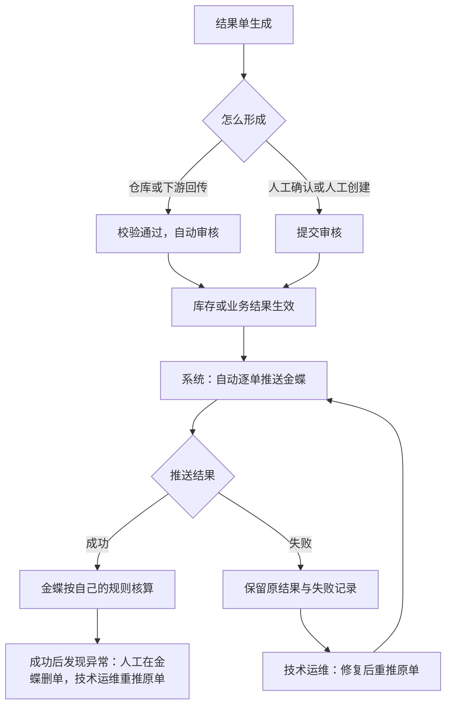

| # | 谁 | 动作与单据 | 状态变化 | 触发与校验 | 异常与处理 |
| --- | --- | --- | --- | --- | --- |
| 1 | 业务模块 | 生成结果单（采购入库、采退出库、销售出库、销退入库、其他入库、其他出库、直接调拨） | → 已审核 | 回传的结果自动审核；人工形成的走提交审核 | 未审核不推送 |
| 2 | 系统 | 逐单推送金蝶，不按日期、客户或店铺汇总 | 推送状态：未推送 → 推送中 → 成功／失败 | 已审核即自动推送，无财务二次审核 | 推送失败只记录 |
| 3 | 金蝶 | 接收结果并核算 | — | 存货成本由金蝶核算；其他出入库和直接调拨不传成本价格 | ERP 不要求回写金蝶单号 |
| 4 | 技术运维 | 推送失败时修复并重推原结果单 | 推送状态：失败 → 重试 → 成功 | 不新建业务单 | 已生效库存不回滚 |
| 5 | 财务与技术运维 | 成功后发现异常：人工在金蝶删除错误单据，技术运维重推原结果单 | — | 属异常运维，不是普通业务入口 | 金蝶最终只留一张有效单据 |
| 6 | 财务 | 平台账单、收退款、佣金、仓储履约费、回款 | — | 线下处理并在金蝶记账 | 一期不进 ERP 归集对账 |

## 10 准备链与人工补充

业务单能不能建，取决于资料准备到不到位。这一段把准备动作串起来，研发不用回 03 拼。

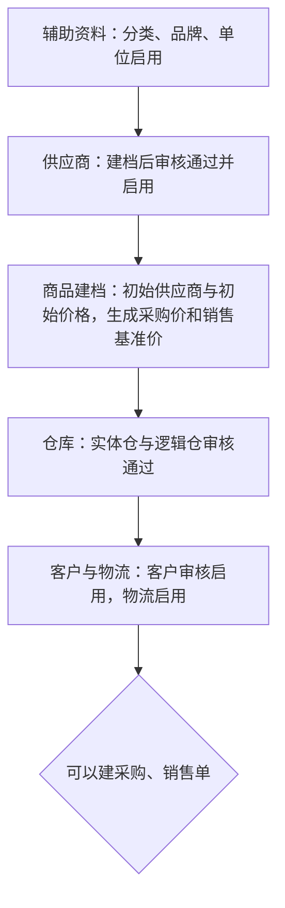

| 准备动作 | 谁做 | 完成标志 | 建单时的校验 |
| --- | --- | --- | --- |
| 辅助资料 | 主数据维护 | 资料启用 | 商品分类必须选到第三级；单位、币别、收付款条件启用才能引用 |
| 供应商 | 主数据维护、审核人 | 审核通过且启用 | 采购只能选审核通过且启用的供应商 |
| 商品 | 商品开发与管理人员 | 建档成功（不审核） | 有初始价格或已用调整单建价 |
| 仓库 | 主数据维护、审核人 | 逻辑仓审核通过且启用 | 单据选定逻辑仓；逻辑仓归属实体仓 |
| 客户与物流 | 主数据维护、审核人 | 客户审核启用；物流启用 | 销售业务只能选审核通过且启用的客户；自提不选物流 |
| 价格 | 业务人员建调整单，有权人员审核 | 当前价存在 | 无价可手填 |

人工补充是接口盖不到时的兜底：

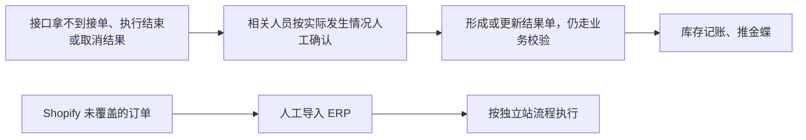

人工确认不等于可以随便填，也不能把“申请取消”当成“仓库已取消”；规则和待确认的岗位见[03-业务分析和设计](../../../03-业务分析和设计/07-集成协作与人工补充.md)。
