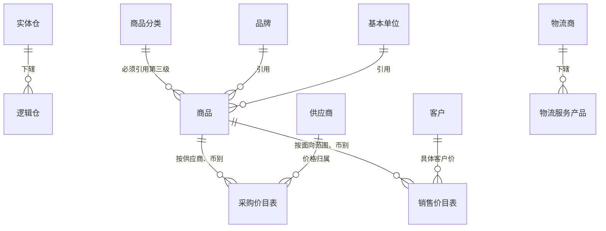
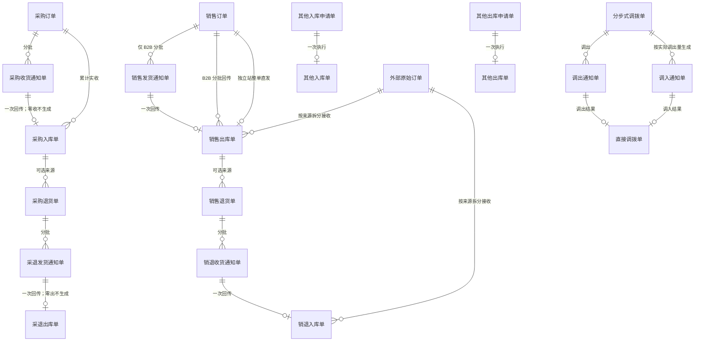

# 实体对象关系

> 用途：说清系统里有哪些业务对象、每个对象处在什么阶段、谁引用谁、什么基数、数量怎么在对象之间流动，以及追溯和一致性约束。给研发和测试做数据关系依据。
> 说明：只写对象、关系、数量和约束，不写字段清单，字段见 `字段清单合集`；状态与操作见[《单据与状态流转》](03-单据与状态流转.md)。

## 一、对象清单

| 对象 | 类型 | 识别口径（唯一性） | 业务阶段 |
| --- | --- | --- | --- |
| 商品（成品SKU） | 主数据 | 商品编码唯一；多条码辅助识别 | 建档即用；配置可改 |
| 供应商 | 主数据 | 供应商编码唯一 | 草稿 → 待审核 → 审核通过／驳回 → 启用／禁用 |
| 客户 | 主数据 | 客户编码唯一；国内／跨境通用2C各一条 | 同供应商 |
| 实体仓 | 主数据 | 仓库编码唯一 | 草稿 → 审核 → 启用／禁用 |
| 逻辑仓 | 主数据 | 逻辑仓编码唯一；归属唯一实体仓 | 同实体仓 |
| 物流商、物流服务产品 | 主数据 | 各自编码唯一 | 创建 → 启用／禁用（不审核） |
| 辅助资料 | 主数据 | 类型 + 资料编码唯一 | 新增 → 启用／禁用（不审核） |
| 采购价目表／销售价目表 | 价格 | 供应商／面向范围＋商品＋币别唯一 | 建档生成或调价覆盖，保留一条当前价 |
| 价格调整单 | 价格单据 | 单号唯一 | 草稿 → 待审核 → 审核通过／驳回 → 生效 |
| 采购订单、销售订单（B2B） | 业务安排 | 单号唯一 | 草稿 → 待审核 → 已审核（正常）→ 已关闭／已取消 |
| 采购退货单、销售退货单 | 业务安排 | 单号唯一；可关联原入库或原出库 | 同上，审核后占库或占可退额度 |
| 采购收货通知单、采退发货通知单、销售发货通知单、销退收货通知单 | 执行指令 | 单号唯一，关联来源单行 | 待推送 → 推送中／失败 → 待收货或待发货 → 已收货或已发货／已取消 |
| 销售订单（独立站） | 业务安排兼执行指令 | 单号唯一 | 草稿 → 待审核 → 已审核 → 待发货 → 已发货／已取消（可回到草稿重执行） |
| 采购入库单、采退出库单、销售出库单、销退入库单 | 实际结果 | 单号唯一，关联来源通知行 | 生成并审核 → 推送财务ERP |
| 其他入库／出库申请单 | 业务安排兼执行指令 | 单号唯一 | 草稿 → 待审核 → 已审核 → 待收货或待发货 → 已收货或已发货／已取消 |
| 其他入库／出库单 | 实际结果 | 单号唯一 | 生成并审核 → 推送财务ERP |
| 分步式调拨单 | 业务安排 | 单号唯一，含调出仓和接收仓 | 审核并预占 → 两端执行 → 自动完结；零调出按取消 |
| 调出通知单、调入通知单 | 执行指令 | 单号唯一，关联调拨单行 | 同其他通知单；调入通知按实际调出量生成 |
| 直接调拨单 | 实际结果 | 单号唯一 | 人工创建走审核；回传自动审核 → 推送财务ERP |
| 外部原始订单及结果 | 来源证据 | 来源系统 + 来源单号唯一 | 接收 → 校验 → 生效或挂异常 |
| 库存（即时、预占、冻结、在途） | 数量状态 | 逻辑仓＋商品唯一 | 随实际结果变化 |

「业务阶段」列是摘要示意，系统状态字段与完整枚举以[《单据与状态流转》](03-单据与状态流转.md)为准。

## 二、主数据之间的关系

- 价目表不跨币别借用价格；面向范围只取所有客户、一个客户等级或一个具体客户三者之一。
- 五类主数据都在ERP维护。

## 三、单据与结果的关系

三条读法：**安排 → 指令 → 结果**，订单分批生成通知，通知一次回传生成一张结果单；**1 : 0..1是常态**，零收零出不生成结果单；**可选关联**，退货单可关联原出库，也可以无来源。

## 四、数量在对象之间怎么流动

| 数量 | 落在哪个对象 | 怎么产生、怎么变 |
| --- | --- | --- |
| 订购数量 | 采购订单行、销售订单行 | 审核后固定；延期、调价都不改 |
| 在途通知数量 | 未结束的收货／发货通知行 | 创建即计入；取消成功释放；结束时被实际数量替代 |
| 可下推数量 | 订单行（计算） | 订单数量 − 已结束通知的实际数量 − 未结束通知的通知量 |
| 累计实际数量 | 订单行、通知行 | 已审核结果单按来源行回写 |
| 缺量数量 | 通知行（计算） | 通知量 − 实际量；不回原通知补收，需要另建通知 |
| 预占数量 | 逻辑仓库存 | 销售、采购退货、分步式调拨、其他出库审核时占用；实际出库消耗；取消或关闭释放 |
| 可退额度 | 原销售出库单 | 溯源退货审核时占用；关闭或取消释放未退部分；已退部分继续计入累计 |
| 退货可下推数量 | 退货单行（计算） | 退货数量 − 已结束通知的实际退回量 − 未结束通知的通知量 |
| 冻结数量 | 逻辑仓库存 | 人工冻结与解冻，只能取自可用量 |
| 可用数量 | 计算值 | 即时库存 − 预占库存 − 冻结库存；不允许为负 |
| 在途数量 | 虚拟在途 | 调出实发增加，调入实收减少；少收的差额继续留在途 |

数量公式的完整口径见[《单据与状态流转》](03-单据与状态流转.md)第六节。

## 五、单据引用哪些主数据

| 单据 | 引用 | 说明 |
| --- | --- | --- |
| 采购订单、采购退货单 | 供应商、商品、仓库、币别、价格 | — |
| 销售订单（B2B）、销售退货单 | 客户、商品、仓库、物流、币别、价格 | — |
| 销售订单（独立站） | 跨境电商通用2C客户、商品、仓库、物流 | — |
| 通知类单据 | 沿用来源单据的仓库和商品 | 沿用来源 |
| 入库／出库结果单 | 沿用原单逻辑仓 | 沿用来源 |
| 其他出入库、调拨 | 商品、逻辑仓 | 按库存归属记账 |
| 价格调整单 | 商品、供应商或客户范围、币别 | — |
| 外部原始订单及结果 | 按来源信息匹配商品和逻辑仓 | 按映射识别 |

## 六、追溯路径

| 从哪里 | 能追溯到什么 |
| --- | --- |
| 结果单（入库、出库、调拨） | 来源通知 → 来源订单 → 原出库（退货）→ 外部原始订单（外部来源） |
| 通知单 | 来源订单行、下游结果单 |
| 订单 | 它下面全部通知、全部结果单、累计数量 |
| 库存变化 | 对应的结果单 → 来源单据 |
| 外部结果 | 来源系统、来源单号、匹配关系、处理记录 |

## 七、一致性约束

- 实收不超过通知量，超量回传直接拒绝；需要接收超出部分时另建通知或订单。
- 累计实收不超过订购数量；累计退回不超过原实际出库量。
- 通知与结果单最多一对一：一张通知只回传一次，之后再来的回传按异常处理。
- 库存不能为负：即时库存或可用库存将为负时阻止生效并报错，不自动挪用在途或其他订单的预占。
- 未结束的通知一直占用可下推额度，包括推送失败、待收货、取消中的状态。
- 结果单不跟随来源改写：来源改了完结结果，原结果不动，新业务另建单据。

## 八、对象的形态

- **正式单据和草稿不一样**：草稿不进任何数量、不占库、不推送。
- **当前价和本单价格不一样**：价目表是“现在什么价”，单据上的本单价格是“这笔业务谈成的价”，调价不影响已保存单据。
- **快照要留痕**：商品名称、价格、税率这类会被后续调整的信息，业务单据保留当时的快照；一期不保存商品分类快照，历史只留商品编码和名称。
- **结果单是唯一记账依据**：订单和通知不增减库存、不推财务ERP。
- **外部原始订单是证据不是安排**：只用于追溯和对账，不提前占库、不驱动仓库执行。
- **数量状态不是对象**：预占、冻结、在途都是挂在逻辑仓库存上的数量状态，不单独成单。
