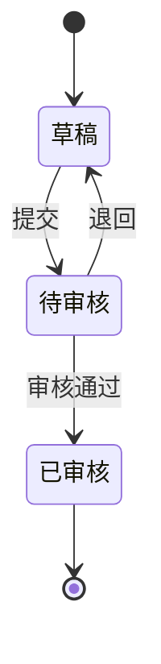
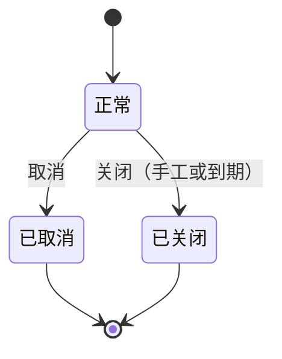
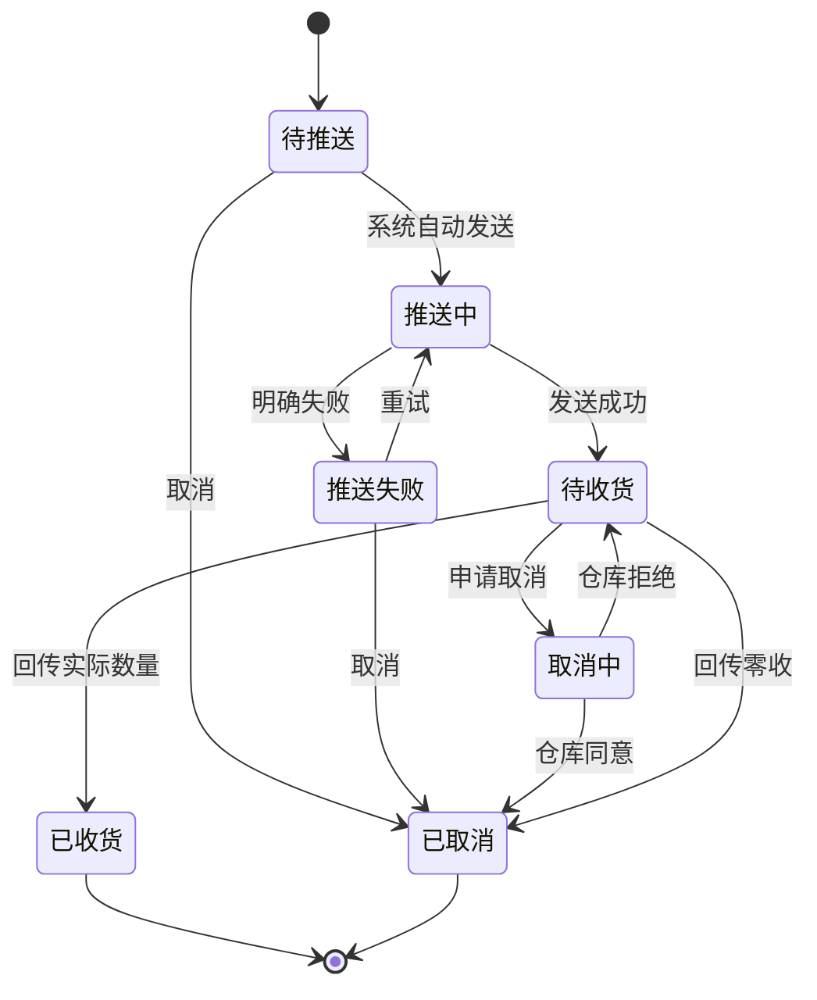
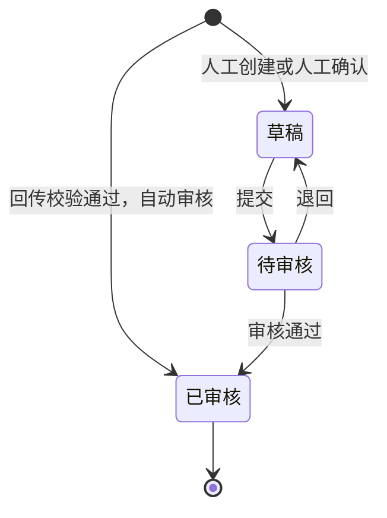
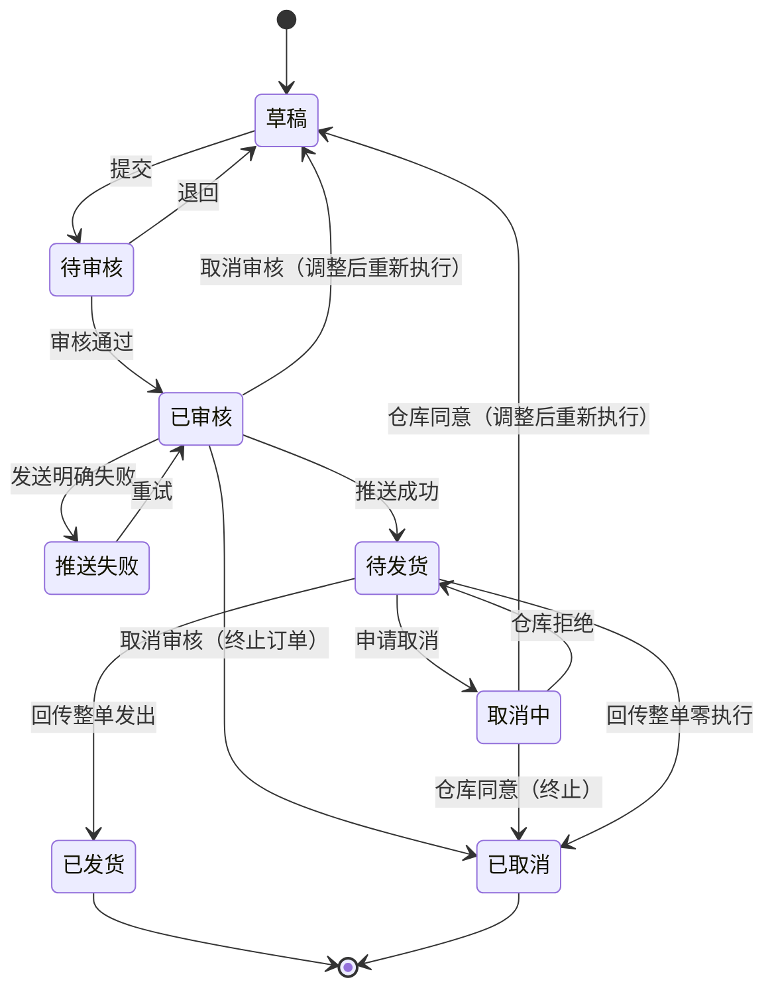
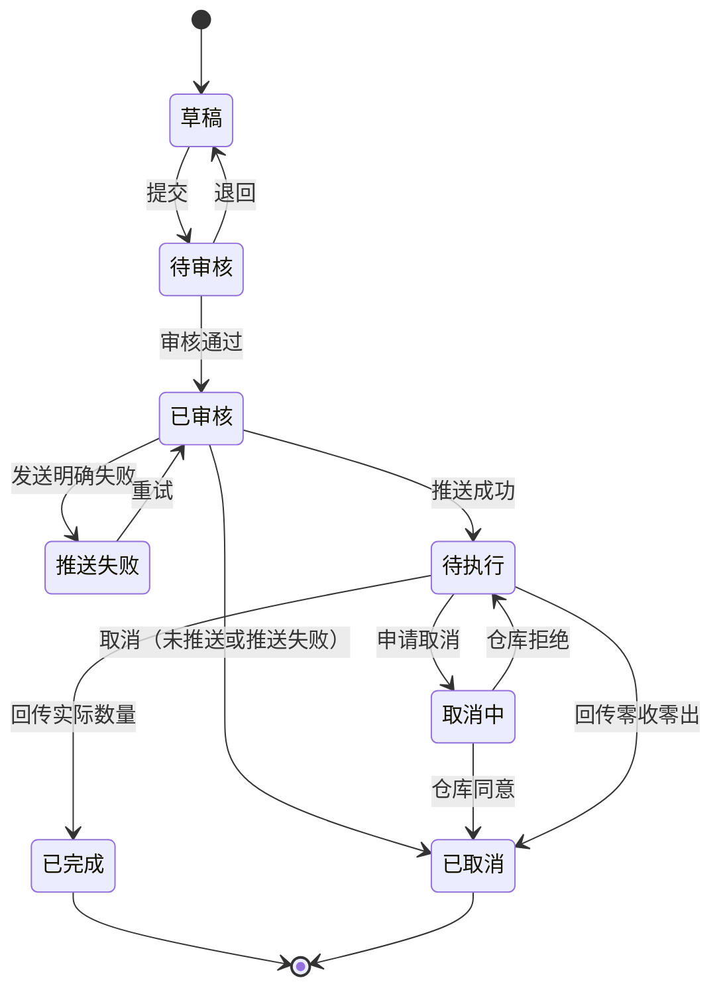

# 单据与状态流转

> 用途：把每类单据的状态、可执行操作、前置条件、校验和联动写清楚，作为研发和测试的实现依据。**权限不在这里约定**：能不能执行某个操作由账号对应的角色控制（RBAC），见第五节末尾的说明。
> 说明：分层模型看[《强盛ERP的单据分层设计》](../../../01-全局背景信息/5.强盛ERP的单据分层设计.md)（那里是模型说明，枚举和流程属示例）；**具体单据的状态枚举与操作以本文为准**。关键规则已摘录进来，不再只留链接。业务含义见 [03-业务分析和设计](../../../03-业务分析和设计/00-业务蓝图.md) 各篇。

## 一、单据总表

| 单据 | 所属模块 | 层级角色 | 状态字段 | 来源 | 下游 |
| --- | --- | --- | --- | --- | --- |
| 采购订单 | 采购 | 业务安排 | 审核状态 + 业务状态 + 收货状态 | 人工测算 | 采购收货通知单 |
| 采购收货通知单 | 采购 | 执行指令 | 单据状态（一个字段串起发送与执行） | 采购订单 | 采购入库单 |
| 采购入库单 | 采购 | 实际结果 | 审核状态 + 金蝶推送状态 | 收货通知回传 | 金蝶 |
| 采购退货单 | 采购 | 业务安排 | 审核状态 + 业务状态 | 原入库或手工 | 采退发货通知单 |
| 采退发货通知单 | 采购 | 执行指令 | 单据状态 | 采购退货单 | 采退出库单 |
| 采退出库单 | 采购 | 实际结果 | 审核状态 + 金蝶推送状态 | 退货出库回传 | 金蝶 |
| 销售订单（B2B） | 销售 | 业务安排 | 审核状态 + 业务状态 + 发货状态 | 线下成交 | 销售发货通知单 |
| 销售发货通知单 | 销售 | 执行指令 | 单据状态 | 销售订单 | 销售出库单 |
| 销售订单（独立站） | 销售 | 业务安排兼执行指令 | 单据状态（一个字段） | Shopify 已付款订单 | 销售出库单 |
| 销售出库单 | 销售 | 实际结果 | 审核状态 + 金蝶推送状态 | 通知回传或独立站直发 | 金蝶 |
| 销售退货单 | 销售 | 业务安排 | 审核状态 + 业务状态 | 原出库或手工 | 销退收货通知单 |
| 销退收货通知单 | 销售 | 执行指令 | 单据状态 | 销售退货单 | 销退入库单 |
| 销退入库单 | 销售 | 实际结果 | 审核状态 + 金蝶推送状态 | 退货收货回传 | 金蝶 |
| 其他入库／出库申请单 | 库存 | 业务安排兼执行指令 | 单据状态 | 人工创建 | 其他入库／出库单 |
| 其他入库／出库单 | 库存 | 实际结果 | 审核状态 + 金蝶推送状态 | 申请执行回传，或仓库主动回传 | 金蝶 |
| 分步式调拨单 | 库存 | 业务安排 | 审核状态 + 业务状态 | 人工创建 | 调出通知、调入通知 |
| 调出通知单、调入通知单 | 库存 | 执行指令 | 单据状态 | 分步式调拨单（调入按实际调出量） | 直接调拨单 |
| 直接调拨单 | 库存 | 实际结果 | 审核状态 + 金蝶推送状态 | 调拨回传，或人工创建 | 金蝶 |
| 价格调整单 | 价格 | 业务安排 | 审核状态 | 人工创建 | 价目表当前价 |

## 二、状态与操作：三层主单（以采购订单为例）

**审核状态**（只走审核流程，与业务状态独立）：

**业务状态**（控制还能不能继续办，与审核状态组合出现）：

**收货状态是计算列**（未收货／部分收货／全部收货），不参与流转；全部收足也不会自动关闭订单。

| 状态 | 可执行操作 | 前置条件与校验 | 结果与联动 |
| --- | --- | --- | --- |
| 草稿、正常 | 编辑、提交、取消 | 数量大于 0；单价非空非负；供应商启用；零价需确认 | 提交 → 待审核；取消 → 已取消 |
| 待审核、正常 | 审核通过、退回、取消 | — | 通过 → 已审核，可下推；退回 → 草稿并留退回意见；取消同时终止审核 |
| 已审核、正常 | 调整交期 | 只改承诺交期；数量和价格不可改 | 交期更新，其余不变 |
| 已审核、正常 | 创建收货通知 | 有可下推数量 | 通知创建即占用额度 |
| 已审核、正常 | 关闭 | 手工关闭无额外条件；到期关闭按宽限参数（待确认） | → 已关闭；不再新增通知，已有通知继续执行 |
| 已审核、正常 | 取消 | 没有实际入库，且没有仍需执行的通知 | → 已取消；释放未执行占用 |
| 已关闭 | 查看、追溯 | — | 不能反关单 |
| 已取消 | 查看历史 | — | 不可撤销 |

**收货状态是计算值**：按各行累计实收自动算成未收货／部分收货／全部收货，不参与流转，全部收足也不会自动关闭订单。

**B2B 销售订单的差异**：审核时校验可用量并占库；关闭只释放还没安排出去的占库，保留执行中通知的占库；取消要先处理已交给仓库的通知，仓库拒绝则恢复继续发货。

**采购退货单、销售退货单的差异**：审核时占用可用库存（采购退货）或原出库可退额度（溯源销售退货）；关闭释放未下推预占；取消要求无实出（或退回）且没有阻挡通知；已实出只能关闭余量。销售退货审核后只能调整截止时间，其他内容不改。

## 三、状态与操作：执行指令单（以采购收货通知单为例）

| 状态 | 可执行操作 | 前置条件与校验 | 结果与联动 |
| --- | --- | --- | --- |
| 待推送 | 取消 | — | → 已取消，释放全部通知占用额度 |
| 推送中 | 等待，不重复发送 | 结果不确定时先核实仓库是否收到 | 不重复发送、不提前释放额度 |
| 推送失败 | 重试、取消 | 确认仓库未接收才能取消 | 重试 → 推送中；取消 → 已取消并释放额度 |
| 待收货 | 接收回传；申请取消 | 实收不超过通知量；按来源行回写 | 回传 → 已收货并生成入库单；申请取消 → 取消中 |
| 取消中 | 等待仓库结果 | 仍需处理可能到达的实际结果 | 仓库同意 → 已取消；拒绝 → 待收货；期间到达的实际结果按真实结果完成 |
| 已收货 | 查看实收、缺收、关联入库单 | — | 终态，不再往原通知补收 |
| 已取消 | 查看历史 | — | 终态；订单开放时可重新下推 |

**销售发货通知单、销退收货通知单、采退发货通知单、调出／调入通知单复用同一套状态**，只把"收货"换成"发货"，按业务替换名称。差异：销售与退货通知申请取消后订单开放时恢复下推额度；调入通知由实际调出量生成，不按原计划量提前下发。

## 四、状态与操作：结果单（以采购入库单为例）

| 状态 | 可执行操作 | 前置条件与校验 | 结果与联动 |
| --- | --- | --- | --- |
| 草稿 | 编辑、提交 | 人工形成结果时 | — |
| 待审核 | 审核通过、退回 | 数量、来源行完整 | 通过 → 已审核并记账 |
| 已审核 | 查看来源、库存结果、推送记录；失败时重推 | 已审核才记账、才推送 | 库存生效、回写来源单据；推送失败不回滚 |

**金蝶推送状态独立记录**：未推送 → 推送中 → 推送成功／推送失败；失败重推原单，不另建业务单。

## 五、状态与操作：两层单

### 5.1 独立站订单

| 状态 | 可执行操作 | 前置条件与校验 | 结果与联动 |
| --- | --- | --- | --- |
| 草稿、待提交 | 编辑、提交 | 选好仓库和物流 | — |
| 待审核 | 审核、退回 | 库存足够才能审核 | 通过 → 已审核并自动推送 |
| 已审核 | 重试推送；取消审核 | 取消审核：未推送可直接办，已推送要先取得仓库取消成功 | 终止 → 已取消并释放占库；调整 → 回草稿，重审算新执行 |
| 待发货 | 申请取消 | — | → 取消中，等仓库 |
| 取消中 | 等待 | 到达的实际结果按真实结果处理 | 同意 → 已取消或回草稿；拒绝 → 待发货 |
| 已发货、已取消 | 查看 | — | 终态 |

### 5.2 其他入库／出库申请单

与独立站的差异：**没有“取消审核回草稿”这条路**；允许缺量、一次结束、不分批，余量不回补原单；中止只能取消：未推送可直接取消并释放预占，已推送要等实际结果或仓库取消成功。

## 六、数量口径（把公式收在一处）

| 公式 | 适用 |
| --- | --- |
| 可下推数量 ＝ 订单数量 − 已结束通知的实际数量 − 未结束通知的通知量 | 采购订单、B2B 销售订单、采购退货单、销售退货单 |
| 订单剩余预占 ＝ 审核占用量 − 累计实际出库量 | B2B 销售订单 |
| 可用库存 ＝ 即时库存 − 预占库存 − 冻结库存 | 所有库存业务 |
| 溯源退货累计可退 ＝ 原实际出库量 − 已退累计 − 办理中占用 | 销售退货 |
| 调拨在途 ＝ 累计实际调出 − 累计实际调入 | 分步式调拨 |

配套规则：通知创建即占用，推送失败、待收货、取消中都不释放；取消成功才释放；结束时以实际数量替代通知占用，缺量回补；关闭后不再安排，已有通知继续执行；不允许负库存，超量回传直接拒绝。

## 七、回写规则

| 结果单 | 回写什么 | 时机 |
| --- | --- | --- |
| 采购入库单 | 通知实收与状态、订单累计实收与收货状态 | 结果单审核通过 |
| 采退出库单 | 通知实出与状态、退货单累计实出、消耗预占 | 同上 |
| 销售出库单 | 通知实出与状态、订单累计实出与发货状态、消耗预占 | 同上 |
| 销退入库单 | 通知实收与状态、退货单累计实退、可退额度占用 | 同上 |
| 其他出入库单 | 申请单完结、释放未用预占 | 同上 |
| 直接调拨单（调出端／调入端） | 调出仓减、在途加／在途减、接收仓加；第二张生成后主单自动完结 | 同上 |

回写是单向的：结果单改来源单据的累计和状态，来源单据不改结果单。

## 八、权限怎么处理

- 能不能执行某个操作，由账号对应的角色权限控制（RBAC）。本文不约定岗位和角色，也不做权限矩阵。
- 需要审核的动作统一走提交与审核流程；没有对应权限，界面上不提供该操作。
- 权限不替代业务校验：库存够不够、金额完整不完整、状态允不允许，仍然按本文和前几节的规则判断。
- 角色、岗位和数据范围在权限配置里定义，具体规则见公共能力模块。

## 九、跨单据联动要点

- 额度：通知创建占用可下推量；取消成功释放；收货完成后以实际替代，缺量回补。
- 占库：销售、采购退货、分步式调拨、其他出库在审核时预占；实际出库消耗对应预占；关闭或取消按各域规则释放。
- 零收零出：按取消执行单处理，不生成结果单、不改库存、不推金蝶。分步式调拨的实际调出和实际调入都必须大于 0；零调入属于异常，不按零收取消通知单，通知单无法关闭，需人工处理。
- 关闭与取消：关闭只停止新增安排，已有通知继续执行；取消要整单可撤，涉及仓库的要等回执；两者都不可撤销。
- 主单完结：分步式调拨在收到调入回传并生成第二张直接调拨单后自动完结；完结不代表在途差异已经清理。
- 唯一记账口径：只有已审核结果单改变库存并推送金蝶；订单、通知、草稿一律不记账。
