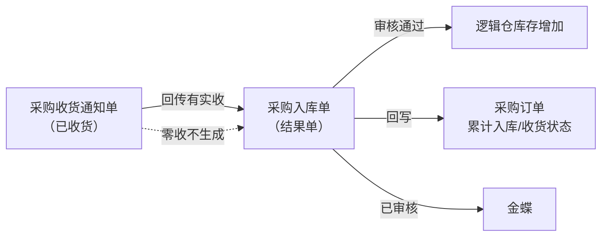
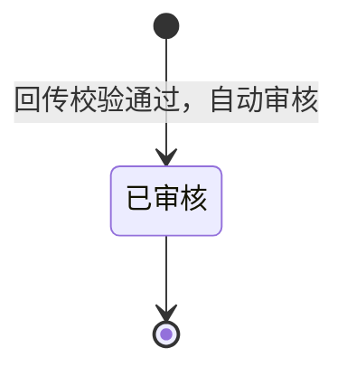
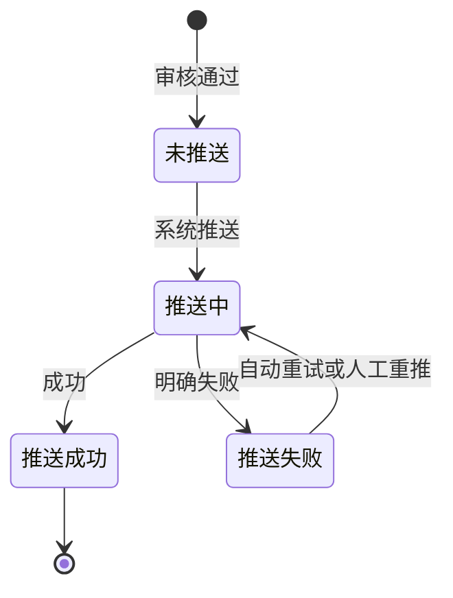

# 采购入库单主PRD

> 用途：定义采购入库单在ERP中的生成、审核、库存记账、来源回写及金蝶推送，作为研发实现和测试验收的依据。
> 定位：应用设计层文档。业务规则以[《采购业务管理需求分析》](../../../../../02-需求调研和分析/02-采购业务管理/采购业务管理需求分析.md)和[《采购业务设计》](../../../../../03-业务分析和设计/01-采购业务设计.md)为准；状态与操作以[《单据与状态流转》](../../../系统架构和流程/03-单据与状态流转.md)第四节为准；字段与取值以[《采购入库单（详细稿）》](../../../字段清单合集/采购相关/采购入库单（详细稿）.tsv)为准；页面骨架见[《采购入库单页面骨架》](采购入库单页面骨架.md)；页面交互以[前端Demo版PRD](前端Demo版PRD/)为准，**须服从本文 §6.4 状态—功能矩阵**。
> 不写什么：不重复需求论证；不写仓库WMS作业细节与接口报文；不写金蝶报文字段映射；不写系统权限与API设计。

| 版本 | 本次变化 | 状态 |
| --- | --- | --- |
| V0.1 | 建立采购入库单主PRD，汇总已确认结论与页面分工 | 初稿，待评审 |
| V0.2 | 确认 Q02/Q04；明确一期仅回传自动生成，不提供人工确认入库 | 初稿，待评审 |

## 1. 文档信息与阅读边界

| 项目 | 内容 |
| --- | --- |
| 读者 | 研发工程师、测试工程师、产品复核 |
| 业务依据 | [《采购业务管理需求分析》](../../../../../02-需求调研和分析/02-采购业务管理/采购业务管理需求分析.md) PUR-FR02、PUR-FR06；[《采购业务设计》](../../../../../03-业务分析和设计/01-采购业务设计.md)第五节 |
| 字段依据 | [《采购入库单（详细稿）》](../../../字段清单合集/采购相关/采购入库单（详细稿）.tsv) |
| 状态依据 | [《单据与状态流转》](../../../系统架构和流程/03-单据与状态流转.md)第四节 |
| 页面依据 | [《采购入库单页面骨架》](采购入库单页面骨架.md)、[前端Demo版PRD](前端Demo版PRD/) |

关联资料：[《采购收货通知单主PRD》](../采购收货通知单/采购收货通知单主PRD.md)、[《采购订单主PRD》](../采购订单/采购订单主PRD.md)、[《01-系统流程与单据交互》](../../../系统架构和流程/01-系统流程与单据交互.md)第一节、[《02-实体对象关系》](../../../系统架构和流程/02-实体对象关系.md)、[《系统集成需求分析》](../../../../../02-需求调研和分析/07-系统集成/系统集成需求分析.md) INT-FR03。

## 2. 需求背景与目标

### 2.1 背景

仓库按采购收货通知单完成一次收货后，需要形成实际入库结果单，作为库存增加和业财交接的唯一依据。采购订单和收货通知单不直接增加库存，也不向金蝶推送。

没有统一的入库结果单时，实际收货数量、库存变化和财务输入难以与采购约定对齐，也无法逐单追溯分批收货过程。

### 2.2 目标

- 收货通知推送到仓库，回传有实收并结束后，**系统自动**生成入库单并自动审核；
- 审核通过后增加对应逻辑仓库存，并回写通知实收、订单累计入库与收货状态；
- 已审核结果逐单推送金蝶；自动重试最多3次，仍失败则保持推送失败，针对原单人工重推；
- 入库单整单只读，不提供新增、编辑、取消或作废；
- 已审核后不因金蝶推送失败而回滚库存。

## 3. 需求范围

### 3.1 本期范围

- 采购入库单列表、详情（只读查看）；
- 由收货通知回传触发的自动生成（用户无建单入口）；
- 已审核后查看来源、库存结果与推送记录；金蝶推送失败时重推；
- 审核状态与金蝶推送状态两个字段并列维护；
- 与采购收货通知单、采购订单的数量回写衔接。

### 3.2 功能清单

| 编号 | 功能/位置 | 本次内容 | 需求来源 |
| --- | --- | --- | --- |
| F01 | 入库单列表 | 查询、列展示、进入详情；审核状态与金蝶推送状态多选筛选；勾选配合页头导出；**无新增**；一期批量栏无业务按钮 | PUR-FR06 |
| F04 | 详情页 | 分区域只读展示来源、明细价税、推送与审核信息 | PUR-FR02、PUR-FR06 |
| F08 | 重推金蝶 | 已审核且金蝶推送失败时重试 | PUR-FR06、INT-FR03 |
| F09 | Demo Mock | 模拟通知回传后自动生成入库单；仅Demo | 演示需要，非业务规则 |

### 3.3 需求追溯

| 上游场景与需求 | 本 PRD 功能 | 本 PRD 验收 |
| --- | --- | --- |
| PUR-FR02：实收回写、缺量、零收不生成 | F04、自动路径 | AC01、AC02 |
| PUR-FR06：库存记账、金蝶只接结果单 | F04、F08 | AC03、AC04 |
| PUR-AC07：分批回传形成多张入库单 | F01、F04 | AC01 |
| PUR-AC10：零收不生成入库单 | 自动路径 | AC02 |
| INT-FR03：推送失败不重造业务单 | F08 | AC04 |

### 3.4 非本期范围

- **人工确认入库**、列表/详情新增入口、草稿编辑、提交、审核、撤回（本项目采购入库均走通知回传自动生成）；
- 入库单导入；
- 已审核后修改数量、价格、仓库或反审核；
- 零数量入库单；
- 金蝶推送报文字段映射、系统集成中心只读页细节（见集成PRD）；
- 系统权限矩阵、API/表结构/并发锁实现。

| 范围补充 | 说明 |
| --- | --- |
| 适用对象 | 成品采购入库；入库仓库沿用来源通知及订单 |
| 唯一来源 | 采购收货通知单回传有实收并结束后系统自动生成；用户不手工建单 |
| 与原型差异 | 一期不提供人工建单与确认入库；以 `09-产品原型` 采购入库单页面为准 |

## 4. 单据定位与业务边界

### 4.1 业务作用

| 项目 | 内容 |
| --- | --- |
| 单据层级 | 第3层——实际结果单，记录本次实际入库事实 |
| 核心职责 | 记录实际入库多少、入哪个仓、来源哪张通知与订单；审核后记账并推送金蝶 |
| 单据来源 | **唯一方式**：采购收货通知单回传有实收并结束后系统自动生成 |
| 下游单据 | 无业务下游；金蝶接收已审核结果 |
| 数量关系 | 一张通知对应0或1张入库单（零收不生成）；一张订单可对应多张入库单 |
| 业务终结 | 已审核为业务终态；不可取消、不可反审核；推送失败不改变已生效库存 |

### 4.2 上下游关系摘要

> 完整流程见[《01-系统流程与单据交互》](../../../系统架构和流程/01-系统流程与单据交互.md)第一节；本文只保留入库侧交接点。

### 4.3 业务对象关系

| 关系 | 说明 |
| --- | --- |
| 采购收货通知单 : 采购入库单 | 1:0..1；零收不生成 |
| 采购订单 : 采购入库单 | 1:N；累计决定收货进度 |
| 入库单明细 : 来源收货通知行 | N:1；数量与价格沿来源行 |
| 采购入库单 : 入库仓库 | N:1；沿用来源逻辑仓 |

### 4.4 本单据不负责的事项

- 入库单不安排仓库作业；执行指令由收货通知承担；
- 入库单不修改采购订单的订购数量与价格约定；
- 已审核后不因金蝶推送失败而回滚库存或删除业务结果；
- 不在原入库单上补收；少收部分已在通知侧体现缺收，补收另建通知；
- 超通知到货在仓库侧拒收，入库数量不超过通知实收。

## 5. 核心业务场景索引

| 场景ID | 场景 | 类型 | 说明 |
| --- | --- | --- | --- |
| S01 | 通知回传自动生成 | 主流程 | 已收货通知有实收→校验通过→生成入库单并自动审核→库存+→回写订单→推金蝶 |
| S02 | 通知少收 | 主流程 | 实收<通知量→入库按实收记账→订单累计入库增加→缺收在通知侧展示 |
| S03 | 通知零收 | 支线 | 不生成入库单；库存不变；不推金蝶 |
| S04 | 金蝶推送失败重推 | 支线 | 已审核+推送失败→自动重试3次→仍失败则人工重推原单；库存不回滚 |
| S05 | 分批收货 | 主流程 | 同一订单多张通知各自生成入库单，分别推送金蝶 |

## 6. 状态与操作

状态定义 owner：[《单据与状态流转》](../../../系统架构和流程/03-单据与状态流转.md)第四节。采购入库单用**审核状态**与**金蝶推送状态**两个字段并列维护。

**一期用户界面口径**：入库单均由回传自动生成且创建即为**已审核**；列表与详情不提供草稿/待审核相关操作。字段清单中的草稿/待审核枚举保留于模型，本期用户不可触达。

### 6.1 状态维度

| 维度 | 取值 | 说明 |
| --- | --- | --- |
| 审核状态 | 已审核（用户可见）；草稿/待审核（模型保留，本期不提供页面） | 控制是否记账 |
| 金蝶推送状态 | 未推送、推送中、推送成功、推送失败 | 跟踪业财推送 |

### 6.2 状态取值说明

**审核状态**

| 状态 | 含义 | 是否终态 | 一期界面 |
| --- | --- | --- | --- |
| 已审核 | 库存已生效，来源已回写 | 是 | 可见 |
| 草稿、待审核 | 模型枚举 | — | **不提供** |

**金蝶推送状态**

| 状态 | 含义 | 是否终态 |
| --- | --- | --- |
| 未推送 | 尚未发起推送 | 否 |
| 推送中 | 推送作业进行中 | 否 |
| 推送成功 | 金蝶已接收 | 是 |
| 推送失败 | 推送明确失败，可重推 | 否（可重试至成功） |

自动生成的入库单创建时即为已审核，金蝶推送状态从「未推送」开始。

### 6.3 状态流转图

**审核状态（本期有效路径）**

**金蝶推送状态**（已审核后）

### 6.4 状态—功能矩阵

> ✅ = 允许；❌ = 不允许。F01 查询/查看均可用，不重复列出。

| 功能编号 / 动作 | 已审核 |
| --- | --- |
| F04 详情/追溯 | ✅ |
| F08 重推金蝶 | ✅（R08；须金蝶推送状态=推送失败） |
| F09 Demo Mock | ✅（Demo） |

**金蝶推送状态 × F08**（须已审核）

| 金蝶推送状态 | F08 重推金蝶 |
| --- | --- |
| 未推送 / 推送中 | ❌（等待系统） |
| 推送失败 | ✅ |
| 推送成功 | ❌ |

说明：

- 列表与详情**不提供**新增、编辑、提交、审核、撤回、取消、作废。
- 已审核后整单只读；推送失败时仅允许重推金蝶。

列表批量操作栏一期仅展示已选中计数与列设置；导出在页头。

### 6.5 状态流转表

| 当前状态 | 动作 | 前置条件 | 结果状态 | 二次确认 | 后置影响 | 失败处理 |
| --- | --- | --- | --- | --- | --- | --- |
| — | 自动生成 | 来源通知已收货且有实收>0（R02）；校验通过（R03） | 已审核 | 无 | 分配单号（R01）；库存增加；回写通知/订单（R05）；触发金蝶推送（R06） | 校验失败保留异常，不记账 |
| 已审核 | 自动推送 | 系统作业 | 推送中 | 无 | — | — |
| 推送中 | 推送成功 | 金蝶确认 | 推送成功 | 无 | 记录推送时间 | — |
| 推送中 | 推送失败 | 金蝶明确失败 | 推送失败 | 无 | 记录推送失败原因；**不回滚库存**；触发自动重试（R09） | — |
| 推送失败 | 自动重试 | 未达3次 | 推送中 | 无 | — | 仍失败则保持推送失败 |
| 已审核+推送失败 | 人工重推 | 操作人触发（F08） | 推送中 | 见 Demo PRD | 针对原单重试 | — |

## 7. 核心业务规则

### 7.1 创建与来源规则

| 规则编号 | 主题 | 规则 | 边界或例外 |
| --- | --- | --- | --- |
| R01 | 单号 | 按[《6.强盛ERP的编码规则和通用字段规则》](../../../../../01-全局背景信息/6.强盛ERP的编码规则和通用字段规则.md)第一节自动生成；前缀 CGRK；生成时分配 | 用户不可编辑 |
| R02 | 来源通知 | 必须关联一张已收货的采购收货通知单；一张通知最多一张有效入库单 | 零收通知不生成；已有入库单不可重复生成 |
| R03 | 自动生成 | 通知回传有实收并结束后，校验通过则系统自动生成并自动审核；**唯一创建方式** | 不经人工建单或人工审核 |
| — | 单头继承 | 来源通知、来源订单、供应商、币别、入库仓库、明细数量与订单价格沿来源携带 | 用户不可改仓库、数量、价格 |

数量示例（标明为示例）：通知实收380件并结束→生成入库单380件→订单累计入库+380→该通知关联1张入库单。

### 7.2 数量与价格规则

| 规则编号 | 主题 | 规则 | 边界或例外 |
| --- | --- | --- | --- |
| — | 入库数量 | 各行实际入库数量=来源通知实收数量；不超过通知数量 | 创建后不可改 |
| — | 价格 | 含税单价、税率、不含税单价、金额沿来源采购订单交易价格 | 推送金蝶时使用；字段范围待接口确认 |
| — | 零数量 | 不允许零数量入库单 | 零收在通知侧取消，不进入本单 |

### 7.3 字段锁定规则

| 规则编号 | 主题 | 规则 | 边界或例外 |
| --- | --- | --- | --- |
| R07 | 只读 | 入库单生成后整单只读，不提供编辑入口 | 已审核不可改任何业务字段 |
| — | 不可撤销 | 已审核为终态，不提供取消、作废、反审核 | 更正走技术介入，见分层设计 §8.5 |

### 7.4 回写与库存规则

| 规则编号 | 主题 | 规则 | 边界或例外 |
| --- | --- | --- | --- |
| R05 | 回写时机 | 自动审核通过时回写通知实收确认、订单累计入库数量与收货状态 | — |
| — | 库存记账 | 已审核后增加对应逻辑仓即时库存 | — |
| — | 缺收 | 少收部分不在入库单体现；缺收在通知侧展示 | 补收另建通知 |

### 7.5 金蝶推送规则

| 规则编号 | 主题 | 规则 | 边界或例外 |
| --- | --- | --- | --- |
| R06 | 推送时机 | 已审核后由系统自动逐单推送金蝶 | 订单与通知不推送 |
| R09 | 自动重试 | 推送明确失败后系统自动重试，**最多3次**；3次仍失败则保持「推送失败」，等待人工重推（F08） | 重试间隔待集成配置 |
| R08 | 失败重推 | 人工触发时针对原单重试，不另建业务单 | 不回滚库存与回写 |
| — | 业务日期 | 推送金蝶时使用；**取实际入库时间的日期部分** | 见字段清单 |
| — | 推送记录 | 记录推送时间、推送失败原因；重推成功后仍保留历史失败原因 | 见 INT-FR03 |

### 7.6 业务生效点

| 业务动作 | 入库单影响 | 库存影响 | 业财/外部影响 |
| --- | --- | --- | --- |
| 自动生成并审核 | 已审核；带入实收数量与来源价格 | 逻辑仓库存增加 | 触发金蝶推送 |
| 金蝶推送成功 | 推送状态→成功 | 无额外变化 | 金蝶接收结果 |
| 金蝶推送失败 | 推送状态→失败；业务仍已审核 | 不回滚 | 自动重试3次；仍失败则人工重推 |

### 7.7 字段校验绑定

完整字段见 TSV。摘要：

| 校验时机 | 要求 |
| --- | --- |
| 自动生成 | 来源通知已收货且有实收>0（R02）；校验通过（R03） |
| 重推 | 已审核+推送失败（R08） |

页面控件、错误文案见 Demo PRD 弹窗章节。

## 8. 功能需求说明（页面索引）

| 编号 | 页面/位置 | 规则与状态依据 | Demo PRD |
| --- | --- | --- | --- |
| F01 | 列表 | §6.4 | [列表页](前端Demo版PRD/采购入库单前端Demo版PRD_列表页.md) |
| F04 | 详情 | R05～R08；§6.4 | [详情页](前端Demo版PRD/采购入库单前端Demo版PRD_详情页.md) |
| F08 | 重推金蝶 | R08、R09；§6.5 | [弹窗与Mock](前端Demo版PRD/采购入库单前端Demo版PRD_弹窗与Mock.md) §一 |
| F09 | Demo Mock | 非正式验收 | 弹窗 PRD §二 |

本期不提供新增/编辑页，见[《采购入库单前端Demo版PRD_新增编辑页》](前端Demo版PRD/采购入库单前端Demo版PRD_新增编辑页.md)说明。

## 9. 上下游影响与协同

| 关联模块/系统 | 需要配合的变化 | 交接内容与时机 | 验收结果 |
| --- | --- | --- | --- |
| 采购收货通知单 | 回传触发生成 | 已收货且有实收时生成；详情可跳转关联入库单 | 1:0..1 关系成立 |
| 采购订单 | 累计入库回写 | 入库单审核通过时更新累计入库与收货状态 | 与采购订单主PRD一致 |
| 库存 | 即时库存增加 | 已审核后按逻辑仓记账 | INV-FR05 |
| 金蝶 | 接收已审核结果 | 审核后自动推送；失败重推原单 | FIN-FR01～FIN-FR03 |
| 系统集成中心 | 只读展示推送结果 | 推送状态、时间、失败原因 | INT-FR03 |

## 10. 关联文档与阅读入口

| 关联内容 | 阅读入口 | 本 PRD 与其边界 |
| --- | --- | --- |
| 采购收货通知单 | [《采购收货通知单主PRD》](../采购收货通知单/采购收货通知单主PRD.md) | 唯一生成来源；实收与缺收 owner 在通知侧 |
| 采购订单 | [《采购订单主PRD》](../采购订单/采购订单主PRD.md) | 累计入库与收货状态 owner 在订单侧 |
| 采购流程 | [《01-系统流程与单据交互》](../../../系统架构和流程/01-系统流程与单据交互.md)第一节 | 完整角色接力；本文只写入库侧 |
| 状态与操作 | [《单据与状态流转》](../../../系统架构和流程/03-单据与状态流转.md)第四节 | 状态 owner；本文矩阵与 Demo 须一致 |
| 字段定义 | [《采购入库单（详细稿）》](../../../字段清单合集/采购相关/采购入库单（详细稿）.tsv) | TSV 为字段 owner |
| 页面结构 | [《采购入库单页面骨架》](采购入库单页面骨架.md) | 区域与线框走查，非规则权威 |
| 页面交互 | [前端Demo版PRD](前端Demo版PRD/) | 控件、文案、Mock；服从 §6.4 |

## 11. 异常与一致性

### 11.1 并发操作

| 场景 | 业务处理结果 |
| --- | --- |
| 同一通知重复回传触发生成 | 只允许一张有效入库单；重复触达幂等，不重复记账 |

### 11.2 幂等与重复处理

| 操作 | 幂等规则 |
| --- | --- |
| 通知回传触发生成 | 同一通知不得重复生成入库单或重复记账 |
| 金蝶重推 | 同一入库单重复推送不得重复增加库存 |

### 11.3 与上下游单据一致性

| 场景 | 处理方式 |
| --- | --- |
| 通知已有关联入库单 | 不可再自动生成 |
| 推送失败 | 库存与回写保持；自动重试3次；仍失败则人工重推原单 |
| 订单关闭后 | 已有通知产生的入库单正常记账与推送 |

## 12. 验收标准与待确认事项

### 12.1 验收标准

| 编号 | 对应功能/规则 | 条件与操作 | 预期结果 |
| --- | --- | --- | --- |
| AC01 | 自动路径/R03、R05 | 通知实收380并结束 | 自动生成入库单380件、已审核；单号 CGRK 规则；订单累计入库+380；库存+380；触发金蝶推送 |
| AC02 | R02、PUR-AC10 | 通知零收结束 | 不生成入库单；库存不变；不推金蝶 |
| AC03 | R05、PUR-AC07 | 同一订单两批通知各实收50 | 两张入库单各50；订单累计入库100；分别推送金蝶 |
| AC04 | F08/R08、R09 | 金蝶推送明确失败 | 自动重试最多3次；仍失败则保持推送失败，可人工重推；库存不回滚 |
| AC05 | R07、F01 | 列表与详情 | 无新增/编辑入口；整单只读 |
| AC06 | F01 | 列表筛选审核状态与金蝶推送状态 | 多选 OR 匹配；列与 TSV 一致 |
| AC07 | F04 | 详情展示来源通知与订单 | 可跳转来源单据；展示推送记录 |
| AC08 | F09 | Demo Mock 模拟自动生成 | 仅 Demo 可用；正式验收以回传为准 |

### 12.2 待确认事项

| 编号 | 问题 | 影响范围 | 状态/结论 |
| --- | --- | --- | --- |
| Q01 | 列表默认排序字段 | F01 | Demo 暂定实际入库时间倒序 |
| Q02 | 业务日期取值口径 | R06、字段 | **已确认**：取实际入库时间的日期部分 |
| Q03 | 价税字段推送范围与精度 | 明细价税 | 待接口确认 |
| Q04 | 金蝶推送自动重试策略 | R09、F08 | **已确认**：自动重试最多3次；仍失败须人工重推 |
| Q05 | 人工确认入库 | — | **已确认**：本项目不提供；唯一来源为通知回传自动生成 |
