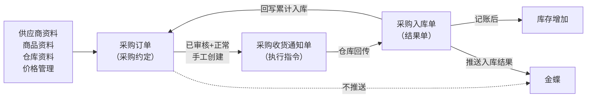
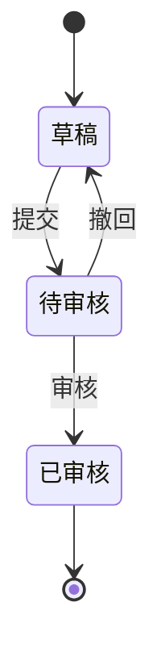
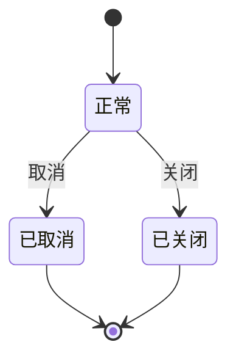

# 采购订单主PRD

> 用途：定义采购订单在ERP中的建单、审核、交期维护、取消关闭及创建收货通知等系统行为，作为研发实现和测试验收的依据。
> 定位：应用设计层文档。业务规则以[《采购业务管理需求分析》](../../../../../02-需求调研和分析/02-采购业务管理/采购业务管理需求分析.md)和[《采购业务设计》](../../../../../03-业务分析和设计/01-采购业务设计.md)为准；状态与操作以[《单据与状态流转》](../../../系统架构和流程/03-单据与状态流转.md)第二节为准；字段与取值以[《采购订单（详细稿）》](../../../字段清单合集/采购相关/采购订单（详细稿）.tsv)为准；页面骨架见[《采购订单页面骨架》](采购订单页面骨架.md)；页面交互以[前端Demo版PRD](前端Demo版PRD/)为准，**须服从本文 §6.4 状态—功能矩阵**。
> 不写什么：不重复需求论证；不写采购收货通知单、采购入库单内部流程（见后续PRD）；不写金蝶接口报文；不写预付款系统流程；不写系统权限与 API 设计。

| 版本 | 本次变化 | 状态 |
| --- | --- | --- |
| V0.1 | 建立采购订单主PRD，汇总已确认结论与页面分工 | 初稿，待评审 |
| V0.2 | 按《主PRD模板-V2（业务单据）》重构：补单据定位、场景索引、状态矩阵与规则分组 | 初稿，待评审 |
| V0.3 | 通知与入库基数改为1:0..1，与通知/入库PRD及实体关系一致 | 初稿，待评审 |
| V0.4 | 矩阵行标题改为动作名；非本期范围去掉文档对照括号 | 初稿，待评审 |
| V0.5 | 一期正式做导出、导入仅 Demo Mock；关闭操作人改为用户引用 | 初稿，待评审 |
| V0.6 | 到期关单为承诺交期后T+2自然日；草稿删除一期必做 | 初稿，待评审 |
| V0.7 | 单据日期默认当天、提交后不可改；价税单价4位、金额税额2位、尾差进税额；自动关单0:00跑批 | 初稿，待评审 |
| V0.8 | 税率允许0%，税额为0、价税合计等于金额 | 初稿，待评审 |
| V0.9 | 金额、单价页面按千分位展示，录入不带 | 初稿，待评审 |
| V0.10 | 列表按创建时间倒序；系统自动关单时关闭原因留空 | 初稿，待评审 |
| V0.11 | 同步详细字段清单格式与页面骨架已确认事项 | 初稿，待评审 |
| V0.12 | 确认收货仓库实际选择逻辑仓，并同步字段说明 | 初稿，待评审 |
| V0.13 | §3.1 补全导出/导入、自动关单等一期业务范围摘要；交互细节下沉 F01 | 初稿，待评审 |
| V0.14 | 取消单据日期字段，时间口径改用创建时间（用户确认） | 初稿，待评审 |
| V0.15 | 导入口径注记：退货单支持正式导入、订单不做，差异按业务确认 | 初稿，待评审 |

## 1. 文档信息与阅读边界

| 项目 | 内容 |
| --- | --- |
| 读者 | 研发工程师、测试工程师、产品复核 |
| 业务依据 | [《采购业务管理需求分析》](../../../../../02-需求调研和分析/02-采购业务管理/采购业务管理需求分析.md) PUR-FR01～PUR-FR03；[《采购业务设计》](../../../../../03-业务分析和设计/01-采购业务设计.md)第四节 |
| 字段依据 | [《采购订单（详细稿）》](../../../字段清单合集/采购相关/采购订单（详细稿）.tsv) |
| 状态依据 | [《单据与状态流转》](../../../系统架构和流程/03-单据与状态流转.md)第二节 |
| 页面依据 | [《采购订单页面骨架》](采购订单页面骨架.md)、[前端Demo版PRD](前端Demo版PRD/) |

关联资料：[《价格管理需求分析》](../../../../../02-需求调研和分析/06-价格管理/价格管理需求分析.md)（PRI-FR04、PRI-FR05）、[《01-系统流程与单据交互》](../../../系统架构和流程/01-系统流程与单据交互.md)、[《02-实体对象关系》](../../../系统架构和流程/02-实体对象关系.md)。

## 2. 需求背景与目标

### 2.1 背景

采购员结合线下测算结果直接在ERP建采购订单，审核通过后发给供应商，再按发货反馈安排收货通知。一期不设采购申请，也不做供应商在线协同。

没有统一的采购订单时，采购量、价格凭证和到货进度难以追溯，后续收货与业财交接缺少统一依据。

### 2.2 目标

- 在采购执行前形成可审核、可追溯的采购约定；
- 以订单明细为基准追踪累计入库、剩余入库、在途通知与可下推数量，支持分批收货；
- 区分取消（整单不再执行）与关闭（不再新增通知，已有通知继续）；
- 审核、业务、收货三个状态字段并列维护，各记各的信息；
- 明确采购订单、收货通知、入库回写之间的生效边界。

已审核后数量和价格锁定，仅可调整承诺交期；审核通过**不会**自动生成收货通知单。

## 3. 需求范围

### 3.1 本期范围

- 采购订单列表、新增、编辑、详情；
- 页头导出（一期正式）；页头导入仅 Demo Mock，不作正式验收；
- 提交、审核、撤回；草稿可物理删除（无下游引用时，一期必做）；
- 已审核后调整交期、取消、关闭；到期自动关单（承诺交期后T+2自然日，每天北京时间0:00跑批，配置界面本期不做）；
- 创建采购收货通知单入口（手工，非自动）；
- 审核状态、业务状态、收货状态三字段并列维护；
- 收货状态由累计入库数量自动计算，全部收足不自动关单。

### 3.2 功能清单

| 编号 | 功能/位置 | 本次内容 | 需求来源 |
| --- | --- | --- | --- |
| F01 | 采购订单列表 | 查询、列展示（含总可下推数量）、行操作入口；三状态筛选项多选；勾选配合页头导出；一期批量栏无业务按钮 | PUR-FR01 |
| F02 | 新增/编辑页 | 维护单头、收货与交期、商品明细；草稿保存 | PUR-FR01、PRI-FR04/05 |
| F03 | 提交 | 草稿提交；待审核取消 | PUR-FR01、COM-FR01 |
| F04 | 审核/撤回 | 待审核订单审核；撤回留意见 | PUR-FR01、COM-FR01 |
| F05 | 详情页 | 分区域展示、关联单据（收货通知单与入库单）、操作信息、终止信息按状态显示 | PUR-FR01、PUR-FR03 |
| F06 | 已审核操作 | 调整交期、关闭、取消、创建收货通知 | PUR-FR01～PUR-FR03 |
| F07 | Demo Mock | 审核通过后可选演示用通知单生成；仅Demo | 演示需要，非业务规则 |

### 3.3 需求追溯

| 上游场景与需求 | 本 PRD 功能 | 本 PRD 验收 |
| --- | --- | --- |
| PUR-FR01：建单、三状态、审核后锁定 | F01～F04 | AC01、AC08 |
| PUR-FR02：可下推数量、分批收货 | F06 | AC02、AC03 |
| PUR-FR03：交期、取消、关闭 | F05、F06 | AC04、AC09 |
| PRI-FR04、PRI-FR05：取价与锁定 | F02 | AC05、AC08 |
| COM-FR01：提交与审核权限 | F03、F04 | AC01 |

### 3.4 非本期范围

- 采购申请、采购变更单、结算方式/付款条件带入订单、业务员/部门、预付款流程；
- 到期自动关单的配置界面（宽限已定为承诺交期后T+2自然日，每天北京时间0:00跑批）；
- 采购订单正式导入、系统权限矩阵、API/表结构/并发锁实现；
- 直推采购入库单、缺量完结、审核通过自动生成通知单。

| 范围补充 | 说明 |
| --- | --- |
| 适用对象 | 成品采购；一张订单一个收货仓库（实际选择逻辑仓）、一个承诺交期；不同逻辑仓或交期拆单 |

## 4. 单据定位与业务边界

### 4.1 业务作用

| 项目 | 内容 |
| --- | --- |
| 单据层级 | 第1层——业务安排单，表达采购约定与执行依据 |
| 核心职责 | 记录向谁采购、采购什么、入哪个仓、订购多少及价格 |
| 单据来源 | 人工创建；一期唯一方式 |
| 下游单据 | 采购收货通知单；已审核+正常+有可下推量时**手工**创建 |
| 数量关系 | 一张订单对应多张收货通知单，支持分批收货；入库结果经通知回写累计入库数量 |
| 业务终结 | 取消或关闭；关闭/取消不可撤销；全部收足不自动关单，保持已审核+正常+全部收货 |

### 4.2 上下游关系摘要

> 完整流程见[《01-系统流程与单据交互》](../../../系统架构和流程/01-系统流程与单据交互.md)；本文只保留订单侧交接点。

### 4.3 业务对象关系

| 关系 | 说明 |
| --- | --- |
| 采购订单 : 供应商 | N:1；一张订单一个供应商 |
| 采购订单 : 收货仓库 | N:1；一张订单一个收货仓库，实际选择逻辑仓 |
| 采购订单 : 采购订单明细 | 1:N |
| 采购订单 : 采购收货通知单 | 1:N；分批创建 |
| 采购订单明细 : 通知单明细 | 1:N；按 SKU 分行占用与回补 |
| 采购收货通知单 : 采购入库单 | 1:0..1；零收不生成入库单 |

### 4.4 本单据不负责的事项

- 采购订单不直接增加库存；库存变化由采购入库单确认后触发；
- 采购订单不直接完成应付结算与付款；金蝶不推送订单，只推入库结果；
- 采购订单不替代供应商协同，不记录供应商在线确认；
- 取消或关闭不删除已发生的入库事实；已有入库时不能取消整单，只能关闭余量；
- 超通知到货在通知/入库侧控制，订单侧通过可下推量与新建订单处理余量。

## 5. 核心业务场景索引

| 场景ID | 场景 | 类型 | 说明 |
| --- | --- | --- | --- |
| S01 | 建单并一次性收足 | 主流程 | 草稿→提交→审核→创建通知→入库回写→全部收货；订单保持已审核+正常+全部收货，不自动关单；**不提供关闭、调整交期**（R12） |
| S02 | 建单并分批收货 | 主流程 | 已审核后多次创建通知；每次占用可下推量；实收结束后缺量回补 |
| S03 | 供应商延期 | 主流程 | 已审核+正常→调整承诺交期；数量价格不变 |
| S04 | 撤回后重提 | 支线 | 待审核→撤回→草稿（保留撤回意见）→修改→重新提交 |
| S05 | 手工关闭余量 | 主流程 | 已审核+正常且**仍有未收足余量**时→关闭；不可反关单；已有通知继续执行，不可新增通知 |
| S08 | 全部收足履约完结 | 主流程/展示 | 收货状态=全部收货；业务状态仍为正常；仅查看追溯，**无**下推、取消、关闭、调整交期 |
| S06 | 取消整单 | 支线 | 无入库且无阻挡通知时可取消；有待推送/推送失败通知可随单取消；有执行中通知须先处理 |
| S07 | 草稿删除 | 支线 | 草稿+正常且未被下游引用时可物理删除 |

## 6. 状态与操作

状态定义 owner：[《单据与状态流转》](../../../系统架构和流程/03-单据与状态流转.md)第二节。采购订单审核链无「已驳回」态，待审核不同意时操作为**撤回**（回到草稿），不叫驳回；见该文「审核操作怎么叫」。三个字段并列组合理解；取消、关闭保留原审核状态，不把已审核订单撤回为草稿。

### 6.1 状态维度

| 维度 | 取值 | 说明 |
| --- | --- | --- |
| 审核状态 | 草稿、待审核、已审核 | 控制编辑、审核及能否安排收货 |
| 业务状态 | 正常、已取消、已关闭 | 控制是否继续办理 |
| 收货状态 | 未收货、部分收货、全部收货 | **计算列**；按累计入库数量自动更新，不参与流转 |

「正常」表示未取消且未关闭，不代表尚未收完；可同时出现「已审核+正常+全部收货」或「已审核+已关闭+部分收货」。

### 6.2 状态取值说明

| 状态 | 含义 | 是否终态 |
| --- | --- | --- |
| 草稿 | 尚未提交或撤回后待修改 | 否 |
| 待审核 | 已提交，等待审核 | 否 |
| 已审核 | 审核通过，约定锁定 | 否（业务状态仍可变） |
| 正常 | 可继续办理 | 否 |
| 已取消 | 整单不再执行 | 是（业务维度） |
| 已关闭 | 不再新增通知 | 是（业务维度） |
| 未收货/部分收货/全部收货 | 实收进度展示 | 否（随回写变化） |

### 6.3 状态流转图

**审核状态**：

**业务状态**：

**收货状态**：未收货／部分收货／全部收货为计算值，无独立流转；全部收足不触发关单。

### 6.4 状态—功能矩阵

> ✅ = 允许；❌ = 不允许；✅（条件）= 须满足 R07～R10。F01 查询/查看各状态均可用，不重复列出。

| 动作 | 草稿+正常 | 待审核+正常 | 已审核+正常 | 已审核+已关闭 | 已审核+已取消 | 草稿/待审核+已取消 |
| --- | --- | --- | --- | --- | --- | --- |
| 编辑（F02） | ✅ | ❌ | ❌ | ❌ | ❌ | ❌ |
| 提交（F03） | ✅ | ❌ | ❌ | ❌ | ❌ | ❌ |
| 取消（待审核，F03） | ❌ | ✅ | ❌ | ❌ | ❌ | ❌ |
| 审核（F04） | ❌ | ✅ | ❌ | ❌ | ❌ | ❌ |
| 撤回（F04） | ❌ | ✅ | ❌ | ❌ | ❌ | ❌ |
| 调整交期（F06） | ❌ | ❌ | ✅（R12） | ❌ | ❌ | ❌ |
| 创建收货通知（F06） | ❌ | ❌ | ✅（R07） | ❌ | ❌ | ❌ |
| 关闭（F06） | ❌ | ❌ | ✅（R12） | ❌ | ❌ | ❌ |
| 取消（已审核，F06） | ❌ | ❌ | ✅（R09） | ❌ | ❌ | ❌ |
| 删除草稿（R11） | ✅（条件） | ❌ | ❌ | ❌ | ❌ | ❌ |
| Demo Mock（F07） | ❌ | ❌ | ✅（Demo） | ❌ | ❌ | ❌ |
| 详情/追溯（F05） | ✅ | ✅ | ✅ | ✅ | ✅ | ✅ |

已取消、已关闭：仅查看与追溯，不显示编辑、提交、审核、创建通知、反关单。

列表与详情行内操作按状态互斥展示：草稿仅提供删除（不提供取消、关闭）；待审核不提供删除与关闭；已审核+正常时取消与关闭可同时出现（取消须满足R09，关闭与调整交期须满足R12）。**已审核+正常+全部收货**（S08）：仅查看，不提供下推、取消、关闭、调整交期。列表批量操作栏一期仅展示已选中计数与列设置，不提供批量删除、提交、审核、取消、关闭；**导出**在页头，可选已勾选范围。**导入**一期不做正式能力，列表页头可保留导入按钮，仅作 Demo Mock 演示，不写入正式验收。

### 6.5 状态流转表

| 当前状态 | 动作 | 前置条件 | 结果状态 | 二次确认 | 后置影响 | 失败处理 |
| --- | --- | --- | --- | --- | --- | --- |
| 草稿+正常 | 保存 | 明细已填则数量>0 | 草稿+正常 | 无 | 分配单号（R01） | 校验失败定位字段/行 |
| 草稿+正常 | 提交 | R04 提交校验 | 待审核+正常 | 见 Demo PRD | 无 | 阻断并提示 |
| 草稿+正常 | 删除 | R11 | 物理删除 | 二次确认 | 记录消失 | 被引用时阻断 |
| 待审核+正常 | 审核 | 审核人操作 | 已审核+正常 | 二次确认 | 数量价格锁定（R08） | 状态变化时阻断 |
| 待审核+正常 | 撤回 | 必填撤回意见 | 草稿+正常 | 无 | 保留撤回意见 | — |
| 待审核+正常 | 取消 | 无 | 原审核+已取消 | 必填取消原因 | 终止审核流程 | — |
| 已审核+正常 | 调整交期 | 收货状态≠全部收货（R12） | 已审核+正常 | 见 Demo PRD | 记录操作信息 | 全部收足时阻断 |
| 已审核+正常 | 创建收货通知 | 有可下推量（R07） | 已审核+正常 | 通知 PRD | 占用可下推量 | 无量时阻断 |
| 已审核+正常 | 关闭 | R10、R12；仍有未收足余量 | 已审核+已关闭 | 必填关闭原因 | 不可新增通知；已有通知继续；记录关闭方式、关闭时间、关闭操作人 | 全部收足时阻断；不可撤销 |
| 已审核+正常 | 取消 | R09 | 已审核+已取消 | 必填取消原因 | 释放未执行占用 | 条件不满足时阻断 |
| 任意+已关闭/已取消 | 查看 | — | 不变 | — | — | — |
| 已审核+正常 | 入库回写 | 通知收货完成 | 收货状态重算 | 自动 | 累计入库数量更新；可下推量回补 | — |

## 7. 核心业务规则

### 7.1 创建与提交规则

| 规则编号 | 主题 | 规则 | 边界或例外 |
| --- | --- | --- | --- |
| R01 | 单号 | 按[《6.强盛ERP的编码规则和通用字段规则》](../../../../../01-全局背景信息/6.强盛ERP的编码规则和通用字段规则.md)第一节自动生成；保存草稿时分配 | 用户不可编辑 |
| R02 | 供应商 | 只能选择审核通过且启用的成品供应商；不要求预先建立供货关系 | 变更供应商后原匹配价格作废（PRI-FR05） |
| R03 | 币别 | 选供应商后默认带出供应商默认币别，无默认则手选；改供应商或改币别清空明细价格并按新条件重取 | 不带出结算方式、付款条件 |
| R04 | 取价 | 先选供应商和币别再选商品；不按该供应商是否有价过滤SKU；按供应商+SKU+币别带价，无价可手填 | 零价提交需确认；空价或负价阻断；提交后价格税率锁定（PRI-FR04/05） |
| R05 | 价税与金额 | 行价税合计=采购数量×含税单价；行金额=采购数量×不含税单价；行税额=价税合计−金额；单头价税合计、税额、金额分别汇总明细对应字段 | 单价4位小数，金额和税额2位小数；行内差额计入税额；税率允许0%，此时税额为0、价税合计等于金额；页面按千分位展示，录入不带千分位 |

数量示例（标明为示例）：SKU-A 采购 1,000 件，建通知 600 件占用 600；该通知实收 580 并结束后，累计入库 580、剩余入库 420、可下推量回补为 420 件（1,000−580−0）。

### 7.2 审核与字段锁定规则

| 规则编号 | 主题 | 规则 | 边界或例外 |
| --- | --- | --- | --- |
| R06 | 三状态 | 审核状态、业务状态、收货状态并列维护，各记各的信息 | 全部收足不自动关单；已审核+已关闭可同时存在 |
| R08 | 编辑范围 | 草稿可改；待审核不可改单只可走审核/撤回/取消；已审核不可改数量价格，只能调整交期 | 撤回回草稿后可再改；不做变更单；全部收足后不可调整交期（R12） |
| — | 审核记录 | 审核/撤回须记录审核人、审核时间；撤回意见保留 | 允许有权限用户提交并审核自己创建的单据（COM-FR01） |

### 7.3 执行与数量回写规则

| 规则编号 | 主题 | 规则 | 边界或例外 |
| --- | --- | --- | --- |
| R07 | 可下推数量 | 采购数量−已结束通知实收−在途通知数量；不同 SKU 不互抵；关单后不能再建通知 | 见 PUR-FR02 公式 |
| — | 总采购数量 | 各明细行采购数量之和；列表展示用 | 不同 SKU 直接相加 |
| — | 总可下推数量 | 各明细行可下推数量之和；列表展示用，仅已审核+正常时汇总，否则为 0 | 不同 SKU 直接相加，不互抵 |
| — | 累计入库数量（单头） | 各明细行累计入库数量之和；列表展示用 | 与明细同名字段汇总一致 |
| — | 剩余入库数量 | 采购数量−累计入库数量 | 与可下推数量口径不同，仅反映尚未入库量 |
| — | 在途通知数量 | 未结束收货通知占用的数量；通知创建即计入；推送失败、待收货、取消中仍计入；取消成功或实收完成后释放/替代 | 见 PUR-FR02 |
| — | 超收 | 不超通知收货；有余量另建通知，超订购另建订单 | PUR-AC03 |
| — | 零收 | 仓库回传实收 0 并结束时，通知按零收取消，不生成零数量入库单 | PUR-FR02 |

### 7.4 价格与金额规则

见 R03～R05 及 PRI-FR04、PRI-FR05；草稿改价、改币别清价、零价提醒、提交锁定均按价格管理执行。

### 7.5 取消、关闭与删除规则

| 规则编号 | 主题 | 规则 | 边界或例外 |
| --- | --- | --- | --- |
| R09 | 取消 | 无实际入库且无仍需执行的通知时可取消；有待推送/推送失败通知可随单取消；有推送中/待收货/取消中通知须先处理 | 已有入库只能关余量（PUR-FR03） |
| R10 | 关闭 | 已审核+正常且仍有未收足余量时可手工关闭；承诺交期过后T+2自然日自动关闭，不跳过周末；每天北京时间0:00跑批，关闭发生在「承诺交期＋2个自然日」当天0:00 | 已有通知继续执行，不新增通知；全部收足后不可关闭（R12）；手工关闭记录关闭操作人（用户引用），关闭原因必填；到期自动关闭时关闭操作人和关闭原因都留空，用关闭方式区分 |
| R12 | 履约完结 | 收货状态=全部收货时，视为采购履约已执行完毕；订单保持已审核+正常+全部收货，不自动关单 | 不提供关闭、调整交期、下推、取消；仅查看追溯 |
| R11 | 删除 | 仅草稿+正常且未被下游引用时可删除；一期必做 | 已提交或已被引用不可删 |

| 维度 | 取消 | 关闭 |
| --- | --- | --- |
| 含义 | 整单不再执行 | 不再安排剩余采购，已有通知继续 |
| 典型状态 | 草稿/待审核/已审核+正常（条件） | 已审核+正常 |
| 可撤销 | 否 | 否 |
| 对已有入库 | 不允许（须关余量） | 不删除已入库事实 |

### 7.6 业务生效点

| 业务动作 | 采购订单影响 | 库存影响 | 业财/外部影响 |
| --- | --- | --- | --- |
| 创建/保存草稿 | 产生草稿约定 | 无 | 无 |
| 审核通过 | 数量价格锁定，可创建通知 | 无 | 无 |
| 创建收货通知 | 占用可下推量 | 无 | 无 |
| 入库确认回写 | 更新累计入库数量、剩余入库数量、收货状态、可下推量 | 增加库存 | 金蝶推入库结果，不推订单 |
| 关闭 | 业务状态→已关闭 | 不新增库存 | 无 |
| 取消 | 业务状态→已取消 | 不回滚已发生库存 | 无 |

### 7.7 字段校验绑定

完整字段见 TSV。摘要：

| 校验时机 | 要求 |
| --- | --- |
| 保存草稿 | 必填性较松；明细至少一行；已填行数量>0；不执行 R04 提交级价格阻断 |
| 提交 | 单头必填完整；明细完整；R04 价格校验；供应商启用 |

页面控件、错误文案与零价二次确认见 Demo PRD 弹窗章节。

## 8. 功能需求说明（页面索引）

| 编号 | 页面/位置 | 规则与状态依据 | Demo PRD |
| --- | --- | --- | --- |
| F01 | 列表 | §6.4；R07～R11 | [列表页](前端Demo版PRD/采购订单前端Demo版PRD_列表页.md) |
| F02 | 新增/编辑 | R01～R05、R08；草稿+正常 | [新增编辑页](前端Demo版PRD/采购订单前端Demo版PRD_新增编辑页.md) |
| F03 | 提交/待审取消 | R04、R08；§6.5 | [弹窗与Mock](前端Demo版PRD/采购订单前端Demo版PRD_弹窗与Mock.md) §2 |
| F04 | 审核/撤回 | R08；§6.5 | 弹窗 PRD §3（审核、撤回） |
| F05 | 详情 | R06、R08～R10；§6.4 | [详情页](前端Demo版PRD/采购订单前端Demo版PRD_详情页.md) |
| F06 | 交期/关单/取消/下推 | R07～R10；§6.4 | 列表/详情行操作 + 弹窗 PRD §3 |
| F07 | Demo Mock | 非正式验收 | 弹窗 PRD §4、§5 |

## 9. 上下游影响与协同

| 关联模块/系统 | 需要配合的变化 | 交接内容与时机 | 验收结果 |
| --- | --- | --- | --- |
| 供应商资料 | 引用审核通过且启用的供应商 | 建单选供应商 | 禁用/未审核不可选 |
| 商品资料 | 引用启用成品SKU | 明细选商品 | 不按价目表过滤可选范围 |
| 价格管理 | 按三维/四维取价 | 选供应商、商品、币别 | 无价可手填，提交锁定 |
| 采购收货通知单 | 订单下推来源 | 已审核+正常+有可下推量 | 增加在途通知数量 |
| 采购入库单 | 回写累计入库数量 | 通知收货完成后 | 收货状态自动计算 |
| 金蝶 | 不推送订单 | — | 只推入库结果单 |

## 10. 关联文档与阅读入口

| 关联内容 | 阅读入口 | 本 PRD 与其边界 |
| --- | --- | --- |
| 采购业务流程 | [《01-系统流程与单据交互》](../../../系统架构和流程/01-系统流程与单据交互.md) | 完整角色接力；本文只写订单侧交接 |
| 状态与操作 | [《单据与状态流转》](../../../系统架构和流程/03-单据与状态流转.md)第二节 | 状态 owner；本文矩阵与 Demo 须一致 |
| 对象关系 | [《02-实体对象关系》](../../../系统架构和流程/02-实体对象关系.md) | 实体级关系；本文 §4.3 为业务摘要 |
| 字段定义 | [《采购订单（详细稿）》](../../../字段清单合集/采购相关/采购订单（详细稿）.tsv) | TSV 为字段 owner |
| 页面结构 | [《采购订单页面骨架》](采购订单页面骨架.md) | 区域与线框走查，非规则权威 |
| 页面交互 | [前端Demo版PRD](前端Demo版PRD/) | 控件、文案、Mock；服从 §6.4 |
| 收货通知/入库 | [《采购收货通知单主PRD》](../采购收货通知单/采购收货通知单主PRD.md)、[《采购入库单主PRD》](../采购入库单/采购入库单主PRD.md) | 通知内部流程见通知 PRD；入库确认不在订单本文 |

## 11. 异常与一致性

### 11.1 并发操作

| 场景 | 业务处理结果 |
| --- | --- |
| 两人同时编辑同一草稿 | 后提交者不得覆盖先提交结果；失败并提示刷新 |
| 两人同时审核同一待审单 | 只允许一个成功；另一个提示状态已变化 |

### 11.2 幂等与重复处理

| 操作 | 幂等规则 |
| --- | --- |
| 入库回写 | 同一入库结果不得重复计入累计入库数量 |
| 收货状态计算 | 重复触发只保持一致结果，不产生额外业务动作 |

### 11.3 与下游单据一致性

| 场景 | 处理方式 |
| --- | --- |
| 关单后 | 不可新增通知；已有通知继续执行至结束 |
| 取消时存在执行中通知 | 阻断取消，须先处理通知 |
| 已关闭订单收到 late 回传 | 按真实回写更新累计入库数量，但不新增通知 |

## 12. 验收标准与待确认事项

### 12.1 验收标准

| 编号 | 对应功能/规则 | 条件与操作 | 预期结果 |
| --- | --- | --- | --- |
| AC01 | F01～F04/R01 | 创建订单并走通提交、审核 | 审核通过后才可对外执行；三状态字段正确；不同交期或仓库拆单 |
| AC02 | F06/R07 | 采购1,000，通知600，实收580结束 | 累计入库580、剩余入库420、可下推量回补为420；原通知不可再收 |
| AC03 | F06 | 超通知到货 | 不超通知收货；有余量另建通知，超订购另建订单 |
| AC04 | F06/R10 | 有未完成通知时关单 | 不可反关单、不可新增通知；已有通知可继续收货 |
| AC05 | F02/R03、R04 | 选供应商带默认币别；改币别；有价/无价/零价SKU | 不带结算/付款条件；改币别清价重取；零价需确认；提交后锁定 |
| AC06 | F03 | 提交校验失败 | 空价、负价阻断；定位到字段或明细行 |
| AC07 | F05 | 查看已取消/已关闭/已撤回订单 | 终止信息或撤回意见按状态显示；操作信息只读 |
| AC08 | F06/R08 | 已审核尝试改数量价格 | 不可改；承诺交期可调整 |
| AC09 | F06/R09 | 三种取消场景 | 符合 PUR-AC09：无入库无阻挡可取消；有执行中通知须先处理；有入库只能关余量 |
| AC10 | F07 | Demo Mock 生成通知 | 仅 Demo 可用；正式验收不以自动生成为准 |
| AC11 | F06/R12、S08 | 已审核+正常+全部收货订单打开详情/列表 | 收货状态=全部收货；无下推、取消、关闭、调整交期；仅返回列表与查看 |
| AC12 | F05 | 已审核订单打开详情，存在多张收货通知单与入库单 | 关联单据分组展示两个子表及数量；单号可跳转；无下游时展示空态 |

### 12.2 待确认事项

| 编号 | 问题 | 影响范围 | 状态/结论 |
| --- | --- | --- | --- |
| Q01 | 单据日期字段 | F02、列表 | **已确认**（2026-09-22）：取消单据日期字段，时间口径用创建时间 |
| Q02 | 到期自动关单宽限参数 | R10、定时任务 | **已确认**：承诺交期过后T+2自然日；每天北京时间0:00跑批 |
| Q03 | 价税合计、税额、金额精度与尾差 | R05 | **已确认**：单价4位、金额和税额2位，尾差进税额；税率允许0%；页面按千分位展示，录入不带 |
| Q04 | 列表默认排序字段 | F01 | **已确认**：创建时间倒序 |
| Q05 | 草稿删除是否一期必做 | R11 | **已确认**：一期必做，无下游引用的草稿可删 |
| Q06 | 采购订单导入是否一期提供 | 列表页头 | **已确认**：正式导入不做；Demo 可保留导入向导作演示；采购/销售退货单支持正式导入（2026-09-22确认）。两类安排单的导入范围差异按业务确认，不互相倒改 |
