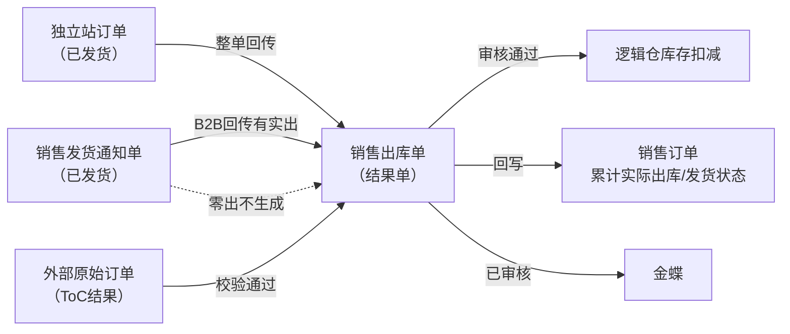
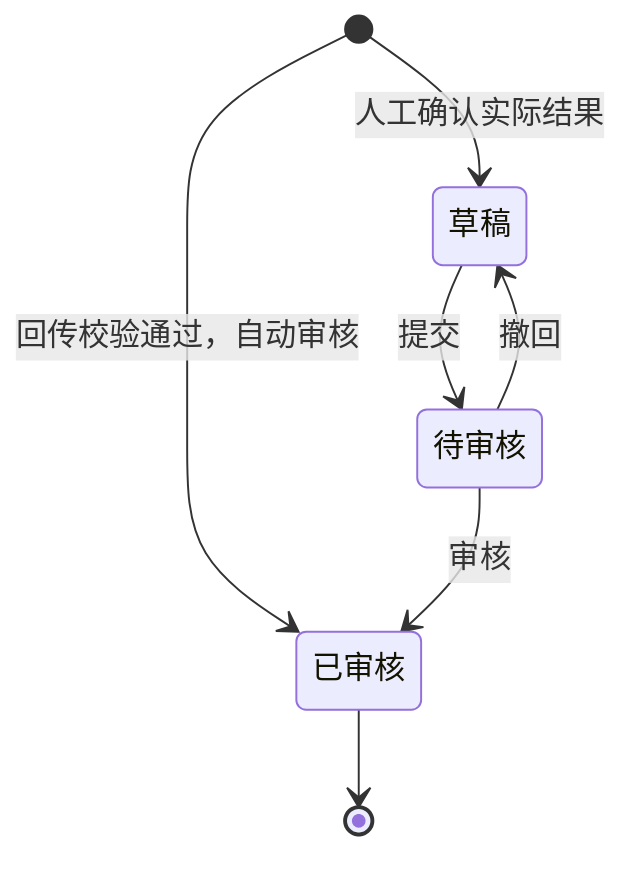
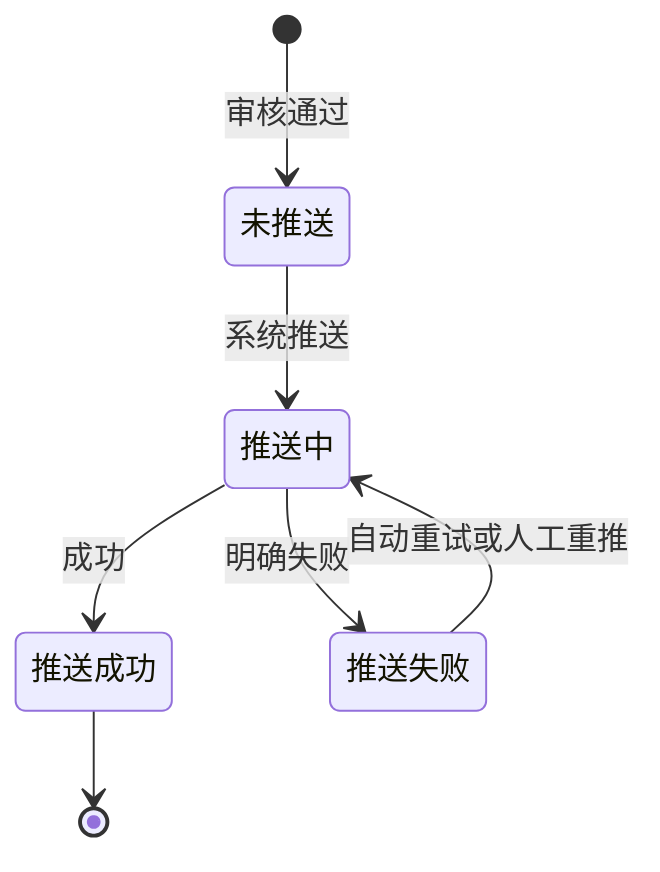

# 销售出库单主PRD

> 用途：定义销售出库单在ERP中的生成、审核、库存记账、来源回写及金蝶推送，作为研发实现和测试验收的依据。
> 定位：应用设计层文档。业务规则以[《销售与履约需求分析》](../../../../../02-需求调研和分析/04-销售与履约/销售与履约需求分析.md)和[《销售与履约业务设计》](../../../../../03-业务分析和设计/02-销售与履约业务设计.md)为准；状态与操作以[《单据与状态流转》](../../../系统架构和流程/03-单据与状态流转.md)第四节为准；字段与取值以[《销售出库单（详细稿）》](../../../字段清单合集/销售相关/销售出库单（详细稿）.tsv)为准；页面骨架见[《销售出库单页面骨架》](销售出库单页面骨架.md)；页面交互以[前端Demo版PRD](前端Demo版PRD/)为准，**须服从本文 §6.4 状态—功能矩阵**。
> 不写什么：不重复需求论证；不写仓库WMS作业细节与接口报文；不写金蝶报文字段映射；不写独立站订单页面细节；不写系统权限与API设计。

| 版本 | 本次变化 | 状态 |
| --- | --- | --- |
| V0.1 | 建立销售出库单主PRD，汇总B2B/独立站/外部ToC三类来源与页面分工 | 初稿，待评审 |

## 1. 文档信息与阅读边界

| 项目 | 内容 |
| --- | --- |
| 读者 | 研发工程师、测试工程师、产品复核 |
| 业务依据 | [《销售与履约需求分析》](../../../../../02-需求调研和分析/04-销售与履约/销售与履约需求分析.md) SAL-FR02、SAL-FR07、SAL-FR09、SAL-FR10；[《销售与履约业务设计》](../../../../../03-业务分析和设计/02-销售与履约业务设计.md)第四节 |
| 字段依据 | [《销售出库单（详细稿）》](../../../字段清单合集/销售相关/销售出库单（详细稿）.tsv) |
| 状态依据 | [《单据与状态流转》](../../../系统架构和流程/03-单据与状态流转.md)第四节 |
| 页面依据 | [《销售出库单页面骨架》](销售出库单页面骨架.md)、[前端Demo版PRD](前端Demo版PRD/) |

关联资料：[《销售发货通知单主PRD》](../销售发货通知单/销售发货通知单主PRD.md)、[《销售订单主PRD》](../销售订单/销售订单主PRD.md)、[《01-系统流程与单据交互》](../../../系统架构和流程/01-系统流程与单据交互.md)第三节、[《02-实体对象关系》](../../../系统架构和流程/02-实体对象关系.md)、[《系统集成需求分析》](../../../../../02-需求调研和分析/07-系统集成/系统集成需求分析.md) INT-FR03、INT-FR06。

## 2. 需求背景与目标

### 2.1 背景

仓库按销售发货通知单完成一次发货后，或独立站/外部渠道形成实际出库结果后，需要形成实际出库结果单，作为库存扣减和业财交接的唯一依据。销售订单和发货通知单不直接向金蝶推送，也不单独完成库存扣减。

没有统一的出库结果单时，实际出库数量、库存变化和财务输入难以与销售约定对齐，也无法逐单追溯分批发货过程，更无法作为溯源退货的依据。

### 2.2 目标

- B2B：发货通知仓库发货并回传有实出结束后，或虚拟出库创建成功后，**系统自动**生成出库单并自动审核；
- 独立站：订单推送仓库并回传整单发出后，系统自动生成出库单并自动审核；
- 外部ToC：聚水潭、领星等来源结果校验通过后，系统自动生成出库单并自动审核；
- 审核通过后扣减对应逻辑仓库存、消耗对应预占，并回写订单累计实际出库与发货状态；
- 已审核结果逐单推送金蝶；自动重试最多3次，仍失败则保持推送失败，在系统集成中心针对原单重推；销售出库单列表/详情不提供重推按钮；
- 出库单整单只读，不提供新增、编辑、取消或作废；
- 已审核后不因金蝶推送失败而回滚库存。

## 3. 需求范围

### 3.1 本期范围

- 销售出库单列表、详情（只读查看）；
- B2B：由发货通知回传或虚拟出库触发的自动生成（本模块无新增入口）；
- 独立站、外部ToC：由各自履约链路触发的自动生成（本模块仅列表/详情查看与追溯）；
- 接口失败时人工确认见 INT-FR06；
- 已审核后查看来源、库存结果与推送记录；金蝶推送失败时到系统集成中心重推原单；
- 审核状态与金蝶推送状态两个字段并列维护；
- 与销售发货通知单、销售订单的数量回写衔接。

### 3.2 功能清单

| 编号 | 功能/位置 | 本次内容 | 需求来源 |
| --- | --- | --- | --- |
| F01 | 出库单列表 | 查询、列展示、进入详情；来源类型、审核状态与金蝶推送状态多选筛选；勾选配合页头导出；**无新增**；一期批量栏无业务按钮 | SAL-FR10 |
| F04 | 详情页 | 分区域只读展示来源、明细价税、推送与审核信息 | SAL-FR02、SAL-FR10 |
| F08 | 重推金蝶（系统集成中心） | 已审核且金蝶推送失败时，在系统集成中心针对原单重试；本模块列表/详情不提供该按钮 | SAL-FR10、INT-FR03 |
| F09 | Demo Mock | 模拟通知回传后自动生成出库单；仅Demo | 演示需要，非业务规则 |

### 3.3 需求追溯

| 上游场景与需求 | 本 PRD 功能 | 本 PRD 验收 |
| --- | --- | --- |
| SAL-FR02：B2B实出回写、缺量、零出、虚拟出库 | F04、自动路径 | AC01、AC02、AC11 |
| SAL-FR07：独立站整单出库 | F01、F04 | AC03 |
| SAL-FR09：外部ToC结果归集 | F01、F04 | AC12 |
| SAL-FR10：物流及金蝶衔接 | F04、F08 | AC04、AC05 |
| SAL-AC03、SAL-AC23 | 自动路径 | AC01、AC11 |
| SAL-AC14、SAL-AC17 | F08 | AC04 |

### 3.4 非本期范围

- **无来源人工建出库单**、列表/详情新增入口（回传或虚拟出库自动生成的已审核单不走草稿编辑）；
- 出库单导入；
- 已审核后修改数量、价格、仓库或反审核；
- 零数量出库单；
- 独立站订单页面、外部ToC接入页面细节（见各自PRD或集成PRD）；
- 金蝶推送报文字段映射、系统集成中心页面细节（见集成PRD；本模块不提供重推按钮）；
- 系统权限矩阵、API/表结构/并发锁实现。

| 范围补充 | 说明 |
| --- | --- |
| 适用对象 | B2B、独立站、外部ToC形成的销售出库结果 |
| B2B唯一通知来源 | 必须关联销售发货通知单。常规：仓库回传有实出并结束，或虚拟出库创建成功后，系统自动生成 |
| 独立站来源 | 关联独立站销售订单，不经过发货通知单 |
| 外部ToC来源 | 关联外部原始订单，金额沿用来源结果 |
| 与原型差异 | 一期不提供无来源人工建出库单；列表/详情无重推按钮 |

## 4. 单据定位与业务边界

### 4.1 业务作用

| 项目 | 内容 |
| --- | --- |
| 单据层级 | 第3层——实际结果单，记录本次实际出库事实 |
| 核心职责 | 记录实际出库多少、从哪个仓出、来源哪张通知/订单；审核后记账并推送金蝶 |
| 单据来源 | B2B须来自销售发货通知单；独立站来自独立站订单；外部ToC来自外部原始订单及结果 |
| 下游单据 | 无业务下游；金蝶接收已审核结果；可作为销售退货溯源来源 |
| 数量关系 | B2B：一张通知对应0或1张出库单（零出不生成）；一张订单可对应多张出库单 |
| 业务终结 | 已审核为业务终态；不可取消、不可反审核；推送失败不改变已生效库存 |

### 4.2 上下游关系摘要

> 完整流程见[《01-系统流程与单据交互》](../../../系统架构和流程/01-系统流程与单据交互.md)第三节；本文只保留出库侧交接点。

### 4.3 业务对象关系

| 关系 | 说明 |
| --- | --- |
| 销售发货通知单 : 销售出库单 | 1:0..1（B2B）；零出不生成 |
| 销售订单 : 销售出库单 | 1:N（B2B）；1:0..1（独立站整单） |
| 外部原始订单 : 销售出库单 | 1:N（外部ToC按来源拆分） |
| 出库单明细 : 来源通知行/订单行 | N:1；数量与价格沿来源行 |
| 销售出库单 : 出库仓库 | N:1；沿用来源逻辑仓 |
| 销售出库单 : 销售退货单 | 1:N（溯源退货可选来源） |

### 4.4 本单据不负责的事项

- 出库单不安排仓库作业；执行指令由发货通知或独立站订单承担；
- 出库单不修改销售订单的订购数量与价格约定；
- 已审核后不因金蝶推送失败而回滚库存或删除业务结果；
- 不在原出库单上补发；少出部分已在通知侧体现缺出，补发另建通知；
- 超通知发货在仓库侧拒发，出库数量不超过通知实出；
- 独立站整单零执行不生成零数量出库单，按零出取消订单处理（SAL-FR07）。

## 5. 核心业务场景索引

| 场景ID | 场景 | 类型 | 说明 |
| --- | --- | --- | --- |
| S01 | B2B通知回传自动生成 | 主流程 | 已发货通知有实出→校验通过→生成出库单并自动审核→库存−→回写订单→推金蝶 |
| S02 | B2B通知少出 | 主流程 | 实出<通知量→出库按实出记账→订单累计实际出库增加→缺出在通知侧展示 |
| S03 | B2B通知零出 | 支线 | 不生成出库单；库存不变；不推金蝶 |
| S04 | 金蝶推送失败重推 | 支线 | 已审核+推送失败→自动重试3次→仍失败则在系统集成中心重推原单；库存不回滚 |
| S05 | B2B分批出库 | 主流程 | 同一订单多张通知各自生成出库单，分别推送金蝶 |
| S06 | B2B虚拟出库自动生成 | 主流程 | 通知选虚拟出库并创建成功→按通知数量生成出库单并自动审核→库存−→回写订单→推金蝶 |
| S07 | 独立站整单出库 | 主流程 | 订单推送仓库→整单回传→生成出库单并自动审核 |
| S08 | 外部ToC结果接收 | 主流程 | 来源结果校验通过→自动生成出库单并自动审核→记第三方逻辑仓 |
| S09 | 接口失败人工确认 | 支线 | 已交给仓库、接口拿不到结果→人工确认实际结果（INT-FR06）→沿来源通知形成出库单并提交审核 |

## 6. 状态与操作

状态定义 owner：[《单据与状态流转》](../../../系统架构和流程/03-单据与状态流转.md)第四节。销售出库单用**审核状态**与**金蝶推送状态**两个字段并列维护。

**一期用户界面口径**：回传或虚拟出库生成的出库单创建即为**已审核**；列表与详情不提供新增，也不提供重推按钮。已交给仓库、接口拿不到结果时，人工确认实际结果走草稿 → 待审核，入口形态见系统集成（待集成PRD），不是本模块无来源建单。

### 6.1 状态维度

| 维度 | 取值 | 说明 |
| --- | --- | --- |
| 审核状态 | 已审核（用户可见）；草稿/待审核（模型保留，本期常规路径不可见） | 控制是否记账 |
| 金蝶推送状态 | 未推送、推送中、推送成功、推送失败 | 跟踪业财推送 |

### 6.2 状态取值说明

**审核状态**

| 状态 | 含义 | 是否终态 | 一期界面 |
| --- | --- | --- | --- |
| 已审核 | 库存已生效，来源已回写 | 是 | 可见 |
| 草稿、待审核 | 人工确认实际结果时使用 | 否 | 入口不在本模块列表；见 R10 |

**金蝶推送状态**

| 状态 | 含义 | 是否终态 |
| --- | --- | --- |
| 未推送 | 尚未发起推送 | 否 |
| 推送中 | 推送作业进行中 | 否 |
| 推送成功 | 金蝶已接收 | 是 |
| 推送失败 | 推送明确失败，可重推 | 否（可重试至成功） |

自动生成的出库单创建时即为已审核，金蝶推送状态从「未推送」开始。

### 6.3 状态流转图

**审核状态（本期有效路径）**

**金蝶推送状态**（已审核后）

### 6.4 状态—功能矩阵

> ✅ = 允许；❌ = 不允许。F01 查询/查看均可用，不重复列出。

| 动作 | 已审核 |
| --- | --- |
| 详情/追溯（F04） | ✅ |
| 重推金蝶（F08） | ❌（入口在系统集成中心；须金蝶推送状态=推送失败） |
| Demo Mock（F09） | ✅（Demo） |

**系统集成中心 × F08**（须已审核；不在本模块列表/详情）

| 金蝶推送状态 | 重推金蝶（F08） |
| --- | --- |
| 未推送 / 推送中 | ❌（等待系统） |
| 推送失败 | ✅（系统集成中心） |
| 推送成功 | ❌ |

说明：

- 列表与详情**不提供**新增、编辑、提交、审核、撤回、取消、作废，也**不提供**重推金蝶。
- 已审核后整单只读；推送失败原因在详情可看，重推到系统集成中心办理。

列表批量操作栏一期仅展示已选中计数与列设置；导出在页头。

### 6.5 状态流转表

| 当前状态 | 动作 | 前置条件 | 结果状态 | 二次确认 | 后置影响 | 失败处理 |
| --- | --- | --- | --- | --- | --- | --- |
| — | 自动生成（B2B） | 来源通知已发货且有实出>0（R02）；校验通过（R03） | 已审核 | 无 | 分配单号（R01）；库存扣减；回写通知/订单（R05）；触发金蝶推送（R06） | 校验失败保留异常，不记账 |
| — | 自动生成（独立站/ToC） | 各自链路校验通过 | 已审核 | 无 | 同上 | 校验失败挂异常 |
| 已审核 | 自动推送 | 系统作业 | 推送中 | 无 | — | — |
| 推送中 | 推送成功 | 金蝶确认 | 推送成功 | 无 | 记录推送时间 | — |
| 推送中 | 推送失败 | 金蝶明确失败 | 推送失败 | 无 | 记录推送失败原因；**不回滚库存**；触发自动重试（R09） | — |
| 推送失败 | 自动重试 | 未达3次 | 推送中 | 无 | — | 仍失败则保持推送失败 |
| 已审核+推送失败 | 人工重推 | 在系统集成中心触发（F08） | 推送中 | 见系统集成 | 针对原单重试 | — |

## 7. 核心业务规则

### 7.1 创建与来源规则

| 规则编号 | 主题 | 规则 | 边界或例外 |
| --- | --- | --- | --- |
| R01 | 单号 | 按[《6.强盛ERP的编码规则和通用字段规则》](../../../../../01-全局背景信息/6.强盛ERP的编码规则和通用字段规则.md)第一节自动生成；前缀 XSCK；生成时分配 | 用户不可编辑 |
| R02 | 来源通知（B2B） | 必须关联一张已发货的销售发货通知单；一张通知最多一张有效出库单 | 零出通知不生成；已有出库单不可重复生成 |
| R03 | 自动生成 | 仓库回传有实出并结束，或虚拟出库创建成功后，校验通过则系统自动生成并自动审核 | 不经人工建单或人工审核 |
| R10 | 人工确认 | 已交给仓库、接口拿不到结果时，可按实际发生情况确认并沿来源通知形成出库单，走提交审核（INT-FR06） | 不能无来源新建出库单；不能用来替代虚拟出库 |
| — | 来源类型 | B2B发货通知、独立站订单、外部ToC三类；列表按来源类型筛选 | 独立站不关联通知；ToC关联外部原始订单 |
| — | 单头继承 | B2B：来源通知、来源订单、客户、币别、出库仓库、明细数量与订单价格沿来源携带；独立站：金额沿用Shopify；ToC：金额沿用来源结果 | 用户不可改仓库、数量、价格 |

数量示例（标明为示例）：通知实出380件并结束→生成出库单380件→订单累计实际出库+380→该通知关联1张出库单。

### 7.2 数量与价格规则

| 规则编号 | 主题 | 规则 | 边界或例外 |
| --- | --- | --- | --- |
| — | 出库数量 | 各行实际出库数量=来源通知实出数量（B2B）或来源订单/结果数量；不超过通知数量 | 创建后不可改 |
| — | 价格 | B2B/独立站：含税单价、税率、不含税单价、金额沿来源销售订单交易价格；ToC：沿用来源结果金额，不重新定价 | 推送金蝶时使用；字段范围待接口确认 |
| — | 零数量 | 不允许零数量出库单 | 零出在通知/订单侧取消，不进入本单 |

### 7.3 字段锁定规则

| 规则编号 | 主题 | 规则 | 边界或例外 |
| --- | --- | --- | --- |
| R07 | 只读 | 出库单生成后整单只读，不提供编辑入口 | 已审核不可改任何业务字段 |
| — | 不可撤销 | 已审核为终态，不提供取消、作废、反审核 | 更正走技术介入，见分层设计 §8.5 |

### 7.4 回写与库存规则

| 规则编号 | 主题 | 规则 | 边界或例外 |
| --- | --- | --- | --- |
| R05 | 回写时机 | 自动审核通过时回写通知实出确认、订单累计实际出库数量与发货状态 | B2B路径；独立站/ToC按各自链路回写 |
| — | 库存记账 | 已审核后扣减对应逻辑仓即时库存，并消耗对应预占 | 外部ToC记第三方逻辑仓 |
| — | 缺出 | 少出部分不在出库单体现；缺出在通知侧展示 | 补发另建通知 |

### 7.5 金蝶推送规则

| 规则编号 | 主题 | 规则 | 边界或例外 |
| --- | --- | --- | --- |
| R06 | 推送时机 | 已审核后由系统自动逐单推送金蝶 | 订单与通知不推送 |
| R09 | 自动重试 | 推送明确失败后系统自动重试，**最多3次**；3次仍失败则保持「推送失败」，等待在系统集成中心重推（F08） | 间隔本期不定秒数，由技术配置 |
| R08 | 失败重推 | 在系统集成中心针对原单重试，不另建业务单；销售出库单列表/详情不提供重推按钮 | 不回滚库存与回写 |
| — | 业务日期 | 推送金蝶时使用；**取实际出库时间的日期部分** | 见字段清单 Q02 |
| — | 推送记录 | 记录推送时间、推送失败原因；重推成功后仍保留历史失败原因 | 见 INT-FR03 |

### 7.6 业务生效点

| 业务动作 | 出库单影响 | 库存影响 | 业财/外部影响 |
| --- | --- | --- | --- |
| 自动生成并审核 | 已审核；带入实出数量与来源价格 | 逻辑仓库存扣减、消耗预占 | 触发金蝶推送 |
| 金蝶推送成功 | 推送状态→成功 | 无额外变化 | 金蝶接收结果 |
| 金蝶推送失败 | 推送状态→失败；业务仍已审核 | 不回滚 | 自动重试3次；仍失败则在系统集成中心重推 |

### 7.7 字段校验绑定

完整字段见 TSV。摘要：

| 校验时机 | 要求 |
| --- | --- |
| 自动生成 | B2B：来源通知已发货且有实出>0（R02）；校验通过（R03） |
| 重推 | 已审核+推送失败（R08）；入口在系统集成中心 |

页面控件、错误文案见 Demo PRD；重推交互不在本模块。

## 8. 功能需求说明（页面索引）

| 编号 | 页面/位置 | 规则与状态依据 | Demo PRD |
| --- | --- | --- | --- |
| F01 | 列表 | §6.4 | [列表页](前端Demo版PRD/销售出库单前端Demo版PRD_列表页.md) |
| F04 | 详情 | R05～R08；§6.4 | [详情页](前端Demo版PRD/销售出库单前端Demo版PRD_详情页.md) |
| F08 | 重推金蝶 | R08、R09；§6.5 | 入口在系统集成中心；本模块弹窗 PRD 不再定义该确认框 |
| F09 | Demo Mock | 非正式验收 | [弹窗与Mock](前端Demo版PRD/销售出库单前端Demo版PRD_弹窗与Mock.md) §2 |

本期不提供新增/编辑页，见[《销售出库单前端Demo版PRD_新增编辑页》](前端Demo版PRD/销售出库单前端Demo版PRD_新增编辑页.md)说明。

## 9. 上下游影响与协同

| 关联模块/系统 | 需要配合的变化 | 交接内容与时机 | 验收结果 |
| --- | --- | --- | --- |
| 销售发货通知单 | B2B回传触发生成 | 已发货且有实出时生成；详情可跳转关联出库单 | 1:0..1 关系成立 |
| 销售订单 | 累计实际出库回写 | 出库单审核通过时更新累计实际出库与发货状态 | 与销售订单主PRD R09一致 |
| 库存 | 即时库存扣减 | 已审核后按逻辑仓记账 | INV-FR05 |
| 金蝶 | 接收已审核结果 | 审核后自动推送；失败重推原单 | FIN-FR01～FIN-FR03 |
| 系统集成中心 | 展示推送结果；失败时重推原单 | 推送状态、时间、失败原因；重推不改业务信息 | INT-FR03 |
| 销售退货 | 溯源退货可选来源 | 已审核出库单作为可退额度依据 | SAL-FR05 |

## 10. 关联文档与阅读入口

| 关联内容 | 阅读入口 | 本 PRD 与其边界 |
| --- | --- | --- |
| 销售发货通知单 | [《销售发货通知单主PRD》](../销售发货通知单/销售发货通知单主PRD.md) | B2B唯一生成来源；实出与缺出 owner 在通知侧 |
| 销售订单 | [《销售订单主PRD》](../销售订单/销售订单主PRD.md) | 累计实际出库与发货状态 owner 在订单侧 |
| B2B销售流程 | [《01-系统流程与单据交互》](../../../系统架构和流程/01-系统流程与单据交互.md)第三节 | 完整角色接力；本文只写出库侧 |
| 状态与操作 | [《单据与状态流转》](../../../系统架构和流程/03-单据与状态流转.md)第四节 | 状态 owner；本文矩阵与 Demo 须一致 |
| 字段定义 | [《销售出库单（详细稿）》](../../../字段清单合集/销售相关/销售出库单（详细稿）.tsv) | TSV 为字段 owner |
| 页面结构 | [《销售出库单页面骨架》](销售出库单页面骨架.md) | 区域与线框走查，非规则权威 |
| 页面交互 | [前端Demo版PRD](前端Demo版PRD/) | 控件、文案、Mock；服从 §6.4 |

## 11. 异常与一致性

### 11.1 并发操作

| 场景 | 业务处理结果 |
| --- | --- |
| 同一通知重复回传触发生成 | 只允许一张有效出库单；重复触达幂等，不重复记账 |

### 11.2 幂等与重复处理

| 操作 | 幂等规则 |
| --- | --- |
| 通知回传触发生成 | 同一通知不得重复生成出库单或重复记账 |
| 金蝶重推 | 同一出库单重复推送不得重复扣减库存 |
| 外部ToC重复回传 | 已成功结果不得重复记账或形成金蝶单据（SAL-FR12） |

### 11.3 与上下游单据一致性

| 场景 | 处理方式 |
| --- | --- |
| 通知已有关联出库单 | 不可再自动生成 |
| 推送失败 | 库存与回写保持；自动重试3次；仍失败则在系统集成中心重推原单 |
| 订单关闭后 | 已有通知产生的出库单正常记账与推送 |

## 12. 验收标准与待确认事项

### 12.1 验收标准

| 编号 | 对应功能/规则 | 条件与操作 | 预期结果 |
| --- | --- | --- | --- |
| AC01 | 自动路径/R03、R05 | B2B通知实出380并结束 | 自动生成出库单380件、已审核；单号 XSCK 规则；订单累计实际出库+380；库存−380；触发金蝶推送 |
| AC02 | R02 | B2B通知零出结束 | 不生成出库单；库存不变；不推金蝶 |
| AC03 | SAL-FR07 | 独立站整单回传 | 生成出库单并自动审核；关联独立站订单；不关联发货通知 |
| AC04 | F08/R08、R09 | 金蝶推送明确失败 | 自动重试最多3次；仍失败则保持推送失败，可在系统集成中心重推；本模块列表/详情无重推按钮；库存不回滚 |
| AC05 | R07、F01 | 列表与详情 | 无新增/编辑入口；无行内重推；整单只读 |
| AC06 | F01 | 列表筛选来源类型、审核状态与金蝶推送状态 | 多选 OR 匹配；列与 TSV 一致 |
| AC07 | F04 | 详情展示来源通知/订单 | 可跳转来源单据；展示推送记录 |
| AC08 | F09 | Demo Mock 模拟自动生成 | 仅 Demo 可用；正式验收以回传为准 |
| AC09 | R10 | 已交给仓库的通知接口拿不到结果 | 可人工确认实际结果，沿来源通知形成出库单并提交审核；不能无来源建单 |
| AC10 | SAL-FR02 | 同一订单两批通知各实出50 | 两张出库单各50；订单累计实际出库100；分别推送金蝶 |
| AC11 | R03、SAL-AC23 | B2B虚拟出库通知600件 | 不推仓库；生成已审核出库单600件；库存和预占各减600 |
| AC12 | SAL-FR09 | 接收外部ToC出库结果 | 校验通过后自动审核、记第三方逻辑仓、推金蝶；金额沿用来源 |

### 12.2 待确认事项

| 编号 | 问题 | 影响范围 | 状态/结论 |
| --- | --- | --- | --- |
| Q01 | 列表默认排序字段 | F01 | **已确认**：业务日期倒序 |
| Q02 | 业务日期取值口径 | R06、字段 | **已确认**：取实际出库时间的日期部分 |
| Q03 | 价税字段推送范围与精度 | 明细价税 | 待接口确认 |
| Q04 | 金蝶推送自动重试策略 | R09、F08 | **已确认**：自动重试最多3次；间隔本期不定秒数，由技术配置；仍失败须在系统集成中心重推 |
| Q05 | 人工确认出库 | R10 | **已确认**：不提供无来源人工建出库单；已交给仓库、接口拿不到结果时，人工确认实际结果沿用 INT-FR06，入口在系统集成中心 |
