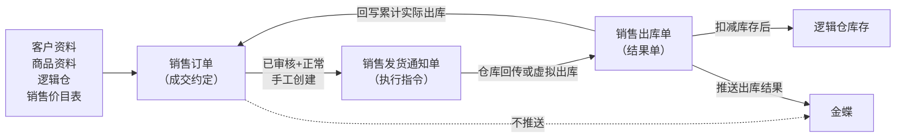
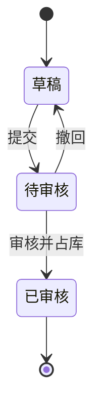
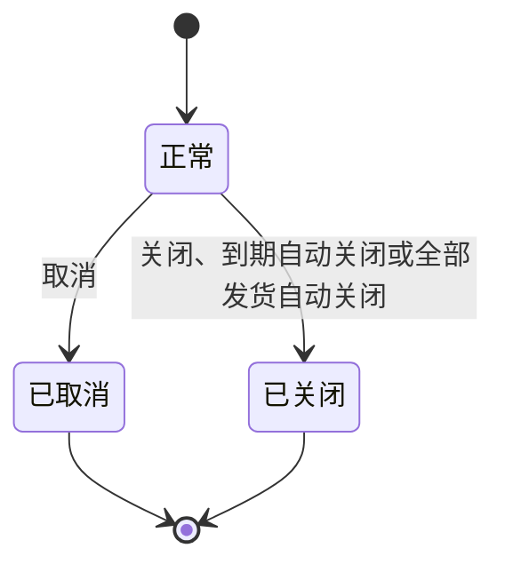

# 销售订单主PRD

> 用途：定义B2B销售订单在ERP中的建单、审核占库、交期调整、关闭取消及创建销售发货通知等系统行为，作为研发实现和测试验收的依据。
> 定位：应用设计层文档。业务规则以[《销售与履约需求分析》](../../../../../02-需求调研和分析/04-销售与履约/销售与履约需求分析.md)和[《销售与履约业务设计》](../../../../../03-业务分析和设计/02-销售与履约业务设计.md)为准；状态与操作以[《单据与状态流转》](../../../系统架构和流程/03-单据与状态流转.md)第二节为准；字段与取值以[《销售订单（详细稿）》](../../../字段清单合集/销售相关/销售订单（详细稿）.tsv)为准；页面骨架见[《销售订单页面骨架》](销售订单页面骨架.md)；页面交互以[前端Demo版PRD](前端Demo版PRD/)为准，**须服从本文 §6.4 状态—功能矩阵**。
> 不写什么：不重复需求论证；不写销售发货通知单、销售出库单内部流程；不写独立站订单或外部电商订单的履约；不写金蝶接口报文、收款结算和系统权限实现。

| 版本 | 本次变化 | 状态 |
| --- | --- | --- |
| V0.1 | 建立B2B销售订单主PRD，明确审核占库、分批发货、关闭取消与字段边界 | 初稿，待评审 |
| V0.2 | 按《主PRD模板-V2（业务单据）》重构：补单据定位、场景索引、状态矩阵与规则分组；关联前端Demo版PRD | 初稿，待评审 |
| V0.3 | 发货方式、发货地址、物流服务产品上移至销售订单维护；通知单默认继承并可按本次覆盖 | 初稿，待评审 |
| V0.4 | 导入口径注记：退货单支持正式导入、订单不做，差异按业务确认 | 初稿，待评审 |

## 1. 文档信息与阅读边界

| 项目 | 内容 |
| --- | --- |
| 读者 | 研发工程师、测试工程师、产品复核 |
| 业务依据 | [《销售与履约需求分析》](../../../../../02-需求调研和分析/04-销售与履约/销售与履约需求分析.md) SAL-FR01～SAL-FR04；[《销售与履约业务设计》](../../../../../03-业务分析和设计/02-销售与履约业务设计.md)第四节 |
| 字段依据 | [《销售订单（详细稿）》](../../../字段清单合集/销售相关/销售订单（详细稿）.tsv) |
| 状态依据 | [《单据与状态流转》](../../../系统架构和流程/03-单据与状态流转.md)第二节 |
| 页面依据 | [《销售订单页面骨架》](销售订单页面骨架.md)、[前端Demo版PRD](前端Demo版PRD/) |

关联资料：[《价格管理需求分析》](../../../../../02-需求调研和分析/06-价格管理/价格管理需求分析.md)（PRI-FR03～PRI-FR05）、[《01-系统流程与单据交互》](../../../系统架构和流程/01-系统流程与单据交互.md)、[《02-实体对象关系》](../../../系统架构和流程/02-实体对象关系.md)。

## 2. 需求背景与目标

### 2.1 背景

B2B销售人员与客户线下谈妥商品、数量、价格后，需要在ERP中记录成交约定，并按客户要求安排仓库发货。一期不设报价合同在线流转，也不做独立站订单与外部电商订单的履约。

没有统一的销售订单时，成交内容、占库情况和发货进度难以追溯，后续发货安排与业财交接缺少统一依据。

### 2.2 目标

- 记录B2B客户的成交商品、数量、价格、发货仓库、交期、发货方式、发货地址与物流服务产品，作为后续分批发货的依据；
- 审核时校验可用库存，审核通过才占用库存；
- 区分“实际已出多少”“还占多少库存”和“还能安排多少通知”，避免少出、关闭或取消时数量混乱；
- 区分取消与关闭：取消要求整单不再执行，关闭只停止新增通知，已有通知仍可执行；
- 全部发货时立即自动关闭订单，不另设“已完成”业务状态。

已审核后数量和价格锁定，仅可调整交期；审核通过**不会**自动生成销售发货通知单。

## 3. 需求范围

### 3.1 本期范围

- 销售订单列表、新增、编辑、详情；
- 页头导出（一期正式）；页头导入仅 Demo Mock，不作正式验收；
- 草稿保存、提交、审核、撤回，以及审核时的可用库存校验和预占；
- 草稿可物理删除（无下游引用时，一期必做）；
- 已审核订单调整交期、创建销售发货通知单、手动关闭、到期自动关闭、全部履约自动关闭和取消；
- 审核状态、业务状态、发货状态三字段并列维护；
- 发货通知创建后占用可下推量，实际出库后回写订单数量。

### 3.2 功能清单

| 编号 | 功能/位置 | 本次内容 | 需求来源 |
| --- | --- | --- | --- |
| F01 | 销售订单列表 | 查询、列展示（含总可下推数量、累计实际出库数量）、行操作入口；三状态筛选项多选；勾选配合页头导出；一期批量栏无业务按钮 | SAL-FR01 |
| F02 | 新增/编辑页 | 维护单头、发货与交期、商品明细；草稿保存 | SAL-FR01、PRI-FR03～05 |
| F03 | 提交 | 草稿提交；待审核取消 | SAL-FR01、COM-FR01 |
| F04 | 审核/撤回 | 待审核订单审核并占库；撤回留意见；库存不足时审核失败 | SAL-FR01、SAL-FR02、COM-FR01 |
| F05 | 详情页 | 分区域展示、关联单据（发货通知单与出库单）、操作信息、终止信息按状态显示 | SAL-FR01、SAL-FR03 |
| F06 | 已审核操作 | 调整交期、关闭、取消、创建销售发货通知 | SAL-FR02～SAL-FR04 |
| F07 | Demo Mock | 审核通过后可选演示用通知单生成；仅Demo | 演示需要，非业务规则 |

### 3.3 需求追溯

| 上游场景与需求 | 本 PRD 功能 | 本 PRD 验收 |
| --- | --- | --- |
| SAL-FR01：B2B建单、审核与取价 | F01～F04 | AC01、AC05 |
| SAL-FR02：审核占库、分批通知与实际出库 | F04、F06 | AC02、AC03 |
| SAL-FR03：关闭和全部发货自动关单 | F06 | AC04、AC06 |
| SAL-FR04：订单与通知取消 | F06 | AC07 |
| PRI-FR03～PRI-FR05：销售取价、改价与锁定 | F02、F03 | AC05 |
| COM-FR01：提交与审核权限 | F03、F04 | AC01 |

### 3.4 非本期范围

- 独立站订单（单独菜单）、外部电商订单归集；
- 报价合同、信用强制拦截、收款结算、金蝶接口报文；
- 销售订单正式导入、系统权限矩阵、API/表结构/并发锁实现；
- 审核通过自动生成发货通知单、直推销售出库单。

| 范围补充 | 说明 |
| --- | --- |
| 适用对象 | B2B成品销售；一张订单一个发货仓库（实际选择逻辑仓）、一个交期；不同逻辑仓或交期拆单 |

## 4. 单据定位与业务边界

### 4.1 业务作用

| 项目 | 内容 |
| --- | --- |
| 单据层级 | 第1层——业务安排单，表达与B2B客户的成交约定 |
| 核心职责 | 记录向谁销售、销售什么、从哪个仓发、发到哪、用什么物流、销售多少及价格 |
| 单据来源 | 销售人员人工创建；一期唯一方式 |
| 下游单据 | 销售发货通知单；已审核+正常+有可下推量时**手工**创建 |
| 数量关系 | 一张订单对应多张发货通知单，支持分批发货；出库结果经通知回写累计实际出库数量 |
| 业务终结 | 取消或关闭；关闭/取消不可撤销；全部发货时立即自动关闭 |

### 4.2 上下游关系摘要

> 完整流程见[《01-系统流程与单据交互》](../../../系统架构和流程/01-系统流程与单据交互.md)；本文只保留订单侧交接点。

### 4.3 业务对象关系

| 关系 | 说明 |
| --- | --- |
| 销售订单 : 客户 | N:1；一张订单一个客户 |
| 销售订单 : 发货仓库 | N:1；一张订单一个发货仓库，实际选择逻辑仓 |
| 销售订单 : 销售订单明细 | 1:N |
| 销售订单 : 销售发货通知单 | 1:N；分批创建 |
| 销售订单明细 : 通知单明细 | 1:N；按 SKU 分行占用与回补 |
| 销售订单 : 发货地址 | N:1；一张订单约定一个客户地址（自提时不填） |
| 销售订单 : 物流服务产品 | N:1；物流配送时选定产品或「由仓库指定」（自提时不选） |
| 销售发货通知单 : 销售出库单 | 1:0..1；零出按通知规则处理 |

### 4.4 本单据不负责的事项

- 销售订单不直接扣减即时库存；库存变化由销售出库单确认后触发；
- 销售订单不直接完成收款结算；金蝶不推送订单，只推出库结果；
- 发货方式、发货地址与物流服务产品在销售订单维护成交约定；下推发货通知单默认继承，分批发货时通知单可按本次交付覆盖；
- 取消或关闭不删除已发生的出库事实；已经实际出库的订单不能整单取消，只能按规则关闭剩余部分；
- 虚拟出库的处理方式写在销售发货通知单上，不写在销售订单上。

## 5. 核心业务场景索引

| 场景ID | 场景 | 类型 | 说明 |
| --- | --- | --- | --- |
| S01 | 建单并一次性发完 | 主流程 | 草稿→提交→审核占库→创建通知→出库回写→全部发货；系统立即自动关单（R13） |
| S02 | 建单并分批发货 | 主流程 | 已审核后多次创建通知；每次占用可下推量；实出结束后缺量回补 |
| S03 | 客户延期 | 主流程 | 已审核+正常→调整交期；数量价格不变 |
| S04 | 撤回后重提 | 支线 | 待审核→撤回→草稿（保留撤回意见）→修改→重新提交 |
| S05 | 手工关闭余量 | 主流程 | 已审核+正常且仍有未发足余量时→关闭；不可反关单；已有通知继续执行 |
| S06 | 取消整单 | 支线 | 无实际出库且无阻挡通知时可取消；有待推送/推送失败通知可随单取消；有执行中通知须先处理 |
| S07 | 草稿删除 | 支线 | 草稿+正常且未被下游引用时可物理删除 |
| S08 | 审核库存不足 | 异常 | 库存不足时审核失败，不占库；补足库存后可重试 |

## 6. 状态与操作

状态定义 owner：[《单据与状态流转》](../../../系统架构和流程/03-单据与状态流转.md)第二节。销售订单审核链无「已驳回」态，待审核不同意时操作为**撤回**（回到草稿），不叫驳回。三个字段并列组合理解；取消、关闭保留原审核状态，不把已审核订单撤回为草稿。

### 6.1 状态维度

| 维度 | 取值 | 说明 |
| --- | --- | --- |
| 审核状态 | 草稿、待审核、已审核 | 控制编辑、审核及能否安排发货 |
| 业务状态 | 正常、已取消、已关闭 | 控制是否继续新增发货安排 |
| 发货状态 | 未发货、部分发货、全部发货 | **计算列**；按累计实际出库数量自动更新，不参与流转 |

「正常」表示未取消且未关闭，不代表尚未发完；可同时出现「已审核+正常+部分发货」或「已审核+已关闭+部分发货」。当发货状态变为「全部发货」时，系统立即将业务状态更新为「已关闭」，关闭方式记录为「全部履约自动关闭」。

### 6.2 状态取值说明

| 状态 | 含义 | 是否终态 |
| --- | --- | --- |
| 草稿 | 尚未提交或撤回后待修改 | 否 |
| 待审核 | 已提交，等待审核 | 否 |
| 已审核 | 审核通过，约定锁定并已占库 | 否（业务状态仍可变） |
| 正常 | 可继续办理 | 否 |
| 已取消 | 整单不再执行 | 是（业务维度） |
| 已关闭 | 不再新增通知 | 是（业务维度） |
| 未发货/部分发货/全部发货 | 实发进度展示 | 否（随回写变化；全部发货后立即触发自动关单） |

### 6.3 状态流转图

**审核状态**：

**业务状态**：

**发货状态**：未发货／部分发货／全部发货为计算值，无独立流转；全部发货后立即自动关单，不另设已完成业务状态。

### 6.4 状态—功能矩阵

> ✅ = 允许；❌ = 不允许；✅（条件）= 须满足 R08～R14。F01 查询/查看各状态均可用，不重复列出。

| 动作 | 草稿+正常 | 待审核+正常 | 已审核+正常 | 已审核+已关闭 | 已审核+已取消 | 草稿/待审核+已取消 |
| --- | --- | --- | --- | --- | --- | --- |
| 编辑（F02） | ✅ | ❌ | ❌ | ❌ | ❌ | ❌ |
| 提交（F03） | ✅ | ❌ | ❌ | ❌ | ❌ | ❌ |
| 取消（待审核，F03） | ❌ | ✅ | ❌ | ❌ | ❌ | ❌ |
| 审核（F04） | ❌ | ✅ | ❌ | ❌ | ❌ | ❌ |
| 撤回（F04） | ❌ | ✅ | ❌ | ❌ | ❌ | ❌ |
| 调整交期（F06） | ❌ | ❌ | ✅（R10） | ❌ | ❌ | ❌ |
| 创建发货通知（F06） | ❌ | ❌ | ✅（R08） | ❌ | ❌ | ❌ |
| 关闭（F06） | ❌ | ❌ | ✅（R11） | ❌ | ❌ | ❌ |
| 取消（已审核，F06） | ❌ | ❌ | ✅（R14） | ❌ | ❌ | ❌ |
| 删除草稿（R15） | ✅（条件） | ❌ | ❌ | ❌ | ❌ | ❌ |
| Demo Mock（F07） | ❌ | ❌ | ✅（Demo） | ❌ | ❌ | ❌ |
| 详情/追溯（F05） | ✅ | ✅ | ✅ | ✅ | ✅ | ✅ |

已取消、已关闭：仅查看与追溯，不显示编辑、提交、审核、创建通知、反关单。

列表与详情行内操作按状态互斥展示：草稿仅提供删除（不提供取消、关闭）；待审核不提供删除与关闭；已审核+正常时取消与关闭可同时出现（取消须满足R14，关闭须满足R11，调整交期须满足R10且发货状态≠全部发货）。**发货状态=全部发货**时系统立即自动关单，不作为可停留操作态。列表批量操作栏一期仅展示已选中计数与列设置；**导出**在页头，可选已勾选范围。**导入**一期不做正式能力，列表页头可保留导入按钮，仅作 Demo Mock 演示。

### 6.5 状态流转表

| 当前状态 | 动作 | 前置条件 | 结果状态 | 二次确认 | 后置影响 | 失败处理 |
| --- | --- | --- | --- | --- | --- | --- |
| 草稿+正常 | 保存 | 明细已填则数量>0 | 草稿+正常 | 无 | 分配单号（R01） | 校验失败定位字段/行 |
| 草稿+正常 | 提交 | R05 提交校验 | 待审核+正常 | 见 Demo PRD | 无 | 阻断并提示 |
| 草稿+正常 | 删除 | R15 | 物理删除 | 二次确认 | 记录消失 | 被引用时阻断 |
| 待审核+正常 | 审核 | 审核人操作；库存充足（R07） | 已审核+正常 | 二次确认 | 占库；数量价格锁定（R11） | 库存不足时阻断，不占库 |
| 待审核+正常 | 撤回 | 必填撤回意见 | 草稿+正常 | 无 | 保留撤回意见 | — |
| 待审核+正常 | 取消 | 无 | 原审核+已取消 | 必填取消原因 | 终止审核流程 | — |
| 已审核+正常 | 调整交期 | 发货状态≠全部发货（R10） | 已审核+正常 | 见 Demo PRD | 记录操作信息 | 全部发足时阻断 |
| 已审核+正常 | 创建发货通知 | 有可下推量（R08） | 已审核+正常 | 通知 PRD | 占用可下推量 | 无量时阻断 |
| 已审核+正常 | 关闭 | R11；发货状态≠全部发货；仍有未发足余量 | 已审核+已关闭 | 必填关闭原因 | 不可新增通知；已有通知继续；记录关闭方式、关闭时间、关闭操作人 | 全部发足时阻断；不可撤销 |
| 已审核+正常 | 取消 | R14 | 已审核+已取消 | 必填取消原因 | 释放未执行占库 | 条件不满足时阻断 |
| 任意+已关闭/已取消 | 查看 | — | 不变 | — | — | — |
| 已审核+正常 | 出库回写 | 通知出库完成 | 发货状态重算 | 自动 | 累计实际出库数量更新；可下推量回补；全部发货时触发 R13 | — |

## 7. 核心业务规则

### 7.1 创建与提交规则

| 规则编号 | 主题 | 规则 | 边界或例外 |
| --- | --- | --- | --- |
| R01 | 单号 | 按[《6.强盛ERP的编码规则和通用字段规则》](../../../../../01-全局背景信息/6.强盛ERP的编码规则和通用字段规则.md)第一节自动生成；保存草稿时分配 | 用户不可编辑；B2B前缀 XSDD |
| R02 | 客户与仓库 | 客户只能选择审核通过且启用的客户；发货仓库实际选择审核通过且启用的逻辑仓。一张订单一个仓库、一个交期，不同逻辑仓或交期必须拆单 | 变更客户后原匹配价格作废（PRI-FR05）；变更客户后须重选发货地址 |
| R03 | 币别 | 选客户后默认带出客户默认币别，无默认则手选；改客户或改币别清空明细价格并按新条件重取 | 不做跨币别换算 |
| R16 | 发货方式与物流 | 发货方式=物流配送时，发货地址必填；须选择启用的物流服务产品或「由仓库指定」。发货方式=自提时，不选物流服务产品，发货地址留空 | 见《物流资料主PRD》R04；提交后锁定；已审核后不可改 |
| — | 地址选择 | 发货地址从所选客户地址明细选择；选客户后默认带出客户默认地址，可改选其他地址 | 客户无地址时阻断提交 |
| R04 | 取价 | 按具体客户价→客户等级价→所有客户基准价的顺序取价；不按是否有价过滤SKU；三层均未命中时允许手工填写 | 零价提交需确认；空价或负价阻断；提交后价格税率锁定（PRI-FR03～05） |
| R05 | 价税与金额 | 行价税合计=销售数量×含税单价；行金额=销售数量×不含税单价；行税额=价税合计−金额；单头价税合计、税额、金额分别汇总明细对应字段 | 单价4位小数，金额和税额2位小数；行内差额计入税额；税率允许0%，此时税额为0、价税合计等于金额；页面按千分位展示，录入不带千分位 |

数量示例（标明为示例）：SKU-A 销售 1,000 件，建通知 600 件占用 600；该通知实出 580 并结束后，累计实际出库 580、剩余发货 420、可下推量回补为 420 件（1,000−580−0）。

### 7.2 审核占库与数量规则

| 规则编号 | 主题 | 规则 | 边界或例外 |
| --- | --- | --- | --- |
| R06 | 三状态 | 审核状态、业务状态、发货状态并列维护，各记各的信息 | 全部发货后立即自动关单 |
| R07 | 审核占库 | 审核时按订单明细校验发货仓库的可用库存；库存不足时审核失败，不占库。审核通过才占用订单数量 | 见 SAL-FR02 |
| R08 | 可下推数量 | 销售数量−已结束通知的实际出库数量−未结束有效通知的通知数量；不同 SKU 不互抵；关单后不能再建通知 | 见 SAL-FR02 公式 |
| R09 | 实际出库回写 | 通知下发不重复占库，也不扣即时库存；实际出库后扣减即时库存和对应预占，并回写订单累计实际出库数量和发货状态 | 少出部分不回原通知补发，须另建通知 |
| — | 总销售数量 | 各明细行销售数量之和；列表展示用 | 不同 SKU 直接相加 |
| — | 总可下推数量 | 各明细行可下推数量之和；列表展示用，仅已审核+正常时汇总，否则为 0 | 不同 SKU 直接相加，不互抵 |
| — | 累计实际出库数量（单头） | 各明细行累计实际出库数量之和；列表展示用 | 与明细同名字段汇总一致 |
| — | 剩余发货数量 | 销售数量−累计实际出库数量 | 与可下推数量口径不同，仅反映尚未实际出库量 |
| — | 订单剩余预占 | 审核占用量减累计实际出库量；关闭或取消发生释放后按本 PRD 规则计算 | 仅反映当前仍占用的库存 |
| — | 在途通知数量 | 未结束销售发货通知占用的数量；通知创建即计入；取消成功或实际出库后释放/替代 | 见 SAL-FR02 |

### 7.3 审核后维护规则

| 规则编号 | 主题 | 规则 | 边界或例外 |
| --- | --- | --- | --- |
| R10 | 编辑范围 | 草稿可改；待审核不可改单只可走审核/撤回/取消；已审核不可改客户、仓库、商品、数量、价格、税率、发货方式、发货地址与物流服务产品，只能调整交期 | 撤回回草稿后可再改；不做变更单；全部发足后不可调整交期（R13） |
| — | 审核记录 | 审核/撤回须记录审核人、审核时间；撤回意见保留 | 允许有权限用户提交并审核自己创建的单据（COM-FR01） |

审核后销售人员在订单「已审核+正常」且有可下推数量时，手工创建销售发货通知单；发货通知单创建时沿用订单发货仓库，并默认继承订单的发货方式、发货地址与物流服务产品，分批发货时可按本次交付覆盖。现场自提仍须先有销售订单和销售发货通知单，仓库不得无单放货。

### 7.4 取消、关闭与删除规则

| 规则编号 | 主题 | 规则 | 边界或例外 |
| --- | --- | --- | --- |
| R11 | 手动关闭 | 已审核+正常且仍有未发足余量时可手工关闭；关闭原因必填。关闭后不能新增通知，已有通知继续执行 | 关闭时仅释放未安排成通知的占库；执行中通知对应的占库保留，通知结束后再释放少出余量；不可反关单 |
| R12 | 到期自动关闭 | 交期后T+2自然日的当天北京时间0:00自动关闭；不跳过周末。系统自动关闭的关闭原因、关闭操作人留空 | 每天0:00跑批 |
| R13 | 全部履约自动关闭 | 发货状态变为全部发货时立即自动关闭；关闭方式为「全部履约自动关闭」，关闭原因、关闭操作人留空 | 不另设已完成业务状态 |
| R14 | 取消 | 没有通知，或通知尚未推送、推送失败时可取消；存在推送中或已推送仓库且未取消的通知不允许直接取消；已向仓库申请取消须等回传；已有实际出库不能整单取消 | 见 SAL-FR04 情形表 |
| R15 | 删除 | 仅草稿+正常且未被下游引用时可删除；一期必做 | 已提交或已被引用不可删 |

| 维度 | 取消 | 关闭 |
| --- | --- | --- |
| 含义 | 整单不再执行 | 不再安排剩余发货，已有通知继续 |
| 典型状态 | 草稿/待审核/已审核+正常（条件） | 已审核+正常 |
| 可撤销 | 否 | 否 |
| 对已有出库 | 不允许（须关余量） | 不删除已出库事实 |

### 7.5 业务生效点

| 业务动作 | 销售订单影响 | 库存影响 | 业财/外部影响 |
| --- | --- | --- | --- |
| 创建/保存草稿 | 产生草稿约定 | 无 | 无 |
| 审核通过 | 数量价格锁定，可创建通知；占用订单数量 | 预占库存 | 无 |
| 创建发货通知 | 占用可下推量 | 无新增扣减 | 无 |
| 出库确认回写 | 更新累计实际出库数量、发货状态、可下推量；全部发货触发 R13 | 扣减即时库存和对应预占 | 金蝶推出库结果，不推订单 |
| 关闭 | 业务状态→已关闭；释放未安排占库 | 按规则释放预占 | 无 |
| 取消 | 业务状态→已取消 | 释放未执行占库 | 无 |

### 7.6 字段校验绑定

完整字段见 TSV。摘要：

| 校验时机 | 要求 |
| --- | --- |
| 保存草稿 | 必填性较松；明细至少一行；已填行数量>0；不执行 R04 提交级价格阻断 |
| 提交 | 单头必填完整；明细完整；R04 价格校验；R16 发货方式与物流校验；客户启用 |
| 审核 | R07 库存校验 |

页面控件、错误文案与零价二次确认见 Demo PRD 弹窗章节。

## 8. 功能需求说明（页面索引）

| 编号 | 页面/位置 | 规则与状态依据 | Demo PRD |
| --- | --- | --- | --- |
| F01 | 列表 | §6.4；R08～R15 | [列表页](前端Demo版PRD/销售订单前端Demo版PRD_列表页.md) |
| F02 | 新增/编辑 | R01～R05、R10；草稿+正常 | [新增编辑页](前端Demo版PRD/销售订单前端Demo版PRD_新增编辑页.md) |
| F03 | 提交/待审取消 | R04、R05、R10；§6.5 | [弹窗与Mock](前端Demo版PRD/销售订单前端Demo版PRD_弹窗与Mock.md) §2 |
| F04 | 审核/撤回 | R07、R10；§6.5 | 弹窗 PRD §3（审核、撤回） |
| F05 | 详情 | R06、R10～R14；§6.4 | [详情页](前端Demo版PRD/销售订单前端Demo版PRD_详情页.md) |
| F06 | 交期/关单/取消/下推 | R08、R11～R14；§6.4 | 列表/详情行操作 + 弹窗 PRD §3 |
| F07 | Demo Mock | 非正式验收 | 弹窗 PRD §4、§5 |

## 9. 上下游影响与协同

| 关联模块/系统 | 需要配合的变化 | 交接内容与时机 | 验收结果 |
| --- | --- | --- | --- |
| 客户资料 | 引用审核通过且启用的客户；提供发货地址选择 | 建单选客户与地址 | 禁用/未审核不可选；物流配送时须维护地址 |
| 物流资料 | 提供物流服务产品选择 | 物流配送时选择启用产品或「由仓库指定」 | 自提不选产品 |
| 商品资料 | 引用启用成品SKU | 明细选商品 | 不按价目表过滤可选范围 |
| 价格管理 | 按三层取价 | 选客户、商品、币别 | 无价可手填，提交锁定 |
| 逻辑仓库存 | 审核占库、出库扣减 | 审核时校验可用库存 | 库存不足审核失败 |
| 销售发货通知单 | 订单下推来源 | 已审核+正常+有可下推量 | 增加在途通知数量 |
| 销售出库单 | 回写累计实际出库数量 | 通知出库完成后 | 发货状态自动计算 |
| 金蝶 | 不推送订单 | — | 只推出库结果单 |

## 10. 关联文档与阅读入口

| 关联内容 | 阅读入口 | 本 PRD 与其边界 |
| --- | --- | --- |
| 销售业务流程 | [《01-系统流程与单据交互》](../../../系统架构和流程/01-系统流程与单据交互.md) | 完整角色接力；本文只写订单侧交接 |
| 状态与操作 | [《单据与状态流转》](../../../系统架构和流程/03-单据与状态流转.md)第二节 | 状态 owner；本文矩阵与 Demo 须一致 |
| 对象关系 | [《02-实体对象关系》](../../../系统架构和流程/02-实体对象关系.md) | 实体级关系；本文 §4.3 为业务摘要 |
| 字段定义 | [《销售订单（详细稿）》](../../../字段清单合集/销售相关/销售订单（详细稿）.tsv) | TSV 为字段 owner |
| 页面结构 | [《销售订单页面骨架》](销售订单页面骨架.md) | 区域与线框走查，非规则权威 |
| 页面交互 | [前端Demo版PRD](前端Demo版PRD/) | 控件、文案、Mock；服从 §6.4 |

## 11. 异常与一致性

### 11.1 并发操作

| 场景 | 业务处理结果 |
| --- | --- |
| 两人同时编辑同一草稿 | 后提交者不得覆盖先提交结果；失败并提示刷新 |
| 两人同时审核同一待审单 | 只允许一个成功；另一个提示状态已变化 |

### 11.2 幂等与重复处理

| 操作 | 幂等规则 |
| --- | --- |
| 出库回写 | 同一出库结果不得重复计入累计实际出库数量 |
| 发货状态计算 | 重复触发只保持一致结果，不产生额外业务动作 |

### 11.3 与下游单据一致性

| 场景 | 处理方式 |
| --- | --- |
| 关单后 | 不可新增通知；已有通知继续执行至结束 |
| 取消时存在执行中通知 | 阻断取消，须先处理通知或等待仓库回传 |
| 已关闭订单收到 late 回传 | 按真实回写更新累计实际出库数量，但不新增通知 |

## 12. 验收标准与待确认事项

### 12.1 验收标准

| 编号 | 对应功能/规则 | 条件与操作 | 预期结果 |
| --- | --- | --- | --- |
| AC01 | F01～F04/R01、R16 | 创建B2B销售订单并提交审核 | 客户、仓库、交期、发货方式、地址与物流（物流配送时）、数量和价税信息完整时可提交；已审核后不能改量改价及交付方式/地址/物流，仅可调交期 |
| AC02 | F04/R07 | 库存不足时审核，补足库存后重试 | 缺货审核失败且不占库；库存足够后审核成功并占用订单数量 |
| AC03 | F06/R08、R09 | 订单1,000件，通知600件，实出580件后结束 | 累计实际出库580；可下推数量和剩余预占均为420；补发需另建通知 |
| AC04 | F06/R11 | 占库1,000件、通知600件未出时关闭，后续实出580件 | 关闭先释放400，保留600；通知结束后再释放少出的20；不再允许新增通知或反关单 |
| AC05 | F02/R03、R04 | 同时命中三层销售价格，另测无价、改币别和零价 | 依次使用客户价、等级价、基准价；无价可手填；改币别清价重取；零价需确认，空价与负价被阻断 |
| AC06 | F06/R13 | 分批发完订单 | 发货状态变为全部发货，订单立即自动关闭；关闭方式为全部履约自动关闭，关闭操作人和关闭原因留空 |
| AC07 | F06/R14 | 分别取消未推送、推送失败、推送中和已送仓通知对应订单 | 未推送与推送失败可随单取消；推送中和已送仓通知须等待仓库取消结果；拒绝后恢复原状态 |
| AC08 | F03 | 提交校验失败 | 空价、负价阻断；定位到字段或明细行 |
| AC09 | F05 | 查看已取消/已关闭/已撤回订单 | 终止信息或撤回意见按状态显示；操作信息只读 |
| AC10 | F07 | Demo Mock 生成通知 | 仅 Demo 可用；正式验收不以自动生成为准 |
| AC11 | F05 | 已审核订单打开详情，存在多张发货通知单与出库单 | 关联单据分组展示两个子表及数量；单号可跳转；无下游时展示空态 |

### 12.2 待确认事项

| 编号 | 问题 | 影响范围 | 状态/结论 |
| --- | --- | --- | --- |
| Q01 | 单据日期字段 | F02、列表 | **已确认**（2026-09-22）：不设单据日期字段，时间口径用创建时间（用户确认） |
| Q02 | 信用提醒展示方式 | 列表、详情 | **待确认**：欠款、信用额度只提醒，不限制发货 |
| Q03 | 交付地址与物流 | 销售订单、发货通知单 | **已确认**：在销售订单维护成交约定；下推通知单默认继承，分批发货时可按本次覆盖 |
| Q04 | 草稿删除是否一期必做 | R15 | **已确认**：一期必做，无下游引用的草稿可删 |
| Q05 | 销售订单导入是否一期提供 | 列表页头 | **已确认**：正式导入不做；Demo 可保留导入向导作演示；采购/销售退货单支持正式导入（2026-09-22确认）。两类安排单的导入范围差异按业务确认，不互相倒改 |
| Q06 | 列表默认排序字段 | F01 | **已确认**：创建时间倒序 |
