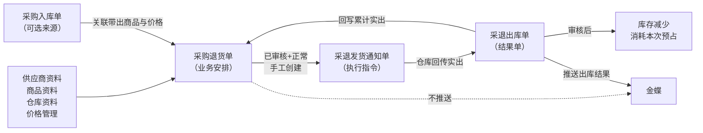
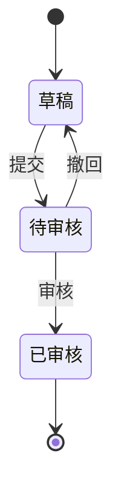
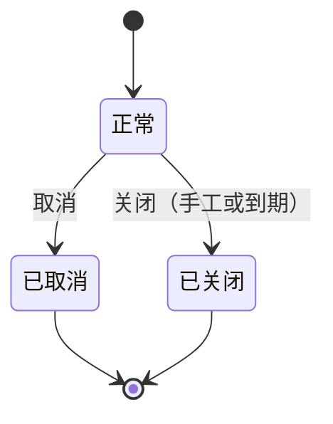

# 采购退货单主PRD

> 用途：定义采购退货单在ERP中的建单、审核、退货截止日期维护、取消关闭及创建采退发货通知等系统行为，作为研发实现和测试验收的依据。
> 定位：应用设计层文档。业务规则以[《采购业务管理需求分析》](../../../../../02-需求调研和分析/02-采购业务管理/采购业务管理需求分析.md)和[《采购业务设计》](../../../../../03-业务分析和设计/01-采购业务设计.md)为准；状态与操作以[《单据与状态流转》](../../../系统架构和流程/03-单据与状态流转.md)第二节（含“采购退货单、销售退货单的差异”段）为准；字段与取值以[《采购退货单（详细稿）》](../../../字段清单合集/采购相关/采购退货单（详细稿）.tsv)为准；页面骨架见[《采购退货单页面骨架》](采购退货单页面骨架.md)；页面交互以[前端Demo版PRD](前端Demo版PRD/)为准，**须服从本文 §6.4状态—功能矩阵**。
> 不写什么：不重复需求论证；不写采退发货通知单、采退出库单内部流程（见后续PRD）；不写金蝶接口报文；不写系统权限与API设计。

| 版本 | 本次变化 | 状态 |
| --- | --- | --- |
| V0.1 | 建立采购退货单主PRD，汇总已确认结论与页面分工 | 初稿，待评审 |
| V0.2 | 取消单据日期字段；一期启用草稿删除与正式列表导入（用户确认） | 初稿，待评审 |
| V0.3 | 全部退足口径确认：不提供关闭入口、不参与到期自动关闭，等待下游回传（Q01，用户确认） | 初稿，待评审 |
| V0.4 | 列表数量列汇总口径确认：合计直出、不按状态置0（Q03，用户确认） | 初稿，待评审 |
| V0.5 | 导入口径注记（Q08）：订单不做正式导入，差异按业务确认 | 初稿，待评审 |
| V0.6 | 有来源建单带出供应商与币别（带出后不可改），来源字段前置到单据信息首行（用户确认） | 初稿，待评审 |
| V0.7 | 退货截止时间改为退货截止日期，按天粒度；字段类型由日期时间改为日期（用户确认） | 初稿，待评审 |

## 1. 文档信息与阅读边界

| 项目 | 内容 |
| --- | --- |
| 读者 | 研发工程师、测试工程师、产品复核 |
| 业务依据 | [《采购业务管理需求分析》](../../../../../02-需求调研和分析/02-采购业务管理/采购业务管理需求分析.md) PUR-FR04、PUR-FR05、PUR-FR06；[《采购业务设计》](../../../../../03-业务分析和设计/01-采购业务设计.md)§4.5、§5.1～5.3、§6.2 |
| 字段依据 | [《采购退货单（详细稿）》](../../../字段清单合集/采购相关/采购退货单（详细稿）.tsv) |
| 状态依据 | [《单据与状态流转》](../../../系统架构和流程/03-单据与状态流转.md)第二节（含“采购退货单、销售退货单的差异”段） |
| 页面依据 | [《采购退货单页面骨架》](采购退货单页面骨架.md)、[前端Demo版PRD](前端Demo版PRD/) |

关联资料：[《价格管理需求分析》](../../../../../02-需求调研和分析/06-价格管理/价格管理需求分析.md)（PRI-FR05、PRI-FR07）、[《01-系统流程与单据交互》](../../../系统架构和流程/01-系统流程与单据交互.md)第2节、[《02-实体对象关系》](../../../系统架构和流程/02-实体对象关系.md)、[《6.强盛ERP的编码规则和通用字段规则》](../../../../../01-全局背景信息/6.强盛ERP的编码规则和通用字段规则.md)第一节（前缀CGTH）与第四节字段模板。

## 2. 需求背景与目标

### 2.1 背景

已入库商品出现不合格或协商退货时，采购员在ERP确认退货商品、数量、供应商与出库仓，提交审核通过后向供应商传递，再按批通知仓库做退货出库。

没有统一的退货单时，退多少、退哪个仓、哪些已实际发出、原入库还能退多少都缺少统一依据，后续通知、出库与库存预占无法衔接。

### 2.2 目标

- 把退货约定固化为可审核、可追溯的单据：一张单一个供应商、一个出库仓（逻辑仓）；
- 支持两类来源：关联原采购入库单带出商品与价格，或无来源手工创建；
- 以明细行为基准追踪累计实出数量、在途通知数量与可下推数量，支持分批退货出库；
- 审核时同时占用原入库可退额度与出库仓可用库存（预占），关闭、取消按规则释放；
- 区分取消（整单不再执行）与关闭（不再新增通知，已有通知继续）；
- 审核状态、业务状态两个字段并列维护，各记各的信息；无第三维收货状态。

已审核后数量、价格、仓库锁定，**仅可调整退货截止日期**；审核通过不会自动生成采退发货通知单。

## 3. 需求范围

### 3.1 本期范围

- 采购退货单列表、新增、编辑、详情；
- 关联原采购入库单（可选）或无来源建单；取价与价格锁定；
- 提交、审核、撤回；草稿删除（草稿+正常且未被下游引用时可物理删除，一期必做）；
- 已审核后调整退货截止日期、手工关闭、到期自动关闭、取消；
- 从已审核+正常+有可下推量创建采退发货通知单的入口（手工，非自动）；
- 页头导出（一期正式，可选已勾选范围）与页头导入（一期正式，四步向导，R15）；
- 审核状态、业务状态两字段并列维护；
- 审核占用可退额度与可用库存预占；关闭、取消释放；采退出库结果回写累计实出与可下推量。

### 3.2 功能清单

| 编号 | 功能/位置 | 本次内容 | 需求来源 |
| --- | --- | --- | --- |
| F01 | 采购退货单列表 | 查询、列展示（含数量进度列）、行操作入口；两状态筛选项多选；勾选配合页头导出；一期批量栏无业务按钮 | PUR-FR04 |
| F02 | 新增/编辑页 | 维护单据信息与商品明细；选来源、取价；草稿保存 | PUR-FR04、PRI-FR05、PRI-FR07 |
| F03 | 提交 | 草稿提交；待审核取消 | PUR-FR04、COM-FR01 |
| F04 | 审核/撤回 | 待审核退货单审核（占额度、占库存）；撤回留意见 | PUR-FR04、COM-FR01 |
| F05 | 详情页 | 分区域展示、关联单据（采退发货通知单与采退出库单）、审核信息、终止信息按状态显示 | PUR-FR04、PUR-FR05 |
| F06 | 已审核操作 | 调整退货截止日期、创建采退发货通知、关闭、取消 | PUR-FR04、PUR-FR05 |
| F07 | Demo Mock | 审核通过后可选生成演示用通知单；仅Demo | 演示需要，非业务规则 |
| F08 | 列表导入 | 页头「导入」四步向导（下载模板→上传文件→校验预览→完成导入），整批校验通过后生成草稿，仍须提交审核 | COM-FR02 |

### 3.3 需求追溯

| 上游场景与需求 | 本PRD功能 | 本PRD验收 |
| --- | --- | --- |
| PUR-FR04：两类来源、取价、额度、分批回补 | F01～F04、F06 | AC01、AC05、AC07、AC08 |
| PUR-FR05：取消与关单、截止时间 | F05、F06 | AC02、AC03、AC06 |
| PUR-FR06：仓库、库存与金蝶衔接 | F06、F05 | AC04 |
| PRI-FR05、PRI-FR07：取价与锁定 | F02 | AC08 |
| COM-FR01：提交与审核权限 | F03、F04 | AC07 |
| COM-FR02、COM-AC02：导入不改变业务审核流程 | F08 | AC14 |

### 3.4 非本期范围

- 系统权限矩阵、API/表结构/并发锁实现；
- 到期自动关单的配置界面（宽限已定为退货截止日期过后T+2自然日，每天北京时间0:00跑批）；
- 发货处理方式（仓库发货／虚拟出库）——写在采退发货通知单上，不在本单维护；
- 采退发货通知单、采退出库单内部流程与金蝶推送细节（见对应PRD）；
- 采购退货变更单；金蝶推送本单（金蝶只接收采退出库单）；
- 全部退足后的关闭入口（**已确认**不提供关闭、仅查看追溯，结果由下游通知与出库单回传，见Q01）。

| 范围补充 | 说明 |
| --- | --- |
| 适用对象 | 成品采购退货；一张退货单一个供应商、一个出库仓（实际选择逻辑仓），不同供应商或不同出库仓须拆单 |
| 与原型差异 | 09原型尚未实现本模块页面，页面与交互以本套PRD为准 |

## 4. 单据定位与业务边界

### 4.1 业务作用

| 项目 | 内容 |
| --- | --- |
| 单据层级 | 第1层——业务安排单，表达向供应商退货的安排与执行依据 |
| 核心职责 | 记录退给谁、退什么、从哪个仓出、退多少及价格，以及退到什么时候 |
| 单据来源 | 人工创建：可关联原采购入库单（可选）或无来源手工填写；一期唯一方式 |
| 下游单据 | 采退发货通知单；已审核+正常+有可下推量时**手工**创建 |
| 数量关系 | 一张退货单对应多张采退发货通知单，支持分批出库；实出结果经通知回写累计实出数量 |
| 业务终结 | 取消或关闭；关闭/取消不可撤销；全部退足不自动关单，保持已审核+正常（S07仅查看，见Q01） |

### 4.2 上下游关系摘要

> 完整流程见[《01-系统流程与单据交互》](../../../系统架构和流程/01-系统流程与单据交互.md)第2节；本文只保留退货单侧交接点。

### 4.3 业务对象关系

| 关系 | 说明 |
| --- | --- |
| 采购退货单 : 供应商 | N:1；一张退货单一个供应商 |
| 采购退货单 : 出库仓库 | N:1；一张退货单一个出库仓库，实际选择逻辑仓 |
| 采购退货单 : 商品明细 | 1:N |
| 采购退货单 : 采购入库单 | N:0..1（可选来源）；一张入库单可被多张退货单分批退货；无来源时没有这层关系 |
| 采购退货单 : 采退发货通知单 | 1:N；分批创建 |
| 商品明细 : 通知单明细 | 1:N；按SKU分行占用与回补 |
| 采退发货通知单 : 采退出库单 | 1:0..1；零出不生成出库单 |
| 采购订单 ↔ 采购退货单 | 无额度关联；退货不恢复原订单可下推量，补货另建订单 |

### 4.4 本单据不负责的事项

- 采购退货单不直接减少库存；库存变化由采退出库单审核后触发；
- 采购退货单不向金蝶推送；金蝶只接收已审核采退出库单；
- 发货处理方式（仓库发货／虚拟出库）写在采退发货通知单上，不写在退货单上；
- 取消或关闭不删除已发生的实际出库；已有实出时不能取消整单，只能关闭余量；
- 超可下推量的安排在通知单侧控制，退货单侧通过可下推量与新建退货单处理余量；
- 退货不恢复原采购入库的可退额度之外的任何原订单额度；要供应商补货，新建采购订单。

## 5. 核心业务场景索引

| 场景ID | 场景 | 类型 | 说明 |
| --- | --- | --- | --- |
| S01 | 关联原入库建单并分批退货 | 主流程 | 关联原采购入库单带出商品与价格→提交→审核占用额度与预占→多次创建采退发货通知→实出回写→可下推量按公式变化 |
| S02 | 无来源退货 | 主流程 | 不关联原入库手工建单；每行退货数量>0、不套原入库额度；审核仍占用可用库存 |
| S03 | 撤回后重提 | 支线 | 待审核→撤回→草稿（保留撤回意见）→修改→重新提交 |
| S04 | 手工关闭余量 | 主流程 | 已审核+正常且未全部退足时→关闭；不可反关单；已有通知继续执行，不再新增通知；释放尚未安排部分的预占 |
| S05 | 取消整单 | 支线 | 无实出且无阻挡通知时可取消；待推送/推送失败通知随单取消；推送中/待发货/取消中须先处理并取得仓库确认；已有实出只能关闭余量 |
| S06 | 到期自动关单 | 支线 | 未全部退足的单在退货截止日期过后T+2自然日当天0:00跑批关闭；关闭方式=到期自动关闭，关闭原因与关闭操作人留空；全部退足的单不参与（R13） |
| S07 | 全部退足履约完结 | 主流程/展示 | 累计实出=退货数量；无可下推量；仅查看追溯，不提供下推、取消、关闭、调整截止时间（R13，Q01） |

## 6. 状态与操作

状态定义owner：[《单据与状态流转》](../../../系统架构和流程/03-单据与状态流转.md)第二节（含“采购退货单、销售退货单的差异”段）。采购退货单只有**审核状态与业务状态两个维度**，无第三维收货状态；全部退足是数量事实，不新增状态字段。审核链无「已驳回」态，待审核不同意时操作为**撤回**（回到草稿），不叫驳回；见该文「审核操作怎么叫」。取消、关闭保留原审核状态，不把已审核退货单撤回为草稿。

### 6.1 状态维度

| 维度 | 取值 | 说明 |
| --- | --- | --- |
| 审核状态 | 草稿、待审核、已审核 | 控制编辑、审核及能否创建采退发货通知 |
| 业务状态 | 正常、已取消、已关闭 | 控制是否继续办理 |

「正常」表示未取消且未关闭，与是否已经退足无关；可出现「已审核+正常+全部退足」（S07）。

### 6.2 状态取值说明

| 状态 | 含义 | 是否终态 |
| --- | --- | --- |
| 草稿 | 尚未提交或撤回后待修改 | 否 |
| 待审核 | 已提交，等待审核 | 否 |
| 已审核 | 审核通过，占额度与预占，可安排退货 | 否（业务状态仍可变） |
| 正常 | 可继续办理 | 否 |
| 已取消 | 整单不再执行 | 是（业务维度） |
| 已关闭 | 不再新增通知 | 是（业务维度） |

### 6.3 状态流转图

**审核状态**：

**业务状态**：

无收货状态维度；全部退足不触发状态变化，按R13收敛为仅查看。

### 6.4 状态—功能矩阵

> ✅ = 允许；❌ = 不允许；✅（条件）= 须满足对应规则。F01查询/查看各状态均可用，不重复列出。

| 动作 | 草稿+正常 | 待审核+正常 | 已审核+正常 | 已审核+已关闭 | 已审核+已取消 | 草稿/待审核+已取消 |
| --- | --- | --- | --- | --- | --- | --- |
| 编辑（F02） | ✅ | ❌ | ❌ | ❌ | ❌ | ❌ |
| 提交（F03） | ✅ | ❌ | ❌ | ❌ | ❌ | ❌ |
| 取消（待审核，F03） | ❌ | ✅ | ❌ | ❌ | ❌ | ❌ |
| 审核（F04） | ❌ | ✅ | ❌ | ❌ | ❌ | ❌ |
| 撤回（F04） | ❌ | ✅ | ❌ | ❌ | ❌ | ❌ |
| 调整截止时间（F06） | ❌ | ❌ | ✅（R09、R13） | ❌ | ❌ | ❌ |
| 创建采退发货通知（F06） | ❌ | ❌ | ✅（R08） | ❌ | ❌ | ❌ |
| 关闭（F06） | ❌ | ❌ | ✅（R12、R13） | ❌ | ❌ | ❌ |
| 取消（已审核，F06） | ❌ | ❌ | ✅（R11） | ❌ | ❌ | ❌ |
| 删除草稿（R14） | ✅（条件） | ❌ | ❌ | ❌ | ❌ | ❌ |
| Demo Mock（F07） | ❌ | ❌ | ✅（Demo） | ❌ | ❌ | ❌ |
| 详情/追溯（F05） | ✅ | ✅ | ✅ | ✅ | ✅ | ✅ |

已取消、已关闭：仅查看与追溯，不显示编辑、提交、审核、创建通知、反关单。

列表与详情行内操作按状态互斥展示：草稿提供编辑、提交、删除（删除见R14）；待审核提供审核、撤回、取消；已审核+正常时取消与关闭可同时出现（取消须满足R11，关闭与调整截止时间须满足R13，创建采退发货通知须满足R08）。**全部退足**（累计实出=退货数量，S07/R13）：仅查看，不提供下推、取消、关闭、调整截止时间。列表批量操作栏一期仅展示已选中计数与列设置，不提供批量操作；**导入、导出**在页头：导入为一期正式能力（四步向导见R15），导出可选已勾选范围。

### 6.5 状态流转表

| 当前状态 | 动作 | 前置条件 | 结果状态 | 二次确认 | 后置影响 | 失败处理 |
| --- | --- | --- | --- | --- | --- | --- |
| 草稿+正常 | 保存 | 明细已填则每行退货数量>0；有来源行不超剩余可退额度 | 草稿+正常 | 无 | 分配单号（R01） | 校验失败定位字段/行 |
| 草稿+正常 | 提交 | R10提交校验 | 待审核+正常 | 见Demo PRD | 价格、税率锁定（R09） | 阻断并提示 |
| 草稿+正常 | 删除 | R14；未被下游引用 | 物理删除 | 二次确认 | 记录消失 | 被引用或非草稿时阻断 |
| 待审核+正常 | 审核 | 审核人操作；出库仓可用库存充足（R07）；有来源时额度仍足（R03） | 已审核+正常 | 二次确认 | 占用可用库存预占与原入库可退额度；数量、价格、仓库不可再改 | 库存或额度不足时阻断 |
| 待审核+正常 | 撤回 | 必填撤回意见 | 草稿+正常 | 无 | 保留撤回意见 | — |
| 待审核+正常 | 取消 | 无 | 原审核+已取消 | 必填取消原因 | 终止审核流程；记录取消信息 | — |
| 已审核+正常 | 调整截止时间 | 未全部退足（R09、R13） | 已审核+正常 | 见Demo PRD | 仅更新退货截止日期 | 全部退足时阻断 |
| 已审核+正常 | 创建采退发货通知 | 有可下推数量（R08） | 已审核+正常 | 通知PRD | 占用可下推量（计入在途通知数量） | 无量时阻断 |
| 已审核+正常 | 手工关闭 | 未全部退足（R12、R13） | 已审核+已关闭 | 必填关闭原因 | 关闭方式=手动关闭；记录关闭时间、关闭操作人；释放尚未安排部分的预占；不可新增通知，已有通知继续 | 全部退足时阻断；不可撤销 |
| —（定时任务） | 到期自动关闭 | 退货截止日期过后T+2自然日，当天0:00跑批且未全部退足（R12、R13） | 已审核+已关闭 | 无 | 关闭方式=到期自动关闭；关闭原因与关闭操作人留空；释放尚未安排部分的预占 | 已关闭单不重复处理 |
| 已审核+正常 | 取消 | 无实出且无阻挡通知（R11） | 已审核+已取消 | 必填取消原因 | 待推送/推送失败通知随单取消；释放未执行预占；记录取消信息 | 条件不满足时阻断 |
| 已审核+正常 | 出库回写 | 采退出库单审核通过 | 累计实出更新、可下推量重算 | 自动 | 消耗本次预占；缺出回补可下推量；全部退足后按R13仅查看 | — |
| 任意+已关闭/已取消 | 查看 | — | 不变 | — | — | — |

## 7. 核心业务规则

### 7.1 创建与提交规则

| 规则编号 | 主题 | 规则 | 边界或例外 |
| --- | --- | --- | --- |
| R01 | 单号 | 按[《6.强盛ERP的编码规则和通用字段规则》](../../../../../01-全局背景信息/6.强盛ERP的编码规则和通用字段规则.md)第一节自动生成，前缀CGTH；保存草稿时分配 | 用户不可编辑 |
| R02 | 供应商与出库仓库 | 只能选择审核通过且启用的成品供应商、审核通过且启用的逻辑仓；一张退货单一个供应商、一个出库仓；**有来源时供应商由原入库单带出、不可另选，出库仓库仍需自行选择**（供应商只随来源带出，不随退货单自由指定） | 不同供应商或不同出库仓须拆单 |
| R03 | 来源与可退额度 | 有来源：关联原采购入库单带出商品、数量与价格，关联行累计退货≤该入库单实际入库数量；审核占用原入库可退额度，草稿不占，其他已审核、办理中的退货也计入。无来源：不套原入库额度，每行退货数量>0 | 取消或关闭释放未退且无通知继续执行的额度；已实际退回部分仍计入累计退货（PUR-FR04、PUR-AC14） |
| R04 | 取价 | 优先带出原入库含税价格与税率；缺价或无来源时可手工填写，也可查当前采购价快速填入（一并带税率）；草稿可改，提交后价格税率锁定 | 零价提交需确认；空价或负价阻断（PRI-FR05、PRI-FR07） |
| R05 | 价税与金额 | 行价税合计=退货数量×含税单价；行金额=退货数量×不含税单价；行税额=价税合计−金额；单头价税合计、税额、金额分别汇总明细对应字段 | 单价4位小数，金额和税额2位小数；行内差额计入税额；税率允许0%，此时税额为0、价税合计等于金额；页面按千分位展示，录入不带千分位 |
| R10 | 提交校验 | 在保存草稿校验基础上：每行含税单价非空、税率已选；零价须确认；按R04执行价格校验；有来源时复核剩余可退额度（含其他已审核、办理中的退货） | 单头必填与明细数量校验见§7.7「保存草稿」行；校验失败阻断并定位到字段或明细行 |
| R15 | 列表导入 | 页头「导入」打开四步向导（①下载模板→②上传文件→③校验预览→④完成导入）；模板按「单据序号」归并为一张退货单，同组单头字段必须一致，不一致报错；校验按保存草稿口径：单头必填（供应商、币别、出库仓库、退货截止日期）、每行商品存在且退货数量>0、价格非空非负（来源单号合法且模板价格留空时按原入库价带入）、供应商审核通过且启用、来源单号须为已审核采购入库单、有来源不超剩余可退额度；**任一行失败则整批不导入**，返回逐行错误原因并可下载错误说明；成功生成N张草稿（草稿+正常，单号按CGTH分配），仍须提交审核；导入草稿与手工草稿完全同权（可编辑、可提交、可删除，删除见R14） | 不设单次导入行数硬上限，不写具体数字；零价在草稿级允许，提交时再按R04确认；无来源退货来源单号留空；模板列与向导文案见Demo列表页 §7、弹窗PRD §5（COM-FR02、COM-AC02） |

数量示例（标明为示例）：SKU-A计划退100件，创建通知60件、该通知实出50件并结束且无其他未结束通知时，累计实出50、可下推量=100−50−0=50件。

### 7.2 审核与字段锁定规则

| 规则编号 | 主题 | 规则 | 边界或例外 |
| --- | --- | --- | --- |
| R06 | 两状态 | 审核状态、业务状态并列维护，各记各的信息；无第三维收货状态 | 全部退足不自动关单；已审核+已关闭可同时存在 |
| R07 | 审核占用 | 审核时占用出库仓可用库存（预占），有来源同时占用原入库可退额度；草稿不占 | 可用库存不足不能审核；额度不足不能审核 |
| R09 | 编辑范围 | 草稿可改；待审核不可改单，只可审核/撤回/取消；已审核后数量、价格、仓库均不可改，**仅可调整退货截止日期** | 撤回回草稿后可再改；不做变更单（PUR-AC15） |
| — | 审核记录 | 审核/撤回须记录审核人、审核时间；撤回意见保留 | 允许有权限用户提交并审核自己创建的单据（COM-FR01） |

### 7.3 执行与数量回写规则

| 规则编号 | 主题 | 规则 | 边界或例外 |
| --- | --- | --- | --- |
| R08 | 可下推数量 | 退货数量−已结束通知实出−未结束通知通知量；不同SKU不互抵；通知创建即占用；关闭后保留数值，但不再具备新增通知的资格 | 见PUR-FR04与《单据与状态流转》第六节 |
| — | 累计实出数量 | 由已审核采退出库单按来源行回写；不小于0，累计不超过退货数量 | 单头列表列为各明细行合计 |
| — | 在途通知数量 | 未结束采退发货通知占用的数量；创建即计入，取消成功释放，出库完成后被实际数量替代 | 推送失败、待发货、取消中仍计入 |
| — | 缺出回补 | 通知结束时以实出替代占用，少出部分回补可下推量；实出=0按零出取消，不生成采退出库单 | 不回原通知补出，补出另建通知（通知PRD） |
| — | 预占消耗与释放 | 实际出库消耗本次预占；关闭释放尚未安排部分的预占；取消释放未执行预占 | 关闭不撤销已有执行（PUR-AC11） |

### 7.4 价格与金额规则

见R04、R05及PRI-FR05、PRI-FR07：草稿改价、零价确认、空价负价阻断、提交后价格税率锁定、查询当前采购价一并带入税率，均按价格管理执行；已保存的价格不随之后的调价变化。

### 7.5 取消、关闭与删除规则

| 规则编号 | 主题 | 规则 | 边界或例外 |
| --- | --- | --- | --- |
| R11 | 取消 | 无实际出库且没有仍需执行的通知时可取消整单；待推送、推送失败的通知随退货单一起取消；存在推送中、待发货、取消中的通知时不能直接取消，先处理通知并取得仓库确认 | 已有实出不能取消整单，只能关闭余量；取消释放未执行预占，涉及已推送部分以仓库取消成功为准，不提前释放；不可撤销，保留原审核状态与实际出库记录（PUR-AC11） |
| R12 | 关闭 | 已审核+正常且未全部退足时可手工关闭（关闭原因必填，记录关闭方式=手动关闭、关闭时间、关闭操作人）；退货截止日期过后T+2自然日自动关闭，不跳过周末，每天北京时间0:00跑批，关闭发生在「退货截止日期＋2个自然日」当天0:00（关闭方式=到期自动关闭，关闭原因与关闭操作人留空） | 关闭释放尚未安排部分的预占；已有通知继续执行到底；不可反关单、不可撤销；全部退足后不可关闭（R13）；后续退货另建退货单（PUR-FR05、PUR-AC06） |
| R13 | 履约完结 | 累计实出=退货数量时视为本单退货安排已全部执行；保持已审核+正常，不自动关单 | 不提供下推、取消、关闭、调整截止时间，仅查看追溯；**已确认**（2026-09-22，见Q01）：不提供关闭入口，等待下游通知与采退出库单回传结果 |
| R14 | 删除 | 仅草稿+正常且未被采退发货通知单等下游引用时可物理删除；一期必做 | 已提交、已审核或被引用不可删；删除不可恢复 |

| 维度 | 取消 | 关闭 |
| --- | --- | --- |
| 含义 | 整单不再执行 | 不再新增通知，已有通知继续执行 |
| 典型状态 | 待审核/已审核+正常（条件） | 已审核+正常 |
| 可撤销 | 否 | 否 |
| 对已有实出 | 不允许（须关余量） | 不删除已发生实出 |

### 7.6 业务生效点

| 业务动作 | 采购退货单影响 | 库存影响 | 业财/外部影响 |
| --- | --- | --- | --- |
| 创建/保存草稿 | 产生草稿，不占额度不占库存 | 无 | 无 |
| 审核通过 | 占用可退额度与可用库存预占；字段锁定 | 无（仅预占） | 无 |
| 创建采退发货通知 | 占用可下推量 | 无 | 仓库收货类路径由系统自动推送仓库 |
| 采退出库单审核回写 | 更新累计实出、可下推量 | 减少库存、消耗预占 | 金蝶推采退出库单，不推本单 |
| 关闭 | 业务状态→已关闭 | 释放尚未安排部分预占 | 无 |
| 取消 | 业务状态→已取消 | 释放未执行预占 | 无 |

### 7.7 字段校验绑定

完整字段见TSV。摘要：

| 校验时机 | 要求 |
| --- | --- |
| 保存草稿 | 单头必填完整（供应商、币别、出库仓库、退货截止日期）；明细至少一行；已填行退货数量>0；有来源行不超剩余可退额度；允许单价为空，不执行R04提交级价格阻断 |
| 提交 | 在保存基础上：每行含税单价非空、税率已选；零价确认；R04价格校验；有来源额度复核（含其他办理中退货） |

页面控件、错误文案与零价二次确认见Demo PRD弹窗章节。

## 8. 功能需求说明（页面索引）

| 编号 | 页面/位置 | 规则与状态依据 | Demo PRD |
| --- | --- | --- | --- |
| F01 | 列表 | §6.4；R03、R08、R11～R14 | [列表页](前端Demo版PRD/采购退货单前端Demo版PRD_列表页.md) |
| F02 | 新增/编辑 | R01～R05、R09、R10；草稿+正常 | [新增编辑页](前端Demo版PRD/采购退货单前端Demo版PRD_新增编辑页.md) |
| F03 | 提交/待审取消 | R04、R10；§6.5 | [弹窗与Mock](前端Demo版PRD/采购退货单前端Demo版PRD_弹窗与Mock.md) §2、§3.5 |
| F04 | 审核/撤回 | R07、R09；§6.5 | 弹窗PRD §3.1、§3.2 |
| F05 | 详情 | R06、R09、R11、R12、R14；§6.4 | [详情页](前端Demo版PRD/采购退货单前端Demo版PRD_详情页.md) |
| F06 | 截止时间/下推/关单/取消 | R08、R11～R13；§6.4 | 列表/详情行操作 + 弹窗PRD §3.3～§3.5 |
| F07 | Demo Mock | 非正式验收 | 弹窗PRD §4 |
| F08 | 列表导入 | R15、COM-FR02；§6.4 | [列表页](前端Demo版PRD/采购退货单前端Demo版PRD_列表页.md) §7、弹窗PRD §5 |

## 9. 上下游影响与协同

| 关联模块/系统 | 需要配合的变化 | 交接内容与时机 | 验收结果 |
| --- | --- | --- | --- |
| 供应商资料 | 引用审核通过且启用的供应商 | 建单选供应商 | 禁用/未审核不可选 |
| 商品资料 | 引用启用成品SKU | 明细选商品 | 有来源时由原入库明细带出 |
| 仓库资料 | 引用审核通过且启用的逻辑仓 | 建单选出库仓库 | 出库按所选逻辑仓记账 |
| 价格管理 | 缺价/无来源查当前采购价 | 明细取价 | 一并带税率；提交后锁定 |
| 采购入库单 | 可选来源与可退额度 | 关联带出商品与价格 | 累计退货不超原实收；草稿不占额度 |
| 采退发货通知单 | 下推来源与占用回补 | 已审核+正常+有可下推量时创建；创建/取消/实出后更新可下推量与在途通知数量 | 数量与[《采退发货通知单主PRD》](../采退发货通知单/采退发货通知单主PRD.md)口径一致 |
| 采退出库单 | 回写累计实出、消耗预占 | 结果单审核通过 | 回写不重复计入 |
| 库存 | 审核预占、出库消耗、关单取消释放 | 审核、回传、终止 | 可用库存不足不能审核 |
| 金蝶 | 不推送退货单 | — | 只推已审核采退出库单 |

## 10. 关联文档与阅读入口

| 关联内容 | 阅读入口 | 本PRD与其边界 |
| --- | --- | --- |
| 退货业务流程 | [《01-系统流程与单据交互》](../../../系统架构和流程/01-系统流程与单据交互.md)第2节 | 完整角色接力；本文只写退货单侧交接 |
| 退货规则论证 | [《采购业务管理需求分析》](../../../../../02-需求调研和分析/02-采购业务管理/采购业务管理需求分析.md) PUR-FR04～PUR-FR06 | 结论来源；本文不重复论证 |
| 退货流程与数量 | [《采购业务设计》](../../../../../03-业务分析和设计/01-采购业务设计.md)§4.5、§5.3、§6.2 | 走查与数量口径来源 |
| 状态与操作 | [《单据与状态流转》](../../../系统架构和流程/03-单据与状态流转.md)第二节 | 状态owner；本文矩阵与Demo须一致 |
| 对象关系 | [《02-实体对象关系》](../../../系统架构和流程/02-实体对象关系.md) | 实体级关系；本文 §4.3为业务摘要 |
| 字段定义 | [《采购退货单（详细稿）》](../../../字段清单合集/采购相关/采购退货单（详细稿）.tsv) | TSV为字段owner，不得改动 |
| 页面结构 | [《采购退货单页面骨架》](采购退货单页面骨架.md) | 区域与线框走查，非规则权威 |
| 页面交互 | [前端Demo版PRD](前端Demo版PRD/) | 控件、文案、Mock；服从 §6.4 |
| 原采购入库 | [《采购入库单主PRD》](../../2-采购管理/采购入库单/采购入库单主PRD.md) | 来源单据与原入库明细不在本文维护 |
| 下游通知 | [《采退发货通知单主PRD》](../采退发货通知单/采退发货通知单主PRD.md) | 下推创建、推送、处理方式见通知PRD |
| 下游出库 | [《采退出库单主PRD》](../采退出库单/采退出库单主PRD.md) | 实出生成、回写与金蝶推送见结果单PRD |

## 11. 异常与一致性

### 11.1 并发操作

| 场景 | 业务处理结果 |
| --- | --- |
| 两人同时编辑同一草稿 | 后提交者不得覆盖先提交结果；失败并提示刷新 |
| 两人同时审核同一待审单 | 只允许一个成功；另一个提示状态已变化 |
| 两人同时对同一退货单下推 | 各自校验可下推量；后创建者若额度不足则阻断 |
| 下推同时退货单被关闭/取消 | 关闭、取消成功后不可再下推；进行中的下推校验失败并提示 |

### 11.2 幂等与重复处理

| 操作 | 幂等规则 |
| --- | --- |
| 采退出库回写 | 同一出库结果不得重复计入累计实出数量、不得重复消耗预占 |
| 到期自动关单 | 跑批重复触发只保持已关闭一致结果，不重复释放预占 |
| 取消随单通知 | 退货单取消时待推送/推送失败通知只随单取消一次 |

### 11.3 与下游单据一致性

| 场景 | 处理方式 |
| --- | --- |
| 关闭后 | 不可新增通知；已有通知继续执行至结束 |
| 取消时存在推送中/待发货/取消中通知 | 阻断取消，须先处理通知并取得仓库确认 |
| 通知取消成功 | 退货单仍开放→回补可下推量；退货单已关闭→不恢复下推资格（见[《采退发货通知单主PRD》](../采退发货通知单/采退发货通知单主PRD.md)） |
| 关闭/取消后迟到实出回传 | 按真实结果回写累计实出与预占，不以终止覆盖已发生事实 |
| 退货与原采购订单 | 退货不恢复原采购订单可下推量；补货另建采购订单 |

## 12. 验收标准与待确认事项

### 12.1 验收标准

| 编号 | 对应功能/规则 | 条件与操作 | 预期结果 |
| --- | --- | --- | --- |
| AC01 | F02～F04/R03、R04、R07 | 分别创建关联入库、来源缺价和无来源退货；审核后计划退100件，安排60件、实出50件并结束 | 关联方式优先带出原入库价格；缺价可查询当前价或手填且草稿可改；提交后价格税率锁定；结束后可下推50件；无来源每行>0、不套原入库额度；可用库存不足不能审核（PUR-AC05） |
| AC02 | F06/R12 | 退货单手工关闭或达到截止时间后T+2自然日，有已生成通知单 | 不可反关单或新增通知单；已有通知单继续出库回传；后续退货新建退货单（PUR-AC06） |
| AC03 | F06/R11、R12 | 分别测试无实出且无阻挡通知、已推送通知、已有实出三种终止场景 | 无实出无阻挡可取消并释放未执行预占；已推送通知须先取得仓库取消成功；已有实出不能整单取消只能关闭余量；关闭不撤销已有执行，结束后释放少出部分预占（PUR-AC11） |
| AC04 | F06/R08 | 已审核退货单可下推60件，创建采退发货通知并选虚拟出库，通知数量60 | 退货单侧可下推量由60变为0、在途通知+60；随后累计实出回写60、可下推0；不推仓库、生成已审核采退出库单60件、库存减少并消耗预占（通知与结果单行为见对应PRD；PUR-AC13） |
| AC05 | F02、F06/R03 | 原入库100，审核退60，实出50后关闭且无未结束通知，再建关联同一原入库的退货单 | 草稿不占可退额度、审核占用；原单结束后剩余可退额度回补，新单可再退50且累计不超原实收（PUR-AC14） |
| AC06 | F06/R09 | 已审核退货单改截止时间，并尝试改数量、仓库、价格 | 截止时间可改；数量、仓库、价格不可改（PUR-AC15） |
| AC07 | F01～F04/R01、R09 | 创建退货单并走通提交、审核、撤回重提 | 单号按CGTH规则生成；两状态字段正确；撤回回草稿保留撤回意见；有权限用户可提交并审核自己创建的单据（COM-FR01） |
| AC08 | F02/R04、R05 | 有来源带价、缺价、无来源；零价、空价、负价；税率0% | 原入库价带出；缺价手填或查当前价并带税率；零价需确认；空价负价阻断；税率0%时税额为0、价税合计等于金额；提交后价格税率锁定 |
| AC09 | F05 | 查看已审核、已关闭、已取消退货单 | 关联单据（采退发货通知单、采退出库单）已审核时分组展示；终止信息、审核信息按状态显示；数量列示例口径正确（退100、安排60、实出50结束→可下推50） |
| AC10 | F01 | 列表筛选与排序 | 审核状态、业务状态多选OR匹配；列与TSV一致；默认按创建时间倒序，创建时间支持日期范围筛选；页头提供导入与导出 |
| AC11 | F06/S07/R13 | 全部退足（累计实出=退货数量）的已审核退货单打开列表行与详情页头 | 无可下推量；不显示下推、取消、关闭、调整截止时间入口；仅查看追溯（Q01口径） |
| AC12 | F07 | Demo Mock生成演示通知 | 仅Demo可用；正式验收不以自动生成为准 |
| AC13 | F02、列表行操作/R14 | 创建草稿→打开删除确认→确认删除；再分别对被下游引用的草稿与非草稿单执行删除 | 删除成功后记录从列表消失；被引用或非草稿删除被阻断并提示，状态不变 |
| AC14 | F08/R15 | 页头「导入」上传模板文件：先传全通过的文件，再传含一行非法数据的文件 | 全通过时生成N张草稿（草稿+正常，单号按CGTH分配）并提示“成功导入N张退货单草稿，请逐单检查后提交审核”；导入成功后仍为草稿、需提交审核（COM-FR02、COM-AC02）；任一行失败则整批不导入，返回逐行错误原因并可下载错误说明 |

### 12.2 待确认事项

| 编号 | 问题 | 影响范围 | 状态/结论 |
| --- | --- | --- | --- |
| Q01 | 全部退足（累计实出=退货数量）后是否提供关闭入口 | R13、F06、S07 | **已确认**（2026-09-22）：全部退足后不提供关闭入口（含到期自动关闭跳过），保持已审核+正常，仅查看追溯；下游通知单与采退出库单按各自规则执行并回传结果（用户确认） |
| Q02 | 草稿删除是否提供 | F02、列表行操作 | **已确认**（2026-09-22）：一期提供草稿删除，镜像采购订单R11口径（用户确认） |
| Q03 | 列表数量列汇总口径 | F01 | **已确认**（2026-09-22）：列表按各明细行合计展示（不同SKU直接相加），草稿、已关闭同样展示真实值、不按状态置0；与TSV“关闭后保留数值”一致，不补单头汇总字段（用户确认） |
| Q04 | 单据日期字段 | F02、列表 | **已确认**（2026-09-22）：取消单据日期字段，时间口径用创建时间（用户确认） |
| Q05 | 到期自动关单宽限参数 | R12、定时任务 | **已确认**：退货截止日期过后T+2自然日；每天北京时间0:00跑批，不跳过周末 |
| Q06 | 价税合计、税额、金额精度与尾差 | R05 | **已确认**：单价4位、金额和税额2位，尾差进税额；税率允许0%；页面按千分位展示，录入不带 |
| Q07 | 列表默认排序字段 | F01 | **已确认**：创建时间倒序 |
| Q08 | 列表是否提供导入 | 列表页头 | **已确认**（2026-09-22）：一期提供正式列表导入，镜像方案见R15（用户确认）；采购订单/销售订单不做正式导入（见其PRD），差异按业务确认 |
