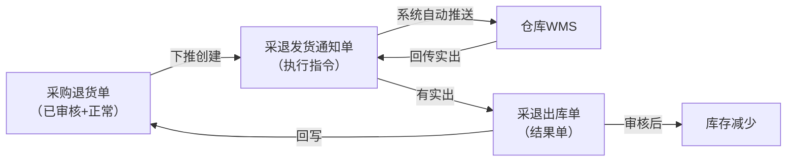
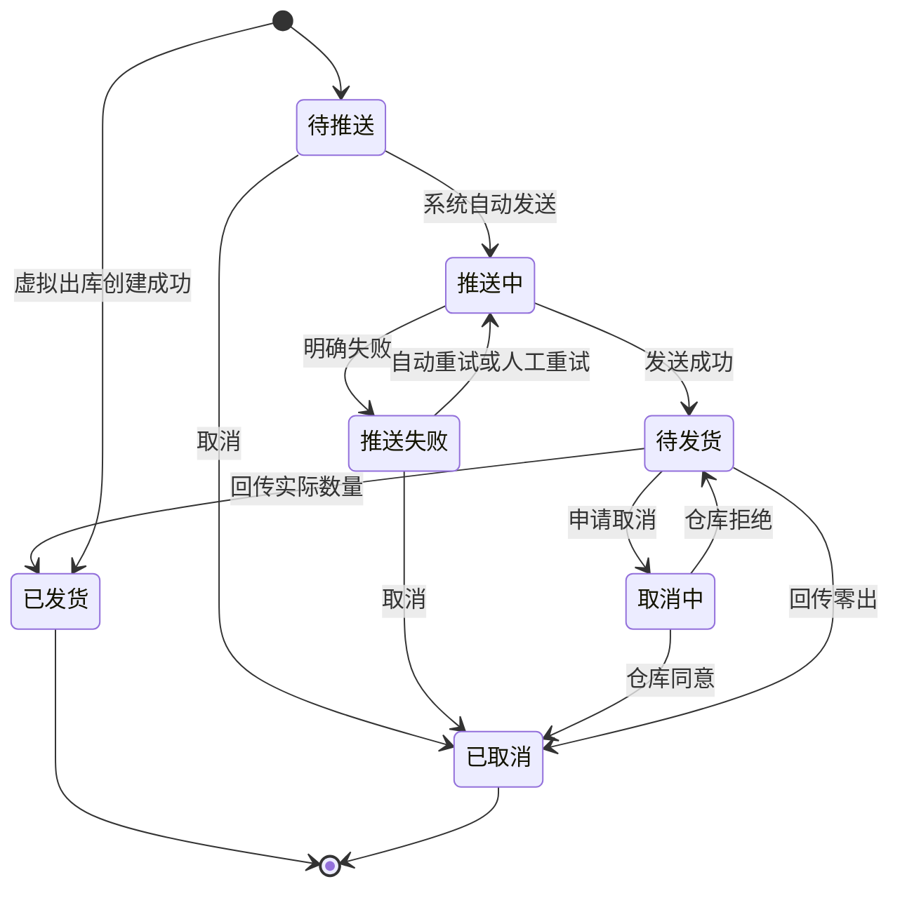

# 采退发货通知单主PRD

> 用途：定义采退发货通知单在ERP中的创建、仓库发货或虚拟出库、取消、发货回写及与采购退货单的数量衔接，作为研发实现和测试验收的依据。
> 定位：应用设计层文档。业务规则以[《采购业务管理需求分析》](../../../../../02-需求调研和分析/02-采购业务管理/采购业务管理需求分析.md)和[《采购业务设计》](../../../../../03-业务分析和设计/01-采购业务设计.md)为准；状态与操作以[《单据与状态流转》](../../../系统架构和流程/03-单据与状态流转.md)第三节为准；字段与取值以[《采退发货通知单（详细稿）》](../../../字段清单合集/采购相关/采退发货通知单（详细稿）.tsv)为准；页面骨架见[《采退发货通知单页面骨架》](采退发货通知单页面骨架.md)；页面交互以[前端Demo版PRD](前端Demo版PRD/)为准，**须服从本文 §6.4 状态—功能矩阵**。
> 不写什么：不重复需求论证；不写采退出库单内部流程与推送财务ERP细节（见下游PRD）；不写仓库WMS作业细节与接口报文；不写系统权限与API设计。

| 版本 | 本次变化 | 状态 |
| --- | --- | --- |
| V0.1 | 建立采退发货通知单主PRD，汇总已确认结论与页面分工 | 初稿，待评审 |
| V0.2 | 列表补供应商列与商品编码/条码筛选，明细单列商品编码；Q05～Q07确认（用户确认） | 初稿，待评审 |

## 1. 文档信息与阅读边界

| 项目 | 内容 |
| --- | --- |
| 读者 | 研发工程师、测试工程师、产品复核 |
| 业务依据 | [《采购业务管理需求分析》](../../../../../02-需求调研和分析/02-采购业务管理/采购业务管理需求分析.md) PUR-FR04、PUR-FR06、PUR-AC13；[《采购业务设计》](../../../../../03-业务分析和设计/01-采购业务设计.md)§4.5、§5.1～§5.3 |
| 字段依据 | [《采退发货通知单（详细稿）》](../../../字段清单合集/采购相关/采退发货通知单（详细稿）.tsv) |
| 状态依据 | [《单据与状态流转》](../../../系统架构和流程/03-单据与状态流转.md)第三节 |
| 页面依据 | [《采退发货通知单页面骨架》](采退发货通知单页面骨架.md)、[前端Demo版PRD](前端Demo版PRD/) |

关联资料：[《采购退货单主PRD》](../采购退货单/采购退货单主PRD.md)、[《采退出库单主PRD》](../采退出库单/采退出库单主PRD.md)、[《01-系统流程与单据交互》](../../../系统架构和流程/01-系统流程与单据交互.md)第2节、[《02-实体对象关系》](../../../系统架构和流程/02-实体对象关系.md)、[《6.强盛ERP的编码规则和通用字段规则》](../../../../../01-全局背景信息/6.强盛ERP的编码规则和通用字段规则.md)第一节（前缀CTFHTZ）、[《00-系统与模块地图》](../../../系统架构和流程/00-系统与模块地图.md)（菜单入口：采购管理-采退发货通知单）。

## 2. 需求背景与目标

### 2.1 背景

采购退货单审核通过后，采购员向供应商传递退货安排，并按供应商与仓库的反馈安排本次退货出库。采退发货通知单把「本次要退多少、从哪个仓发出」交给仓库执行，是退货约定与实际出库之间的执行指令。

没有统一的通知单时，仓库不知道本次应退数量，采购也难以追踪在途安排与实出差异。

### 2.2 目标

- 从已审核、业务状态正常的采购退货单下推创建通知单，录入本次通知数量，选择发货处理方式（默认仓库发货）；
- 仓库发货：创建后由系统自动推送仓库，不需要人工再点推送；
- 虚拟出库：不推仓库，创建成功后实出等于通知数量，通知变为已发货，系统立即生成已审核采退出库单；
- 通知创建即占用退货单可下推量；取消成功或发货完成后按规则释放或替代占用；
- 一张通知单只执行一次出库，仓库路径缺量通过展示呈现，补出另建通知单；虚拟出库不允许缺量或零出；
- 仓库回传实出后更新通知状态并触发采退出库单生成；虚拟出库在创建时生成（出库PRD定义）。

通知单不增减库存，也不直接向推送财务ERP；库存与业财影响由采退出库单承担。

## 3. 需求范围

### 3.1 本期范围

- 采退发货通知单列表、详情；
- 从采购退货单下推创建（录入通知数量、发货处理方式与备注）；
- 待推送、推送失败时编辑备注（推送成功后不可改）；
- 待推送/推送失败时取消；待发货时取消（进入取消中等待仓库回执）；
- 推送失败时先自动重试最多3次，仍失败可人工重试；
- 单据状态单字段维护（待推送→推送中→待发货／推送失败→已发货／已取消／取消中）；
- 与采购退货单可下推量、在途通知数量的联动。

### 3.2 功能清单

| 编号 | 功能/位置 | 本次内容 | 需求来源 |
| --- | --- | --- | --- |
| F01 | 通知单列表 | 查询（单号、来源采购退货单、供应商、出库仓库、发货处理方式、单据状态、商品编码、商品条码、创建时间）、列展示（含供应商列）、进入详情；单据状态多选筛选；勾选配合页头导出；一期批量栏无业务按钮 | PUR-FR04 |
| F02 | 下推创建页 | 从采购退货单带入单头与明细，录入通知数量、发货处理方式与备注；仓库发货则创建并触发自动推送，虚拟出库则创建后直接已发货并生成采退出库单 | PUR-FR04 |
| F03 | 编辑备注 | 待推送、推送失败时可改备注；推送成功后（含待发货）不可改；通知数量创建后不可改 | PUR-FR04 |
| F04 | 详情页 | 分区域展示推送与发货结果、终止信息按状态显示 | PUR-FR04、PUR-FR06 |
| F05 | 取消 | 待推送、推送失败时直接取消并释放占用 | PUR-FR04 |
| F06 | 取消（待发货） | 待发货时点「取消」，向仓库发起取消并进入取消中；界面上与 F05 同称「取消」 | PUR-FR04 |
| F07 | 重试推送 | 自动重试满3次仍失败后，由操作人重试，回到推送中 | PUR-FR06 |
| F08 | Demo Mock | 模拟仓库出库回传、推送状态变化；仅Demo | 演示需要，非业务规则 |

### 3.3 需求追溯

| 上游场景与需求 | 本 PRD 功能 | 本 PRD 验收 |
| --- | --- | --- |
| PUR-FR04：下推、占用、分批、零出、虚拟出库、处理方式写在通知单 | F02、F03、F04、F05、F06 | AC01、AC02、AC03、AC05、AC07、AC11 |
| PUR-FR06：推送仓库、回写衔接、财务ERP只接结果单 | F04、F07 | AC04、AC12 |
| PUR-AC13：虚拟出库60件 | F02、F04 | AC11 |

### 3.4 非本期范围

- 列表页「新增」入口（通知单只能从采购退货单下推创建）；
- 通知单导入；
- 往已结束通知单补出、修改通知数量；
- 人工推送按钮（创建后系统自动推送）；
- 采退出库单页面与推送财务ERP细节；
- 系统权限矩阵、API/表结构/并发锁实现。

| 范围补充 | 说明 |
| --- | --- |
| 适用对象 | 采购退货出库；出库仓库沿用来源采购退货单 |
| 与采购退货单Mock | 采购退货单审核后Demo Mock生成的通知单，正式规则以本文下推创建为准 |
| 与原型差异 | 09原型尚未实现本模块页面，页面与交互以本套PRD为准 |

## 4. 单据定位与业务边界

### 4.1 业务作用

| 项目 | 内容 |
| --- | --- |
| 单据层级 | 第2层——执行指令单，表达本次退货出库要求 |
| 核心职责 | 记录本次通知退多少、从哪个仓发出、来源哪张采购退货单 |
| 单据来源 | 采购退货单下推创建；一期唯一方式 |
| 下游单据 | 采退出库单；仓库回传实出并结束后由系统生成 |
| 数量关系 | 一张退货单对应多张通知单；一张通知单对应0或1张出库单（零出不生成） |
| 业务终结 | 已发货或已取消为终态；不可撤销；缺量不回原通知补出 |

### 4.2 上下游关系摘要

> 完整流程见[《01-系统流程与单据交互》](../../../系统架构和流程/01-系统流程与单据交互.md)第2节；本文只保留通知侧交接点。

### 4.3 业务对象关系

| 关系 | 说明 |
| --- | --- |
| 采购退货单 : 采退发货通知单 | 1:N；分批创建 |
| 采退发货通知单 : 采退出库单 | 1:0..1；零出不生成出库单 |
| 通知单明细 : 采购退货单明细 | N:1；按来源退货行累计占用与回写 |
| 采退发货通知单 : 出库仓库 | N:1；沿用来源退货单出库仓库 |

### 4.4 本单据不负责的事项

- 通知单不直接减少库存；库存变化由采退出库单审核后触发；
- 通知单不向推送财务ERP；财务ERP只接收采退出库结果单；
- 通知单不修改采购退货单的数量与价格约定；
- 已发货通知不能再往原单追加出库；少出部分通过缺出数量展示，补出另建通知单；
- 超通知量出库在仓库侧拒绝，通知侧通过实出不超过通知量体现。

## 5. 核心业务场景索引

| 场景ID | 场景 | 类型 | 说明 |
| --- | --- | --- | --- |
| S01 | 下推创建并一次发足 | 主流程 | 下推→自动推送→待发货→回传实出=通知量→已发货→生成采退出库单 |
| S02 | 下推创建并少出 | 主流程 | 实出<通知量并结束→已发货+缺出展示→退货单可下推量回补缺量 |
| S03 | 仓库零出 | 支线 | 回传实出0→已取消，释放全部占用，不生成出库单 |
| S04 | 推送失败重试 | 支线 | 推送失败→自动重试最多3次→仍失败可人工重试→待发货；失败期间仍占用退货单额度 |
| S05 | 推送前取消 | 支线 | 待推送→取消→已取消，释放全部占用 |
| S06 | 待发货取消 | 支线 | 待发货→取消→取消中→仓库同意→已取消 |
| S07 | 仓库拒绝取消 | 支线 | 取消中→仓库拒绝→待发货；期间到达的实际结果按真实结果处理 |
| S08 | 分批出库 | 主流程 | 同一退货单多次下推，每次占用对应可下推量 |
| S09 | 虚拟出库 | 主流程 | 下推时选虚拟出库→不推仓库→通知已发货、实出=通知数量→生成已审核采退出库单 |

## 6. 状态与操作

状态定义 owner：[《单据与状态流转》](../../../系统架构和流程/03-单据与状态流转.md)第三节。采退发货通知单**复用采购收货通知单的执行指令状态机，把“收货”换成“发货”**（第三节明示），用**单据状态**一个字段串起推送与执行，不设审核状态，也不设「部分发货」流程状态；缺量通过明细「缺出数量」展示。枚举以[TSV](../../../字段清单合集/采购相关/采退发货通知单（详细稿）.tsv)为准。

### 6.1 状态维度

| 维度 | 取值 | 说明 |
| --- | --- | --- |
| 单据状态 | 待推送、推送中、推送失败、待发货、取消中、已发货、已取消 | 控制可执行操作与是否占用退货单额度 |

### 6.2 状态取值说明

| 状态 | 含义 | 是否终态 |
| --- | --- | --- |
| 待推送 | 已创建，等待系统自动发送 | 否 |
| 推送中 | 正在向仓库发送，结果未确定 | 否 |
| 推送失败 | 仓库明确未接收；系统自动重试最多3次，仍失败可人工重试或取消 | 否 |
| 待发货 | 仓库已接收指令，等待回传最终结果 | 否 |
| 取消中 | 已发起取消，等待仓库回执 | 否 |
| 已发货 | 仓库已回传实际数量并结束；虚拟出库创建成功即进入本状态 | 是 |
| 已取消 | 通知不再执行（含零出取消） | 是 |

虚拟出库不经过待推送、推送中、待发货：创建成功即已发货并生成结果单。

### 6.3 状态流转图

### 6.4 状态—功能矩阵

> ✅ = 允许；❌ = 不允许；✅（条件）= 须满足对应规则。F01 查询/查看各状态均不重复列出。

| 动作 | 待推送 | 推送中 | 推送失败 | 待发货 | 取消中 | 已发货 | 已取消 |
| --- | --- | --- | --- | --- | --- | --- | --- |
| 下推创建（F02） | — | — | — | — | — | — | — |
| 编辑备注（F03） | ✅ | ❌ | ✅ | ❌ | ❌ | ❌ | ❌ |
| 取消（F05） | ✅ | ❌ | ✅（R09） | ❌ | ❌ | ❌ | ❌ |
| 取消（待发货）（F06） | ❌ | ❌ | ❌ | ✅ | ❌ | ❌ | ❌ |
| 重试推送（F07） | ❌ | ❌ | ✅ | ❌ | ❌ | ❌ | ❌ |
| 详情/追溯（F04） | ✅ | ✅ | ✅ | ✅ | ✅ | ✅ | ✅ |
| Demo Mock（F08） | ✅（Demo） | ✅（Demo） | ✅（Demo） | ✅（Demo） | ✅（Demo） | ❌ | ❌ |

说明：

- F02 只能从采购退货单列表/详情「下推通知单」进入，不在通知单列表提供新增入口；菜单入口为「采购管理-采退发货通知单」。
- 推送中、取消中：仅查看与等待，不提供取消、重试、编辑。自动重试在推送失败后由系统发起，不占用人工按钮。
- 已发货、已取消：仅查看与追溯。F08 的 Mock 入口与触发条件见弹窗PRD §5。
- 列表与详情行内操作按状态互斥展示；列表批量操作栏一期仅展示已选中计数与列设置，不提供批量取消；导出在页头，导出可选已勾选范围。

### 6.5 状态流转表

| 当前状态 | 动作 | 前置条件 | 结果状态 | 二次确认 | 后置影响 | 失败处理 |
| --- | --- | --- | --- | --- | --- | --- |
| — | 下推创建 | 来源退货单已审核+正常+有可下推量（R02）；通知数量校验（R03）；选择发货处理方式 | 仓库发货→待推送；虚拟出库→已发货 | 见 Demo PRD | 分配单号（R01）；占用退货单可下推量（R04）；仓库发货触发自动推送（R05）；虚拟出库按 R13 生成采退出库单 | 校验失败定位字段/行；虚拟出库生成失败则整笔回滚 |
| 待推送 | 自动推送 | 系统作业 | 推送中 | 无 | — | — |
| 推送中 | 推送成功 | 仓库确认接收 | 待发货 | 无 | 记录推送时间 | — |
| 推送中 | 推送失败 | 仓库明确未接收 | 推送失败 | 无 | 记录推送失败原因；仍占用额度；触发自动重试（R14） | — |
| 推送失败 | 自动重试 | 未达3次（R14） | 推送中 | 无 | — | 仍失败则保持推送失败 |
| 推送失败 | 人工重试 | 操作人触发（F07） | 推送中 | 见 Demo PRD | — | — |
| 待推送/推送失败 | 取消 | 推送失败时须确认仓库未接收（R09） | 已取消 | 必填取消原因 | 释放全部通知占用额度；退货单仍开放则回补可下推量（R08） | — |
| 待发货 | 取消 | — | 取消中 | 见 Demo PRD | 等待仓库回执；期间仍占用 | — |
| 取消中 | 仓库同意 | 仓库回执 | 已取消 | 无 | 释放占用并按 R08 回补；记录取消信息 | — |
| 取消中 | 仓库拒绝 | 仓库回执 | 待发货 | 无 | 继续等待发货 | — |
| 待发货 | 发货回传 | 实出≤通知量（R06） | 已发货 | 自动 | 回写实出、缺出；生成采退出库单；以实出替代占用、缺量回补退货单 | 超量拒绝 |
| 待发货 | 零出回传 | 实出=0并结束（R07） | 已取消 | 自动 | 释放全部占用；不生成出库单 | — |
| 任意非终态 | 采购退货单随单取消 | 退货单取消且通知为待推送/推送失败 | 已取消 | 随退货单 | 释放占用 | — |

## 7. 核心业务规则

### 7.1 创建与下推规则

| 规则编号 | 主题 | 规则 | 边界或例外 |
| --- | --- | --- | --- |
| R01 | 单号 | 按[《6.强盛ERP的编码规则和通用字段规则》](../../../../../01-全局背景信息/6.强盛ERP的编码规则和通用字段规则.md)第一节自动生成；前缀CTFHTZ；保存时分配 | 用户不可编辑 |
| R02 | 来源退货单 | 只能来自已审核、业务状态正常、有可下推数量的采购退货单 | 退货单已关闭/已取消不可下推 |
| R03 | 通知数量 | 每行>0；≤该行当前可下推数量；至少一行有通知数量；不同SKU不互抵；下推创建页默认带出各行可下推数量，可修改 | 创建后不可修改 |
| R04 | 占用 | 通知创建即占用来源退货单可下推量，计入在途通知数量 | 推送失败、待发货、取消中仍占用 |
| — | 单头继承 | 来源采购退货单、供应商、出库仓库、商品明细沿用来源退货单；用户可改发货处理方式与备注 | 不带价格字段；发货处理方式保存后不可改 |

数量示例（示例）：退货单行SKU-A可下推60件，下推通知60件后，该行可下推变为0、在途通知+60；该通知实出50并结束后，累计实出+50、可下推回补为10（缺出10）。

### 7.2 推送规则

| 规则编号 | 主题 | 规则 | 边界或例外 |
| --- | --- | --- | --- |
| R05 | 自动推送 | 发货处理方式=仓库发货时，通知创建后由系统自动推送仓库，不需要人工触发推送按钮 | 虚拟出库不推送 |
| R14 | 自动重试 | 推送明确失败后系统自动重试，**最多3次**；3次仍失败则保持「推送失败」，可人工重试（F07） | 间隔本期不定秒数，由技术配置 |
| — | 推送中等待 | 推送结果不确定时不得重复发送、不得提前释放占用 | 先核实仓库是否收到 |
| — | 推送记录 | 记录推送时间、推送失败原因、最近处理时间；重试成功后仍保留历史失败原因 | 见字段清单 |

### 7.3 发货回写与数量规则

| 规则编号 | 主题 | 规则 | 边界或例外 |
| --- | --- | --- | --- |
| R06 | 实出上限 | 实出数量 0～通知数量；按来源退货行回写 | 超通知量拒绝 |
| R07 | 零出 | 仓库最终回传实出0并结束时，通知按零出取消为已取消，不生成出库单 | 须收到最终结果，不能把未知当零出 |
| — | 缺出 | 缺出数量=通知数量−实出数量；发货完成后计算展示 | 不在原通知补出，补出另建通知单 |
| — | 占用替代 | 发货完成后，以实出数量替代原通知占用；缺量部分回补退货单可下推量 | 见 PUR-FR04 |
| R11 | 不超通知发货 | 仓库不得按超过通知量的结果完成本通知 | 有余量另建通知；退货总量另有退货单额度约束 |
| R13 | 虚拟出库 | 发货处理方式=虚拟出库时，不调用仓库接口；创建成功后各行实出=通知数量、缺出=0，通知变为已发货，系统立即生成已审核采退出库单并推财务ERP；占用被实际数量替代 | 不允许缺量或零出；保存后不可改处理方式；生成失败则整笔回滚，不留下通知；已发货后不能取消 |

### 7.4 取消规则

| 规则编号 | 主题 | 规则 | 边界或例外 |
| --- | --- | --- | --- |
| R09 | 直接取消 | 待推送可直接取消；推送失败须在确认仓库未接收后取消 | 释放全部通知占用 |
| R10 | 待发货取消 | 待发货点「取消」，进入取消中等待仓库回执 | 取消中仍占用；仓库同意才释放 |
| R08 | 取消回补 | 取消成功且采购退货单仍开放→回补退货单可下推量；退货单已关闭→不恢复下推资格，后续须新建退货单 | 与采购退货单关闭/取消规则同口径 |
| — | 不可撤销 | 已发货、已取消为终态，不可反取消 | — |
| — | 随退货单取消 | 采购退货单取消时，待推送/推送失败的通知随单取消 | 待发货/取消中/推送中须先处理通知并取得仓库确认 |

### 7.5 字段编辑规则

| 规则编号 | 主题 | 规则 | 边界或例外 |
| --- | --- | --- | --- |
| R12 | 可编辑范围 | 仅备注可在待推送、推送失败时编辑；推送成功后（含待发货）整单只读；通知数量创建后只读；发货处理方式保存后不可改 | 推送中、取消中、终态不可编辑 |

### 7.6 业务生效点

| 业务动作 | 通知单影响 | 库存影响 | 业财/外部影响 |
| --- | --- | --- | --- |
| 下推创建（仓库发货） | 产生待推送通知；占用退货单额度 | 无 | 触发向仓库推送 |
| 下推创建（虚拟出库） | 产生已发货通知；实出=通知数量；占用被实际数量替代 | 无（由出库单记账） | 不推仓库；生成已审核采退出库单并推财务ERP |
| 推送成功 | 单据状态→待发货 | 无 | 仓库开始执行 |
| 发货回传（有实出） | 已发货；回写实出、缺出 | 无（由出库单记账） | 生成采退出库单 |
| 零出回传 | 已取消 | 无 | 不生成出库单、不推财务ERP |
| 取消成功 | 已取消 | 无 | 释放退货单占用（R08） |

### 7.7 字段校验绑定

完整字段见 TSV。摘要：

| 校验时机 | 要求 |
| --- | --- |
| 下推创建 | 来源退货单合法（R02）；至少一行通知数量>0（R03）；每行≤可下推量；发货处理方式必填 |
| 编辑备注 | 状态允许（R12）；备注非必填 |
| 取消 | 状态允许；取消原因必填；待发货取消进入取消中等待仓库回执 |

页面控件、错误文案见 Demo PRD 弹窗章节。

## 8. 功能需求说明（页面索引）

| 编号 | 页面/位置 | 规则与状态依据 | Demo PRD |
| --- | --- | --- | --- |
| F01 | 列表 | §6.4 | [列表页](前端Demo版PRD/采退发货通知单前端Demo版PRD_列表页.md) |
| F02 | 下推创建 | R01～R05；§6.5 | [新增编辑页](前端Demo版PRD/采退发货通知单前端Demo版PRD_新增编辑页.md) |
| F03 | 编辑备注 | R12；§6.4 | 新增编辑页（编辑模式） |
| F04 | 详情 | R06～R08、R09～R13；§6.4 | [详情页](前端Demo版PRD/采退发货通知单前端Demo版PRD_详情页.md) |
| F05/F06 | 取消 | R08～R10；§6.4 | [弹窗与Mock](前端Demo版PRD/采退发货通知单前端Demo版PRD_弹窗与Mock.md) §2、§3 |
| F07 | 重试推送 | R14；§6.5 | 弹窗 PRD §4 |
| F08 | Demo Mock | 非正式验收 | 弹窗 PRD §5 |

## 9. 上下游影响与协同

| 关联模块/系统 | 需要配合的变化 | 交接内容与时机 | 验收结果 |
| --- | --- | --- | --- |
| 采购退货单 | 下推来源与占用回写 | 已审核+正常+有可下推量时创建；创建/取消/发货后更新可下推量与在途通知数量 | 数量与采购退货单主PRD一致 |
| 仓库/WMS | 接收推送、回传实出、取消回执 | 通知创建后自动推送；回传结束本次执行 | 状态按 §6.3 流转 |
| 采退出库单 | 由回传触发生成 | 有实出且结束后生成；零出不生成 | 出库PRD定义 |
| 库存 | 不直接记账 | — | 仅出库单减少库存并消耗预占 |
| 财务ERP | 不推送通知单 | — | 只推出库结果单 |

## 10. 关联文档与阅读入口

| 关联内容 | 阅读入口 | 本 PRD 与其边界 |
| --- | --- | --- |
| 采购退货单 | [《采购退货单主PRD》](../采购退货单/采购退货单主PRD.md) | 下推来源、可下推量与预占 owner 在退货单侧 |
| 采购退货流程 | [《01-系统流程与单据交互》](../../../系统架构和流程/01-系统流程与单据交互.md)第2节 | 完整角色接力；本文只写通知侧 |
| 状态与操作 | [《单据与状态流转》](../../../系统架构和流程/03-单据与状态流转.md)第三节 | 状态 owner；本文矩阵与 Demo 须一致 |
| 数量口径 | [《单据与状态流转》](../../../系统架构和流程/03-单据与状态流转.md)第六节、第九节 | 可下推量公式与占用联动 |
| 对象关系 | [《02-实体对象关系》](../../../系统架构和流程/02-实体对象关系.md) | 实体级关系；本文 §4.3 为业务摘要 |
| 字段定义 | [《采退发货通知单（详细稿）》](../../../字段清单合集/采购相关/采退发货通知单（详细稿）.tsv) | TSV 为字段 owner |
| 页面结构 | [《采退发货通知单页面骨架》](采退发货通知单页面骨架.md) | 区域与线框走查，非规则权威 |
| 页面交互 | [前端Demo版PRD](前端Demo版PRD/) | 控件、文案、Mock；服从 §6.4 |
| 采退出库 | [《采退出库单主PRD》](../采退出库单/采退出库单主PRD.md) | 生成、审核、推送财务ERP不在本文 |
| 状态机参照 | [《采购收货通知单主PRD》](../../2-采购管理/采购收货通知单/采购收货通知单主PRD.md) | 同一套执行指令状态机的收货版表述 |

## 11. 异常与一致性

### 11.1 并发操作

| 场景 | 业务处理结果 |
| --- | --- |
| 两人同时对同一退货单下推 | 各自校验可下推量；后创建者若额度不足则阻断 |
| 下推同时退货单被关闭 | 关闭成功后不可再下推；进行中的下推校验失败并提示 |
| 推送中重复触发重试 | 自动重试与人工重试同时只允许一个作业成功；另一个提示状态已变化 |

### 11.2 幂等与重复处理

| 操作 | 幂等规则 |
| --- | --- |
| 仓库回传 | 同一最终结果不得重复生成出库单或重复计入实出 |
| 取消回执 | 重复到达的同意/拒绝回执只保持一致终态 |

### 11.3 与上下游单据一致性

| 场景 | 处理方式 |
| --- | --- |
| 退货单关闭后 | 不可新建通知；已有通知继续执行至结束 |
| 取消中收到实出回传 | 按真实结果完成发货，不以取消申请覆盖已发生事实 |
| 退货单随单取消 | 仅待推送/推送失败通知随单取消；其余须先处理并取得仓库确认 |
| 通知取消成功但退货单已关闭 | 不恢复下推资格（R08），后续退货须新建退货单 |

## 12. 验收标准与待确认事项

### 12.1 验收标准

| 编号 | 对应功能/规则 | 条件与操作 | 预期结果 |
| --- | --- | --- | --- |
| AC01 | F02/R03、R04 | 退货单行可下推60，下推通知60（仓库发货） | 通知创建成功；该行可下推变0、在途+60；单号按 CTFHTZ 规则生成 |
| AC02 | F04/R06 | 通知60，仓库回传50并结束 | 已发货；实出50、缺出10；退货单累计实出+50、可下推回补含缺量10；生成采退出库单 |
| AC03 | F04/R11 | 回传超过通知量 | 仓库侧不超通知发货；超出部分不记入本通知 |
| AC04 | F07/R05、R14 | 推送明确失败 | 自动重试最多3次；仍失败则保持推送失败，可人工重试；失败期间仍占用退货单额度 |
| AC05 | F05/R07 | 仓库回传实出0并结束 | 已取消；释放全部占用；不生成出库单；保留回传记录 |
| AC06 | F06/R10 | 待发货取消，仓库同意 | 已取消；释放占用并按 R08 回补（退货单开放时）；记录取消原因与时间 |
| AC07 | F05/R09 | 待推送直接取消 | 已取消；退货单可下推量全额回补 |
| AC08 | F03/R12 | 已发货通知尝试改数量 | 不可改；备注也不可编辑；发货处理方式不可改 |
| AC09 | F01 | 列表筛选单据状态 | 多选 OR 匹配；列与 TSV 一致；默认创建时间倒序 |
| AC10 | F08 | Demo Mock 模拟回传 | 仅 Demo 可用；正式验收以仓库回传为准 |
| AC11 | F02/R13（PUR-AC13） | 退货单可下推60，下推通知60并选虚拟出库 | 不推仓库；通知已发货，实出60、缺出0；生成已审核采退出库单60件；库存减少并消耗对应预占；退货单可下推变0、无在途 |
| AC12 | F06/R08、取消回执 | 取消中仓库拒绝取消 | 恢复待发货；继续等待回传；期间占用不释放 |

### 12.2 待确认事项

| 编号 | 问题 | 影响范围 | 状态/结论 |
| --- | --- | --- | --- |
| Q01 | 列表默认排序字段 | F01 | **已确认**：创建时间倒序 |
| Q02 | 下推创建页默认是否带出全部可下推量 | F02 | **已确认**：默认带出各行可下推数量，可修改 |
| Q03 | 详情页是否一期展示关联出库单入口 | F04 | **已确认**：已发货时展示「关联单据」分组（采退出库单 Tab + 简表），单号跳转采退出库单详情 |
| Q04 | 推送失败自动重试次数与间隔 | R14、F07 | **已确认**：自动重试最多3次；间隔本期不定秒数，由技术配置；3次后可人工重试 |
| Q05 | 「商品」筛选的匹配口径与占位文案 | F01 | **已确认**（2026-09-22）：列表查询拆为「商品编码」「商品条码」两个搜索框（模糊匹配，条码按任一条码命中），TSV已补两行（用户选择） |
| Q06 | 明细是否单列商品编码 | F02、F04 | **已确认**（2026-09-22）：明细单列商品编码（并展示商品名称、基本单位），与正向采购收货通知单一致，TSV已补行（用户确认） |
| Q07 | 列表与详情补「供应商」列并可筛选 | F01、F04 | **已确认**（2026-09-22）：沿用来源采购退货单的供应商，TSV已补行（用户确认） |
