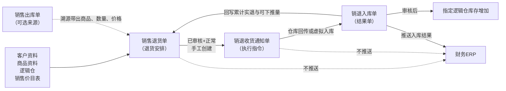
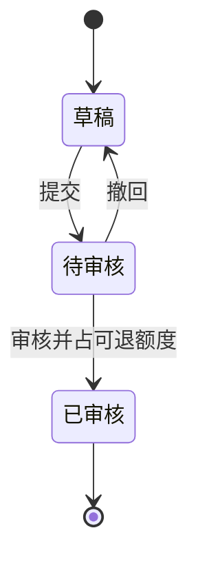
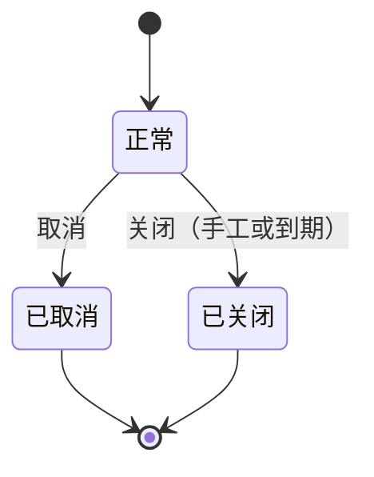

# 销售退货单主PRD

> 用途：定义销售退货单在ERP中的建单、审核占可退额度、截止时间维护、关闭取消及创建销退收货通知单等系统行为，作为研发实现和测试验收的依据。
> 定位：应用设计层文档。业务规则以[《销售与履约需求分析》](../../../../../02-需求调研和分析/04-销售与履约/销售与履约需求分析.md)和[《销售与履约业务设计》](../../../../../03-业务分析和设计/02-销售与履约业务设计.md)为准；状态与操作以[《单据与状态流转》](../../../系统架构和流程/03-单据与状态流转.md)第二节为准；字段与取值以[《销售退货单（详细稿）》](../../../字段清单合集/销售相关/销售退货单（详细稿）.tsv)为准；页面骨架见[《销售退货单页面骨架》](销售退货单页面骨架.md)；页面交互以[前端Demo版PRD](前端Demo版PRD/)为准，**须服从本文 §6.4 状态—功能矩阵**。
> 不写什么：不重复需求论证；不写销退收货通知单、销退入库单内部流程；不写外部ToC退货结果归集与独立站退货接入；不写财务ERP接口报文、退款结算和系统权限实现。

| 版本 | 本次变化 | 状态 |
| --- | --- | --- |
| V0.1 | 建立销售退货单主PRD，汇总已确认结论与页面分工 | 初稿，待评审 |
| V0.2 | 单据日期结论确认；一期启用草稿删除与正式列表导入（用户确认） | 初稿，待评审 |
| V0.3 | 全部退足口径确认：不提供关闭入口、不参与到期自动关闭，等待下游回传（Q03，用户确认） | 初稿，待评审 |
| V0.4 | 截止时间默认值、列表汇总口径、多条码命中确认（Q02、Q05、Q08，用户确认） | 初稿，待评审 |
| V0.5 | 溯源剩余额度展示确认：选单弹窗展示、明细行内拦截（Q09，用户确认） | 初稿，待评审 |
| V0.6 | 导入口径注记（Q06）；差异表审核数量校验口径修正 | 初稿，待评审 |
| V0.7 | 溯源建单带出客户与币别（带出后不可改），来源字段前置到单据信息首行（用户确认） | 初稿，待评审 |
| V0.8 | 退货截止时间改为退货截止日期，按天粒度；字段类型由日期时间改为日期（用户确认） | 初稿，待评审 |

## 1. 文档信息与阅读边界

| 项目 | 内容 |
| --- | --- |
| 读者 | 研发工程师、测试工程师、产品复核 |
| 业务依据 | [《销售与履约需求分析》](../../../../../02-需求调研和分析/04-销售与履约/销售与履约需求分析.md) SAL-FR05、SAL-FR06（验收口径 SAL-AC07、SAL-AC08、SAL-AC09、SAL-AC24）；[《销售与履约业务设计》](../../../../../03-业务分析和设计/02-销售与履约业务设计.md) §4.4、§5.1～§5.3、§6.4 |
| 字段依据 | [《销售退货单（详细稿）》](../../../字段清单合集/销售相关/销售退货单（详细稿）.tsv) |
| 状态依据 | [《单据与状态流转》](../../../系统架构和流程/03-单据与状态流转.md)第二节（含“采购退货单、销售退货单的差异”段） |
| 页面依据 | [《销售退货单页面骨架》](销售退货单页面骨架.md)、[前端Demo版PRD](前端Demo版PRD/) |

关联资料：[《价格管理需求分析》](../../../../../02-需求调研和分析/06-价格管理/价格管理需求分析.md)（PRI-FR05、PRI-FR07）、[《01-系统流程与单据交互》](../../../系统架构和流程/01-系统流程与单据交互.md)第六节、[《02-实体对象关系》](../../../系统架构和流程/02-实体对象关系.md)、[《00-系统与模块地图》](../../../系统架构和流程/00-系统与模块地图.md)单据总表（菜单入口）。

## 2. 需求背景与目标

### 2.1 背景

客户线下提出实物退货后，销售人员需要在ERP中记录退什么、退多少、退到哪个仓，并按批交给仓库收货。一期不承接外部ToC渠道退货结果归集，也不做退款与换货单据。

没有统一的销售退货单时，原出库还能退多少、退货进度和退货价格都缺少统一依据，后续收货安排与业财交接无法追溯。

### 2.2 目标

- 记录退货客户、商品、数量、价格、收货仓与退货截止日期，支持溯源退货与无来源退货两种建单方式；
- 溯源退货审核时占用原出库单可退额度，草稿不占，其他已审核办理中的退货也计入额度控制；
- 无来源退货不套原出库额度，每行退货数量大于0；
- 销售退货是收货增加库存，审核时**不按可用库存卡数量**；
- 实物只进事先指定的逻辑仓；品质问题先按指定仓收下，再由库存业务办理品质调拨；
- 区分取消与关闭：取消要求整单不再执行，关闭只停止新增通知，已有通知继续收货；
- 分批收货经销退收货通知单执行，实际收回后回写累计实退数量与可下推数量；
- 手工关闭与到期自动关闭并存；审核通过后仅可调整退货截止日期。

已审核后数量和价格锁定，仅可调整退货截止日期；审核通过**不会**自动生成销退收货通知单。

## 3. 需求范围

### 3.1 本期范围

- 销售退货单列表、新增、编辑、详情；
- 页头导出、导入（一期正式，导入方案见 R20）；
- 草稿保存、提交、审核、撤回，以及审核时的原出库可退额度占用；
- 已审核后调整退货截止日期、创建销退收货通知单、手动关闭、到期自动关闭、取消；
- 草稿删除（草稿+正常且未被下游引用，一期必做，见 R19）；
- 审核状态、业务状态两字段并列维护，不设第三维执行状态；
- 通知创建即占用可下推数量，实际收回后回写数量、额度与状态。

### 3.2 功能清单

| 编号 | 功能/位置 | 本次内容 | 需求来源 |
| --- | --- | --- | --- |
| F01 | 销售退货单列表 | 查询、列展示（含累计实退数量、在途通知数量、可下推数量）、行操作入口；两状态筛选项多选；勾选配合页头导出；一期批量栏无业务按钮 | SAL-FR05 |
| F02 | 新增/编辑页 | 维护单头、收货与截止时间、商品明细；草稿保存 | SAL-FR05、PRI-FR05/07 |
| F03 | 提交 | 草稿提交；待审核取消 | SAL-FR05、COM-FR01 |
| F04 | 审核/撤回 | 待审核单审核并占用可退额度；撤回留意见 | SAL-FR05、SAL-FR06、COM-FR01 |
| F05 | 详情页 | 分区域展示、关联单据（销退收货通知单与销退入库单）、操作信息、终止信息按状态显示 | SAL-FR05、SAL-FR06 |
| F06 | 已审核操作 | 调整退货截止日期、关闭、取消、创建销退收货通知 | SAL-FR05、SAL-FR06 |
| F07 | Demo Mock | 审核通过后可选演示用通知单生成；仅Demo | 演示需要，非业务规则 |
| F08 | 列表导入 | 列表页头「导入」四步向导（下载模板→上传文件→校验预览→完成导入）；校验通过生成草稿，仍须提交审核 | COM-FR02 |

### 3.3 需求追溯

| 上游场景与需求 | 本 PRD 功能 | 本 PRD 验收 |
| --- | --- | --- |
| SAL-FR05：退货创建、取价、仓库与收货方式 | F01～F05 | AC01、AC02、AC05 |
| SAL-FR06：退货额度、缺量与结束 | F04、F06 | AC03、AC04、AC06、AC07 |
| SAL-AC07、SAL-AC08、SAL-AC09 | F02、F04、F06 | AC01～AC04 |
| PRI-FR05、PRI-FR07：取价与锁定 | F02、F03 | AC05 |
| COM-FR01：提交与审核权限 | F03、F04 | AC01 |
| COM-FR02、COM-AC02：导入不改变审核流程 | F08 | AC14、AC15 |

### 3.4 非本期范围

- 外部ToC渠道退货结果归集与销退入库单接收（见[《销退入库单主PRD》](../销退入库单/销退入库单主PRD.md)）；
- 独立站退货接口接入、仅退款处理；
- 退款、折让与换货单据；补发、换货一律新建销售订单，不恢复原订单交付额度；
- 系统权限矩阵、API/表结构/并发锁实现；
- 审核通过自动生成销退收货通知单、直推销退入库单；
- 品质调拨单本身（由库存模块细化）。

| 范围补充 | 说明 |
| --- | --- |
| 适用对象 | B2B实物退货；一张退货单一个客户、一个收货仓；不同客户或不同收货仓须拆单 |
| 菜单入口 | 销售管理-销售退货单（一级菜单沿用模块口径命名，2026-09-22确认） |
| 与原型差异 | 09原型尚未实现本模块页面，页面与交互以本套PRD为准 |

## 4. 单据定位与业务边界

### 4.1 业务作用

| 项目 | 内容 |
| --- | --- |
| 单据层级 | 第1层——业务安排单，表达本次客户实物退货的安排 |
| 核心职责 | 记录向谁退货、退什么、入哪个仓、退多少及价格 |
| 单据来源 | 关联原销售出库单的溯源退货；或无来源手工创建；一期仅此两种 |
| 下游单据 | 销退收货通知单；已审核+正常+有可下推量时**手工**创建 |
| 数量关系 | 一张退货单对应多张销退收货通知单，支持分批收货；实收结果经通知回写累计实退数量与可下推数量 |
| 业务终结 | 取消或关闭；关闭/取消不可撤销；全部退足后仅查看追溯（R18，口径见 Q03） |

### 4.2 上下游关系摘要

> 完整流程见[《01-系统流程与单据交互》](../../../系统架构和流程/01-系统流程与单据交互.md)第六节；本文只保留退货单侧交接点。

### 4.3 业务对象关系

| 关系 | 说明 |
| --- | --- |
| 销售退货单 : 客户 | N:1；一张退货单一个客户 |
| 销售退货单 : 收货仓库 | N:1；一张退货单一个收货仓，实际选择逻辑仓；溯源退货沿用原出库单仓库 |
| 销售退货单 : 销售退货单明细 | 1:N |
| 销售退货单 : 销退收货通知单 | 1:N；分批创建 |
| 销售退货单明细 : 通知单明细 | 1:N；按 SKU 分行占用与回补 |
| 销售退货单 : 销售出库单 | 0..1 : 1；可选来源，有来源时带出原出库明细与价格 |
| 销退收货通知单 : 销退入库单 | 1:0..1；零收不生成结果单 |
| 销售订单 ↔ 销售退货单 | 无额度关联；退货不恢复原订单交付额度，补发换货另建销售订单 |

### 4.4 本单据不负责的事项

- 销售退货单不直接增加库存；库存变化由已审核销退入库单触发；
- 销售退货单不向推送财务ERP；财务ERP只接收已审核销退入库单，本模块列表与详情不提供重推入口；
- 收货处理方式（仓库收货／虚拟入库，默认仓库收货）写在销退收货通知单上，不写在销售退货单上；
- 退货不恢复原销售订单的交付额度；补发、换货新建销售订单，外部渠道自行办理的补发换货不套用此规则；
- 取消或关闭不删除已发生的实际退回；已有实收不能取消整单，只能关闭余量；
- 品质调拨不由本单执行，见 §4.5 第四项。

### 4.5 与采购退货单的四项关键差异

依据：[《单据与状态流转》](../../../系统架构和流程/03-单据与状态流转.md)第二节“采购退货单、销售退货单的差异”段、SAL-FR05、SAL-FR06、业务设计 §4.4。

| 差异 | 采购退货单 | 销售退货单（本单） |
| --- | --- | --- |
| 仓库锁定 | 一个出库仓（逻辑仓），可指定 | **溯源退货必须沿用原出库单仓库、不可切换**；无来源退货可指定收货仓，不要求与历史发货仓一致（SAL-FR05） |
| 额度口径 | 有来源审核占用原入库可退额度，草稿不占；无来源不套原入库额度 | 溯源退货审核占用**原出库单可退额度**（草稿不占，其他已审核办理中的退货也计入）；无来源不占原出库额度、每行大于0（SAL-FR06） |
| 审核数量校验 | 有来源审核占用原入库可退额度，并校验出库仓可用库存；无来源不套原入库额度、每行数量须大于0 | 销售退货是收货增加库存，**审核时不按可用库存卡数量**；这是与采购退货的最大差异，不得按可用库存阻断审核 |
| 入仓与品质 | 出库仓按实际出库减少库存 | 实物只进事先指定的逻辑仓；品质问题先按指定仓收下，再由库存业务办理**品质调拨**，不改原退货入库归属（业务设计 §4.4） |

## 5. 核心业务场景索引

| 场景ID | 场景 | 类型 | 说明 |
| --- | --- | --- | --- |
| S01 | 关联原出库建单并分批退货 | 主流程 | 草稿→提交→审核占可退额度→创建通知→收回回写→分批退完；金额按原出库价格带出 |
| S02 | 无来源退货 | 主流程 | 手工指定收货仓与明细；每行退货数量>0；不套原出库额度 |
| S03 | 撤回后重提 | 支线 | 待审核→撤回→草稿（保留撤回意见）→修改→重新提交 |
| S04 | 手工关闭余量 | 主流程 | 已审核+正常且仍有未退足余量时→关闭；不可反关单；已有通知继续收货 |
| S05 | 取消整单 | 支线 | 无实收且无阻挡通知时可取消；待推送/推送失败通知随单取消；执行中通知须先处理 |
| S06 | 到期自动关单 | 主流程 | 未全部退足的单在退货截止日期后T+2自然日 0:00 跑批关闭；关闭原因与关闭操作人留空；全部退足的单不参与（R18） |
| S07 | 全部退足履约完结 | 展示 | 累计实退=退货数量后仅查看追溯，无下推、取消、关闭、调整截止时间（R18，口径见 Q03） |

## 6. 状态与操作

状态定义 owner：[《单据与状态流转》](../../../系统架构和流程/03-单据与状态流转.md)第二节。销售退货单审核链无「已驳回」态，待审核不同意时操作为**撤回**（回到草稿），不叫驳回。两个字段并列组合理解；取消、关闭保留原审核状态，不把已审核单撤回为草稿。

### 6.1 状态维度

| 维度 | 取值 | 说明 |
| --- | --- | --- |
| 审核状态 | 草稿、待审核、已审核 | 控制编辑、审核及能否安排收货 |
| 业务状态 | 正常、已取消、已关闭 | 控制是否继续新增收货安排 |

本单**不设第三维执行状态**（与采购退货单同口径）：实际收回进度由明细行的累计实退数量、在途通知数量、可下推数量表达，不参与状态流转。「正常」表示未取消且未关闭，不代表尚未退完；可出现「已审核+正常+全部退足」。

### 6.2 状态取值说明

| 状态 | 含义 | 是否终态 |
| --- | --- | --- |
| 草稿 | 尚未提交或撤回后待修改 | 否 |
| 待审核 | 已提交，等待审核 | 否 |
| 已审核 | 审核通过，约定锁定并已占用可退额度 | 否（业务状态仍可变） |
| 正常 | 可继续办理 | 否 |
| 已取消 | 整单不再执行 | 是（业务维度） |
| 已关闭 | 不再新增通知 | 是（业务维度） |

### 6.3 状态流转图

**审核状态**：

**业务状态**：

全部退足（累计实退=退货数量）不产生新状态：业务状态保持「正常」，按 R18 收敛为仅查看追溯；**已确认**不改为自动关单（见 Q03）。

### 6.4 状态—功能矩阵

> ✅ = 允许；❌ = 不允许；✅（条件）= 须满足 R09～R19。F01 查询/查看各状态均可用，不重复列出。矩阵列与采购订单、采购退货单同构。

| 动作 | 草稿+正常 | 待审核+正常 | 已审核+正常 | 已审核+已关闭 | 已审核+已取消 | 草稿/待审核+已取消 |
| --- | --- | --- | --- | --- | --- | --- |
| 编辑（F02） | ✅ | ❌ | ❌ | ❌ | ❌ | ❌ |
| 提交（F03） | ✅ | ❌ | ❌ | ❌ | ❌ | ❌ |
| 取消（待审核，F03） | ❌ | ✅ | ❌ | ❌ | ❌ | ❌ |
| 审核（F04） | ❌ | ✅ | ❌ | ❌ | ❌ | ❌ |
| 撤回（F04） | ❌ | ✅ | ❌ | ❌ | ❌ | ❌ |
| 调整截止时间（F06） | ❌ | ❌ | ✅（R13、R18） | ❌ | ❌ | ❌ |
| 创建销退收货通知（F06） | ❌ | ❌ | ✅（R10、R14、R18） | ❌ | ❌ | ❌ |
| 关闭（F06） | ❌ | ❌ | ✅（R15、R18） | ❌ | ❌ | ❌ |
| 取消（已审核，F06） | ❌ | ❌ | ✅（R17、R18） | ❌ | ❌ | ❌ |
| 删除草稿（R19） | ✅（条件） | ❌ | ❌ | ❌ | ❌ | ❌ |
| Demo Mock（F07） | ❌ | ❌ | ✅（Demo） | ❌ | ❌ | ❌ |
| 详情/追溯（F05） | ✅ | ✅ | ✅ | ✅ | ✅ | ✅ |

**草稿删除**：删除仅草稿+正常可用，镜像采购订单R11口径（R19）。

已取消、已关闭：仅查看与追溯，不显示编辑、提交、审核、创建通知、反关单。**已审核+正常+全部退足**（R18）：仅查看追溯，不显示创建通知、关闭、取消、调整截止时间。

列表与详情行内操作按状态互斥展示：草稿提供编辑、提交、删除；待审核提供审核、撤回、取消；已审核+正常时取消与关闭可同时出现（取消须满足 R17，关闭须满足 R15 与 R18）。列表批量操作栏一期仅展示已选中计数与列设置；**导出**在页头，可选已勾选范围；**导入**在页头，为一期正式能力（见 Q06、R20）。

### 6.5 状态流转表

| 当前状态 | 动作 | 前置条件 | 结果状态 | 二次确认 | 后置影响 | 失败处理 |
| --- | --- | --- | --- | --- | --- | --- |
| 草稿+正常 | 保存 | 明细已填则每行退货数量>0 | 草稿+正常 | 无 | 分配单号（R01） | 校验失败定位字段/行 |
| 草稿+正常 | 提交 | R04、R05、R07 提交校验 | 待审核+正常 | 见 Demo PRD | 价格税率锁定（R13） | 阻断并提示 |
| 草稿+正常 | 删除 | R19：未被销退收货通知单等下游引用 | 物理删除 | 二次确认 | 记录从列表消失，不可恢复 | 被引用或非草稿时阻断 |
| 待审核+正常 | 审核 | 溯源退货额度充足（R06、R09） | 已审核+正常 | 二次确认 | 占用原出库可退额度；数量价格锁定 | 额度不足时阻断、不占额度 |
| 待审核+正常 | 撤回 | 必填撤回意见 | 草稿+正常 | 无 | 保留撤回意见 | — |
| 待审核+正常 | 取消 | 无 | 原审核+已取消 | 必填取消原因 | 终止审核流程 | — |
| 已审核+正常 | 调整截止时间 | 全部退足时不提供（R18） | 已审核+正常 | 见 Demo PRD | 记录操作信息 | 全部退足时阻断 |
| 已审核+正常 | 创建销退收货通知 | 有可下推数量（R10、R14） | 已审核+正常 | 通知 PRD | 占用可下推数量 | 无量时阻断 |
| 已审核+正常 | 关闭 | 仍有未退足余量（R15、R18） | 已审核+已关闭 | 必填关闭原因 | 不可新增通知；已有通知继续；释放未退且无通知继续执行的可退额度；记录关闭方式、关闭时间、关闭操作人 | 全部退足时阻断；不可撤销 |
| 已审核+正常 | 取消 | 无实收且无待执行通知（R17） | 已审核+已取消 | 必填取消原因 | 释放未退且无通知继续执行的可退额度 | 条件不满足时阻断 |
| 任意+已关闭/已取消 | 查看 | — | 不变 | — | — | — |
| 已审核+正常 | 实收回写 | 通知收货结束或虚拟入库 | 不变（数量重算） | 自动 | 累计实退数量更新；可下推数量回补；额度消耗 | — |

## 7. 核心业务规则

### 7.1 创建与提交规则

| 规则编号 | 主题 | 规则 | 边界或例外 |
| --- | --- | --- | --- |
| R01 | 单号 | 按[《6.强盛ERP的编码规则和通用字段规则》](../../../../../01-全局背景信息/6.强盛ERP的编码规则和通用字段规则.md)第一节自动生成；保存草稿时分配；前缀 XSTH | 用户不可编辑 |
| R02 | 客户与收货仓 | 一张退货单只对应一个客户、一个收货仓，收货仓实际选择审核通过且启用的逻辑仓；**溯源退货沿原出库单的客户与币别并带出后不可改，且必须沿用原出库单仓库、不可切换**；无来源退货可指定收货仓，不要求与历史发货仓一致 | 不同客户或不同收货仓须拆单；改客户后原匹配价格作废（PRI-FR05） |
| R03 | 币别 | 选客户后默认带出客户默认币别，无默认则手选；改客户或改币别清空明细价格并按新条件重取 | 不做跨币别换算 |
| R04 | 取价 | 有来源时带原出库含税价格与税率；缺价或无来源可手工填写，也可查询当前销售价快速填入（一并带税率）；草稿可改，提交后价格税率锁定 | 零价提交需确认；空价、负价阻断（PRI-FR05、PRI-FR07） |
| R05 | 价税与金额 | 行价税合计=退货数量×含税单价；行金额=退货数量×不含税单价；行税额=价税合计−金额；单头价税合计、税额、金额分别汇总明细对应字段 | 单价4位小数，金额和税额2位小数；行内尾差进税额；税率允许0%，此时税额为0、价税合计等于金额；页面按千分位展示、录入不带千分位 |
| R06 | 溯源额度 | 溯源退货累计退货数量不超过原销售出库单实际出库数量；审核时占用原出库可退额度，草稿不占；其他已审核办理中的退货也计入额度控制 | 依据 SAL-FR06、业务设计 §5.3、§6.4 |
| R07 | 无来源退货 | 无来源时每行退货数量大于0，不套用原出库可退额度，不占用原出库额度 | 不要求与历史发货仓一致（R02） |
| R20 | 列表导入 | 列表页头「导入」（正式能力，页头顺序：新增→导入→导出）；四步向导：①下载模板→②上传文件→③校验预览→④完成导入；模板列=单据序号、客户、币别、收货仓库、退货截止日期、来源销售出库单号（可空）、备注、商品编码、退货数量、含税单价、税率；同一「单据序号」归并为一张退货单，同组单头必须一致，无来源留空来源单号；校验按保存草稿口径：单头必填（客户、币别、收货仓库、退货截止日期）、每行商品存在且退货数量>0、价格非空非负（来源合法且价格留空按原出库价带入）、客户审核通过且启用、来源单号须为已审核销售出库单、溯源不超剩余可退额度；**销售退货为收货业务，导入校验不按可用库存卡数量**（与 R09 一致）；**任一行失败则整批不导入**，返回逐行原因、可下载错误说明；成功生成N张草稿（草稿+正常，单号按XSTH规则分配），提示“成功导入N张退货单草稿，请逐单检查后提交审核” | 来源 COM-FR02、COM-AC02；导入不改变流程，仍须提交审核；零价草稿级允许、提交时再确认；不设导入行数硬上限；导入草稿与手工草稿同权（可编辑、可提交、可删除）；步骤与文案细节见 Demo 列表页 §8 导入 |

数量示例（标明为示例）：原出库100件，审核退60件、实收50件后关闭且无其他通知，已退的50件继续计入累计、未退的10件释放，仍可再申请退50件，不超原实出（SAL-AC08）。

### 7.2 审核与数量规则

| 规则编号 | 主题 | 规则 | 边界或例外 |
| --- | --- | --- | --- |
| R08 | 两状态 | 审核状态、业务状态并列维护，各记各的信息 | 无第三维执行状态；全部退足不改变状态（R18） |
| R09 | 审核占用 | 溯源退货审核通过才占用原出库可退额度，额度不足时审核失败、不占额度；**销售退货是收货增加库存，审核时不按可用库存卡数量**，不得以可用库存不足阻断审核 | 与采购退货的关键差异，见 §4.5 |
| R10 | 可下推数量 | 退货数量−已结束通知的实际收货数量−未结束有效通知的通知数量；不同 SKU 不互抵；关闭后保留数值但不再具备新增通知资格 | 《单据与状态流转》第六节公式 |
| R11 | 实收回写 | 允许少收、不允许超过通知量接收；实收回写累计实退数量并消耗对应额度，缺量回补可下推数量；实收=0按零收取消通知，不生成零数量销退入库单 | 补收另建通知，不回原通知补收（SAL-FR06） |
| R12 | 入仓归属 | 实物只进本单指定的逻辑仓；品质与预期不同时先按指定仓收下，再由库存业务办理品质调拨，不改原退货入库归属 | 调拨执行由库存模块细化 |

### 7.3 审核后维护规则

| 规则编号 | 主题 | 规则 | 边界或例外 |
| --- | --- | --- | --- |
| R13 | 编辑范围 | 草稿可改；待审核不可改单，只可走审核/撤回/取消；已审核不可改客户、收货仓、商品、数量、价格、税率、来源出库单，**仅可调整退货截止日期** | 提交后价格税率锁定；撤回回草稿后可再改；不做变更单（SAL-AC07） |
| — | 审核记录 | 审核/撤回须记录审核人、审核时间；撤回意见保留 | 允许有权限用户提交并审核自己创建的单据（COM-FR01） |

### 7.4 执行、关闭与取消规则

| 规则编号 | 主题 | 规则 | 边界或例外 |
| --- | --- | --- | --- |
| R14 | 创建通知 | 已审核+正常且有可下推数量时，手工创建销退收货通知单；创建即占用可下推数量；收货处理方式在通知单上选择 | 处理方式不在本单维护；通知内部流程见[《销退收货通知单主PRD》](../销退收货通知单/销退收货通知单主PRD.md) |
| R15 | 手动关闭 | 已审核+正常且仍有未退足余量时可手工关闭；关闭原因必填并记录关闭操作人；关闭后不可新增通知，已有通知继续收货；关闭释放**未退且无通知继续执行**的可退额度，已退部分继续计入累计 | 不可反关单；执行中通知对应额度保留至结束 |
| R16 | 到期自动关闭 | 退货截止日期过后T+2自然日的当天北京时间0:00自动关闭；不跳过周末；系统自动关闭时关闭原因、关闭操作人留空，用关闭方式区分；全部退足的单不参与（R18） | 关闭方式=到期自动关闭；配置界面本期不做 |
| R17 | 取消 | 无实际入库且无仍需执行的通知时可取消；待推送、推送失败的通知随退货单取消；存在推送中、已推送且未取消的通知时不直接取消，须取得仓库取消成功；取消释放未退且无通知继续执行的可退额度 | 已有实收不能取消整单，只能关闭余量；取消不可撤销（SAL-FR06） |
| R18 | 履约完结 | 各明细行累计实退数量等于退货数量（全部退足）后，视为本次退货履约已执行完毕：无可下推数量、不提供创建通知、关闭、取消与调整截止时间，仅查看追溯 | **已确认**（2026-09-22，见 Q03）：不提供关闭入口，到期自动关闭跳过全部退足的单；等待下游通知与销退入库单回传结果 |
| R19 | 删除 | 仅草稿+正常且未被销退收货通知单等下游引用时可物理删除；已提交、已审核或被引用不可删 | 删除不可恢复；一期必做，镜像采购订单R11口径（Q04） |

| 维度 | 取消 | 关闭 |
| --- | --- | --- |
| 含义 | 整单不再执行 | 不再安排剩余收货，已有通知继续 |
| 典型状态 | 草稿/待审核/已审核+正常（条件） | 已审核+正常 |
| 可撤销 | 否 | 否 |
| 对已有实收 | 不允许（须关余量） | 不删除已收货事实 |
| 额度处理 | 释放未退且无通知继续执行的额度 | 同左；已退部分继续计入累计 |

### 7.5 业务生效点

| 业务动作 | 销售退货单影响 | 库存影响 | 业财/外部影响 |
| --- | --- | --- | --- |
| 创建/保存草稿 | 产生草稿安排；不占额度 | 无 | 无 |
| 审核通过 | 数量价格锁定，可创建通知；占用原出库可退额度（溯源） | 无（不按可用库存卡数量） | 无 |
| 创建销退收货通知 | 占用可下推数量 | 无 | 无 |
| 实收回写（含虚拟入库） | 更新累计实退、可下推数量与额度消耗 | 由已审核销退入库单增加指定逻辑仓库存 | 财务ERP只推已审核销退入库单，不推本单 |
| 关闭 | 业务状态→已关闭；释放未退且无通知继续执行的额度 | 不新增库存 | 无 |
| 取消 | 业务状态→已取消；按 R17 释放额度 | 不回滚已发生库存 | 无 |

### 7.6 字段校验绑定

完整字段见 TSV。摘要：

| 校验时机 | 要求 |
| --- | --- |
| 保存草稿 | 必填性较松；明细至少一行；已填行退货数量>0；不执行 R04 提交级价格阻断 |
| 提交 | 单头必填完整；明细完整；R04 价格校验；R07 无来源口径；客户与收货仓启用 |
| 审核 | R06 溯源额度校验（不校验可用库存） |

页面控件、错误文案与零价二次确认见 Demo PRD 弹窗章节。页面不出现 TSV 以外的字段；溯源剩余额度在选单弹窗展示、明细超额度行内报错，不新增字段（Q09，已确认）。

## 8. 功能需求说明（页面索引）

| 编号 | 页面/位置 | 规则与状态依据 | Demo PRD |
| --- | --- | --- | --- |
| F01 | 列表 | §6.4；R09～R19 | [列表页](前端Demo版PRD/销售退货单前端Demo版PRD_列表页.md) |
| F02 | 新增/编辑 | R01～R07、R13；草稿+正常 | [新增编辑页](前端Demo版PRD/销售退货单前端Demo版PRD_新增编辑页.md) |
| F03 | 提交/待审取消 | R04、R05、R07、R13；§6.5 | [弹窗与Mock](前端Demo版PRD/销售退货单前端Demo版PRD_弹窗与Mock.md) §2 |
| F04 | 审核/撤回 | R06、R09、R13；§6.5 | 弹窗 PRD §3（审核、撤回） |
| F05 | 详情 | R08、R10～R18；§6.4 | [详情页](前端Demo版PRD/销售退货单前端Demo版PRD_详情页.md) |
| F06 | 截止时间/关单/取消/下推 | R10、R13～R18；§6.4 | 列表/详情行操作 + 弹窗 PRD §3 |
| F07 | Demo Mock | 非正式验收 | 弹窗 PRD §4 |
| F08 | 列表导入 | R20；§3.1；COM-FR02 | [列表页](前端Demo版PRD/销售退货单前端Demo版PRD_列表页.md) §8 导入 + 弹窗 PRD §5 |

## 9. 上下游影响与协同

| 关联模块/系统 | 需要配合的变化 | 交接内容与时机 | 验收结果 |
| --- | --- | --- | --- |
| 客户资料 | 引用审核通过且启用的客户 | 建单选客户 | 禁用/未审核不可选 |
| 商品资料 | 引用启用成品SKU | 明细选商品 | 不按是否已有销售价格过滤可选范围 |
| 仓库资料 | 引用审核通过且启用的逻辑仓 | 无来源时指定收货仓 | 溯源退货锁定原出库单仓库，不可切换 |
| 价格管理 | 优先原出库价；缺价查当前销售价或手填 | 选来源、商品、币别 | 提交后价格税率锁定；零价确认、空负阻断 |
| 销售出库单 | 溯源来源与可退额度 owner | 建单关联原出库单 | 累计退货不超原实出；额度按 R06 计算 |
| 销退收货通知单 | 订单下推来源 | 已审核+正常+有可下推量时创建 | 创建即占用可下推数量 |
| 销退入库单 | 回写累计实退与额度消耗 | 通知收货完成或虚拟入库后 | 数量与 R10～R12 一致 |
| 库存 | 增加指定逻辑仓即时库存；办理品质调拨 | 结果单审核后 | 退货单本身不改库存 |
| 财务ERP | 不推送本单 | — | 只推已审核销退入库单；本模块无重推按钮 |

## 10. 关联文档与阅读入口

| 关联内容 | 阅读入口 | 本 PRD 与其边界 |
| --- | --- | --- |
| 销售退货流程 | [《01-系统流程与单据交互》](../../../系统架构和流程/01-系统流程与单据交互.md)第六节 | 完整角色接力；本文只写退货单侧交接 |
| 状态与操作 | [《单据与状态流转》](../../../系统架构和流程/03-单据与状态流转.md)第二节 | 状态 owner；本文矩阵与 Demo 须一致 |
| 数量口径 | [《单据与状态流转》](../../../系统架构和流程/03-单据与状态流转.md)第六节、第七节 | 可下推数量公式与回写 owner |
| 对象关系 | [《02-实体对象关系》](../../../系统架构和流程/02-实体对象关系.md) | 实体级关系；本文 §4.3 为业务摘要 |
| 字段定义 | [《销售退货单（详细稿）》](../../../字段清单合集/销售相关/销售退货单（详细稿）.tsv) | TSV 为字段 owner |
| 页面结构 | [《销售退货单页面骨架》](销售退货单页面骨架.md) | 区域与线框走查，非规则权威 |
| 页面交互 | [前端Demo版PRD](前端Demo版PRD/) | 控件、文案、Mock；服从 §6.4 |
| 来源单据 | [《销售出库单主PRD》](../../3-销售管理/销售出库单/销售出库单主PRD.md) | 原出库与可退额度依据；本文只引用不展开 |
| 下游通知 | [《销退收货通知单主PRD》](../销退收货通知单/销退收货通知单主PRD.md) | 通知内部流程、收货处理方式见通知 PRD |
| 下游结果 | [《销退入库单主PRD》](../销退入库单/销退入库单主PRD.md) | 生成、审核、推送财务ERP不在本文 |

## 11. 异常与一致性

### 11.1 并发操作

| 场景 | 业务处理结果 |
| --- | --- |
| 两人同时编辑同一草稿 | 后提交者不得覆盖先提交结果；失败并提示刷新 |
| 两人同时审核同一待审单 | 只允许一个成功；另一个提示状态已变化 |
| 两人同时对同一原出库单下推退货 | 各自校验可退额度；后创建者若额度不足则阻断 |

### 11.2 幂等与重复处理

| 操作 | 幂等规则 |
| --- | --- |
| 实收回写 | 同一实收结果不得重复计入累计实退数量或重复消耗额度 |
| 可下推数量计算 | 重复触发只保持一致结果，不产生额外业务动作 |

### 11.3 与下游单据一致性

| 场景 | 处理方式 |
| --- | --- |
| 关单后 | 不可新增通知；已有通知继续执行至结束 |
| 取消时存在执行中通知 | 阻断取消，须先处理通知或等待仓库取消回执 |
| 已关闭单收到迟到回传 | 按真实结果回写累计实退数量，但不新增通知 |
| 取消中收到实收回传 | 按真实结果完成收货，不以取消申请覆盖已发生事实 |
| 通知取消成功 | 退货单仍开放→回补可下推量、保留原出库可退额度占用；退货单已关闭→释放相应额度、不允许继续安排 |

## 12. 验收标准与待确认事项

### 12.1 验收标准

| 编号 | 对应功能/规则 | 条件与操作 | 预期结果 |
| --- | --- | --- | --- |
| AC01 | F02、F04/R02、R04、R06、R09 | 创建溯源、来源缺价及无来源退货，调整价格后提交审核 | 优先带原出库价格；缺价可查询当前价或手填且草稿可改；提交后价格税率锁定；溯源沿用原出库仓不可切换、无来源可指定收货仓；审核按额度校验、不按可用库存卡数量；无来源每行大于0、不套原出库额度（SAL-AC07） |
| AC02 | F06/R13 | 已审核后尝试改客户、收货仓、商品、数量、价格 | 均不可改；仅可调整退货截止日期 |
| AC03 | F06/R06、R15、R18 | 原出库100，审核退60，实收50后关闭，无其他通知 | 草稿不占可退额度，审核占用；已退50继续计入累计、未退10释放；结束后可再退50，不超原实出（SAL-AC08） |
| AC04 | F06/R10、R11 | 退货100、通知60、实收50结束；另测试超通知量与实收0 | 结束后还能安排50；不允许超通知量接收；实收0时通知按零收取消、不生成零数量销退入库单（SAL-AC09） |
| AC05 | F02/R03、R04、R05 | 选客户带默认币别；改币别；有价/无价/零价明细 | 改客户或币别清价重取；零价需确认，空价与负价阻断；提交后价格税率锁定；税率0%时税额为0 |
| AC06 | F06/R15、R16 | 手工关闭余量；另测到期自动关闭 | 手工关闭必填原因并记录操作人；到期关闭为截止时间后T+2自然日当天0:00，关闭方式=到期自动关闭、原因与操作人留空；已有通知继续收货；不可反关单 |
| AC07 | F06/R17 | 分别在无通知、待推送/推送失败、推送中/已推送、已有实收时取消 | 前两类可取消（待推送/推送失败随单取消）；推送中/已推送须先取得仓库取消成功；已有实收不能取消整单 |
| AC08 | F03 | 提交校验失败 | 空价、负价阻断；定位到字段或明细行 |
| AC09 | F05 | 查看已取消、已关闭及撤回后的退货单 | 终止信息或撤回意见按状态显示；操作信息只读 |
| AC10 | F07 | Demo Mock 生成通知 | 仅 Demo 可用；正式验收不以自动生成为准 |
| AC11 | F05、F06/R18、S07 | 全部退足的退货单打开列表与详情 | 累计实退=退货数量；无可下推数量；不显示创建通知、关闭、取消、调整截止时间；仅查看追溯 |
| AC12 | F05 | 已审核单打开详情，存在多张销退收货通知单与销退入库单 | 关联单据分组展示子表及数量；单号可跳转；无下游时展示空态 |
| AC13 | F01、F05/R19 | 草稿+正常且未被下游引用的退货单在列表与详情点删除并确认 | 删除成功后列表不再显示该单、详情不可再打开；已有销退收货通知单引用的草稿，以及待审核、已审核、已取消、已关闭单，均阻断删除 |
| AC14 | F08/R20 | 上传含多张单据序号的合法文件并完成导入 | 生成N张草稿（草稿+正常，单号按XSTH规则分配）并提示“成功导入N张退货单草稿，请逐单检查后提交审核”；导入不改变流程，仍须提交审核（COM-FR02、COM-AC02） |
| AC15 | F08/R20 | 上传文件中任一行校验失败（商品不存在、数量≤0、价格为负、客户未审核或停用、来源单非已审核销售出库单、溯源超剩余可退额度等） | **整批不导入**；返回逐行失败原因并可下载错误说明；不按可用库存卡数量 |

### 12.2 待确认事项

| 编号 | 问题 | 影响范围 | 状态/结论 |
| --- | --- | --- | --- |
| Q01 | 单据日期字段 | F02、列表、详情 | **已确认**（2026-09-22）：不设单据日期字段，时间口径用创建时间（用户确认；TSV备注“销售退货单不设单据日期，页面用创建时间”） |
| Q02 | 退货截止日期的默认值与录入规则 | F02、F06 | **已确认**（2026-09-22）：不设默认值，必填手填，空值阻断提交；采购退货单同字段同口径（用户确认） |
| Q03 | 全部退足后的终止口径 | R18、F06 | **已确认**（2026-09-22）：全部退足后不提供下推/关闭/取消/调整截止时间，也不参与到期自动关闭，仅查看追溯；等待下游销退收货通知单与销退入库单回传结果（用户确认） |
| Q04 | 草稿删除是否一期提供 | R19、F01、F02 | **已确认**（2026-09-22）：一期提供草稿删除，镜像采购订单R11口径（用户确认） |
| Q05 | 列表数量列是否补单头汇总字段（如总退货数量） | F01 | **已确认**（2026-09-22）：不补单头汇总字段，列表按明细行合计展示、含可下推数量在内一律不按状态置0，草稿与已关闭同样展示真实值；与采购退货单 Q03 同口径（用户确认） |
| Q06 | 销售退货单导入是否一期提供 | F01 页头、F08 | **已确认**（2026-09-22）：一期提供正式列表导入，方案见R20（用户确认）；采购订单/销售订单不做正式导入（见其PRD），差异按业务确认 |
| Q07 | 列表默认排序字段 | F01 | **已确认**：创建时间倒序（TSV 备注“默认按此倒序”） |
| Q08 | 商品条码多条码的筛选命中规则 | F01 查询区 | **已确认**（2026-09-22）：商品任一条码命中即命中该单据；全系统条码筛选同口径（用户确认） |
| Q09 | 溯源建单时剩余额度的展示方式 | F02 | **已确认**（2026-09-22）：选原出库单弹窗展示各行剩余可退额度，明细录入超额度时行内报错；TSV 不加字段，剩余额度由原出库单侧实时计算（含其他办理中退货占用），提交与审核仍复核（R06、R09，用户确认） |
