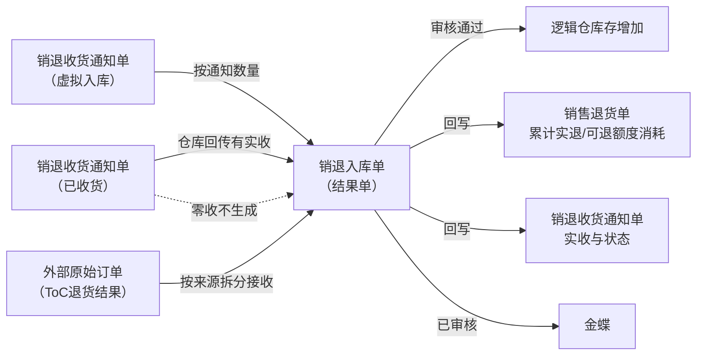
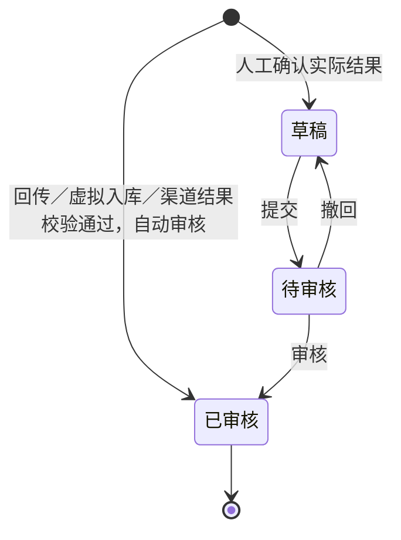
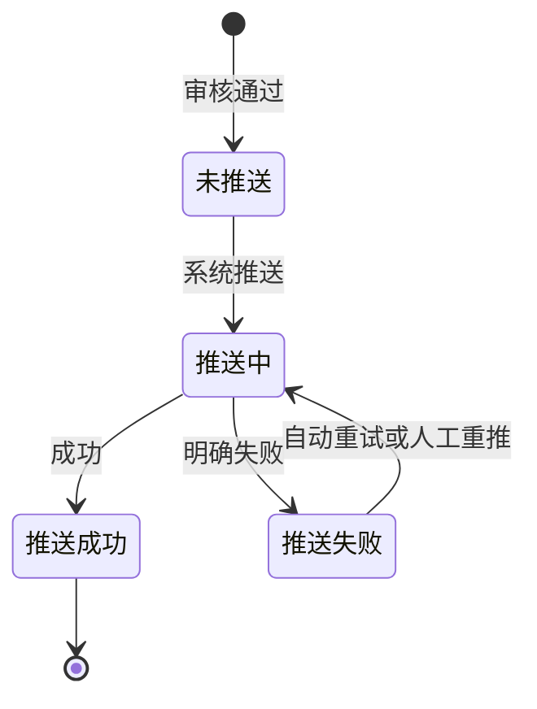

# 销退入库单主PRD

> 用途：定义销退入库单在ERP中的两条生成路径、自动审核、库存记账、来源回写及金蝶推送，作为研发实现和测试验收的依据。
> 定位：应用设计层文档。业务规则以[《销售与履约需求分析》](../../../../../02-需求调研和分析/04-销售与履约/销售与履约需求分析.md)和[《销售与履约业务设计》](../../../../../03-业务分析和设计/02-销售与履约业务设计.md)为准；状态与操作以[《单据与状态流转》](../../../系统架构和流程/03-单据与状态流转.md)第四节为准；字段与取值以[《销退入库单（详细稿）》](../../../字段清单合集/销售相关/销退入库单（详细稿）.tsv)为准；页面骨架见[《销退入库单页面骨架》](销退入库单页面骨架.md)；页面交互以[前端Demo版PRD](前端Demo版PRD/)为准，**须服从本文 §6.4 状态—功能矩阵**。
> 不写什么：不重复需求论证；不写仓库WMS作业细节与接口报文；不写金蝶报文字段映射；不写外部渠道接入页面细节；不写系统权限与API设计。

| 版本 | 本次变化 | 状态 |
| --- | --- | --- |
| V0.1 | 建立销退入库单主PRD，汇总已确认结论与页面分工 | 初稿，待评审 |
| V0.2 | 价税推送范围、外部ToC取值与多条码命中确认（Q03、Q05、Q07，用户确认） | 初稿，待评审 |
| V0.3 | 外部ToC实际收货时间与一级菜单命名确认（Q06、Q09，用户确认） | 初稿，待评审 |

## 1. 文档信息与阅读边界

| 项目 | 内容 |
| --- | --- |
| 读者 | 研发工程师、测试工程师、产品复核 |
| 业务依据 | [《销售与履约需求分析》](../../../../../02-需求调研和分析/04-销售与履约/销售与履约需求分析.md) SAL-FR05、SAL-FR06、SAL-FR10、SAL-FR12；[《销售与履约业务设计》](../../../../../03-业务分析和设计/02-销售与履约业务设计.md) §4.4、§4.6、§5.2、§5.3、§6.5 |
| 字段依据 | [《销退入库单（详细稿）》](../../../字段清单合集/销售相关/销退入库单（详细稿）.tsv) |
| 状态依据 | [《单据与状态流转》](../../../系统架构和流程/03-单据与状态流转.md)第四节 |
| 页面依据 | [《销退入库单页面骨架》](销退入库单页面骨架.md)、[前端Demo版PRD](前端Demo版PRD/) |

关联资料：[《销退收货通知单主PRD》](../销退收货通知单/销退收货通知单主PRD.md)、[《销售退货单主PRD》](../销售退货单/销售退货单主PRD.md)（与本文并行编写）、[《01-系统流程与单据交互》](../../../系统架构和流程/01-系统流程与单据交互.md)第五节、第六节、[《02-实体对象关系》](../../../系统架构和流程/02-实体对象关系.md)、[《系统集成需求分析》](../../../../../02-需求调研和分析/07-系统集成/系统集成需求分析.md) INT-FR03、INT-FR05、INT-FR06。

## 2. 需求背景与目标

### 2.1 背景

客户退回实物，仓库按销退收货通知单完成一次收货后，或渠道方在外部平台完成一笔退货入库后，需要形成实际入库结果单，作为库存增加和业财交接的唯一依据。销售退货单和销退收货通知单不直接增加库存，也不向金蝶推送。

没有统一的入库结果单时，实际收货数量、库存变化和财务输入难以与退货约定对齐，也无法逐单追溯分批收货过程；外部渠道的退货结果也没有统一的ERP落点，无法与实物退货链路区分追溯。

### 2.2 目标

- 销退收货通知路径：通知仓库收货并回传有实收结束后，或虚拟入库创建成功后，**系统自动生成**销退入库单并自动审核；
- 外部ToC路径：渠道退货结果按来源拆分接收，商品与逻辑仓匹配、库存校验通过后，**系统自动生成**并自动审核，不增加常规人工审核；
- 审核通过后增加对应逻辑仓库存，并回写通知实收与状态、销售退货单累计实退与可退额度消耗；
- 已审核结果逐单推送金蝶；自动重试最多3次，仍失败则保持推送失败，在系统集成中心针对原单重推；销退入库单列表/详情不提供重推按钮；
- 销退入库单整单只读，不提供新增、编辑、取消或作废；
- 已审核后不因金蝶推送失败而回滚库存。

## 3. 需求范围

### 3.1 本期范围

- 销退入库单列表、详情（只读查看）；
- 销退收货通知路径：由通知回传或虚拟入库触发的自动生成（本模块无新增入口）；
- 外部ToC路径：由渠道退货结果归集触发的自动生成（本模块仅列表/详情查看与追溯）；
- 接口拿不到仓库结果时的人工确认见 INT-FR06（沿来源通知，入口不在本模块）；
- 已审核后查看来源、库存结果与推送记录；金蝶推送失败时到系统集成中心重推原单；
- 审核状态与金蝶推送状态两个字段并列维护；
- 与销退收货通知单、销售退货单的数量回写衔接。

### 3.2 功能清单

| 编号 | 功能/位置 | 本次内容 | 需求来源 |
| --- | --- | --- | --- |
| F01 | 入库单列表 | 查询、列展示、进入详情；来源类型、审核状态与金蝶推送状态多选筛选；勾选配合页头导出；**无新增**；一期批量栏无业务按钮 | SAL-FR05、SAL-FR09 |
| F04 | 详情页 | 分区域只读展示来源、明细价税、推送与审核信息 | SAL-FR05、SAL-FR10 |
| F08 | 重推金蝶（系统集成中心） | 已审核且金蝶推送失败时，在系统集成中心针对原单重试；本模块列表/详情不提供该按钮 | SAL-FR10、INT-FR03、INT-FR05 |
| F09 | Demo Mock | 模拟通知回传后自动生成入库单；仅Demo | 演示需要，非业务规则 |

### 3.3 需求追溯

| 上游场景与需求 | 本 PRD 功能 | 本 PRD 验收 |
| --- | --- | --- |
| SAL-FR05：退货收货、虚拟入库生成结果单 | F04、自动路径 | AC01、AC09 |
| SAL-FR06：零收不生成、少收、可下推量 | 自动路径 | AC02、AC03 |
| SAL-FR09：外部ToC结果逐笔归集、自动审核 | F01、F04、自动路径 | AC10 |
| SAL-FR10：仅两类结果单推金蝶、沿用来源金额 | F04、F08 | AC04、AC13 |
| SAL-FR12、SAL-AC21：重复回传与完结保护 | 自动路径 | AC11 |
| SAL-AC24：虚拟入库40件 | 自动路径 | AC09 |
| INT-FR03、INT-FR05：失败集中展示与重推 | F08 | AC04 |

### 3.4 非本期范围

- **无来源人工建入库单**、列表/详情新增入口（回传、虚拟入库或渠道结果自动生成的已审核单不走草稿编辑）；
- 入库单导入；
- 已审核后修改数量、价格、仓库或反审核；
- 零数量入库单；
- 外部渠道接入页面细节、异常处理页面细节（见集成PRD；异常按 SAL-FR12 阻断后由集成侧处理）；
- 金蝶推送报文字段映射、系统集成中心页面细节（见集成PRD；本模块不提供重推按钮）；
- 系统权限矩阵、API/表结构/并发锁实现。

| 范围补充 | 说明 |
| --- | --- |
| 适用对象 | B2B、独立站实物退货与外部ToC渠道退货形成的入库结果 |
| 路径一：销退收货通知 | 来源类型=销退收货通知。必须关联一张已收货的销退收货通知单；仓库回传有实收并结束，或虚拟入库创建成功后，系统自动生成并自动审核。零收不生成结果单 |
| 路径二：外部ToC | 来源类型=外部ToC。渠道方退货结果归集，按来源拆分接收（外部原始订单 : 销退入库单 = 1:N），校验通过后直接自动审核；**无关联通知、无关联销售退货单** |
| 门店入口 | 菜单「销售管理-销退入库单」（一级菜单沿用模块口径命名，2026-09-22确认） |
| 与原型差异 | 09原型尚未实现本模块页面，页面与交互以本套PRD为准 |
| 与原型差异（补充） | 一期不提供无来源人工建入库单；列表/详情无重推按钮 |

## 4. 单据定位与业务边界

### 4.1 业务作用

| 项目 | 内容 |
| --- | --- |
| 单据层级 | 第3层——实际结果单，记录本次实际入库事实 |
| 核心职责 | 记录实际收回多少、入哪个仓、来源哪张通知或哪个外部订单；审核后记账并推送金蝶 |
| 单据来源 | 路径一须来自销退收货通知单；路径二来自外部原始订单及渠道退货结果 |
| 下游单据 | 无业务下游；金蝶接收已审核结果 |
| 数量关系 | 一张通知对应0或1张入库单（零收不生成）；一个外部原始订单可对应多张入库单（按来源拆分）；一张销售退货单可对应多张入库单 |
| 业务终结 | 已审核为业务终态；不可取消、不可反审核；推送失败不改变已生效库存 |

### 4.2 上下游关系摘要

> 完整流程见[《01-系统流程与单据交互》](../../../系统架构和流程/01-系统流程与单据交互.md)第五节、第六节；本文只保留入库侧交接点。

### 4.3 业务对象关系

| 关系 | 说明 |
| --- | --- |
| 销退收货通知单 : 销退入库单 | 1:0..1（路径一）；零收不生成 |
| 销售退货单 : 销退入库单 | 1:N（路径一，经通知累计）；路径二无此关系 |
| 外部原始订单 : 销退入库单 | 1:N（路径二按来源拆分接收，不自行合并） |
| 入库单明细 : 来源通知行 | N:1；数量与价格沿来源行。路径二按来源结果行接收，改由外部原始订单追溯 |
| 销退入库单 : 收货仓库 | N:1；沿用原单逻辑仓，外部ToC按来源与映射识别 |
| 销退入库单 : 销售出库单 | 无直接关联；路径一经销售退货单追溯到原销售出库单 |

追溯路径见[《02-实体对象关系》](../../../系统架构和流程/02-实体对象关系.md)第六节：结果单 → 来源通知 → 来源退货单 → 原销售出库（路径一）；结果单 → 外部原始订单（路径二）。

### 4.4 本单据不负责的事项

- 入库单不安排仓库作业；执行指令由销退收货通知单承担；
- 入库单不修改销售退货单的退货数量与价格约定，不改变原出库单可退额度的占用与释放规则；
- 已审核后不因金蝶推送失败而回滚库存或删除业务结果；
- 不在原入库单上补收；少收部分已在通知侧体现缺收，补收另建通知；
- 超通知到货在仓库侧拒收，入库数量不超过通知实收；
- 退回商品品质与预期不符时先按事先指定的逻辑仓收下，再由库存业务办理品质调拨，本单不改入库归属（SAL-FR05、业务设计 §4.4）；
- 仅退款不生成供应链单据、不增加库存（SAL-FR09）。

## 5. 核心业务场景索引

| 场景ID | 场景 | 类型 | 说明 |
| --- | --- | --- | --- |
| S01 | 通知回传自动生成 | 主流程 | 已收货通知有实收→校验通过→生成入库单并自动审核→库存+→回写通知与退货单→推金蝶 |
| S02 | 通知少收 | 主流程 | 实收<通知量→入库按实收记账→退货单累计实退增加→缺收在通知侧展示、可下推量回补 |
| S03 | 通知零收 | 支线 | 通知按零收取消；**不生成销退入库单**；库存不变；不推金蝶 |
| S04 | 金蝶推送失败重推 | 支线 | 已审核+推送失败→自动重试3次→仍失败则在系统集成中心重推原单；库存不回滚；本模块列表/详情无重推按钮 |
| S05 | 分批退货多次收货 | 主流程 | 同一退货单多张通知各自生成入库单，分别推送金蝶 |
| S06 | 虚拟入库自动生成 | 主流程 | 通知选虚拟入库并创建成功→按通知数量生成入库单并自动审核→库存+→回写→推金蝶；不推仓库 |
| S07 | 外部ToC结果接收 | 主流程 | 渠道退货结果按来源拆分接收→匹配与库存校验通过→自动审核→记第三方逻辑仓→推金蝶；不关联通知 |
| S08 | 外部ToC异常与完结保护 | 支线 | 匹配失败或库存不足→挂异常不记账不推金蝶；重复回传不重复记账、完结结果不被改写（SAL-FR12、SAL-AC21） |
| S09 | 接口失败人工确认 | 支线 | 已交给仓库、接口拿不到结果→人工确认实际结果（INT-FR06）→沿来源通知形成入库单并提交审核 |

## 6. 状态与操作

状态定义 owner：[《单据与状态流转》](../../../系统架构和流程/03-单据与状态流转.md)第四节。销退入库单用**审核状态**与**金蝶推送状态**两个字段并列维护。

**一期用户界面口径**：回传、虚拟入库或渠道结果生成的入库单创建即为**已审核**；列表与详情不提供新增，也不提供重推按钮。已交给仓库、接口拿不到结果时，人工确认实际结果走草稿 → 待审核，入口形态见系统集成（待集成PRD），不是本模块无来源建单。

### 6.1 状态维度

| 维度 | 取值 | 说明 |
| --- | --- | --- |
| 审核状态 | 已审核（用户可见）；草稿/待审核（模型保留，本期常规路径不可见） | 控制是否记账 |
| 金蝶推送状态 | 未推送、推送中、推送成功、推送失败 | 跟踪业财推送 |

### 6.2 状态取值说明

**审核状态**

| 状态 | 含义 | 是否终态 | 一期界面 |
| --- | --- | --- | --- |
| 已审核 | 库存已生效，来源已回写 | 是 | 可见 |
| 草稿、待审核 | 人工确认实际结果时使用 | 否 | 入口不在本模块列表；见 R10 |

**金蝶推送状态**

| 状态 | 含义 | 是否终态 |
| --- | --- | --- |
| 未推送 | 尚未发起推送 | 否 |
| 推送中 | 推送作业进行中 | 否 |
| 推送成功 | 金蝶已接收 | 是 |
| 推送失败 | 推送明确失败，可重推 | 否（可重试至成功） |

两条路径生成的入库单创建时即为已审核，金蝶推送状态从「未推送」开始。仓库回传、虚拟入库、外部来源等系统自动生成的结果单，创建人与最后更新人显示「系统」。

### 6.3 状态流转图

**审核状态（本期有效路径）**

**金蝶推送状态**（已审核后）

### 6.4 状态—功能矩阵

> ✅ = 允许；❌ = 不允许。F01 查询/查看均可用，不重复列出。

| 动作 | 已审核 |
| --- | --- |
| 详情/追溯（F04） | ✅ |
| 重推金蝶（F08） | ❌（入口在系统集成中心；须金蝶推送状态=推送失败） |
| Demo Mock（F09） | ✅（Demo） |

**系统集成中心 × F08**（须已审核；不在本模块列表/详情）

| 金蝶推送状态 | 重推金蝶（F08） |
| --- | --- |
| 未推送 / 推送中 | ❌（等待系统） |
| 推送失败 | ✅（系统集成中心） |
| 推送成功 | ❌ |

说明：

- 列表与详情**不提供**新增、编辑、提交、审核、撤回、取消、作废，也**不提供**重推金蝶。
- 已审核后整单只读；推送失败原因在详情可看，重推到系统集成中心办理。
- 草稿、待审核状态本期只在人工确认实际结果时出现，入口不在本模块列表。

列表批量操作栏一期仅展示已选中计数与列设置；导出在页头。

### 6.5 状态流转表

| 当前状态 | 动作 | 前置条件 | 结果状态 | 二次确认 | 后置影响 | 失败处理 |
| --- | --- | --- | --- | --- | --- | --- |
| — | 自动生成（路径一·回传） | 来源通知已收货且有实收>0（R02）；校验通过（R03） | 已审核 | 无 | 分配单号（R01）；库存增加；回写通知/退货单（R05）；触发金蝶推送（R06） | 校验失败保留异常，不记账 |
| — | 自动生成（路径一·虚拟入库） | 通知虚拟入库创建成功、实收=通知数量 | 已审核 | 无 | 同上；不推仓库 | 生成失败整笔回滚，通知不落已收货 |
| — | 自动生成（路径二·外部ToC） | 商品与逻辑仓匹配、库存校验通过（R04） | 已审核 | 无 | 同上；记第三方逻辑仓 | 匹配或库存不足→挂异常，不记账不推金蝶（SAL-FR12） |
| — | 人工确认（R10） | 已交给仓库、接口拿不到结果；沿来源通知 | 草稿 | 无 | 待提交审核 | — |
| 草稿 | 提交 | 数量、来源行完整 | 待审核 | 无 | — | — |
| 待审核 | 审核 | 校验通过 | 已审核 | 无 | 同自动路径 | 校验不通过留在待审核 |
| 待审核 | 撤回 | — | 草稿 | 无 | 必填撤回意见 | — |
| 已审核 | 自动推送 | 系统作业 | 推送中 | 无 | — | — |
| 推送中 | 推送成功 | 金蝶确认 | 推送成功 | 无 | 记录推送时间 | — |
| 推送中 | 推送失败 | 金蝶明确失败 | 推送失败 | 无 | 记录推送失败原因；**不回滚库存**；触发自动重试（R09） | — |
| 推送失败 | 自动重试 | 未达3次 | 推送中 | 无 | — | 仍失败则保持推送失败 |
| 已审核+推送失败 | 人工重推 | 在系统集成中心触发（F08） | 推送中 | 见系统集成 | 针对原单重试 | — |

## 7. 核心业务规则

### 7.1 创建与来源规则

| 规则编号 | 主题 | 规则 | 边界或例外 |
| --- | --- | --- | --- |
| R01 | 单号 | 按[《6.强盛ERP的编码规则和通用字段规则》](../../../../../01-全局背景信息/6.强盛ERP的编码规则和通用字段规则.md)第一节自动生成；前缀 XTRK；生成时分配 | 用户不可编辑 |
| R02 | 来源通知（路径一） | 必须关联一张已收货的销退收货通知单；一张通知最多一张有效入库单 | 零收通知不生成；已有入库单不可重复生成 |
| R03 | 自动生成（路径一） | 仓库回传有实收并结束，或虚拟入库创建成功后，校验通过则系统自动生成并自动审核 | 不经人工建单或人工审核 |
| R04 | 自动生成（路径二） | 渠道退货结果**按来源拆分接收**（来源几张保留几张，不自行合并），商品与逻辑仓匹配、库存校验通过后自动生成并直接自动审核 | 不关联销退收货通知单、不关联销售退货单；不增加常规人工审核（SAL-FR09） |
| R10 | 人工确认 | 已交给仓库、接口拿不到结果时，可按实际发生情况确认并沿来源通知形成入库单，走提交审核（INT-FR06、TSV 审核状态） | 不能无来源新建入库单；不能用来替代虚拟入库；路径二不适用 |
| — | 来源类型 | 销退收货通知、外部ToC两类；列表按来源类型筛选 | 路径一必须有关联通知；路径二外部原始订单必有关联 |
| — | 单头继承 | 路径一：来源通知、来源退货单、客户、币别、收货仓库、明细数量与退货价格沿来源携带；路径二：沿用来源结果与映射识别的客户、仓库 | 用户不可改仓库、数量、价格 |
| — | 收货仓库 | 沿用原单指定的逻辑仓；外部ToC按来源与映射识别；仓库主动回传也不重新分仓 | 归属依据不足时挂异常，不任意选仓 |

数量示例（标明为示例）：通知实收380件并结束→生成入库单380件→退货单累计实退+380→该通知关联1张入库单。

### 7.2 数量与价格规则

| 规则编号 | 主题 | 规则 | 边界或例外 |
| --- | --- | --- | --- |
| — | 入库数量 | 各行实际收货数量=来源通知实收数量（路径一），不超过通知数量；虚拟入库时等于通知数量；路径二按渠道回传数量 | 创建后不可改 |
| — | 零数量 | 不允许零数量入库单 | 零收在通知侧按取消处理，不进入本单 |
| — | 价格 | 路径一：含税单价、税率、不含税单价沿来源销售退货单交易价格；路径二：沿用来源结果金额，不重新定价（SAL-FR10） | 推送金蝶时使用；推送范围已确认：全部价税字段逐单推送（2026-09-22） |
| — | 价税计算 | 价税合计=实际收货数量×含税单价；金额=实际收货数量×不含税单价；税额=价税合计−金额；尾差进税额 | 单价4位小数、金额与税额2位小数；税率允许0%（税额为0、价税合计等于金额） |
| — | 零收 | 通知回传实收为0时按零收取消该通知单，**不生成销退入库单** | 不改库存、不推金蝶（SAL-FR06、业务设计 §4.4） |
| — | 缺收 | 少收部分不在入库单体现；缺收在通知侧展示，不回原通知补收 | 补收另建通知 |

### 7.3 字段锁定规则

| 规则编号 | 主题 | 规则 | 边界或例外 |
| --- | --- | --- | --- |
| R07 | 只读 | 入库单生成后整单只读，不提供编辑入口 | 已审核不可改任何业务字段 |
| — | 不可撤销 | 已审核为终态，不提供取消、作废、反审核 | 更正走技术介入，见分层设计 §8.5 |

### 7.4 回写与库存规则

| 规则编号 | 主题 | 规则 | 边界或例外 |
| --- | --- | --- | --- |
| R05 | 回写时机 | 自动审核通过时回写：销退收货通知单的实收与状态；销售退货单的累计实退（累计实际退回数量）与可退额度消耗 | 时机见《单据与状态流转》第七节；回写单向，来源单据不改结果单 |
| — | 额度口径 | 通知占用以实际数量替代，缺量回补退货单可下推量；累计实退增加，已退部分继续计入累计退货 | 只有关闭或取消才释放未退且无通知继续执行的部分（SAL-FR06） |
| — | 库存记账 | 已审核后增加对应逻辑仓即时库存 | 外部ToC记第三方逻辑仓；不允许负库存（SAL-FR12） |
| — | 回写范围 | 路径二不回写通知与销售退货单，只记库存与推送 | 无关联通知、无关联退货单 |

### 7.5 金蝶推送规则

| 规则编号 | 主题 | 规则 | 边界或例外 |
| --- | --- | --- | --- |
| R06 | 推送时机 | 已审核后由系统自动逐单推送金蝶；销售侧仅销售出库单、销退入库单进入金蝶推送 | 退货单与通知单不推（SAL-FR10） |
| R09 | 自动重试 | 推送明确失败后系统自动重试，**最多3次**；3次仍失败则保持「推送失败」，等待在系统集成中心重推（F08） | 间隔本期不定秒数，由技术配置 |
| R08 | 失败重推 | 在系统集成中心针对原单重试，不另建业务单；销退入库单列表/详情不提供重推按钮 | 不回滚库存与回写 |
| — | 业务日期 | 推送金蝶时使用；**取实际收货时间的日期部分** | 与销售出库单同一口径 |
| — | 推送对应 | 逐单一一对应推送金蝶，不按日期或店铺汇总 | 字段对照表由财务联调时给出 |
| — | 推送记录 | 记录推送时间、推送失败原因；重推成功后仍保留历史失败原因 | 见 INT-FR03 |

### 7.6 业务生效点

| 业务动作 | 入库单影响 | 库存影响 | 业财/外部影响 |
| --- | --- | --- | --- |
| 自动生成并审核 | 已审核；带入实收数量与来源价格 | 逻辑仓库存增加 | 触发金蝶推送 |
| 金蝶推送成功 | 推送状态→成功 | 无额外变化 | 金蝶接收结果 |
| 金蝶推送失败 | 推送状态→失败；业务仍已审核 | 不回滚 | 自动重试3次；仍失败则在系统集成中心重推 |

### 7.7 字段校验绑定

完整字段见 TSV。摘要：

| 校验时机 | 要求 |
| --- | --- |
| 自动生成（路径一） | 来源通知已收货且有实收>0（R02）；校验通过（R03）；零收不生成 |
| 自动生成（路径二） | 商品与逻辑仓唯一匹配、库存校验通过（R04）；失败挂异常不记账 |
| 人工确认 | 沿来源通知（R10）；数量不超过通知量 |
| 重推 | 已审核+推送失败（R08）；入口在系统集成中心 |

页面控件、错误文案见 Demo PRD；重推交互不在本模块。

## 8. 功能需求说明（页面索引）

| 编号 | 页面/位置 | 规则与状态依据 | Demo PRD |
| --- | --- | --- | --- |
| F01 | 列表 | §6.4 | [列表页](前端Demo版PRD/销退入库单前端Demo版PRD_列表页.md) |
| F04 | 详情 | R04～R08；§6.4 | [详情页](前端Demo版PRD/销退入库单前端Demo版PRD_详情页.md) |
| F08 | 重推金蝶 | R08、R09；§6.5 | 入口在系统集成中心；本模块弹窗 PRD 不再定义该确认框 |
| F09 | Demo Mock | 非正式验收 | [弹窗与Mock](前端Demo版PRD/销退入库单前端Demo版PRD_弹窗与Mock.md) §2 |

本期不提供新增/编辑页，见[《销退入库单前端Demo版PRD_新增编辑页》](前端Demo版PRD/销退入库单前端Demo版PRD_新增编辑页.md)说明。

## 9. 上下游影响与协同

| 关联模块/系统 | 需要配合的变化 | 交接内容与时机 | 验收结果 |
| --- | --- | --- | --- |
| 销退收货通知单 | 回传或虚拟入库触发生成 | 已收货且有实收时生成；详情可跳转关联入库单 | 1:0..1 关系成立 |
| 销售退货单 | 累计实退与可退额度回写 | 入库单审核通过时更新累计实退与可退额度消耗 | 与销售退货单主PRD一致 |
| 库存 | 即时库存增加 | 已审核后按逻辑仓记账 | INV-FR05 |
| 外部渠道（聚水潭、领星等） | 退货结果按来源逐笔接收 | 校验通过后自动审核；异常挂起后重试原记录 | SAL-FR09、SAL-FR12 |
| 金蝶 | 接收已审核结果 | 审核后自动推送；失败重推原单 | FIN-FR01～FIN-FR03 |
| 系统集成中心 | 展示推送结果；失败时重推原单 | 推送状态、时间、失败原因；重推不改业务信息 | INT-FR03、INT-FR05 |

## 10. 关联文档与阅读入口

| 关联内容 | 阅读入口 | 本 PRD 与其边界 |
| --- | --- | --- |
| 销退收货通知单 | [《销退收货通知单主PRD》](../销退收货通知单/销退收货通知单主PRD.md) | 路径一唯一生成来源；实收与缺收 owner 在通知侧 |
| 销售退货单 | [《销售退货单主PRD》](../销售退货单/销售退货单主PRD.md) | 累计实退与可退额度 owner 在退货单侧 |
| 销售退货流程 | [《01-系统流程与单据交互》](../../../系统架构和流程/01-系统流程与单据交互.md)第六节 | 完整角色接力；本文只写入库侧 |
| 外部结果归集 | [《01-系统流程与单据交互》](../../../系统架构和流程/01-系统流程与单据交互.md)第五节 | 路径二接收与校验；异常在集成侧处理 |
| 状态与操作 | [《单据与状态流转》](../../../系统架构和流程/03-单据与状态流转.md)第四节、第七节 | 状态与回写 owner；本文矩阵与 Demo 须一致 |
| 字段定义 | [《销退入库单（详细稿）》](../../../字段清单合集/销售相关/销退入库单（详细稿）.tsv) | TSV 为字段 owner |
| 页面结构 | [《销退入库单页面骨架》](销退入库单页面骨架.md) | 区域与线框走查，非规则权威 |
| 页面交互 | [前端Demo版PRD](前端Demo版PRD/) | 控件、文案、Mock；服从 §6.4 |
| 同类结果单 | [《采购入库单主PRD》](../../2-采购管理/采购入库单/采购入库单主PRD.md) | 结果单同构表达；本单多一条外部ToC路径 |

## 11. 异常与一致性

### 11.1 并发操作

| 场景 | 业务处理结果 |
| --- | --- |
| 同一通知重复回传触发生成 | 只允许一张有效入库单；重复触达幂等，不重复记账 |
| 同一外部结果重复接收 | 已成功结果不重复记账、不重复形成金蝶单据（SAL-AC21） |

### 11.2 幂等与重复处理

| 操作 | 幂等规则 |
| --- | --- |
| 通知回传触发生成 | 同一通知不得重复生成入库单或重复记账 |
| 金蝶重推 | 同一入库单重复推送不得重复增加库存 |
| 外部ToC重复回传 | 已成功结果不得重复记账或形成金蝶单据；完结结果不被来源改写覆盖 |
| 后续来源形成新单 | 按新单的业务含义单独校验、处理及推送，不覆盖原结果，不预设负数冲销（SAL-FR12） |

### 11.3 与上下游单据一致性

| 场景 | 处理方式 |
| --- | --- |
| 通知已有关联入库单 | 不可再自动生成 |
| 通知零收 | 按零收取消，不生成结果单、不改库存、不推金蝶 |
| 商品或逻辑仓匹配失败 | 挂异常，不审核、不记库存、不推金蝶；补齐后对原记录重试（SAL-AC19） |
| 退货单已关闭后仍有已收货通知 | 已有通知产生的入库单正常记账与推送 |
| 推送失败 | 库存与回写保持；自动重试3次；仍失败则在系统集成中心重推原单 |

## 12. 验收标准与待确认事项

### 12.1 验收标准

| 编号 | 对应功能/规则 | 条件与操作 | 预期结果 |
| --- | --- | --- | --- |
| AC01 | 自动路径/R03、R05 | 通知实收380并结束 | 自动生成入库单380件、已审核；单号 XTRK 规则；退货单累计实退+380；收货仓库存+380；触发金蝶推送 |
| AC02 | R02、零收 | 通知零收结束 | 不生成入库单；库存不变；不推金蝶 |
| AC03 | R05 | 同一退货单两批通知各实收50 | 两张入库单各50；退货单累计实退100；分别推送金蝶 |
| AC04 | F08/R08、R09 | 金蝶推送明确失败 | 自动重试最多3次；仍失败则保持推送失败，可在系统集成中心重推；本模块列表/详情无重推按钮；库存不回滚 |
| AC05 | R07、F01 | 列表与详情 | 无新增/编辑入口；无行内重推；整单只读 |
| AC06 | F01 | 列表筛选来源类型、审核状态与金蝶推送状态 | 多选 OR 匹配；列与筛选项与 TSV 一致 |
| AC07 | F04 | 详情展示来源 | 路径一可跳转来源通知与来源退货单；路径二展示外部原始订单；展示推送记录 |
| AC08 | F09 | Demo Mock 模拟自动生成 | 仅 Demo 可用；正式验收以回传为准 |
| AC09 | SAL-AC24 | 已审核退货单可下推40件，建通知选虚拟入库、通知数量40 | 不推仓库；通知已收货，实收40、缺收0；生成已审核销退入库单40件；指定逻辑仓库存+40 |
| AC10 | R04、SAL-FR09 | 接收外部ToC退货结果，来源拆分为两张单据 | 按来源拆分生成两张入库单、不合并；直接自动审核；来源通知与来源退货单留空；记第三方逻辑仓 |
| AC11 | R04、SAL-AC21 | 对已成功且已推金蝶的结果重复回传 | 不重复记账、不形成重复金蝶单据；原完结结果不被覆盖 |
| AC12 | 业务日期、F01 | 查看列表默认排序与业务日期 | 业务日期=实际收货时间的日期部分；列表默认按业务日期倒序 |
| AC13 | SAL-FR10、SAL-AC17 | 接收含优惠后退货金额的外部ToC结果 | 金额沿用来源结果，不用ERP销售价目表重算；逐单一一对应推送金蝶 |

### 12.2 待确认事项

| 编号 | 问题 | 影响范围 | 状态/结论 |
| --- | --- | --- | --- |
| Q01 | 列表默认排序字段 | F01 | **已确认**：业务日期倒序 |
| Q02 | 业务日期取值口径 | R06、字段 | **已确认**：取实际收货时间的日期部分 |
| Q03 | 价税字段推送范围与精度 | 明细价税 | **已确认**（2026-09-22）：含税单价、不含税单价、税率、金额、税额、价税合计、币别等逐单全部推送，接口侧按金蝶单据需要裁剪；精度按《6.强盛ERP的编码规则和通用字段规则》执行（用户确认） |
| Q04 | 金蝶推送自动重试策略 | R09、F08 | **已确认**：自动重试最多3次；间隔本期不定秒数，由技术配置；仍失败须在系统集成中心重推 |
| Q05 | 外部ToC路径的币别与价税取值 | R04、明细价税 | **已确认**（2026-09-22）：推送范围为全部价税字段；取值路径一沿销售退货单，路径二（外部ToC）沿渠道回传的来源结果金额、不重新定价（SAL-FR10），缺项按异常处理不自行补价（用户确认） |
| Q06 | 外部ToC路径「实际收货时间」取值 | R06、字段 | **已确认**（2026-09-22）：渠道回传的退货完成时间优先，渠道未提供时用ERP接收时间；业务日期取其日期部分（用户确认） |
| Q07 | 商品条码多条码命中规则 | F01 筛选 | **已确认**（2026-09-22）：商品任一条码命中即命中该单据；全系统条码筛选同口径（用户确认） |
| Q08 | 外部ToC去重标识与部分成功恢复机制 | R04、幂等 | 待接口设计（SAL-FR12） |
| Q09 | 一级菜单最终命名 | 门店入口 | **已确认**（2026-09-22）：沿用模块口径命名（采购管理、销售管理、库存管理等），见[《00-系统与模块地图》](../../../系统架构和流程/00-系统与模块地图.md)（用户确认） |
