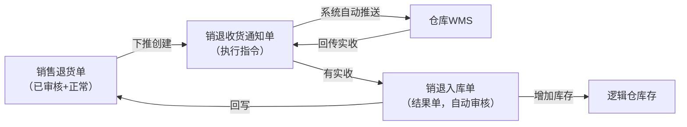
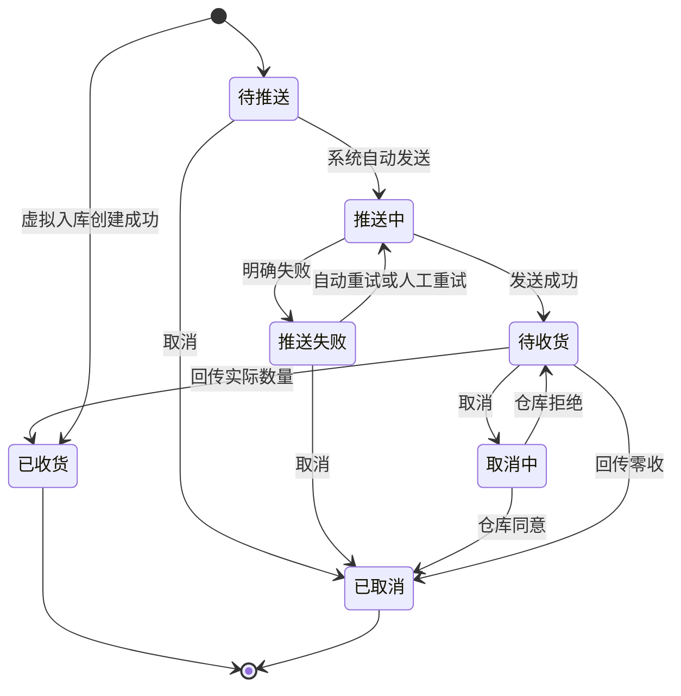

# 销退收货通知单主PRD

> 用途：定义销退收货通知单在ERP中的创建、仓库收货或虚拟入库、取消、收货回写及与销售退货单的数量衔接，作为研发实现和测试验收的依据。
> 定位：应用设计层文档。业务规则以[《销售与履约需求分析》](../../../../../02-需求调研和分析/04-销售与履约/销售与履约需求分析.md)和[《销售与履约业务设计》](../../../../../03-业务分析和设计/02-销售与履约业务设计.md)为准；状态与操作以[《单据与状态流转》](../../../系统架构和流程/03-单据与状态流转.md)第三节为准（执行指令单，与采购收货通知单复用同一套状态，收货版）；字段与取值以[《销退收货通知单（详细稿）》](../../../字段清单合集/销售相关/销退收货通知单（详细稿）.tsv)为准；页面骨架见[《销退收货通知单页面骨架》](销退收货通知单页面骨架.md)；页面交互以[前端Demo版PRD](前端Demo版PRD/)为准，**须服从本文 §6.4 状态—功能矩阵**。
> 不写什么：不重复需求论证；不写销退入库单内部流程（见[《销退入库单主PRD》](../销退入库单/销退入库单主PRD.md)）；不写仓库WMS作业细节与接口报文；不写系统权限与API设计。

| 版本 | 本次变化 | 状态 |
| --- | --- | --- |
| V0.1 | 建立销退收货通知单主PRD，汇总已确认结论与页面分工 | 初稿，待评审 |
| V0.2 | 列表补客户列与商品编码/条码筛选，明细单列商品编码；Q05等三项确认（用户确认） | 初稿，待评审 |

## 1. 文档信息与阅读边界

| 项目 | 内容 |
| --- | --- |
| 读者 | 研发工程师、测试工程师、产品复核 |
| 业务依据 | [《销售与履约需求分析》](../../../../../02-需求调研和分析/04-销售与履约/销售与履约需求分析.md) SAL-FR05、SAL-FR06；[《销售与履约业务设计》](../../../../../03-业务分析和设计/02-销售与履约业务设计.md)第四节 |
| 字段依据 | [《销退收货通知单（详细稿）》](../../../字段清单合集/销售相关/销退收货通知单（详细稿）.tsv) |
| 状态依据 | [《单据与状态流转》](../../../系统架构和流程/03-单据与状态流转.md)第三节 |
| 页面依据 | [《销退收货通知单页面骨架》](销退收货通知单页面骨架.md)、[前端Demo版PRD](前端Demo版PRD/) |

关联资料：[《销售退货单主PRD》](../销售退货单/销售退货单主PRD.md)、[《01-系统流程与单据交互》](../../../系统架构和流程/01-系统流程与单据交互.md)第六节、[《02-实体对象关系》](../../../系统架构和流程/02-实体对象关系.md)、[《00-系统与模块地图》](../../../系统架构和流程/00-系统与模块地图.md)（单据总表：销售管理-销退收货通知单）。

## 2. 需求背景与目标

### 2.1 背景

B2B客户提出实物退货，销售退货单审核通过后，销售人员按退货安排通知仓库本次收货。销退收货通知单把「本次要收多少、入哪个仓、怎么收」交给仓库执行，是退货安排与实际入库之间的执行指令。

没有统一的通知单时，仓库不知道本次应收数量和入哪个仓，销售也难以追踪在途安排与实收差异，更无法按批次控制退货额度。

### 2.2 目标

- 从已审核销售退货单下推创建通知单，录入本次通知数量，选择收货处理方式（默认仓库收货）；
- 仓库收货：创建后由系统自动推送仓库，不需要人工再点推送；
- 虚拟入库：不推仓库，创建成功后实收等于通知数量，通知变为已收货，系统立即生成已审核销退入库单并增加指定逻辑仓库存；
- 通知创建即占用销售退货单可下推量；取消成功或收货完成后按规则释放或替代占用；
- 一张通知单只执行一次收货，允许少收、不允许超过通知量接收，缺量通过展示呈现，补收另建通知单；虚拟入库不允许缺量或零收；
- 仓库回传实收后更新通知状态并触发销退入库单生成；实收为0按零收取消、不生成销退入库单。

通知单不直接增减库存，也不直接向推送财务ERP；库存与业财影响由销退入库单承担。

## 3. 需求范围

### 3.1 本期范围

- 销退收货通知单列表、详情；
- 从销售退货单下推创建（录入通知数量、收货处理方式与备注）；
- 待推送、推送失败时编辑备注（推送成功后不可改）；
- 待推送/推送失败时取消；待收货时取消（进入取消中等待仓库回执）；
- 推送失败时先自动重试最多3次，仍失败可人工重试；
- 单据状态单字段维护（待推送→推送中→待收货/推送失败→已收货/已取消/取消中）；
- 与销售退货单可下推量、在途通知数量的联动；通知取消对可退额度的回补或释放。

### 3.2 功能清单

| 编号 | 功能/位置 | 本次内容 | 需求来源 |
| --- | --- | --- | --- |
| F01 | 通知单列表 | 查询（单号、来源销售退货单、客户、收货仓库、收货处理方式、单据状态、商品编码、商品条码、创建时间）、列展示（含客户列与数量进度列）、进入详情；单据状态多选筛选；勾选配合页头导出；一期批量栏无业务按钮 | SAL-FR05 |
| F02 | 下推创建页 | 从销售退货单带入单头与明细，录入通知数量、收货处理方式与备注；仓库收货则创建并触发自动推送，虚拟入库则创建后直接已收货并生成销退入库单 | SAL-FR05、SAL-FR06 |
| F03 | 编辑备注 | 待推送、推送失败时可改备注；推送成功后（含待收货）不可改；通知数量创建后不可改 | SAL-FR05 |
| F04 | 详情页 | 分区域展示推送与收货结果、终止信息按状态显示 | SAL-FR05、SAL-FR06 |
| F05 | 取消 | 待推送、推送失败时直接取消；按退货单开放与否回补可下推量或释放可退额度 | SAL-FR06 |
| F06 | 取消（待收货） | 待收货时点「取消」，向仓库发起取消并进入取消中；界面上与 F05 同称「取消」 | SAL-FR06 |
| F07 | 重试推送 | 自动重试满3次仍失败后，由操作人重试，回到推送中 | SAL-FR05 |
| F08 | Demo Mock | 模拟仓库回传、推送状态变化；仅Demo | 演示需要，非业务规则 |

### 3.3 需求追溯

| 上游场景与需求 | 本 PRD 功能 | 本 PRD 验收 |
| --- | --- | --- |
| SAL-FR05：下推创建、收货处理方式、自动推送、虚拟入库生成销退入库单 | F02、F04 | AC01、AC11 |
| SAL-FR06：额度占用与回补、允许少收、零收取消、不超通知量、关闭与取消衔接 | F02、F04、F05、F06 | AC02、AC03、AC05、AC06、AC07 |
| SAL-AC09：分批收货额度回补、不超通知接收、实收0按零收取消 | F02、F04、F05 | AC02、AC03、AC05 |
| SAL-AC24：可下推40件创建收货通知并选虚拟入库 | F02、F04 | AC11 |

### 3.4 非本期范围

- 列表页「新增」入口（通知单只能从销售退货单下推创建）；
- 通知单导入；
- 往已结束通知单补收、修改通知数量；
- 人工推送按钮（创建后系统自动推送）；
- 销退入库单页面与推送财务ERP细节；
- 系统权限矩阵、API/表结构/并发锁实现。

| 范围补充 | 说明 |
| --- | --- |
| 适用对象 | B2B销售退货收货；收货仓库沿用来源销售退货单（溯源退货为原出库单仓库） |
| 与销售退货单Mock | 销售退货单审核后Demo Mock生成的通知单，正式规则以本文下推创建为准 |
| 与原型差异 | 09原型尚未实现本模块页面，页面与交互以本套PRD为准 |

## 4. 单据定位与业务边界

### 4.1 业务作用

| 项目 | 内容 |
| --- | --- |
| 单据层级 | 第2层——执行指令单，表达本次仓库收货要求 |
| 核心职责 | 记录本次通知收多少、入哪个仓、来源哪张销售退货单 |
| 单据来源 | 销售退货单下推创建；一期唯一方式 |
| 下游单据 | 销退入库单；仓库回传实收并结束后由系统生成并自动审核 |
| 数量关系 | 一张退货单对应多张通知单；一张通知单对应0或1张销退入库单（零收不生成） |
| 业务终结 | 已收货或已取消为终态；不可撤销；缺量不回原通知补收 |

### 4.2 上下游关系摘要

> 完整流程见[《01-系统流程与单据交互》](../../../系统架构和流程/01-系统流程与单据交互.md)第六节；本文只保留通知侧交接点。

### 4.3 业务对象关系

| 关系 | 说明 |
| --- | --- |
| 销售退货单 : 销退收货通知单 | 1:N；分批创建 |
| 销退收货通知单 : 销退入库单 | 1:0..1；零收不生成销退入库单 |
| 通知单明细 : 销售退货单明细 | N:1；按来源退货单行累计占用与回写 |
| 销退收货通知单 : 收货仓库 | N:1；沿用来源退货单收货仓库（溯源退货为原出库单仓库） |
| 销退收货通知单 : 客户 | N:1；沿用来源销售退货单的客户 |
| 销退收货通知单 : 原销售出库单 | 经来源退货单间接关联；溯源退货的可退额度占用在退货单与原出库单之间维护，本单不直接维护额度 |

### 4.4 本单据不负责的事项

- 通知单不直接增加库存；库存变化由已审核销退入库单确认后触发；
- 通知单不向推送财务ERP；财务ERP只接收销退入库结果单；
- 通知单不修改销售退货单的数量与价格约定；
- 已收货通知不能再往原单追加收货；少收部分通过缺收数量展示，补收另建通知单；
- 超通知到货在仓库侧拒收，通知侧通过实收不超过通知量体现。

## 5. 核心业务场景索引

| 场景ID | 场景 | 类型 | 说明 |
| --- | --- | --- | --- |
| S01 | 下推创建并一次收足 | 主流程 | 下推→自动推送→待收货→回传实收=通知量→已收货→生成销退入库单 |
| S02 | 下推创建并少收 | 主流程 | 实收<通知量并结束→已收货+缺收展示→退货单可下推量回补缺量 |
| S03 | 仓库零收 | 支线 | 回传实收0→已取消，释放全部通知占用，不生成销退入库单 |
| S04 | 推送失败重试 | 支线 | 推送失败→自动重试最多3次→仍失败可人工重试→待收货；失败期间仍占用可下推量 |
| S05 | 推送前取消 | 支线 | 待推送→取消→已取消；退货单开放回补可下推量并保留可退额度占用 |
| S06 | 待收货取消 | 支线 | 待收货→取消→取消中→仓库同意→已取消 |
| S07 | 仓库拒绝取消 | 支线 | 取消中→仓库拒绝→待收货；期间到达的实际结果按真实结果处理 |
| S08 | 分批收货 | 主流程 | 同一退货单多次下推，每次占用对应可下推量 |
| S09 | 虚拟入库 | 主流程 | 下推时选虚拟入库→不推仓库→通知已收货、实收=通知数量→生成已审核销退入库单（SAL-AC24示例：40件） |

## 6. 状态与操作

状态定义 owner：[《单据与状态流转》](../../../系统架构和流程/03-单据与状态流转.md)第三节。销退收货通知单与采购收货通知单复用同一套执行指令状态，用**单据状态**一个字段串起推送与执行，不设审核状态，也不设「部分收货」流程状态；缺量通过明细「缺收数量」展示。状态枚举与[《销退收货通知单（详细稿）》](../../../字段清单合集/销售相关/销退收货通知单（详细稿）.tsv)一致。

### 6.1 状态维度

| 维度 | 取值 | 说明 |
| --- | --- | --- |
| 单据状态 | 待推送、推送中、推送失败、待收货、取消中、已收货、已取消 | 控制可执行操作与是否占用退货单可下推量 |

### 6.2 状态取值说明

| 状态 | 含义 | 是否终态 |
| --- | --- | --- |
| 待推送 | 已创建，等待系统自动发送 | 否 |
| 推送中 | 正在向仓库发送，结果未确定 | 否 |
| 推送失败 | 仓库明确未接收；系统自动重试最多3次，仍失败可人工重试或取消 | 否 |
| 待收货 | 仓库已接收指令，等待回传最终结果 | 否 |
| 取消中 | 已发起取消，等待仓库回执 | 否 |
| 已收货 | 仓库已回传实际数量并结束 | 是 |
| 已取消 | 通知不再执行（含零收取消） | 是 |

### 6.3 状态流转图

虚拟入库不经过待推送、推送中、待收货：创建成功即已收货，并生成销退入库单。上图实线为仓库路径。

### 6.4 状态—功能矩阵

> ✅ = 允许；❌ = 不允许；✅（条件）= 须满足对应规则。F01 查询/查看各状态均可用，不重复列出。

| 动作 | 待推送 | 推送中 | 推送失败 | 待收货 | 取消中 | 已收货 | 已取消 |
| --- | --- | --- | --- | --- | --- | --- | --- |
| 下推创建（F02） | — | — | — | — | — | — | — |
| 编辑备注（F03） | ✅ | ❌ | ✅ | ❌ | ❌ | ❌ | ❌ |
| 取消（F05） | ✅ | ❌ | ✅（R09） | ❌ | ❌ | ❌ | ❌ |
| 取消（待收货）（F06） | ❌ | ❌ | ❌ | ✅ | ❌ | ❌ | ❌ |
| 重试推送（F07） | ❌ | ❌ | ✅ | ❌ | ❌ | ❌ | ❌ |
| 详情/追溯（F04） | ✅ | ✅ | ✅ | ✅ | ✅ | ✅ | ✅ |
| Demo Mock（F08） | ✅（Demo） | ✅（Demo） | ✅（Demo） | ✅（Demo） | ✅（Demo） | ❌ | ❌ |

说明：

- F02 只能从销售退货单列表/详情「下推通知单」进入，不在通知单列表提供新增入口。
- 推送中、取消中：仅查看与等待，不提供取消、重试、编辑。自动重试在推送失败后由系统发起，不占用人工按钮。
- 已收货、已取消：仅查看与追溯。

列表与详情行内操作按状态互斥展示；列表批量操作栏一期仅展示已选中计数与列设置，不提供批量取消；导出在页头，导出可选已勾选范围。

### 6.5 状态流转表

| 当前状态 | 动作 | 前置条件 | 结果状态 | 二次确认 | 后置影响 | 失败处理 |
| --- | --- | --- | --- | --- | --- | --- |
| — | 下推创建 | 来源退货单已审核+正常+有可下推量（R02）；通知数量校验（R03）；选择收货处理方式 | 仓库收货→待推送；虚拟入库→已收货 | 见 Demo PRD | 分配单号（R01）；占用退货单可下推量（R04）；仓库收货触发自动推送（R05）；虚拟入库按 R13 生成销退入库单 | 校验失败定位字段/行；虚拟入库生成失败则整笔回滚 |
| 待推送 | 自动推送 | 系统作业 | 推送中 | 无 | — | — |
| 推送中 | 推送成功 | 仓库确认接收 | 待收货 | 无 | 记录推送时间 | — |
| 推送中 | 推送失败 | 仓库明确未接收 | 推送失败 | 无 | 记录推送失败原因；仍占用可下推量；触发自动重试（R14） | — |
| 推送失败 | 自动重试 | 未达3次（R14） | 推送中 | 无 | — | 仍失败则保持推送失败 |
| 推送失败 | 人工重试 | 操作人触发（F07） | 推送中 | 见 Demo PRD | — | — |
| 待推送/推送失败 | 取消 | 推送失败时须确认仓库未接收（R09） | 已取消 | 必填取消原因 | 退货单开放→回补可下推量并保留原出库可退额度占用；退货单已关闭→释放相应可退额度、不允许继续安排 | — |
| 待收货 | 取消 | — | 取消中 | 见 Demo PRD | 等待仓库回执；期间仍占用可下推量 | — |
| 取消中 | 仓库同意 | 仓库回执 | 已取消 | 无 | 按退货单开放与否执行回补或释放（R09口径）；记录取消信息 | — |
| 取消中 | 仓库拒绝 | 仓库回执 | 待收货 | 无 | 继续等待收货 | — |
| 待收货 | 收货回传 | 实收≤通知量（R06） | 已收货 | 自动 | 回写实收、缺收；生成销退入库单；以实收替代占用、缺量回补退货单 | 超量拒绝 |
| 待收货 | 零收回传 | 实收=0并结束（R07） | 已取消 | 自动 | 释放全部通知占用；不生成销退入库单 | — |
| 任意非终态 | 销售退货单随单取消 | 退货单取消且通知为待推送/推送失败 | 已取消 | 随退货单 | 按 R09 口径回补或释放 | — |

## 7. 核心业务规则

### 7.1 创建与下推规则

| 规则编号 | 主题 | 规则 | 边界或例外 |
| --- | --- | --- | --- |
| R01 | 单号 | 按[《6.强盛ERP的编码规则和通用字段规则》](../../../../../01-全局背景信息/6.强盛ERP的编码规则和通用字段规则.md)第一节自动生成；前缀 XTSHTZ；保存时分配 | 用户不可编辑 |
| R02 | 来源退货单 | 只能来自已审核、业务状态正常、有可下推数量的销售退货单 | 退货单已关闭/已取消不可下推 |
| R03 | 通知数量 | 每行>0；≤该行当前可下推数量；至少一行有通知数量；不同SKU不互抵；下推创建页默认带出各行可下推数量，可修改 | 创建后不可修改 |
| R04 | 占用 | 通知创建即占用来源退货单可下推量，计入在途通知数量 | 推送失败、待收货、取消中仍占用 |
| — | 单头继承 | 来源销售退货单、客户、收货仓库、商品明细沿用来源退货单；用户可改通知数量、收货处理方式与备注 | 不带价格字段；客户按Code-Name展示；收货仓库溯源退货为原出库单仓库，不可切换 |

数量口径（[《单据与状态流转》](../../../系统架构和流程/03-单据与状态流转.md)第六节）：退货可下推数量＝退货数量−已结束通知的实收数量−未结束有效通知的通知量；已取消的通知不占额度。

数量示例（标明为示例）：退货单行 SKU-A 可下推 420 件，下推通知 400 件后，该行可下推变为 20、在途通知 +400；该通知实收 380 并结束后，累计实退 +380，可下推回补为 40（20+缺收20）。SAL-FR06 口径示例：退货 100 件、通知 60 件、实收 50 件结束后，还能再安排 50 件。

### 7.2 推送规则

| 规则编号 | 主题 | 规则 | 边界或例外 |
| --- | --- | --- | --- |
| R05 | 自动推送 | 收货处理方式=仓库收货时，通知创建后由系统自动推送仓库，不需要人工触发推送按钮 | 虚拟入库不推送 |
| R14 | 自动重试 | 推送明确失败后系统自动重试，**最多3次**；3次仍失败则保持「推送失败」，可人工重试（F07） | 间隔本期不定秒数，由技术配置 |
| — | 推送中等待 | 推送结果不确定时不得重复发送、不得提前释放占用 | 先核实仓库是否收到 |
| — | 推送记录 | 记录推送时间、推送失败原因；重试成功后仍保留历史失败原因 | 见字段清单 |

### 7.3 收货回写与数量规则

| 规则编号 | 主题 | 规则 | 边界或例外 |
| --- | --- | --- | --- |
| R06 | 实收上限 | 实收数量 0～通知数量；按来源退货单行回写；**允许少收** | 超通知量拒绝 |
| R07 | 零收 | 仓库最终回传实收0并结束时，通知按零收取消为已取消，不生成销退入库单 | 须收到最终结果，不能把未知当零收 |
| — | 缺收 | 缺收数量=通知数量−实收数量；收货完成后计算展示 | 不在原通知补收，补收另建通知单 |
| — | 占用替代 | 收货完成后，以实收数量替代原通知占用；缺量部分回补退货单可下推量 | 见 SAL-FR06、SAL-AC09 |
| R11 | 不超通知收货 | 仓库不得按超过通知量的结果完成本通知 | 有余量另建通知 |
| R13 | 虚拟入库 | 收货处理方式=虚拟入库时，不调用仓库接口；创建成功后各行实收=通知数量、缺收=0，通知变为已收货，系统立即生成已审核销退入库单并增加指定逻辑仓库存、消耗对应可退额度占用；占用被实际数量替代 | 不允许缺量或零收；保存后不可改处理方式（处理方式写在通知单上，不写在退货单上）；生成失败则整笔回滚，不留下通知；已收货后不能取消 |

### 7.4 取消规则

| 规则编号 | 主题 | 规则 | 边界或例外 |
| --- | --- | --- | --- |
| R09 | 直接取消 | 待推送可直接取消；推送失败须在确认仓库未接收后取消 | 取消成功后：**退货单仍开放→回补可下推量并保留原出库可退额度占用；退货单已关闭→释放相应可退额度、不允许继续安排**（SAL-FR06） |
| R10 | 待收货取消 | 待收货点「取消」，进入取消中等待仓库回执 | 取消中仍占用；仓库同意才按 R09 口径回补或释放 |
| — | 不可撤销 | 已收货、已取消为终态，不可反取消 | — |
| — | 随退货单取消 | 销售退货单取消时，待推送/推送失败的通知随单取消 | 待收货/取消中/推送中须先处理通知；已推送通知须仓库确认取消成功，拒绝则恢复取消前状态 |
| — | 关闭衔接 | 退货单关闭后不可新增通知；已有通知继续收货至结束 | 关闭只停止新增安排，不撤销已有通知 |

### 7.5 字段编辑规则

| 规则编号 | 主题 | 规则 | 边界或例外 |
| --- | --- | --- | --- |
| R12 | 可编辑范围 | 仅备注可在待推送、推送失败时编辑；推送成功后（含待收货）整单只读；通知数量、收货处理方式创建后只读 | 推送中、取消中、终态不可编辑 |

### 7.6 业务生效点

| 业务动作 | 通知单影响 | 库存影响 | 业财/外部影响 |
| --- | --- | --- | --- |
| 下推创建（仓库收货） | 产生待推送通知；占用退货单可下推量 | 无 | 触发向仓库推送 |
| 下推创建（虚拟入库） | 产生已收货通知；实收=通知数量；占用被实际数量替代 | 无（由销退入库单记账） | 不推仓库；生成已审核销退入库单并推财务ERP |
| 推送成功 | 单据状态→待收货 | 无 | 仓库开始执行 |
| 收货回传（有实收） | 已收货；回写实收、缺收 | 无（由销退入库单记账） | 生成销退入库单，增加指定逻辑仓库存 |
| 零收回传 | 已取消 | 无 | 不生成销退入库单、不推财务ERP |
| 取消成功 | 已取消 | 无 | 退货单开放→回补可下推量、保留可退额度占用；退货单已关闭→释放相应可退额度 |

### 7.7 字段校验绑定

完整字段见 TSV。摘要：

| 校验时机 | 要求 |
| --- | --- |
| 下推创建 | 来源退货单合法（R02）；至少一行通知数量>0（R03）；每行≤可下推量；收货处理方式必填 |
| 编辑备注 | 状态允许（R12）；备注非必填 |
| 取消 | 状态允许；取消原因必填；待收货取消进入取消中等待仓库回执 |

页面控件、错误文案见 Demo PRD 弹窗章节。

## 8. 功能需求说明（页面索引）

| 编号 | 页面/位置 | 规则与状态依据 | Demo PRD |
| --- | --- | --- | --- |
| F01 | 列表 | §6.4 | [列表页](前端Demo版PRD/销退收货通知单前端Demo版PRD_列表页.md) |
| F02 | 下推创建 | R01～R05、R13；§6.5 | [新增编辑页](前端Demo版PRD/销退收货通知单前端Demo版PRD_新增编辑页.md) |
| F03 | 编辑备注 | R12；§6.4 | 新增编辑页（编辑模式） |
| F04 | 详情 | R06～R07、R09～R10；§6.4 | [详情页](前端Demo版PRD/销退收货通知单前端Demo版PRD_详情页.md) |
| F05/F06 | 取消 | R09～R10；§6.4 | [弹窗与Mock](前端Demo版PRD/销退收货通知单前端Demo版PRD_弹窗与Mock.md) §2、§3 |
| F07 | 重试推送 | R14、F07；§6.5 | 弹窗 PRD §4 |
| F08 | Demo Mock | 非正式验收 | 弹窗 PRD §5 |

## 9. 上下游影响与协同

| 关联模块/系统 | 需要配合的变化 | 交接内容与时机 | 验收结果 |
| --- | --- | --- | --- |
| 销售退货单 | 下推来源与占用回写 | 已审核+正常+有可下推量时创建；创建/取消/收货后更新可下推量与在途通知数量 | 数量与销售退货单主PRD下推口径一致 |
| 原销售出库单 | 溯源退货的可退额度占用与释放 | 退货单审核时占用；通知取消且退货单已关闭时释放相应可退额度 | SAL-FR06、SAL-AC09 |
| 仓库/WMS | 接收推送、回传实收、取消回执 | 通知创建后自动推送；回传结束本次执行 | 状态按 §6.3 流转 |
| 销退入库单 | 由回传或虚拟入库触发生成并自动审核 | 有实收且结束后生成；零收不生成 | 入库PRD定义；SAL-AC24 |
| 库存 | 不直接记账 | — | 仅已审核销退入库单增加指定逻辑仓库存 |
| 财务ERP | 不推送通知单 | — | 只推销退入库结果单 |

## 10. 关联文档与阅读入口

| 关联内容 | 阅读入口 | 本 PRD 与其边界 |
| --- | --- | --- |
| 销售退货单 | [《销售退货单主PRD》](../销售退货单/销售退货单主PRD.md) | 下推来源、可下推量与可退额度 owner 在退货单侧 |
| 销售退货流程 | [《01-系统流程与单据交互》](../../../系统架构和流程/01-系统流程与单据交互.md)第六节 | 完整角色接力；本文只写通知侧 |
| 状态与操作 | [《单据与状态流转》](../../../系统架构和流程/03-单据与状态流转.md)第三节 | 状态 owner；本文矩阵与 Demo 须一致 |
| 对象关系 | [《02-实体对象关系》](../../../系统架构和流程/02-实体对象关系.md) | 实体级关系；本文 §4.3 为业务摘要 |
| 字段定义 | [《销退收货通知单（详细稿）》](../../../字段清单合集/销售相关/销退收货通知单（详细稿）.tsv) | TSV 为字段 owner |
| 页面结构 | [《销退收货通知单页面骨架》](销退收货通知单页面骨架.md) | 区域与线框走查，非规则权威 |
| 页面交互 | [前端Demo版PRD](前端Demo版PRD/) | 控件、文案、Mock；服从 §6.4 |
| 销退入库 | [《销退入库单主PRD》](../销退入库单/销退入库单主PRD.md) | 生成、审核、推送财务ERP不在本文 |

## 11. 异常与一致性

### 11.1 并发操作

| 场景 | 业务处理结果 |
| --- | --- |
| 两人同时对同一退货单下推 | 各自校验可下推量；后创建者若额度不足则阻断 |
| 下推同时退货单被关闭 | 关闭成功后不可再下推；进行中的下推校验失败并提示 |
| 推送中重复触发重试 | 自动重试与人工重试同时只允许一个作业成功；另一个提示状态已变化 |

### 11.2 幂等与重复处理

| 操作 | 幂等规则 |
| --- | --- |
| 仓库回传 | 同一最终结果不得重复生成销退入库单或重复计入实收 |
| 取消回执 | 重复到达的同意/拒绝回执只保持一致终态 |

### 11.3 与上下游单据一致性

| 场景 | 处理方式 |
| --- | --- |
| 退货单关闭后 | 不可新建通知；已有通知继续执行至结束 |
| 取消中收到实收回传 | 按真实结果完成收货，不以取消申请覆盖已发生事实 |
| 退货单随单取消 | 仅待推送/推送失败通知随单取消；其余须先处理；已推送通知须仓库确认 |

## 12. 验收标准与待确认事项

### 12.1 验收标准

| 编号 | 对应功能/规则 | 条件与操作 | 预期结果 |
| --- | --- | --- | --- |
| AC01 | F02/R03、R04 | 退货单行可下推420，下推通知400 | 通知创建成功；该行可下推变20、在途+400；单号按 XTSHTZ 规则生成 |
| AC02 | F04/R06 | 通知400，仓库回传380并结束 | 已收货；实收380、缺收20；退货单累计实退+380、可下推回补含缺量20（SAL-AC09：退货100、通知60、实收50结束后还能安排50）；生成销退入库单 |
| AC03 | F04/R11 | 收货超过通知量 | 仓库侧不超通知收货；超出部分不记入本通知 |
| AC04 | F07/R05、R14 | 推送明确失败 | 自动重试最多3次；仍失败则保持推送失败，可人工重试；失败期间仍占用可下推量 |
| AC05 | F05/R07 | 仓库回传实收0并结束 | 已取消；释放全部通知占用；不生成销退入库单；保留回传记录 |
| AC06 | F06/R10 | 待收货取消，仓库同意 | 已取消；退货单开放→可下推量回补、保留原出库可退额度占用；记录取消原因与时间 |
| AC07 | F05/R09 | 待推送直接取消；另测退货单已关闭场景 | 退货单开放→已取消、可下推量全额回补、可退额度占用保留；退货单已关闭→释放相应可退额度、不允许继续安排（SAL-FR06） |
| AC08 | F03/R12 | 已收货通知尝试改数量 | 不可改；备注也不可编辑 |
| AC09 | F01 | 列表筛选单据状态 | 多选 OR 匹配；列与 TSV 一致 |
| AC10 | F08 | Demo Mock 模拟回传 | 仅 Demo 可用；正式验收以仓库回传为准 |
| AC11 | F02/R13 | 已审核销退单可下推40，下推通知40并选虚拟入库（SAL-AC24） | 不推仓库；通知已收货，实收40、缺收0；生成已审核销退入库单40件；指定逻辑仓库存+40 |
| AC12 | F06 | 待收货取消，仓库拒绝 | 恢复待收货；不提前释放占用 |

### 12.2 待确认事项

| 编号 | 问题 | 影响范围 | 状态/结论 |
| --- | --- | --- | --- |
| Q01 | 列表默认排序字段 | F01 | **已确认**：通知单按创建时间倒序 |
| Q02 | 下推创建页默认是否带出全部可下推量 | F02 | **已确认**：默认带出各行可下推数量，可修改 |
| Q03 | 详情页是否一期展示关联销退入库单入口 | F04 | **已确认**：已收货时展示「关联单据」分组（销退入库单 Tab + 简表），单号跳转销退入库单详情 |
| Q04 | 推送失败自动重试次数与间隔 | R14、F07 | **已确认**：自动重试最多3次；间隔本期不定秒数，由技术配置；3次后可人工重试 |
| Q05 | 列表是否展示客户 | F01 | **已确认**（2026-09-22）：TSV已补客户行，列表与详情展示客户并可筛选，沿用来源销售退货单的客户（用户确认） |
| Q06 | 列表查询是否拆「商品编码」「商品条码」两个搜索框 | F01 | **已确认**（2026-09-22，用户选择）：TSV已补商品编码、商品条码两行；编码模糊匹配，条码多条码任一条码命中即可 |
| Q07 | 明细是否单列商品编码（与销售发货通知单一致） | F01、F04 | **已确认**（2026-09-22，用户确认）：TSV已补商品编码行，明细与列表侧按商品编码单列呈现 |
