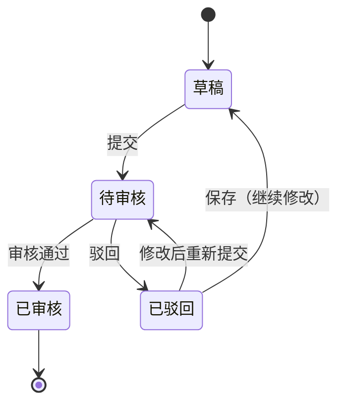

# 采购价格调整单主PRD

> 用途：定义采购价格调整单在ERP中的建单、提交、审核、驳回及审核通过后更新采购价目表当前价的系统行为，作为研发实现和测试验收的依据。
> 定位：应用设计层文档。业务规则以[《价格管理需求分析》](../../../../../02-需求调研和分析/06-价格管理/价格管理需求分析.md)（PRI-FR02、PRI-FR04、PRI-FR06）和[《价格业务设计》](../../../../../03-业务分析和设计/04-价格业务设计.md)为准；状态与操作以[《单据与状态流转》](../../../系统架构和流程/03-单据与状态流转.md)第一节为准；字段与取值以[《采购价格调整单（详细稿）》](../../../字段清单合集/价格相关/采购价格调整单/采购价格调整单（详细稿）.tsv)为准；页面骨架见[《采购价格调整单页面骨架》](采购价格调整单页面骨架.md)；页面交互以[前端Demo版PRD](前端Demo版PRD/)为准，**须服从本文 §6.4 状态—功能矩阵**。
> 不写什么：不重复需求论证；不写采购价目表的查询与取价细节，见[《采购价目表主PRD》](../采购价目表/采购价目表主PRD.md)；不写采购订单、采购退货单自身流程；不写系统权限与接口报文。

| 版本 | 本次变化 | 状态 |
| --- | --- | --- |
| V0.1 | 建立采购价格调整单主PRD：状态链、审核生效写入价目表、价税规则、取价协同与验收 | 初稿，待评审 |
| V0.2 | 9条待确认收口为已定（2026-09-23）：采购侧税率由用户手动填写、已驳回允许删除、导入一期不做、不保存调价前价格 | 初稿，待评审 |

## 1. 文档信息与阅读边界

| 项目 | 内容 |
| --- | --- |
| 读者 | 研发工程师、测试工程师、产品复核 |
| 业务依据 | [《价格管理需求分析》](../../../../../02-需求调研和分析/06-价格管理/价格管理需求分析.md) PRI-FR02、PRI-FR04、PRI-FR06；[《价格业务设计》](../../../../../03-业务分析和设计/04-价格业务设计.md)§4.2、§6.3 |
| 字段依据 | [《采购价格调整单（详细稿）》](../../../字段清单合集/价格相关/采购价格调整单/采购价格调整单（详细稿）.tsv) |
| 状态依据 | [《单据与状态流转》](../../../系统架构和流程/03-单据与状态流转.md)第一节（状态owner为外部文档） |
| 页面依据 | [《采购价格调整单页面骨架》](采购价格调整单页面骨架.md)、[前端Demo版PRD](前端Demo版PRD/) |

关联资料：[《采购价目表主PRD》](../采购价目表/采购价目表主PRD.md)、[《采购订单主PRD》](../../2-采购管理/采购订单/采购订单主PRD.md)（R04取价）、[《采购退货单主PRD》](../../4-采购退货管理/采购退货单/采购退货单主PRD.md)（R04取价）、[《6.强盛ERP的编码规则和通用字段规则》](../../../../../01-全局背景信息/6.强盛ERP的编码规则和通用字段规则.md)。

## 2. 需求背景与目标

### 2.1 背景

采购价格会因供应商、商品和币别变化，采购人员需要一种可审核、可追溯的方式新增或修改当前采购价。没有价格调整单时，价格只能直接改，改了什么、谁批的、什么时候生效都缺少凭据；已保存的单据也容易被静默改价。

### 2.2 目标

- 用一张调整单表达一次采购调价：一个供应商、一个币别、多个商品明细；
- 审核通过才生效，审核通过后立即新增或覆盖采购价目表的当前价；
- 已审核的调整单不可修改、删除、撤销或反审核，发现错误再建一张调整单纠正；
- 调价只影响之后的新单，已保存的业务单据价格不变。

审核前价格和明细可改；提交后单头和明细锁定，只等审核或驳回。

## 3. 需求范围

### 3.1 本期范围

- 采购价格调整单列表、新增、编辑、详情；
- 草稿保存、提交、审核、驳回、驳回后修改重新提交；
- 草稿与已驳回删除（一期必做，Q02已定）；
- 审核通过后按明细新增或覆盖采购价目表当前价；
- 按状态展示页头操作；列表页头导出按导出中心，导入一期不做（Q03已定）。

### 3.2 功能清单

| 编号 | 功能/位置 | 本次内容 | 需求来源 |
| --- | --- | --- | --- |
| F01 | 采购价格调整单列表 | 查询、列展示、行内操作入口；审核状态筛选项多选；勾选配合页头导出 | PRI-FR06 |
| F02 | 新增/编辑页 | 维护供应商、币别、备注与商品明细；草稿保存 | PRI-FR02、PRI-FR04、PRI-FR06 |
| F03 | 提交 | 草稿或已驳回提交；校验单头与明细完整 | PRI-FR06、COM-FR01 |
| F04 | 审核/驳回 | 待审核审核通过或驳回；驳回留意见 | PRI-FR06、COM-FR01 |
| F05 | 详情与生效追溯 | 分区域展示、驳回信息按状态显示、跳转价目表核对生效结果 | PRI-FR06、《价格业务设计》§5.2 |
| F06 | 草稿删除 | 草稿和已驳回可删除（Q02已定） | PRI-FR06 |
| F07 | Demo Mock | 审核通过后本地更新价目表，便于连续演示取价；仅Demo | 演示需要，非业务规则 |

### 3.3 需求追溯

| 上游场景与需求 | 本 PRD 功能 | 本 PRD 验收 |
| --- | --- | --- |
| PRI-FR06：价格调整单新增或修改价格 | F01～F05 | AC01、AC02、AC03 |
| PRI-FR06：审核通过立即覆盖当前价 | F04、F05 | AC04、AC05 |
| PRI-FR06、PRI-AC08：非法价格阻断、错价再调 | F02、F03、F05 | AC02、AC06 |
| PRI-FR02、PRI-FR05：价格归属与不回溯 | F02、F04 | AC04、AC07 |
| COM-FR01：提交与审核权限 | F03、F04 | AC01 |

### 3.4 非本期范围

- 价目禁用、禁用后按客户价或等级价回退、价格历史表、未来价格排期；
- 反审核、撤销已审核调整单、修改已审核单据；
- 采购价格调整单导入、系统权限矩阵、API/表结构/并发锁实现；
- 财务审核价格（财务不是默认审核方）。

| 范围补充 | 说明 |
| --- | --- |
| 适用对象 | 成品采购；一张调整单一个供应商、一个币别，明细可包含多个SKU |

## 4. 单据定位与业务边界

### 4.1 业务作用

| 项目 | 内容 |
| --- | --- |
| 单据层级 | 第1层——业务安排单，表达一次采购调价的申请与审核凭据 |
| 核心职责 | 记录向哪个供应商、按哪个币别、对哪些商品把当前采购价调成多少 |
| 单据来源 | 采购业务人员人工创建；一期唯一方式 |
| 下游单据 | 不生成下游单据；审核通过后系统写入采购价目表当前价 |
| 数量关系 | 调整单只有单价，不含数量和金额，因此不汇总价税合计、税额和金额 |
| 业务终结 | 已审核为终态；不可修改、删除、撤销或反审核，发现错误另建调整单 |

### 4.2 上下游关系摘要

> 完整流程见[《01-系统流程与单据交互》](../../../系统架构和流程/01-系统流程与单据交互.md)；本文只保留调整单侧交接点。

### 4.3 业务对象关系

| 关系 | 说明 |
| --- | --- |
| 采购价格调整单 : 供应商 | N:1；一张单一个供应商，只表示价格归属 |
| 采购价格调整单 : 商品明细 | 1:N；明细可包含多个SKU，同一商品只能出现一次 |
| 采购价格调整单 : 采购价目表 | 1:N；审核通过后按明细新增或覆盖当前价 |
| 采购价格调整单 : 商品 | 明细引用启用的成品SKU；不建立供货关系 |

### 4.4 本单据不负责的事项

- 不直接修改业务单据：调价不回溯，已保存单据价格不变；
- 不产生库存、不推送金蝶、不参与应收应付；
- 不维护数量、金额和结算条件；
- 不承担价格禁用和回退，错价用新的调整单覆盖。

## 5. 核心业务场景索引

| 场景ID | 场景 | 类型 | 说明 |
| --- | --- | --- | --- |
| S01 | 新增价格 | 主流程 | 调价组合原来没有价目记录→草稿→提交→审核通过→价目表新增一条当前价 |
| S02 | 修改已有价格 | 主流程 | 调价组合已有价目记录→审核通过→覆盖当前价，最近调整单号更新 |
| S03 | 驳回后重新提交 | 支线 | 待审核→驳回（记录驳回意见）→已驳回→修改→重新提交 |
| S04 | 审核通过生效 | 主流程 | 已审核后新单按新价取价；已保存单据不受影响 |
| S05 | 错价再调 | 支线 | 已审核后发现价格错误→不改原单→新建调整单覆盖→前后单据都保留 |
| S06 | 草稿删除 | 支线 | 草稿或已驳回且未生效时可删除（Q02已定） |

## 6. 状态与操作

状态定义 owner：[《单据与状态流转》](../../../系统架构和流程/03-单据与状态流转.md)第一节。价格调整单有独立「已驳回」态，待审核不同意时操作为**驳回**，不叫撤回。

### 6.1 状态维度

| 维度 | 取值 | 说明 |
| --- | --- | --- |
| 审核状态 | 草稿、待审核、已审核、已驳回 | 控制编辑、提交、审核、驳回与能否删除 |

价格调整单只有审核状态一个维度，没有业务状态、收货或发货状态，也没有取消和关闭。

### 6.2 状态取值说明

| 状态 | 含义 | 是否终态 |
| --- | --- | --- |
| 草稿 | 尚未提交或保存后待修改 | 否 |
| 待审核 | 已提交，等待审核 | 否 |
| 已审核 | 审核通过，价格已写入价目表 | 是 |
| 已驳回 | 审核不同意，可修改后重新提交 | 否 |

### 6.3 状态流转图

### 6.4 状态—功能矩阵

> ✅ = 允许；❌ = 不允许；✅（条件）= 须满足括号内规则。F01 查询/查看各状态均可用，不重复列出。

| 动作 | 草稿 | 待审核 | 已审核 | 已驳回 |
| --- | --- | --- | --- | --- |
| 编辑（F02） | ✅ | ❌ | ❌ | ✅ |
| 提交（F03） | ✅ | ❌ | ❌ | ✅ |
| 审核（F04） | ❌ | ✅ | ❌ | ❌ |
| 驳回（F04） | ❌ | ✅ | ❌ | ❌ |
| 删除（F06） | ✅（R11） | ❌ | ❌ | ✅（R11） |
| 查看价目表（F05） | ❌ | ❌ | ✅ | ❌ |
| 详情/追溯（F05） | ✅ | ✅ | ✅ | ✅ |

已审核仅查看与追溯，不显示编辑、提交、删除、撤销、反审核。列表与详情行内操作按状态互斥展示，最多直出 3 个 +「更多」下拉；批量操作栏一期仅展示已选中计数与列设置。

### 6.5 状态流转表

| 当前状态 | 动作 | 前置条件 | 结果状态 | 二次确认 | 后置影响 | 失败处理 |
| --- | --- | --- | --- | --- | --- | --- |
| 草稿 | 保存 | 明细已填则校验通过（R05） | 草稿 | 无 | 分配单号（R01） | 校验失败定位字段/行 |
| 草稿 | 提交 | R06 提交校验 | 待审核 | 见Demo PRD | 单头和明细锁定 | 阻断并提示 |
| 草稿/已驳回 | 删除 | R11 | 记录移除 | 二次确认 | 不可恢复 | 不满足条件时阻断 |
| 待审核 | 审核 | 审核人操作 | 已审核 | 二次确认 | 按明细写入价目表当前价（R07） | 写入失败整单失败；状态变化时阻断 |
| 待审核 | 驳回 | 填写驳回意见 | 已驳回 | 二次确认 | 记录审核人、审核时间、驳回意见 | 状态变化时阻断 |
| 已驳回 | 保存 | R05 保存校验 | 草稿 | 无 | 保留驳回记录，可继续修改 | 校验失败定位字段/行 |
| 已驳回 | 修改后重新提交 | R06 | 待审核 | 见Demo PRD | 重新进入审核 | 阻断并提示 |
| 任意 | 查看 | — | 不变 | — | — | — |

## 7. 核心业务规则

### 7.1 创建与提交规则

| 规则编号 | 主题 | 规则 | 边界或例外 |
| --- | --- | --- | --- |
| R01 | 单号 | 按[《6.强盛ERP的编码规则和通用字段规则》](../../../../../01-全局背景信息/6.强盛ERP的编码规则和通用字段规则.md)第一节自动生成，前缀 CGJGTZ；保存草稿时分配 | 用户不可编辑、不可修改 |
| R02 | 供应商 | 只能选择审核通过且启用的供应商；一张单一个供应商；只表示价格归属，不建立供货资格 | 变更供应商后清空已填价格（PRI-FR05 条件变化清价原则） |
| R03 | 币别 | 必填；选供应商后默认带出供应商默认币别，无默认则手选；一张单一个币别 | 改供应商或改币别清空已填价格，需重新填写；不做跨币别换汇（PRI-FR04） |
| R04 | 明细与唯一性 | 明细至少一行；同一商品只能出现一次；商品为启用的成品SKU；不按该供应商是否已有价格过滤 | 重复商品阻断并定位到行（避免同单内价格冲突） |
| R05 | 价税与精度 | 明细维护含税单价和税率，不含税单价由系统计算；含税单价必须大于零；税率允许0%；采购侧税率不从商品带出、默认为空，由用户手动填写，提交前必填；不含税单价＝含税单价÷(1＋税率÷100)，四舍五入保留4位小数；税率0%时等于含税单价 | 空值、零值、负值都不能提交；零值和负值在保存时即阻断（PRI-FR06、PRI-AC08）；精度依据PRI-FR04；税率来源见Q01（2026-09-23已定） |
| R06 | 提交校验 | 单头供应商、币别完整；明细至少一行且每行商品、含税单价、税率完整；供应商审核通过且启用 | 校验失败阻断并定位到字段或明细行；提交后单头和明细锁定 |

价税计算示例（标明为示例）：含税单价113.0000元、税率13%时，不含税单价为100.0000元；税率改为10%时，不含税单价约102.7273元。调整单不含数量，因此不计算价税合计、税额和金额。

### 7.2 审核与字段锁定规则

| 规则编号 | 主题 | 规则 | 边界或例外 |
| --- | --- | --- | --- |
| R07 | 审核通过生效 | 审核通过时按明细逐行新增或覆盖采购价目表当前价（供应商＋商品＋币别），写入含税单价、税率、不含税单价和最近调整单号；任一行写入失败则整单审核失败并提示 | 写入只影响之后的新单；价目表不产生第二条记录（PRI-FR06、《采购价目表主PRD》R01） |
| R08 | 驳回 | 审核不同意时驳回，状态为已驳回并记录审核人、审核时间和驳回意见；驳回后可修改并重新提交 | 驳回意见按 REMARK_500；一期允许有权限用户审核自己创建的单据（PRI-FR06） |
| R09 | 编辑范围 | 草稿和已驳回可编辑；待审核不可改单，只可审核或驳回；已审核不可修改、删除、撤销或反审核 | 不做变更单；审核前价目表仍是调整前价格，审核人可对照价目表核对（《价格业务设计》§5.1） |

审核/驳回须记录审核人、审核时间；驳回意见保留。允许有权限用户提交并审核自己创建的单据（COM-FR01）。

### 7.3 价格生效与追溯规则

| 规则编号 | 主题 | 规则 | 边界或例外 |
| --- | --- | --- | --- |
| R10 | 不回溯 | 调价只影响之后的新单；已保存、已提交或已审核的业务单据价格和税率不变 | PRI-FR05、PRI-AC07；老单要求改价时按业务规则另办，不改老单 |
| R11 | 删除 | 草稿和已驳回可删除；已审核不可删除（Q02已定，2026-09-23） | 删除后单号不重用；一期必做 |
| R12 | 错价处理 | 已审核后发现价格错误，新建一张调整单覆盖当前价，前后两张单据都保留 | 一期不做价目禁用和禁用后回退（PRI-FR06） |
| R13 | 追溯 | 调整单可查到它改了哪些价格：详情提供跳转采购价目表（按本单供应商和币别预置筛选）；价目表通过最近调整单号回链 | 《价格业务设计》§5.2 |

### 7.4 取消、关闭与删除规则

价格调整单不设取消和关闭：待审核不同意走驳回，已审核为终态；发现错误用新的调整单纠正。删除只对草稿和已驳回开放（R11；Q02已定），已审核不可删除。

### 7.5 业务生效点

| 业务动作 | 本单据影响 | 价目表影响 | 业财/外部影响 |
| --- | --- | --- | --- |
| 创建/保存草稿 | 产生草稿调价申请，分配单号 | 无 | 无 |
| 提交 | 审核状态→待审核，单头和明细锁定 | 无 | 无 |
| 驳回 | 审核状态→已驳回，记录驳回意见 | 无 | 无 |
| 审核通过 | 审核状态→已审核（终态） | 按明细新增或覆盖采购价目表当前价 | 无；不推金蝶、不产生库存 |
| 删除草稿/已驳回 | 记录移除且不可恢复 | 无 | 无 |

### 7.6 字段校验绑定

完整字段见TSV。摘要：

| 校验时机 | 要求 |
| --- | --- |
| 保存草稿 | 明细至少一行；已填行的含税单价必须大于零，零值和负值阻断；允许价格或税率留空待补；供应商、币别可暂缺 |
| 提交 | 单头供应商、币别完整；明细每行商品、含税单价（大于零）、税率完整；供应商审核通过且启用 |

页面控件、错误文案与二次确认见Demo PRD弹窗章节。

## 8. 功能需求说明（页面索引）

| 编号 | 页面/位置 | 规则与状态依据 | Demo PRD |
| --- | --- | --- | --- |
| F01 | 列表 | §6.4；R11 | [列表页](前端Demo版PRD/采购价格调整单前端Demo版PRD_列表页.md) |
| F02 | 新增/编辑 | R01～R06、R09 | [新增编辑页](前端Demo版PRD/采购价格调整单前端Demo版PRD_新增编辑页.md) |
| F03 | 提交 | R06、R09；§6.5 | [弹窗与Mock](前端Demo版PRD/采购价格调整单前端Demo版PRD_弹窗与Mock.md) §2 |
| F04 | 审核/驳回 | R07、R08；§6.5 | 弹窗 PRD §3 |
| F05 | 详情与追溯 | R07、R10、R13；§6.4 | [详情页](前端Demo版PRD/采购价格调整单前端Demo版PRD_详情页.md) |
| F06 | 草稿删除 | R11 | 列表/详情行操作 + 弹窗 PRD §3 |
| F07 | Demo Mock | 非正式验收 | 弹窗 PRD §4 |

## 9. 上下游影响与协同

| 关联模块/系统 | 需要配合的变化 | 交接内容与时机 | 验收结果 |
| --- | --- | --- | --- |
| 供应商资料 | 引用审核通过且启用的供应商、默认币别 | 建单选供应商 | 禁用/未审核不可选；默认币别带出 |
| 商品资料 | 引用启用成品SKU；不按是否有价过滤 | 明细选商品 | 所有启用SKU可选 |
| 采购价目表 | 审核通过后新增或覆盖当前价 | 审核动作触发写入 | 价目表当前价更新，最近调整单号回链 |
| 采购订单、采购退货单 | 按供应商＋商品＋币别取价；草稿可改、提交锁定；退货有来源沿用原价 | 明细选商品时带价 | 无价可手填；调价不影响已保存单据（PRI-FR05、PRI-FR07） |
| 结算与业财 | 不接收调整单 | — | 调整单不推送金蝶 |

## 10. 关联文档与阅读入口

| 关联内容 | 阅读入口 | 本 PRD 与其边界 |
| --- | --- | --- |
| 价格业务流程 | [《价格业务设计》](../../../../../03-业务分析和设计/04-价格业务设计.md)§4.2 | 业务视角的调价链路；本文写系统行为 |
| 状态与操作 | [《单据与状态流转》](../../../系统架构和流程/03-单据与状态流转.md)第一节 | 状态 owner；本文矩阵与 Demo 须一致 |
| 对象关系 | [《实体对象关系》](../../../系统架构和流程/02-实体对象关系.md)第一节 | 实体级关系；本文 §4.3 为业务摘要 |
| 字段定义 | [《采购价格调整单（详细稿）》](../../../字段清单合集/价格相关/采购价格调整单/采购价格调整单（详细稿）.tsv) | TSV 为字段 owner |
| 页面结构 | [《采购价格调整单页面骨架》](采购价格调整单页面骨架.md) | 区域与线框走查，非规则权威 |
| 页面交互 | [前端Demo版PRD](前端Demo版PRD/) | 控件、文案、Mock；服从 §6.4 |
| 价目表与取价 | [《采购价目表主PRD》](../采购价目表/采购价目表主PRD.md) | 价目表当前价、查询与取价接口 |
| 采购取价 | [《采购订单主PRD》](../../2-采购管理/采购订单/采购订单主PRD.md) R04、[《采购退货单主PRD》](../../4-采购退货管理/采购退货单/采购退货单主PRD.md) R04 | 业务单据侧取价、改价与锁定 |

## 11. 异常与一致性

### 11.1 并发操作

| 场景 | 业务处理结果 |
| --- | --- |
| 两人同时编辑同一草稿 | 后提交者不得覆盖先提交结果；失败并提示刷新 |
| 两人同时审核同一待审单 | 只允许一个成功；另一个提示状态已变化 |
| 两人同时提交同一供应商、同一商品的调整单 | 都允许；按审核通过先后覆盖当前价，最近调整单号为最后审核通过的一张 |

### 11.2 幂等与重复处理

| 操作 | 幂等规则 |
| --- | --- |
| 审核通过写入价目表 | 同一调整单重复触发只按明细覆盖一次，不产生重复价目记录 |
| 驳回后重新提交 | 重新走一次完整审核，不继承上次审核结果 |

### 11.3 与价目表一致性

| 场景 | 处理方式 |
| --- | --- |
| 审核通过时部分明细写入失败 | 整单失败并提示，不留下部分生效结果；审核状态不变 |
| 价目表记录被其他调整单先行覆盖 | 后审核通过的调整单覆盖当前价；两张调整单都保留 |

## 12. 验收标准与待确认事项

### 12.1 验收标准

| 编号 | 对应功能/规则 | 条件与操作 | 预期结果 |
| --- | --- | --- | --- |
| AC01 | F01～F04/R01 | 创建调整单并走通提交、审核 | 单号按CGJGTZ生成；审核通过后状态为已审核；记录审核人、审核时间（PRI-AC05） |
| AC02 | F02/R04、R05 | 明细录入空价格、零价、负价；同一商品重复两行 | 空价不能提交；零价、负价在保存时即阻断；重复商品阻断并定位行（PRI-AC08） |
| AC03 | F02/R02、R03 | 选供应商带默认币别；改供应商；改币别 | 默认币别带出；改供应商或币别清空已填价格，需重新填写（PRI-FR04） |
| AC04 | F04、F05/R07 | 对同一供应商＋商品＋币别先审核通过新增价格的调整单，再审核通过修改价格的调整单 | 价目表先新增后覆盖，始终只有一条当前价，最近调整单号更新为后一张（PRI-AC05） |
| AC05 | F04/R07、R13 | 审核通过后打开采购价目表；再从调整单详情跳转价目表 | 当前价为新价；价目表最近调整单号回链本单；详情可跳转按本单维度筛选的价目表 |
| AC06 | F04、F05/R12 | 已审核后发现价格错误 | 不能修改、删除、撤销或反审核原单；新建调整单可覆盖，前后两张都保留（PRI-AC08） |
| AC07 | F02、F04/R10 | 采购订单草稿保存价格后审核调价单，再打开草稿；已审核订单同样验证 | 已保存单据价格不变；新单按新价取价（PRI-AC07） |
| AC08 | F04/R08 | 待审核点驳回 | 状态变为已驳回并记录驳回意见、审核人、审核时间；可修改后重新提交 |
| AC09 | F06/R11 | 草稿和已驳回分别删除 | 记录移除且不可恢复；已审核无删除入口（Q02已定，2026-09-23） |
| AC10 | F01 | 按单号、供应商、币别、审核状态、商品编码、商品条码查询 | 返回对应调整单；审核状态多选为OR匹配；默认按创建时间倒序 |

### 12.2 待确认事项

| 编号 | 问题 | 影响范围 | 确认人 | 最迟确认时间 | 状态/结论 |
| --- | --- | --- | --- | --- | --- |
| Q01 | 采购调整明细的税率从商品哪个字段带出（商品资料只有默认销售税率，没有默认采购税率） | F02、R05；价目表税率 | 待指定 | 本PRD评审前 | 已定（2026-09-23）：采购侧税率不从商品带出、默认为空，由用户手动填写，提交前必填；商品资料只有默认销售税率，没有默认采购税率 |
| Q02 | 已驳回的调整单能否删除 | F06、R11；数据保留 | 待指定 | 本PRD评审前 | 已定（2026-09-23）：已驳回的调整单允许删除，与草稿同口径（未生效、不影响价目表）；已审核不可删除 |
| Q03 | 价目表与价格调整单的导入导出范围 | F01；导出中心 | 待指定 | 导出中心PRD定稿前 | 已定（2026-09-23）：导出纳入导出中心，导入一期不做；02《价格管理需求分析》§五的导入表述同步见本次修订 |
| Q04 | 调整单是否需要记录调价前价格供审核留痕 | F02、F05；审核判断 | 待指定 | 本PRD评审前 | 已定（2026-09-23）：一期不保存调价前价格，审核时对照价目表当前价 |
