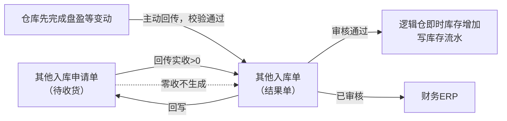
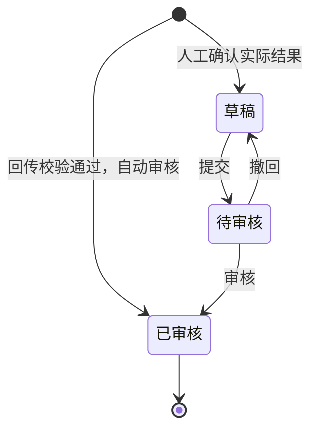
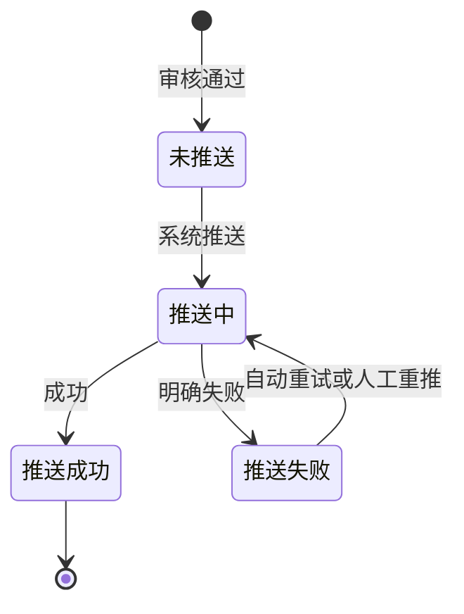

# 其他入库单主PRD

> 用途：定义其他入库单在ERP中的生成、审核、库存增加、来源回写与推送财务ERP，作为研发实现和测试验收的依据。
> 定位：应用设计层文档。业务规则以[《库存与仓储需求分析》](../../../../../02-需求调研和分析/03-库存与仓储/库存与仓储需求分析.md)（INV-FR04、INV-FR06、INV-FR09、INV-FR10、INV-AC04、INV-AC06、INV-AC10、INV-AC16）和[《库存与仓储业务设计》](../../../../../03-业务分析和设计/03-库存与仓储业务设计.md)（§4.4、§4.5、§5.1～§5.3、§6.2、§6.4、§七）为准；结果单模型与共用规则以[《强盛ERP的单据分层设计》](../../../../../01-全局背景信息/5.强盛ERP的单据分层设计.md) §七、§八为准；状态与操作以[《单据与状态流转》](../../../系统架构和流程/03-单据与状态流转.md) §四为准；字段与取值以[《其他入库单（详细稿）》](../../../字段清单合集/库存相关/其他入库单/其他入库单（详细稿）.tsv)为准；页面骨架见[《其他入库单页面骨架》](其他入库单页面骨架.md)；页面交互以[前端Demo版PRD](前端Demo版PRD/)为准，**须服从本文 §6.4 状态—功能矩阵**。
> 不写什么：不写其他入库申请单的建单、审核、推送与取消（见[《其他入库申请单主PRD》](../其他入库申请单/其他入库申请单主PRD.md)）；不写其他出库单；不写库存查询、库存流水的页面规则；不写仓库作业细节、财务ERP报文字段映射、系统权限与数据库设计。

| 版本 | 本次变化 | 状态 |
| --- | --- | --- |
| V0.1 | 建立其他入库单主PRD：生成、审核、记账、回写与推送财务ERP | 初稿，待评审 |
| V0.2 | 同步09库存原型已交付状态；实现差异和Mock边界指向交付清单、Demo PRD与待改项 | 修订，待评审 |
| V0.3 | 人工确认入口调整：有来源时回到来源申请单详情页；无原单补录入口归本模块（是否一期提供待确认，2026-09-24确认） | 修订，待评审 |
| V0.4 | 收口确认：人工确认在来源申请单详情页；无原单补录一期不做页面入口（2026-09-24） | 修订，待评审 |

## 1. 文档信息与阅读边界

| 项目 | 内容 |
| --- | --- |
| 读者 | 研发工程师、测试工程师、产品复核 |
| 业务依据 | [《库存与仓储需求分析》](../../../../../02-需求调研和分析/03-库存与仓储/库存与仓储需求分析.md) INV-FR04、INV-FR06、INV-FR09、INV-FR10、INV-AC04、INV-AC06、INV-AC10；[《库存与仓储业务设计》](../../../../../03-业务分析和设计/03-库存与仓储业务设计.md) §4.4、§4.5、§6.4、§七 |
| 字段依据 | [《其他入库单（详细稿）》](../../../字段清单合集/库存相关/其他入库单/其他入库单（详细稿）.tsv)；字段名称、枚举、必填性、页面展示以TSV为准 |
| 状态依据 | [《单据与状态流转》](../../../系统架构和流程/03-单据与状态流转.md) §四 结果单（审核状态＋推送财务ERP状态）；结果单模型见[《强盛ERP的单据分层设计》](../../../../../01-全局背景信息/5.强盛ERP的单据分层设计.md) §七 |
| 页面依据 | [《其他入库单页面骨架》](其他入库单页面骨架.md)、[前端Demo版PRD](前端Demo版PRD/)；按钮展示与文案以Demo PRD为准，须服从本文 §6.4 |

关联资料：[《强盛ERP全局业务规则与约束》](../../../../../01-全局背景信息/4.强盛ERP全局业务规则与约束.md)（§二 库存记账与数量控制、§四 推送财务ERP范围与失败处理）、[《6.强盛ERP的编码规则和通用字段规则》](../../../../../01-全局背景信息/6.强盛ERP的编码规则和通用字段规则.md)（1.2 前缀QTRK、2.3 Code-Name、第三节结果单排序与系统记录字段）、[《实体对象关系》](../../../系统架构和流程/02-实体对象关系.md)（§三、§四、§六、§八）、[《库存流水主PRD》](../库存流水/库存流水主PRD.md)（记账即写流水）、[《库存查询主PRD》](../库存查询/库存查询主PRD.md)（即时库存口径）、[《结算与业财需求分析》](../../../../../02-需求调研和分析/05-结算与业财/结算与业财需求分析.md)（FIN-FR01～FIN-FR03）、[《系统集成需求分析》](../../../../../02-需求调研和分析/07-系统集成/系统集成需求分析.md)（INT-FR03、INT-FR05、INT-FR06）。

## 2. 需求背景与目标

### 2.1 背景

其他入库申请单交给仓库执行后，需要形成实际入库结果单，作为库存增加和业财交接的唯一依据；仓库先完成盘盈等实际变动时，也需要一个不补申请、不补通知的入口把结果纳入ERP。申请单、通知类单据本身不增减库存，也不向推送财务ERP。

没有统一的结果单时，实际入库数量、库存变化和财务输入无法与业务依据对齐，也无法逐单追溯每次实际入库。

### 2.2 目标

- 两类来源统一收口：其他入库申请单回传实收，或仓库主动回传已经完成的实际变动；
- 常规路径系统自动生成并自动审核；人工确认实际结果沿用INT-FR06：有来源时入口在来源申请单详情页；无原单补录一期不做页面入口，接口失败先线下兜底（2026-09-24确认）；不提供无来源人工建单的常规入口；
- 审核通过后增加对应逻辑仓即时库存，并回写来源申请单实收与状态；
- 已审核结果逐单推送财务ERP；自动重试最多3次，仍失败在系统集成中心针对原单重推；
- 整单只读：不提供新增、编辑、取消或作废；已审核后不因推送财务ERP失败回滚库存与回写。

## 3. 需求范围

### 3.1 本期范围

- 其他入库单列表、详情（只读查看）；
- 由其他入库申请单回传、或仓库主动回传触发的自动生成（本模块无新增入口）；
- 已审核后查看来源、库存结果与推送记录；推送财务ERP失败时到系统集成中心重推原单；
- 审核状态与推送财务ERP状态两个字段并列维护；
- 与其他入库申请单的数量回写衔接；记账时写库存流水（口径引用[《库存流水主PRD》](../库存流水/库存流水主PRD.md)，不重复展开）。

### 3.2 功能清单

| 编号 | 功能/位置 | 本次内容 | 需求来源 |
| --- | --- | --- | --- |
| F01 | 其他入库单列表 | 查询、列展示、进入详情；审核状态与推送财务ERP状态多选筛选；勾选配合页头导出；**无新增**；一期批量栏无业务按钮 | INV-FR04、INV-FR06 |
| F02 | 详情页 | 分区域只读展示来源、明细、推送与审核信息 | INV-FR06 |
| F03 | 自动生成（系统） | 申请回传实收>0，或仓库主动回传校验通过后自动生成并自动审核 | INV-FR04、INV-FR06 |
| F04 | 记账与回写（系统） | 审核通过后增加逻辑仓即时库存、写库存流水、回写来源申请单 | INV-FR06、INV-FR10 |
| F05 | 推送财务ERP（系统） | 已审核后自动逐单推送；失败自动重试最多3次，仍失败在系统集成中心重推原单 | INV-FR10、FIN-FR01～FIN-FR03 |
| F06 | Demo Mock | 模拟申请回传或仓库主动回传后自动生成入库单；仅Demo | 演示需要，非业务规则 |

### 3.3 需求追溯

| 上游场景与需求 | 本 PRD 功能 | 本 PRD 验收 |
| --- | --- | --- |
| INV-FR06：其他入库申请回传形成结果单、一次结束 | F01、F02、F03、F04 | AC01、AC02 |
| INV-FR04：仓库主动回传盘盈等结果直接生效，不补申请 | F03、F04 | AC03 |
| INV-FR09：不允许负库存（入库不产生负库存，出库侧校验） | F04 | AC06 |
| INV-FR10、FIN-FR01～FIN-FR03：结果单逐单推财务ERP、失败不回滚 | F05 | AC04、AC05 |
| INT-FR06：接口拿不到仓库结果时人工确认实际结果 | 人工确认路径（R08） | AC09 |

### 3.4 非本期范围

- **无来源人工建入库单**、列表/详情新增入口（回传或仓库主动回传自动生成的已审核单不走草稿编辑）；
- 入库单导入；
- 已审核后修改数量、仓库、业务类型或反审核；
- 零数量入库单；
- 推送财务ERP报文字段映射、系统集成中心页面细节（见集成PRD；本模块不提供重推按钮）；
- 系统权限矩阵、API/表结构/并发锁实现。

| 范围补充 | 说明 |
| --- | --- |
| 适用对象 | 成品SKU；入库逻辑仓沿用来源申请单，或按仓库回传的归属映射识别 |
| 唯一来源 | 常规为其他入库申请单回传，或仓库主动回传；接口拿不到结果时的人工确认仍须沿来源或按INT-FR06留痕，不提供无来源建单 |
| 与原型差异 | 本模块已于2026-09-24接入09原型；实际页面与Mock行为见对应前端Demo版PRD。实现差异和未决事项由《库存管理交付清单》、09《待改项》跟踪；原型不代表真实接口或后端事务验证 |

## 4. 单据定位与业务边界

### 4.1 业务作用

| 项目 | 内容 |
| --- | --- |
| 单据层级 | 第3层——实际结果单（两层链路的执行结果），记录本次实际入库事实；仓库主动回传时属一层结果单（《单据分层设计》§六、§七） |
| 核心职责 | 记录实际入库多少、入哪个逻辑仓、业务类型与来源；审核后增加库存并推送财务ERP |
| 单据来源 | 其他入库申请单回传实收>0；或仓库主动回传（盘盈等）经校验通过 |
| 下游单据 | 无业务下游；财务ERP接收已审核结果 |
| 数量关系 | 一张申请对应0或1张入库单（零收不生成）；仓库主动回传按来源拆分接收 |
| 业务终结 | 已审核为业务终态；不可取消、不可反审核；推送失败不改变已生效库存 |

### 4.2 上下游关系摘要

> 完整链路见[《系统流程与单据交互》](../../../系统架构和流程/01-系统流程与单据交互.md)第8节；本文只保留入库侧交接点。

### 4.3 业务对象关系

| 关系 | 说明 |
| --- | --- |
| 其他入库申请单 : 其他入库单 | 1:0..1；一次回传形成一张结果单，零收不生成 |
| 仓库主动回传结果 : 其他入库单 | 1:N；按来源拆分接收，保留来源系统与来源单号 |
| 入库单明细 : 来源申请行 | N:1（有来源时）；数量沿来源行回写 |
| 其他入库单 : 入库逻辑仓 | N:1；沿用来源逻辑仓，仓库主动回传按确认映射识别，不重新分仓 |

### 4.4 本单据不负责的事项

- 入库单不安排仓库作业；执行指令由其他入库申请单承担，仓库主动回传的场景仓库已经完成作业；
- 入库单不修改申请单的申请数量、业务类型与仓库约定；
- 已审核后不因推送财务ERP失败而回滚库存或删除业务结果；
- 不在原入库单上补收；未收部分在申请单侧体现缺量，需要再收另建申请单；
- 超申请量的回传在接收侧整次拒绝，实际入库数量不超过申请数量；
- 品质调整不通过本单处理，走直接调拨（INV-FR07）。

## 5. 核心业务场景索引

| 场景ID | 场景 | 类型 | 说明 |
| --- | --- | --- | --- |
| S01 | 申请回传自动生成 | 主流程 | 待收货申请回传实收>0→校验通过→生成入库单并自动审核→库存+→回写申请单→推财务ERP |
| S02 | 申请缺量回传 | 主流程 | 实收<申请数量→按实收记账→未收在申请单侧展示缺量→不回补原单 |
| S03 | 申请零收 | 支线 | 不生成入库单；申请单按取消结束；库存不变；不推财务ERP |
| S04 | 仓库主动回传（盘盈等） | 主流程 | 无原单→按来源与映射识别归属→校验通过→自动生成并自动审核→库存+→推财务ERP；不补申请 |
| S05 | 推送财务ERP失败重推 | 支线 | 已审核+推送失败→自动重试最多3次→仍失败则在系统集成中心重推原单；库存与回写不回滚；本模块列表/详情无重推按钮 |
| S06 | 归属依据不足 | 异常 | 无法确定记入哪个逻辑仓→保留异常、不记账、不推财务ERP→修复后处理原记录 |
| S07 | 接口失败人工确认 | 支线 | 已交给仓库、接口拿不到结果→人工确认实际结果（INT-FR06）→形成入库单并提交审核；有来源时入口在来源申请单详情页（2026-09-24调整） |
| S08 | 重复回传 | 异常 | 不重复生成单据、不重复回写、不重复记账；幂等标识留接口设计 |

## 6. 状态与操作

状态定义owner：[《单据与状态流转》](../../../系统架构和流程/03-单据与状态流转.md) §四。其他入库单用**审核状态**与**推送财务ERP状态**两个字段并列维护。

**一期用户界面口径**：回传或仓库主动回传生成的入库单创建即为**已审核**；列表与详情不提供新增，也不提供重推按钮。已交给仓库、接口拿不到结果时，人工确认实际结果走草稿 → 待审核，有来源时入口在来源申请单详情页（2026-09-24调整；人工确认交互随来源单据所属模块修订补充），不是本模块无来源建单。

### 6.1 状态维度

| 维度 | 取值 | 说明 |
| --- | --- | --- |
| 审核状态 | 已审核（用户可见）；草稿/待审核（模型保留，人工确认时使用，入口在来源申请单详情页） | 控制是否记账 |
| 推送财务ERP状态 | 未推送、推送中、推送成功、推送失败 | 跟踪业财推送 |

### 6.2 状态取值说明

**审核状态**

| 状态 | 含义 | 是否终态 | 一期界面 |
| --- | --- | --- | --- |
| 已审核 | 库存已生效、来源已回写 | 是 | 可见 |
| 草稿、待审核 | 人工确认实际结果时使用 | 否 | 有来源时入口不在本模块列表，在来源申请单详情页办理；见R08（2026-09-24调整） |

**推送财务ERP状态**

| 状态 | 含义 | 是否终态 |
| --- | --- | --- |
| 未推送 | 尚未发起推送 | 否 |
| 推送中 | 推送作业进行中 | 否 |
| 推送成功 | 财务ERP已接收 | 是 |
| 推送失败 | 推送明确失败，可重推 | 否（可重试至成功） |

自动生成的入库单创建时即为已审核，推送财务ERP状态从「未推送」开始。仓库回传、申请回传等系统自动生成的结果单，创建人与最后更新人显示「系统」（《6.强盛ERP的编码规则和通用字段规则》第三节）。

### 6.3 状态流转图

**审核状态（本期有效路径）**

**推送财务ERP状态**（已审核后）

### 6.4 状态—功能矩阵

> ✅ = 允许；❌ = 不允许。F01 查询/查看均可用，不重复列出。

| 动作 | 已审核 |
| --- | --- |
| 详情/追溯（F02） | ✅ |
| 重推财务ERP（F05） | ❌（入口在系统集成中心；须推送财务ERP状态=推送失败） |
| Demo Mock（F06） | ✅（Demo） |

**系统集成中心 × 重推财务ERP**（须已审核；不在本模块列表/详情）

| 推送财务ERP状态 | 重推财务ERP |
| --- | --- |
| 未推送 / 推送中 | ❌（等待系统） |
| 推送失败 | ✅（系统集成中心） |
| 推送成功 | ❌ |

说明：

- 列表与详情**不提供**新增、编辑、提交、审核、撤回、取消、作废，也**不提供**重推财务ERP；
- 已审核后整单只读；推送失败原因在详情可看，重推到系统集成中心办理；
- 草稿/待审核的人工确认单据由来源申请单详情页入口形成与提交（2026-09-24调整），本模块列表不提供该入口；
- 人工确认单据的提交与审核权限统一引用COM-FR01（允许有权限用户提交并审核自己创建的单据）；本文不写权限矩阵。

列表批量操作栏一期仅展示已选中计数与列设置；导出在页头。

### 6.5 状态流转表

| 当前状态 | 动作 | 前置条件 | 结果状态 | 二次确认 | 后置影响 | 失败处理 |
| --- | --- | --- | --- | --- | --- | --- |
| — | 申请回传自动生成 | 来源申请单待收货，或处于取消中且到达实际结果（申请单侧R18），实收合计>0（R02）；校验通过（R03） | 已审核 | 无 | 分配单号（R01）；增加逻辑仓即时库存、写库存流水（R05）；回写申请单实收与状态；触发推送财务ERP（R06） | 校验失败保留异常，不记账 |
| — | 仓库主动回传自动生成 | 来源信息、商品、仓库与业务类型映射正常；库存校验通过（R04） | 已审核 | 无 | 同上；不补建申请单 | 归属依据不足或映射失败保留异常（S06） |
| — | 人工确认→提交审核 | 已交给仓库、接口拿不到结果（R08） | 草稿 → 待审核 → 已审核 | 有来源时入口在来源申请单详情页 | 通过后与自动路径同样记账与推送 | 不能无来源建单（无原单补录一期不做页面入口，Q03已定） |
| 已审核 | 自动推送 | 系统作业 | 推送中 | 无 | — | — |
| 推送中 | 推送成功 | 财务ERP确认 | 推送成功 | 无 | 记录推送时间 | — |
| 推送中 | 推送失败 | 财务ERP明确失败 | 推送失败 | 无 | 记录推送失败原因；**不回滚库存与回写**；触发自动重试（R09） | — |
| 推送失败 | 自动重试 | 未达3次 | 推送中 | 无 | — | 仍失败则保持推送失败 |
| 已审核+推送失败 | 人工重推 | 在系统集成中心触发 | 推送中 | 重推在系统集成-业财结果单据办理 | 针对原单重试 | — |

## 7. 核心业务规则

### 7.1 创建与来源规则

| 规则编号 | 主题 | 规则 | 边界或例外 |
| --- | --- | --- | --- |
| R01 | 单号 | 按[《6.强盛ERP的编码规则和通用字段规则》](../../../../../01-全局背景信息/6.强盛ERP的编码规则和通用字段规则.md)第一节自动生成；前缀QTRK；生成时分配 | 用户不可编辑；结果单不重用单号 |
| R02 | 来源申请单 | 有来源时必须关联一张待收货、或处于取消中且到达实际结果（申请单侧R18）的其他入库申请单；一张申请最多一张有效入库单 | 零收申请不生成；已有入库单不可重复生成 |
| R03 | 申请回传自动生成 | 仓库回传实收并结束，校验通过后系统自动生成并自动审核 | 不经人工建单或人工审核 |
| R04 | 仓库主动回传自动生成 | 仓库已经完成的实际变动（盘盈等）回传，商品、仓库归属、业务类型映射正常且库存校验通过后，直接生成并自动生效；不补建申请、通知，也不要求对已完成变动先做预占 | 归属依据不足时不随便选仓，保留异常（S06）；盘亏等减少方向由其他出库单承接 |
| R08 | 人工确认 | 已交给仓库、接口拿不到结果时，可按实际发生情况确认并沿来源申请单形成入库单，走提交审核（INT-FR06） | 不能无来源新建入库单；不能用来替代虚拟入库；无原单场景的补录口径待确认（Q03） |
| — | 单头继承 | 有来源时，来源申请单、入库逻辑仓、业务类型与明细数量沿来源携带 | 用户不可改仓库、数量、业务类型 |

数量示例（标明为示例）：申请A商品100件，回传实收80件并结束，生成80件入库单；申请单已收货、未收20，入库单1张。

### 7.2 数量与字段规则

| 规则编号 | 主题 | 规则 | 边界或例外 |
| --- | --- | --- | --- |
| — | 实际入库数量 | 各行实际入库数量＝来源申请行实收数量（有来源时）；仓库主动回传时按回传数量；不超过申请数量 | 创建后不可改；一期数量为整数，不允许小数 |
| — | 零数量 | 不允许零数量入库单 | 零收在申请单侧按取消结束，不进入本单 |
| — | 业务类型 | 沿用来源申请单的业务类型；仓库主动回传按回传类型记录 | 枚举（2026-09-23确认）：盘盈、样品回收、借出归还、退料、赠品入库；逐字以TSV为准 |
| R07 | 只读 | 入库单生成后整单只读，不提供编辑入口 | 已审核不可改任何业务字段；备注在自动回传时一般为空 |

### 7.3 回写与库存规则

| 规则编号 | 主题 | 规则 | 边界或例外 |
| --- | --- | --- | --- |
| R05 | 回写与记账 | 自动审核通过时回写来源申请单实收与状态（已收货）；同时增加对应逻辑仓即时库存并写入库存流水（一行一次实际增减） | 回写单向：结果单改申请单，申请单不改结果单；流水口径见[《库存流水主PRD》](../库存流水/库存流水主PRD.md)R01、R02 |
| — | 缺收 | 少收部分不在入库单体现；未收在申请单侧展示，不回补原单 | 需要再收另建申请单，不在原申请或原入库单补收 |
| — | 负库存 | 入库方向只增加库存，不产生负库存；出库方向的校验由其他出库单承担 | INV-FR09 |
| — | 归属 | 有原单沿用原单逻辑仓；无原单按来源信息与确认映射识别，不能只按实体仓把不同货主库存合并记账 | 《4.强盛ERP全局业务规则与约束》§一；《库存与仓储业务设计》§6.2 |

### 7.4 推送财务ERP规则

| 规则编号 | 主题 | 规则 | 边界或例外 |
| --- | --- | --- | --- |
| R06 | 推送时机 | 已审核后由系统自动逐单推送财务ERP | 申请单、草稿与未审核结果不推送；本单不传成本价格，存货成本由财务ERP核算 |
| R09 | 自动重试 | 推送明确失败后系统自动重试，**最多3次**；3次仍失败则保持「推送失败」，等待在系统集成中心重推 | 间隔本期不定秒数，由技术配置 |
| R10 | 失败重推 | 在系统集成中心针对原单重试，不另建业务单；其他入库单列表/详情不提供重推按钮 | 不回滚库存与回写 |
| — | 业务日期 | 推送财务ERP时使用；取实际入库时间的日期部分 | 列表默认按业务日期倒序（《6.强盛ERP的编码规则和通用字段规则》第三节） |
| — | 推送记录 | 记录推送时间、推送失败原因；重推成功后仍保留历史失败原因 | INT-FR03、INT-FR05 |

### 7.5 业务生效点

| 业务动作 | 入库单影响 | 库存影响 | 业财/外部影响 |
| --- | --- | --- | --- |
| 自动生成并审核 | 已审核；带入实际入库数量与来源 | 逻辑仓即时库存增加、写库存流水 | 触发推送财务ERP |
| 推送财务ERP成功 | 推送状态→成功 | 无额外变化 | 财务ERP接收结果 |
| 推送财务ERP失败 | 推送状态→失败；业务仍已审核 | 不回滚 | 自动重试3次；仍失败则在系统集成中心重推 |
| 归属或校验失败 | 不生成或保留异常 | 不记账 | 不推送；修复后处理原记录 |

### 7.6 字段校验绑定

完整字段见TSV。摘要：

| 校验时机 | 要求 |
| --- | --- |
| 自动生成 | 有来源：来源申请待收货，或处于取消中且到达实际结果（申请单侧R18），实收合计>0（R02）；无来源：商品、仓库归属、业务类型映射与库存校验通过（R04） |
| 人工确认 | 沿来源申请单确认实际结果；不能无来源建单（R08、INT-FR06；无原单补录口径待确认Q03） |
| 重推 | 已审核+推送失败（R10）；入口在系统集成中心 |

页面控件、错误文案见Demo PRD；重推交互不在本模块。

## 8. 功能需求说明（页面索引）

| 编号 | 页面/位置 | 规则与状态依据 | Demo PRD |
| --- | --- | --- | --- |
| F01 | 列表 | §6.4 | [列表页](前端Demo版PRD/其他入库单前端Demo版PRD_列表页.md) |
| F02 | 详情 | R05～R10；§6.4 | [详情页](前端Demo版PRD/其他入库单前端Demo版PRD_详情页.md) |
| F05 | 重推财务ERP | R09、R10；§6.5 | 入口在系统集成中心；本模块弹窗 PRD 不再定义该确认框 |
| F06 | Demo Mock | 非正式验收 | [弹窗与Mock](前端Demo版PRD/其他入库单前端Demo版PRD_弹窗与Mock.md) §2、§3 |

本期不提供新增/编辑页，理由见[《其他入库单前端Demo版PRD_新增编辑页》](前端Demo版PRD/其他入库单前端Demo版PRD_新增编辑页.md)。

## 9. 上下游影响与协同

| 关联模块/系统 | 需要配合的变化 | 交接内容与时机 | 验收结果 |
| --- | --- | --- | --- |
| 其他入库申请单 | 回传触发生成；结果单回写实收与状态 | 待收货或取消中到达实际结果且实收>0时生成；详情可跳转关联入库单 | 1:0..1关系成立；申请单已收货 |
| 库存 | 即时库存增加、写库存流水 | 已审核后按逻辑仓记账 | 库存查询数量与流水同步变化 |
| 库存流水 | 记账产生流水，可从流水点回本单 | 一行一次实际增减 | 追溯成立 |
| 财务ERP | 接收已审核结果 | 审核后自动推送；失败在系统集成中心重推原单 | FIN-FR01～FIN-FR03 |
| 系统集成中心 | 展示推送结果；失败时重推原单；接口失败时的人工确认在来源页面办理（2026-09-24调整） | 推送状态、时间、失败原因；重推不改业务信息 | INT-FR03、INT-FR05、INT-FR06 |
| 商品与主数据 | 提供启用的成品SKU、审核通过且启用的逻辑仓 | 归属识别与展示 | 归属依据不足时挂异常 |

## 10. 关联文档与阅读入口

| 关联内容 | 阅读入口 | 本 PRD 与其边界 |
| --- | --- | --- |
| 其他入库申请单 | [《其他入库申请单主PRD》](../其他入库申请单/其他入库申请单主PRD.md) | 唯一有来源生成入口；申请数量与状态owner在申请单侧 |
| 库存流水 | [《库存流水主PRD》](../库存流水/库存流水主PRD.md) | 记账写流水的口径来源；本文不重复展开 |
| 库存查询 | [《库存查询主PRD》](../库存查询/库存查询主PRD.md) | 即时库存口径；记账后数量变化 |
| 状态与操作 | [《单据与状态流转》](../../../系统架构和流程/03-单据与状态流转.md) §四、§七 | 状态owner；回写表 |
| 结果单模型 | [《强盛ERP的单据分层设计》](../../../../../01-全局背景信息/5.强盛ERP的单据分层设计.md) §七、§八 | 一层结果单与共用规则 |
| 字段定义 | [《其他入库单（详细稿）》](../../../字段清单合集/库存相关/其他入库单/其他入库单（详细稿）.tsv) | TSV 为字段 owner |
| 页面结构 | [《其他入库单页面骨架》](其他入库单页面骨架.md) | 区域与线框走查，非规则权威 |
| 页面交互 | [前端Demo版PRD](前端Demo版PRD/) | 控件、文案、Mock；服从 §6.4 |

## 11. 异常与一致性

### 11.1 并发操作

| 场景 | 业务处理结果 |
| --- | --- |
| 同一申请重复回传触发生成 | 只允许一张有效入库单；重复触达幂等，不重复记账 |
| 同一入库单同时被列表查看与推送作业触达 | 已审核为终态，审核维度不变、推送维度按R09推进 |
| 人工确认与自动回传同时到达 | 只允许一张有效结果单；先到者成立，后到者按重复处理 |

### 11.2 幂等与重复处理

| 操作 | 幂等规则 |
| --- | --- |
| 回传触发生成 | 同一来源不得重复生成入库单或重复增加库存 |
| 财务ERP重推 | 同一入库单重复推送不得重复增加库存与重复回写 |
| 重复回传 | 不重复生成单据、不重复回写数量；幂等标识与部分成功恢复留接口设计（《单据分层设计》§8.5） |

### 11.3 与上下游单据一致性

| 场景 | 处理方式 |
| --- | --- |
| 申请单已有关联入库单 | 不可再自动生成 |
| 推送失败 | 库存与回写保持；自动重试3次；仍失败则在系统集成中心重推原单 |
| 取消中到达实际结果 | 按真实结果完成（申请单侧R18），结果单正常记账与推送 |
| 已取消后迟到回传 | 进入异常处理，修复后处理原记录 |
| 结果错误或重复 | 结果单差异不设常规业务更正流程，由技术介入或按双方线下约定处理；冲销更正规则待确认（Q02） |

## 12. 验收标准与待确认事项

### 12.1 验收标准

| 编号 | 对应功能/规则 | 条件与操作 | 预期结果 |
| --- | --- | --- | --- |
| AC01 | F03、F04/R02、R05 | 申请A商品100件，仓库回传实收80并结束 | 自动生成80件其他入库单、已审核；单号按QTRK规则；申请单已收货、未收20；逻辑仓库存+80；触发推送财务ERP（INV-AC06） |
| AC02 | R02、零收规则 | 申请单回传零收 | 不生成入库单；申请单按取消结束；库存不变；不推财务ERP（INV-AC06） |
| AC03 | F03、F04/R04 | 仓库主动回传盘盈，映射与库存校验通过 | 直接生成其他入库单并自动审核，业务类型=盘盈；不补申请、不补通知、不建ERP盘点单；库存增加（INV-AC04） |
| AC04 | F05/R09、R10 | 推送财务ERP明确失败 | 自动重试最多3次；仍失败则保持推送失败，可在系统集成中心重推；本模块列表/详情无重推按钮；库存与回写不回滚 |
| AC05 | R07、F01 | 列表与详情 | 无新增/编辑/取消/作废入口；无行内重推；整单只读 |
| AC06 | R05 | 入库单审核生效后查看库存查询与库存流水 | 对应逻辑仓即时库存增加；产生一条增加方向流水并指向本单（INV-AC14口径） |
| AC07 | R04、S06 | 仓库主动回传无法确定逻辑仓归属 | 保留异常、不记账、不推财务ERP；不随便选仓；修复后处理原记录 |
| AC08 | R02、§11.2 | 同一申请重复回传；同一单重复推送 | 只生成一张入库单；重复推送不重复增加库存 |
| AC09 | R08、INT-FR06 | 已交给仓库的申请接口拿不到结果 | 可人工确认实际结果并沿来源申请单形成入库单、提交审核；不能无来源建单（无原单补录口径待确认Q03） |
| AC10 | F01 | 列表筛选审核状态与推送财务ERP状态 | 多选OR匹配；列与TSV一致；默认按业务日期倒序 |
| AC11 | F02 | 详情展示来源申请单与来源信息 | 有来源可跳转申请单；无来源展示来源系统与来源单号；展示推送记录与失败原因 |
| AC12 | F06 | Demo Mock 模拟回传自动生成 | 仅Demo可用；正式验收以回传为准 |

### 12.2 待确认事项

| 编号 | 问题 | 影响范围 | 确认人 | 最迟确认阶段或时间 | 状态/结论 |
| --- | --- | --- | --- | --- | --- |
| Q01 | 其他出入库业务类型的完整枚举（02 §七） | 业务类型字段选项、列表筛选与测试数据 | — | — | 已定（2026-09-23）：其他入库＝盘盈、样品回收、借出归还、退料、赠品入库；其他出库＝盘亏、样品领用、赠送、报废、借出 |
| Q02 | 非外部电商来源的结果错误或重复的冲销更正方式 | 是否新增冲销单或更正流程 | 待指定 | 业务先确认（03 §七） | 待确认；结果单差异不设常规业务更正流程（《单据分层设计》§8.5），不凭空定义冲销单 |
| Q03 | 无原单场景（仓库主动回传）接口失败时的人工补录口径 | 人工确认入口与留痕要求 | — | — | 已定（2026-09-24）：一期不做页面补录入口，接口失败先线下兜底；有原单时须沿来源申请单 |
| Q04 | 归属依据不足时异常记录的保存、修复与重新处理方式 | 异常处理与恢复 | 待指定 | 业务先确认（03 §七） | 待确认；当前只明确不随便选仓、不记账、不推财务ERP；修复后处理原记录 |
| Q05 | 财务ERP目标单据映射、金额成本与接收类型 | 推送范围与核算衔接 | 待指定 | 财务及接口设计前 | 待确认；本期不编财务ERP字段对照，对照表由财务联调给出（INV-FR10） |
| Q06 | 来源系统与来源单号的识别口径（外部来源标识） | 字段取值与追溯 | 待指定 | 接口设计前 | 待确认；沿用「来源系统＋来源单号」识别方式（《6.强盛ERP的编码规则和通用字段规则》1.3） |
| Q07 | 查看、导出与重推的角色与数据范围 | 页面入口可见性 | 待指定 | 权限配置（系统管理PRD）定稿前 | 待确认；引用COM-FR01、COM-FR02；重推入口在系统集成中心 |
| Q08 | 完整操作日志的字段与入口 | 详情页操作信息区 | 待指定 | 页面评审前 | 已定（2026-09-24）：一期在详情页「操作信息」卡片提供由单据字段推导的简化「操作日志」Tab（与制单信息并列，含提交／审核／推送／回传／取消等记录）；完整审计日志的字段与独立入口仍后置，按《4.强盛ERP全局业务规则与约束》§五保留处理记录 |
