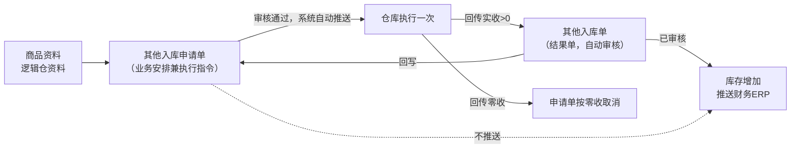
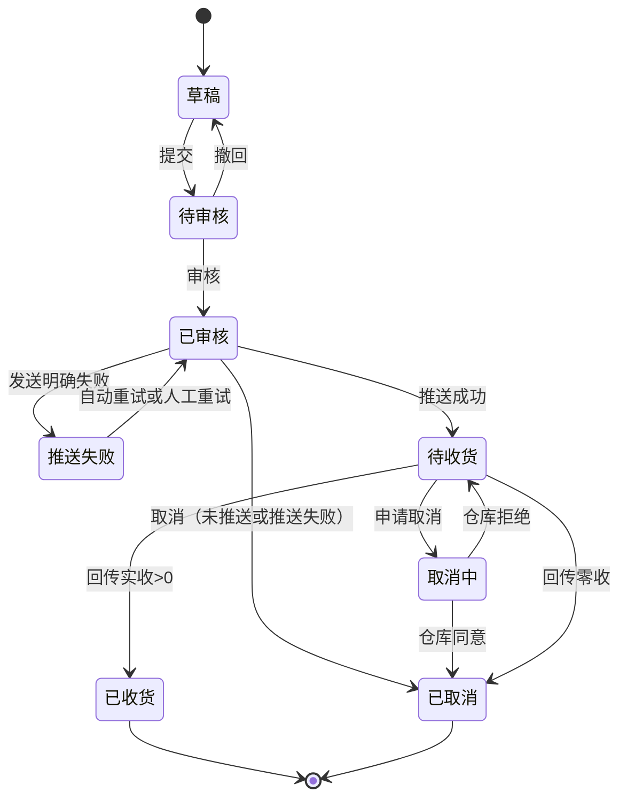

# 其他入库申请单主PRD

> 用途：定义其他入库申请单在ERP中的建单、提交审核、自动推送仓库、接收一次回传、取消与完结的系统行为，作为研发实现和测试验收的依据。
> 定位：应用设计层文档。业务规则以[《库存与仓储需求分析》](../../../../../02-需求调研和分析/03-库存与仓储/库存与仓储需求分析.md)（INV-FR04、INV-FR06、INV-FR09、INV-AC06、INV-AC12、INV-AC16）和[《库存与仓储业务设计》](../../../../../03-业务分析和设计/03-库存与仓储业务设计.md)（§4.4、§4.5、§5.1～§5.3、§6.3、§七）为准；分层与共用规则以[《强盛ERP的单据分层设计》](../../../../../01-全局背景信息/5.强盛ERP的单据分层设计.md) §六、§八为准；状态与操作以[《单据与状态流转》](../../../系统架构和流程/03-单据与状态流转.md) §5.2 为准；字段与取值以[《其他入库申请单（详细稿）》](../../../字段清单合集/库存相关/其他入库申请单/其他入库申请单（详细稿）.tsv)为准；页面骨架见[《其他入库申请单页面骨架》](其他入库申请单页面骨架.md)；页面交互以[前端Demo版PRD](前端Demo版PRD/)为准，**须服从本文 §6.4 状态—功能矩阵**。
> 不写什么：不写其他入库单内部的审核、库存记账与推送财务ERP（见[《其他入库单主PRD》](../其他入库单/其他入库单主PRD.md)）；不写其他出库申请单与结果单；不写库存查询、库存流水的页面规则（见对应主PRD）；不写系统权限、接口报文与数据库设计。

| 版本 | 本次变化 | 状态 |
| --- | --- | --- |
| V0.1 | 建立其他入库申请单主PRD：建单、审核、自动推送、一次回传、取消、验收 | 初稿，待评审 |
| V0.2 | 同步09库存原型已交付状态；实现差异和Mock边界指向交付清单、Demo PRD与待改项 | 修订，待评审 |
| V0.3 | 确认虚拟在途逻辑仓可作为其他入库仓，按普通申请流程推送仓库 | 修订，待评审 |
| V0.4 | 人工确认入口调整：回到本模块申请单详情页（2026-09-24确认；交互随本模块下一轮修订补充） | 修订，待评审 |
| V0.5 | 确认自动重试最多3次（2026-09-24） | 修订，待评审 |

## 1. 文档信息与阅读边界

| 项目 | 内容 |
| --- | --- |
| 读者 | 研发工程师、测试工程师、产品复核 |
| 业务依据 | [《库存与仓储需求分析》](../../../../../02-需求调研和分析/03-库存与仓储/库存与仓储需求分析.md) INV-FR04、INV-FR06、INV-FR09、INV-AC06、INV-AC12、INV-AC16；[《库存与仓储业务设计》](../../../../../03-业务分析和设计/03-库存与仓储业务设计.md) §4.4、§4.5、§6.3、§七 |
| 字段依据 | [《其他入库申请单（详细稿）》](../../../字段清单合集/库存相关/其他入库申请单/其他入库申请单（详细稿）.tsv)；字段名称、枚举、必填性、页面展示以TSV为准 |
| 状态依据 | [《单据与状态流转》](../../../系统架构和流程/03-单据与状态流转.md) §5.2 其他入库／出库申请单；单据状态owner为外部文档 |
| 页面依据 | [《其他入库申请单页面骨架》](其他入库申请单页面骨架.md)、[前端Demo版PRD](前端Demo版PRD/)；按钮展示与文案以Demo PRD为准，须服从本文 §6.4 |

关联资料：[《强盛ERP全局业务规则与约束》](../../../../../01-全局背景信息/4.强盛ERP全局业务规则与约束.md)（§二 库存记账与数量控制、§三 单据执行不能一概而论、§五 权限与审核边界）、[《6.强盛ERP的编码规则和通用字段规则》](../../../../../01-全局背景信息/6.强盛ERP的编码规则和通用字段规则.md)（1.2 前缀QTRKSQ、2.3 Code-Name、第三节系统记录字段）、[《系统与模块地图》](../../../系统架构和流程/00-系统与模块地图.md)、[《实体对象关系》](../../../系统架构和流程/02-实体对象关系.md)（§三、§四、§八）、[《预占与冻结主PRD》](../预占与冻结/预占与冻结主PRD.md)（其他入库申请不占库）、[《公共能力与系统管理需求分析》](../../../../../02-需求调研和分析/08-公共能力与系统管理/公共能力与系统管理需求分析.md)（COM-FR01、COM-FR02）、[《系统集成需求分析》](../../../../../02-需求调研和分析/07-系统集成/系统集成需求分析.md)（INT-FR03、INT-FR06）。

## 2. 需求背景与目标

### 2.1 背景

盘点以外的非购销入库（样品回收、借出归还等，清单已定，见§10.2 Q01）过去没有统一入口：业务人员口头或线下通知仓库，ERP里看不到申请依据，仓库收了多少、还剩多少没收也无从核对。采购入库和销售退货只覆盖购销链路，不能拿来承载这类库存变动。

其他入库申请单把“要收什么、收到哪个逻辑仓、为什么收”固化成可审核的执行依据，审核后由系统直接推送给仓库执行一次，仓库按实际数量回传，系统据此生成其他入库单并记账。

### 2.2 目标

- 提供可审核、可追溯的其他入库安排：一张单一个入库逻辑仓、一个业务类型，明细按商品分行；
- 一期不分批：审核后直接推送仓库，仓库执行一次、按实际数量结束，余量不回补原单；
- 允许缺量、不允许超量：回传数量超过申请数量时整次拒绝并报错；
- 与仓库衔接只接收一次结果：实收大于0生成其他入库单，零收按取消申请单处理，不生成零数量结果单；
- 不提供手动关闭、不设到期自动关单，要中止只能取消，取消条件按状态区分；
- 审核、推送都不增加库存，只有已审核的其他入库单才记账。

已审核后申请数量、入库仓、业务类型与明细锁定，不可再改；需要调整只能取消后另建申请单。

## 3. 单据定位与业务边界

### 3.1 业务作用

| 项目 | 内容 |
| --- | --- |
| 单据层级 | 第1层——业务安排兼执行指令（两层链路：其他入库申请单 → 其他入库单），依据[《强盛ERP的单据分层设计》](../../../../../01-全局背景信息/5.强盛ERP的单据分层设计.md) §六 |
| 核心职责 | 记录收什么、收到哪个逻辑仓、为什么收、收多少，并作为仓库执行依据 |
| 单据来源 | 人工创建；ERP主动发起的其他入库一期唯一入口 |
| 下游单据 | 其他入库单：仓库回传实收合计大于0时，系统自动生成并自动审核，一张申请最多一张 |
| 数量关系 | 一张申请对应0或1张其他入库单；零收不生成 |
| 业务终结 | 已收货或已取消；不提供手动关闭，不设到期自动关单；两个终态都不可撤销 |

### 3.2 上下游关系摘要

> 完整链路见[《系统流程与单据交互》](../../../系统架构和流程/01-系统流程与单据交互.md)第8节；本文只保留申请单侧交接点。

### 3.3 业务对象关系

| 关系 | 说明 |
| --- | --- |
| 其他入库申请单 : 入库逻辑仓 | N:1；一张申请单一个入库逻辑仓，实际选择逻辑仓 |
| 其他入库申请单 : 商品明细 | 1:N；按商品分行 |
| 其他入库申请单 : 其他入库单 | 1:0..1；一次回传形成一张结果单，零收不生成 |
| 其他入库申请单 : 来源单据 | 无；申请单本身就是来源，不关联采购、销售或调拨单据 |

### 3.4 本单据不负责的事项

- 申请单不增加库存：审核、推送都不改变即时库存，库存变化只由已审核其他入库单产生；
- 申请单不向推送财务ERP；财务ERP只接收已审核其他入库单；
- 不承担品质调整：正常品、待检品、残次品之间的转移走直接调拨，不放进其他入库；
- 不分批、不补收：仓库一次执行结束，未收数量不回补原单，需要再收另建申请单；
- 不做仓库主动回传的补建：仓库先完成盘盈等实际变动并回传时，直接形成其他入库单，不补建申请单（INV-FR04）；
- 不安排仓库作业细节、不接管仓内作业。

## 4. 核心业务场景

### 4.1 主路径概览

| 步骤 | 参与方 | 动作或单据 | 关键结果 |
| --- | --- | --- | --- |
| 1 | 业务人员 | 在ERP新建其他入库申请单，选入库逻辑仓与业务类型，录商品与申请入库数量 | 草稿；不占库、不改变库存 |
| 2 | 审核人 | 审核通过 | 已审核；系统自动推送仓库，库存不变 |
| 3 | 系统 | 推送仓库 | 推送成功进入待收货；明确失败进入推送失败并自动重试 |
| 4 | 仓库 | 按实际数量执行一次并回传 | 允许缺量，不允许超量；回传数量不超过申请数量 |
| 5 | 系统 | 实收大于0生成其他入库单并自动审核 | 库存增加、申请单已收货、结果单推财务ERP |
| 6 | 系统 | 回传零收 | 申请单按零收取消，不生成零数量结果单，库存不变 |

### 4.2 场景索引

| 场景ID | 场景 | 类型 | 说明 |
| --- | --- | --- | --- |
| S01 | 正常建单、审核、推送与一次回传 | 主流程 | 草稿→待审核→已审核→待收货→回传实收>0→已收货；生成其他入库单 |
| S02 | 缺量回传 | 主流程 | 实收<申请数量→按实收记账→未收数量展示缺量→不回补原单 |
| S03 | 零收取消 | 支线 | 回传实收0→申请单取消→不生成结果单、库存不变 |
| S04 | 超量整次拒绝 | 异常 | 回传数量>申请数量→整次拒绝并报错→库存与状态不变 |
| S05 | 撤回后重提 | 支线 | 待审核→撤回→草稿（保留撤回意见）→修改→重新提交 |
| S06 | 推送失败重试 | 支线 | 已审核推送明确失败→推送失败→自动重试（最多3次，2026-09-24确认）→仍失败可人工重试或取消 |
| S07 | 取消（未推送或推送失败） | 支线 | 已审核未推送或明确推送失败且确认仓库未接收→取消→已取消 |
| S08 | 取消（已推送给仓库） | 支线 | 待收货→申请取消→取消中→仓库同意→已取消；仓库拒绝→恢复待收货 |
| S09 | 取消中收到实际结果 | 异常 | 取消期间到达的实际结果按真实结果完成→已收货并生成结果单，不落成已取消 |
| S10 | 已收货后需要再收 | 支线 | 原申请不可追加执行，另建申请单 |

## 5. 范围与功能索引

### 5.1 范围

| 类别 | 说明 |
| --- | --- |
| 本期要做 | 其他入库申请单列表、新增、编辑、详情；提交、审核、撤回；审核后自动推送与推送失败重试；接收一次回传；缺量、超量拒绝、零收取消；取消（含取消中）；草稿删除；导出按导出中心 |
| 本期暂不做 | 分批执行与分批回传、余量回补原单、手动关闭、到期自动关单、申请单导入、结果单在本单内的重推入口、批量业务操作 |
| 本单据不负责 | 其他入库单的审核与记账、推送财务ERP（见[《其他入库单主PRD》](../其他入库单/其他入库单主PRD.md)）；品质调整（直接调拨，INV-FR07）；仓库主动回传结果的补建（INV-FR04）；仓内作业 |

| 范围补充 | 说明 |
| --- | --- |
| 适用对象 | 成品SKU；一张申请单一个入库逻辑仓；审核通过且启用的虚拟在途逻辑仓也可作为入库仓（见R02） |
| 与原型差异 | 本模块已于2026-09-24接入09原型；实际页面与Mock行为见对应前端Demo版PRD。实现差异和未决事项由《库存管理交付清单》、09《待改项》跟踪；原型不代表真实接口或后端事务验证 |

### 5.2 功能与追溯索引

| 功能编号与名称 | 本次内容 | 上游依据 | 规则与状态依据 | Demo PRD | 验收编号 |
| --- | --- | --- | --- | --- | --- |
| F01 列表 | 查询、列展示、行内操作入口、导出 | INV-FR06 | §6.4；R10～R19 | [列表页](前端Demo版PRD/其他入库申请单前端Demo版PRD_列表页.md) | AC13 |
| F02 新增/编辑页 | 维护入库仓、业务类型与商品明细；保存草稿 | INV-FR06 | R01～R05 | [新增编辑页](前端Demo版PRD/其他入库申请单前端Demo版PRD_新增编辑页.md) | AC01、AC04 |
| F03 提交 | 草稿提交、待审核取消 | COM-FR01 | R05、R15；§6.5 | [弹窗与Mock](前端Demo版PRD/其他入库申请单前端Demo版PRD_弹窗与Mock.md) §3.1、§3.4 | AC05、AC07 |
| F04 审核/撤回 | 待审核审核、撤回留意见 | COM-FR01 | R07～R09；§6.5 | 弹窗与Mock §3.2、§3.3 | AC01、AC05 |
| F05 详情页 | 分区展示、关联单据、审核与终止信息 | INV-FR06 | §6.4 | [详情页](前端Demo版PRD/其他入库申请单前端Demo版PRD_详情页.md) | AC13 |
| F06 已审核操作 | 人工重试推送、取消 | INV-FR06、INV-AC12 | R10、R16～R18 | 列表/详情行操作 + 弹窗与Mock §3.4、§3.5 | AC08～AC10 |
| F07 删除草稿 | 草稿删除（二次确认，不可恢复） | 《单据分层设计》§6.3 | R06 | 弹窗与Mock §3.6 | AC06 |
| F08 Demo Mock | 模拟仓库回传，串联结果单 | 演示需要，非业务规则 | — | 弹窗与Mock §5 | AC14 |

## 6. 状态与操作

状态定义owner：[《单据与状态流转》](../../../系统架构和流程/03-单据与状态流转.md) §5.2。其他入库申请单**只用一个单据状态字段**贯穿审核、推送与执行，不并列维护审核状态、业务状态或关闭状态；审核人、审核时间与操作记录仍保留。审核链无「已驳回」态，待审核不同意时操作为**撤回**（回到草稿），不叫驳回。

### 6.1 状态维度

| 维度 | 取值 | 说明 |
| --- | --- | --- |
| 单据状态 | 草稿、待审核、已审核、推送失败、待收货、取消中、已取消、已收货 | 一个字段串起审核、发送与执行；控制编辑、审核、取消与后续办理 |

其他入库使用「待收货、已收货」；其他出库使用「待发货、已发货」，本单不出现发货类取值。不另设推送中或推送成功状态，发送过程保留在推送记录中。

### 6.2 状态取值说明

| 状态 | 含义 | 是否终态 |
| --- | --- | --- |
| 草稿 | 尚未提交或撤回后待修改；只能编辑、提交、删除 | 否 |
| 待审核 | 已提交，等待审核；可审核、撤回、取消 | 否 |
| 已审核 | 审核通过，系统自动推送仓库，尚未取得确定的发送结果 | 否 |
| 推送失败 | 已审核，但本次发送明确失败；可自动重试、人工重试或取消 | 否 |
| 待收货 | 仓库已成功接收，等待最终实际入库结果；可申请取消 | 否 |
| 取消中 | 已申请取消，等待仓库确认；不能提前认定取消成功 | 否 |
| 已取消 | 本次业务取消，不再执行 | 是 |
| 已收货 | 最终实际结果已确认，本次结束 | 是 |

### 6.3 状态流转图

推送结果不确定时（例如超时），先核实仓库是否收到，不重复发送、不直接认定取消成功。

### 6.4 状态—功能矩阵

> ✅ = 允许；❌ = 不允许；✅（条件）= 须满足对应规则。F01查询/查看、F05详情各状态均可用，不重复列出。

| 动作 | 草稿 | 待审核 | 已审核 | 推送失败 | 待收货 | 取消中 | 已取消 | 已收货 |
| --- | --- | --- | --- | --- | --- | --- | --- | --- |
| 编辑（F02） | ✅ | ❌ | ❌ | ❌ | ❌ | ❌ | ❌ | ❌ |
| 提交（F03） | ✅ | ❌ | ❌ | ❌ | ❌ | ❌ | ❌ | ❌ |
| 删除草稿（F07） | ✅ | ❌ | ❌ | ❌ | ❌ | ❌ | ❌ | ❌ |
| 审核（F04） | ❌ | ✅ | ❌ | ❌ | ❌ | ❌ | ❌ | ❌ |
| 撤回（F04） | ❌ | ✅ | ❌ | ❌ | ❌ | ❌ | ❌ | ❌ |
| 取消（待审核，F03） | ❌ | ✅ | ❌ | ❌ | ❌ | ❌ | ❌ | ❌ |
| 取消（已审核，F06） | ❌ | ❌ | ✅（R16） | ✅（R16） | ✅（R17） | ❌ | ❌ | ❌ |
| 人工重试推送（F06） | ❌ | ❌ | ❌ | ✅（R10） | ❌ | ❌ | ❌ | ❌ |
| Demo Mock（F08） | ❌ | ❌ | ❌ | ❌ | ✅（Demo） | ❌ | ❌ | ❌ |

已取消、已收货：仅查看与追溯，不显示编辑、提交、审核、撤回、取消、重试。
列表与详情行内操作按状态互斥展示：草稿提供编辑、提交、删除；待审核提供审核、撤回、取消；已审核提供取消（须满足R16）；推送失败提供人工重试推送、取消；待收货提供取消（进入取消中）；取消中仅查看；已取消、已收货仅查看。列表批量操作栏一期仅展示已选中计数与列设置；导出在页头。

### 6.5 状态流转表

| 当前状态 | 动作 | 前置条件 | 结果状态 | 二次确认 | 后置影响 | 失败处理 |
| --- | --- | --- | --- | --- | --- | --- |
| 草稿 | 保存 | 明细已填则每行申请入库数量为正整数 | 草稿 | 无 | 首次保存分配单号（R01） | 校验失败定位字段或明细行 |
| 草稿 | 提交 | R05提交校验 | 待审核 | 见Demo PRD | 单号、入库仓、业务类型与数量锁定至撤回 | 阻断并提示 |
| 草稿 | 删除 | R06；草稿未被下游引用（草稿无下游） | 记录消失 | 二次确认 | 不可恢复；单号不重用 | 非草稿时阻断 |
| 待审核 | 审核 | 有权限用户操作（COM-FR01）；入库仓仍启用 | 已审核 | 二次确认 | 系统自动推送仓库；库存不变、不预占 | 仓库禁用时阻断 |
| 待审核 | 撤回 | 必填撤回意见 | 草稿 | 无 | 保留撤回意见，可修改后重提 | — |
| 待审核 | 取消 | 无 | 已取消 | 必填取消原因 | 终止审核流程；记录取消信息 | — |
| 已审核 | 自动推送 | 系统作业 | 待收货（成功） | 无 | 推送成功；库存不变 | 明确失败→推送失败，自动重试（最多3次，2026-09-24确认） |
| 推送失败 | 人工重试 | 操作人触发（F06） | 已审核 | 见Demo PRD | 等待新的发送结果，不重复审核 | 推送中不允许并发重试 |
| 已审核／推送失败 | 取消 | 未推送，或明确推送失败且已确认仓库未接收（R16） | 已取消 | 必填取消原因 | 不再推送；不改变库存 | 条件不满足时阻断 |
| 待收货 | 申请取消 | 无 | 取消中 | 必填取消原因 | 不能提前释放或认定成功 | — |
| 取消中 | 仓库同意取消 | 仓库回执确认 | 已取消 | 无 | 本次业务终止；保留回执记录 | — |
| 取消中 | 仓库拒绝取消 | 仓库回执 | 待收货 | 无 | 恢复等待实际结果 | — |
| 待收货 | 回传实收>0 | 实收按来源行回写且不超申请数量（R12、R13） | 已收货 | 无 | 生成其他入库单并自动审核；库存增加；推财务ERP | 超量整次拒绝，保留异常 |
| 待收货 | 回传零收 | 最终确认整单零执行 | 已取消 | 无 | 实收显示0、未收＝申请数量；不生成结果单、库存不变、不推财务ERP；保留回传记录 | 等待期间不提前按零收结束 |
| 取消中 | 回传实际结果 | 校验通过（R18） | 已收货 | 无 | 按真实结果完成，不落成已取消 | 校验失败保留异常 |
| 已收货／已取消 | 查看 | — | 不变 | — | 终态，不可撤销 | — |

## 7. 核心业务规则

### 7.1 创建与提交规则

| 规则编号 | 主题 | 规则 | 边界或例外 |
| --- | --- | --- | --- |
| R01 | 单号 | 按[《6.强盛ERP的编码规则和通用字段规则》](../../../../../01-全局背景信息/6.强盛ERP的编码规则和通用字段规则.md)第一节自动生成，前缀QTRKSQ；保存草稿时分配 | 用户不可编辑；取消、删除后单号不重用 |
| R02 | 入库仓 | 只能选择审核通过且启用的逻辑仓；一张申请单一个入库仓；虚拟在途逻辑仓可选，按普通入库仓办理 | 已禁用逻辑仓不可新选，已有单据继续；审核后正常推送仓库，实收结果生效后增加在途库存；依据《库存与仓储业务设计》§4.2 |
| R03 | 业务类型 | 必填；建单可选枚举（2026-09-24确认）：样品回收、借出归还、退料、赠品入库。字段清单枚举仍为完整五项：盘盈、样品回收、借出归还、退料、赠品入库 | 盘盈由仓库盘点回传形成结果单，本申请单不提供建单入口；结果单侧可按完整枚举取值 |
| R04 | 明细 | 至少一行有效明细；每行选择商品并填写申请入库数量（正整数，一期不允许小数）；数量按商品基本单位 | 同一商品重复行的处理待确认（Q03，建议按商品合并为一行） |
| R05 | 提交校验 | 单头必填完整（入库仓、业务类型）；明细至少一行；每行商品已选、申请入库数量为正整数；入库仓仍启用 | 校验失败阻断并定位到字段或明细行 |
| R06 | 草稿删除 | 草稿只能删除、不能取消；删除为物理删除、不可恢复，二次确认 | 草稿无下游引用；已提交、已审核不可删除 |

### 7.2 审核与字段锁定规则

| 规则编号 | 主题 | 规则 | 边界或例外 |
| --- | --- | --- | --- |
| R07 | 审核 | 待审核申请单审核通过后进入已审核，系统随即自动推送仓库；**入库申请审核不预占、不增加库存** | 审核人可审核本人创建的单据（COM-FR01）；权限不替代业务校验 |
| R08 | 字段锁定 | 已审核后入库仓、业务类型、商品与申请入库数量均不可修改；撤回回草稿后才可改 | 已审核后是否允许修改备注等非业务字段待确认（Q05，建议一律不可改） |
| R09 | 撤回 | 待审核可撤回，回到草稿并保留撤回意见；撤回后不再推送 | 撤回意见必填；不做反审核 |

### 7.3 执行与数量回写规则

| 规则编号 | 主题 | 规则 | 边界或例外 |
| --- | --- | --- | --- |
| R10 | 自动推送与重试 | 审核通过后由系统自动推送仓库，不需要人工触发；明确失败进入推送失败，系统自动重试最多3次（2026-09-24确认），仍失败可人工重试或按R16取消 | 重试间隔由技术配置；发送结果不确定时先核实，不重复发送；重试次数最多3次（Q06已定） |
| R11 | 一次回传、不分批 | 承担执行指令的申请单只接收一次回传，回传即结束；不分批、不设第二次执行 | 需要再收另建申请单；申请单已收货后不可追加执行（《单据分层设计》§8.1） |
| R12 | 数量口径 | 每行维护申请入库数量与实收数量，未收数量＝申请入库数量−实收数量（计算）；实收由已审核其他入库单按来源行回写；最终结果未确认时实收可显示 `-`，未收按尚未执行的计划数量展示；零收按取消处理，实收显示0、未收＝申请数量（《单据分层设计》§6.4） | 不同商品不互相抵用；已收货后的未收数量表示本次最终未执行数量，不代表可补收 |
| R13 | 超量拒绝 | 回传数量超过申请数量时，系统直接拒绝本次回传并报错；需要接收超出部分时另建申请单 | 库存与状态不变；依据INV-AC16、《单据分层设计》§8.2 |
| R14 | 回写与记账 | 实收合计大于0时生成其他入库单并自动审核，回写申请单实收与状态为已收货；零收按S03取消，不生成零数量结果单 | 回写单向：结果单改申请单，申请单不改结果单；记账以结果单为准（《实体对象关系》§八） |

数量示例（标明为示例）：A商品申请100件，回传实收80件并结束，生成80件其他入库单；未收数量20，原申请不能再补收，需要再收另建申请单。

### 7.4 取消与终止规则

| 规则编号 | 主题 | 规则 | 边界或例外 |
| --- | --- | --- | --- |
| R15 | 待审核取消 | 待审核可直接取消，同时终止审核流程；取消原因必填 | 取消后不可撤销；不允许删除待审核单据 |
| R16 | 已审核取消 | 未推送，或明确推送失败且已确认仓库未接收时可取消；推送中（发送结果不确定）不得直接取消，先核实仓库是否接收 | 本单不涉及预占，取消不产生预占释放；依据《单据分层设计》§6.3 |
| R17 | 待收货取消 | 仓库已接收后只能申请取消，进入取消中并等待仓库确认；仓库同意→已取消，拒绝→恢复待收货 | 不能把ERP里的取消当成仓库已经取消；依据INV-AC12 |
| R18 | 取消中收到实际结果 | 取消期间到达的实际结果仍须处理：校验通过后按真实结果完成并生成结果单，不能把已执行的业务落成已取消 | 校验失败保留异常，修复后处理原记录，不重复记账 |
| R19 | 不提供关闭、不设到期自动关单 | 其他入库申请单不提供手动关闭，也不设到期自动关单；申请只等仓库回传一次结果，回传后自动完结；要中止只能用取消 | 已收货、已取消为终态，不可撤销；依据INV-FR06 |

### 7.5 业务生效点

| 业务动作 | 申请单影响 | 库存影响 | 业财/外部影响 |
| --- | --- | --- | --- |
| 保存草稿 | 产生草稿，字段可改 | 无 | 无 |
| 提交 | → 待审核 | 无 | 无 |
| 审核通过 | → 已审核，字段锁定 | 无（入库申请不预占、不增加库存） | 系统自动推送仓库 |
| 推送成功 | → 待收货 | 无 | 仓库接收执行要求 |
| 回传实收>0 | → 已收货，回写实收与未收 | 生成其他入库单，逻辑仓库存增加 | 结果单推财务ERP，本单不推送 |
| 回传零收 | → 已取消 | 无 | 不推财务ERP |
| 取消 | → 已取消 | 无 | 不再推送；已推送的等仓库回执 |

### 7.6 字段校验绑定

> 完整字段定义见TSV；本节只写保存草稿与提交审核的差异及跨字段规则，全局校验规范引用[《6.强盛ERP的编码规则和通用字段规则》](../../../../../01-全局背景信息/6.强盛ERP的编码规则和通用字段规则.md)。

| 字段 | 保存草稿 | 提交审核 | 模块覆盖说明 |
| --- | --- | --- | --- |
| 入库仓 | 必填，须为审核通过且启用的逻辑仓（含虚拟在途仓） | 同左，并复核仍启用 | R02 |
| 业务类型 | 必填 | 同左 | 建单可选枚举（2026-09-24确认）：样品回收、借出归还、退料、赠品入库；盘盈不建单 |
| 商品（明细） | 至少一行；每行已选 | 同左 | R04 |
| 申请入库数量 | 每行正整数、大于0 | 同左 | 一期不允许小数 |
| 备注 | 选填，`REMARK_500` | 同左 | 系统记录字段只读 |

## 8. 上下游影响与协同

| 关联模块/系统 | 需要配合的变化 | 交接内容与时机 | 验收结果 |
| --- | --- | --- | --- |
| 商品与主数据 | 提供启用的成品SKU与审核通过且启用的逻辑仓；实体仓禁用不级联影响既有逻辑仓 | 建单选仓与商品；入库仓禁用后不可新选 | AC01、AC04 |
| 系统集成／仓库 | 接收申请单推送、回传一次实际数量、回执取消结果；接口能力需核验 | 审核后自动推送；回传实收或零收 | AC01、AC02、AC08 |
| 其他入库单 | 回传实收>0时自动生成并自动审核 | 结果单按来源行回写实收 | AC01 |
| 库存 | 审核不预占；结果单审核后逻辑仓库存增加 | 记账由结果单触发 | AC04 |
| 财务ERP | 不接收申请单 | 只接收已审核其他入库单 | AC01 |
| 系统集成中心 | 推送失败记录查看（推送异常页签）；接口失败时人工确认实际结果在本单页面办理（INT-FR06，2026-09-24调整） | 失败原因与重推；人工确认入口在本模块申请单详情页 | AC10、Q09 |
| 公共能力 | 提交、审核权限；导出中心 | 权限引用COM-FR01、COM-FR02 | Q08 |

## 9. 异常与一致性

### 9.1 并发操作

| 场景 | 业务处理结果 |
| --- | --- |
| 两人同时编辑同一草稿 | 后提交者不得覆盖先提交结果；失败并提示刷新 |
| 两人同时审核同一待审单 | 只允许一个成功；另一个提示状态已变化 |
| 审核与撤回同时发生 | 只允许一个成功；失败方提示当前状态 |
| 取消与回传同时发生 | 取消中到达的实际结果按R18处理，按真实结果完成 |
| 自动重试与人工重试同时触发 | 只允许一个作业成功；另一个提示状态已变化 |

### 9.2 幂等与重复处理

| 操作 | 幂等规则 |
| --- | --- |
| 推送重试 | 同一申请单的重复发送不重复生成执行、不重复回写 |
| 重复回传 | 不重复生成其他入库单、不重复回写实收、不重复记账；具体幂等标识与恢复机制留接口设计（《单据分层设计》§8.5） |
| 重复取消 | 取消成功后重复触发只保持已取消一致结果，不重复记录 |

### 9.3 与下游单据一致性

| 场景 | 处理方式 |
| --- | --- |
| 申请单已生成结果单 | 不可重复生成；同一申请最多一张有效其他入库单 |
| 回传校验失败 | 保留异常，暂不完成申请单、不增加库存、不回写实收；修复后处理同一份结果 |
| 已收货后来源追加回传 | 不接受第二次回传，按异常处理（《单据分层设计》§8.5） |
| 结果单推送财务ERP失败 | 不回滚库存与申请单回写；在系统集成中心重推原结果单 |

## 10. 验收标准与待确认事项

### 10.1 验收标准

| 编号 | 对应功能/规则 | 条件与操作 | 预期结果 |
| --- | --- | --- | --- |
| AC01 | F02～F05/R05、R07、R14 | 申请A商品100件，走通保存、提交、审核、推送、回传实收80 | 生成80件其他入库单并自动审核；申请单已收货；逻辑仓库存+80；未收20且不可补收（INV-AC06） |
| AC02 | R14、S03 | 仓库回传实收0 | 申请单按零收取消，实收显示0、未收＝申请数量；不生成零数量结果单、库存不变、不推财务ERP（INV-AC06） |
| AC03 | R13 | 申请100件，仓库回传110 | 整次回传被拒绝并报错；库存与申请单状态不变（INV-AC16） |
| AC04 | R07、R14 | 申请单审核并推送成功，仓库尚未回传 | 库存不变；入库申请不预占；只有已审核结果单增加库存（INV-FR06） |
| AC05 | F04/R09 | 待审核申请单撤回后修改并重新提交 | 回到草稿并保留撤回意见；可编辑；重新提交后进入待审核 |
| AC06 | F07/R06 | 分别对草稿、待审核、已审核申请单尝试删除 | 草稿删除成功且不可恢复；待审核、已审核阻断并提示（《单据分层设计》§6.3） |
| AC07 | F03/R15 | 待审核申请单取消 | 进入已取消并终止审核；取消原因必填；不可撤销 |
| AC08 | F06/R17 | 已推送待收货的申请单申请取消 | 进入取消中；仓库拒绝→恢复待收货；仓库同意→已取消（INV-AC12） |
| AC09 | R18 | 取消中收到实际入库结果 | 校验通过后按真实结果完成→已收货并生成结果单；不落成已取消、不重复记账 |
| AC10 | F06/R10 | 推送明确失败 | 自动重试最多3次（2026-09-24确认）；仍失败保持推送失败，可人工重试或取消；等待期间不改变库存 |
| AC11 | R11 | 申请单已收货后再要求追加收货 | 原单不可追加执行；另建申请单 |
| AC12 | R19 | 已审核、待收货的申请单长期未回传 | 不提供手动关闭入口，不发生到期自动取消；只能取消 |
| AC13 | F01、F05 | 列表筛选单据状态多选；点击单号进详情 | 多选OR匹配；列表列与TSV一致；详情展示审核信息、关联结果单与终止信息 |
| AC14 | F08 | Demo Mock 模拟仓库回传 | 仅Demo可用；正式验收以仓库回传为准 |

### 10.2 待确认事项

| 编号 | 问题 | 影响范围 | 确认人 | 最迟确认阶段或时间 | 状态/结论 |
| --- | --- | --- | --- | --- | --- |
| Q01 | 其他出入库业务类型的完整枚举（02 §七） | 业务类型字段选项、列表筛选与测试数据 | — | — | 已定（2026-09-23）：其他入库＝盘盈、样品回收、借出归还、退料、赠品入库；其他出库＝盘亏、样品领用、赠送、报废、借出 |
| Q02 | 其他入库申请单是否允许选择虚拟在途仓 | 入库仓选项与校验 | — | — | 已确认（2026-09-24）：允许选择；审核后按普通申请流程推送仓库，实收结果生效后增加库存 |
| Q03 | 同一商品是否允许在同一申请单重复行 | 明细校验与数量汇总 | 待指定 | 页面评审前 | 待确认；建议按商品合并为一行 |
| Q04 | 取消原因是否必填、取消留痕与查看入口 | 取消弹窗校验与记录展示 | 待指定 | 库存模块详细设计定稿前 | 待确认；建议必填并保留取消人、取消时间（《4.强盛ERP全局业务规则与约束》§五）；取消条件依据INV-FR06 |
| Q05 | 已审核后允许修改的范围 | 已审核单的编辑入口 | 待指定 | 业务先确认（03 §七） | 待确认；建议业务字段一律不可改、调整另建申请单；已审核后业务字段锁定为确认前过渡口径 |
| Q06 | 两层申请单推送失败的自动重试次数与间隔 | 推送失败处理与重试作业 | — | — | 已定（2026-09-24）：最多3次，间隔由技术配置 |
| Q07 | 部分成功、重复回传与幂等标识 | 是否重复生成结果单、重复记账 | 待指定 | 接口设计前（02 §七） | 待确认；业务口径已明确不重复生成、不重复记账，技术机制待接口设计 |
| Q08 | 建单、提交、审核、取消、重试的角色与数据范围 | 页面入口可见性与操作留痕 | 待指定 | 权限配置（系统管理PRD）定稿前 | 待确认；引用COM-FR01、COM-FR02 |
| Q09 | 已交给仓库、接口拿不到结果时人工确认实际结果的入口形态 | 申请单完成方式 | 待指定 | 本模块下一轮修订前（2026-09-24调整） | 待确认；沿用INT-FR06，入口在本模块申请单详情页（2026-09-24确认），本模块不提供无来源建单 |
| Q10 | 结果错误或重复到达后的更正方式（非外部电商来源） | 是否新增冲销或更正流程 | 待指定 | 业务先确认（03 §七） | 待确认；结果单差异不设常规业务更正流程，由技术介入或线下约定处理（《单据分层设计》§8.5），不凭空定义冲销单 |

## 11. 关联文档与阅读入口

| 关联内容 | 阅读入口 | 本PRD与其边界 |
| --- | --- | --- |
| 库存与仓储需求 | [《库存与仓储需求分析》](../../../../../02-需求调研和分析/03-库存与仓储/库存与仓储需求分析.md) INV-FR04、INV-FR06 | 结论来源；本文不重复论证 |
| 业务运行规则 | [《库存与仓储业务设计》](../../../../../03-业务分析和设计/03-库存与仓储业务设计.md) §4.4、§4.5 | 其他收发的业务规则来源 |
| 分层模型与共用规则 | [《强盛ERP的单据分层设计》](../../../../../01-全局背景信息/5.强盛ERP的单据分层设计.md) §六、§八 | 两层链路、一次回传、缺量超量、零收取消 |
| 状态与操作 | [《单据与状态流转》](../../../系统架构和流程/03-单据与状态流转.md) §5.2 | 状态owner；本文矩阵与Demo须一致 |
| 对象关系与回写 | [《实体对象关系》](../../../系统架构和流程/02-实体对象关系.md) §三、§四；[《单据与状态流转》](../../../系统架构和流程/03-单据与状态流转.md) §七 | 1:0..1关系与回写口径 |
| 预占规则 | [《预占与冻结主PRD》](../预占与冻结/预占与冻结主PRD.md) | 入库申请不占库；出库申请的预占见其他出库申请单PRD |
| 结果单 | [《其他入库单主PRD》](../其他入库单/其他入库单主PRD.md) | 生成、记账与推送财务ERP在结果单PRD |
| 字段定义 | [《其他入库申请单（详细稿）》](../../../字段清单合集/库存相关/其他入库申请单/其他入库申请单（详细稿）.tsv) | TSV为字段owner |
| 页面结构 | [《其他入库申请单页面骨架》](其他入库申请单页面骨架.md) | 区域与线框走查，非规则权威 |
| 页面交互 | [前端Demo版PRD](前端Demo版PRD/) | 控件、文案、Mock；服从本文 §6.4 |
