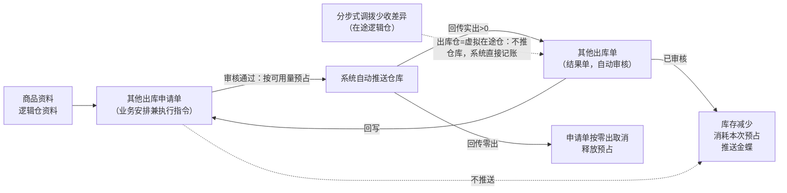
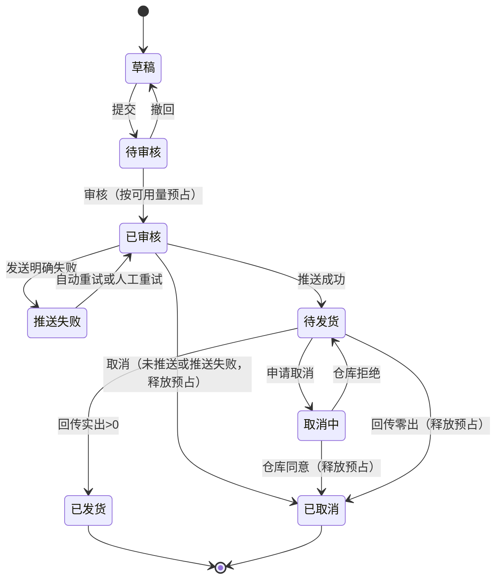

# 其他出库申请单主PRD

> 用途：定义其他出库申请单在ERP中的建单、审核预占、自动推送仓库、接收一次回传、缺量释放、取消与完结的系统行为，作为研发实现和测试验收的依据。
> 定位：应用设计层文档。业务规则以[《库存与仓储需求分析》](../../../../../02-需求调研和分析/03-库存与仓储/库存与仓储需求分析.md)（INV-FR04、INV-FR05、INV-FR06、INV-FR09、INV-AC06、INV-AC12、INV-AC16）和[《库存与仓储业务设计》](../../../../../03-业务分析和设计/03-库存与仓储业务设计.md)（§4.2、§4.4、§4.5、§5.1～§5.3、§6.1、§6.3、§七）为准；分层与共用规则以[《强盛ERP的单据分层设计》](../../../../../01-全局背景信息/5.强盛ERP的单据分层设计.md) §六、§八为准；状态与操作以[《单据与状态流转》](../../../系统架构和流程/03-单据与状态流转.md) §5.2 为准；预占的占用、消耗与释放口径见[《预占与冻结主PRD》](../预占与冻结/预占与冻结主PRD.md)；字段与取值以[《其他出库申请单（详细稿）》](../../../字段清单合集/库存相关/其他出库申请单/其他出库申请单（详细稿）.tsv)为准；页面骨架见[《其他出库申请单页面骨架》](其他出库申请单页面骨架.md)；页面交互以[前端Demo版PRD](前端Demo版PRD/)为准，**须服从本文 §6.4 状态—功能矩阵**。
> 不写什么：不写其他出库单内部的审核、库存记账与金蝶推送（见[《其他出库单主PRD》](../其他出库单/其他出库单主PRD.md)）；不写其他入库申请单与结果单；不写库存查询、库存流水、分步式调拨的页面与流程规则；不写系统权限、接口报文与数据库设计。

| 版本 | 本次变化 | 状态 |
| --- | --- | --- |
| V0.1 | 建立其他出库申请单主PRD：建单、审核预占、自动推送、一次回传、缺量释放、取消、验收 | 初稿，待评审 |

## 1. 文档信息与阅读边界

| 项目 | 内容 |
| --- | --- |
| 读者 | 研发工程师、测试工程师、产品复核 |
| 业务依据 | [《库存与仓储需求分析》](../../../../../02-需求调研和分析/03-库存与仓储/库存与仓储需求分析.md) INV-FR04、INV-FR05、INV-FR06、INV-FR09、INV-AC06、INV-AC12、INV-AC16；[《库存与仓储业务设计》](../../../../../03-业务分析和设计/03-库存与仓储业务设计.md) §4.2、§4.4、§4.5、§6.1、§6.3、§七 |
| 字段依据 | [《其他出库申请单（详细稿）》](../../../字段清单合集/库存相关/其他出库申请单/其他出库申请单（详细稿）.tsv)；字段名称、枚举、必填性、页面展示以TSV为准 |
| 状态依据 | [《单据与状态流转》](../../../系统架构和流程/03-单据与状态流转.md) §5.2 其他入库／出库申请单；单据状态owner为外部文档 |
| 页面依据 | [《其他出库申请单页面骨架》](其他出库申请单页面骨架.md)、[前端Demo版PRD](前端Demo版PRD/)；按钮展示与文案以Demo PRD为准，须服从本文 §6.4 |

关联资料：[《强盛ERP全局业务规则与约束》](../../../../../01-全局背景信息/4.强盛ERP全局业务规则与约束.md)（§二 库存记账与数量控制、§三 单据执行不能一概而论、§五 权限与审核边界）、[《6.强盛ERP的编码规则和通用字段规则》](../../../../../01-全局背景信息/6.强盛ERP的编码规则和通用字段规则.md)（1.2 前缀QTCKSQ、2.3 Code-Name、第三节系统记录字段）、[《系统与模块地图》](../../../系统架构和流程/00-系统与模块地图.md)、[《实体对象关系》](../../../系统架构和流程/02-实体对象关系.md)（§三、§四、§八）、[《公共能力与系统管理需求分析》](../../../../../02-需求调研和分析/08-公共能力与系统管理/公共能力与系统管理需求分析.md)（COM-FR01、COM-FR02）、[《系统集成需求分析》](../../../../../02-需求调研和分析/07-系统集成/系统集成需求分析.md)（INT-FR03、INT-FR06）。

## 2. 需求背景与目标

### 2.1 背景

非购销的出库（样品领用、赠送、报废等，清单已定，见§10.2 Q01）以及分步式调拨少收造成的在途差异，都需要在ERP留下依据再交给仓库或系统执行。过去这类出库靠线下通知，既锁不住可用量，也说不清是谁批准、实际出了多少。

其他出库申请单把“出什么、从哪个逻辑仓出、为什么出、出多少”固化成可审核的执行依据：审核时按可用量预占，审核后由系统直接推送仓库执行一次；仓库回传实际数量后生成其他出库单，即时库存与对应预占同时扣减，缺量部分释放预占。

### 2.2 目标

- 提供可审核、可追溯的其他出库安排：一张单一个出库逻辑仓、一个业务类型，明细按商品分行；
- 审核时按可用库存预占，可用不足不能审核；不允许负库存；
- 一期不分批：审核后直接推送仓库，仓库执行一次、按实际数量结束，余量不回补原单；
- 允许缺量、不允许超量：回传数量超过申请数量时整次拒绝并报错；
- 实出大于0生成其他出库单并消耗对应预占，未出部分释放预占；零出按取消申请单处理，不生成零数量结果单；
- 不提供手动关闭、不设到期自动关单，要中止只能取消，取消条件按状态区分并释放未执行预占；
- 在途差异例外：出库逻辑仓为虚拟在途仓时，不推送仓库，审核通过后由系统按申请数量直接生成已审核其他出库单并记账（§7.4、R20）。

已审核后申请数量、出库仓、业务类型与明细锁定，不可再改；需要调整只能取消后另建申请单。

## 3. 单据定位与业务边界

### 3.1 业务作用

| 项目 | 内容 |
| --- | --- |
| 单据层级 | 第1层——业务安排兼执行指令（两层链路：其他出库申请单 → 其他出库单），依据[《强盛ERP的单据分层设计》](../../../../../01-全局背景信息/5.强盛ERP的单据分层设计.md) §六 |
| 核心职责 | 记录出什么、从哪个逻辑仓出、为什么出、出多少，并在审核时预占可用量、作为仓库执行依据 |
| 单据来源 | 人工创建；ERP主动发起的其他出库一期唯一入口 |
| 下游单据 | 其他出库单：仓库回传实出合计大于0时，系统自动生成并自动审核，一张申请最多一张 |
| 数量关系 | 一张申请对应0或1张其他出库单；零出不生成 |
| 业务终结 | 已发货或已取消；不提供手动关闭，不设到期自动关单；两个终态都不可撤销 |

### 3.2 上下游关系摘要

> 完整链路见[《系统流程与单据交互》](../../../系统架构和流程/01-系统流程与单据交互.md)第8节；本文只保留申请单侧交接点。

### 3.3 业务对象关系

| 关系 | 说明 |
| --- | --- |
| 其他出库申请单 : 出库逻辑仓 | N:1；一张申请单一个出库逻辑仓；普通逻辑仓或虚拟在途仓（例外路径） |
| 其他出库申请单 : 商品明细 | 1:N；按商品分行 |
| 其他出库申请单 : 其他出库单 | 1:0..1；一次回传形成一张结果单，零出不生成 |
| 其他出库申请单 : 预占 | 1:N（按明细行）；审核占用，实出消耗，缺量与取消释放 |
| 其他出库申请单 : 来源单据 | 无强关联；处理在途差异时由出库仓（虚拟在途仓）体现来源（是否关联来源调拨单待确认，Q07） |

### 3.4 本单据不负责的事项

- 申请单不直接减少库存：审核只预占，库存减少由已审核其他出库单记账；
- 申请单不向金蝶推送；金蝶只接收已审核其他出库单；
- 不承担品质调整：正常品、待检品、残次品之间的转移走直接调拨，不放进其他出库；
- 不承担销售、采购退货的出库：各自的出库链见销售、采购模块；
- 不分批、不补出：仓库一次执行结束，未出数量不回补原单，需要再出另建申请单；
- 不做仓库主动回传的补建：仓库先完成盘亏等实际变动并回传时，直接形成其他出库单，不补建申请单（INV-FR04）；
- 不清理在途差异本身：少收差额保留在途，处理动作由业务人员另行发起（INV-FR03）。

## 4. 核心业务场景

### 4.1 主路径概览

| 步骤 | 参与方 | 动作或单据 | 关键结果 |
| --- | --- | --- | --- |
| 1 | 业务人员 | 在ERP新建其他出库申请单，选出库逻辑仓与业务类型，录商品与申请出库数量 | 草稿；不占库、不改变库存 |
| 2 | 审核人 | 审核通过 | 已审核；按可用库存预占；可用不足不能审核 |
| 3 | 系统 | 自动推送仓库 | 推送成功进入待发货；明确失败进入推送失败并自动重试 |
| 4 | 仓库 | 按实际数量执行一次并回传 | 允许缺量，不允许超量；回传数量不超过申请数量 |
| 5 | 系统 | 实出大于0生成其他出库单并自动审核 | 即时库存减少、消耗实出对应预占、释放未出预占；申请单已发货；结果单推金蝶 |
| 6 | 系统 | 回传零出 | 申请单按零出取消、释放预占，不生成零数量结果单，库存不变 |

### 4.2 场景索引

| 场景ID | 场景 | 类型 | 说明 |
| --- | --- | --- | --- |
| S01 | 正常建单、审核预占、推送与一次回传 | 主流程 | 草稿→待审核→已审核（预占）→待发货→回传实出>0→已发货；生成其他出库单 |
| S02 | 缺量回传 | 主流程 | 实出<申请数量→按实出记账并消耗预占→释放未出预占→不回补原单 |
| S03 | 零出取消 | 支线 | 回传实出0→申请单取消→释放全部预占→不生成结果单、库存不变 |
| S04 | 超量整次拒绝 | 异常 | 回传数量>申请数量→整次拒绝并报错→库存、预占与状态不变 |
| S05 | 撤回后重提 | 支线 | 待审核→撤回→草稿（保留撤回意见）→修改→重新提交 |
| S06 | 可用量不足阻断 | 异常 | 审核时可用不足→不能审核占库；记账后会为负→阻止生效并报错 |
| S07 | 推送失败重试 | 支线 | 已审核推送明确失败→推送失败→自动重试（次数按Q06确认，建议与三层通知单一致最多3次）→仍失败可人工重试或取消 |
| S08 | 取消（未推送或推送失败） | 支线 | 已审核未推送或明确推送失败且确认仓库未接收→取消→已取消并释放预占 |
| S09 | 取消（已推送给仓库） | 支线 | 待发货→申请取消→取消中→仓库同意→已取消并释放预占；仓库拒绝→恢复待发货 |
| S10 | 取消中收到实际结果 | 异常 | 取消期间到达的实际结果按真实结果完成→已发货并生成结果单，不落成已取消 |
| S11 | 在途差异直接记账 | 例外 | 出库仓=虚拟在途仓→不推送仓库→系统按申请数量直接生成已审核结果单并记账（§7.4、R20） |
| S12 | 已发货后需要再出 | 支线 | 原申请不可追加执行，另建申请单 |

## 5. 范围与功能索引

### 5.1 范围

| 类别 | 说明 |
| --- | --- |
| 本期要做 | 其他出库申请单列表、新增、编辑、详情；提交、审核（含预占）、撤回；审核后自动推送与推送失败重试；接收一次回传；缺量与预占释放、超量拒绝、零出取消；取消（含取消中）；在途差异直接记账例外路径；草稿删除；导出按导出中心 |
| 本期暂不做 | 分批执行与分批回传、余量回补原单、手动关闭、到期自动关单、申请单导入、结果单在本单内的重推入口、批量业务操作、按库存状态限制出库 |
| 本单据不负责 | 其他出库单的审核与记账、金蝶推送（见[《其他出库单主PRD》](../其他出库单/其他出库单主PRD.md)）；品质调整（直接调拨，INV-FR07）；仓库主动回传结果的补建（INV-FR04）；分步式调拨本身的执行与在途记账（INV-FR03） |

| 范围补充 | 说明 |
| --- | --- |
| 适用对象 | 成品SKU；一张申请单一个出库逻辑仓；一期不按正常品、待检品、残次品限制用途（INV-FR05） |
| 与原型差异 | 09-产品原型暂无本模块页面（菜单「库存管理-其他出库申请单」为未开放占位）；页面与交互以本套PRD为准 |

### 5.2 功能与追溯索引

| 功能编号与名称 | 本次内容 | 上游依据 | 规则与状态依据 | Demo PRD | 验收编号 |
| --- | --- | --- | --- | --- | --- |
| F01 列表 | 查询、列展示、行内操作入口、导出 | INV-FR06 | §6.4；R11～R20 | [列表页](前端Demo版PRD/其他出库申请单前端Demo版PRD_列表页.md) | AC13 |
| F02 新增/编辑页 | 维护出库仓、业务类型与商品明细；保存草稿 | INV-FR06 | R01～R05 | [新增编辑页](前端Demo版PRD/其他出库申请单前端Demo版PRD_新增编辑页.md) | AC01、AC05 |
| F03 提交 | 草稿提交、待审核取消 | COM-FR01 | R05、R16；§6.5 | [弹窗与Mock](前端Demo版PRD/其他出库申请单前端Demo版PRD_弹窗与Mock.md) §3.1、§3.4 | AC05、AC08 |
| F04 审核/撤回 | 待审核审核（占库）、撤回留意见 | COM-FR01、INV-FR05 | R07～R09；§6.5 | 弹窗与Mock §3.2、§3.3 | AC01、AC06 |
| F05 详情页 | 分区展示、关联单据、审核与终止信息 | INV-FR06 | §6.4 | [详情页](前端Demo版PRD/其他出库申请单前端Demo版PRD_详情页.md) | AC13 |
| F06 已审核操作 | 人工重试推送、取消（含释放预占） | INV-FR06、INV-AC12 | R11、R17～R19 | 列表/详情行操作 + 弹窗与Mock §3.4、§3.5 | AC09～AC11 |
| F07 删除草稿 | 草稿删除（二次确认，不可恢复） | 《单据分层设计》§6.3 | R06 | 弹窗与Mock §3.6 | AC07 |
| F08 在途差异直接记账 | 出库仓为虚拟在途仓时的例外路径 | INV-FR03；《库存与仓储业务设计》§4.2 | R20 | 新增编辑页 §3.1、§5；弹窗与Mock §3.8 | AC14 |
| F09 Demo Mock | 模拟仓库回传，串联结果单 | 演示需要，非业务规则 | — | 弹窗与Mock §5 | AC15 |

## 6. 状态与操作

状态定义owner：[《单据与状态流转》](../../../系统架构和流程/03-单据与状态流转.md) §5.2。其他出库申请单**只用一个单据状态字段**贯穿审核、推送与执行，不并列维护审核状态、业务状态或关闭状态；审核人、审核时间与操作记录仍保留。审核链无「已驳回」态，待审核不同意时操作为**撤回**（回到草稿），不叫驳回。

### 6.1 状态维度

| 维度 | 取值 | 说明 |
| --- | --- | --- |
| 单据状态 | 草稿、待审核、已审核、推送失败、待发货、取消中、已取消、已发货 | 一个字段串起审核、发送与执行；控制编辑、审核、取消与后续办理 |

其他出库使用「待发货、已发货」；其他入库使用「待收货、已收货」，本单不出现收货类取值。不另设推送中或推送成功状态，发送过程保留在推送记录中。

### 6.2 状态取值说明

| 状态 | 含义 | 是否终态 |
| --- | --- | --- |
| 草稿 | 尚未提交或撤回后待修改；只能编辑、提交、删除 | 否 |
| 待审核 | 已提交，等待审核；可审核、撤回、取消 | 否 |
| 已审核 | 审核通过并已按可用库存预占，系统自动推送仓库，尚未取得确定的发送结果 | 否 |
| 推送失败 | 已审核，但本次发送明确失败；可自动重试、人工重试或取消 | 否 |
| 待发货 | 仓库已成功接收，等待最终实际出库结果；可申请取消 | 否 |
| 取消中 | 已申请取消，等待仓库确认；不能提前释放预占或认定取消成功 | 否 |
| 已取消 | 本次业务取消，不再执行；预占已按规则释放 | 是 |
| 已发货 | 最终实际结果已确认，本次结束 | 是 |

### 6.3 状态流转图

出库仓为虚拟在途仓时走直接记账路径：审核通过后不进入推送失败、待发货，由系统按申请数量直接生成已审核其他出库单，申请单直接完结为已发货（§7.4、R20）。

推送结果不确定时（例如超时），先核实仓库是否收到，不重复发送、不提前释放预占、不直接认定取消成功。

### 6.4 状态—功能矩阵

> ✅ = 允许；❌ = 不允许；✅（条件）= 须满足对应规则。F01查询/查看、F05详情各状态均可用，不重复列出。

| 动作 | 草稿 | 待审核 | 已审核 | 推送失败 | 待发货 | 取消中 | 已取消 | 已发货 |
| --- | --- | --- | --- | --- | --- | --- | --- | --- |
| 编辑（F02） | ✅ | ❌ | ❌ | ❌ | ❌ | ❌ | ❌ | ❌ |
| 提交（F03） | ✅ | ❌ | ❌ | ❌ | ❌ | ❌ | ❌ | ❌ |
| 删除草稿（F07） | ✅ | ❌ | ❌ | ❌ | ❌ | ❌ | ❌ | ❌ |
| 审核（F04） | ❌ | ✅（R07） | ❌ | ❌ | ❌ | ❌ | ❌ | ❌ |
| 撤回（F04） | ❌ | ✅ | ❌ | ❌ | ❌ | ❌ | ❌ | ❌ |
| 取消（待审核，F03） | ❌ | ✅ | ❌ | ❌ | ❌ | ❌ | ❌ | ❌ |
| 取消（已审核，F06） | ❌ | ❌ | ✅（R17） | ✅（R17） | ✅（R18） | ❌ | ❌ | ❌ |
| 人工重试推送（F06） | ❌ | ❌ | ❌ | ✅（R11） | ❌ | ❌ | ❌ | ❌ |
| Demo Mock（F09） | ❌ | ❌ | ❌ | ❌ | ✅（Demo） | ❌ | ❌ | ❌ |

已取消、已发货：仅查看与追溯，不显示编辑、提交、审核、撤回、取消、重试。
列表与详情行内操作按状态互斥展示：草稿提供编辑、提交、删除；待审核提供审核、撤回、取消；已审核提供取消（须满足R17）；推送失败提供人工重试推送、取消；待发货提供取消（进入取消中）；取消中仅查看；已取消、已发货仅查看。列表批量操作栏一期仅展示已选中计数与列设置；导出在页头。

### 6.5 状态流转表

| 当前状态 | 动作 | 前置条件 | 结果状态 | 二次确认 | 后置影响 | 失败处理 |
| --- | --- | --- | --- | --- | --- | --- |
| 草稿 | 保存 | 明细已填则每行申请出库数量为正整数 | 草稿 | 无 | 首次保存分配单号（R01） | 校验失败定位字段或明细行 |
| 草稿 | 提交 | R05提交校验 | 待审核 | 见Demo PRD | 单号、出库仓、业务类型与数量锁定至撤回 | 阻断并提示 |
| 草稿 | 删除 | R06；草稿未被下游引用（草稿无下游） | 记录消失 | 二次确认 | 不可恢复；单号不重用 | 非草稿时阻断 |
| 待审核 | 审核 | 有权限用户操作（COM-FR01）；出库仓可用库存充足（R07） | 已审核 | 二次确认 | 按可用量预占；系统自动推送仓库；库存不变 | 可用不足、仓库禁用时阻断 |
| 待审核 | 撤回 | 必填撤回意见 | 草稿 | 无 | 保留撤回意见；未占用预占 | — |
| 待审核 | 取消 | 无 | 已取消 | 必填取消原因 | 终止审核流程；无预占可释放 | — |
| 已审核 | 自动推送 | 系统作业 | 待发货（成功） | 无 | 推送成功；预占保持占用 | 明确失败→推送失败，自动重试（次数按Q06确认，建议与三层通知单一致最多3次） |
| 推送失败 | 人工重试 | 操作人触发（F06） | 已审核 | 见Demo PRD | 等待新的发送结果，不重复审核、不重复预占 | 推送中不允许并发重试 |
| 已审核／推送失败 | 取消 | 未推送，或明确推送失败且已确认仓库未接收（R17） | 已取消 | 必填取消原因 | 释放未执行预占；不改变即时库存 | 条件不满足时阻断 |
| 待发货 | 申请取消 | 无 | 取消中 | 必填取消原因 | 不提前释放预占；等仓库回执 | — |
| 取消中 | 仓库同意取消 | 仓库回执确认 | 已取消 | 无 | 释放未执行预占；保留回执记录 | — |
| 取消中 | 仓库拒绝取消 | 仓库回执 | 待发货 | 无 | 恢复等待实际结果，预占继续占用 | — |
| 待发货 | 回传实出>0 | 实出按来源行回写且不超申请数量（R13、R14） | 已发货 | 无 | 生成其他出库单并自动审核；即时库存减少、消耗实出预占、释放未出预占；推金蝶 | 超量整次拒绝，保留异常 |
| 待发货 | 回传零出 | 最终确认整单零执行 | 已取消 | 无 | 实出显示0、未出＝申请数量；释放全部预占；不生成结果单、库存不变、不推金蝶 | 等待期间不提前按零出结束 |
| 取消中 | 回传实际结果 | 校验通过（R19） | 已发货 | 无 | 按真实结果完成；预占按实出消耗、未出释放 | 校验失败保留异常 |
| 已审核（在途仓） | 直接记账 | 出库仓为虚拟在途仓（R20） | 已发货 | 见Demo PRD | 不推送仓库；系统按申请数量生成已审核其他出库单并记账 | 记账校验不通过时阻断并报错；保持已审核，可按R17未推送取消或修复后重试，保留异常记录 |
| 已发货／已取消 | 查看 | — | 不变 | — | 终态，不可撤销 | — |

## 7. 核心业务规则

### 7.1 创建与提交规则

| 规则编号 | 主题 | 规则 | 边界或例外 |
| --- | --- | --- | --- |
| R01 | 单号 | 按[《6.强盛ERP的编码规则和通用字段规则》](../../../../../01-全局背景信息/6.强盛ERP的编码规则和通用字段规则.md)第一节自动生成，前缀QTCKSQ；保存草稿时分配 | 用户不可编辑；取消、删除后单号不重用 |
| R02 | 出库仓 | 只能选择审核通过且启用的逻辑仓；一张申请单一个出库仓；一期不按库存状态限制用途，有足够可用量即可办理 | 已禁用逻辑仓不可新选，已有单据继续；虚拟在途仓作为出库仓走R20例外路径 |
| R03 | 业务类型 | 必填；枚举（2026-09-23确认）：盘亏、样品领用、赠送、报废、借出 | 建单可选范围（2026-09-24确认）：盘亏由仓库盘点回传形成结果单，普通出库仓不建单，只有出库仓为虚拟在途仓（处理分步式调拨少收差异，见R20）时才可选「盘亏」；其余四项不受限 |
| R04 | 明细 | 至少一行有效明细；每行选择商品并填写申请出库数量（正整数，一期不允许小数）；数量按商品基本单位 | 同一商品重复行的处理待确认（Q03，建议按商品合并为一行） |
| R05 | 提交校验 | 单头必填完整（出库仓、业务类型）；明细至少一行；每行商品已选、申请出库数量为正整数；出库仓仍启用 | 校验失败阻断并定位到字段或明细行；提交不占库，审核才预占 |
| R06 | 草稿删除 | 草稿只能删除、不能取消；删除为物理删除、不可恢复，二次确认 | 草稿无下游引用；已提交、已审核不可删除 |

### 7.2 审核与字段锁定规则

| 规则编号 | 主题 | 规则 | 边界或例外 |
| --- | --- | --- | --- |
| R07 | 审核预占 | 审核通过时按各明细行的出库仓可用库存预占；可用库存不足（或处理后将为负）时不能审核并报错；不预占已冻结或已被其他业务占用的数量 | 可用库存＝即时库存−预占库存−冻结库存（INV-FR01、INV-FR05）；依据[《预占与冻结主PRD》](../预占与冻结/预占与冻结主PRD.md) F01、R02 |
| R08 | 字段锁定 | 已审核后出库仓、业务类型、商品与申请出库数量均不可修改；撤回回草稿后才可改 | 已审核后是否允许修改备注等非业务字段待确认（Q05，建议一律不可改） |
| R09 | 撤回 | 待审核可撤回，回到草稿并保留撤回意见；撤回后不再推送、不产生预占 | 撤回意见必填；不做反审核 |

### 7.3 执行与数量回写规则

| 规则编号 | 主题 | 规则 | 边界或例外 |
| --- | --- | --- | --- |
| R10 | 自动推送 | 审核通过后由系统自动推送仓库，不需要人工触发；不重复占库 | 推送失败见R11；发送结果不确定时先核实仓库是否接收 |
| R11 | 推送失败与重试 | 明确失败进入推送失败，系统自动重试（次数按Q06确认，建议与三层通知单一致最多3次），仍失败可人工重试或按R17取消；失败、等待执行、取消中都不提前释放预占 | 重试间隔由技术配置；重试次数口径待确认（Q06） |
| R12 | 一次回传、不分批 | 承担执行指令的申请单只接收一次回传，回传即结束；不分批、不设第二次执行 | 需要再出另建申请单；已发货后不可追加执行（《单据分层设计》§8.1） |
| R13 | 数量口径 | 每行维护申请出库数量与实出数量，未出数量＝申请出库数量−实出数量（计算）；实出由已审核其他出库单按来源行回写；最终结果未确认时实出可显示 `-`，未出按尚未执行的计划数量展示；零出按取消处理，实出显示0、未出＝申请数量（《单据分层设计》§6.4） | 不同商品不互相抵用；已发货后的未出数量表示本次最终未执行数量，不代表可补出 |
| R14 | 超量拒绝 | 回传数量超过申请数量时，系统直接拒绝本次回传并报错；需要接收超出部分时另建申请单 | 库存、预占与状态不变；依据INV-AC16、《单据分层设计》§8.2 |
| R15 | 回写与预占处理 | 实出合计大于0时生成其他出库单并自动审核，回写申请单实出与状态为已发货；实出部分消耗对应预占，未出部分释放预占；零出按S03取消并释放全部预占 | 消耗与释放不重复；记账以结果单为准（《实体对象关系》§八）；记账时校验负库存（R21） |

数量示例（标明为示例）：申请A商品100件并审核预占100；仓库回传实出90并结束，生成90件其他出库单；即时库存与预占各扣90，未出预占10释放，申请单已发货且不可补出。

预占的占用与释放不记入库存流水，预占变化通过来源单据与流水关联查看（[《库存流水主PRD》](../库存流水/库存流水主PRD.md)）。

### 7.4 在途差异直接记账规则

| 规则编号 | 主题 | 规则 | 边界或例外 |
| --- | --- | --- | --- |
| R20 | 虚拟在途仓例外 | 出库仓为虚拟在途仓时（用于处理分步式调拨少收差异）：审核通过后**不推送仓库**、不进入推送失败与待发货，由系统按申请数量直接生成已审核其他出库单并记账，申请单直接完结为已发货；数量按申请数量一次记账，不涉及缺量与取消中 | 在途差异保留与否由调拨规则决定，本单只负责按申请数量扣减在途逻辑仓（INV-FR03；《库存与仓储业务设计》§4.2）；时点与数量口径 2026-09-24 确认：审核通过即按申请数量直接记账（同步 01《4.强盛ERP全局业务规则与约束》与 03《库存与仓储业务设计》§4.2）；在途差异的业务类型取「盘亏」（2026-09-23确认）；是否关联来源调拨单与路径标注待确认（Q07；在途差异路径本身已由INV-FR03确认，审核环节按现设计保留）；出库仓=在途仓的可用量校验按R07执行 |

### 7.5 取消与终止规则

| 规则编号 | 主题 | 规则 | 边界或例外 |
| --- | --- | --- | --- |
| R16 | 待审核取消 | 待审核可直接取消，同时终止审核流程；取消原因必填 | 无预占可释放；取消后不可撤销；不允许删除待审核单据 |
| R17 | 已审核取消 | 未推送，或明确推送失败且已确认仓库未接收时可取消；取消成功后释放未执行预占；推送中（发送结果不确定）不得直接取消，先核实仓库是否接收 | 已推送部分不能单方面释放，要等实际结果或仓库取消成功；依据INV-FR06、INV-AC12 |
| R18 | 待发货取消 | 仓库已接收后只能申请取消，进入取消中并等待仓库确认；仓库同意→已取消并释放预占，拒绝→恢复待发货、预占继续占用 | 不能把ERP里的取消当成仓库已经取消 |
| R19 | 取消中收到实际结果 | 取消期间到达的实际结果仍须处理：校验通过后按真实结果完成并生成结果单，实出消耗预占、未出释放；不能把已执行的业务落成已取消 | 校验失败保留异常，修复后处理原记录，不重复记账 |
| R21 | 负库存阻断 | 审核预占与结果记账都要校验：处理后即时库存或可用库存将为负时，阻止本次生效并报错；不先记负数，也不自动释放其他业务的预占 | INV-FR09、INV-AC09；恢复方式待业务确认（Q10） |
| R22 | 不提供关闭、不设到期自动关单 | 其他出库申请单不提供手动关闭，也不设到期自动关单；申请只等仓库回传一次结果，回传后自动完结；要中止只能用取消 | 已发货、已取消为终态，不可撤销；依据INV-FR06 |

### 7.6 业务生效点

| 业务动作 | 申请单影响 | 库存影响 | 业财/外部影响 |
| --- | --- | --- | --- |
| 保存草稿 | 产生草稿，字段可改 | 无 | 无 |
| 提交 | → 待审核 | 无 | 无 |
| 审核通过 | → 已审核，字段锁定 | 按可用量预占；即时库存不变 | 系统自动推送仓库 |
| 推送成功 | → 待发货 | 无 | 仓库接收执行要求 |
| 回传实出>0 | → 已发货，回写实出与未出 | 生成其他出库单，即时库存减少、消耗实出预占、释放未出预占 | 结果单推金蝶，本单不推送 |
| 回传零出 | → 已取消 | 释放全部预占；库存不变 | 不推金蝶 |
| 取消（已审核） | → 已取消 | 释放未执行预占 | 不再推送 |
| 在途仓直接记账 | → 已发货 | 生成其他出库单，在途逻辑仓库存减少 | 结果单推金蝶 |

### 7.7 字段校验绑定

> 完整字段定义见TSV；本节只写保存草稿与提交审核的差异及跨字段规则，全局校验规范引用[《6.强盛ERP的编码规则和通用字段规则》](../../../../../01-全局背景信息/6.强盛ERP的编码规则和通用字段规则.md)。

| 字段 | 保存草稿 | 提交审核 | 模块覆盖说明 |
| --- | --- | --- | --- |
| 出库仓 | 必填，须为审核通过且启用的逻辑仓（可为虚拟在途仓） | 同左，并复核仍启用 | R02、R20 |
| 业务类型 | 必填 | 同左 | 枚举（2026-09-23确认）：盘亏、样品领用、赠送、报废、借出；盘亏仅在出库仓为虚拟在途仓时可选（2026-09-24确认） |
| 商品（明细） | 至少一行；每行已选 | 同左 | R04 |
| 申请出库数量 | 每行正整数、大于0 | 同左 | 一期不允许小数 |
| 可用库存 | 草稿不校验 | 审核时校验，可用不足阻断（R07、R21） | 数量校验在审核，不在保存与提交 |
| 备注 | 选填，`REMARK_500` | 同左 | 系统记录字段只读 |

## 8. 上下游影响与协同

| 关联模块/系统 | 需要配合的变化 | 交接内容与时机 | 验收结果 |
| --- | --- | --- | --- |
| 商品与主数据 | 提供启用的成品SKU、审核通过且启用的逻辑仓与虚拟在途仓；实体仓禁用不级联影响既有逻辑仓 | 建单选仓与商品；出库仓禁用后不可新选 | AC01、AC02 |
| 预占与冻结 | 审核占用、实出消耗、缺量与取消释放；不重复锁定 | 审核、结果单记账、取消三个接口点 | AC01、AC03、AC09 |
| 系统集成／仓库 | 接收申请单推送、回传一次实际数量、回执取消结果；接口能力需核验 | 审核后自动推送；回传实出或零出 | AC01、AC04、AC09 |
| 其他出库单 | 回传实出>0时自动生成并自动审核 | 结果单按来源行回写实出 | AC01 |
| 库存 | 审核只预占；结果单审核后即时库存减少并消耗预占 | 记账由结果单触发 | AC03 |
| 分步式调拨／在途 | 少收差异由业务人员另办其他出库，从虚拟在途仓扣减 | 出库仓=在途仓时走直接记账路径（R20） | AC14 |
| 金蝶 | 不接收申请单 | 只接收已审核其他出库单 | AC01 |
| 系统集成中心 | 推送失败记录查看；接口失败时人工确认实际结果（INT-FR06） | 失败原因与重推；人工确认入口待集成PRD | AC11、Q09 |
| 公共能力 | 提交、审核权限；导出中心 | 权限引用COM-FR01、COM-FR02 | Q08 |

## 9. 异常与一致性

### 9.1 并发操作

| 场景 | 业务处理结果 |
| --- | --- |
| 两人同时编辑同一草稿 | 后提交者不得覆盖先提交结果；失败并提示刷新 |
| 两人同时审核同一待审单 | 只允许一个成功；另一个提示状态已变化；预占不重复占用 |
| 审核同时可用量被其他业务占用 | 以服务端最新可用量为准重新校验，不足则阻断，不记负数 |
| 取消与回传同时发生 | 取消中到达的实际结果按R19处理，按真实结果完成 |
| 自动重试与人工重试同时触发 | 只允许一个作业成功；另一个提示状态已变化 |

### 9.2 幂等与重复处理

| 操作 | 幂等规则 |
| --- | --- |
| 推送重试 | 同一申请单的重复发送不重复生成执行、不重复占库 |
| 重复回传 | 不重复生成其他出库单、不重复回写实出、不重复消耗或释放预占；具体幂等标识与恢复机制留接口设计（《单据分层设计》§8.5） |
| 重复取消 | 取消成功后重复触发只保持已取消一致结果，不重复释放预占 |

### 9.3 与下游单据一致性

| 场景 | 处理方式 |
| --- | --- |
| 申请单已生成结果单 | 不可重复生成；同一申请最多一张有效其他出库单 |
| 回传校验失败 | 保留异常，暂不完成申请单、不减少库存、不回写实出；修复后处理同一份结果 |
| 已发货后来源追加回传 | 不接受第二次回传，按异常处理（《单据分层设计》§8.5） |
| 结果单推送金蝶失败 | 不回滚库存、预占消耗与申请单回写；在系统集成中心重推原结果单 |
| 取消与预占释放 | 消耗与释放不重复：同一部分不能既随实出消耗又随取消释放 |

## 10. 验收标准与待确认事项

### 10.1 验收标准

| 编号 | 对应功能/规则 | 条件与操作 | 预期结果 |
| --- | --- | --- | --- |
| AC01 | F02～F05/R05、R07、R15 | 申请A商品100件，走通保存、提交、审核、推送、回传实出90 | 审核预占100；生成90件其他出库单并自动审核；即时与预占各扣90、释放预占10；申请单已发货；未出10且不可补出（INV-AC06） |
| AC02 | R07 | 出库仓可用库存不足以覆盖申请数量时审核 | 审核被阻止并报错；不产生负库存、不占用已冻结或其他业务已预占的数量（INV-FR05、INV-FR09） |
| AC03 | R15 | 申请100件并审核预占100，仓库回传实出90 | 实出部分消耗预占，未出10释放；可用量同步反映消耗，不误判库存不足（《预占与冻结主PRD》AC04） |
| AC04 | R15、S03 | 仓库回传实出0 | 申请单按零出取消并释放全部预占，实出显示0、未出＝申请数量；不生成零数量结果单、库存不变、不推金蝶（INV-AC06） |
| AC05 | F03/R05 | 草稿提交、待审核撤回后修改再提交 | 撤回回草稿并保留撤回意见；重新提交进入待审核 |
| AC06 | F04/R07 | 待审核审核，可用量恰好等于申请数量 | 审核通过并预占；可用量随之减少，其他业务不能再占用同一部分 |
| AC07 | F07/R06 | 分别对草稿、待审核、已发货申请单尝试删除 | 草稿删除成功且不可恢复；其余状态阻断并提示 |
| AC08 | F03/R16 | 待审核申请单取消 | 进入已取消并终止审核；无预占可释放；不可撤销 |
| AC09 | F06/R17、R18 | 未推送时取消；待发货时申请取消并由仓库拒绝；再由仓库同意 | 未推送取消→已取消并释放预占；仓库拒绝→恢复待发货、预占继续；仓库同意→已取消并释放预占（INV-AC12） |
| AC10 | R19 | 取消中收到实际出库结果 | 校验通过后按真实结果完成→已发货并生成结果单；实出消耗预占、未出释放；不落成已取消、不重复记账 |
| AC11 | F06/R11 | 推送明确失败 | 自动重试（随Q06确认，建议与三层通知单一致最多3次）；仍失败保持推送失败，可人工重试或取消；等待期间预占不释放 |
| AC12 | R21 | 即时100、预占95时收到会使可用量为负的盘亏类记账（仓库主动回传场景） | 阻止结果生效并报错；不自动释放已有预占、不先记负数（INV-AC09） |
| AC13 | F01、F05 | 列表筛选单据状态多选；点击单号进详情 | 多选OR匹配；列表列与TSV一致；详情展示审核信息、关联结果单与终止信息 |
| AC14 | F08/R20 | 出库仓选虚拟在途仓，申请2件并审核 | 不推送仓库；系统按2件直接生成已审核其他出库单并扣减在途逻辑仓库存；申请单直接已发货 |
| AC15 | F09 | Demo Mock 模拟仓库回传 | 仅Demo可用；正式验收以仓库回传为准 |

### 10.2 待确认事项

| 编号 | 问题 | 影响范围 | 确认人 | 最迟确认阶段或时间 | 状态/结论 |
| --- | --- | --- | --- | --- | --- |
| Q01 | 其他出入库业务类型的完整枚举（02 §七） | 业务类型字段选项、列表筛选与测试数据 | — | — | 已定（2026-09-23）：其他入库＝盘盈、样品回收、借出归还、退料、赠品入库；其他出库＝盘亏、样品领用、赠送、报废、借出 |
| Q02 | 出库仓允许选择虚拟在途仓的范围与路径标注（是否限在途差异） | 出库仓选项与例外路径适用范围 | 待指定 | 主数据在途档案设计定稿前 | 待确认；路径本身已由INV-FR03确认，建议允许但仅用于在途差异处理 |
| Q03 | 同一商品是否允许在同一申请单重复行 | 明细校验与数量汇总 | 待指定 | 页面评审前 | 待确认；建议按商品合并为一行 |
| Q04 | 取消原因是否必填、取消留痕与查看入口 | 取消弹窗校验与记录展示 | 待指定 | 库存模块详细设计定稿前 | 待确认；建议必填并保留取消人、取消时间（《4.强盛ERP全局业务规则与约束》§五）；取消条件依据INV-FR06 |
| Q05 | 已审核后允许修改的范围 | 已审核单的编辑入口 | 待指定 | 业务先确认（03 §七） | 待确认；建议业务字段一律不可改、调整另建申请单；已审核后业务字段锁定为确认前过渡口径 |
| Q06 | 两层申请单推送失败的自动重试次数与间隔 | 推送失败处理与重试作业 | 待指定 | 接口设计前 | 待确认；建议与三层通知单一致（最多3次，间隔由技术配置） |
| Q07 | 在途仓直接记账路径：是否仍需人工审核、是否关联来源分步式调拨单、是否需要在申请单标注路径 | 例外路径的操作与追溯 | 待指定 | 在途档案与调拨PRD定稿前 | 待确认；建议保留人工建单与审核、在申请单上选填来源调拨单用于追溯 |
| Q08 | 建单、提交、审核、取消、重试的角色与数据范围 | 页面入口可见性与操作留痕 | 待指定 | 权限配置（系统管理PRD）定稿前 | 待确认；引用COM-FR01、COM-FR02 |
| Q09 | 已交给仓库、接口拿不到结果时人工确认实际结果的入口形态 | 申请单完成方式 | 待指定 | 集成PRD定稿前 | 待确认；沿用INT-FR06，入口在系统集成中心，本模块不提供无来源建单 |
| Q10 | 库存不足阻断后的恢复方式 | 阻断后如何重新处理 | 待指定 | 业务先确认（03 §七） | 待确认；当前只明确阻止生效并报错，不自动释放已有预占、不先记负数 |
| Q11 | 结果错误或重复到达后的更正方式（非外部电商来源） | 是否新增冲销或更正流程 | 待指定 | 业务先确认（03 §七） | 待确认；结果单差异不设常规业务更正流程，由技术介入或线下约定处理（《单据分层设计》§8.5），不凭空定义冲销单 |
| Q12 | 在途少收差异走其他出库时的业务类型 | 业务类型字段选项与在途差异路径的取值 | — | — | 已定（2026-09-23）：并入现有值「盘亏」，不新增枚举项 |

## 11. 关联文档与阅读入口

| 关联内容 | 阅读入口 | 本PRD与其边界 |
| --- | --- | --- |
| 库存与仓储需求 | [《库存与仓储需求分析》](../../../../../02-需求调研和分析/03-库存与仓储/库存与仓储需求分析.md) INV-FR05、INV-FR06、INV-FR09 | 结论来源；本文不重复论证 |
| 业务运行规则 | [《库存与仓储业务设计》](../../../../../03-业务分析和设计/03-库存与仓储业务设计.md) §4.2、§4.4、§6.1 | 其他收发与在途差异的业务规则来源 |
| 分层模型与共用规则 | [《强盛ERP的单据分层设计》](../../../../../01-全局背景信息/5.强盛ERP的单据分层设计.md) §六、§八 | 两层链路、一次回传、缺量超量、零出取消 |
| 状态与操作 | [《单据与状态流转》](../../../系统架构和流程/03-单据与状态流转.md) §5.2、§六 | 状态owner；数量口径与回写 |
| 预占规则 | [《预占与冻结主PRD》](../预占与冻结/预占与冻结主PRD.md) F01、F02、R02、R09 | 占用、消耗、释放口径；本文不重复展开 |
| 对象关系与回写 | [《实体对象关系》](../../../系统架构和流程/02-实体对象关系.md) §三、§四、§八 | 1:0..1关系与回写口径 |
| 结果单 | [《其他出库单主PRD》](../其他出库单/其他出库单主PRD.md) | 生成、记账与金蝶推送在结果单PRD |
| 字段定义 | [《其他出库申请单（详细稿）》](../../../字段清单合集/库存相关/其他出库申请单/其他出库申请单（详细稿）.tsv) | TSV为字段owner |
| 页面结构 | [《其他出库申请单页面骨架》](其他出库申请单页面骨架.md) | 区域与线框走查，非规则权威 |
| 页面交互 | [前端Demo版PRD](前端Demo版PRD/) | 控件、文案、Mock；服从本文 §6.4 |
