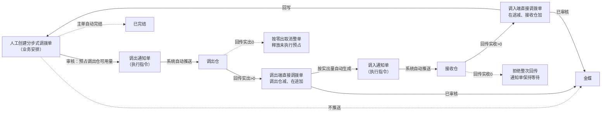
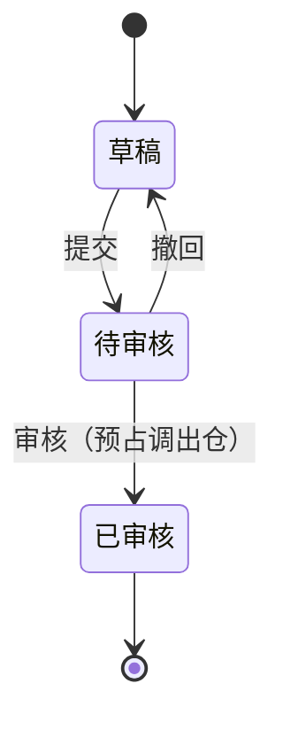
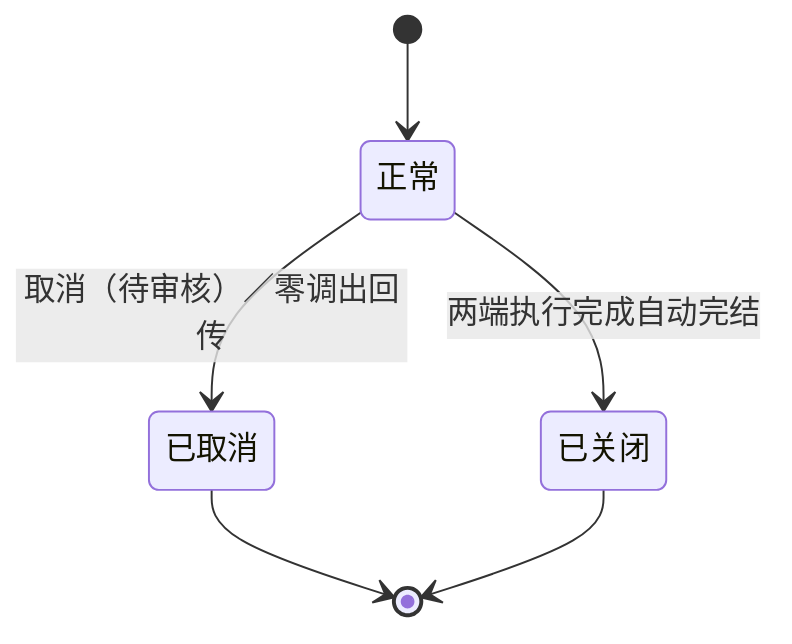

# 分步式调拨单主PRD

> 用途：定义分步式调拨单在ERP中的建单、审核预占、两端执行衔接、在途与少收差异、主单自动完结及取消，作为研发实现和测试验收的依据。
> 定位：应用设计层文档。业务规则以[《库存与仓储需求分析》](../../../../../02-需求调研和分析/03-库存与仓储/库存与仓储需求分析.md)（INV-FR03、INV-FR05、INV-FR09、INV-FR10、INV-AC03、INV-AC11、INV-AC13、INV-AC16）和[《库存与仓储业务设计》](../../../../../03-业务分析和设计/03-库存与仓储业务设计.md)（§4.2、§4.8、§5.1～§5.3、§6.1～§6.4、§七）为准；三层单据模型与共用规则以[《强盛ERP的单据分层设计》](../../../../../01-全局背景信息/5.强盛ERP的单据分层设计.md) §五、§八、§九为准；状态与操作以[《单据与状态流转》](../../../系统架构和流程/03-单据与状态流转.md) §一、§二、§六、§七、§九为准；字段与取值以[《分步式调拨单（详细稿）》](../../../字段清单合集/库存相关/分步式调拨单/分步式调拨单（详细稿）.tsv)为准；页面骨架见[《分步式调拨单页面骨架》](分步式调拨单页面骨架.md)；页面交互以[前端Demo版PRD](前端Demo版PRD/)为准，**须服从本文 §6.4 状态—功能矩阵**。
> 不写什么：不写调出通知单、调入通知单的推送与回传细节（见[《调出通知单主PRD》](../调出通知单/调出通知单主PRD.md)、[《调入通知单主PRD》](../调入通知单/调入通知单主PRD.md)）；不写直接调拨单的记账与金蝶推送（见[《直接调拨单主PRD》](../直接调拨单/直接调拨单主PRD.md)）；不写在途差异用其他出库扣减的操作细节（见[《其他出库申请单主PRD》](../其他出库申请单/其他出库申请单主PRD.md)）；不写仓库作业细节、金蝶报文字段映射、系统权限与数据库设计。

| 版本 | 本次变化 | 状态 |
| --- | --- | --- |
| V0.1 | 建立分步式调拨单主PRD：建单、审核预占、两端执行衔接、在途与少收、自动完结与取消 | 初稿，待评审 |

## 1. 文档信息与阅读边界

| 项目 | 内容 |
| --- | --- |
| 读者 | 研发工程师、测试工程师、产品复核 |
| 业务依据 | [《库存与仓储需求分析》](../../../../../02-需求调研和分析/03-库存与仓储/库存与仓储需求分析.md) INV-FR03、INV-FR05、INV-FR09、INV-FR10、INV-AC03、INV-AC11、INV-AC13、INV-AC16；[《库存与仓储业务设计》](../../../../../03-业务分析和设计/03-库存与仓储业务设计.md) §3.1、§3.2、§4.2、§4.8、§5.2、§5.3、§6.1、§6.3、§七 |
| 字段依据 | [《分步式调拨单（详细稿）》](../../../字段清单合集/库存相关/分步式调拨单/分步式调拨单（详细稿）.tsv)；字段名称、枚举、必填性、页面展示以TSV为准 |
| 状态依据 | [《单据与状态流转》](../../../系统架构和流程/03-单据与状态流转.md) §二（三层主单，含“分步式调拨单的差异”段）；单据分层模型见[《强盛ERP的单据分层设计》](../../../../../01-全局背景信息/5.强盛ERP的单据分层设计.md) §5.9 |
| 页面依据 | [《分步式调拨单页面骨架》](分步式调拨单页面骨架.md)、[前端Demo版PRD](前端Demo版PRD/)；按钮展示与文案以Demo PRD为准，须服从本文 §6.4 |

关联资料：[《强盛ERP全局业务规则与约束》](../../../../../01-全局背景信息/4.强盛ERP全局业务规则与约束.md)（§二 库存记账与数量控制、§3.1 直接及分步式调拨、§四 金蝶推送范围）、[《6.强盛ERP的编码规则和通用字段规则》](../../../../../01-全局背景信息/6.强盛ERP的编码规则和通用字段规则.md)（1.2 前缀FBDB、2.3 Code-Name、第三节系统记录字段与列表排序）、[《实体对象关系》](../../../系统架构和流程/02-实体对象关系.md)（§一、§三、§四、§五、§六）、[《系统流程与单据交互》](../../../系统架构和流程/01-系统流程与单据交互.md)第7节、[《预占与冻结主PRD》](../预占与冻结/预占与冻结主PRD.md)（R05、R09）、[《库存流水主PRD》](../库存流水/库存流水主PRD.md)、[《库存查询主PRD》](../库存查询/库存查询主PRD.md)、[《系统集成需求分析》](../../../../../02-需求调研和分析/07-系统集成/系统集成需求分析.md)（INT-FR03、INT-FR05、INT-FR06）。

## 2. 需求背景与目标

### 2.1 背景

深圳向东莞、FBA、海外仓备货，属于仓与仓之间的库存转移，不是消费者销售。货已经从调出仓发出、还没被接收仓收到的这段过程必须单独记账，否则两端库存会出现「一边已经减、另一边还没加」的空档，既看不出在途数量，也无法处理少收差异。

一期调拨由ERP创建并调度，领星、聚水潭作为下游执行方只接收通知、回传结果，不发起调拨。两端执行有先后依赖，因此保留业务安排与两条执行指令，实际库存变化仍由结果单承接。

### 2.2 目标

- 把调拨安排固化为可审核、可追溯的单据：一张单一个调出仓、一个接收仓、一份商品明细；
- 审核时按计划调拨数量预占调出仓可用库存，可用不足不能审核；
- 两端各一次执行、不分批：先调出、后接收，调入通知按实际调出量生成，不按原计划量提前下发；
- 在途单独记账：调拨在途＝累计实际调出−累计实际调入，少收差异留在途，不自动抹平；
- 收到调入回传并生成第二张直接调拨单后主单自动完结；零调出按取消处理，零调入拒绝整次回传；
- 分步式调拨主单不作为实际结果传递：实际调出、调入分别形成直接调拨单并推金蝶。

## 3. 需求范围

### 3.1 本期范围

- 分步式调拨单列表、新增、编辑、详情；
- 提交、审核、撤回；待审核取消；草稿删除；
- 审核时校验调出仓可用量并预占；生成调出通知单并由系统自动推送调出仓；
- 调出、调入结果回传后的主单数量回写（累计实际调出、累计实际调入、在途数量）；
- 两端执行完成后主单自动完结（业务状态=已关闭，页面文案「已完结」）；
- 零调出按取消处理；零调入拒绝整次回传并保留等待；
- 与调出通知单、调入通知单、直接调拨单的来源关系与追溯；
- 页头导出；一期批量栏仅已选中计数与列设置。

### 3.2 功能清单

| 编号 | 功能/位置 | 本次内容 | 需求来源 |
| --- | --- | --- | --- |
| F01 | 调拨单列表 | 查询、列展示（含数量进度列）、进入详情；审核状态与业务状态多选筛选；勾选配合页头导出；一期批量栏无业务按钮 | INV-FR03 |
| F02 | 新增/编辑页 | 维护单据信息与商品明细；草稿保存；草稿可编辑、可删除 | INV-FR03 |
| F03 | 提交/撤回/取消（待审核） | 草稿提交；待审核撤回留意见；待审核可取消并终止审核 | INV-FR03；COM-FR01 |
| F04 | 审核 | 校验调出仓可用量并预占；生成调出通知单并自动推送调出仓 | INV-FR03、INV-FR05 |
| F05 | 详情页 | 分区域只读展示、关联单据（调出通知单、调入通知单、两张直接调拨单）、终止信息与审核信息 | INV-FR03 |
| F06 | 结果回写（系统） | 调出回传回写累计实际调出；调入回传回写累计实际调入与在途数量 | INV-FR03 |
| F07 | 主单自动完结（系统） | 收到调入回传并生成第二张直接调拨单后自动完结 | INV-FR03、INV-AC03 |
| F08 | 零调出/零调入处理（系统） | 实出0按零出取消整单并释放未执行预占；实收0拒绝整次回传、通知单保持等待 | INV-FR03、INV-AC13 |
| F09 | Demo Mock | 模拟调出仓、接收仓回传，串联两张直接调拨单与主单完结；仅Demo | 演示需要，非业务规则 |

### 3.3 需求追溯

| 上游场景与需求 | 本 PRD 功能 | 本 PRD 验收 |
| --- | --- | --- |
| INV-FR03：审核预占、调出、在途、按实出通知接收、主单自动完结 | F04、F06、F07 | AC01、AC02、AC03 |
| INV-FR03、INV-AC03：计划100、实出90、实收88，释放未发10、在途剩2 | F06、F07 | AC04 |
| INV-FR03、INV-AC13：零调出按取消；零调入拒绝整次回传 | F08 | AC05、AC06 |
| INV-FR05：审核预占、实际调出消耗预占、释放未发部分 | F04、F06 | AC03 |
| INV-FR09、INV-AC16：不允许负库存；超量整次拒绝 | F04、F08 | AC07、AC08 |
| INV-FR10、INV-AC10：主单不推金蝶，两端直接调拨单分别推送 | F05 | AC09 |
| INV-FR03：少收差异留在途，人工用其他出库从在途逻辑仓扣减 | F06、F07 | AC10 |

### 3.4 非本期范围

- 调拨分批执行、原单补发或补收（一期两端各一次执行，结束即终态）；
- 往已完结主单追加执行；少收差异不在原单处理，走其他出库从在途逻辑仓扣减；
- 用调拨替代买卖；多主体之间的购销与调拨（范围口径见《强盛ERP需求分析总览》§3.1）；
- 头程物流管理、仓库作业接管、ERP盘点单；
- 分步式调拨主单推送仓库或推送金蝶；
- 系统权限矩阵、API/表结构/并发锁实现。

| 范围补充 | 说明 |
| --- | --- |
| 适用对象 | 成品SKU；调出仓、接收仓均为逻辑仓，且都不能选虚拟在途仓 |
| 在途仓边界 | 虚拟在途仓只用于分步式调拨的在途记账，不能被本单选为调出仓或接收仓（《库存与仓储业务设计》§4.2） |
| 与原型差异 | 09-产品原型暂无本模块页面（菜单「库存管理-分步式调拨单」为未开放占位）；页面与交互以本套PRD为准 |

## 4. 单据定位与业务边界

### 4.1 业务作用

| 项目 | 内容 |
| --- | --- |
| 单据层级 | 第1层——业务安排单，表达本次仓间库存转移的安排与执行依据（《单据分层设计》§五） |
| 核心职责 | 记录从哪个仓调到哪个仓、调什么、计划调多少；控制预占、两端执行衔接与主单完结 |
| 单据来源 | 人工创建；一期唯一方式 |
| 下游单据 | 调出通知单（审核通过后系统自动生成并推送）；调入通知单（按实际调出量自动生成并推送）；调出端、调入端直接调拨单各一张（回传校验通过后自动生成） |
| 数量关系 | 一张主单对应1张调出通知单、0或1张调入通知单；对应0～2张直接调拨单（零调出时0张） |
| 业务终结 | 两端执行完成自动完结（业务状态=已关闭，页面文案「已完结」）；零调出按取消；完结不代表在途差异已清理 |

### 4.2 上下游关系摘要

> 完整链路见[《系统流程与单据交互》](../../../系统架构和流程/01-系统流程与单据交互.md)第7节；本文只保留主单侧交接点。

### 4.3 业务对象关系

| 关系 | 说明 |
| --- | --- |
| 分步式调拨单 : 调出通知单 | 1:1；主单审核通过后系统自动生成，一期不分批 |
| 分步式调拨单 : 调入通知单 | 1:0..1；按实际调出量生成；零调出不生成 |
| 分步式调拨单 : 直接调拨单 | 1:0..2；调出端、调入端各一张，零调出不生成 |
| 分步式调拨单 : 调出仓／接收仓 | N:1（各一个）；均为审核通过且启用的逻辑仓，不能选虚拟在途仓 |
| 调拨单明细 : 调出通知单行／调入通知单行 | 1:1；数量按来源行累计回写 |
| 分步式调拨单 : 预占 | 1:1（按明细行）；审核时占用调出仓可用量，实出消耗、未发与零调出释放 |

### 4.4 本单据不负责的事项

- 主单不直接减少或增加库存；库存变化由调出端、调入端直接调拨单审核后触发；
- 主单不推送仓库、不推送金蝶；通知单与结果单由对应对象负责；
- 主单不修改调出仓、接收仓、商品与计划数量（审核后锁定；已审核后的修改范围待确认，Q03）；
- 主单不自动抹平少收差异；差异留在途，由人工用其他出库从在途逻辑仓扣减；
- 主单不补建分批执行；两端各一次执行结束，需要再调拨另建主单；
- 不能用调拨替代买卖；涉及买卖的场景按购销另办；
- 在途仓不参与本单的调出、接收选仓。

## 5. 核心业务场景索引

| 场景ID | 场景 | 类型 | 说明 |
| --- | --- | --- | --- |
| S01 | 完整两端调拨 | 主流程 | 建单→审核预占→推送调出仓→实出→调出仓减、在途加→按实出通知接收→实收→在途减、接收仓加→主单自动完结 |
| S02 | 少发（未发释放预占） | 主流程 | 实出<计划量→按实出消耗预占、释放未发部分→调入通知按实出量生成 |
| S03 | 少收（差异留在途） | 主流程 | 实收<调入通知量→在途按实收减少→差额继续留在途，后续用其他出库从在途扣减 |
| S04 | 零调出 | 支线 | 回传实出0→按零出取消整单，释放未执行预占；不生成在途、调入通知与两张直接调拨单 |
| S05 | 零调入 | 异常 | 回传实收0→拒绝整次回传并报错；通知单保持等待；不按零收取消；须人工处理 |
| S06 | 超量回传 | 异常 | 实出或实收超过指令数量→整次拒绝并报错；库存与预占不变 |
| S07 | 可用不足阻断 | 异常 | 审核时调出仓可用量不足→阻断审核，不预占、不生成调出通知单 |
| S08 | 撤回后重提 | 支线 | 待审核→撤回→草稿（保留撤回意见）→修改→重新提交 |
| S09 | 待审核取消 | 支线 | 待审核+正常→取消（必填取消原因）→已取消，终止审核流程 |
| S10 | 推送失败重试 | 支线 | 调出／调入通知推送明确失败→自动重试最多3次→仍失败可人工重试（通知单侧） |
| S11 | 主单完结后差异处理 | 主流程/后续 | 主单已完结、在途仍有余额→人工用其他出库从在途逻辑仓扣减（业务类型盘亏） |

## 6. 状态与操作

状态定义owner：[《单据与状态流转》](../../../系统架构和流程/03-单据与状态流转.md) §二（含“分步式调拨单的差异”段）。分步式调拨单用**审核状态**与**业务状态**两个字段并列维护，无收货状态维度。审核链无「已驳回」态，待审核不同意时操作为**撤回**（回到草稿），不叫驳回。取消、完结保留原审核状态，不把已审核主单撤回为草稿。

### 6.1 状态维度

| 维度 | 取值 | 说明 |
| --- | --- | --- |
| 审核状态 | 草稿、待审核、已审核 | 控制编辑、审核与能否进入两端执行 |
| 业务状态 | 正常、已关闭、已取消 | 控制是否继续办理；已关闭在页面展示为「已完结」 |

「正常」表示未取消且未完结，与两端是否已经执行无关；可出现「已审核+正常+已实收完毕但第二张直接调拨单尚未生成」的过渡态。

### 6.2 状态取值说明

| 状态 | 含义 | 是否终态 |
| --- | --- | --- |
| 草稿 | 尚未提交或撤回后待修改 | 否 |
| 待审核 | 已提交，等待审核 | 否 |
| 已审核 | 审核通过，已预占调出仓库存，两端执行按链路推进 | 否（业务状态仍可变） |
| 正常 | 未取消、未完结 | 否 |
| 已关闭 | 两端执行完成自动完结；页面文案「已完结」 | 是（业务维度） |
| 已取消 | 待审核取消，或仓库零调出按取消处理 | 是（业务维度） |

### 6.3 状态流转图

**审核状态**：

**业务状态**：

### 6.4 状态—功能矩阵

> ✅ = 允许；❌ = 不允许；✅（条件）= 须满足对应规则。F01 查询/查看各状态均可用，不重复列出。

| 动作 | 草稿+正常 | 待审核+正常 | 已审核+正常 | 已审核+已关闭 | 已取消 |
| --- | --- | --- | --- | --- | --- |
| 编辑（F02） | ✅ | ❌ | ❌ | ❌ | ❌ |
| 提交（F03） | ✅ | ❌ | ❌ | ❌ | ❌ |
| 撤回（F03） | ❌ | ✅ | ❌ | ❌ | ❌ |
| 取消（待审核，F03） | ❌ | ✅ | ❌ | ❌ | ❌ |
| 删除草稿（F02） | ✅（条件） | ❌ | ❌ | ❌ | ❌ |
| 审核（F04） | ❌ | ✅（条件） | ❌ | ❌ | ❌ |
| 查看调出／调入通知与直接调拨（F05） | ✅ | ✅ | ✅ | ✅ | ✅ |
| Demo Mock（F09） | ❌ | ❌ | ✅（Demo） | ❌ | ❌ |

说明：

- 已审核+正常不提供主单直接取消：调出通知已推送仓库，不能单方面释放预占；零调出由仓库回传按取消处理（F08）。调出通知单取消成功后主单如何收口见 Q05。
- 已关闭、已取消：仅查看与追溯，不显示编辑、提交、审核、取消，也不提供反完结入口。
- 列表与详情行内操作按状态互斥展示；列表批量操作栏一期仅展示已选中计数与列设置，不提供批量取消；导出在页头，可选已勾选范围。
- 全部操作权限按RBAC，引用COM-FR01、COM-FR02；本文不写权限矩阵。

### 6.5 状态流转表

| 当前状态 | 动作 | 前置条件 | 结果状态 | 二次确认 | 后置影响 | 失败处理 |
| --- | --- | --- | --- | --- | --- | --- |
| 草稿+正常 | 保存 | 单据信息完整；明细已填则每行计划调拨数量>0（R03） | 草稿+正常 | 无 | 分配单号（R01） | 校验失败定位字段/行 |
| 草稿+正常 | 提交 | R04 提交校验 | 待审核+正常 | 见 Demo PRD | 调出仓、接收仓、商品与数量锁定 | 阻断并提示 |
| 草稿+正常 | 删除 | 未被下游引用 | 物理删除 | 二次确认 | 记录消失，单号不重用 | 被引用或非草稿时阻断 |
| 待审核+正常 | 审核 | 调出仓可用量充足（R07）；调出仓≠接收仓；两仓均非虚拟在途仓 | 已审核+正常 | 二次确认 | 按计划调拨数量预占调出仓；生成调出通知单并自动推送调出仓（R07） | 可用不足时阻断，不预占、不生成通知 |
| 待审核+正常 | 撤回 | 必填撤回意见 | 草稿+正常 | 无 | 保留撤回意见 | — |
| 待审核+正常 | 取消 | 无 | 原审核+已取消 | 必填取消原因 | 终止审核流程；记录取消信息 | — |
| 已审核+正常 | 调出回传（实出>0） | 实出≤通知调出数量（R17） | 已审核+正常 | 自动 | 回写累计实际调出；消耗实出预占、释放未发预占；生成调出端直接调拨单与调入通知单（F06） | 超量整次拒绝 |
| 已审核+正常 | 调出回传（实出=0） | 仓库最终确认零调出（R13） | 已审核+已取消 | 自动 | 取消整单；释放全部未执行预占；不生成在途、调入通知与两张直接调拨单 | — |
| 已审核+正常 | 调入回传（实收>0） | 实收≤通知调入数量（R18） | 已审核+已关闭 | 自动 | 回写累计实际调入与在途数量；生成调入端直接调拨单；主单自动完结（R10） | 超量整次拒绝 |
| 已审核+正常 | 调入回传（实收=0） | — | 状态不变 | 自动 | 拒绝整次回传并报错；通知单保持等待；库存与在途不变 | 须人工处理（R14） |
| 已关闭/已取消 | 查看 | — | 不变 | — | — | — |

## 7. 核心业务规则

### 7.1 创建与提交规则

| 规则编号 | 主题 | 规则 | 边界或例外 |
| --- | --- | --- | --- |
| R01 | 单号 | 按[《6.强盛ERP的编码规则和通用字段规则》](../../../../../01-全局背景信息/6.强盛ERP的编码规则和通用字段规则.md)第一节自动生成；前缀FBDB；保存草稿时分配 | 用户不可编辑；取消、删除后单号不重用 |
| R02 | 调出仓与接收仓 | 只能选择审核通过且启用的逻辑仓；两个仓不能相同；**都不能选虚拟在途仓** | 在途仓只用于分步式调拨的在途记账（《库存与仓储业务设计》§4.2）；已禁用逻辑仓不可新选，已有业务继续；一期不限制两仓是否属于同一实体仓，跨实体仓与同实体仓都按本单处理 |
| R03 | 商品与数量 | 明细商品为启用的成品SKU；每行计划调拨数量为大于0的整数，一期不允许小数；至少一行有数量 | 同一商品重复行的处理待确认（Q02），当前画法不阻断；数量按基本单位 |
| R04 | 提交校验 | 调出仓、接收仓已选且不相同、均非在途仓；每行计划调拨数量>0；单据信息完整 | 提交后调出仓、接收仓、商品与数量锁定；撤回后可再改 |
| R05 | 编辑范围 | 草稿可编辑；待审核、已审核不可编辑（已审核后的修改范围待确认，Q03） | 待审核只能撤回后修改 |
| R06 | 删除草稿 | 仅草稿+正常且未被下游引用时可物理删除 | 已生成通知或已进入执行的不可删除 |

### 7.2 审核与预占规则

| 规则编号 | 主题 | 规则 | 边界或例外 |
| --- | --- | --- | --- |
| R07 | 审核与预占 | 审核通过时按计划调拨数量预占调出仓可用库存；审核通过后系统自动生成调出通知单并推送调出仓 | 可用库存＝即时库存−预占库存−冻结库存，不足时阻断审核；审核不改变即时库存（INV-FR05、INV-AC05） |
| R08 | 预占消耗与释放 | 调出回传实出后：消耗实出对应的预占，释放未发部分的预占；零调出取消时释放全部未执行预占 | 同一部分不能既消耗又释放，也不能重复释放（[《预占与冻结主PRD》](../预占与冻结/预占与冻结主PRD.md)R09） |
| R17 | 实出上限 | 调出回传的实际调出不超过通知调出数量；超出时整次拒绝并报错 | 需要接收超出部分时另建调拨单（INV-AC16；《单据分层设计》§8.2） |
| R18 | 实收上限 | 调入回传的实际调入不超过通知调入数量；超出时整次拒绝并报错 | 需要接收超出部分时另建调拨单（INV-AC16；《单据分层设计》§8.2） |
| — | 负库存阻断 | 预占、结果记账时处理后即时或可用库存为负，阻止本次生效并报错 | 不先记负数、不自动释放已有预占（INV-FR09） |

数量示例（示例）：计划调拨100件，审核时预占调出仓100；实出90时消耗预占90并释放10；调入通知按90件生成；实收88时在途由90减为88，剩2件留在途。

### 7.3 两端执行与数量回写规则

| 规则编号 | 主题 | 规则 | 边界或例外 |
| --- | --- | --- | --- |
| R09 | 在途记账 | 调拨在途＝累计实际调出−累计实际调入；调出实发增加在途，调入实收减少在途 | 《单据与状态流转》§六；在途挂在调出仓管理的虚拟在途仓上；少收差额继续留在途 |
| R10 | 主单自动完结 | 收到调入回传并生成调入端直接调拨单后，业务状态自动置「已关闭」，页面展示「已完结」；关闭方式记「两端执行完成自动完结」，关闭原因与关闭操作人留空 | 完结表示两端执行链走完，不代表少收差异已经清理；不提供手工关闭与到期自动关单（当前画法，见Q01；一期不分批、无余量可关） |
| R11 | 少收差异 | 实收少于调入通知量的差额留在途，不自动抹平、不补建原单批次 | 由人工用其他出库从在途逻辑仓扣减（业务类型盘亏，2026-09-23确认）；涉及虚拟在途仓的场景不推送仓库，由系统按确认结果直接记账 |
| R12 | 不补发不补收 | 每端一次执行结束，不回原单补发或补收 | 需要再调拨另建主单；主单完结不等于差异已处理 |
| — | 数量回写 | 已审核直接调拨单按来源行回写累计实际调出、累计实际调入；未发数量＝计划调拨数量−累计实际调出；在途数量按R09计算 | 回写单向：结果单改主单的累计与状态，主单不改结果单（《单据与状态流转》§七） |

### 7.4 零调出、零调入与取消规则

| 规则编号 | 主题 | 规则 | 边界或例外 |
| --- | --- | --- | --- |
| R13 | 零调出 | 仓库回传实际调出为0时按零出取消该分步式调拨单：不生成调出端直接调拨单、在途、调入通知与调入端直接调拨单；库存不变；取消后释放未执行预占；保留回传与确认记录 | 取消记在**主单**（业务状态=已取消），不是只取消调出通知单（INV-FR03、INV-AC13） |
| R14 | 零调入 | 仓库回传实际调入为0时拒绝整次回传并报错；调入通知单保持等待，不按零收取消；仓库改成大于0后再回传 | 该通知单会停在无法关闭的状态，需人工介入；长期不重发时的人工收口方式待确认（Q06） |
| R15 | 待审核取消 | 待审核+正常可取消，必填取消原因；取消同时终止审核流程，保留原审核状态 | 已审核后不提供主单直接取消；调出通知单取消成功后主单收口方式待确认（Q05） |
| — | 不可撤销 | 已取消、已完结为终态，不可反取消、不可反完结 | — |

### 7.5 金蝶与外部影响

| 规则编号 | 主题 | 规则 | 边界或例外 |
| --- | --- | --- | --- |
| R16 | 推送范围 | 分步式调拨主单不推送仓库、不推送金蝶；实际调出、调入分别形成的直接调拨单在ERP生成且已审核后逐单推送金蝶 | INV-FR10、INV-AC10；本单不传成本价格，存货成本由金蝶核算 |
| — | 推送失败 | 直接调拨单推送失败不回滚已生效库存；修复后在系统集成中心针对原单重推 | FIN-FR03；本单列表与详情不提供重推按钮 |

### 7.6 业务生效点

| 业务动作 | 主单影响 | 库存影响 | 业财/外部影响 |
| --- | --- | --- | --- |
| 审核通过 | 已审核+正常；生成调出通知单 | 预占调出仓可用量，即时库存不变 | 调出通知单自动推送调出仓 |
| 调出回传（实出>0） | 回写累计实际调出；未发部分释放预占 | 调出仓即时减、在途加（由调出端直接调拨单记账） | 生成调出端直接调拨单并推金蝶；按实出量生成调入通知单并推送接收仓 |
| 调出回传（实出=0） | 业务状态=已取消 | 不变；释放全部未执行预占 | 不生成后续单据、不推金蝶 |
| 调入回传（实收>0） | 回写累计实际调入；业务状态=已关闭（已完结） | 在途减、接收仓加（由调入端直接调拨单记账） | 生成调入端直接调拨单并推金蝶 |
| 调入回传（实收=0） | 状态不变 | 不变 | 拒绝整次回传并报错 |
| 待审核取消 | 已取消 | 无（尚未预占） | — |

### 7.7 字段校验绑定

完整字段见TSV。摘要：

| 校验时机 | 要求 |
| --- | --- |
| 保存草稿 | 明细已填则每行计划调拨数量>0；单据信息完整（R03） |
| 提交审核 | 调出仓、接收仓已选且不相同、均非虚拟在途仓；每行计划调拨数量>0（R04） |
| 审核 | 调出仓可用量≥计划调拨数量（R07）；处理后即时与可用库存不得为负 |
| 回传 | 实出、实收不超过对应指令数量且大于0；实出、实收均为整数（R17、R18、R13、R14） |

页面控件、错误文案见Demo PRD。

## 8. 功能需求说明（页面索引）

| 编号 | 页面/位置 | 规则与状态依据 | Demo PRD |
| --- | --- | --- | --- |
| F01 | 列表 | §6.4 | [列表页](前端Demo版PRD/分步式调拨单前端Demo版PRD_列表页.md) |
| F02 | 新增/编辑 | R02～R04、R05、R06；§6.5 | [新增编辑页](前端Demo版PRD/分步式调拨单前端Demo版PRD_新增编辑页.md) |
| F03 | 提交/撤回/取消 | R04、R15；§6.4 | [弹窗与Mock](前端Demo版PRD/分步式调拨单前端Demo版PRD_弹窗与Mock.md) §2.1～§2.3 |
| F04 | 审核 | R07；§6.5 | 弹窗 PRD §2.5 |
| F05 | 详情 | R08～R12、R16；§6.4 | [详情页](前端Demo版PRD/分步式调拨单前端Demo版PRD_详情页.md) |
| F06～F08 | 系统处理 | R08～R12 | 非页面功能；表现见详情页与弹窗 PRD |
| F09 | Demo Mock | 非正式验收 | 弹窗 PRD §3～§4 |

## 9. 上下游影响与协同

| 关联模块/系统 | 需要配合的变化 | 交接内容与时机 | 验收结果 |
| --- | --- | --- | --- |
| 调出通知单 | 主单审核后自动生成并推送；回传实出触发主单回写 | 审核通过即生成；实出>0时回写并生成调出端直接调拨单 | 通知状态按《单据与状态流转》§三流转；零调出取消主单 |
| 调入通知单 | 按实际调出量自动生成并推送；回传实收触发主单完结 | 调出端直接调拨单生成后生成 | 不按原计划量提前下发；零调入拒绝整次回传 |
| 直接调拨单 | 两端结果分别生成并推金蝶 | 回传校验通过后自动生成 | 主单不推送；结果单已审核才推送 |
| 预占与冻结 | 审核预占、实出消耗、未发与零调出释放 | 审核与调出回传时 | 消耗与释放不重复（[《预占与冻结主PRD》](../预占与冻结/预占与冻结主PRD.md)R09） |
| 库存查询／库存流水 | 调出仓、接收仓、在途仓数量随结果单变化；可从流水追溯结果单 | 结果单审核记账时 | 在途数量＝累计实际调出−累计实际调入 |
| 其他出库申请单 | 少收差异从在途逻辑仓扣减（业务类型盘亏） | 主单完结后人工办理 | 在途按确认结果减少；不自动抹平 |
| 金蝶 | 接收两端直接调拨结果 | 结果单审核后自动推送 | FIN-FR01～FIN-FR03 |
| 商品与主数据 | 提供启用的成品SKU、审核通过且启用的逻辑仓与虚拟在途仓 | 选仓与归属识别 | 在途仓不可选；归属依据不足时挂异常 |

## 10. 关联文档与阅读入口

| 关联内容 | 阅读入口 | 本 PRD 与其边界 |
| --- | --- | --- |
| 调出通知单 | [《调出通知单主PRD》](../调出通知单/调出通知单主PRD.md) | 推送、回传、取消 owner 在通知单侧；本文只写触发与收口 |
| 调入通知单 | [《调入通知单主PRD》](../调入通知单/调入通知单主PRD.md) | 同上；零调入异常处理 owner 在通知单侧 |
| 直接调拨单 | [《直接调拨单主PRD》](../直接调拨单/直接调拨单主PRD.md) | 记账、审核与金蝶推送 owner 在结果单侧 |
| 预占与冻结 | [《预占与冻结主PRD》](../预占与冻结/预占与冻结主PRD.md) | 占用、消耗、释放口径；本文只写触发点 |
| 库存流水 | [《库存流水主PRD》](../库存流水/库存流水主PRD.md) | 记账写流水的口径来源；本文不重复展开 |
| 状态与操作 | [《单据与状态流转》](../../../系统架构和流程/03-单据与状态流转.md) §二、§六、§七、§九 | 状态owner；回写表与联动要点 |
| 分层模型 | [《强盛ERP的单据分层设计》](../../../../../01-全局背景信息/5.强盛ERP的单据分层设计.md) §5.9、§8.2、§九 | 三层主单复用职责与零调出边界 |
| 字段定义 | [《分步式调拨单（详细稿）》](../../../字段清单合集/库存相关/分步式调拨单/分步式调拨单（详细稿）.tsv) | TSV 为字段 owner |
| 页面结构 | [《分步式调拨单页面骨架》](分步式调拨单页面骨架.md) | 区域与线框走查，非规则权威 |
| 页面交互 | [前端Demo版PRD](前端Demo版PRD/) | 控件、文案、Mock；服从 §6.4 |

## 11. 异常与一致性

### 11.1 并发操作

| 场景 | 业务处理结果 |
| --- | --- |
| 两人同时审核同一主单 | 只允许一次审核成功；后到者提示状态已变化，不重复预占、不重复生成调出通知单 |
| 审核同时调出仓可用量被其他业务占用 | 以服务端最新库存为准重新校验，不足则阻断本次审核 |
| 取消与调出回传同时到达 | 已审核主单不提供主单取消；零调出回传与仓库确认以最终结果为准，先到者成立 |
| 调入回传与主单完结同时触发 | 以生成调入端直接调拨单为完结前提；重复触达幂等，不重复完结、不重复回写 |

### 11.2 幂等与重复处理

| 操作 | 幂等规则 |
| --- | --- |
| 审核 | 同一主单只预占一次、只生成一张调出通知单 |
| 回传 | 同一最终结果不得重复回写累计数量、不得重复生成直接调拨单或重复完结 |
| 预占消耗与释放 | 同一部分不能既消耗又释放，也不能重复释放 |
| 重复回传 | 不重复生成单据、不重复回写；幂等标识与部分成功恢复留接口设计（《单据分层设计》§8.5） |

### 11.3 与上下游单据一致性

| 场景 | 处理方式 |
| --- | --- |
| 主单已完结 | 不新增通知、不追加执行；在途差异另行处理 |
| 调出通知单取消成功 | 主单收口方式待确认（Q05）；确认前不自动改为已取消，保留已审核+正常并挂提示 |
| 零调出 | 主单已取消，调出通知单按零出取消；两张直接调拨单均不生成 |
| 零调入 | 通知单保持等待，主单保持已审核+正常；人工介入处理 |
| 在途余额长期未清 | 不自动处理；由人工用其他出库从在途逻辑仓扣减 |

## 12. 验收标准与待确认事项

### 12.1 验收标准

| 编号 | 对应功能/规则 | 条件与操作 | 预期结果 |
| --- | --- | --- | --- |
| AC01 | F04/R07 | 调出仓可用量充足，审核计划调拨100件的主单 | 审核通过；预占调出仓100；系统自动生成调出通知单并推送调出仓；单号按FBDB规则生成 |
| AC02 | F04/R07 | 调出仓可用量不足 | 阻断审核并提示；不预占、不生成调出通知单、不改变库存（INV-FR05、INV-AC05） |
| AC03 | F06/R08 | 计划100件，仓库回传实出90并结束 | 调出仓即时−90、在途+90；消耗预占90、释放未发10；生成调出端直接调拨单；调入通知按90件生成（INV-FR03） |
| AC04 | F06、F07/R10、R09 | 承接AC03，接收仓回传实收88 | 在途由90减为88；接收仓+88；生成调入端直接调拨单；主单自动完结（业务状态=已关闭、页面展示「已完结」）；剩余2件留在途（INV-AC03） |
| AC05 | F08/R13 | 调出仓回传实际调出0 | 主单按零出取消（业务状态=已取消）；不生成调出端直接调拨单、在途、调入通知与调入端直接调拨单；库存不变；释放未执行预占；保留回传与确认记录（INV-AC13） |
| AC06 | F08/R14 | 接收仓回传实际调入0 | 拒绝整次回传并报错；调入通知单保持等待，不按零收取消；仓库改成大于0后再回传（INV-AC13） |
| AC07 | §7.2 负库存阻断 | 审核或回传处理后即时、可用库存将为负 | 阻止本次生效并报错；不先记负数、不自动释放已有预占（INV-FR09） |
| AC08 | R17、R18 | 指令100件，仓库回传110件 | 整次回传被拒绝并报错；库存与预占不变（INV-AC16） |
| AC09 | F05/R16 | 主单与两端直接调拨单形成后查看推送范围 | 主单、通知单不推金蝶；两张直接调拨单分别推送（INV-AC10） |
| AC10 | R11、R12 | 主单已完结、在途仍有2件 | 差异不自动抹平；可用其他出库从在途逻辑仓扣减（业务类型盘亏）；不补建原单批次 |
| AC11 | R02 | 建单时尝试选择虚拟在途仓作为调出仓或接收仓 | 不允许选择；提示在途仓只用于分步式调拨在途记账（《库存与仓储业务设计》§4.2） |
| AC12 | R02 | 建单时调出仓与接收仓选择同一逻辑仓 | 阻断并提示（调拨是仓与仓之间的转移；同仓状态调整走直接调拨） |
| AC13 | F01 | 列表筛选审核状态与业务状态 | 多选OR匹配；列与TSV一致；默认按创建时间倒序 |
| AC14 | F09 | Demo Mock 模拟两端回传 | 仅Demo可用；正式验收以仓库回传为准 |

### 12.2 待确认事项

| 编号 | 问题 | 影响范围 | 确认人 | 最迟确认阶段或时间 | 状态/结论 |
| --- | --- | --- | --- | --- | --- |
| Q01 | 分步式调拨单是否需要手工关闭或到期自动关单 | 状态与操作 | 待指定 | 页面评审前 | 待确认；当前画法为不提供：一期不分批、两端各一次执行，主单在第二张直接调拨单生成后自动完结，无余量可关（R10） |
| Q02 | 同一商品重复行的处理 | 明细校验与测试数据 | 待指定 | 页面评审前 | 待确认；当前画法不阻断、不做合并；同口径见《其他出库申请单主PRD》Q03 |
| Q03 | 已审核后的修改范围与反审核 | 编辑与取消入口、数量、仓库与状态 | 待指定 | 业务先确认（03 §七「执行数量与结束」） | 待确认；当前画法为已审核后数量、仓库、商品均不可改，不提供反审核与主单直接取消 |
| Q04 | 调拨单是否需要导入 | 列表页头入口 | 待指定 | 页面评审前 | 待确认；当前画法不提供导入，理由：调拨为低频内部安排，与其他出入库申请单一致 |
| Q05 | 调出通知单取消成功后主单如何收口 | 状态、预占释放与追溯 | 待指定 | 业务先确认（03 §七） | 待确认；建议取消成功后主单按「已取消」收口并释放全部未执行预占，取消前不自动收口 |
| Q06 | 零调入长期不重发时的人工收口方式 | 通知单状态与人工处理 | 待指定 | 页面评审前 | 已定（INV-AC13；《库存与仓储业务设计》§4.2）：拒绝整次回传、通知单保持等待，仓库改成大于0后再回传；长期不重发时的人工收口方式待确认 |
| Q07 | 少收差异处置的责任人与办理入口 | 在途清理与追溯 | 待指定 | 业务先确认（03 §七「差异处置责任」） | 待确认；当前只明确用其他出库从在途逻辑仓扣减（业务类型盘亏），办理路径与权限待定 |
| Q08 | 虚拟在途档案的归属与展示形式 | 在途仓选仓限制与库存查询展示 | 待指定 | 主数据及接口设计前（03 待确认事项） | 待确认；按《库存与仓储业务设计》§4.2现行表述执行；档案挂接与展示形式待设计（03 §七） |
| Q09 | 建单、提交、审核、取消、查看的角色与数据范围 | 页面入口可见性 | 待指定 | 权限配置（系统管理PRD）定稿前 | 待确认；引用COM-FR01、COM-FR02；不建权限矩阵 |
| Q10 | 完整操作日志的字段与入口（一期后置） | 详情页操作信息区 | 待指定 | 页面评审前 | 待确认；一期按制单信息展示，完整操作日志后置（《4.强盛ERP全局业务规则与约束》§五） |
