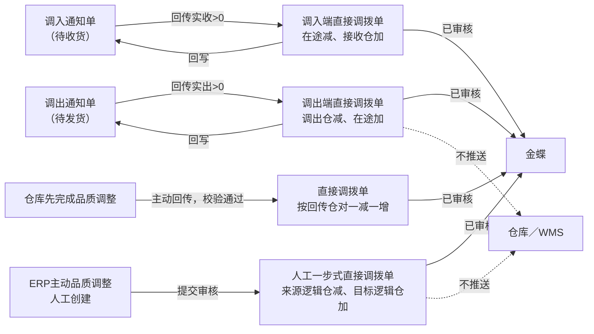
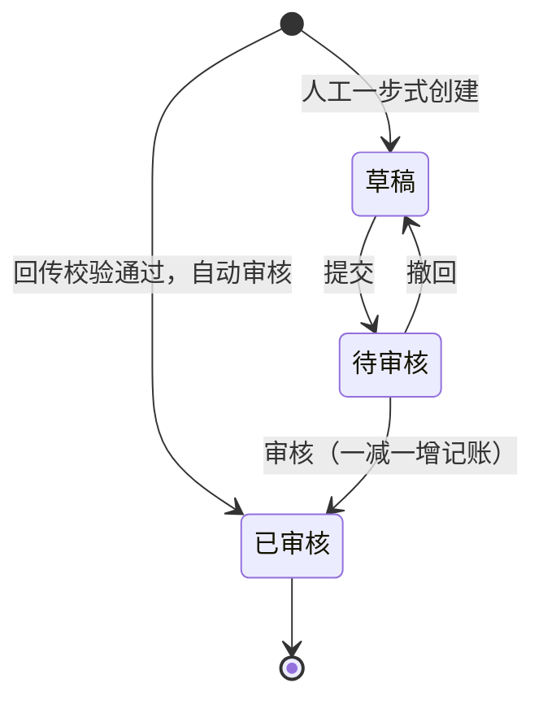
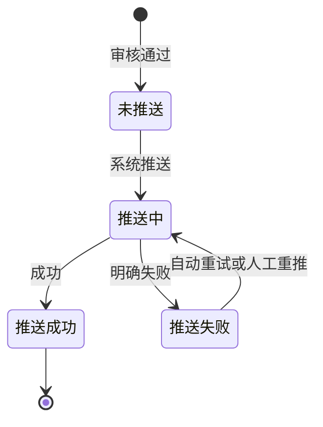

# 直接调拨单主PRD

> 用途：定义直接调拨单在ERP中的四类来源生成、人工一步式的提交审核、两逻辑仓一减一增记账、负库存阻断及金蝶推送，作为研发实现和测试验收的依据。
> 定位：应用设计层文档。业务规则以[《库存与仓储需求分析》](../../../../../02-需求调研和分析/03-库存与仓储/库存与仓储需求分析.md)（INV-FR03、INV-FR07、INV-FR09、INV-FR10、INV-AC03、INV-AC07、INV-AC10）和[《库存与仓储业务设计》](../../../../../03-业务分析和设计/03-库存与仓储业务设计.md)（§4.2、§4.3、§4.5、§5.1～§5.3、§6.1、§6.2、§6.4、§七）为准；一层结果单模型与共用规则以[《强盛ERP的单据分层设计》](../../../../../01-全局背景信息/5.强盛ERP的单据分层设计.md) §七、§八为准；状态与操作以[《单据与状态流转》](../../../系统架构和流程/03-单据与状态流转.md) §四、§七为准；字段与取值以[《直接调拨单（详细稿）》](../../../字段清单合集/库存相关/直接调拨单/直接调拨单（详细稿）.tsv)为准；页面骨架见[《直接调拨单页面骨架》](直接调拨单页面骨架.md)；页面交互以[前端Demo版PRD](前端Demo版PRD/)为准，**须服从本文 §6.4 状态—功能矩阵**。
> 不写什么：不写分步式调拨单的建单、审核与主单完结（见[《分步式调拨单主PRD》](../分步式调拨单/分步式调拨单主PRD.md)）；不写调出、调入通知单的推送与回传（见[《调出通知单主PRD》](../调出通知单/调出通知单主PRD.md)、[《调入通知单主PRD》](../调入通知单/调入通知单主PRD.md)）；不写其他出入库的对象规则；不写在途差异用其他出库扣减的操作细节；不写仓库作业细节、金蝶报文字段映射、系统权限与数据库设计。

| 版本 | 本次变化 | 状态 |
| --- | --- | --- |
| V0.1 | 建立直接调拨单主PRD：四类来源、人工一步式审核、一减一增记账、负库存阻断与金蝶推送 | 初稿，待评审 |
| V0.2 | 按评审收口：预占口径按来源分类（人工一步式与仓库主动回传不涉及预占，分步式调出端消耗实出并释放未发）、草稿允许明细为空、删除草稿依据、来源通知单列、详情底部按结果单口径 | 修订，待评审 |

## 1. 文档信息与阅读边界

| 项目 | 内容 |
| --- | --- |
| 读者 | 研发工程师、测试工程师、产品复核 |
| 业务依据 | [《库存与仓储需求分析》](../../../../../02-需求调研和分析/03-库存与仓储/库存与仓储需求分析.md) INV-FR03、INV-FR07、INV-FR09、INV-FR10、INV-AC03、INV-AC07；[《库存与仓储业务设计》](../../../../../03-业务分析和设计/03-库存与仓储业务设计.md) §4.3、§4.5、§6.1、§6.2、§6.4、§七 |
| 字段依据 | [《直接调拨单（详细稿）》](../../../字段清单合集/库存相关/直接调拨单/直接调拨单（详细稿）.tsv)；字段名称、枚举、必填性、页面展示以TSV为准 |
| 状态依据 | [《单据与状态流转》](../../../系统架构和流程/03-单据与状态流转.md) §四 结果单（审核状态＋金蝶推送状态）；结果单模型见[《强盛ERP的单据分层设计》](../../../../../01-全局背景信息/5.强盛ERP的单据分层设计.md) §七 |
| 页面依据 | [《直接调拨单页面骨架》](直接调拨单页面骨架.md)、[前端Demo版PRD](前端Demo版PRD/)；按钮展示与文案以Demo PRD为准，须服从本文 §6.4 |

关联资料：[《强盛ERP全局业务规则与约束》](../../../../../01-全局背景信息/4.强盛ERP全局业务规则与约束.md)（§二 库存记账与数量控制、§3.1 直接及分步式调拨、§四 金蝶推送范围）、[《6.强盛ERP的编码规则和通用字段规则》](../../../../../01-全局背景信息/6.强盛ERP的编码规则和通用字段规则.md)（1.2 前缀ZJDB、2.3 Code-Name、第三节结果单排序与系统记录字段）、[《实体对象关系》](../../../系统架构和流程/02-实体对象关系.md)（§三、§四、§五、§六、§八）、[《系统流程与单据交互》](../../../系统架构和流程/01-系统流程与单据交互.md)第7、8节、[《预占与冻结主PRD》](../预占与冻结/预占与冻结主PRD.md)（R05）、[《库存流水主PRD》](../库存流水/库存流水主PRD.md)（R04 来源单据类型含直接调拨单）、[《库存查询主PRD》](../库存查询/库存查询主PRD.md)、[《结算与业财需求分析》](../../../../../02-需求调研和分析/05-结算与业财/结算与业财需求分析.md)（FIN-FR01～FIN-FR03）、[《系统集成需求分析》](../../../../../02-需求调研和分析/07-系统集成/系统集成需求分析.md)（INT-FR03、INT-FR05、INT-FR06）。

## 2. 需求背景与目标

### 2.1 背景

仓与仓之间、同一实体仓内不同库存状态逻辑仓之间的库存转移，需要一个只记账、不安排外部作业的结果单据。分步式调拨的调出端与调入端各自发生了一次真实的库存变化，需要分别形成结果并分别交给财务；品质调整既可能由ERP主动发起，也可能由仓库先完成再回传，两者同样需要统一的记账载体。

没有统一结果单时，调拨两端的库存变化、在途增减和财务输入无法与业务依据对齐，也无法逐单追溯。

### 2.2 目标

- 四类来源统一收口：分步式调拨调出端回传、调入端回传，ERP人工创建的一步式调整，以及仓库主动回传的品质调整；
- 回传路径系统自动生成并自动审核；人工一步式走草稿→待审核→已审核；
- 记账口径唯一：审核通过后在两个逻辑仓之间一减一增；调出端为调出仓减、在途加，调入端为在途减、接收仓加；
- 直接调拨不推送仓库、不分批、无缺量；人工一步式与仓库主动回传不涉及预占，分步式调出端消耗实出对应的预占、释放未发部分的预占；来源仓与目标仓不能相同；
- 负库存阻断：处理后即时库存或可用库存将为负时，阻止本次生效并报错；
- 已审核结果逐单推送金蝶；自动重试最多3次，仍失败在系统集成中心针对原单重推；不传成本价格。

## 3. 需求范围

### 3.1 本期范围

- 直接调拨单列表、详情；人工一步式的新增、编辑、提交、审核、撤回、删除草稿；
- 分步式调拨两端回传触发的自动生成（调出端／调入端）；
- 仓库主动回传品质调整触发的自动生成；
- 审核通过后一减一增记账、写库存流水、回写来源单据（分步式路径）；
- 审核状态与金蝶推送状态两个字段并列维护；
- 页头导出；一期批量栏仅已选中计数与列设置。

### 3.2 功能清单

| 编号 | 功能/位置 | 本次内容 | 需求来源 |
| --- | --- | --- | --- |
| F01 | 直接调拨单列表 | 查询、列展示、进入详情；审核状态与金蝶推送状态多选筛选；勾选配合页头导出；**无「新增」以外的批量操作** | INV-FR07 |
| F02 | 新增/编辑页（人工一步式） | 维护来源逻辑仓、目标逻辑仓与商品明细；草稿保存、编辑、删除 | INV-FR07 |
| F03 | 提交/撤回 | 草稿提交；待审核撤回留意见 | INV-FR07；COM-FR01 |
| F04 | 审核 | 审核通过后一减一增记账、写库存流水、推金蝶；分步式路径回写来源 | INV-FR07、INV-FR09、INV-FR10 |
| F05 | 详情页 | 分区域只读展示来源、明细、推送与审核信息 | INV-FR07 |
| F06 | 自动生成（系统） | 调出端／调入端回传、仓库主动回传品质调整，校验通过后自动生成并自动审核 | INV-FR03、INV-FR04、INV-FR07 |
| F07 | 金蝶推送（系统） | 已审核后自动逐单推送；失败自动重试最多3次，仍失败在系统集成中心重推原单 | INV-FR10、FIN-FR01～FIN-FR03 |
| F08 | Demo Mock | 模拟调出端／调入端回传与仓库主动回传生成；仅Demo | 演示需要，非业务规则 |

### 3.3 需求追溯

| 上游场景与需求 | 本 PRD 功能 | 本 PRD 验收 |
| --- | --- | --- |
| INV-FR03、INV-AC03：分步式两端分别形成直接调拨结果 | F06、F04 | AC01、AC02 |
| INV-FR07、INV-AC07：仓库发起按回传自动审核；ERP发起人工建单、审核后一减一增 | F02、F04、F06 | AC03、AC04 |
| INV-FR07、INV-AC11：直接调拨不推仓库、不分批；人工一步式与仓库主动回传不涉及预占 | F02、F04 | AC05 |
| INV-FR09：不允许负库存 | F04 | AC06、AC07 |
| INV-FR10、INV-AC10：直接调拨推金蝶、不传成本价格；主单与通知不推 | F07 | AC08 |
| INV-FR04：仓库主动回传的结果不补申请、不补预占 | F06 | AC09 |
| INT-FR06：接口拿不到仓库结果时人工确认实际结果 | 人工确认路径（R11） | AC12 |

### 3.4 非本期范围

- 分步式调拨两端结果的无来源人工建单（回传路径不打开人工建单入口）；
- 直接调拨单导入；
- 已审核后修改数量、逻辑仓或反审核；
- 零数量直接调拨单；
- 金蝶推送报文字段映射、系统集成中心页面细节（见集成PRD；本模块不提供重推按钮）；
- 系统权限矩阵、API/表结构/并发锁实现。

| 范围补充 | 说明 |
| --- | --- |
| 适用对象 | 成品SKU；逻辑仓为审核通过且启用的逻辑仓；分步式两端结果涉及虚拟在途仓时由系统按在途记账口径写入，不是人工选仓 |
| 唯一来源 | 分步式调拨两端回传、仓库主动回传品质调整，或人工一步式创建；接口拿不到结果时的人工确认沿用INT-FR06 |
| 与原型差异 | 09-产品原型暂无本模块页面（菜单「库存管理-直接调拨单」为未开放占位）；页面与交互以本套PRD为准 |

## 4. 单据定位与业务边界

### 4.1 业务作用

| 项目 | 内容 |
| --- | --- |
| 单据层级 | 分步式调拨两端为第3层——实际结果单；人工一步式与仓库主动回传品质调整为一层结果单（无前置安排与通知），属ERP内部账内调整／外部已完成事实（《单据分层设计》§四、§七） |
| 核心职责 | 记录两个逻辑仓之间一减一增的实际调整，作为库存记账与业财交接的唯一依据 |
| 单据来源 | 调出端回传、调入端回传、人工一步式创建、仓库主动回传品质调整 |
| 下游单据 | 无业务下游；金蝶接收已审核结果 |
| 数量关系 | 分步式路径：一张调出通知对应0或1张调出端结果、一张调入通知对应0或1张调入端结果；人工与仓库主动回传路径按单据独立成立 |
| 业务终结 | 已审核为业务终态；不可取消、不可反审核；推送失败不改变已生效库存 |

### 4.2 上下游关系摘要

> 完整链路见[《系统流程与单据交互》](../../../系统架构和流程/01-系统流程与单据交互.md)第7、8节；本文只保留结果侧交接点。

### 4.3 业务对象关系

| 关系 | 说明 |
| --- | --- |
| 调出通知单 : 调出端直接调拨单 | 1:0..1；实出>0时生成 |
| 调入通知单 : 调入端直接调拨单 | 1:0..1；实收>0时生成 |
| 直接调拨单 : 来源逻辑仓／目标逻辑仓 | N:1（各一个）；调出端为调出仓→在途仓，调入端为在途仓→接收仓，人工一步式为来源逻辑仓→目标逻辑仓 |
| 直接调拨单 : 预占 | 人工一步式与仓库主动回传无预占关系；分步式调出端消耗实出对应的预占、释放未发部分的预占（执行点归调出通知单R08） |
| 直接调拨单 : 库存流水 | 1:1（按明细行）；审核记账产生流水，来源单据类型为直接调拨单 |

### 4.4 本单据不负责的事项

- 直接调拨单不安排仓库作业；分步式路径的指令由调出、调入通知单承担，仓库主动回传的场景仓库已经完成作业；
- 直接调拨单不向仓库或其他外部执行系统推送；
- 直接调拨单不修改来源主单、通知单的数量与仓库约定；
- 已审核后不因金蝶推送失败而回滚库存或删除业务结果；
- 不在原单上补调；少收差异由在途与其他出库处理，不在本单抹平；
- 人工一步式与仓库主动回传不涉及预占；分步式调出端消耗实出对应的预占、释放未发部分的预占（执行点归调出通知单R08，账务结果体现在调出端结果单）；本单只按确认数量记账；
- 品质调整不通过其他出入库处理，统一走本单。

## 5. 核心业务场景索引

| 场景ID | 场景 | 类型 | 说明 |
| --- | --- | --- | --- |
| S01 | 调出端回传生成 | 主流程 | 调出通知待发货回传实出>0→校验通过→生成调出端结果并自动审核→调出仓减、在途加→写流水→回写通知与主单→推金蝶 |
| S02 | 调入端回传生成 | 主流程 | 调入通知待收货回传实收>0→校验通过→生成调入端结果并自动审核→在途减、接收仓加→写流水→回写通知与主单→推金蝶 |
| S03 | 人工一步式品质调整 | 主流程 | ERP创建→提交→审核→来源逻辑仓减、目标逻辑仓加→写流水→推金蝶；不推仓库、不预占 |
| S04 | 仓库主动回传品质调整 | 主流程 | 仓库先完成调整→回传→映射与库存校验通过→自动生成并自动审核→按回传仓对一减一增→推金蝶；不补申请、不补预占 |
| S05 | 金蝶推送失败重推 | 支线 | 已审核+推送失败→自动重试最多3次→仍失败在系统集成中心重推原单；库存与回写不回滚 |
| S06 | 负库存阻断 | 异常 | 处理后即时或可用库存将为负→阻止本次生效并报错；不先记负数、不自动释放已有预占 |
| S07 | 归属依据不足 | 异常 | 无法确定记入哪个逻辑仓→保留异常、不记账、不推金蝶→修复后处理原记录 |
| S08 | 接口失败人工确认 | 支线 | 已交给仓库、接口拿不到结果→人工确认实际结果（INT-FR06）→形成直接调拨单并提交审核；入口在系统集成中心 |
| S09 | 重复回传 | 异常 | 不重复生成单据、不重复记账；幂等标识留接口设计 |

## 6. 状态与操作

状态定义owner：[《单据与状态流转》](../../../系统架构和流程/03-单据与状态流转.md) §四。直接调拨单用**审核状态**与**金蝶推送状态**两个字段并列维护。审核链无「已驳回」态，待审核不同意时操作为**撤回**（回到草稿），不叫驳回。

### 6.1 状态维度

| 维度 | 取值 | 说明 |
| --- | --- | --- |
| 审核状态 | 草稿、待审核、已审核 | 控制是否记账；回传路径自动审核，人工一步式走提交审核 |
| 金蝶推送状态 | 未推送、推送中、推送成功、推送失败 | 跟踪业财推送；失败不回滚库存 |

### 6.2 状态取值说明

**审核状态**

| 状态 | 含义 | 是否终态 | 本期界面 |
| --- | --- | --- | --- |
| 草稿 | 人工一步式已保存、未提交；或撤回后待修改 | 否 | 可见（人工一步式） |
| 待审核 | 人工一步式已提交，等待审核 | 否 | 可见（人工一步式） |
| 已审核 | 库存已生效、来源已回写 | 是 | 可见（全部来源） |

**金蝶推送状态**

| 状态 | 含义 | 是否终态 |
| --- | --- | --- |
| 未推送 | 尚未发起推送 | 否 |
| 推送中 | 推送作业进行中 | 否 |
| 推送成功 | 金蝶已接收 | 是 |
| 推送失败 | 推送明确失败，可重推 | 否（可重试至成功） |

回传或仓库主动回传生成的直接调拨单创建时即为已审核，金蝶推送状态从「未推送」开始。系统自动生成的结果单，创建人与最后更新人显示「系统」（《6.强盛ERP的编码规则和通用字段规则》第三节）。

### 6.3 状态流转图

**审核状态**

**金蝶推送状态**（已审核后）

### 6.4 状态—功能矩阵

> ✅ = 允许；❌ = 不允许；✅（条件）= 须满足对应规则。F01 查询/查看各状态均不重复列出。

| 动作 | 草稿（人工一步式） | 待审核（人工一步式） | 已审核 | 已审核+推送失败 |
| --- | --- | --- | --- | --- |
| 编辑（F02） | ✅ | ❌ | ❌ | ❌ |
| 提交（F03） | ✅ | ❌ | ❌ | ❌ |
| 撤回（F03） | ❌ | ✅ | ❌ | ❌ |
| 删除草稿（F02） | ✅（条件） | ❌ | ❌ | ❌ |
| 审核（F04） | ❌ | ✅（条件） | ❌ | ❌ |
| 详情/追溯（F05） | ✅ | ✅ | ✅ | ✅ |
| 重推金蝶（F07） | ❌ | ❌ | ❌ | ❌（入口在系统集成中心） |
| Demo Mock（F08） | ✅（Demo） | ✅（Demo） | ✅（Demo） | ✅（Demo） |

说明：

- 回传与仓库主动回传路径**不提供**新增、编辑、提交、审核、撤回、取消、作废入口；创建即为已审核。
- 人工一步式**只允许创建「人工一步式」来源**；列表与详情的「新增」进入人工一步式表单，不能创建分步式两端结果或仓库主动回传结果。
- 已审核后整单只读；推送失败原因在详情可看，重推到系统集成中心办理（不在本模块列表/详情）。
- 列表批量操作栏一期仅展示已选中计数与列设置；导出在页头，可选已勾选范围。
- 全部操作权限按RBAC，引用COM-FR01、COM-FR02（允许本人审核本人创建的单据）；本文不写权限矩阵。

### 6.5 状态流转表

| 当前状态 | 动作 | 前置条件 | 结果状态 | 二次确认 | 后置影响 | 失败处理 |
| --- | --- | --- | --- | --- | --- | --- |
| 草稿 | 保存 | 来源逻辑仓、目标逻辑仓已选且不相同；明细允许为空，已填行则每行实际调拨数量>0（R02、R03） | 草稿 | 无 | 分配单号（R01） | 校验失败定位字段/行 |
| 草稿 | 提交 | R08 提交校验 | 待审核 | 见 Demo PRD | 来源逻辑仓、目标逻辑仓、商品与数量锁定 | 阻断并提示 |
| 草稿 | 删除 | 人工一步式草稿、审核前可编辑；本单无业务下游，「未被下游引用」对本单为空，删除不受引用限制 | 物理删除 | 二次确认 | 记录消失，单号不重用 | 非草稿时阻断 |
| 待审核 | 审核 | 至少一行明细且每行实际调拨数量>0；来源逻辑仓可用量足够、记账后即时与可用不为负（R05、R06）；来源≠目标且均非虚拟在途仓 | 已审核 | 二次确认 | 来源逻辑仓即时减、目标逻辑仓即时加；写库存流水；触发金蝶推送（R04、R09） | 负库存或校验不通过时阻断，不记账、不推送 |
| 待审核 | 撤回 | 必填撤回意见 | 草稿 | 无 | 保留撤回意见 | — |
| — | 调出端回传自动生成 | 来源调出通知待发货，回传实出>0（R07）；校验通过（R05） | 已审核 | 无 | 调出仓即时减、在途加；消耗实出对应的预占、释放未发部分的预占（执行点归调出通知单R08）；写流水；回写通知与主单；触发金蝶推送 | 校验失败或将为负库存时保留异常，不记账 |
| — | 调入端回传自动生成 | 来源调入通知待收货，回传实收>0（R07）；校验通过（R05） | 已审核 | 无 | 在途减、接收仓即时加；写流水；回写通知与主单并触发主单完结；触发金蝶推送 | 校验失败或将为负库存时不生成结果单、不记账；调入通知单保持待收货，本次回传不成立，修复后可按原单重传 |
| — | 仓库主动回传自动生成 | 来源信息、商品、仓对与映射正常；库存校验通过（R10、R05） | 已审核 | 无 | 按回传仓对一减一增；写流水；触发金蝶推送；不补建申请、不补做预占 | 归属依据不足或库存不足保留异常（S06、S07） |
| — | 人工确认→提交审核 | 已交给仓库、接口拿不到结果（R11） | 草稿→待审核→已审核 | 见系统集成（集成PRD尚未形成） | 入口在系统集成中心；通过后与自动路径同样记账与推送 | 不能无来源建分步式两端结果 |
| 已审核 | 自动推送 | 系统作业 | 推送中 | 无 | — | — |
| 推送中 | 推送成功 | 金蝶确认 | 推送成功 | 无 | 记录推送时间 | — |
| 推送中 | 推送失败 | 金蝶明确失败 | 推送失败 | 无 | 记录推送失败原因；**不回滚库存与回写**；触发自动重试（R09） | — |
| 推送失败 | 自动重试 | 未达3次 | 推送中 | 无 | — | 仍失败则保持推送失败 |
| 已审核+推送失败 | 人工重推 | 在系统集成中心触发 | 推送中 | 见系统集成（集成PRD尚未形成） | 针对原单重试 | — |

## 7. 核心业务规则

### 7.1 创建与来源规则

| 规则编号 | 主题 | 规则 | 边界或例外 |
| --- | --- | --- | --- |
| R01 | 单号 | 按[《6.强盛ERP的编码规则和通用字段规则》](../../../../../01-全局背景信息/6.强盛ERP的编码规则和通用字段规则.md)第一节自动生成；前缀ZJDB；人工一步式保存草稿时分配，自动生成的结果单在生成时分配 | 用户不可编辑；结果单不重用单号 |
| R02 | 来源逻辑仓与目标逻辑仓 | 人工一步式：两个逻辑仓都必须审核通过且启用、不能相同，且**不能选择虚拟在途仓**；分步式两端结果：来源、目标仓由系统按在途记账口径写入（调出端为调出仓→在途仓，调入端为在途仓→接收仓），不是人工选仓；仓库主动回传：按回传仓对写入 | 在途仓只用于分步式调拨在途记账，不能被业务单据选为出入库仓（《库存与仓储业务设计》§4.2）；已禁用逻辑仓不可新选，已有业务继续 |
| R03 | 商品与数量 | 明细商品为启用的成品SKU；每行实际调拨数量为大于0的整数，一期不允许小数；草稿允许明细为空，提交与审核要求至少一行且每行实际调拨数量>0 | 同一商品重复行的处理待确认（Q03），当前画法不阻断 |
| R04 | 单头继承 | 有来源时，来源主单、来源通知单、来源逻辑仓与目标逻辑仓、商品明细沿来源携带 | 用户不可改仓库、数量与来源；人工一步式自行选择两个逻辑仓并录入数量 |
| — | 来源类型 | 取值：分步式调出端、分步式调入端、人工一步式、仓库主动回传；创建后不可改 | 枚举逐字以TSV为准 |
| R12 | 只读 | 自动生成的直接调拨单整单只读；人工一步式已审核后整单只读 | 已审核不可改任何业务字段；备注在自动回传时一般为空 |

### 7.2 提交与审核规则

| 规则编号 | 主题 | 规则 | 边界或例外 |
| --- | --- | --- | --- |
| R08 | 提交校验 | 来源逻辑仓、目标逻辑仓已选且不相同、均非虚拟在途仓；至少一行明细且每行实际调拨数量>0；单据信息完整 | 提交后仓库、商品与数量锁定；撤回后可再改 |
| R05 | 归属与库存校验 | 记账前校验来源逻辑仓可用量足够，且处理后来源逻辑仓即时库存与可用库存均不为负；来源≠目标；分步式调出端的可用量校验须同步反映本次预占消耗，避免把正常已预占的调出误判为库存不足 | 可用库存＝即时库存−预占库存−冻结库存；人工一步式与仓库主动回传不消耗预占，可调出上限受可用量约束（INV-FR09；示例见下）；分步式调出端消耗实出对应预占、释放未发部分，执行点归调出通知单R08 |
| R06 | 负库存阻断 | 处理后即时库存或可用库存将为负时，阻止本次生效并报错；不采用先记负数再处理的方案，不自动释放已有订单的预占 | INV-FR09、INV-AC09；恢复方式待确认（Q05） |
| R07 | 回传自动生成 | 调出通知待发货、调入通知待收货，回传数量>0且不超过指令数量，校验通过后系统自动生成并自动审核 | 零调出不生成；超量整次拒绝；零调入拒绝整次回传 |
| R10 | 仓库主动回传自动生成 | 仓库已经完成的品质调整回传，商品、仓对归属与映射正常且库存校验通过后，直接生成并自动生效；不补建申请、通知，也不要求对已完成变动先做预占 | 归属依据不足时不随便选仓，保留异常（S07）；依据INV-FR04、INV-FR07 |
| R11 | 人工确认 | 已交给仓库、接口拿不到结果时，可按实际发生情况确认并沿来源通知形成直接调拨单，走提交审核（INT-FR06） | 分步式两端结果不能无来源新建；不能用来替代仓库执行 |

数量示例（示例）：即时100、预占60、冻结0时可用40；直接调拨50件会让可用变成−10，必须阻断。即时100、预占0时可调出100。

### 7.3 记账与数量规则

| 规则编号 | 主题 | 规则 | 边界或例外 |
| --- | --- | --- | --- |
| — | 记账口径 | 调出端：调出仓即时减、在途加；调入端：在途减、接收仓即时加；人工一步式与仓库主动回传：来源逻辑仓即时减、目标逻辑仓即时加 | 人工一步式与仓库主动回传不涉及预占；分步式调出端消耗实出对应的预占、释放未发部分的预占，账务结果体现在调出端结果单（执行点归调出通知单R08） |
| — | 实际调拨数量 | 各行实际调拨数量＝来源回传数量（有来源时）或人工录入数量；不超过对应指令数量 | 创建后不可改；一期数量为整数，不允许小数 |
| — | 零数量 | 不允许零数量直接调拨单 | 零调出按主单取消，不进入本单；零调入拒绝整次回传 |
| — | 在途口径 | 调拨在途＝累计实际调出−累计实际调入；调出端结果使在途增加，调入端结果使在途减少 | 少收差额继续留在途，不自动抹平 |
| — | 业务日期 | 取实际调拨时间的日期部分；列表默认按业务日期倒序 | 《6.强盛ERP的编码规则和通用字段规则》第三节结果单排序 |

### 7.4 金蝶推送规则

| 规则编号 | 主题 | 规则 | 边界或例外 |
| --- | --- | --- | --- |
| R09 | 推送时机与重试 | 已审核后由系统自动逐单推送金蝶；推送明确失败后自动重试**最多3次**；3次仍失败则保持「推送失败」 | 分步式主单、调出与调入通知单不推送；本单不传成本价格，存货成本由金蝶核算（INV-FR10） |
| — | 失败重推 | 在系统集成中心针对原单重试，不另建业务单；本模块列表/详情不提供重推按钮 | 不回滚库存与回写；FIN-FR03 |
| — | 推送记录 | 记录推送时间、推送失败原因；重推成功后仍保留历史失败原因 | INT-FR03、INT-FR05 |

### 7.5 业务生效点

| 业务动作 | 直接调拨单影响 | 库存影响 | 业财/外部影响 |
| --- | --- | --- | --- |
| 回传/主动回传自动生成并审核 | 已审核；带入实际数量与来源 | 按来源类型一减一增；写库存流水；分步式路径回写通知与主单 | 触发金蝶推送 |
| 人工一步式审核通过 | 已审核；数量锁定 | 来源逻辑仓即时减、目标逻辑仓即时加；写库存流水 | 触发金蝶推送 |
| 金蝶推送成功 | 推送状态→成功 | 无额外变化 | 金蝶接收结果 |
| 金蝶推送失败 | 推送状态→失败；业务仍已审核 | 不回滚 | 自动重试3次；仍失败则在系统集成中心重推 |
| 库存校验不通过 | 保留异常，不记账 | 不改变库存 | 不推送；修复后处理原记录 |

### 7.6 字段校验绑定

完整字段见TSV。摘要：

| 校验时机 | 要求 |
| --- | --- |
| 保存草稿（人工一步式） | 来源逻辑仓、目标逻辑仓已选且不相同、均非在途仓；明细允许为空，已填行则每行实际调拨数量>0（R02、R03） |
| 提交审核 | R08；至少一行明细且每行实际调拨数量>0 |
| 审核/记账 | 来源逻辑仓可用量足够；处理后即时与可用库存不得为负（R05、R06） |
| 自动生成 | 有来源：来源通知状态与回传数量合法（R07）；无来源：商品、仓对归属与映射正常（R10） |
| 重推 | 已审核+推送失败；入口在系统集成中心 |

页面控件、错误文案见Demo PRD。

## 8. 功能需求说明（页面索引）

| 编号 | 页面/位置 | 规则与状态依据 | Demo PRD |
| --- | --- | --- | --- |
| F01 | 列表 | §6.4 | [列表页](前端Demo版PRD/直接调拨单前端Demo版PRD_列表页.md) |
| F02 | 新增/编辑（人工一步式） | R02、R03、R12；§6.5 | [新增编辑页](前端Demo版PRD/直接调拨单前端Demo版PRD_新增编辑页.md) |
| F03 | 提交/撤回 | R08；§6.4 | [弹窗与Mock](前端Demo版PRD/直接调拨单前端Demo版PRD_弹窗与Mock.md) §2.1、§2.2 |
| F04 | 审核 | R05、R06、R09；§6.5 | 弹窗 PRD §2.4 |
| F05 | 详情 | R07～R12；§6.4 | [详情页](前端Demo版PRD/直接调拨单前端Demo版PRD_详情页.md) |
| F06 | 自动生成（系统） | R07、R10 | 系统功能；表现见详情页 |
| F07 | 金蝶推送 | R09 | 入口在系统集成中心；本模块弹窗 PRD 不再定义重推确认框 |
| F08 | Demo Mock | 非正式验收 | 弹窗 PRD §3、§4 |

## 9. 上下游影响与协同

| 关联模块/系统 | 需要配合的变化 | 交接内容与时机 | 验收结果 |
| --- | --- | --- | --- |
| 分步式调拨单 | 两端结果生成后回写累计实际调出、累计实际调入；调入端生成后主单自动完结 | 回传校验通过时 | 数量与主单口径一致；主单完结不代表差异已清 |
| 调出通知单／调入通知单 | 回传触发生成；结果单回写实出／实收与状态 | 实出>0、实收>0时生成 | 1:0..1关系成立；通知变为已发货／已收货 |
| 预占与冻结 | 人工一步式与仓库主动回传不涉及预占；分步式调出端消耗实出对应的预占、释放未发部分的预占（执行点归调出通知单R08），调入端不消耗预占 | 调出端记账时 | 消耗与释放不重复；来源仓已有预占时按可用量校验并同步反映本次预占消耗（[《预占与冻结主PRD》](../预占与冻结/预占与冻结主PRD.md)R05、R09） |
| 库存查询／库存流水 | 两个逻辑仓数量同步变化；在途按调出、调入增减；可从流水追溯本单 | 已审核后按逻辑仓记账 | 库存不为负；流水来源单据类型含直接调拨单 |
| 其他出库申请单 | 少收差异从在途逻辑仓扣减（业务类型盘亏） | 主单完结后人工办理 | 在途按确认结果减少 |
| 金蝶 | 接收已审核结果 | 审核后自动推送；失败在系统集成中心重推原单 | FIN-FR01～FIN-FR03 |
| 系统集成中心 | 展示推送结果；失败时重推原单；接口失败时人工确认实际结果 | 推送状态、时间、失败原因 | INT-FR03、INT-FR05、INT-FR06 |
| 商品与主数据 | 提供启用的成品SKU、审核通过且启用的逻辑仓与虚拟在途仓 | 归属识别与展示 | 归属依据不足时挂异常；在途仓不作为人工选仓 |

## 10. 关联文档与阅读入口

| 关联内容 | 阅读入口 | 本 PRD 与其边界 |
| --- | --- | --- |
| 分步式调拨单 | [《分步式调拨单主PRD》](../分步式调拨单/分步式调拨单主PRD.md) | 主单完结与在途口径 owner 在主单侧 |
| 调出通知单／调入通知单 | [《调出通知单主PRD》](../调出通知单/调出通知单主PRD.md)、[《调入通知单主PRD》](../调入通知单/调入通知单主PRD.md) | 指令数量、回传校验与零收／零出 owner 在通知侧 |
| 预占与冻结 | [《预占与冻结主PRD》](../预占与冻结/预占与冻结主PRD.md) | R05 明确人工一步式与仓库主动回传不涉及预占；分步式调出端的预占消耗与释放执行点在调出通知单R08 |
| 库存流水 | [《库存流水主PRD》](../库存流水/库存流水主PRD.md) | 记账写流水的口径来源；来源单据类型含直接调拨单 |
| 其他出库单 | [《其他出库单主PRD》](../其他出库单/其他出库单主PRD.md) | 在途差异扣减的记账落点 |
| 状态与操作 | [《单据与状态流转》](../../../系统架构和流程/03-单据与状态流转.md) §四、§七、§九 | 状态owner；回写表与联动要点 |
| 结果单模型 | [《强盛ERP的单据分层设计》](../../../../../01-全局背景信息/5.强盛ERP的单据分层设计.md) §七、§八 | 一层结果单与共用规则 |
| 字段定义 | [《直接调拨单（详细稿）》](../../../字段清单合集/库存相关/直接调拨单/直接调拨单（详细稿）.tsv) | TSV 为字段 owner |
| 页面结构 | [《直接调拨单页面骨架》](直接调拨单页面骨架.md) | 区域与线框走查，非规则权威 |
| 页面交互 | [前端Demo版PRD](前端Demo版PRD/) | 控件、文案、Mock；服从 §6.4 |

## 11. 异常与一致性

### 11.1 并发操作

| 场景 | 业务处理结果 |
| --- | --- |
| 同一通知重复回传触发生成 | 只允许一张有效结果单；重复触达幂等，不重复记账 |
| 记账同时可用量被其他业务占用 | 以服务端最新库存为准重新校验，将为负则阻断本次记账 |
| 人工确认与自动回传同时到达 | 只允许一张有效结果单；先到者成立，后到者按重复处理 |
| 人工一步式审核与来源逻辑仓其他出库同时发生 | 按服务端最新可用量判定；不足者阻断 |

### 11.2 幂等与重复处理

| 操作 | 幂等规则 |
| --- | --- |
| 回传触发生成 | 同一来源不得重复生成结果单或重复记账 |
| 分步式两端回写 | 同一结果不得重复回写累计实际调出／调入，不得重复触发主单完结 |
| 金蝶重推 | 同一结果单重复推送不得重复改变库存与重复回写 |
| 重复回传 | 不重复生成单据、不重复回写数量；幂等标识与部分成功恢复留接口设计（《单据分层设计》§8.5） |

### 11.3 与上下游单据一致性

| 场景 | 处理方式 |
| --- | --- |
| 来源通知已有关联结果单 | 不可再自动生成 |
| 推送失败 | 库存与回写保持；自动重试3次；仍失败则在系统集成中心重推原单 |
| 来源已取消后迟到回传 | 进入异常处理，修复后处理原记录 |
| 结果错误或重复 | 结果单差异不设常规业务更正流程，由技术介入或按双方线下约定处理；冲销更正规则待确认（Q02） |
| 在途少收差异 | 本单只按确认数量记账，差异是否已处理完由调拨侧判断 |

## 12. 验收标准与待确认事项

### 12.1 验收标准

| 编号 | 对应功能/规则 | 条件与操作 | 预期结果 |
| --- | --- | --- | --- |
| AC01 | F06、F04/记账口径 | 调出通知待发货回传实出90并结束 | 自动生成90件的调出端直接调拨单、已审核；来源类型=分步式调出端；调出仓即时−90、在途+90；写库存流水；触发金蝶推送（INV-AC03） |
| AC02 | F06、F04/记账口径 | 调入通知待收货回传实收88并结束 | 自动生成88件的调入端直接调拨单、已审核；在途−88、接收仓+88；回写主单并触发主单完结；触发金蝶推送 |
| AC03 | F02、F04 | ERP主动品质调整：人工创建正常品转残次品，提交并审核 | 审核通过后来源逻辑仓−、目标逻辑仓+；不经过在途、不推送仓库、不涉及预占（INV-AC07） |
| AC04 | F06/R10 | 仓库主动回传已完成品质调整，映射与库存校验通过 | 自动生成并自动审核；按回传仓对一减一增；不补申请、不补预占；不建ERP盘点单（INV-AC07） |
| AC05 | R02、R12、F01 | 查看列表与详情；尝试选择虚拟在途仓作为人工一步式的来源或目标仓 | 不提供编辑/取消/作废入口（自动生成单）；人工一步式不能选在途仓 |
| AC06 | R05、R06 | 即时100、预占60，人工一步式调拨50 | 记账后可用将为−10，阻止本次生效并报错；不先记负数、不自动释放已有预占（INV-FR09、INV-AC09） |
| AC07 | R06 | 来源逻辑仓即时恰好等于调拨数量且无预占 | 记账成功后来源仓即时为0；再调出任何数量被阻断 |
| AC08 | F07/R09 | 金蝶推送明确失败 | 自动重试最多3次；仍失败则保持推送失败，可在系统集成中心重推；本模块列表/详情无重推按钮；库存与回写不回滚；不传成本价格（INV-AC10） |
| AC09 | F06/R10 | 仓库主动回传品质调整 | 直接生成并自动审核，不补申请、不补预占；来源类型=仓库主动回传（INV-AC07、INV-FR07） |
| AC10 | 记账口径 | 直接调拨审核生效后查看库存查询与库存流水 | 两个逻辑仓即时库存一减一增；产生两条方向不同的流水并指向本单（INV-AC14口径） |
| AC11 | F01 | 列表筛选审核状态与金蝶推送状态 | 多选OR匹配；列与TSV一致；默认按业务日期倒序 |
| AC12 | R11、INT-FR06 | 已交给仓库的通知接口拿不到结果 | 可人工确认实际结果并沿来源通知形成直接调拨单、提交审核；分步式两端结果不能无来源建单 |
| AC13 | F05 | 详情展示来源 | 分步式来源可跳转调拨单与对应通知单；仓库主动回传展示来源系统与来源单号；人工一步式展示来源类型与创建信息 |
| AC14 | F08 | Demo Mock 模拟回传自动生成 | 仅Demo可用；正式验收以回传为准 |

### 12.2 待确认事项

| 编号 | 问题 | 影响范围 | 确认人 | 最迟确认阶段或时间 | 状态/结论 |
| --- | --- | --- | --- | --- | --- |
| Q01 | 人工一步式是否允许跨实体仓（不经过在途的一步式调拨） | 选仓校验与业务边界 | 待指定 | 业务先确认 | 待确认；当前画法不额外限制实体仓，只要求来源≠目标、均非在途仓；主场景仍是同一实体仓内的库存状态调整（INV-FR07） |
| Q02 | 非外部电商来源的结果错误或重复的冲销更正方式 | 是否新增冲销单或更正流程 | 待指定 | 业务先确认（03 §七） | 待确认；结果单差异不设常规业务更正流程（《单据分层设计》§8.5），不凭空定义冲销单 |
| Q03 | 同一商品重复行的处理 | 明细校验与测试数据 | 待指定 | 页面评审前 | 待确认；当前画法不阻断、不做合并，与其他出入库申请单同一口径（Q03） |
| Q04 | 人工一步式是否允许来源仓已有预占时调出（可用量为负即阻断） | 可调出上限与业务预期 | 待指定 | 业务先确认 | 待确认；当前按 INV-FR09 落：可用库存为负即阻断，人工一步式不消耗预占；若业务希望直接调拨不受预占限制，需要新决策 |
| Q05 | 库存不足阻断后的恢复方式 | 阻断后如何重新处理 | 待指定 | 业务先确认（03 §七） | 待确认；当前只明确阻止生效并报错，不自动释放已有预占、不先记负数 |
| Q06 | 无原单场景（仓库主动回传）接口失败时的人工补录口径 | 人工确认入口与留痕要求 | 待指定 | 集成PRD定稿前 | 待确认；建议允许按INT-FR06人工确认，必须选择两个逻辑仓并保留来源信息；有原单时须沿来源通知 |
| Q07 | 归属依据不足时异常记录的保存、修复与重新处理方式 | 异常处理与恢复 | 待指定 | 业务先确认（03 §七） | 待确认；当前只明确不随便选仓、不记账、不推金蝶；修复后处理原记录 |
| Q08 | 金蝶目标单据映射、金额成本与接收类型 | 推送范围与核算衔接 | 待指定 | 财务及接口设计前 | 待确认；本期不编金蝶字段对照，对照表由财务联调给出（INV-FR10） |
| Q09 | 查看、导出与重推的角色与数据范围 | 页面入口可见性 | 待指定 | 权限配置（系统管理PRD）定稿前 | 待确认；引用COM-FR01、COM-FR02；重推入口在系统集成中心 |
| Q10 | 完整操作日志的字段与入口 | 详情页操作信息区 | 待指定 | 页面评审前 | 已定（2026-09-24）：一期在详情页「操作信息」卡片提供由单据字段推导的简化「操作日志」Tab（与制单信息并列，含提交／审核／推送／回传／取消等记录）；完整审计日志的字段与独立入口仍后置，按《4.强盛ERP全局业务规则与约束》§五保留处理记录 |
