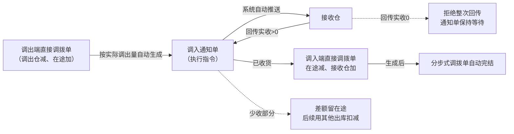
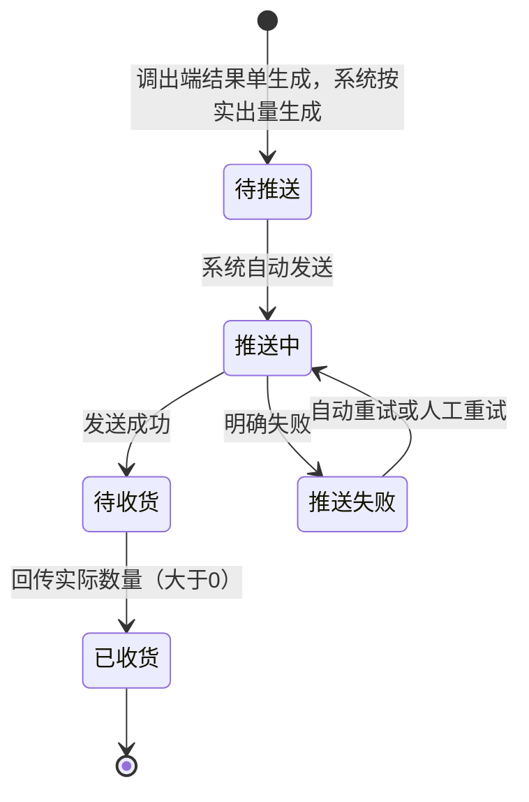

# 调入通知单主PRD

> 用途：定义调入通知单在ERP中的自动生成、自动推送接收仓、一次回传实收、零调入异常处理与少收差异，以及与分步式调拨单、直接调拨单的数量衔接，作为研发实现和测试验收的依据。
> 定位：应用设计层文档。业务规则以[《库存与仓储需求分析》](../../../../../02-需求调研和分析/03-库存与仓储/库存与仓储需求分析.md)（INV-FR03、INV-FR09、INV-AC03、INV-AC13、INV-AC16）和[《库存与仓储业务设计》](../../../../../03-业务分析和设计/03-库存与仓储业务设计.md)（§4.2、§4.8、§5.3、§6.3、§七）为准；执行指令单模型与共用规则以[《强盛ERP的单据分层设计》](../../../../../01-全局背景信息/5.强盛ERP的单据分层设计.md) §五、§5.9、§8.1、§8.2为准；状态与操作以[《单据与状态流转》](../../../系统架构和流程/03-单据与状态流转.md) §三、§九为准；字段与取值以[《调入通知单（详细稿）》](../../../字段清单合集/库存相关/调入通知单/调入通知单（详细稿）.tsv)为准；页面骨架见[《调入通知单页面骨架》](调入通知单页面骨架.md)；页面交互以[前端Demo版PRD](前端Demo版PRD/)为准，**须服从本文 §6.4 状态—功能矩阵**。
> 不写什么：不写分步式调拨单的建单、审核与主单完结（见[《分步式调拨单主PRD》](../分步式调拨单/分步式调拨单主PRD.md)）；不写调出通知单的生成、推送与零调出（见[《调出通知单主PRD》](../调出通知单/调出通知单主PRD.md)）；不写直接调拨单的记账与金蝶推送（见[《直接调拨单主PRD》](../直接调拨单/直接调拨单主PRD.md)）；不写少收差异用其他出库扣减的操作细节（见[《其他出库申请单主PRD》](../其他出库申请单/其他出库申请单主PRD.md)）；不写仓库作业细节、接口报文、系统权限与数据库设计。

| 版本 | 本次变化 | 状态 |
| --- | --- | --- |
| V0.1 | 建立调入通知单主PRD：按实际调出量生成、自动推送、一次回传实收、零调入异常、少收差异 | 初稿，待评审 |
| V0.2 | 按评审收口：回传记账校验未通过时保持待收货、不消耗唯一一次回传；补来源调出端直接调拨单追溯字段；少收数量展示口径；列表列与演示范围修正 | 修订，待评审 |

## 1. 文档信息与阅读边界

| 项目 | 内容 |
| --- | --- |
| 读者 | 研发工程师、测试工程师、产品复核 |
| 业务依据 | [《库存与仓储需求分析》](../../../../../02-需求调研和分析/03-库存与仓储/库存与仓储需求分析.md) INV-FR03、INV-FR09、INV-AC03、INV-AC13；[《库存与仓储业务设计》](../../../../../03-业务分析和设计/03-库存与仓储业务设计.md) §4.2、§4.8、§6.3、§七 |
| 字段依据 | [《调入通知单（详细稿）》](../../../字段清单合集/库存相关/调入通知单/调入通知单（详细稿）.tsv)；字段名称、枚举、必填性、页面展示以TSV为准 |
| 状态依据 | [《单据与状态流转》](../../../系统架构和流程/03-单据与状态流转.md) §三（执行指令单，含“调入通知由实际调出量生成、零调入属异常”差异段）、§九 |
| 页面依据 | [《调入通知单页面骨架》](调入通知单页面骨架.md)、[前端Demo版PRD](前端Demo版PRD/)；按钮展示与文案以Demo PRD为准，须服从本文 §6.4 |

关联资料：[《强盛ERP全局业务规则与约束》](../../../../../01-全局背景信息/4.强盛ERP全局业务规则与约束.md)（§二、§3.1）、[《6.强盛ERP的编码规则和通用字段规则》](../../../../../01-全局背景信息/6.强盛ERP的编码规则和通用字段规则.md)（1.2 前缀DRTZ、2.3 Code-Name、第三节系统记录字段）、[《实体对象关系》](../../../系统架构和流程/02-实体对象关系.md)（§三、§四、§六）、[《系统流程与单据交互》](../../../系统架构和流程/01-系统流程与单据交互.md)第7节、[《库存流水主PRD》](../库存流水/库存流水主PRD.md)、[《系统集成需求分析》](../../../../../02-需求调研和分析/07-系统集成/系统集成需求分析.md)（INT-FR03、INT-FR05、INT-FR06）。

## 2. 需求背景与目标

### 2.1 背景

调出仓实际发出后，接收仓需要知道本次实际会到多少件。一期不按原计划量提前下发接收指令，而是按实际调出量生成调入通知，避免接收仓按计划量准备而实际只到一部分。

调入回传的实际接收数量决定在途减少多少、接收仓增加多少，也决定少收差异留在途多少，因此需要独立的执行指令单据承接。

### 2.2 目标

- 调出端直接调拨单生成后，**按实际调出量**由系统自动生成调入通知单并推送接收仓，不按原计划量提前下发；
- 创建后由系统自动推送接收仓；推送明确失败后自动重试最多3次，仍失败可人工重试；
- 只接受一次回传：实际调入必须大于0，不超过通知调入数量，超量整次拒绝；
- 实际调入为0属异常：拒绝整次回传并报错，通知单保持等待，不按零收取消；
- 有实收时通知变为已收货，触发调入端直接调拨单并使主单自动完结；
- 少收差额留在途，不自动抹平；通知单不增减库存、不推金蝶。

## 3. 需求范围

### 3.1 本期范围

- 调入通知单列表、详情（只读查看；推送失败可人工重试）；
- 由调出端直接调拨单生成后按实际调出量自动生成并自动推送（本模块无新增入口）；
- 单据状态单字段维护（待推送→推送中→待收货／推送失败→已收货／已取消）；
- 推送失败自动重试最多3次，仍失败可人工重试；
- 回传实收后的数量回写、状态流转与主单完结触发（库存记账由直接调拨单承担）；
- 零调入异常的拒绝与提示；
- 页头导出；一期批量栏仅已选中计数与列设置。

### 3.2 功能清单

| 编号 | 功能/位置 | 本次内容 | 需求来源 |
| --- | --- | --- | --- |
| F01 | 通知单列表 | 查询（单号、来源调拨单、接收仓、单据状态、商品编码、创建时间）、列展示、进入详情；单据状态多选筛选；勾选配合页头导出；**无新增**；一期批量栏无业务按钮 | INV-FR03 |
| F02 | 自动生成（系统） | 调出端直接调拨单生成后，按实际调出量生成并分配单号；带入接收仓与明细数量 | INV-FR03 |
| F03 | 自动推送（系统） | 创建后由系统自动推送接收仓；推送失败自动重试最多3次 | INV-FR03、INT-FR03 |
| F04 | 详情页 | 分区域展示推送与执行结果；少收与零调入异常提示；关联来源调拨单与下游结果单 | INV-FR03 |
| F05 | 重试推送 | 自动重试满3次仍失败后由操作人重试，回到推送中 | INT-FR03 |
| F06 | 零调入异常处理（系统） | 回传实收0时拒绝整次回传并报错；通知单保持等待 | INV-FR03、INV-AC13 |
| F07 | Demo Mock | 模拟接收仓回传实收、推送状态变化；仅Demo | 演示需要，非业务规则 |

### 3.3 需求追溯

| 上游场景与需求 | 本 PRD 功能 | 本 PRD 验收 |
| --- | --- | --- |
| INV-FR03：按实际调出量生成调入通知并由系统自动推送 | F02、F03 | AC01 |
| INV-FR03、INV-AC03：实收后在途减、接收仓加，主单自动完结 | F04 | AC02、AC03 |
| INV-FR03、INV-AC13：实际调入必须大于0；回传0拒绝整次回传 | F06 | AC04 |
| INV-AC16：超量整次拒绝 | F04 | AC05 |
| INV-FR03：少收差异留在途，人工用其他出库从在途逻辑仓扣减 | F04 | AC06 |
| INT-FR03：推送失败自动重试最多3次，仍失败可人工重试 | F03、F05 | AC07 |
| INT-FR06：接口拿不到结果时人工确认实际结果 | 人工确认路径（R08） | AC10 |

### 3.4 非本期范围

- 列表页「新增」入口与通知单导入（通知单只能由调出端结果单生成后系统自动生成）；
- 按原计划量提前下发接收指令；
- 往已结束通知单补收、修改通知调入数量；
- 人工推送按钮（创建后系统自动推送）；
- 调入通知单的虚拟入出库处理方式（《单据分层设计》§5.10：本期不增加该字段）；
- 本期不提供「申请取消」入口（理由见 §6.4 说明与 Q02）；
- 分步式调拨单、调出通知单、直接调拨单页面与金蝶推送细节；
- 系统权限矩阵、API/表结构/并发锁实现。

| 范围补充 | 说明 |
| --- | --- |
| 适用对象 | 成品SKU；接收仓沿用来源分步式调拨单，不能为虚拟在途仓 |
| 数量来源 | 通知调入数量＝实际调出数量；一期一张主单一张调入通知单，不分批 |
| 与原型差异 | 09-产品原型暂无本模块页面（菜单「库存管理-调入通知单」为未开放占位）；页面与交互以本套PRD为准 |

## 4. 单据定位与业务边界

### 4.1 业务作用

| 项目 | 内容 |
| --- | --- |
| 单据层级 | 第2层——执行指令单，表达本次接收仓实际会收到多少（《单据分层设计》§五） |
| 核心职责 | 记录本次调入指令、推送与执行结果；实收结果决定在途减、接收仓加，并触发主单自动完结 |
| 单据来源 | 调出端直接调拨单生成后系统按实际调出量自动生成；一期唯一方式 |
| 下游单据 | 调入端直接调拨单（实收>0时生成） |
| 数量关系 | 一张主单对应0或1张调入通知单（零调出不生成）；一张通知单对应0或1张调入端直接调拨单 |
| 业务终结 | 已收货为终态；本期不提供取消入口；零调入不按取消收口，须人工处理 |

### 4.2 上下游关系摘要

> 完整链路见[《系统流程与单据交互》](../../../系统架构和流程/01-系统流程与单据交互.md)第7节；本文只保留调入侧交接点。

### 4.3 业务对象关系

| 关系 | 说明 |
| --- | --- |
| 分步式调拨单 : 调入通知单 | 1:0..1；按实际调出量生成；零调出不生成 |
| 调出端直接调拨单 : 调入通知单 | 1:0..1；调出端结果单生成后触发 |
| 调入通知单 : 调入端直接调拨单 | 1:0..1；实收>0时生成 |
| 通知单明细 : 调拨单明细 | N:1；数量按来源行回写 |
| 调入通知单 : 接收仓 | N:1；沿用来源主单接收仓 |
| 调入通知单 : 在途 | N:1（按明细行）；实收减少在途，少收部分继续留在途 |

### 4.4 本单据不负责的事项

- 通知单不直接增加库存；库存变化由调入端直接调拨单审核后触发；
- 通知单不向金蝶推送；金蝶只接收已审核结果单；
- 通知单不修改来源主单的调出仓、接收仓、商品与计划数量；
- 已收货通知不能往原单追加接收；少收部分通过少收数量展示，差异用其他出库从在途扣减；
- 超通知量的回传在接收侧整次拒绝；
- 零调入不由通知单自行收口，需人工介入处理。

## 5. 核心业务场景索引

| 场景ID | 场景 | 类型 | 说明 |
| --- | --- | --- | --- |
| S01 | 自动生成并一次收足 | 主流程 | 调出端结果单生成→按实出量自动生成→自动推送→待收货→回传实收=通知量→已收货→生成调入端直接调拨单→主单自动完结 |
| S02 | 少收 | 主流程 | 实收<通知量并结束→已收货+少收展示→在途按实收减少，差额留在途 |
| S03 | 零调入 | 异常 | 回传实收0→拒绝整次回传并报错→通知单保持等待→仓库改成大于0后再回传 |
| S04 | 推送失败重试 | 支线 | 推送失败→自动重试最多3次→仍失败可人工重试→待收货 |
| S05 | 超量回传 | 异常 | 实收>通知量→整次拒绝并报错；状态与库存不变 |
| S06 | 接口失败人工确认 | 支线 | 已交给仓库、接口拿不到结果→人工确认实际接收结果（INT-FR06）；入口在系统集成中心 |
| S07 | 少收差异后续处理 | 主流程/后续 | 主单已完结、在途仍有余额→人工用其他出库从在途逻辑仓扣减（业务类型盘亏） |

## 6. 状态与操作

状态定义owner：[《单据与状态流转》](../../../系统架构和流程/03-单据与状态流转.md) §三。调入通知单复用执行指令状态机，**把“发货”换成“收货”**，用**单据状态**一个字段串起推送与执行，不设审核状态，也不设「部分收货」流程状态；少收通过明细「少收数量」展示。本期不增加收货处理方式字段。

### 6.1 状态维度

| 维度 | 取值 | 说明 |
| --- | --- | --- |
| 单据状态 | 待推送、推送中、推送失败、待收货、取消中、已收货、已取消 | 控制可执行操作；本期不提供「申请取消」入口 |

状态枚举沿用执行指令单的共用取值（状态owner为《单据与状态流转》§三）。本期页面**不提供**待收货→取消中与取消中→已取消／待收货的入口，理由见 §6.4 说明。

### 6.2 状态取值说明

| 状态 | 含义 | 是否终态 |
| --- | --- | --- |
| 待推送 | 已生成，等待系统自动发送 | 否 |
| 推送中 | 正在向接收仓发送，结果未确定 | 否 |
| 推送失败 | 仓库明确未接收；系统自动重试最多3次，仍失败可人工重试 | 否 |
| 待收货 | 接收仓已接收指令，等待回传最终结果 | 否 |
| 取消中 | 共用状态机保留取值；本期页面不提供进入该状态的入口 | 否 |
| 已收货 | 接收仓已回传实际数量并结束 | 是 |
| 已取消 | 共用状态机保留取值；本期不按零收取消，页面不提供该终态入口 | 是 |

### 6.3 状态流转图

说明：待收货→取消中→已取消／待收货 与 待收货→已取消（零收）为共用状态机的取值，本期不开放入口（Q02）；零调入拒绝整次回传，不按零收取消（INV-FR03、INV-AC13）。

### 6.4 状态—功能矩阵

> ✅ = 允许；❌ = 不允许；✅（条件）= 须满足对应规则。F01 查询/查看各状态均不重复列出。

| 动作 | 待推送 | 推送中 | 推送失败 | 待收货 | 已收货 |
| --- | --- | --- | --- | --- | --- |
| 重试推送（F05） | ❌ | ❌ | ✅ | ❌ | ❌ |
| 申请取消 | ❌ | ❌ | ❌ | ❌（Q02） | ❌ |
| 详情/追溯（F04） | ✅ | ✅ | ✅ | ✅ | ✅ |
| Demo Mock（F07） | ✅（Demo） | ✅（Demo） | ✅（Demo） | ✅（Demo） | ❌ |

说明：

- 通知单**不提供**新增、编辑、提交、审核、撤回入口；备注随来源主单，不在本单维护。
- **不提供申请取消**：货已经从调出仓实际发出，取消接收指令会让在途数量失去归属；在途必须由实际接收或后续在途差异处理收口。该限制与「零调入属异常、须人工处理」同一口径，是否开放取消入口见 Q02。
- 推送中：仅查看与等待，不提供重试；自动重试由系统在推送失败后发起。
- 已收货：仅查看与追溯，不提供补收、反收货。
- 列表与详情行内操作按状态互斥展示；列表批量操作栏一期仅展示已选中计数与列设置；导出在页头，可选已勾选范围。
- 全部操作权限按RBAC，引用COM-FR01、COM-FR02；本文不写权限矩阵。

### 6.5 状态流转表

| 当前状态 | 动作 | 前置条件 | 结果状态 | 二次确认 | 后置影响 | 失败处理 |
| --- | --- | --- | --- | --- | --- | --- |
| — | 自动生成 | 调出端直接调拨单已生成并已审核（R01）；实际调出>0 | 待推送 | 无 | 分配单号（R02）；带入接收仓与明细数量（＝实际调出量） | 生成失败则整笔回滚，不留下调出端结果已生效但没有调入通知的状态 |
| 待推送 | 自动推送 | 系统作业 | 推送中 | 无 | — | — |
| 推送中 | 推送成功 | 仓库确认接收 | 待收货 | 无 | 记录推送时间 | — |
| 推送中 | 推送失败 | 仓库明确未接收 | 推送失败 | 无 | 记录推送失败原因；触发自动重试（R06） | — |
| 推送失败 | 自动重试 | 未达3次（R06） | 推送中 | 无 | — | 仍失败则保持推送失败 |
| 推送失败 | 人工重试 | 操作人触发（F05） | 推送中 | 见 Demo PRD | 不重新审核、不重复生成 | — |
| 待收货 | 接收回传 | 实收≤通知调入数量且>0（R04） | 已收货 | 自动 | 回写实际调入与少收数量；在途按实收减少；生成调入端直接调拨单；主单自动完结 | 超量整次拒绝 |
| 待收货 | 回传记账校验未通过 | 回传数量合法，但调入端直接调拨单记账校验不通过（含处理后即时或可用库存将为负；直接调拨单R05、R06） | 状态不变（待收货） | 自动 | 本次回传不成立，不消耗唯一一次回传；不生成结果单、不记账；在途、接收仓与主单状态均不变 | 拒绝本次回传并报错；修复后可按原单重传 |
| 待收货 | 零调入回传 | 实收=0（R05） | 状态不变 | 自动 | 拒绝整次回传并报错；在途、接收仓与主单状态均不变 | 通知单保持等待，须人工处理 |
| 已收货 | 查看 | — | 不变 | — | — | — |

## 7. 核心业务规则

### 7.1 生成与来源规则

| 规则编号 | 主题 | 规则 | 边界或例外 |
| --- | --- | --- | --- |
| R01 | 来源与生成时机 | 只能由已生成、已审核的调出端直接调拨单触发，按实际调出量生成；一张主单最多一张调入通知单 | 不按原计划量提前下发（INV-FR03）；零调出不生成 |
| R02 | 单号 | 按[《6.强盛ERP的编码规则和通用字段规则》](../../../../../01-全局背景信息/6.强盛ERP的编码规则和通用字段规则.md)第一节自动生成；前缀DRTZ；生成时分配 | 无草稿态；用户不可编辑 |
| — | 单头与明细继承 | 来源分步式调拨单、接收仓、商品明细沿来源携带；通知调入数量＝对应行的实际调出数量 | 用户不可改接收仓、商品与数量；一期不提供编辑入口 |

### 7.2 推送规则

| 规则编号 | 主题 | 规则 | 边界或例外 |
| --- | --- | --- | --- |
| R03 | 自动推送 | 通知生成后由系统自动推送接收仓，不需要人工触发推送按钮 | 本期不增加收货处理方式；不走虚拟入库路径 |
| R06 | 自动重试 | 推送明确失败后系统自动重试，**最多3次**；3次仍失败则保持「推送失败」，可人工重试（F05） | 间隔本期不定秒数，由技术配置 |
| — | 推送中等待 | 推送结果不确定时不得重复发送 | 先核实仓库是否收到 |
| — | 推送记录 | 记录推送时间、推送失败原因；重试成功后仍保留历史失败原因 | 见字段清单；推送日志见 INT-FR03、INT-FR05 |

### 7.3 回传与数量规则

| 规则编号 | 主题 | 规则 | 边界或例外 |
| --- | --- | --- | --- |
| R04 | 一次回传与实收上限 | 只接受一次最终回传，回传即结束；实际调入必须大于0且不超过通知调入数量；按来源主单行回写 | 超量整次拒绝并报错（INV-AC16）；回传数量合法但调入端记账校验不通过（含处理后即时或可用库存将为负）时，通知单保持待收货，本次回传不成立、不消耗唯一一次回传，修复后可按原单重传（直接调拨单R05、R06） |
| R05 | 零调入 | 仓库回传实际调入为0时，拒绝整次回传并报错；通知单保持待收货，不按零收取消；仓库改成大于0后再回传 | 属异常；该通知单会停在无法关闭的状态，须人工介入处理（INV-FR03、INV-AC13）；恢复方式待确认（Q03） |
| — | 少收数量 | 少收数量＝通知调入数量−实际调入数量；收货完成后计算展示 | 差额留在途，不自动抹平、不补建原单批次 |
| R07 | 在途处理 | 实收>0时在途按实收减少（由调入端直接调拨单记账）；少收部分继续留在途 | 调拨在途＝累计实际调出−累计实际调入；后续用其他出库从在途逻辑仓扣减（业务类型盘亏） |
| R08 | 人工确认 | 已交给仓库、接口拿不到结果时，可按实际发生情况确认实际接收结果并沿来源主单回写（INT-FR06） | 入口在系统集成中心；不能无来源建通知单；人工确认也必须大于0 |

### 7.4 取消与例外规则

| 规则编号 | 主题 | 规则 | 边界或例外 |
| --- | --- | --- | --- |
| — | 本期不提供取消 | 本期页面不提供「申请取消」入口；状态机保留的取消中／已取消取值不开放进入 | 货已实际发出，取消接收指令会让在途失去归属；是否开放见 Q02 |
| — | 零调入不取消 | 零调入属异常，不按零收取消通知单 | 与采购、销售通知单的零收／零出规则不同，这是调拨的专门结论（《单据分层设计》§5.9、§十） |
| — | 不可撤销 | 已收货为终态，不提供反收货 | — |

### 7.5 业务生效点

| 业务动作 | 通知单影响 | 库存影响 | 业财/外部影响 |
| --- | --- | --- | --- |
| 自动生成 | 待推送；通知调入数量=实际调出量 | 无 | 触发向接收仓推送 |
| 推送成功 | 单据状态→待收货 | 无 | 仓库开始执行 |
| 接收回传（实收>0） | 已收货；回写实际调入与少收 | 无（由调入端直接调拨单记账：在途减、接收仓加） | 生成调入端直接调拨单并推金蝶；来源主单自动完结 |
| 零调入回传 | 状态不变 | 不变 | 拒绝整次回传并报错 |
| 推送失败 | 保持推送失败 | 无 | 自动重试最多3次 |

### 7.6 字段校验绑定

完整字段见TSV。摘要：

| 校验时机 | 要求 |
| --- | --- |
| 自动生成 | 来源调出端结果单已生成并已审核；实际调出数量>0（R01） |
| 推送 | 单据状态为待推送或推送失败（R03、R06） |
| 回传 | 实收为整数、大于0、不超过通知调入数量（R04）；实收0整次拒绝（R05） |
| 人工确认 | 沿来源主单回写；不能无来源建单（R08、INT-FR06） |

页面控件、错误文案见Demo PRD。

## 8. 功能需求说明（页面索引）

| 编号 | 页面/位置 | 规则与状态依据 | Demo PRD |
| --- | --- | --- | --- |
| F01 | 列表 | §6.4 | [列表页](前端Demo版PRD/调入通知单前端Demo版PRD_列表页.md) |
| F02 | 自动生成 | R01、R02 | 系统功能；无页面 |
| F03 | 自动推送/自动重试 | R03、R06 | 系统功能；失败原因见详情页 |
| F04 | 详情 | R04、R05、R07；§6.4 | [详情页](前端Demo版PRD/调入通知单前端Demo版PRD_详情页.md) |
| F05 | 重试推送 | R06；§6.5 | [弹窗与Mock](前端Demo版PRD/调入通知单前端Demo版PRD_弹窗与Mock.md) §2 |
| F06 | 零调入异常处理 | R05 | 系统功能；提示见详情页与弹窗 PRD §3 |
| F07 | Demo Mock | 非正式验收 | 弹窗 PRD §4 |

本期不提供新增/编辑页与取消弹窗，理由见[《调入通知单前端Demo版PRD_新增编辑页》](前端Demo版PRD/调入通知单前端Demo版PRD_新增编辑页.md)。

## 9. 上下游影响与协同

| 关联模块/系统 | 需要配合的变化 | 交接内容与时机 | 验收结果 |
| --- | --- | --- | --- |
| 分步式调拨单 | 按实出量自动生成；实收回写主单累计并在生成结果单后自动完结 | 调出端结果单生成后即生成；实收>0时回写 | 数量与主单口径一致；主单自动完结 |
| 调出通知单／调出仓 | 提供实际调出量作为通知数量 | 调出端直接调拨单生成时 | 通知调入数量＝实际调出数量 |
| 接收仓／WMS | 接收推送、回传实收 | 创建后自动推送；一次回传结束 | 状态按 §6.3 流转；零调入拒绝整次回传 |
| 直接调拨单 | 由回传触发生成调入端结果单 | 实收>0且校验通过后生成 | 在途减、接收仓加；已审核后推金蝶 |
| 在途与其他出库 | 少收差异留在途，后续用其他出库从在途逻辑仓扣减 | 主单完结后人工办理 | 在途按确认结果减少；不自动抹平 |
| 金蝶 | 不推送通知单 | — | 只推结果单 |
| 系统集成中心 | 展示推送结果与失败原因；接口失败时人工确认实际结果 | 推送状态、时间、失败原因 | INT-FR03、INT-FR05、INT-FR06 |

## 10. 关联文档与阅读入口

| 关联内容 | 阅读入口 | 本 PRD 与其边界 |
| --- | --- | --- |
| 分步式调拨单 | [《分步式调拨单主PRD》](../分步式调拨单/分步式调拨单主PRD.md) | 建单、审核、预占、主单完结 owner 在主单侧 |
| 调出通知单 | [《调出通知单主PRD》](../调出通知单/调出通知单主PRD.md) | 实际调出量与零调出 owner 在调出侧 |
| 直接调拨单 | [《直接调拨单主PRD》](../直接调拨单/直接调拨单主PRD.md) | 记账、审核与金蝶推送不在本文 |
| 其他出库申请单 | [《其他出库申请单主PRD》](../其他出库申请单/其他出库申请单主PRD.md) | 在途差异扣减的办理路径 owner |
| 状态与操作 | [《单据与状态流转》](../../../系统架构和流程/03-单据与状态流转.md) §三、§七、§九 | 状态owner；回写表与联动要点 |
| 分层模型 | [《强盛ERP的单据分层设计》](../../../../../01-全局背景信息/5.强盛ERP的单据分层设计.md) §5.9、§8.1、§8.2、§十 | 分步式调拨两端执行与零调入差异 |
| 字段定义 | [《调入通知单（详细稿）》](../../../字段清单合集/库存相关/调入通知单/调入通知单（详细稿）.tsv) | TSV 为字段 owner |
| 页面结构 | [《调入通知单页面骨架》](调入通知单页面骨架.md) | 区域与线框走查，非规则权威 |
| 页面交互 | [前端Demo版PRD](前端Demo版PRD/) | 控件、文案、Mock；服从 §6.4 |

## 11. 异常与一致性

### 11.1 并发操作

| 场景 | 业务处理结果 |
| --- | --- |
| 推送中重复触发重试 | 自动重试与人工重试同时只允许一个作业成功；另一个提示状态已变化 |
| 零调入重复回传 | 每次均整次拒绝并报错；状态、在途与库存不变 |
| 接收回传与主单完结同时触发 | 以生成调入端直接调拨单为完结前提；重复触达幂等，不重复完结、不重复回写 |
| 调出端结果单生成与调入通知生成同时触发 | 一张主单最多一张调入通知单，重复触发不重复生成 |

### 11.2 幂等与重复处理

| 操作 | 幂等规则 |
| --- | --- |
| 自动生成 | 同一主单不得重复生成调入通知单 |
| 回传 | 同一最终结果不得重复生成直接调拨单、不得重复计入实际调入 |
| 主单完结 | 重复回传不重复完结、不重复回写在途数量 |

### 11.3 与上下游单据一致性

| 场景 | 处理方式 |
| --- | --- |
| 主单已完结 | 不再生成、不再回传；迟到回传按异常处理 |
| 通知已收货 | 不追加接收；少收差异另行处理 |
| 零调入 | 通知单保持等待，主单保持已审核+正常；人工介入处理 |
| 推送失败 | 自动重试最多3次，仍失败可人工重试 |
| 在途余额长期未清 | 不自动处理；由人工用其他出库从在途逻辑仓扣减 |

## 12. 验收标准与待确认事项

### 12.1 验收标准

| 编号 | 对应功能/规则 | 条件与操作 | 预期结果 |
| --- | --- | --- | --- |
| AC01 | F02、F03/R01、R02 | 调出端直接调拨单生成（实际调出90） | 自动生成调入通知单并分配DRTZ单号；通知调入数量=90（不是计划量100）；自动推送接收仓 |
| AC02 | F04/R04 | 接收仓回传实收88并结束 | 通知已收货；实际调入88、少收2；生成88件的调入端直接调拨单；在途由90减为88；主单自动完结（INV-AC03） |
| AC03 | F04/R04 | 接收仓一次收足 | 已收货、少收0；生成调入端直接调拨单；主单自动完结 |
| AC04 | F06/R05 | 接收仓回传实际调入0 | 拒绝整次回传并报错；通知单保持待收货；在途、接收仓与主单状态均不变；仓库改成大于0后再回传（INV-AC13） |
| AC05 | F04/R04 | 通知90件，接收仓回传100件 | 整次拒绝并报错；状态、在途与库存不变（INV-AC16） |
| AC06 | F04/R07 | 实收88（通知90） | 少收2留在途；可用其他出库从在途逻辑仓扣减（业务类型盘亏）；不自动抹平 |
| AC07 | F03、F05/R06 | 推送明确失败 | 自动重试最多3次；仍失败保持推送失败，可人工重试 |
| AC08 | §6.4 | 待收货通知单查找取消入口 | 不提供「申请取消」；页面只提供重试（推送失败时）与查看 |
| AC09 | F01 | 列表筛选单据状态 | 多选OR匹配；列与TSV一致；默认按创建时间倒序 |
| AC10 | R08、INT-FR06 | 已交给仓库的调入通知接口拿不到结果 | 可人工确认实际接收结果并沿来源主单回写；不能无来源建通知单；确认数量必须大于0 |
| AC11 | F04 | 详情展示来源调拨单与关联结果单 | 可跳转来源分步式调拨单与调出端直接调拨单；已收货时可查看调入端直接调拨单；推送失败展示失败原因 |
| AC12 | F07 | Demo Mock 模拟回传 | 仅Demo可用；正式验收以仓库回传为准 |
| AC13 | F04/R04 | 通知90件，接收仓回传88件，调入端记账校验不通过（如处理后接收仓即时或可用库存将为负） | 通知单保持待收货；本次回传不成立、不消耗唯一一次回传；不生成结果单、不记账；在途、接收仓与主单状态均不变；修复后可按原单重传（直接调拨单R05、R06） |

### 12.2 待确认事项

| 编号 | 问题 | 影响范围 | 确认人 | 最迟确认阶段或时间 | 状态/结论 |
| --- | --- | --- | --- | --- | --- |
| Q01 | 调入通知单是否需要编辑备注 | 页面入口 | 待指定 | 页面评审前 | 待确认；当前画法不提供编辑入口，备注随来源主单 |
| Q02 | 调入通知单是否需要「申请取消」能力 | 状态、在途归属与追溯 | 待指定 | 业务先确认（03 §七「执行数量与结束」） | 待确认；当前画法不提供：货已实际发出，取消会让在途失去归属；建议维持不提供，差异统一按在途处理 |
| Q03 | 零调入异常的恢复方式 | 通知单状态、在途与人工处理 | 待指定 | 业务先确认（03 §七「执行数量与结束」） | 待确认；当前只明确拒绝整次回传、通知单保持等待、须人工介入；与主单PRD Q06同一事项 |
| Q04 | 少收差异处置的责任人与办理入口 | 在途清理与追溯 | 待指定 | 业务先确认（03 §七「差异处置责任」） | 待确认；当前只明确用其他出库从在途逻辑仓扣减（业务类型盘亏） |
| Q05 | 已交给仓库、接口拿不到结果时的人工确认入口与留痕 | 人工确认路径 | 待指定 | 集成PRD定稿前 | 待确认；沿用INT-FR06，入口在系统集成中心，须沿来源主单回写 |
| Q06 | 推送失败自动重试的次数与间隔 | 推送规则 | 待指定 | 已定（沿用现有结论） | 已定：自动重试最多3次，间隔由技术配置；3次后可人工重试 |
| Q07 | 查看、导出与重试的角色与数据范围 | 页面入口可见性 | 待指定 | 权限配置（系统管理PRD）定稿前 | 待确认；引用COM-FR01、COM-FR02 |
| Q08 | 完整操作日志的字段与入口（一期后置） | 详情页操作信息区 | 待指定 | 页面评审前 | 待确认；一期按制单信息展示，完整操作日志后置（《4.强盛ERP全局业务规则与约束》§五） |
