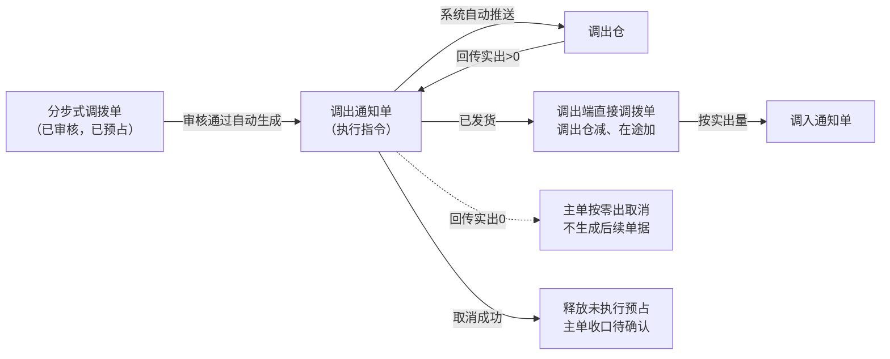
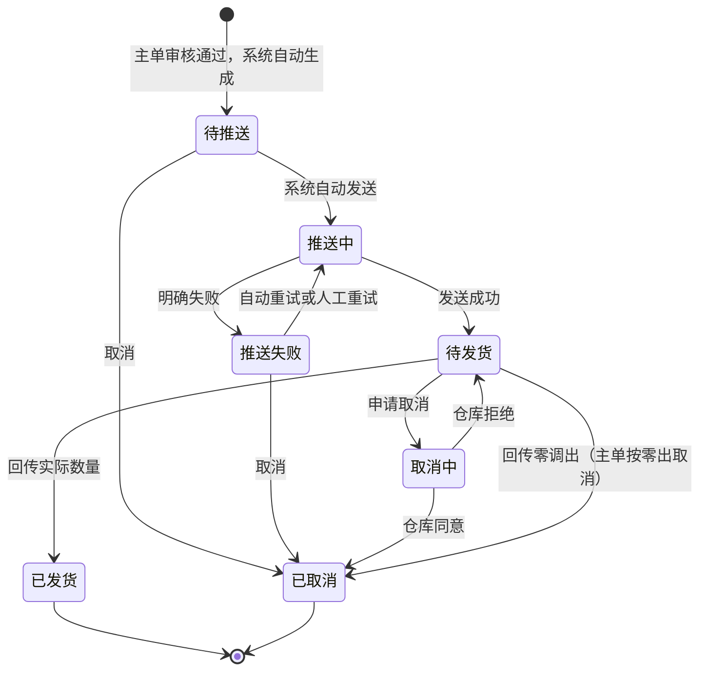

# 调出通知单主PRD

> 用途：定义调出通知单在ERP中的自动生成、自动推送调出仓、一次回传实出、取消与重试，以及与分步式调拨单、直接调拨单的数量衔接，作为研发实现和测试验收的依据。
> 定位：应用设计层文档。业务规则以[《库存与仓储需求分析》](../../../../../02-需求调研和分析/03-库存与仓储/库存与仓储需求分析.md)（INV-FR03、INV-FR05、INV-FR09、INV-AC03、INV-AC13、INV-AC16）和[《库存与仓储业务设计》](../../../../../03-业务分析和设计/03-库存与仓储业务设计.md)（§4.2、§4.8、§5.3、§6.1、§6.3、§七）为准；执行指令单模型与共用规则以[《强盛ERP的单据分层设计》](../../../../../01-全局背景信息/5.强盛ERP的单据分层设计.md) §五、§8.1、§8.2、§8.4为准；状态与操作以[《单据与状态流转》](../../../系统架构和流程/03-单据与状态流转.md) §三为准；字段与取值以[《调出通知单（详细稿）》](../../../字段清单合集/库存相关/调出通知单/调出通知单（详细稿）.tsv)为准；页面骨架见[《调出通知单页面骨架》](调出通知单页面骨架.md)；页面交互以[前端Demo版PRD](前端Demo版PRD/)为准，**须服从本文 §6.4 状态—功能矩阵**。
> 不写什么：不写分步式调拨单的建单、审核与主单完结（见[《分步式调拨单主PRD》](../分步式调拨单/分步式调拨单主PRD.md)）；不写调入通知单的生成与零调入处理（见[《调入通知单主PRD》](../调入通知单/调入通知单主PRD.md)）；不写直接调拨单的记账与金蝶推送（见[《直接调拨单主PRD》](../直接调拨单/直接调拨单主PRD.md)）；不写仓库作业细节、接口报文、系统权限与数据库设计。

| 版本 | 本次变化 | 状态 |
| --- | --- | --- |
| V0.1 | 建立调出通知单主PRD：自动生成与推送、一次回传实出、零调出取消、取消与重试 | 初稿，待评审 |

## 1. 文档信息与阅读边界

| 项目 | 内容 |
| --- | --- |
| 读者 | 研发工程师、测试工程师、产品复核 |
| 业务依据 | [《库存与仓储需求分析》](../../../../../02-需求调研和分析/03-库存与仓储/库存与仓储需求分析.md) INV-FR03、INV-FR05、INV-AC03、INV-AC13；[《库存与仓储业务设计》](../../../../../03-业务分析和设计/03-库存与仓储业务设计.md) §4.2、§4.8、§6.3、§七 |
| 字段依据 | [《调出通知单（详细稿）》](../../../字段清单合集/库存相关/调出通知单/调出通知单（详细稿）.tsv)；字段名称、枚举、必填性、页面展示以TSV为准 |
| 状态依据 | [《单据与状态流转》](../../../系统架构和流程/03-单据与状态流转.md) §三（执行指令单，含“调出／调入通知单”差异段） |
| 页面依据 | [《调出通知单页面骨架》](调出通知单页面骨架.md)、[前端Demo版PRD](前端Demo版PRD/)；按钮展示与文案以Demo PRD为准，须服从本文 §6.4 |

关联资料：[《强盛ERP全局业务规则与约束》](../../../../../01-全局背景信息/4.强盛ERP全局业务规则与约束.md)（§二、§3.1）、[《6.强盛ERP的编码规则和通用字段规则》](../../../../../01-全局背景信息/6.强盛ERP的编码规则和通用字段规则.md)（1.2 前缀DCTZ、2.3 Code-Name、第三节系统记录字段）、[《实体对象关系》](../../../系统架构和流程/02-实体对象关系.md)（§三、§四、§六）、[《系统流程与单据交互》](../../../系统架构和流程/01-系统流程与单据交互.md)第7节、[《预占与冻结主PRD》](../预占与冻结/预占与冻结主PRD.md)（R09）、[《系统集成需求分析》](../../../../../02-需求调研和分析/07-系统集成/系统集成需求分析.md)（INT-FR03、INT-FR05、INT-FR06）。

## 2. 需求背景与目标

### 2.1 背景

分步式调拨单审核后，需要把「本次从调出仓发出多少」作为独立指令交给调出仓执行，并单独跟踪推送、执行与取消。调出仓回传的实际调出量既决定调出仓与在途的库存变化，也决定接收仓按多少件准备接收，因此必须有独立的执行指令单据承接。

没有通知单时，仓库不知道本次该发多少，ERP也无法区分「指令已下发」与「实际已经发出」。

### 2.2 目标

- 由分步式调拨单审核通过后**系统自动生成**调出通知单，一期一张主单一张通知单，不支持人工新建或分批；
- 创建后由系统自动推送调出仓，不需要人工触发推送；推送明确失败后自动重试最多3次，仍失败可人工重试；
- 只接受一次回传：实际调出必须大于0，不超过通知调出数量，超量整次拒绝；
- 有实出时通知变为已发货，并触发调出端直接调拨单与调入通知单（由结果单与调入通知单对象定义）；
- 零调出时按零出取消**整张分步式调拨单**，本通知单按取消结束，不生成后续单据；
- 通知单不增减库存、不推金蝶；库存与业财影响由结果单承担。

## 3. 需求范围

### 3.1 本期范围

- 调出通知单列表、详情（只读查看与办理取消、重试）；
- 由分步式调拨单审核通过后自动生成并自动推送（本模块无新增入口）；
- 单据状态单字段维护（待推送→推送中→待发货／推送失败→已发货／已取消／取消中）；
- 待推送直接取消；推送失败确认仓库未接收后取消；待发货申请取消（进入取消中等待仓库回执）；
- 推送失败自动重试最多3次，仍失败可人工重试；
- 回传实出后的数量回写与状态流转（库存记账由直接调拨单承担）；
- 页头导出；一期批量栏仅已选中计数与列设置。

### 3.2 功能清单

| 编号 | 功能/位置 | 本次内容 | 需求来源 |
| --- | --- | --- | --- |
| F01 | 通知单列表 | 查询（单号、来源调拨单、调出仓、单据状态、商品编码、创建时间）、列展示、进入详情；单据状态多选筛选；勾选配合页头导出；**无新增**；一期批量栏无业务按钮 | INV-FR03 |
| F02 | 自动生成（系统） | 分步式调拨单审核通过后生成并分配单号；带入调出仓与明细数量 | INV-FR03 |
| F03 | 自动推送（系统） | 创建后由系统自动推送调出仓；推送失败自动重试最多3次 | INV-FR03、INT-FR03 |
| F04 | 详情页 | 分区域展示推送与执行结果；终止信息按状态显示；关联来源调拨单与下游结果单 | INV-FR03 |
| F05 | 取消 | 待推送直接取消；推送失败确认仓库未接收后取消 | INV-FR03 |
| F06 | 取消（待发货） | 待发货点「取消」向仓库发起取消并进入取消中；界面上与 F05 同称「取消」 | INV-FR03 |
| F07 | 重试推送 | 自动重试满3次仍失败后由操作人重试，回到推送中 | INT-FR03 |
| F08 | Demo Mock | 模拟仓库回传实出、推送状态变化；仅Demo | 演示需要，非业务规则 |

### 3.3 需求追溯

| 上游场景与需求 | 本 PRD 功能 | 本 PRD 验收 |
| --- | --- | --- |
| INV-FR03：审核后生成调出通知并由系统自动推送 | F02、F03 | AC01 |
| INV-FR03、INV-AC03：回传实出后调出仓减、在途加，消耗预占、释放未发 | F04 | AC02、AC03 |
| INV-FR03、INV-AC13：零调出取消整张分步式调拨单 | F04 | AC04 |
| INV-FR09、INV-AC16：不允许负库存；超量整次拒绝 | F04 | AC05、AC06 |
| INT-FR03：推送失败自动重试最多3次，仍失败可人工重试 | F03、F07 | AC07 |
| INT-FR06：接口拿不到结果时人工确认实际结果 | 人工确认路径（R09） | AC10 |

### 3.4 非本期范围

- 列表页「新增」入口与通知单导入（通知单只能由主单审核后系统生成）；
- 往已结束通知单补发、修改通知调出数量；
- 人工推送按钮（创建后系统自动推送）；
- 调出／调入通知单的虚拟入出库处理方式（《单据分层设计》§5.10：本期不增加该字段）；
- 分步式调拨单、直接调拨单页面与金蝶推送细节；
- 系统权限矩阵、API/表结构/并发锁实现。

| 范围补充 | 说明 |
| --- | --- |
| 适用对象 | 成品SKU；调出仓沿用来源分步式调拨单，不能为虚拟在途仓 |
| 一张主单一张通知单 | 一期不分批；需要再次调拨另建主单 |
| 与原型差异 | 09-产品原型暂无本模块页面（菜单「库存管理-调出通知单」为未开放占位）；页面与交互以本套PRD为准 |

## 4. 单据定位与业务边界

### 4.1 业务作用

| 项目 | 内容 |
| --- | --- |
| 单据层级 | 第2层——执行指令单，表达本次从调出仓发出多少（《单据分层设计》§五） |
| 核心职责 | 记录本次调出指令、推送与执行结果；实出结果决定调出仓减、在途加与接收仓按多少件准备接收 |
| 单据来源 | 分步式调拨单审核通过后系统自动生成；一期唯一方式 |
| 下游单据 | 调出端直接调拨单（实出>0时生成）；调入通知单（按实际调出量生成） |
| 数量关系 | 一张主单对应一张通知单；一张通知单对应0或1张调出端直接调拨单（零调出不生成） |
| 业务终结 | 已发货或已取消为终态；不可撤销；缺发不回原通知补发 |

### 4.2 上下游关系摘要

> 完整链路见[《系统流程与单据交互》](../../../系统架构和流程/01-系统流程与单据交互.md)第7节；本文只保留调出侧交接点。

### 4.3 业务对象关系

| 关系 | 说明 |
| --- | --- |
| 分步式调拨单 : 调出通知单 | 1:1；主单审核通过后系统自动生成 |
| 调出通知单 : 调出端直接调拨单 | 1:0..1；实出>0时生成，零调出不生成 |
| 通知单明细 : 调拨单明细 | N:1；数量按来源行回写 |
| 调出通知单 : 调出仓 | N:1；沿用来源主单调出仓 |
| 调出通知单 : 预占 | N:1（按明细行，来源主单预占）；实出消耗、未发与取消释放 |

### 4.4 本单据不负责的事项

- 通知单不直接减少库存；库存变化由调出端直接调拨单审核后触发；
- 通知单不向金蝶推送；金蝶只接收已审核结果单；
- 通知单不修改来源主单的调出仓、接收仓、商品与计划数量；
- 已发货通知不能往原单追加调出；缺发部分通过未发数量展示，需要再调拨另建主单；
- 超通知量的回传在接收侧整次拒绝；
- 零调出不由通知单单独取消收口，而是取消整张分步式调拨单。

## 5. 核心业务场景索引

| 场景ID | 场景 | 类型 | 说明 |
| --- | --- | --- | --- |
| S01 | 自动生成并一次发足 | 主流程 | 主单审核→自动生成→自动推送→待发货→回传实出=通知量→已发货→生成调出端直接调拨单与调入通知单 |
| S02 | 少发 | 主流程 | 实出<通知量并结束→已发货+未发展示→消耗实出预占、释放未发预占→调入通知按实出量生成 |
| S03 | 零调出 | 支线 | 回传实出0→主单按零出取消、本通知单已取消→释放全部未执行预占→不生成后续单据 |
| S04 | 推送失败重试 | 支线 | 推送失败→自动重试最多3次→仍失败可人工重试→待发货 |
| S05 | 推送前取消 | 支线 | 待推送→取消→已取消，释放全部未执行预占 |
| S06 | 待发货取消 | 支线 | 待发货→取消→取消中→仓库同意→已取消 |
| S07 | 仓库拒绝取消 | 支线 | 取消中→仓库拒绝→待发货；期间到达的实际结果按真实结果处理 |
| S08 | 超量回传 | 异常 | 实出>通知量→整次拒绝并报错；状态与库存不变 |
| S09 | 接口失败人工确认 | 支线 | 已交给仓库、接口拿不到结果→人工确认实际调出结果（INT-FR06）；入口在系统集成中心 |

## 6. 状态与操作

状态定义owner：[《单据与状态流转》](../../../系统架构和流程/03-单据与状态流转.md) §三。调出通知单复用采购收货通知单的执行指令状态机，**把“收货”换成“发货”**，用**单据状态**一个字段串起推送与执行，不设审核状态，也不设「部分发货」流程状态；缺发通过明细「未发数量」展示。本期不增加收货处理方式／发货处理方式字段。

### 6.1 状态维度

| 维度 | 取值 | 说明 |
| --- | --- | --- |
| 单据状态 | 待推送、推送中、推送失败、待发货、取消中、已发货、已取消 | 控制可执行操作与是否继续占用预占 |

### 6.2 状态取值说明

| 状态 | 含义 | 是否终态 |
| --- | --- | --- |
| 待推送 | 已生成，等待系统自动发送 | 否 |
| 推送中 | 正在向调出仓发送，结果未确定 | 否 |
| 推送失败 | 仓库明确未接收；系统自动重试最多3次，仍失败可人工重试或取消 | 否 |
| 待发货 | 调出仓已接收指令，等待回传最终结果 | 否 |
| 取消中 | 已发起取消，等待仓库回执 | 否 |
| 已发货 | 调出仓已回传实际数量并结束 | 是 |
| 已取消 | 通知不再执行（含零调出取消） | 是 |

### 6.3 状态流转图

### 6.4 状态—功能矩阵

> ✅ = 允许；❌ = 不允许；✅（条件）= 须满足对应规则。F01 查询/查看各状态均不重复列出。

| 动作 | 待推送 | 推送中 | 推送失败 | 待发货 | 取消中 | 已发货 | 已取消 |
| --- | --- | --- | --- | --- | --- | --- | --- |
| 取消（F05） | ✅ | ❌ | ✅（R10） | ❌ | ❌ | ❌ | ❌ |
| 取消（待发货）（F06） | ❌ | ❌ | ❌ | ✅ | ❌ | ❌ | ❌ |
| 重试推送（F07） | ❌ | ❌ | ✅ | ❌ | ❌ | ❌ | ❌ |
| 详情/追溯（F04） | ✅ | ✅ | ✅ | ✅ | ✅ | ✅ | ✅ |
| Demo Mock（F08） | ✅（Demo） | ✅（Demo） | ✅（Demo） | ✅（Demo） | ✅（Demo） | ❌ | ❌ |

说明：

- 通知单**不提供**新增、编辑、提交、审核、撤回入口；备注随来源主单，不在本单维护。
- 推送中、取消中：仅查看与等待，不提供取消、重试；自动重试由系统在推送失败后发起，不占用人工按钮。
- 已发货、已取消：仅查看与追溯，不提供补发、反取消。
- 列表与详情行内操作按状态互斥展示，最多直出3个+「更多」；列表批量操作栏一期仅展示已选中计数与列设置，不提供批量取消；导出在页头，可选已勾选范围。
- 全部操作权限按RBAC，引用COM-FR01、COM-FR02；本文不写权限矩阵。

### 6.5 状态流转表

| 当前状态 | 动作 | 前置条件 | 结果状态 | 二次确认 | 后置影响 | 失败处理 |
| --- | --- | --- | --- | --- | --- | --- |
| — | 自动生成 | 来源分步式调拨单审核通过（R01） | 待推送 | 无 | 分配单号（R02）；带入调出仓与明细数量 | 生成失败则整笔回滚，不留下主单已审核但没有通知单的状态 |
| 待推送 | 自动推送 | 系统作业 | 推送中 | 无 | — | — |
| 推送中 | 推送成功 | 仓库确认接收 | 待发货 | 无 | 记录推送时间 | — |
| 推送中 | 推送失败 | 仓库明确未接收 | 推送失败 | 无 | 记录推送失败原因；仍占用预占；触发自动重试（R07） | — |
| 推送失败 | 自动重试 | 未达3次（R07） | 推送中 | 无 | — | 仍失败则保持推送失败 |
| 推送失败 | 人工重试 | 操作人触发（F07） | 推送中 | 见 Demo PRD | 不重新审核、不重复预占 | — |
| 待推送／推送失败 | 取消 | 推送失败时须确认仓库未接收（R10） | 已取消 | 必填取消原因 | 释放全部未执行预占；主单收口方式待确认（Q03） | — |
| 待发货 | 取消 | — | 取消中 | 见 Demo PRD | 等待仓库回执；期间仍占用预占 | — |
| 取消中 | 仓库同意 | 仓库回执 | 已取消 | 无 | 释放全部未执行预占；记录取消信息 | — |
| 取消中 | 仓库拒绝 | 仓库回执 | 待发货 | 无 | 继续等待调出 | — |
| 待发货 | 调出回传 | 实出≤通知调出数量且>0（R05） | 已发货 | 自动 | 回写实际调出与未发数量；消耗实出预占、释放未发预占；生成调出端直接调拨单；按实出量生成调入通知单 | 超量整次拒绝 |
| 待发货 | 零调出回传 | 实出=0并结束（R06） | 已取消 | 自动 | 来源主单按零出取消；释放全部未执行预占；不生成后续单据 | — |
| 已发货／已取消 | 查看 | — | 不变 | — | — | — |

## 7. 核心业务规则

### 7.1 生成与来源规则

| 规则编号 | 主题 | 规则 | 边界或例外 |
| --- | --- | --- | --- |
| R01 | 来源主单 | 只能由已审核、业务状态正常的分步式调拨单自动生成；一张主单最多一张调出通知单 | 主单未审核不生成；已取消、已完结不生成 |
| R02 | 单号 | 按[《6.强盛ERP的编码规则和通用字段规则》](../../../../../01-全局背景信息/6.强盛ERP的编码规则和通用字段规则.md)第一节自动生成；前缀DCTZ；生成时分配 | 无草稿态；用户不可编辑 |
| — | 单头与明细继承 | 来源分步式调拨单、调出仓、商品明细与通知调出数量沿来源携带 | 用户不可改调出仓、商品与数量；一期不提供编辑入口 |

### 7.2 推送规则

| 规则编号 | 主题 | 规则 | 边界或例外 |
| --- | --- | --- | --- |
| R03 | 自动推送 | 通知生成后由系统自动推送调出仓，不需要人工触发推送按钮 | 本期不增加发货处理方式；不走虚拟出库路径 |
| R07 | 自动重试 | 推送明确失败后系统自动重试，**最多3次**；3次仍失败则保持「推送失败」，可人工重试（F07） | 间隔本期不定秒数，由技术配置 |
| — | 推送中等待 | 推送结果不确定时不得重复发送、不得提前释放预占 | 先核实仓库是否收到 |
| — | 推送记录 | 记录推送时间、推送失败原因；重试成功后仍保留历史失败原因 | 见字段清单；推送日志见 INT-FR03、INT-FR05 |

### 7.3 回传与数量规则

| 规则编号 | 主题 | 规则 | 边界或例外 |
| --- | --- | --- | --- |
| R04 | 一次回传 | 只接受一次最终回传，回传即结束；仓库内部分批作业不进入系统口径 | 结束后需要再调拨另建主单（《单据分层设计》§8.1） |
| R05 | 实出上限与下限 | 实际调出必须大于0；不超过通知调出数量；按来源主单行回写 | 超量整次拒绝并报错（INV-AC16） |
| R06 | 零调出 | 仓库最终确认实际调出为0时，来源分步式调拨单按零出取消，本通知单按取消结束（已取消）；不生成在途、调入通知与两张直接调拨单 | 取消记在主单；须收到最终结果，不能把等待中的未知当作零调出 |
| — | 未发数量 | 未发数量＝通知调出数量−实际调出数量；发货完成后计算展示 | 不回原通知补发；未发部分释放预占 |
| R08 | 预占处理 | 实出>0时消耗实出对应预占并释放未发部分；零调出或取消成功时释放全部未执行预占 | 同一部分不能既消耗又释放，也不能重复释放（[《预占与冻结主PRD》](../预占与冻结/预占与冻结主PRD.md)R09） |
| R09 | 人工确认 | 已交给仓库、接口拿不到结果时，可按实际发生情况确认实际调出结果并沿来源主单回写（INT-FR06） | 入口在系统集成中心；不能无来源建通知单；人工确认不能把零调出当成已发货 |

### 7.4 取消规则

| 规则编号 | 主题 | 规则 | 边界或例外 |
| --- | --- | --- | --- |
| R10 | 直接取消 | 待推送可直接取消，必填取消原因；推送失败须确认仓库未接收后才能取消 | 推送结果不确定时先核实，不直接当失败处理；释放全部未执行预占 |
| R11 | 待发货取消 | 待发货点「取消」进入取消中，等待仓库回执；仓库同意才释放预占 | 取消中仍须处理到达的实际结果；校验通过后按真实结果完成 |
| — | 不可撤销 | 已发货、已取消为终态，不可反取消 | — |
| — | 取消与主单 | 取消成功后主单如何收口待确认（Q03）；确认前不自动改主单状态 | 零调出路径由主单按零出取消，不走本条 |

### 7.5 业务生效点

| 业务动作 | 通知单影响 | 库存影响 | 业财/外部影响 |
| --- | --- | --- | --- |
| 自动生成 | 待推送；带入调出仓与数量 | 无（预占在主单审核时已占用） | 触发向调出仓推送 |
| 推送成功 | 单据状态→待发货 | 无 | 仓库开始执行 |
| 调出回传（实出>0） | 已发货；回写实际调出与未发 | 无（由调出端直接调拨单记账：调出仓减、在途加） | 生成调出端直接调拨单；按实出量生成调入通知单 |
| 零调出回传 | 已取消；主单按零出取消 | 无 | 不生成后续单据、不推金蝶 |
| 取消成功 | 已取消 | 无 | 释放未执行预占；主单收口待确认 |
| 推送失败 | 保持推送失败；仍占用预占 | 无 | 自动重试最多3次 |

### 7.6 字段校验绑定

完整字段见TSV。摘要：

| 校验时机 | 要求 |
| --- | --- |
| 自动生成 | 来源主单已审核+正常；调出仓、明细数量完整（R01） |
| 推送 | 单据状态为待推送或推送失败（R03、R07） |
| 回传 | 实出为整数、大于0、不超过通知调出数量（R05）；零调出须为最终结果（R06） |
| 取消 | 状态允许；取消原因必填；待推送／推送失败直接取消（R10），待发货取消进入取消中等待仓库回执（R11）；推送失败时须确认仓库未接收 |

页面控件、错误文案见Demo PRD。

## 8. 功能需求说明（页面索引）

| 编号 | 页面/位置 | 规则与状态依据 | Demo PRD |
| --- | --- | --- | --- |
| F01 | 列表 | §6.4 | [列表页](前端Demo版PRD/调出通知单前端Demo版PRD_列表页.md) |
| F02 | 自动生成 | R01、R02 | 系统功能；无页面 |
| F03 | 自动推送/自动重试 | R03、R07 | 系统功能；失败原因见详情页 |
| F04 | 详情 | R05、R06、R08；§6.4 | [详情页](前端Demo版PRD/调出通知单前端Demo版PRD_详情页.md) |
| F05/F06 | 取消 | R10、R11；§7.4、§6.4 | [弹窗与Mock](前端Demo版PRD/调出通知单前端Demo版PRD_弹窗与Mock.md) §2.1、§2.2 |
| F07 | 重试推送 | R07；§6.5 | 弹窗 PRD §2.3 |
| F08 | Demo Mock | 非正式验收 | 弹窗 PRD §3 |

本期不提供新增/编辑页，理由见[《调出通知单前端Demo版PRD_新增编辑页》](前端Demo版PRD/调出通知单前端Demo版PRD_新增编辑页.md)。

## 9. 上下游影响与协同

| 关联模块/系统 | 需要配合的变化 | 交接内容与时机 | 验收结果 |
| --- | --- | --- | --- |
| 分步式调拨单 | 审核后自动生成；回传实出回写主单累计；零调出取消主单 | 主单审核通过即生成；实出>0或=0时回写 | 数量与主单口径一致；主单状态按 §6.5 收口 |
| 调出仓／WMS | 接收推送、回传实出、取消回执 | 创建后自动推送；一次回传结束 | 状态按 §6.3 流转 |
| 直接调拨单 | 由回传触发生成调出端结果单 | 实出>0且校验通过后生成 | 调出仓减、在途加；已审核后推金蝶 |
| 调入通知单 | 按实际调出量生成并推送接收仓 | 调出端直接调拨单生成后 | 不按原计划量提前下发 |
| 预占与冻结 | 实出消耗、未发与取消释放 | 调出回传或取消成功时 | 消耗与释放不重复 |
| 库存流水 | 记账产生流水，可从流水追溯到本单 | 结果单审核记账时 | 追溯成立 |
| 金蝶 | 不推送通知单 | — | 只推结果单 |
| 系统集成中心 | 展示推送结果与失败原因；接口失败时人工确认实际结果 | 推送状态、时间、失败原因 | INT-FR03、INT-FR05、INT-FR06 |

## 10. 关联文档与阅读入口

| 关联内容 | 阅读入口 | 本 PRD 与其边界 |
| --- | --- | --- |
| 分步式调拨单 | [《分步式调拨单主PRD》](../分步式调拨单/分步式调拨单主PRD.md) | 建单、审核、预占、主单完结 owner 在主单侧 |
| 调入通知单 | [《调入通知单主PRD》](../调入通知单/调入通知单主PRD.md) | 按实际调出量生成；零调入异常处理 owner 在调入侧 |
| 直接调拨单 | [《直接调拨单主PRD》](../直接调拨单/直接调拨单主PRD.md) | 记账、审核与金蝶推送不在本文 |
| 状态与操作 | [《单据与状态流转》](../../../系统架构和流程/03-单据与状态流转.md) §三、§七、§九 | 状态owner；回写表与联动要点 |
| 分层模型 | [《强盛ERP的单据分层设计》](../../../../../01-全局背景信息/5.强盛ERP的单据分层设计.md) §五、§8.1、§8.2 | 执行指令单职责与一次回传、超量拒绝 |
| 状态机参照 | [《采退发货通知单主PRD》](../../4-采购退货管理/采退发货通知单/采退发货通知单主PRD.md) | 同一套执行指令状态机的发货版表述 |
| 字段定义 | [《调出通知单（详细稿）》](../../../字段清单合集/库存相关/调出通知单/调出通知单（详细稿）.tsv) | TSV 为字段 owner |
| 页面结构 | [《调出通知单页面骨架》](调出通知单页面骨架.md) | 区域与线框走查，非规则权威 |
| 页面交互 | [前端Demo版PRD](前端Demo版PRD/) | 控件、文案、Mock；服从 §6.4 |

## 11. 异常与一致性

### 11.1 并发操作

| 场景 | 业务处理结果 |
| --- | --- |
| 推送中重复触发重试 | 自动重试与人工重试同时只允许一个作业成功；另一个提示状态已变化 |
| 取消中收到实出回传 | 按真实结果完成发货，不以取消申请覆盖已发生事实 |
| 零调出与取消同时发生 | 以仓库最终回传为准；先到者成立，不重复释放预占 |
| 主单审核同时被其他用户撤回 | 以主单最终状态为准；未审核不生成通知单 |

### 11.2 幂等与重复处理

| 操作 | 幂等规则 |
| --- | --- |
| 自动生成 | 同一主单不得重复生成调出通知单 |
| 回传 | 同一最终结果不得重复生成直接调拨单、不得重复计入实际调出 |
| 取消回执 | 重复到达的同意／拒绝回执只保持一致终态 |
| 预占消耗与释放 | 同一部分不能既消耗又释放，也不能重复释放 |

### 11.3 与上下游单据一致性

| 场景 | 处理方式 |
| --- | --- |
| 主单已取消／已完结 | 不再生成、不再回传；迟到回传按异常处理 |
| 通知已发货 | 不追加调出；需要再调拨另建主单 |
| 取消成功但主单未收口 | 主单收口方式待确认（Q03），确认前保留已审核+正常并挂提示 |
| 零调出 | 主单已取消、本通知单已取消、后续单据不生成 |
| 推送失败 | 仍占用预占；自动重试最多3次，仍失败可人工重试或在确认未接收后取消 |

## 12. 验收标准与待确认事项

### 12.1 验收标准

| 编号 | 对应功能/规则 | 条件与操作 | 预期结果 |
| --- | --- | --- | --- |
| AC01 | F02、F03/R01、R02 | 分步式调拨单审核通过 | 自动生成调出通知单并分配DCTZ单号；自动推送调出仓；状态为待推送→推送中→待发货 |
| AC02 | F04/R05 | 通知100件，仓库回传实出90并结束 | 通知已发货；实际调出90、未发10；生成90件的调出端直接调拨单；调入通知按90件生成（INV-AC03） |
| AC03 | F04/R08 | 承接AC02 | 调出仓即时−90、在途+90；消耗预占90、释放未发10；可用量同步反映消耗，不误判库存不足 |
| AC04 | F04/R06 | 仓库回传实际调出0并结束 | 主单按零出取消；本通知单已取消；不生成在途、调入通知与两张直接调拨单；库存不变；释放未执行预占（INV-AC13） |
| AC05 | F04/R05 | 通知100件，仓库回传110件 | 整次拒绝并报错；状态、库存与预占不变（INV-AC16） |
| AC06 | F04、负库存阻断 | 记账后调出仓即时或可用库存将为负 | 阻止本次生效并报错；不先记负数、不自动释放已有预占（INV-FR09） |
| AC07 | F03、F07/R07 | 推送明确失败 | 自动重试最多3次；仍失败保持推送失败，可人工重试；失败期间仍占用预占 |
| AC08 | F05/R10 | 待推送取消 | 已取消；释放全部未执行预占；保留取消原因与时间 |
| AC09 | F06/R11 | 待发货取消，仓库拒绝 | 恢复待发货；继续等待回传；期间预占不释放 |
| AC10 | R09、INT-FR06 | 已交给仓库的调出通知接口拿不到结果 | 可人工确认实际调出结果并沿来源主单回写；不能无来源建通知单 |
| AC11 | F01 | 列表筛选单据状态 | 多选OR匹配；列与TSV一致；默认按创建时间倒序 |
| AC12 | F04 | 详情展示来源调拨单与关联结果单 | 可跳转来源分步式调拨单；已发货时可查看调出端直接调拨单；推送失败展示失败原因 |
| AC13 | F08 | Demo Mock 模拟回传 | 仅Demo可用；正式验收以仓库回传为准 |

### 12.2 待确认事项

| 编号 | 问题 | 影响范围 | 确认人 | 最迟确认阶段或时间 | 状态/结论 |
| --- | --- | --- | --- | --- | --- |
| Q01 | 调出通知单是否需要编辑备注 | 页面入口 | 待指定 | 页面评审前 | 待确认；当前画法不提供编辑入口，备注随来源主单，理由：通知由系统自动生成并推送 |
| Q02 | 通知单是否允许人工重试以外的推送干预（如暂停、重新发送） | 推送规则 | 待指定 | 接口设计前 | 待确认；当前只提供自动重试最多3次与人工重试，与采购、销售通知单同一口径 |
| Q03 | 取消成功后来源主单如何收口 | 主单状态、预占释放与追溯 | 待指定 | 业务先确认（03 §七） | 待确认；建议按「已取消」收口并释放全部未执行预占；确认前不自动改主单状态（与主单PRD Q05同一事项） |
| Q04 | 已交给仓库、接口拿不到结果时的人工确认入口与留痕 | 人工确认路径 | 待指定 | 集成PRD定稿前 | 待确认；沿用INT-FR06，入口在系统集成中心，须沿来源主单回写，不能无来源建单 |
| Q05 | 零调出取消与主单收口的记录口径 | 取消原因、操作人与追溯 | 待指定 | 页面评审前 | 待确认；当前画法：主单取消原因取仓库回传确认说明，取消操作人留空、由系统记录 |
| Q06 | 推送失败自动重试的次数与间隔 | 推送规则 | 待指定 | 已定（沿用现有结论） | 已定：自动重试最多3次，间隔由技术配置；3次后可人工重试 |
| Q07 | 查看、导出与重试的角色与数据范围 | 页面入口可见性 | 待指定 | 权限配置（系统管理PRD）定稿前 | 待确认；引用COM-FR01、COM-FR02 |
| Q08 | 完整操作日志的字段与入口（一期后置） | 详情页操作信息区 | 待指定 | 页面评审前 | 待确认；一期按制单信息展示，完整操作日志后置（《4.强盛ERP全局业务规则与约束》§五） |
