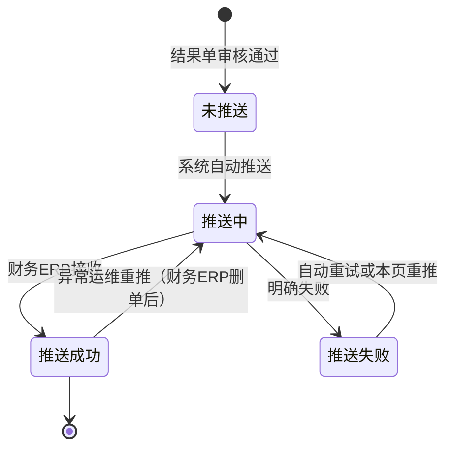

# 业财结果单据主PRD

> 用途：定义系统集成中心「业财结果单据」页的展示对象、推送状态口径、重推与异常运维边界、查询与导出，作为研发实现和测试验收的依据。
> 定位：应用设计层文档。业务规则以[《结算与业财需求分析》](../../../../../02-需求调研和分析/05-结算与业财/结算与业财需求分析.md)（FIN-FR01～FIN-FR03、FIN-AC01～FIN-AC05、§七）和[《集成协作与人工补充》](../../../../../03-业务分析和设计/07-集成协作与人工补充.md)（§4.5、§6.4、§七）为准；七类结果单范围与推送口径见[《4.强盛ERP全局业务规则与约束》](../../../../../01-全局背景信息/4.强盛ERP全局业务规则与约束.md)§四、[《5.强盛ERP的单据分层设计》](../../../../../01-全局背景信息/5.强盛ERP的单据分层设计.md)§5.4、§七；推送财务ERP状态与重推见[《单据与状态流转》](../../../系统架构和流程/03-单据与状态流转.md)§四；字段与取值以[《业财结果单据（详细稿）》](../../../字段清单合集/集成相关/业财结果单据/业财结果单据（详细稿）.tsv)为准；页面分区见[《业财结果单据页面骨架》](业财结果单据页面骨架.md)；页面交互以[《业财结果单据前端Demo版PRD》](前端Demo版PRD/业财结果单据前端Demo版PRD_列表页.md)为准。
> 不写什么：不写七类结果单本身的建立、审核、记账与来源追溯规则（见各模块PRD）；不写财务ERP接口报文、字段对照、成功判定与调度（接口设计）；不写其他推送对象与结果处理失败的异常查看（见[《推送异常主PRD》](../推送异常/推送异常主PRD.md)）；不写人工确认与订单导入（入口在各业务单据页面，规则见《系统集成需求分析》INT-FR06）；不写系统权限矩阵与数据库设计。

| 版本 | 本次变化 | 状态 |
| --- | --- | --- |
| V0.1 | 2026-09-24：建立业财结果单据主PRD：页面定位与只读边界、七类结果单范围、推送状态与自动重试、失败重推与异常运维重推、查询与导出、验收与待确认 | 初稿，待评审 |
| V0.2 | 2026-09-24：收口确认：推送记录全部保留、记录财务ERP返回内容、重推与异常运维重推按角色权限、自动重试最多3次（间隔技术配置） | 初稿，待评审 |

## 一、文档概要

需求类型：新建模块（系统集成-业财结果单据）。

关联资料：

- 需求分析：[《结算与业财需求分析》](../../../../../02-需求调研和分析/05-结算与业财/结算与业财需求分析.md)（FIN-FR01～FIN-FR03、FIN-AC01～FIN-AC05、§七）、[《系统集成需求分析》](../../../../../02-需求调研和分析/07-系统集成/系统集成需求分析.md)（INT-FR03、INT-FR05、INT-AC03、INT-AC04、§七）
- 业务设计：[《集成协作与人工补充》](../../../../../03-业务分析和设计/07-集成协作与人工补充.md)（§4.5 异常在哪里看、§6.4 集成中心不改业务内容、§七）、[《结算与业财交接》](../../../../../03-业务分析和设计/06-结算与业财交接.md)（§三、§五）
- 全局规则：[《4.强盛ERP全局业务规则与约束》](../../../../../01-全局背景信息/4.强盛ERP全局业务规则与约束.md)（§四 推送财务ERP范围与失败处理、§五 权限与导出）、[《5.强盛ERP的单据分层设计》](../../../../../01-全局背景信息/5.强盛ERP的单据分层设计.md)（§5.4 采购入库单、§7.1 一层结果单、§8.3 结果单与审核）、[《6.强盛ERP的编码规则和通用字段规则》](../../../../../01-全局背景信息/6.强盛ERP的编码规则和通用字段规则.md)（第三节 空值与展示、第四节 DATETIME_SEC、USER_REF）
- 应用设计：[《系统与模块地图》](../../../系统架构和流程/00-系统与模块地图.md)（§二 系统集成、附录 菜单结构）、[《系统流程与单据交互》](../../../系统架构和流程/01-系统流程与单据交互.md)（§9 财务交接）、[《单据与状态流转》](../../../系统架构和流程/03-单据与状态流转.md)（§四 结果单）
- 字段清单：[《业财结果单据（详细稿）》](../../../字段清单合集/集成相关/业财结果单据/业财结果单据（详细稿）.tsv)
- 页面分区：[《业财结果单据页面骨架》](业财结果单据页面骨架.md)
- 页面与交互：[《业财结果单据前端Demo版PRD》](前端Demo版PRD/业财结果单据前端Demo版PRD_列表页.md)、[《业财结果单据前端Demo版PRD_弹窗与Mock》](前端Demo版PRD/业财结果单据前端Demo版PRD_弹窗与Mock.md)

页面定位：业财结果单据是系统集成中心查看七类已审核结果单推送财务ERP情况的页面。它展示结果单类型、结果单号、业务日期、仓库、推送财务ERP状态、最近推送时间与失败原因，保留必要的推送记录；推送失败时在本页针对原结果单重推，推送成功后发现有异常时由技术运维在本页重新推送。页面不修改原单业务信息，不展示财务ERP单号，也不另建业务单或结果单。能力归结算与业财，入口在系统集成中心（FIN-FR01～FIN-FR03、INT-FR03）。

## 二、需求背景与范围

七类已审核结果单要逐单推送财务ERP，推送失败不回滚已生效业务或库存。业务人员需要知道哪张结果单交没交过去、为什么没成功；失败修复后要能继续用原结果单处理，不能新建业务单，也不能在采购入库单等业务列表开重推入口（FIN-FR03；《4.强盛ERP全局业务规则与约束》§四）。页面把七类结果单的推送情况集中展示，并提供针对原单的重推入口。

| 范围 | 说明 |
| --- | --- |
| 本期要做 | 七类已审核结果单的推送情况列表；按结果单类型、结果单号、业务日期、仓库、推送财务ERP状态、最近推送时间查询；查看推送记录；推送失败时重推原结果单；推送成功后异常运维重推；导出当前推送情况 |
| 本期不做 | 财务ERP接口报文、字段对照、成功判定与调度（接口设计）；财务ERP单号展示（FIN 已确认不要求）；结果单业务信息编辑、反审核与冲销更正；自动重试的调度实现；人工确认实际结果与订单导入（入口在各业务单据页面）；其他外部推送与结果处理失败的查看（见《推送异常主PRD》）；平台账单、收退款与财务核算 |
| 适用对象 | 采购入库单、采退出库单、销售出库单、销退入库单、其他入库单、其他出库单、直接调拨单七类结果单；仅已审核结果单进入本页 |

## 三、方案总览与功能清单

结果单在所属业务模块生成并审核通过后，由系统自动逐单推送财务ERP，不按日期、客户、供应商或店铺汇总。推送结果独立记录在结果单的推送财务ERP状态上：推送明确失败后系统自动重试最多3次，仍失败保持「推送失败」，业务人员在本页查看失败原因并重推原单；推送成功后才发现异常时，先由人工在财务ERP删除错误单据，再由技术运维在本页重新推送原结果单。页面只展示与重推，不修改原单业务信息。

### 3.1 需求追溯

| 上游场景与需求 | 本PRD功能 | 本PRD验收 |
| --- | --- | --- |
| FIN-FR01：七类已审核结果单逐单推送，未审核不推、不汇总 | F01 | AC01、AC02 |
| FIN-FR02：采购、销售结果带来源交易信息；其他出入库、直接调拨不传成本价格 | F01（只展示原单，不重编字段） | AC02 |
| FIN-FR03：失败不回滚、保留失败记录、修复后在系统集成中心针对原单处理 | F01、F03 | AC03、AC04 |
| FIN-FR03：成功后异常由技术运维在财务ERP删单后重推原结果单 | F04 | AC05 |
| INT-FR03：展示原单、推送状态、时间、失败原因和必要处理记录；不能修改原单业务信息；不要求展示财务ERP单号 | F01、F02 | AC01、AC06 |
| 《单据与状态流转》§四：推送财务ERP状态未推送→推送中→推送成功／推送失败；自动重试最多3次 | F01、F03 | AC02、AC03 |
| 《4.强盛ERP全局业务规则与约束》§五：导出按导出中心 | F05 | AC07 |

### 3.2 功能清单

| 编号 | 功能/位置 | 本次内容 | 需求来源 |
| --- | --- | --- | --- |
| F01 | 业财结果单据列表（系统集成-业财结果单据） | 展示七类已审核结果单的推送情况；按结果单类型、结果单号、业务日期、仓库、推送财务ERP状态、最近推送时间查询 | FIN-FR01～FIN-FR03、INT-FR03 |
| F02 | 推送记录查看 | 按结果单查看每次推送的时间、结果、失败原因、触发方式与操作人 | INT-FR03；FIN-FR03 |
| F03 | 重推（推送失败） | 针对原结果单重推；不重新审核、不重复记账、不回滚库存；重推入口只在本页，结果单所属模块的列表与详情不提供重推按钮 | FIN-FR03、INT-FR03 |
| F04 | 异常运维重推（推送成功后异常） | 财务ERP删除错误单据后，由技术运维重新推送原结果单；填写原因；属异常运维，不是普通业务入口 | FIN-FR03 |
| F05 | 导出 | 按导出中心导出当前推送情况，范围可选全部／当前筛选／已勾选 | 《4.强盛ERP全局业务规则与约束》§五 |

## 四、功能需求说明

### 4.1 共用规则

| 规则编号 | 主题 | 规则 | 边界或例外 |
| --- | --- | --- | --- |
| R01 | 页面定位 | 本页是推送财务ERP结果的查看口和重推口，不是改单口：不提供结果单业务信息的新增、编辑、删除、反审核；不展示财务ERP单号；不另建业务单或结果单 | FIN-FR03；《集成协作与人工补充》§6.4；《4.强盛ERP全局业务规则与约束》§四 |
| R02 | 数据范围 | 仅七类已审核结果单：采购入库单、采退出库单、销售出库单、销退入库单、其他入库单、其他出库单、直接调拨单。草稿、待审核结果单不推送、不在本页展示；订单、申请、通知和分步式调拨主单不推送、不进入本页 | FIN-FR01；《4.强盛ERP全局业务规则与约束》§四；《单据与状态流转》§四 |
| R03 | 推送触发与状态 | 已审核后由系统自动逐单推送，不增加财务二次审核；推送财务ERP状态取值：未推送、推送中、推送成功、推送失败。推送明确失败后系统自动重试最多3次，间隔由技术配置；3次仍失败保持「推送失败」，等待重推；推送中先等待，不重复发送 | FIN-FR01～FIN-FR03；《单据分层设计》§5.4、§7.1；《单据与状态流转》§四 |
| R04 | 重推 | 仅「推送失败」可重推；针对原结果单重试，不重新审核、不重复记账、不回滚库存与回写；每次推送生成一条推送记录。重推入口只在本页，结果单所属模块的列表与详情不提供重推按钮 | FIN-FR03；INT-FR03；《单据与状态流转》§四 |
| R05 | 异常运维重推 | 「推送成功」后发现异常（如金额错误）时：先由人工在财务ERP删除错误单据，再由技术运维在本页重新推送原结果单；重推前填写原因，不修改原单业务信息；操作权限按角色控制（见Q02，2026-09-24确认），一期不提供单独的状态调整入口。该能力属于异常运维，不是普通业务人员在业务列表上的常规操作 | FIN-FR03；《结算与业财交接》§三、§五 |
| R06 | 推送记录 | 保留每次推送的记录：推送时间、推送结果、失败原因、触发方式（系统自动／自动重试／人工重推／异常运维重推）与操作人；系统自动触发时操作人显示「系统」。一期不做完整操作日志，推送记录必须保留 | INT-FR03；《4.强盛ERP全局业务规则与约束》§五 |
| R07 | 查询与默认视图 | 查询条件之间按AND匹配；结果单类型、推送财务ERP状态多选时按OR匹配；结果单号模糊匹配；业务日期按日期范围；最近推送时间按日期范围；仓库单选；未选条件等同全部。默认展示全部推送状态，按业务日期降序；同一业务日期内按最近推送时间降序，未推送的排在该业务日期最后 | FIN-FR01；查询规则与默认视图为本模块设计 |
| R08 | 导出 | 导出按导出中心，范围可选全部／当前筛选／已勾选，异步任务；导出列与列表列一致；导出为空时留空，不写入 `-` | 《4.强盛ERP全局业务规则与约束》§五 |
| R09 | 空值与异常 | 未推送时最近推送时间与失败原因为空，页面展示 `-`；查询无结果展示空状态，不自动补造记录；结果单不存在或不可访问时提示后停留列表；推送记录只读，不能修改 | 《6.强盛ERP的编码规则和通用字段规则》第三节；本模块定义 |
| R10 | 权限 | 查看按菜单与数据权限；重推与异常运维重推按角色权限（RBAC）控制（见Q02，2026-09-24确认）；权限不能绕过状态校验；引用COM-FR01、COM-FR02，不建权限矩阵 | 《4.强盛ERP全局业务规则与约束》§五；[《公共能力与系统管理需求分析》](../../../../../02-需求调研和分析/08-公共能力与系统管理/公共能力与系统管理需求分析.md) COM-FR01、COM-FR02 |

### 4.2 F01 业财结果单据列表

| 内容 | 说明 |
| --- | --- |
| 使用场景 | 业务人员或集成维护方核对某张结果单有没有推给财务ERP、为什么失败；财务与业务对账前查看一段期间的结果单推送情况。 |
| 操作与处理 | 进入「系统集成-业财结果单据」查看列表；按结果单类型、结果单号、业务日期、仓库、推送财务ERP状态、最近推送时间查询；结果单号可点击进入对应模块的结果单详情（只读）；页头可导出。 |
| 功能规则 | 数据范围见R02；推送状态与自动重试见R03；默认排序见R07；仓库按结果单口径展示：入库类显示入库仓库（销退入库单为收货仓库）、出库类显示出库仓库、直接调拨单显示「来源逻辑仓 → 目标逻辑仓」；未推送、推送中行不提供重推；列表不展示财务ERP单号。 |
| 成功结果 | 列表返回匹配的结果单推送情况，展示结果单类型、结果单号、业务日期、仓库、推送财务ERP状态、最近推送时间与失败原因；失败行可按条件筛选出来处理。 |
| 异常与恢复 | 查询无结果时展示空状态；结果单不存在或不可访问时Toast提示并停留列表；推送中不重复触发；推送失败不自动回滚业务或库存，按R04处理。 |

### 4.3 F02 推送记录查看

| 内容 | 说明 |
| --- | --- |
| 使用场景 | 失败原因或推送次数需要进一步核实时，展开某张结果单的推送过程。 |
| 操作与处理 | 列表行内点「推送记录」打开弹窗，按时间倒序展示该结果单的每次推送：推送序号、推送时间、推送结果、推送失败原因、触发方式与操作人；人工触发的重推显示操作人，系统自动与自动重试显示「系统」。 |
| 功能规则 | 推送记录随每次推送自动追加，不可编辑、删除；自动重试、人工重推与异常运维重推的记录口径一致（R06）；推送记录全部保留，不清理（Q04已定）；记录财务ERP返回内容（错误码、报文摘要等），字段随接口设计扩展（Q05已定）。 |
| 成功结果 | 能看到每次推送的结果与原因，区分系统自动、自动重试与人工操作。 |
| 异常与恢复 | 无推送记录时展示空态（正常情况：未推送）；记录缺失或异常时提示核实，不自动补造记录。 |

### 4.4 F03 重推（推送失败）

| 内容 | 说明 |
| --- | --- |
| 使用场景 | 结果单推送财务ERP明确失败，且已确认修复（接口、数据或财务ERP侧处理完成）后，继续用原结果单重试。 |
| 操作与处理 | 行内「重推」→ 二次确认 → 系统按原结果单重新推送；状态回到「推送中」，推送结束后更新为「推送成功」或「推送失败」；追加一条推送记录。 |
| 功能规则 | 仅「推送失败」可用（R04）；重推不重新审核、不重复记账、不回滚库存与回写；不另建业务单或结果单；推送中不可重复触发，前一次结果未确定时先核实，不直接当失败重发。 |
| 成功结果 | 推送成功时状态变为「推送成功」，记录保留；推送失败时保持「推送失败」，失败原因更新为最新一次。 |
| 异常与恢复 | 重推失败不回滚业务；可继续重推或转技术运维处理；状态不匹配（未推送／推送中／推送成功）时不展示重推按钮。 |

### 4.5 F04 异常运维重推（推送成功后异常）

| 内容 | 说明 |
| --- | --- |
| 使用场景 | 结果单推送成功后，财务在财务ERP发现单据错误（如金额、数量、往来单位）：人工先在财务ERP删除错误单据，再由技术运维在ERP重新推送原结果单，使财务ERP最终只保留一张有效单据。 |
| 操作与处理 | 行内「异常运维重推」→ 填写重推原因 → 二次确认 → 系统按原结果单重新推送；追加一条触发方式为「异常运维重推」的推送记录，操作人记录当前账号。 |
| 功能规则 | 仅「推送成功」且由具备异常运维权限的账号操作（权限见Q02）；不修改原单业务信息、不反审核、不新建业务单；重推后状态按推送结果更新。 |
| 成功结果 | 重新推送完成，财务ERP侧只保留一张有效单据；处理过程有记录可查。 |
| 异常与恢复 | 重推失败时保留原因与记录，按重推流程继续或转技术运维；未删除财务ERP错误单据前不重推（由操作人按流程确认）。 |

### 4.6 F05 导出

| 内容 | 说明 |
| --- | --- |
| 使用场景 | 需要把一段期间的推送情况导出核对或交给财务。 |
| 操作与处理 | 页头「导出」打开导出向导，选择全部／当前筛选／已勾选，创建异步导出任务。 |
| 功能规则 | 导出列与列表列一致；状态按枚举文字、时间为 `YYYY-MM-DD HH:mm:ss`；空值留空，不写入 `-`（R08）。 |
| 成功结果 | 导出任务在导出中心查看和下载。 |
| 异常与恢复 | 创建任务失败时提示重试；导出数据以任务执行时的推送情况为准。 |

### 4.7 状态与动作

**推送财务ERP状态（结果单侧）**

| 动作 | 未推送 | 推送中 | 推送成功 | 推送失败 |
| --- | --- | --- | --- | --- |
| 查看推送记录（F02） | ✅ | ✅ | ✅ | ✅ |
| 重推（F03） | ❌ | ❌ | ❌ | ✅ |
| 异常运维重推（F04） | ❌ | ❌ | ✅（异常运维） | ❌ |

动作说明：重推与异常运维重推均针对原结果单，不另建业务单；状态不满足时按钮不展示，不做弹窗阻断。推送中等待系统结果，不重复发送。结果单的业务信息、审核状态与库存结果不受本页动作影响。

查看、重推与异常运维重推按RBAC处理：具备菜单与对应按钮权限的角色即可操作，按钮按权限展示，页面不描述角色与数据范围（R10）。

## 五、上下游影响与协同

| 关联模块/系统 | 需要配合的变化 | 交接内容与时机 | 负责方 | 验收结果 |
| --- | --- | --- | --- | --- |
| 结算与业财 | 七类结果单推送范围、失败处理与异常运维边界 | 推送状态、失败原因与推送记录口径 | 业财 | AC01～AC05 |
| 采购、销售与履约、库存与仓储 | 结果单生成并审核后进入推送；业务列表与详情不提供重推按钮 | 结果单类型、单号、业务日期、仓库与推送状态字段 | 各业务模块 | AC01、AC06 |
| 财务ERP | 接收结果单并返回成功／失败；成功后异常时人工删单 | 接口能力、成功判定与失败原因范围待核验（Q01） | 财务、技术运维 | AC03、AC05 |
| 推送异常 | 财务ERP失败记录在「推送异常-推送财务ERP」页签同步展示；处理记录口径一致 | 失败与处理记录 | 系统集成 | 见《推送异常主PRD》 |
| 导出中心 | 提供异步导出任务与下载 | 导出范围全部／当前筛选／已勾选 | 公共能力 | AC07 |

## 六、验收标准与待确认事项

### 6.1 验收标准

| 编号 | 对应功能/规则 | 条件与操作 | 预期结果 |
| --- | --- | --- | --- |
| AC01 | F01/R02 | 分别生成七类已审核结果单；另保留一张未审核结果单与一张分步式调拨主单 | 七类已审核结果单进入列表并逐单展示；未审核结果单、订单、申请、通知与调拨主单不进入列表（FIN-AC01） |
| AC02 | F01/R03、R07 | 查看同一业务日期多张结果单；按结果单类型、推送财务ERP状态筛选 | 每张结果单单独展示，不汇总；默认按业务日期降序；多选条件OR匹配；推送状态展示未推送／推送中／推送成功／推送失败（FIN-AC02） |
| AC03 | F03/R03、R04 | 结果单推送明确失败 | 自动重试最多3次；仍失败保持「推送失败」并保留失败原因；列表行内出现「重推」；库存与业务结果不回滚（FIN-AC03、FIN-AC04） |
| AC04 | F03/R04、R06 | 点「重推」并确认 | 按原结果单重新推送，不重新审核、不重复记账、不另建业务单；推送记录新增一条，显示触发方式与操作人；结果单所属模块列表/详情无重推按钮（FIN-FR03） |
| AC05 | F04/R05 | 对「推送成功」的结果单执行异常运维重推 | 填写原因后可重新推送；推送记录显示「异常运维重推」与操作人；不修改原单业务信息；财务ERP最终只保留一张有效单据（FIN-AC05） |
| AC06 | F01/R01、R09 | 打开列表尝试编辑原单信息或查看财务ERP单号 | 无新增、编辑、删除、反审核入口；不展示财务ERP单号；原单业务信息不可修改（INT-FR03） |
| AC07 | F05/R08 | 列表非空，点页头导出并选择范围 | 按导出中心创建异步导出任务，可选全部／当前筛选／已勾选；导出列与列表列一致，空值不写入 `-` |
| AC08 | F02/R06 | 对同一结果单连续发生自动重试、人工重推 | 推送记录按时间倒序逐条展示，区分系统自动、自动重试与人工重推，操作人分别为「系统」与账号姓名 |
| AC09 | F01/R09 | 点击列表中的结果单号；另模拟结果单不存在或不可访问 | 进入对应模块的结果单详情（只读）；不可访问时 Toast 提示并停留列表页 |

### 6.2 待确认事项

| 编号 | 问题 | 影响范围 | 确认人 | 最迟确认时间 | 状态/结论 |
| --- | --- | --- | --- | --- | --- |
| Q01 | 财务ERP接口的成功判定、失败原因范围与重复提交协议 | 推送状态与失败原因展示 | 待指定 | 接口设计与联调前（《结算与业财需求分析》§七） | 待确认；本期先用Mock表达流程，不代表真实接口已验证；财务ERP返回内容的记录已定（见Q05） |
| Q02 | 重推与异常运维重推的权限、操作方式与日志要求 | 行内操作可见性与留痕 | — | — | 已定（2026-09-24）：按角色权限（RBAC）控制，具备对应角色即可操作；操作方式为针对原单重推并保留推送记录；重推失败后继续按自动重试规则处理（最多3次，间隔由技术配置）；一期不做完整操作日志；成功后异常属异常运维，不是普通业务入口 |
| Q03 | 自动重试的间隔（次数已定最多3次） | 重试节奏与推送记录时间 | — | — | 已定（2026-09-24）：最多3次，间隔由技术配置（《单据分层设计》§5.4） |
| Q04 | 推送记录的保留时长与清理策略 | 历史处理记录可查范围 | — | — | 已定（2026-09-24）：全部保留，不清理；页面不提供清理入口 |
| Q05 | 推送记录是否记录财务ERP返回内容及扩展字段 | 推送记录弹窗字段 | — | — | 已定（2026-09-24）：记录财务ERP返回内容（错误码、报文摘要等）；具体字段随接口设计扩展，一期按R06字段交付 |

## 七、上线准备

| 阶段 | 准备事项 | 负责方 | 前置依赖 | 完成标准 |
| --- | --- | --- | --- | --- |
| 上线前 | 确认财务ERP接口可用、成功判定与失败原因口径 | 财务、技术运维 | 接口设计完成（Q01） | 能区分推送成功与失败并保留原因与返回内容 |
| 上线前 | 配置自动重试次数与间隔（最多3次） | 技术 | 推送任务可用 | 明确失败后按配置自动重试 |
| 上线前 | 配置重推与异常运维重推的角色权限 | 技术运维 | 角色与权限配置可用（Q02已定） | 具备对应角色的账号可执行，操作有记录 |
