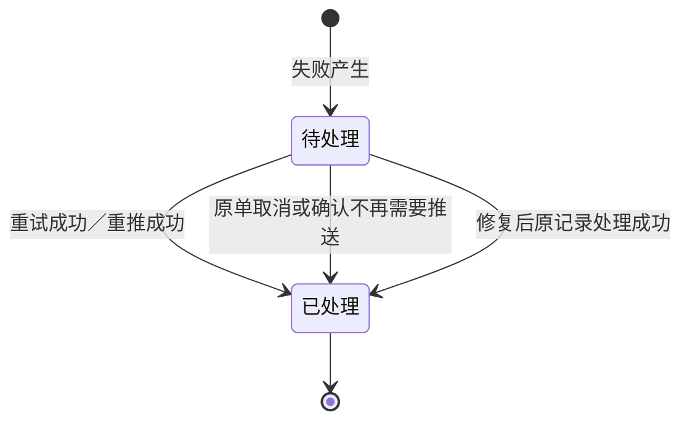

# 推送异常主PRD

> 用途：定义系统集成中心「推送异常」页的异常范围、按推送对象划分的页签、处理状态与处理记录口径、查询与跳转边界，作为研发实现和测试验收的依据。
> 定位：应用设计层文档。业务规则以[《系统集成需求分析》](../../../../../02-需求调研和分析/07-系统集成/系统集成需求分析.md)（INT-FR03、INT-FR05、INT-AC03、INT-AC04、INT-AC06、§七）和[《集成协作与人工补充》](../../../../../03-业务分析和设计/07-集成协作与人工补充.md)（§4.5、§5.1、§6.4、§七）为准；各外部链路的推送、重试与取消规则以对应模块PRD为准；推送财务ERP失败的重推见[《业财结果单据主PRD》](../业财结果单据/业财结果单据主PRD.md)；字段与取值以[《推送异常（详细稿）》](../../../字段清单合集/集成相关/推送异常/推送异常（详细稿）.tsv)为准；页面分区见[《推送异常页面骨架》](推送异常页面骨架.md)；页面交互以[《推送异常前端Demo版PRD》](前端Demo版PRD/推送异常前端Demo版PRD_列表页.md)为准。
> 不写什么：不写各业务单据的推送、自动重试、人工重试与取消规则（见采购、销售、库存各模块PRD）；不写推送财务ERP结果的查看与重推（见《业财结果单据主PRD》）；不写外部映射与基础资料维护（见基础资料各PRD）；不写接口报文、协议、重试参数与去重机制（接口设计）；不写人工确认实际结果与订单导入（入口在各业务单据页面，规则见INT-FR06）；不写系统权限矩阵与数据库设计。

| 版本 | 本次变化 | 状态 |
| --- | --- | --- |
| V0.1 | 2026-09-24：建立推送异常主PRD：页面定位与只读边界、五个推送对象页签、处理状态与处理记录、查询与去重推跳转、验收与待确认 | 初稿，待评审 |
| V0.2 | 2026-09-24：收口确认：记录全部保留、不做人工关闭、电商平台与主数据分发重试最多3次、分发范围补聚水潭与领星、结果处理修复后自动重试 | 初稿，待评审 |

## 一、文档概要

需求类型：新建模块（系统集成-推送异常）。

关联资料：

- 需求分析：[《系统集成需求分析》](../../../../../02-需求调研和分析/07-系统集成/系统集成需求分析.md)（INT-FR03、INT-FR05、INT-AC04、INT-AC06、§七）、[《结算与业财需求分析》](../../../../../02-需求调研和分析/05-结算与业财/结算与业财需求分析.md)（FIN-FR03）、[《商品与主数据需求分析》](../../../../../02-需求调研和分析/01-商品与主数据/商品与主数据需求分析.md)（MD-FR07）
- 业务设计：[《集成协作与人工补充》](../../../../../03-业务分析和设计/07-集成协作与人工补充.md)（§3.4 异常场景、§4.5 异常在哪里看、§5.1 对象清单、§5.3 谁对什么负责、§七）、[《结算与业财交接》](../../../../../03-业务分析和设计/06-结算与业财交接.md)（§三）
- 全局规则：[《4.强盛ERP全局业务规则与约束》](../../../../../01-全局背景信息/4.强盛ERP全局业务规则与约束.md)（§四 推送财务ERP失败与外部ToC异常、§五 权限与导出）、[《5.强盛ERP的单据分层设计》](../../../../../01-全局背景信息/5.强盛ERP的单据分层设计.md)（§5.4、§7.1 推送状态与重试）、[《6.强盛ERP的编码规则和通用字段规则》](../../../../../01-全局背景信息/6.强盛ERP的编码规则和通用字段规则.md)（1.3 来源系统＋来源单号、第三节 空值与展示）
- 应用设计：[《系统与模块地图》](../../../系统架构和流程/00-系统与模块地图.md)（§二 系统集成、附录 菜单结构）、[《系统流程与单据交互》](../../../系统架构和流程/01-系统流程与单据交互.md)（§9 财务交接、§10 准备链与人工补充）、[《单据与状态流转》](../../../系统架构和流程/03-单据与状态流转.md)（§三 执行指令单、§四 结果单）
- 字段清单：[《推送异常（详细稿）》](../../../字段清单合集/集成相关/推送异常/推送异常（详细稿）.tsv)
- 页面分区：[《推送异常页面骨架》](推送异常页面骨架.md)
- 页面与交互：[《推送异常前端Demo版PRD》](前端Demo版PRD/推送异常前端Demo版PRD_列表页.md)、[《推送异常前端Demo版PRD_弹窗与Mock》](前端Demo版PRD/推送异常前端Demo版PRD_弹窗与Mock.md)

页面定位：推送异常是系统集成中心集中查看外部推送失败与结果处理失败的页面。页面按推送对象分五个页签：推送财务ERP、推送外部仓库、推送电商平台、主数据分发、结果处理；每个页签展示对应的异常单据或失败记录，以及必要的处理记录。页面只读，重试与修复在各自入口办理：仓库推送重试在各业务单据页面，财务ERP重推在业财结果单据页，映射等基础数据修复在基础资料，本页不重复设置处理入口（INT-FR05；《集成协作与人工补充》§6.4）。

## 二、需求背景与范围

各业务链路把单据推给仓库、SaaS、Shopify和财务ERP，推送失败、结果处理失败如果不集中展示，业务人员不知道哪张单卡住了，技术运维也没有统一的问题清单。系统集成中心把外部推送失败和结果处理失败集中展示，并保留必要的处理记录；修复动作仍在原入口办理，中心不改业务内容（INT-FR05；《集成协作与人工补充》§4.5、§6.4）。按推送对象分页签，让不同角色按自己的链路快速定位问题：业务看仓库与平台，财务与技术运维看财务ERP，主数据维护看SKU分发，集成维护方看结果处理。

| 范围 | 说明 |
| --- | --- |
| 本期要做 | 五个推送对象页签的异常列表；按页签条件查询；处理状态与处理记录查看；财务ERP异常跳转业财结果单据重推；导出当前页签异常 |
| 本期不做 | 在本页重试推送、取消单据、修改业务信息、维护映射；人工关闭或忽略异常（见Q03）；接口报文、重试参数与去重机制；推送财务ERP结果的完整推送记录（见业财结果单据）；人工确认实际结果与订单导入（入口在各业务单据页面） |
| 适用对象 | 推送财务ERP的七类已审核结果单；推送仓库的通知单、申请单与独立站订单；回写电商平台的独立站发货结果与取消结果；分发到WMS、财务ERP的商品SKU；外部回传结果的匹配、归属与库存校验处理 |

## 三、方案总览与功能清单

异常记录在失败产生时生成，初始为「待处理」；后续自动重试、人工重试、重推或修复后原记录处理成功时，自动置为「已处理」，保留记录供查询。页面只展示，不提供处理动作：仓库推送失败在对应通知单、申请单或独立站订单页面重试；推送财务ERP失败在业财结果单据页重推（本页提供跳转）；电商平台回写与主数据分发的重试按接口方案；映射缺失、归属识别失败等先修复基础数据，再按各业务模块规则处理原记录。

### 3.1 需求追溯

| 上游场景与需求 | 本PRD功能 | 本PRD验收 |
| --- | --- | --- |
| INT-FR05：外部推送失败统一在系统集成中心展示异常单据或失败记录 | F01 | AC01 |
| INT-FR05：推送失败自动重试最多3次（参数由接口设计维护） | F01、F03 | AC03 |
| INT-FR03：财务ERP失败在系统集成中心针对原单重推；本中心集中展示 | F01（推送财务ERP页签）、F04 | AC02、AC05 |
| INT-FR04、MD-FR07：SKU分发失败不阻止内部业务，下游推单时失败进入异常处理 | F01（主数据分发页签） | AC01、AC06 |
| SAL-FR12：外部ToC匹配或库存校验失败不记账、不推财务ERP，修复后处理原记录 | F01（结果处理页签） | AC01、AC08 |
| 《集成协作与人工补充》§5.1：异常记录产生→处理→关闭，保留处理过程 | F01、F03 | AC04 |
| 《集成协作与人工补充》§6.4：集成中心是查看口，不是改单口 | F01、F04 | AC06 |
| 《4.强盛ERP全局业务规则与约束》§五：导出按导出中心 | F05 | AC07 |

### 3.2 功能清单

| 编号 | 功能/位置 | 本次内容 | 需求来源 |
| --- | --- | --- | --- |
| F01 | 推送异常列表（系统集成-推送异常） | 五个推送对象页签：推送财务ERP、推送外部仓库、推送电商平台、主数据分发、结果处理；各页签展示异常单据或失败记录 | INT-FR03、INT-FR05、INT-FR04、SAL-FR12 |
| F02 | 查询与筛选 | 处理状态、失败时间与各页签专属条件查询；处理状态默认待处理 | INT-FR05；本模块设计 |
| F03 | 处理记录查看 | 按异常记录查看处理时间、处理方式、处理结果、操作人与说明 | 《集成协作与人工补充》§5.1 |
| F04 | 原单查看与去重推 | 单据编号、结果单号可进入原单详情；财务ERP异常提供跳转业财结果单据重推 | INT-FR03；《集成协作与人工补充》§6.4 |
| F05 | 导出 | 按导出中心导出当前页签异常，范围可选全部／当前筛选／已勾选 | 《4.强盛ERP全局业务规则与约束》§五 |

## 四、功能需求说明

### 4.1 共用规则

| 规则编号 | 主题 | 规则 | 边界或例外 |
| --- | --- | --- | --- |
| R01 | 页面定位 | 本页是集中查看口，不是处理口：不提供推送重试、取消、改单、映射维护；不新建业务单；不提供人工关闭或忽略异常（Q03已定：一期不做） | INT-FR05；《集成协作与人工补充》§6.4 |
| R02 | 异常范围 | 按推送对象分五类：推送财务ERP（七类已审核结果单推送失败）、推送外部仓库（通知单、申请单与独立站订单推送仓库失败，含经SaaS中转）、推送电商平台（独立站发货结果与运单、取消结果回写失败）、主数据分发（商品SKU分发WMS、财务ERP失败）、结果处理（外部回传结果的商品匹配、归属识别、库存校验等处理失败）。不在上述范围的失败不进入本页 | INT-FR03、INT-FR05、INT-FR04；SAL-FR12；MD-FR07 |
| R03 | 页签与列表 | 页面用页内页签切换五个推送对象；每个页签独立列与筛选。切换页签后回到第一页、清空勾选，并按该页签初值重置查询（处理状态=待处理）。页签不显示数量角标 | 本模块设计（2026-09-24确认：推送异常按推送对象分页签） |
| R04 | 异常记录与处理状态 | 失败产生时生成异常记录，处理状态为待处理；推送类异常在重试成功、原单取消或确认不再需要推送时自动置为已处理；结果处理类异常在原记录处理成功后自动置为已处理。已处理记录保留并可查询，全部保留、不清理（Q02已定） | 《集成协作与人工补充》§5.1、§七；INT-FR05 |
| R05 | 处理记录 | 保留每次处理动作：处理时间、处理方式（系统自动重试、人工重试、重推、修复恢复）、处理结果（成功、失败）、操作人与说明；系统自动触发时操作人显示「系统」。推送财务ERP页签的处理记录与《业财结果单据主PRD》的推送记录同源：自动重试记「系统自动重试」，人工重推与异常运维重推记「重推」，首次推送不单独记处理记录；本页按处理记录口径展示，不重复维护。一期不做完整操作日志，异常与处理记录必须保留 | INT-FR03；《4.强盛ERP全局业务规则与约束》§五 |
| R06 | 重试与修复入口 | 仓库推送失败在对应通知单、申请单或独立站订单页面重试（本页不重复入口）；推送财务ERP失败在业财结果单据页重推（本页提供跳转）；电商平台回写与主数据分发自动重试最多3次，间隔由技术配置（Q01已定）；映射缺失、归属识别失败等先在基础资料修复，修复后由系统按接口机制自动重试处理原记录（Q06已定），技术运维只处理接口与数据问题 | INT-FR04、INT-FR05；各模块PRD；2026-09-24确认 |
| R07 | 查询与默认视图 | 查询条件之间按AND匹配；枚举多选时按OR匹配；单据编号、结果单号、来源单号、商品编码、商品名称模糊匹配；失败时间按日期范围；处理状态单选，默认「待处理」。各页签默认按失败时间降序 | INT-FR05；查询规则与默认视图为本模块设计 |
| R08 | 导出 | 导出按导出中心，范围可选全部／当前筛选／已勾选，异步任务；导出当前页签的列与筛选结果；导出为空时留空，不写入 `-` | 《4.强盛ERP全局业务规则与约束》§五 |
| R09 | 空值与异常 | 页面空值统一展示 `-`；查询无结果展示空状态，不自动补造记录；原单不存在或不可访问时提示后停留列表；异常记录与处理记录只读，不能修改 | 《6.强盛ERP的编码规则和通用字段规则》第三节；本模块定义 |
| R10 | 权限 | 查看按菜单与数据权限；跳转重推按业财结果单据的重推权限；引用COM-FR01、COM-FR02，不建权限矩阵 | 《4.强盛ERP全局业务规则与约束》§五；[《公共能力与系统管理需求分析》](../../../../../02-需求调研和分析/08-公共能力与系统管理/公共能力与系统管理需求分析.md) COM-FR01、COM-FR02 |

### 4.2 F01 推送财务ERP页签

| 内容 | 说明 |
| --- | --- |
| 使用场景 | 业务人员或集成维护方核对哪张结果单没有推给财务ERP、为什么失败、处理到哪一步；财务对账前查看待处理的推送财务ERP异常。 |
| 列表内容 | 结果单类型、结果单号（可点击进入对应模块的结果单详情）、失败时间（最近一次推送失败时间）、失败原因、处理状态；行内「处理记录」「去重推」。 |
| 查询 | 结果单类型（多选）、结果单号（模糊）、处理状态（单选，默认待处理）、失败时间（日期范围）。 |
| 功能规则 | 数据来源与《业财结果单据主PRD》同源：七类已审核结果单推送失败时生成异常记录；重推在业财结果单据页办理，重推成功后本页记录自动置为已处理；「去重推」按结果单号跳转业财结果单据并预填筛选；本页不提供重推按钮（R06）。 |
| 成功结果 | 能按结果单定位推送财务ERP异常，查看失败原因与处理记录，并一键跳到重推入口。 |
| 异常与恢复 | 查询无结果时展示空状态；重推后记录状态与失败原因随之更新；结果单不存在时跳转提示并停留。 |

### 4.3 F01 推送外部仓库页签

| 内容 | 说明 |
| --- | --- |
| 使用场景 | 业务人员查看推给仓库或SaaS的通知单、申请单、独立站订单有没有发出去，定位推送失败的记录，回到原单处理。 |
| 列表内容 | 单据类型、单据编号（可点击进入原单详情）、目标系统、失败时间、失败原因、处理状态；行内「处理记录」。 |
| 查询 | 单据类型（多选）、单据编号（模糊）、目标系统（多选）、处理状态（单选，默认待处理）、失败时间（日期范围）。 |
| 功能规则 | 单据类型覆盖：采购收货通知单、采退发货通知单、销售发货通知单、销退收货通知单、调出通知单、调入通知单、其他入库申请单、其他出库申请单、独立站订单；目标系统覆盖自营仓作业系统、聚水潭、领星、第三方仓／WMS；推送明确失败后自动重试最多3次（2026-09-24确认，含通知单、申请单与独立站订单），间隔由技术配置；仍失败保持推送失败，由业务在原单行内人工重试或按规则取消；重试成功或原单取消后本页记录自动置为已处理（R04）。 |
| 成功结果 | 能按单据定位仓库推送异常，看到目标系统与失败原因，回到原单重试或取消。 |
| 异常与恢复 | 查询无结果时展示空状态；原单不存在或不可访问时提示并停留；本页不提供重试、取消按钮。 |

### 4.4 F01 推送电商平台页签

| 内容 | 说明 |
| --- | --- |
| 使用场景 | 独立站业务人员查看回写给Shopify的发货结果与运单、取消结果有没有成功，定位失败记录。 |
| 列表内容 | 单据类型、单据编号（可点击进入独立站订单详情）、推送内容、失败时间、失败原因、处理状态；行内「处理记录」。 |
| 查询 | 单据类型（多选）、单据编号（模糊）、推送内容（多选）、处理状态（单选，默认待处理）、失败时间（日期范围）。 |
| 功能规则 | 一期推送内容为发货结果与运单、取消结果两类（2026-09-24确认），单据类型为独立站订单；退货回写等接口确认后再加；自动重试最多3次，间隔由技术配置；恢复方式随接口设计（Q01）。 |
| 成功结果 | 能定位回写Shopify失败的订单与内容，查看原因与处理记录。 |
| 异常与恢复 | 查询无结果时展示空状态；订单不存在或不可访问时提示并停留；本页不提供重新回写按钮。 |

### 4.5 F01 主数据分发页签

| 内容 | 说明 |
| --- | --- |
| 使用场景 | 主数据维护人员查看商品SKU有没有成功分发到WMS、财务ERP，定位失败记录。 |
| 列表内容 | 商品编码（可点击进入商品资料详情）、商品名称、目标系统、失败时间、失败原因、处理状态；行内「处理记录」。 |
| 查询 | 商品编码（模糊）、商品名称（模糊）、目标系统（多选）、处理状态（单选，默认待处理）、失败时间（日期范围）。 |
| 功能规则 | 一期分发对象为商品SKU，目标系统为第三方仓／WMS、金蝶云·星空、聚水潭、领星（2026-09-24确认）；分发失败不阻止内部业务继续，向下游发送单据时由失败反馈进入异常处理（INT-FR04、MD-FR07）；自动重试最多3次，间隔由技术配置；恢复方式随接口设计（Q01、Q05）。 |
| 成功结果 | 能定位未成功分发的商品与目标系统，查看原因与处理记录。 |
| 异常与恢复 | 查询无结果时展示空状态；商品不存在时提示并停留；本页不提供重新分发按钮。 |

### 4.6 F01 结果处理页签

| 内容 | 说明 |
| --- | --- |
| 使用场景 | 集成维护方查看外部回传结果没有处理成功的原因：商品匹配不上、逻辑仓归属识别不了、库存校验不通过等，先修复基础数据，再按业务模块规则处理原记录。 |
| 列表内容 | 来源系统、来源单号、异常环节、失败时间、失败原因、处理状态；行内「处理记录」。 |
| 查询 | 来源系统（多选）、来源单号（模糊）、异常环节（多选）、处理状态（单选，默认待处理）、失败时间（日期范围）。 |
| 功能规则 | 来源系统覆盖领星、聚水潭、Shopify、自营仓作业系统、第三方仓／WMS；异常环节取值：商品匹配、归属识别、库存校验、其他处理；结果处理失败时不记账、不推财务ERP，修复后由系统按接口机制自动重试处理原记录、不重复履约或记账（SAL-FR12；Q06已定）；原记录处理成功后本页记录自动置为已处理（R04）。 |
| 成功结果 | 能定位结果处理失败的原因与来源，看到处理记录；修复后原记录继续处理。 |
| 异常与恢复 | 查询无结果时展示空状态；来源单号无ERP可跳转对象时按文本展示，不提供跳转；本页不提供重试按钮。 |

### 4.7 F03 处理记录查看

| 内容 | 说明 |
| --- | --- |
| 使用场景 | 异常记录需要核实时，展开该记录的处理过程。 |
| 操作与处理 | 列表行内点「处理记录」打开弹窗，按处理时间倒序展示：处理时间、处理方式、处理结果、操作人与说明。 |
| 功能规则 | 记录随每次处理自动追加，不可编辑、删除；系统自动触发时操作人显示「系统」（R05）；记录全部保留，不清理（Q02已定）。 |
| 成功结果 | 能看到自动重试、人工重试、重推与修复恢复的过程和结果。 |
| 异常与恢复 | 无处理记录时展示空态（如失败刚产生）；记录缺失或异常时提示核实，不自动补造记录。 |

### 4.8 F04 原单查看与去重推

| 内容 | 说明 |
| --- | --- |
| 使用场景 | 从异常记录回到原单查看业务信息，或从财务ERP异常直接跳到重推入口。 |
| 操作与处理 | 结果单号、单据编号、商品编码列可点击进入对应详情（只读）；推送财务ERP页签行内「去重推」跳转「系统集成-业财结果单据」并按结果单号预填筛选。 |
| 功能规则 | 跳转只做定位，不在本页改业务信息；重推条件与操作见《业财结果单据主PRD》R04、R05；原单不存在或不可访问时提示并停留（R09）。 |
| 成功结果 | 打开对应详情，或到达业财结果单据页并已预填该结果单。 |
| 异常与恢复 | 目标页面不可用时提示后停留；跳转不改变本页查询与页签状态（返回时保留）。 |

### 4.9 F05 导出

| 内容 | 说明 |
| --- | --- |
| 使用场景 | 需要把当前页签的异常导出核对或交给技术运维。 |
| 操作与处理 | 页头「导出」打开导出向导，选择全部／当前筛选／已勾选，创建异步导出任务。 |
| 功能规则 | 导出列与当前页签列表列一致；状态按枚举文字、时间为 `YYYY-MM-DD HH:mm:ss`；空值留空，不写入 `-`（R08）。 |
| 成功结果 | 导出任务在导出中心查看和下载。 |
| 异常与恢复 | 创建任务失败时提示重试；导出数据以任务执行时的异常记录为准。 |

### 4.10 状态与动作

**异常记录处理状态**

| 动作 | 待处理 | 已处理 |
| --- | --- | --- |
| 查看处理记录（F03） | ✅ | ✅ |
| 查看原单（F04） | ✅ | ✅ |
| 去重推（F04，仅推送财务ERP页签） | ✅ | ❌（异常已处理） |

处理状态由系统随处理结果自动变化，本页不提供人工改状态或关闭动作（R04；人工关闭已定：一期不做）。重试与修复入口见R06，各页签动作差异见4.2～4.6。

查看与跳转按RBAC处理：具备菜单与对应按钮权限的角色即可操作，按钮按权限展示，页面不描述角色与数据范围（R10）。

## 五、上下游影响与协同

| 关联模块/系统 | 需要配合的变化 | 交接内容与时机 | 负责方 | 验收结果 |
| --- | --- | --- | --- | --- |
| 采购、销售与履约、库存与仓储 | 推送失败与重试在原单办理；失败与处理结果写入异常记录 | 单据类型、编号、目标系统、失败时间与原因 | 各业务模块 | AC01、AC03 |
| 结算与业财 | 推送财务ERP失败与重推口径 | 结果单类型、单号、失败原因与处理记录 | 业财 | AC02、AC05 |
| 商品与主数据 | 提供商品、仓库映射等基础数据；映射在基础资料维护 | 分发失败记录与映射修复 | 主数据维护方 | AC01、AC06 |
| Shopify与SaaS | 回写发货结果与取消结果、推送通知；失败原因与重试能力待核验 | 失败记录与处理记录 | 集成维护方 | AC01、AC04 |
| 财务ERP | 接收结果单并返回成功／失败 | 接口能力与失败原因范围待核验（Q01） | 财务、技术运维 | AC02 |
| 导出中心 | 提供异步导出任务与下载 | 导出当前页签筛选结果 | 公共能力 | AC07 |

## 六、验收标准与待确认事项

### 6.1 验收标准

| 编号 | 对应功能/规则 | 条件与操作 | 预期结果 |
| --- | --- | --- | --- |
| AC01 | F01/R02、R03 | 分别模拟五个推送对象的失败 | 对应页签出现异常记录；切换页签回到第一页并清空勾选；不相关失败不进入本页（INT-AC06） |
| AC02 | F01/R04 | 七类结果单分别推送失败 | 推送财务ERP页签按结果单展示类型、单号、失败时间、失败原因与处理状态；与业财结果单据同源（INT-AC03） |
| AC03 | F01/R04、R06 | 通知单、申请单推送失败后自动重试3次仍失败；在原单人工重试成功 | 自动重试与人工重试记入处理记录；重试成功后异常记录自动置为已处理，默认待处理视图不再展示（INT-FR05） |
| AC04 | F03/R05 | 对同一异常连续发生自动重试、人工重试、修复恢复 | 处理记录按时间倒序逐条展示，区分处理方式与处理结果，操作人分别为「系统」与账号姓名 |
| AC05 | F04/R06 | 在推送财务ERP页签点「去重推」 | 跳转业财结果单据并按结果单号预填筛选；重推成功后返回本页，该记录为已处理 |
| AC06 | F01/R01 | 尝试在本页重试推送、取消单据或修改业务信息 | 无重试、取消、编辑入口；仓库推送重试在原单页面，财务ERP重推在业财结果单据；本页只读（《集成协作与人工补充》§6.4） |
| AC07 | F05/R08 | 任一页签非空，点页头导出并选择范围 | 按导出中心创建异步导出任务，可选全部／当前筛选／已勾选；导出列与当前页签列表列一致 |
| AC08 | F01/R04、R06 | 模拟外部ToC结果商品匹配失败 | 结果处理页签出现记录，失败时不记账、不推财务ERP；补齐映射后处理原记录成功，记录自动置为已处理（SAL-AC19） |
| AC09 | F04/R09 | 点击结果单号、单据编号、商品编码；另模拟原单不存在或不可访问 | 进入对应详情（只读）；不可访问时提示并停留列表；结果处理页签的来源单号无ERP可跳转对象时不提供链接 |

### 6.2 待确认事项

| 编号 | 问题 | 影响范围 | 确认人 | 最迟确认时间 | 状态/结论 |
| --- | --- | --- | --- | --- | --- |
| Q01 | 各外部系统推送失败的自动重试规则：仓库推送已定最多3次；电商平台回写、主数据分发的重试与恢复方式 | 处理记录内容与处理状态变化 | — | — | 已定（2026-09-24）：电商平台回写、主数据分发自动重试最多3次，间隔由技术配置；恢复方式随接口设计 |
| Q02 | 异常记录与处理记录的保留时长与清理策略 | 历史异常可查范围 | — | — | 已定（2026-09-24）：全部保留，不清理；页面不提供清理入口 |
| Q03 | 是否需要人工关闭或忽略异常，以及对应权限 | 处理状态枚举与行内动作 | — | — | 已定（2026-09-24）：一期不做人工关闭；只按重试成功、原单取消、原记录处理成功自动置为已处理 |
| Q04 | 电商平台回写的推送内容范围（是否含退货等其他回写） | 推送内容枚举与记录范围 | — | — | 已定（2026-09-24）：一期为发货结果与运单、取消结果两类；退货回写等接口确认后再加 |
| Q05 | 主数据分发范围与失败恢复方式 | 页签列范围与处理记录 | — | — | 已定（2026-09-24）：一期商品SKU分发到第三方仓／WMS、金蝶云·星空、聚水潭、领星；自动重试最多3次，恢复方式随接口设计 |
| Q06 | 结果处理异常的恢复动作由谁触发、在哪操作、如何留痕 | 处理记录与处理状态变化 | — | — | 已定（2026-09-24）：修复映射等基础数据后，由系统按接口机制自动重试处理原记录；技术运维只处理接口与数据问题；本页保持只读，记录随处理自动保留 |

## 七、上线准备

| 阶段 | 准备事项 | 负责方 | 前置依赖 | 完成标准 |
| --- | --- | --- | --- | --- |
| 上线前 | 确认各外部系统的失败反馈与重试能力 | 集成维护方、技术运维 | 接口设计完成（Q01） | 能区分推送成功与失败并记录原因 |
| 上线前 | 确认异常记录与处理记录的生成与保留方式 | 技术 | 接口设计完成（Q02） | 失败产生即生成记录，处理后保留可查 |
| 上线前 | 确认映射等基础数据的维护入口 | 主数据维护方 | 基础资料各PRD（2026-09-24确认在基础资料维护） | 修复后能处理原记录并使异常记录置为已处理 |
