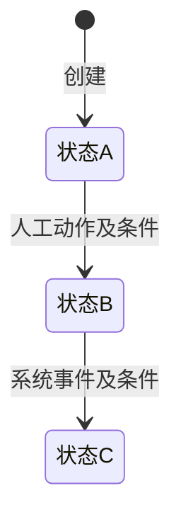

# 状态机设计模板-V1

> 版本：V1

用于主PRD中的状态与动作说明，不默认增加独立交付文档。已有权威状态设计时引用原文，避免重复维护。

- 简单启停：状态说明和操作表即可。
- 多状态流转：增加流转图，流转表写清条件和结果。
- 动作多且限制复杂：增加动作矩阵。
- 易混淆的操作：按需增加对比说明。

示例只说明表达方式，状态名称、动作和流转均按实际业务填写。

## 状态定义

| 状态 | 含义 | 进入条件 | 是否终态 |
| --- | --- | --- | --- |
| [状态名称] | [所处业务阶段] | [动作或事件] | [是/否] |

状态取值与字段清单TSV一致；不同状态维度分别说明。

## 流转图（按需）

以下为占位示例，按真实流程替换。自动事件与人工操作都应标明。

## 流转与操作表

| 当前状态 | 动作/事件 | 前置条件 | 结果状态 | 其他业务影响 | 失败处理 |
| --- | --- | --- | --- | --- | --- |
| [状态] | [人工操作/自动事件] | [具体条件] | [状态或不变] | [记录、数量、上下游等变化] | [失败结果及恢复方式] |

动作不改变状态时也可记录。弹窗、按钮和完整反馈文案在Demo PRD中说明。

## 动作矩阵（按需）

| 动作 | [状态A] | [状态B] | [状态C] |
| --- | --- | --- | --- |
| [动作] | 允许 | 不允许 | 满足[规则编号]时允许 |

本表帮助快速查阅，不重复流转表的详细条件。页面入口的显示方式由Demo PRD说明。

## 易混淆操作对比（按需）

| 比较项 | [操作A] | [操作B] |
| --- | --- | --- |
| 业务含义 | [说明] | [说明] |
| 适用条件 | [条件] | [条件] |
| 状态及数量影响 | [结果] | [结果] |
| 对已有记录及后续处理的影响 | [结果] | [结果] |

## 检查要点

- 状态名和含义清楚，与TSV和主PRD一致。
- 图与表覆盖相同流转，条件和成功、失败结果可判断。
- 正常、退回、取消、关闭等路径按实际业务覆盖，不强制增加动作。
- 不同状态维度及自动事件的影响已说明。
